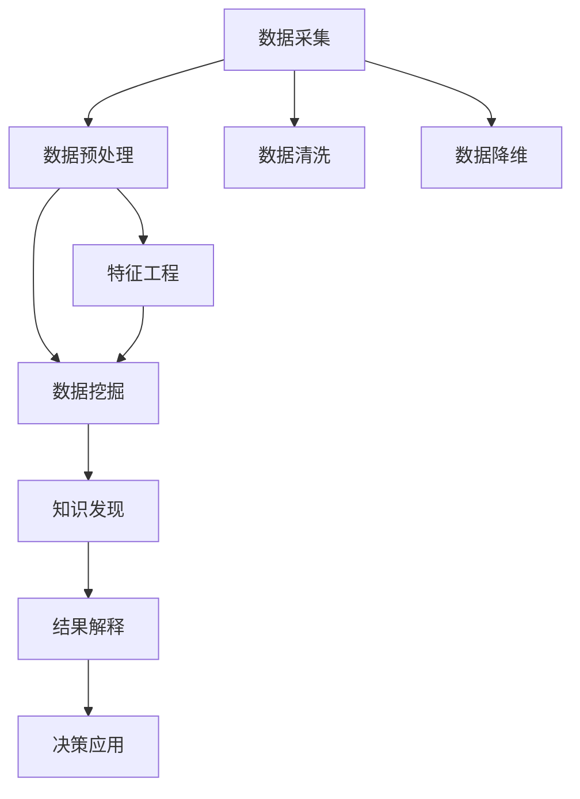

                 

# 知识发现引擎：人工智能时代的智慧革命

> 关键词：知识发现, 数据挖掘, 人工智能, 数据科学, 智慧决策

## 1. 背景介绍

### 1.1 问题由来
在21世纪这个数据爆炸的时代，信息量呈指数级增长，人类已经难以通过传统方式从海量数据中提取有用信息。如何在纷繁复杂的数据中发现隐藏的知识，辅助人类决策，提高工作效率，是一个亟待解决的难题。

知识发现(Knowledge Discovery, KDD)是指从数据中挖掘有用知识，构建起支持决策的智能系统。它是人工智能、数据科学和信息工程等领域交叉融合的产物，有着广阔的应用前景。

### 1.2 问题核心关键点
知识发现的关键在于高效、准确地从海量数据中提取出有价值的模式、趋势和关系，辅助人类做出科学决策。主要包括以下几个关键点：

- 数据采集与预处理：确保数据的质量和完整性，去除噪声和冗余。
- 数据挖掘算法：选择合适的算法模型，从数据中提取有用的知识和模式。
- 结果解释与应用：将挖掘出的知识转化为易于理解的图表、报告等形式，并应用于实际决策过程中。
- 系统集成与部署：构建起集数据采集、处理、挖掘、可视化和决策于一体的知识发现系统，实现自动化和智能化。

### 1.3 问题研究意义
研究知识发现方法，对于提升决策支持系统的智能水平，推动人工智能技术在各行各业的应用，具有重要意义：

1. 提高决策效率。通过自动化的知识发现系统，可以快速准确地从数据中提取关键信息，辅助决策者做出合理决策。
2. 减少决策偏差。通过系统化的方法论，避免了人为偏见和主观判断的干扰，提升决策的科学性。
3. 增强决策精度。从大数据中发现规律和趋势，可以预见未来可能出现的情况，提高决策的准确度。
4. 降低决策成本。自动化知识发现系统可以处理大规模数据，降低人工分析和评估的成本。
5. 促进技术创新。知识发现技术的进步，催生了新的数据分析方法和工具，为技术革新提供了新的动力。

## 2. 核心概念与联系

### 2.1 核心概念概述

为更好地理解知识发现的核心原理和应用框架，本节将介绍几个紧密相关的核心概念：

- 知识发现(Knowledge Discovery, KDD)：从大量数据中提取有价值模式和知识的过程。通过数据挖掘、统计分析和机器学习等方法，揭示数据背后的规律和趋势。
- 数据挖掘(Data Mining)：通过算法从数据集中发现有用模式的科学，是知识发现的核心技术之一。
- 数据预处理(Data Preprocessing)：在数据挖掘之前，对原始数据进行清洗、归一化、降维等处理，提升数据质量。
- 特征工程(Feature Engineering)：选择、构造和优化特征向量，以便于算法更好地进行模式识别和预测。
- 机器学习(Machine Learning)：通过数据集训练模型，并应用于新数据中进行预测或分类。
- 数据可视化(Data Visualization)：将数据挖掘结果以图表、图形等形式展现，提升决策者和分析者的理解度。

这些核心概念之间的逻辑关系可以通过以下Mermaid流程图来展示：



这个流程图展示了数据采集、预处理、挖掘、知识发现、结果解释和决策应用的完整流程，以及特征工程和数据可视化的作用。

## 3. 核心算法原理 & 具体操作步骤
### 3.1 算法原理概述

知识发现的算法原理主要包括数据挖掘、统计分析和机器学习等方法，通过算法从数据中提取有用模式和知识。常用的数据挖掘算法包括关联规则学习、聚类分析、分类和回归等。这些算法通过不同的模型和技术，从数据中发现隐含的规律和关系，构建起支持决策的智能系统。

### 3.2 算法步骤详解

知识发现的主要步骤包括数据采集与预处理、特征工程、模型训练和结果解释与应用。

**Step 1: 数据采集与预处理**
- 选择合适的数据源，确保数据的质量和完整性。
- 对数据进行清洗，去除噪声、缺失值和异常值。
- 进行归一化、降维等处理，提升数据质量。

**Step 2: 特征工程**
- 选择和构造特征向量，优化模型输入。
- 进行特征选择和降维，去除冗余特征。
- 构造新的特征组合，提升模型性能。

**Step 3: 模型训练**
- 选择合适的机器学习算法，如决策树、神经网络、支持向量机等。
- 使用训练集进行模型训练，优化模型参数。
- 使用验证集进行模型调优，选择最优模型。

**Step 4: 结果解释与应用**
- 将挖掘出的知识转化为易于理解的图表、报告等形式。
- 对挖掘结果进行可视化展示，辅助决策者理解。
- 将知识应用于实际决策过程，提升决策效果。

### 3.3 算法优缺点

知识发现算法具有以下优点：

- 自动化程度高。算法能够自动从数据中发现模式和规律，减少人工干预。
- 适用范围广。适用于各种类型的数据和问题，能够灵活适应不同的场景。
- 效果显著。通过算法发现的知识往往具有高度的普适性和通用性，能够显著提升决策效率和准确度。

同时，这些算法也存在一些局限性：

- 数据依赖性强。算法的效果很大程度上取决于数据的质量和特征。
- 模型复杂度高。复杂的模型需要大量的计算资源和时间，难以快速迭代。
- 结果解释性不足。算法挖掘出的知识往往是黑盒形式，难以进行解释和调试。
- 易受过拟合影响。大数据环境下，算法容易陷入过拟合，导致泛化性能下降。

尽管存在这些局限性，但就目前而言，知识发现技术仍然是数据驱动决策的关键技术，其应用范围和效果仍广受认可。

### 3.4 算法应用领域

知识发现技术在各个领域都有广泛应用，例如：

- 金融风险管理：通过数据挖掘技术，发现金融市场的潜在风险和趋势，辅助投资者决策。
- 医疗诊断：通过医学影像和病历数据，挖掘出疾病的早期征兆和规律，辅助医生诊断。
- 市场营销：通过客户行为数据，挖掘出消费者偏好和购买模式，优化市场营销策略。
- 智能制造：通过设备运行数据，挖掘出生产过程中的异常和规律，提升生产效率。
- 安全监控：通过视频监控数据，挖掘出异常行为和事件，提高安全防护能力。

除了上述这些经典领域外，知识发现技术还被创新性地应用于更多场景中，如智能交通、智慧城市、社交网络分析等，为各行各业带来了深刻的变革。

## 4. 数学模型和公式 & 详细讲解 & 举例说明

### 4.1 数学模型构建

本节将使用数学语言对知识发现的核心算法进行更加严格的刻画。

记数据集为 $D=\{(x_i, y_i)\}_{i=1}^N$，其中 $x_i$ 为特征向量， $y_i$ 为标签。假设算法模型为 $M_{\theta}(x)$，其中 $\theta$ 为模型参数。

定义模型 $M_{\theta}$ 在数据样本 $(x,y)$ 上的损失函数为 $\ell(M_{\theta}(x),y)$，则在数据集 $D$ 上的经验风险为：

$$
\mathcal{L}(\theta) = \frac{1}{N} \sum_{i=1}^N \ell(M_{\theta}(x_i),y_i)
$$

通过梯度下降等优化算法，模型不断更新参数 $\theta$，最小化损失函数 $\mathcal{L}$，直到收敛。

### 4.2 公式推导过程

以决策树为例，介绍其构建和训练过程。

决策树是一种基于树结构的分类和回归算法，通过递归地选择最优特征进行分割，构建起一个树形结构。其目标是最小化节点上的信息增益或信息熵。

假设有 $n$ 个特征 $f_1, f_2, \cdots, f_n$，每个特征的取值分别为 $f_j=v_{j1}, v_{j2}, \cdots, v_{jq}$。设特征 $f_j$ 在样本 $x$ 上的取值为 $v_{js}$，则信息熵定义为：

$$
H(D) = -\sum_{s=1}^q \sum_{t=1}^N \frac{y_t}{N} \log \frac{y_t}{N}
$$

信息增益定义为：

$$
Gain(f_j, D) = H(D) - \sum_{s=1}^q H(D_{js})
$$

其中 $D_{js}$ 为特征 $f_j=v_{js}$ 在样本集 $D$ 上的子集。决策树的构建过程为：

1. 选择最优特征 $f_j$ 作为根节点。
2. 对每个特征 $f_j$ 的取值 $v_{js}$，递归构建子树。
3. 重复上述过程，直到满足终止条件。

在得到决策树后，通过测试集进行模型评估，选择最优参数 $\theta$ 进行训练。

### 4.3 案例分析与讲解

以客户流失预测为例，介绍如何使用决策树进行客户流失预测。

假设数据集包含客户的基本信息、购买历史和流失行为，特征向量为 $x=(x_1, x_2, \cdots, x_n)$，标签为 $y \in \{0, 1\}$，其中 $0$ 表示客户未流失，$1$ 表示客户流失。

首先，对数据进行清洗和归一化处理，然后构造特征向量 $x_i$。使用决策树算法对数据进行训练，得到模型 $M_{\theta}$。通过测试集进行模型评估，选择最优参数 $\theta$ 进行训练。

最后，对新客户数据进行预测，使用模型 $M_{\theta}$ 输出流失概率，辅助企业制定客户挽留策略。

## 5. 项目实践：代码实例和详细解释说明
### 5.1 开发环境搭建

在进行知识发现系统开发前，我们需要准备好开发环境。以下是使用Python进行Scikit-Learn开发的环境配置流程：

1. 安装Anaconda：从官网下载并安装Anaconda，用于创建独立的Python环境。

2. 创建并激活虚拟环境：
```bash
conda create -n sklearn-env python=3.8 
conda activate sklearn-env
```

3. 安装Scikit-Learn：
```bash
conda install scikit-learn
```

4. 安装各类工具包：
```bash
pip install numpy pandas scikit-learn matplotlib tqdm jupyter notebook ipython
```

完成上述步骤后，即可在`sklearn-env`环境中开始知识发现系统的开发。

### 5.2 源代码详细实现

下面以客户流失预测为例，给出使用Scikit-Learn进行决策树模型训练的Python代码实现。

首先，准备数据集：

```python
import pandas as pd
from sklearn.model_selection import train_test_split

# 读取数据集
data = pd.read_csv('customer_churn.csv')

# 数据清洗和预处理
data.fillna(method='ffill', inplace=True)
data.drop(['customer_id'], axis=1, inplace=True)

# 数据划分
X = data.drop(['churn'], axis=1)
y = data['churn']
X_train, X_test, y_train, y_test = train_test_split(X, y, test_size=0.2, random_state=42)
```

然后，定义模型并训练：

```python
from sklearn.tree import DecisionTreeClassifier
from sklearn.metrics import classification_report, confusion_matrix

# 定义模型
model = DecisionTreeClassifier()

# 训练模型
model.fit(X_train, y_train)

# 评估模型
y_pred = model.predict(X_test)
print(classification_report(y_test, y_pred))
print(confusion_matrix(y_test, y_pred))
```

最后，使用模型进行预测并输出结果：

```python
# 使用模型进行预测
new_customer = {'age': 45, 'tenure': 8, 'gender': 'M', 'income': 60000, 'partner': 'Y', 'education': 'BS', 'married': 'Y', 'children': 0, 'purchases': 80, 'previous': 4, 'default': 0, 'outcome': 0, 'balance': 60, 'housing': 120, 'loan': 3, 'contact': 6, 'day': 23, 'month': 9, 'pdays': 3, 'previous_purchases': 6, 'campaign': 3, 'monthly_charges': 1500}
prediction = model.predict([[new_customer[f] for f in X.columns]])

print(prediction)
```

以上就是使用Scikit-Learn进行决策树模型训练和预测的完整代码实现。可以看到，Scikit-Learn提供了便捷的API，使得模型训练和预测变得简单高效。

### 5.3 代码解读与分析

让我们再详细解读一下关键代码的实现细节：

**数据处理**：
- `fillna`方法用于填充缺失值，`drop`方法用于删除不必要的特征。
- `train_test_split`方法用于划分训练集和测试集。

**模型训练**：
- `DecisionTreeClassifier`定义了决策树模型。
- `fit`方法用于训练模型，`predict`方法用于模型预测。

**结果评估**：
- `classification_report`方法用于评估模型性能，输出精度、召回率和F1分数。
- `confusion_matrix`方法用于生成混淆矩阵，展示分类效果。

**预测应用**：
- 将新客户特征通过模型进行预测，输出预测结果。

可以看出，Scikit-Learn提供了简单易用的API，使得模型训练和预测变得非常便捷。开发者可以专注于业务逻辑的实现，而不必过多关注模型细节。

## 6. 实际应用场景
### 6.1 智慧医疗

知识发现技术在智慧医疗领域有着广泛应用。通过挖掘医疗数据，可以发现疾病的发展趋势、患者的风险因素、治疗效果等关键信息，辅助医生做出科学决策。

具体而言，可以收集患者的基本信息、病历记录、检测结果等数据，使用知识发现算法挖掘出潜在的疾病模式和预测模型。在临床应用中，系统可以根据患者的实时数据进行风险评估，推荐合适的治疗方案，从而提升医疗服务质量。

### 6.2 金融风险管理

金融行业面临的风险种类繁多，知识发现技术可以帮助金融机构识别风险源，预测市场变化趋势，制定应对策略。

具体而言，可以收集金融市场的历史数据、交易记录、新闻报道等，使用知识发现算法挖掘出市场风险信号和预测模型。在实时应用中，系统可以实时监控市场动态，预警可能出现的风险事件，帮助投资者规避损失。

### 6.3 智能制造

在智能制造领域，知识发现技术可以用于优化生产流程、提升生产效率和产品质量。通过挖掘生产数据，可以发现设备故障、生产瓶颈等关键问题，辅助管理人员做出决策。

具体而言，可以收集设备的运行数据、生产计划、物料库存等数据，使用知识发现算法挖掘出生产过程的异常和规律。在实际应用中，系统可以根据异常数据预警设备故障，优化生产计划，提升生产效率。

### 6.4 未来应用展望

随着知识发现技术的不断进步，未来的应用前景将更加广阔：

1. 跨领域知识融合。未来的知识发现系统将能够融合不同领域的数据和知识，构建起跨领域的知识图谱，支持更复杂的决策需求。
2. 实时知识更新。未来的知识发现系统将能够实时更新知识库，适应数据分布的变化，保持系统的时效性和准确性。
3. 自适应学习。未来的知识发现系统将具备自学习的能力，能够自主地从新数据中学习新知识，无需人工干预。
4. 多模态知识挖掘。未来的知识发现系统将能够处理多模态数据，如文本、图像、语音等，提升系统的感知能力和应用范围。
5. 可解释性提升。未来的知识发现系统将具备更强的可解释性，能够清晰地解释模型的决策过程，增强系统的可信度和透明度。

总之，未来的知识发现技术将更加智能化、自动化和多样化，为各行各业带来更加高效、科学和可靠的决策支持。

## 7. 工具和资源推荐
### 7.1 学习资源推荐

为了帮助开发者系统掌握知识发现技术的理论基础和实践技巧，这里推荐一些优质的学习资源：

1. 《知识发现原理与实践》书籍：系统介绍了知识发现的基本概念、方法和应用，适合初学者和进阶开发者。
2. KDD Cup竞赛：KDD是知识发现领域的顶级竞赛，通过竞赛数据和挑战任务，培养了大量的数据分析和挖掘人才。
3. Coursera《数据挖掘与统计学习》课程：由斯坦福大学开设的知名课程，涵盖数据挖掘和统计学习的核心知识，适合系统学习。
4. Scikit-Learn官方文档：Scikit-Learn提供了丰富的机器学习算法和数据预处理工具，是学习知识发现的必备资源。
5. Kaggle平台：Kaggle提供了大量的公开数据集和竞赛任务，通过实战练习，提升数据分析和挖掘能力。

通过对这些资源的学习实践，相信你一定能够快速掌握知识发现技术的精髓，并用于解决实际的业务问题。

### 7.2 开发工具推荐

高效的开发离不开优秀的工具支持。以下是几款用于知识发现开发的常用工具：

1. Python：数据科学领域的主流编程语言，拥有丰富的第三方库和框架，支持高效的计算和数据处理。
2. Scikit-Learn：Python数据科学库，提供了丰富的机器学习算法和工具，支持模型训练和评估。
3. Jupyter Notebook：交互式编程环境，支持多种编程语言和数据可视化，方便快速迭代和调试。
4. TensorBoard：TensorFlow配套的可视化工具，可实时监测模型训练状态，提供详细的图表展示。
5. Weights & Biases：模型训练的实验跟踪工具，记录和可视化模型训练过程，便于对比和调优。

合理利用这些工具，可以显著提升知识发现任务的开发效率，加快创新迭代的步伐。

### 7.3 相关论文推荐

知识发现技术的进步离不开学界的持续研究。以下是几篇奠基性的相关论文，推荐阅读：

1. "An Introduction to Statistical Learning"：统计学习领域的经典教材，涵盖机器学习、数据预处理、特征工程等内容。
2. "Pattern Recognition and Machine Learning"：机器学习领域的权威教材，详细介绍了各种经典算法和技术。
3. "Knowledge Discovery in Databases: Concepts and Techniques"：KDD领域的主要教材，介绍了知识发现的理论基础和应用实践。
4. "The Elements of Statistical Learning"：统计学习领域的重要教材，详细介绍了各种统计方法和技术。
5. "Data Mining: Concepts and Techniques"：数据挖掘领域的主要教材，介绍了数据预处理、特征工程、模型训练等内容。

这些论文代表了大数据领域的技术发展脉络，通过学习这些前沿成果，可以帮助研究者把握学科前进方向，激发更多的创新灵感。

## 8. 总结：未来发展趋势与挑战
### 8.1 总结

本文对知识发现技术进行了全面系统的介绍。首先阐述了知识发现的背景和意义，明确了知识发现技术在智能决策支持系统中的独特价值。其次，从原理到实践，详细讲解了知识发现的核心算法和操作步骤，给出了知识发现任务开发的完整代码实例。同时，本文还广泛探讨了知识发现技术在智慧医疗、金融风险管理、智能制造等多个领域的应用前景，展示了知识发现技术的广阔前景。最后，本文精选了知识发现技术的各类学习资源，力求为读者提供全方位的技术指引。

通过本文的系统梳理，可以看到，知识发现技术在数据驱动决策中扮演着重要的角色，极大地提升了决策的科学性和自动化程度。未来，伴随大数据技术的进一步发展，知识发现技术将更加智能化、自动化和多样化，为各行各业带来更加高效、科学和可靠的决策支持。

### 8.2 未来发展趋势

展望未来，知识发现技术将呈现以下几个发展趋势：

1. 自动化和智能化水平提升。未来的知识发现系统将具备更强的自动化和智能化能力，能够自动从数据中发现规律和趋势，辅助决策者做出科学决策。
2. 跨领域知识融合。未来的知识发现系统将能够融合不同领域的数据和知识，构建起跨领域的知识图谱，支持更复杂的决策需求。
3. 实时知识更新。未来的知识发现系统将能够实时更新知识库，适应数据分布的变化，保持系统的时效性和准确性。
4. 多模态知识挖掘。未来的知识发现系统将能够处理多模态数据，如文本、图像、语音等，提升系统的感知能力和应用范围。
5. 可解释性提升。未来的知识发现系统将具备更强的可解释性，能够清晰地解释模型的决策过程，增强系统的可信度和透明度。

以上趋势凸显了知识发现技术的广阔前景。这些方向的探索发展，必将进一步提升知识发现系统的性能和应用范围，为各行各业带来更高效的决策支持。

### 8.3 面临的挑战

尽管知识发现技术已经取得了显著进展，但在迈向更加智能化、普适化应用的过程中，它仍面临着诸多挑战：

1. 数据质量问题。知识发现的效果很大程度上取决于数据的质量，数据不完整、不平衡、有噪声等问题可能导致模型失效。
2. 算法复杂度高。复杂的知识发现算法需要大量的计算资源和时间，难以快速迭代。
3. 结果解释性不足。算法挖掘出的知识往往是黑盒形式，难以进行解释和调试。
4. 易受过拟合影响。大数据环境下，算法容易陷入过拟合，导致泛化性能下降。
5. 模型鲁棒性不足。知识发现模型面临域外数据的泛化性问题，一旦数据分布发生变化，模型性能可能会显著下降。

尽管存在这些挑战，但未来的知识发现技术仍有很大的发展空间，通过不断的技术创新和应用优化，这些问题将逐步得到解决。

### 8.4 研究展望

面向未来，知识发现技术的研究方向将包括以下几个方面：

1. 探索更高效的算法。开发更加高效的知识发现算法，减少计算资源和时间消耗，提升系统响应速度。
2. 引入更多先验知识。将符号化的先验知识，如知识图谱、逻辑规则等，与神经网络模型进行巧妙融合，引导知识发现过程学习更准确、合理的知识。
3. 研究参数高效算法。开发更加参数高效的算法，在固定大部分模型参数的情况下，只更新极少量的任务相关参数，提升模型泛化性能。
4. 融合因果和对比学习范式。通过引入因果推断和对比学习思想，增强知识发现模型建立稳定因果关系的能力，学习更加普适、鲁棒的知识。
5. 研究知识融合技术。探索如何将不同领域、不同模态的知识进行有效融合，构建起更全面、准确的知识图谱。
6. 研究知识可视化技术。开发更有效的知识可视化工具，提升知识发现结果的理解度和可解释性。

这些研究方向将引领知识发现技术迈向更高的台阶，为各行各业带来更加高效、科学和可靠的决策支持。总之，知识发现技术需要从数据、算法、应用等多个维度进行全面优化，才能真正实现其价值。

## 9. 附录：常见问题与解答
**Q1: 知识发现和数据挖掘有什么区别？**

A: 知识发现和数据挖掘虽然有相似之处，但两者侧重点不同。数据挖掘侧重于从数据中挖掘出有趣的模式和规律，而知识发现则更侧重于从数据中提取有价值的知识和智慧，用于辅助决策。知识发现涵盖了数据挖掘、统计分析、机器学习等更多技术，更注重结果的解释和应用。

**Q2: 知识发现的主要应用场景有哪些？**

A: 知识发现技术广泛应用于各个领域，如医疗、金融、市场营销、智能制造等。在医疗领域，知识发现可以用于辅助诊断、治疗方案优化等；在金融领域，可以用于风险管理、投资策略优化等；在市场营销领域，可以用于客户行为分析、个性化推荐等；在智能制造领域，可以用于设备故障预测、生产流程优化等。

**Q3: 知识发现算法的优缺点是什么？**

A: 知识发现算法具有以下优点：自动化程度高，适用范围广，效果显著。但其也存在数据依赖性强、算法复杂度高、结果解释性不足、易受过拟合影响等缺点。

**Q4: 知识发现技术的发展趋势是什么？**

A: 知识发现技术的发展趋势包括自动化和智能化水平提升、跨领域知识融合、实时知识更新、多模态知识挖掘、可解释性提升等。这些趋势将推动知识发现技术向更加高效、科学和可靠的方向发展。

**Q5: 知识发现系统如何评估模型性能？**

A: 知识发现系统的模型评估可以从多个角度进行，如准确率、召回率、F1分数、ROC曲线、混淆矩阵等。通过评估模型在训练集、验证集和测试集上的表现，选择最优模型。同时，通过可视化工具，如TensorBoard、Weights & Biases等，实时监测模型训练过程，辅助调试和优化。

通过本文的系统梳理，可以看到，知识发现技术在数据驱动决策中扮演着重要的角色，极大地提升了决策的科学性和自动化程度。未来，伴随大数据技术的进一步发展，知识发现技术将更加智能化、自动化和多样化，为各行各业带来更加高效、科学和可靠的决策支持。

作者：禅与计算机程序设计艺术 / Zen and the Art of Computer Programming

