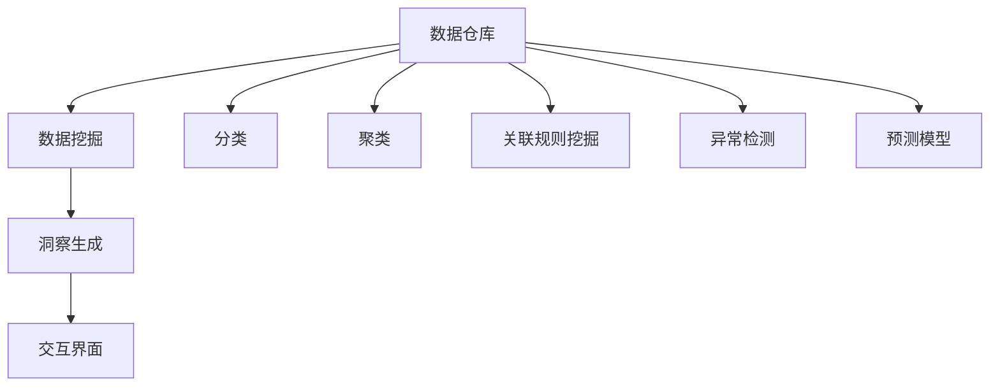

                 

## 1. 背景介绍

在数字化转型和数据驱动的商业环境中，企业面临的数据量呈指数级增长。从客户行为数据、市场趋势数据到供应链和财务数据，每个角落都充斥着大量的信息。如何从海量的数据中提取有价值的知识，形成洞察，支持企业战略决策，成为提升竞争力的关键。知识发现引擎(Knowledge Discovery Engine, KDE)应运而生，作为企业的战略伙伴，帮助企业从数据中提炼出有意义的信息，驱动业务创新和发展。

### 1.1 问题由来

尽管大数据技术已经在各行各业广泛应用，但由于数据量庞大、结构复杂、分析难度高，企业在实际决策过程中仍然存在诸多痛点：

- **信息过载**：面对大量无序数据，企业难以从中提取出关键的洞察信息，导致决策效率低下。
- **数据孤岛**：数据分散在不同的业务系统，导致数据融合和共享困难，无法形成统一的视图。
- **质量问题**：数据质量参差不齐，存在缺失、错误和重复记录等问题，影响了分析结果的可靠性。
- **分析工具不足**：传统的数据分析工具功能有限，难以满足复杂分析需求。

知识发现引擎通过整合多种数据源，利用先进的算法和模型，自动化地发现数据中的模式和知识，为企业的决策提供科学依据。

### 1.2 问题核心关键点

知识发现引擎的核心在于：

1. **数据整合**：收集、清洗和融合来自不同业务系统、不同格式的数据，形成一个统一的数据仓库。
2. **模型选择**：选择适合的算法和模型，如分类、聚类、关联规则挖掘等，提取数据中的有价值信息。
3. **洞察生成**：基于模型分析结果，形成对业务情况的深刻理解，产生可操作的洞见。
4. **交互界面**：构建用户友好的界面，使得企业决策者能够直观地理解和应用洞察结果。

知识发现引擎能够自动化地进行数据清洗、特征工程和模型训练，大大降低了数据挖掘的复杂度，使得企业能够更加便捷地从数据中提取知识，支持业务决策。

### 1.3 问题研究意义

知识发现引擎的研究与应用，对企业决策具有重要意义：

1. **提升决策质量**：利用先进算法和模型，从数据中提取出更准确、更可靠的洞察信息，为决策提供科学依据。
2. **驱动业务创新**：基于深入洞察，企业能够及时调整战略，优化产品和服务，提升市场竞争力。
3. **降低成本和风险**：通过预测分析，企业能够提前识别风险，优化资源配置，减少损失。
4. **加速业务数字化**：知识发现引擎成为企业数字化转型的重要工具，帮助企业更高效地利用数据资源。
5. **助力战略规划**：基于长期趋势和市场动态，知识发现引擎能够辅助企业制定长期战略规划，实现可持续发展。

知识发现引擎的广泛应用，将深刻影响企业的运营方式和管理模式，推动企业向更智能、更高效的方向发展。

## 2. 核心概念与联系

### 2.1 核心概念概述

知识发现引擎是一个复杂的系统，涉及数据预处理、模型选择、算法优化等多个环节。以下是其核心概念及其相互联系：

1. **数据仓库(Data Warehouse)**：集中存储来自各个业务系统的数据，支持数据分析和决策支持。
2. **数据挖掘(Data Mining)**：通过统计学、机器学习等方法，从数据中提取模式和知识。
3. **分类(Classification)**：将数据按照预先定义的类别进行分组，如客户分类、产品分类等。
4. **聚类(Clustering)**：将数据按照相似性分组，发现数据的内在结构。
5. **关联规则挖掘(Association Rule Mining)**：分析不同变量之间的关系，发现潜在的商业机会。
6. **异常检测(Anomaly Detection)**：识别数据中的异常点，防范潜在的风险。
7. **预测模型(Prediction Model)**：基于历史数据，预测未来事件或趋势。

这些核心概念相互交织，形成了一个完整的知识发现引擎架构，如图：



这个图展示了数据仓库作为知识发现引擎的基础，通过多种数据挖掘技术，从数据中提取有价值的洞察信息，最终通过交互界面呈现给决策者。

## 3. 核心算法原理 & 具体操作步骤
### 3.1 算法原理概述

知识发现引擎的核心算法包括分类、聚类、关联规则挖掘等，其算法原理如下：

- **分类算法**：如决策树、支持向量机、朴素贝叶斯等，通过训练模型，将数据分成不同的类别。
- **聚类算法**：如K-means、层次聚类等，基于相似度将数据分组。
- **关联规则挖掘算法**：如Apriori、FP-growth等，分析数据中变量之间的关联关系。
- **异常检测算法**：如孤立森林、局部离群因子等，识别数据中的异常点。
- **预测模型**：如线性回归、随机森林、深度学习等，基于历史数据预测未来事件。

这些算法通过数学模型和统计学方法，从数据中提取出模式和知识。

### 3.2 算法步骤详解

知识发现引擎的核心操作步骤包括：

1. **数据采集**：从各个业务系统采集数据，构建数据仓库。
2. **数据清洗**：处理缺失值、异常值、重复记录等问题，确保数据质量。
3. **特征工程**：选择和构造对分析有用的特征，进行归一化、标准化等预处理。
4. **模型选择**：根据数据类型和分析目标，选择适合的算法和模型。
5. **模型训练**：使用历史数据训练模型，优化参数。
6. **结果评估**：对模型进行评估，确保其性能和可靠性。
7. **洞察生成**：基于模型分析结果，生成业务洞见。
8. **交互展示**：通过可视化界面，展示洞察信息，支持决策。

### 3.3 算法优缺点

知识发现引擎的优点包括：

1. **自动化**：自动化地进行数据清洗、特征工程和模型训练，提高了工作效率。
2. **准确性**：通过先进的算法和模型，提取的数据洞察更准确、更可靠。
3. **可解释性**：提供详细的分析报告和可视化界面，帮助决策者理解洞见来源。
4. **灵活性**：支持多种分析方法，能够应对不同业务场景的需求。

其缺点包括：

1. **数据质量依赖**：模型分析结果依赖于数据质量，低质量的数据可能导致错误的洞见。
2. **计算资源消耗大**：大型模型训练和优化需要大量的计算资源，存在性能瓶颈。
3. **复杂度高**：算法选择和调参需要专业知识和经验，对分析师的要求较高。

### 3.4 算法应用领域

知识发现引擎在多个领域中都有广泛应用，包括：

- **金融风险管理**：利用异常检测和预测模型，识别和预测金融风险，制定风险控制策略。
- **市场营销**：通过聚类和关联规则挖掘，发现客户行为模式，优化营销策略，提高ROI。
- **供应链管理**：通过分类和预测模型，优化供应链流程，提升效率和响应速度。
- **产品研发**：利用关联规则挖掘和预测模型，发现客户需求和市场趋势，指导产品设计。
- **人力资源管理**：通过分类和聚类，分析员工表现和行为，优化人力资源配置。
- **客户服务**：通过分类和异常检测，提升客户服务质量和响应速度，提高客户满意度。

## 4. 数学模型和公式 & 详细讲解
### 4.1 数学模型构建

知识发现引擎的数学模型主要基于统计学、机器学习和人工智能等领域的理论。以下是对常用模型的数学描述：

1. **决策树模型**：
   $$
   \hat{y} = \mathop{\arg\max}_{y_i} \sum_{x_i \in D} f(x_i, y_i)
   $$
   其中 $D$ 为数据集，$f(x_i, y_i)$ 为决策树模型对数据 $x_i$ 的预测概率。

2. **支持向量机模型**：
   $$
   \hat{y} = \mathop{\arg\min}_{w, b} \frac{1}{2} \|w\|^2 + C \sum_{i=1}^N \max(0, 1 - y_i(w^T x_i + b))
   $$
   其中 $w$ 为模型权重，$b$ 为偏置，$C$ 为正则化参数。

3. **朴素贝叶斯模型**：
   $$
   P(y_i|x_i) = \frac{P(x_i|y_i)P(y_i)}{P(x_i)}
   $$
   其中 $P(x_i|y_i)$ 为特征条件概率，$P(y_i)$ 为类别概率，$P(x_i)$ 为边缘概率。

4. **K-means聚类模型**：
   $$
   \min_{C, \mu} \sum_{i=1}^N \sum_{c=1}^C (x_i - \mu_c)^2
   $$
   其中 $x_i$ 为数据点，$\mu_c$ 为聚类中心。

5. **Apriori关联规则挖掘**：
   $$
   \text{support}(A) = \frac{\text{count}(A)}{\text{count}(D)}
   $$
   $$
   \text{confidence}(A \rightarrow B) = \frac{\text{count}(A \cap B)}{\text{count}(A)}
   $$

6. **孤立森林异常检测**：
   $$
   \text{depth}(T, x) = \begin{cases}
   1, & \text{if } x \text{ is root} \\
   1 + \max\{\text{depth}(T_l, x), \text{depth}(T_r, x)\}, & \text{if } x \text{ is split} \\
   0, & \text{if } x \text{ is leaf}
   \end{cases}
   $$

### 4.2 公式推导过程

以决策树为例，以下是决策树模型的推导过程：

1. 将数据集 $D$ 划分为训练集和测试集。
2. 选择最优特征 $x_i$，计算信息增益 $IG$：
   $$
   IG = \sum_{i=1}^N P(x_i) \cdot \log_2 \frac{P(x_i)}{P(x_i|y_i)}
   $$
3. 根据信息增益，选择最优的划分点 $x_i$。
4. 递归地对子集进行划分，直到满足停止条件。

### 4.3 案例分析与讲解

**案例：客户流失预测**

某电商平台希望通过分析客户行为数据，预测客户流失的可能性。具体步骤如下：

1. **数据采集**：收集客户注册、购买、访问、退订等数据。
2. **数据清洗**：处理缺失值、异常值等问题，确保数据质量。
3. **特征工程**：选择和构造对流失预测有用的特征，如购买频率、访问时长、退订时间等。
4. **模型选择**：选择决策树模型，训练预测模型。
5. **结果评估**：使用测试集评估模型性能，调整模型参数。
6. **洞察生成**：分析模型输出，识别流失高风险客户。
7. **交互展示**：通过可视化界面，展示流失风险客户名单和预测结果。

最终，电商平台能够提前识别流失风险客户，采取针对性的留存策略，显著提升了客户留存率。

## 5. 项目实践：代码实例和详细解释说明
### 5.1 开发环境搭建

在进行知识发现引擎开发前，需要准备好开发环境。以下是使用Python进行Pandas、Scikit-learn、TensorFlow等库进行数据处理和模型训练的环境配置流程：

1. 安装Anaconda：从官网下载并安装Anaconda，用于创建独立的Python环境。

2. 创建并激活虚拟环境：
```bash
conda create -n kde-env python=3.8 
conda activate kde-env
```

3. 安装必要的库：
```bash
pip install pandas numpy scikit-learn matplotlib seaborn jupyter notebook
```

4. 安装TensorFlow：
```bash
pip install tensorflow tensorflow-estimator tensorflow-datasets
```

5. 安装相关库：
```bash
pip install scikit-learn-gpu
```

完成上述步骤后，即可在`kde-env`环境中开始知识发现引擎的开发。

### 5.2 源代码详细实现

下面我们以客户流失预测任务为例，给出使用Scikit-learn进行决策树模型训练的Python代码实现。

首先，定义数据处理函数：

```python
import pandas as pd
from sklearn.model_selection import train_test_split
from sklearn.preprocessing import LabelEncoder
from sklearn.metrics import accuracy_score, confusion_matrix

def preprocess_data(data_path):
    # 读取数据
    data = pd.read_csv(data_path)

    # 处理缺失值
    data.dropna(inplace=True)

    # 标签编码
    le = LabelEncoder()
    data['流失标签'] = le.fit_transform(data['流失标签'])

    # 特征选择
    features = ['购买频率', '访问时长', '退订时间']
    data = data[features]

    # 划分训练集和测试集
    X_train, X_test, y_train, y_test = train_test_split(data, data['流失标签'], test_size=0.2, random_state=42)

    return X_train, X_test, y_train, y_test

# 加载数据
X_train, X_test, y_train, y_test = preprocess_data('customer_data.csv')
```

然后，定义模型和评估函数：

```python
from sklearn.ensemble import DecisionTreeClassifier
from sklearn.metrics import classification_report

def train_model(X_train, X_test, y_train, y_test):
    # 初始化模型
    model = DecisionTreeClassifier()

    # 训练模型
    model.fit(X_train, y_train)

    # 评估模型
    y_pred = model.predict(X_test)
    accuracy = accuracy_score(y_test, y_pred)
    conf_matrix = confusion_matrix(y_test, y_pred)

    print(f"Accuracy: {accuracy:.2f}")
    print(f"Confusion Matrix:\n{conf_matrix}")
    return model

# 训练模型
model = train_model(X_train, X_test, y_train, y_test)
```

最后，测试和部署模型：

```python
# 测试模型
print(f"Test Accuracy: {accuracy_score(y_test, model.predict(X_test)):.2f}")

# 部署模型
model.save('decision_tree_model.pkl')
```

以上就是使用Scikit-learn进行客户流失预测任务的完整代码实现。可以看到，通过Pandas和Scikit-learn库，可以快速地进行数据处理和模型训练。

### 5.3 代码解读与分析

让我们再详细解读一下关键代码的实现细节：

**preprocess_data函数**：
- 读取数据，并进行缺失值处理和标签编码。
- 选择并划分训练集和测试集。

**train_model函数**：
- 初始化决策树模型。
- 使用训练集训练模型。
- 计算模型在测试集上的准确率和混淆矩阵，并返回模型对象。

**代码解读与分析**：
- **数据处理**：数据处理是知识发现引擎的重要环节，包括缺失值处理、特征选择、标签编码等步骤，确保数据的质量和一致性。
- **模型训练**：选择合适的模型和算法，使用历史数据进行训练，优化模型参数。
- **结果评估**：通过测试集评估模型性能，调整模型参数，确保模型具有较高的泛化能力。
- **洞察生成**：基于模型输出，生成业务洞见，帮助企业做出科学决策。
- **交互展示**：通过可视化界面，展示模型输出，支持企业决策者理解和应用洞见。

## 6. 实际应用场景
### 6.1 金融风险管理

在金融领域，知识发现引擎可以应用于风险管理和信用评估。通过分析历史交易数据和客户行为数据，识别高风险客户和潜在欺诈行为，及时采取风险控制措施，降低金融机构的损失。

### 6.2 市场营销

市场营销部门可以利用知识发现引擎分析客户购买行为、偏好和反馈，发现客户细分市场，制定个性化营销策略，提高市场占有率和客户满意度。

### 6.3 供应链管理

供应链管理部门可以通过知识发现引擎分析供应商绩效、物流数据和需求预测，优化供应链流程，提高效率和响应速度。

### 6.4 人力资源管理

人力资源部门可以利用知识发现引擎分析员工绩效、行为和反馈，优化人员配置和培训计划，提高员工满意度和组织绩效。

### 6.5 客户服务

客户服务部门可以通过知识发现引擎分析客户投诉和反馈，识别服务质量问题和改进方向，提升客户体验和满意度。

### 6.6 产品研发

产品研发部门可以利用知识发现引擎分析市场趋势和客户需求，指导产品设计和创新，提高产品竞争力和市场反应速度。

## 7. 工具和资源推荐
### 7.1 学习资源推荐

为了帮助开发者系统掌握知识发现引擎的理论基础和实践技巧，这里推荐一些优质的学习资源：

1. 《Python数据科学手册》：介绍Python在数据处理和机器学习中的应用，包含丰富的案例和实战项目。
2. 《统计学习方法》：介绍统计学习的基本理论和算法，适合初学者入门。
3. 《机器学习实战》：提供大量实战代码和项目案例，帮助读者实践机器学习算法。
4. 《深度学习》：介绍深度学习的基本理论和应用，适合深入学习深度学习算法。
5. 《数据科学导论》：提供全面的数据科学知识体系，涵盖数据预处理、模型选择、结果解释等多个环节。
6. Kaggle平台：提供大量公开数据集和竞赛项目，适合实践和探索数据挖掘和知识发现技术。

通过这些资源的学习和实践，相信你一定能够快速掌握知识发现引擎的精髓，并用于解决实际的业务问题。

### 7.2 开发工具推荐

高效的开发离不开优秀的工具支持。以下是几款用于知识发现引擎开发的常用工具：

1. Python：基于Python的开源数据科学和机器学习框架，灵活易用，支持Pandas、Scikit-learn、TensorFlow等多个库。
2. R语言：基于R的开源统计和数据挖掘工具，适合统计分析和可视化。
3. Tableau：商业智能和数据可视化工具，支持数据的探索和展示。
4. Power BI：商业智能和数据可视化工具，支持数据连接和报表设计。
5. Apache Spark：分布式计算框架，适合大数据处理和分布式机器学习。
6. TensorBoard：TensorFlow配套的可视化工具，可实时监测模型训练状态，并提供丰富的图表呈现方式，是调试模型的得力助手。

合理利用这些工具，可以显著提升知识发现引擎的开发效率，加快创新迭代的步伐。

### 7.3 相关论文推荐

知识发现引擎的研究源于学界的持续研究。以下是几篇奠基性的相关论文，推荐阅读：

1. ID3算法：提出了决策树模型的基础算法，开启了数据挖掘的新纪元。
2. K-means聚类算法：提出了聚类算法的基本框架，广泛应用于数据挖掘和机器学习。
3. Apriori算法：提出了关联规则挖掘的基础算法，揭示了数据中变量之间的关联关系。
4. C4.5算法：对ID3算法进行了扩展，支持处理连续和分类变量。
5. AdaBoost算法：提出了集成学习的方法，提高了模型性能和鲁棒性。
6. 深度学习在知识发现中的应用：介绍了深度学习在分类、聚类、关联规则挖掘等任务中的应用。

这些论文代表了大数据和知识发现领域的发展脉络。通过学习这些前沿成果，可以帮助研究者把握学科前进方向，激发更多的创新灵感。

## 8. 总结：未来发展趋势与挑战
### 8.1 总结

本文对知识发现引擎进行了全面系统的介绍。首先阐述了知识发现引擎的研究背景和应用意义，明确了其在企业决策支持中的重要价值。其次，从原理到实践，详细讲解了知识发现引擎的核心算法和具体操作步骤，给出了代码实现实例。同时，本文还广泛探讨了知识发现引擎在多个行业领域的应用场景，展示了其广阔的适用性和潜力。

通过本文的系统梳理，可以看到，知识发现引擎在数据挖掘和业务决策中发挥了重要作用，极大地提升了企业的决策效率和效果。未来，伴随技术进步和应用场景的拓展，知识发现引擎必将在更多领域大放异彩。

### 8.2 未来发展趋势

展望未来，知识发现引擎的发展趋势如下：

1. **自动化程度提升**：自动化数据清洗、特征工程和模型训练，减少人工干预，提高效率。
2. **智能化增强**：引入机器学习和深度学习技术，提升模型性能和泛化能力。
3. **跨领域应用拓展**：从单一业务领域扩展到多领域知识发现，支持更复杂的数据分析和业务决策。
4. **数据可视化改进**：通过可视化工具，更加直观地展示数据洞见，支持决策者理解和应用。
5. **自适应和自学习**：通过在线学习和模型更新，知识发现引擎能够实时适应数据变化，提升模型的时效性。
6. **模型解释和可解释性**：提供更强的模型解释功能，帮助决策者理解模型输出的逻辑和依据。

这些趋势凸显了知识发现引擎的广阔前景，使其在数据驱动的决策支持系统中发挥越来越重要的作用。

### 8.3 面临的挑战

尽管知识发现引擎已经取得了显著进展，但在实际应用中仍面临诸多挑战：

1. **数据质量问题**：数据质量和完整性直接影响模型的性能和可靠性。低质量的数据可能导致错误的洞见和决策。
2. **计算资源消耗大**：大型模型训练和优化需要大量的计算资源，存在性能瓶颈。
3. **算法复杂度高**：模型选择和调参需要专业知识和经验，对分析师的要求较高。
4. **可解释性不足**：模型输出和决策过程缺乏可解释性，难以理解和调试。
5. **隐私和安全问题**：数据隐私和安全是知识发现引擎的重要关注点，需采取严格的数据保护措施。

### 8.4 研究展望

面对知识发现引擎面临的挑战，未来的研究需要在以下几个方面寻求新的突破：

1. **数据预处理技术**：开发更高效的数据清洗和特征工程方法，确保数据质量。
2. **模型优化算法**：引入更先进的算法和模型，提升模型的性能和泛化能力。
3. **模型解释和可视化**：提供更强的模型解释功能，支持决策者理解和应用洞见。
4. **跨领域知识整合**：引入更多先验知识，增强模型的综合能力和泛化能力。
5. **在线学习和自适应**：通过在线学习和模型更新，实时适应数据变化，提升模型的时效性。
6. **隐私和安全保护**：采取严格的数据保护措施，确保数据隐私和安全。

这些研究方向的探索，必将引领知识发现引擎技术迈向更高的台阶，为构建智能化的决策支持系统铺平道路。总之，知识发现引擎需要在数据预处理、模型选择、算法优化等多个环节进行全面优化，才能真正实现其在企业决策中的价值。

## 9. 附录：常见问题与解答

**Q1：知识发现引擎与数据分析有什么区别？**

A: 知识发现引擎和数据分析都是数据驱动的决策支持工具，但两者侧重点不同。数据分析更注重数据的描述性统计分析和探索性分析，帮助企业了解现状和发现问题。而知识发现引擎更注重数据的解释性和预测性分析，帮助企业从数据中提取有价值的洞见，驱动业务决策。

**Q2：知识发现引擎如何选择适合的模型？**

A: 知识发现引擎应根据业务需求和数据特点，选择适合的模型。通常选择分类、聚类、关联规则挖掘等常见的数据挖掘方法，有时也会引入深度学习等更高级的模型。选择模型时需要考虑数据类型、业务场景、算法性能等因素。

**Q3：知识发现引擎在实际应用中需要注意哪些问题？**

A: 知识发现引擎在实际应用中需要注意以下问题：
1. 数据质量：确保数据质量和完整性，避免低质量数据导致的错误洞见。
2. 计算资源：选择适当的计算资源，确保模型训练和推理的效率。
3. 算法选择：选择适合的算法和模型，确保模型性能和泛化能力。
4. 模型解释：提供模型解释功能，帮助决策者理解模型输出和决策依据。
5. 隐私保护：采取严格的数据保护措施，确保数据隐私和安全。

**Q4：知识发现引擎如何在业务决策中发挥作用？**

A: 知识发现引擎在业务决策中发挥作用，主要通过以下步骤：
1. 收集和清洗数据，确保数据质量。
2. 选择和训练模型，从数据中提取有价值的洞见。
3. 分析和解释洞见，生成可操作的业务洞见。
4. 可视化洞见，通过可视化工具展示洞见信息，支持决策者理解和应用。

**Q5：知识发现引擎与人工智能的关系是什么？**

A: 知识发现引擎是人工智能技术的一个重要应用领域。通过数据挖掘和机器学习，知识发现引擎能够从数据中提取有价值的洞见，支持业务决策。而人工智能技术，如深度学习、自然语言处理等，则为知识发现引擎提供了先进的算法和模型，使其能够处理更复杂的数据分析和业务决策问题。

通过本文的系统梳理，可以看到，知识发现引擎作为企业决策的战略伙伴，在数据驱动的决策支持中发挥了重要作用。未来，伴随技术的不断进步和应用的不断拓展，知识发现引擎必将在更多领域大放异彩，推动企业向更智能、更高效的方向发展。

---

作者：禅与计算机程序设计艺术 / Zen and the Art of Computer Programming

