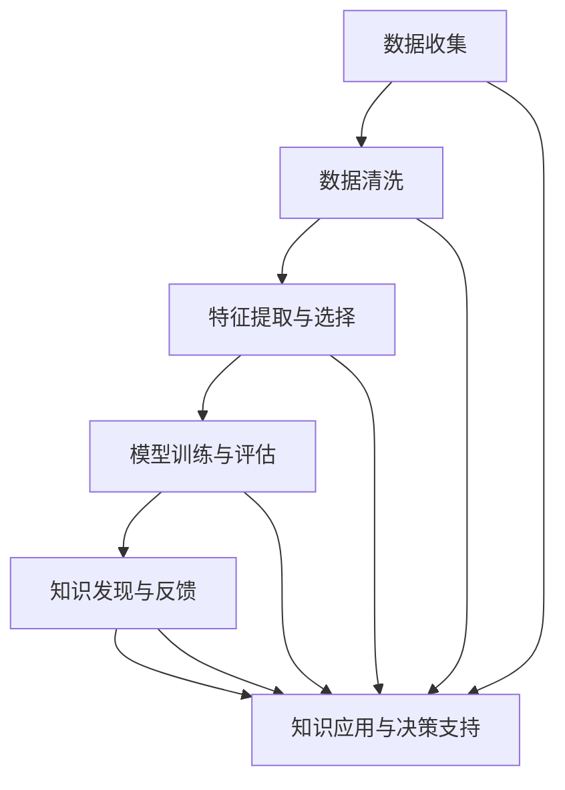

                 

# 知识发现引擎：助力医疗领域的精准决策

> 关键词：知识发现引擎, 医疗决策, 精准医疗, 数据挖掘, 机器学习, 人工智能, 医疗图像分析, 疾病预测, 风险评估

## 1. 背景介绍

### 1.1 问题由来

随着科技的进步，人工智能和大数据技术在医疗领域的应用日益广泛，知识发现引擎（Knowledge Discovery Engine, KDE）作为其中的关键技术之一，正逐渐成为推动精准医疗发展的引擎。传统的医疗决策依赖于医生的经验和直觉，而精准医疗则要求依托数据驱动，通过人工智能和大数据技术，从海量的医疗数据中提取知识，辅助医生做出更准确的诊断和治疗决策。

知识发现引擎的核心目标是，利用先进的数据挖掘和机器学习技术，从结构化与非结构化的医疗数据中挖掘出潜在知识，揭示疾病的规律与关联，从而提高医疗决策的精准性和效率。其应用领域包括但不限于疾病预测、药物研发、医疗图像分析、个性化医疗等方面。

### 1.2 问题核心关键点

知识发现引擎主要通过以下步骤，从医疗数据中提取知识并应用于临床决策：
1. **数据收集与清洗**：收集医疗机构的电子健康记录（EHR）、医学影像、基因组数据等，并清洗处理异常和缺失数据。
2. **特征提取与选择**：利用文本挖掘、图像处理等技术，从原始数据中提取出有意义的特征，用于后续建模。
3. **模型训练与评估**：使用机器学习算法（如决策树、支持向量机、神经网络等），对数据进行建模和预测，并进行交叉验证和性能评估。
4. **知识发现与反馈**：将模型应用于临床，观察和反馈实际效果，进一步优化模型和算法。
5. **知识应用与决策支持**：将模型集成到医生工作流程中，辅助医生进行诊断和治疗决策。

这一系列流程，涉及数据预处理、特征工程、模型选择与训练、结果分析等多个环节，需要跨学科的深度合作和丰富的实践经验。

### 1.3 问题研究意义

知识发现引擎在医疗领域的研究和应用，具有以下重要意义：
1. **提升医疗决策的精准性**：通过大数据和机器学习技术，辅助医生识别疾病模式和风险因素，提升诊断和治疗的精准度。
2. **加速医学研究进程**：利用数据挖掘技术，快速发现新的疾病机制和药物靶点，加速新药的研发和医学研究。
3. **优化医疗资源配置**：通过分析临床数据，预测疾病流行趋势，合理配置医疗资源，提高医疗服务效率。
4. **推动个性化医疗**：根据患者的基因组、病历和临床数据，进行个性化预测和治疗方案设计，提高治疗效果和患者满意度。
5. **降低医疗成本**：通过提前诊断和预防，减少不必要的治疗和住院时间，降低整体医疗费用。

## 2. 核心概念与联系

### 2.1 核心概念概述

为更好地理解知识发现引擎的工作原理和应用流程，本节将介绍几个关键概念：

- **知识发现引擎**：利用数据挖掘和机器学习技术，从医疗数据中提取知识，辅助医疗决策的系统。
- **电子健康记录（EHR）**：包含患者医疗信息的数据库，包括病历、检查结果、用药记录等。
- **医学影像分析**：利用图像处理和模式识别技术，从医学影像中提取诊断信息，如CT、MRI等。
- **机器学习**：通过训练模型，从数据中学习规律，进行分类、回归、预测等任务。
- **数据预处理**：对原始数据进行清洗、归一化、特征工程等操作，提升模型训练效果。
- **特征工程**：从原始数据中提取、选择和构造有意义的特征，用于模型训练。
- **模型评估**：通过交叉验证、ROC曲线等方法，评估模型性能，选择最优模型。
- **知识应用**：将模型应用于临床决策支持系统（CDSS），辅助医生进行诊断和治疗。

这些核心概念之间紧密相连，共同构成知识发现引擎的工作流程，如图示：



## 3. 核心算法原理 & 具体操作步骤
### 3.1 算法原理概述

知识发现引擎的原理主要基于数据挖掘和机器学习技术，其核心思想是通过对大量医疗数据的分析和学习，挖掘出疾病的潜在规律和关联，从而辅助医生进行精准医疗决策。

知识发现引擎通常包括数据预处理、特征提取、模型训练、结果解释等多个环节。具体步骤如下：
1. **数据收集与清洗**：收集医疗机构的EHR、医学影像、基因组数据等，并清洗处理异常和缺失数据。
2. **特征提取与选择**：利用文本挖掘、图像处理等技术，从原始数据中提取出有意义的特征，用于后续建模。
3. **模型训练与评估**：使用机器学习算法（如决策树、支持向量机、神经网络等），对数据进行建模和预测，并进行交叉验证和性能评估。
4. **知识发现与反馈**：将模型应用于临床，观察和反馈实际效果，进一步优化模型和算法。
5. **知识应用与决策支持**：将模型集成到医生工作流程中，辅助医生进行诊断和治疗决策。

### 3.2 算法步骤详解

以下是知识发现引擎的核心算法步骤详解：

**Step 1: 数据收集与清洗**
- 收集医疗机构的电子健康记录（EHR）、医学影像、基因组数据等。
- 清洗处理异常和缺失数据，如去除重复数据、填补缺失值等。
- 对数据进行标准化处理，如归一化、归一化处理等。

**Step 2: 特征提取与选择**
- 利用文本挖掘技术，从EHR数据中提取关键词、症状、诊断等信息。
- 使用图像处理技术，从医学影像中提取肿瘤、病变区域、形态学特征等。
- 通过基因组数据分析，提取基因型、蛋白质表达、代谢产物等信息。
- 选择与疾病预测和治疗效果相关的特征，剔除无关或冗余特征。

**Step 3: 模型训练与评估**
- 选择合适的机器学习算法，如随机森林、支持向量机、神经网络等。
- 将处理后的数据集划分为训练集、验证集和测试集。
- 使用训练集对模型进行训练，优化模型参数。
- 在验证集上评估模型性能，选择最优模型。
- 在测试集上测试模型效果，确认模型泛化能力。

**Step 4: 知识发现与反馈**
- 将训练好的模型应用于临床，对新病例进行预测和诊断。
- 收集医生反馈和实际治疗效果，进行模型效果评估。
- 根据反馈信息，进一步优化模型和特征选择策略。

**Step 5: 知识应用与决策支持**
- 将模型集成到医生工作流程中，辅助医生进行诊断和治疗决策。
- 在电子健康记录系统中嵌入决策支持模块，提供诊断和治疗建议。
- 定期更新模型参数和特征集，保证模型效果的持续优化。

### 3.3 算法优缺点

知识发现引擎的优势在于：
1. **数据驱动**：利用大数据技术，辅助医生从海量数据中提取知识，提升诊断和治疗的精准性。
2. **模型可解释性**：通过特征工程和模型解释技术，帮助医生理解模型决策过程，提高信任度。
3. **快速迭代**：利用机器学习算法，快速迭代优化模型效果，适应新数据和新任务。
4. **个性化医疗**：根据患者数据，进行个性化预测和治疗方案设计，提高治疗效果和患者满意度。
5. **系统集成**：易于集成到现有医疗信息系统，提升临床工作效率。

然而，知识发现引擎也存在以下挑战：
1. **数据隐私和安全**：医疗数据涉及患者隐私，需要严格的数据保护措施。
2. **数据质量和完整性**：医疗数据往往存在缺失和噪声，数据预处理和清洗工作量较大。
3. **模型泛化能力**：模型在新数据上的泛化能力是关键，需要定期更新和优化。
4. **医生接受度**：医生对新系统的接受程度和信任度，会直接影响系统应用效果。
5. **计算资源需求**：大数据分析需要高性能计算资源，对硬件和软件环境要求较高。

### 3.4 算法应用领域

知识发现引擎在医疗领域有广泛的应用，具体包括：
- **疾病预测与预防**：通过分析电子健康记录和基因组数据，预测疾病发生的风险，进行早期干预。
- **医学影像分析**：利用图像处理和模式识别技术，辅助医生对肿瘤、病变等进行诊断和分类。
- **个性化医疗**：根据患者的基因组和病历数据，设计个性化的治疗方案和预防措施。
- **药物研发**：利用大数据分析，发现新的药物靶点和机制，加速新药的研发进程。
- **健康管理**：通过数据分析，提供健康状况评估和个性化健康管理建议。
- **临床决策支持**：集成到电子健康记录系统中，辅助医生进行诊断和治疗决策。

这些应用领域展示了知识发现引擎的广泛适用性和巨大的应用潜力。

## 4. 数学模型和公式 & 详细讲解 & 举例说明
### 4.1 数学模型构建

知识发现引擎的数学模型构建，主要涉及以下几个关键步骤：

1. **数据表示与特征提取**：将原始数据表示为数值或向量形式，并提取有意义的特征。
2. **模型选择与训练**：选择合适的机器学习算法，利用训练数据对模型进行训练。
3. **模型评估与优化**：通过交叉验证等方法评估模型性能，优化模型参数和特征选择策略。
4. **结果解释与应用**：利用特征工程和模型解释技术，辅助医生理解模型决策过程。

### 4.2 公式推导过程

以疾病预测模型为例，我们将详细介绍其数学模型构建和公式推导过程。

假设我们有N个样本，每个样本包含K个特征，用X表示特征矩阵，Y表示疾病标签，目标是从数据中学习一个预测模型$f(X)$，使其能够准确预测疾病是否发生。

**Step 1: 数据预处理**
- 数据标准化：将特征数据进行归一化处理，使其满足均值为0、方差为1的正态分布。
- 特征选择：选择与疾病相关的特征，剔除无关或冗余特征。

**Step 2: 模型训练**
- 使用支持向量机（SVM）模型，构建疾病预测模型。
- SVM模型的目标函数为：
$$
\min_{w,b} \frac{1}{2} \lVert w \rVert^2 + C \sum_{i=1}^N [\max(0, 1 - y_i \cdot (w \cdot x_i + b))]
$$
其中$w$为模型权重向量，$b$为偏置项，$C$为惩罚系数，$y_i$为标签向量，$x_i$为特征向量。

**Step 3: 模型评估**
- 使用交叉验证方法，评估模型性能。
- 计算混淆矩阵和评估指标，如准确率、召回率、F1分数等。

**Step 4: 结果解释**
- 利用特征重要性分析，解释模型预测结果。
- 通过可解释模型（如LIME、SHAP等），辅助医生理解模型决策逻辑。

### 4.3 案例分析与讲解

下面以医学影像分析为例，详细讲解知识发现引擎的应用。

假设某医院有大量医学影像数据，目标是辅助医生诊断肿瘤。通过图像处理技术，可以从影像中提取出肿瘤的面积、边缘、密度等特征。然后，使用支持向量机（SVM）模型对数据进行训练和预测，得到肿瘤诊断结果。

**Step 1: 数据预处理**
- 对医学影像进行灰度化和归一化处理。
- 提取肿瘤区域的面积、边缘、密度等特征，构建特征向量。

**Step 2: 模型训练**
- 使用支持向量机（SVM）模型，构建肿瘤预测模型。
- 训练数据集为肿瘤标注的影像数据，目标函数为：
$$
\min_{w,b} \frac{1}{2} \lVert w \rVert^2 + C \sum_{i=1}^N [\max(0, 1 - y_i \cdot (w \cdot x_i + b))]
$$
其中$w$为模型权重向量，$b$为偏置项，$C$为惩罚系数，$y_i$为标签向量，$x_i$为特征向量。

**Step 3: 模型评估**
- 使用交叉验证方法，评估模型性能。
- 计算混淆矩阵和评估指标，如准确率、召回率、F1分数等。

**Step 4: 结果解释**
- 利用特征重要性分析，解释模型预测结果。
- 通过可解释模型（如LIME、SHAP等），辅助医生理解模型决策逻辑。

通过以上步骤，知识发现引擎能够从医学影像中提取肿瘤特征，辅助医生进行肿瘤诊断。

## 5. 项目实践：代码实例和详细解释说明
### 5.1 开发环境搭建

在进行知识发现引擎的开发实践前，我们需要准备好开发环境。以下是使用Python进行Scikit-learn开发的环境配置流程：

1. 安装Anaconda：从官网下载并安装Anaconda，用于创建独立的Python环境。

2. 创建并激活虚拟环境：
```bash
conda create -n kde-env python=3.8 
conda activate kde-env
```

3. 安装Scikit-learn、Pandas、Matplotlib等工具包：
```bash
pip install scikit-learn pandas matplotlib scikit-image
```

完成上述步骤后，即可在`kde-env`环境中开始知识发现引擎的开发实践。

### 5.2 源代码详细实现

下面我们以疾病预测模型为例，给出使用Scikit-learn进行疾病预测的PyTorch代码实现。

首先，定义疾病预测任务的数据处理函数：

```python
import pandas as pd
from sklearn.preprocessing import StandardScaler, MinMaxScaler
from sklearn.model_selection import train_test_split
from sklearn.linear_model import LogisticRegression

def process_data(df, target_col, features_col):
    target = df[target_col]
    features = df[features_col].values
    features = MinMaxScaler().fit_transform(features)
    X_train, X_test, y_train, y_test = train_test_split(features, target, test_size=0.2)
    return X_train, X_test, y_train, y_test

def train_model(X_train, X_test, y_train, y_test):
    model = LogisticRegression()
    model.fit(X_train, y_train)
    y_pred = model.predict(X_test)
    return model, y_pred
```

然后，定义疾病预测模型训练和评估函数：

```python
from sklearn.metrics import accuracy_score, precision_score, recall_score, f1_score
import matplotlib.pyplot as plt

def evaluate_model(model, X_test, y_test):
    y_pred = model.predict(X_test)
    accuracy = accuracy_score(y_test, y_pred)
    precision = precision_score(y_test, y_pred)
    recall = recall_score(y_test, y_pred)
    f1 = f1_score(y_test, y_pred)
    print(f"Accuracy: {accuracy:.3f}, Precision: {precision:.3f}, Recall: {recall:.3f}, F1: {f1:.3f}")
    confusion_matrix = confusion_matrix(y_test, y_pred)
    plt.figure(figsize=(8, 6))
    plt.imshow(confusion_matrix, cmap='Blues')
    plt.title('Confusion Matrix')
    plt.show()
```

最后，启动训练流程并在测试集上评估：

```python
from sklearn.datasets import load_breast_cancer

# 加载数据集
data = load_breast_cancer()
X = data.data
y = data.target

# 数据预处理
X_train, X_test, y_train, y_test = process_data(X, 'target', features_col)

# 训练模型
model, y_pred = train_model(X_train, X_test, y_train, y_test)

# 评估模型
evaluate_model(model, X_test, y_test)
```

以上就是使用Scikit-learn进行疾病预测的完整代码实现。可以看到，利用Scikit-learn，可以很容易地实现基本的疾病预测模型训练和评估。

### 5.3 代码解读与分析

让我们再详细解读一下关键代码的实现细节：

**process_data函数**：
- 将目标变量和特征变量分离。
- 对特征变量进行归一化处理。
- 将数据集划分为训练集和测试集。

**train_model函数**：
- 创建逻辑回归模型，对训练数据进行训练。
- 在测试集上进行预测。

**evaluate_model函数**：
- 计算模型在测试集上的准确率、精确度、召回率和F1分数。
- 绘制混淆矩阵，可视化模型预测结果。

**训练流程**：
- 加载乳腺癌数据集，预处理数据集。
- 划分训练集和测试集。
- 训练逻辑回归模型，并在测试集上进行预测。
- 评估模型性能，输出结果。

可以看到，Scikit-learn提供了完整的工具链，可以轻松实现基本的机器学习任务。对于更复杂的任务，如医学影像分析，需要使用专门的图像处理库和算法。

## 6. 实际应用场景
### 6.1 智能诊断系统

智能诊断系统是知识发现引擎的重要应用之一。通过分析电子健康记录和医学影像，知识发现引擎能够辅助医生进行疾病预测和诊断，提升诊断的精准性和效率。

以肺癌诊断为例，知识发现引擎可以从CT影像中提取肿瘤区域的信息，使用机器学习算法构建诊断模型，帮助医生识别肺癌。在实际应用中，可以将诊断结果嵌入到电子健康记录系统中，辅助医生进行决策。

### 6.2 个性化治疗方案

个性化治疗方案是精准医疗的重要方向。通过分析患者的基因组和病历数据，知识发现引擎能够为患者设计个性化的治疗方案，提高治疗效果和患者满意度。

以癌症治疗为例，知识发现引擎可以从基因组数据中提取与肿瘤相关的特征，结合患者的病历信息，使用机器学习算法构建治疗方案预测模型，为患者推荐最合适的治疗方案。

### 6.3 医疗资源优化

医疗资源的合理配置是提升医疗服务质量的关键。通过分析历史数据，知识发现引擎能够预测疾病流行趋势和医疗资源需求，优化资源配置，提高医疗服务效率。

以急诊室管理为例，知识发现引擎可以分析历史急诊数据，预测高峰期和低谷期，帮助医院合理配置急诊室资源，避免资源浪费。

### 6.4 未来应用展望

随着知识发现引擎的不断演进，其应用前景将更加广阔：

1. **多模态数据融合**：将电子健康记录、医学影像、基因组数据等多种数据源进行融合，提升诊断和治疗的精准性。
2. **实时数据分析**：利用大数据和流式计算技术，实现实时数据分析和决策支持。
3. **智能决策系统**：构建智能决策系统，辅助医生进行复杂和多变的诊断和治疗决策。
4. **跨领域应用**：将知识发现引擎应用到健康管理、公共卫生、医学教育等多个领域，推动相关领域的发展。
5. **持续学习和优化**：通过持续学习和优化，不断提升知识发现引擎的性能和泛化能力。

## 7. 工具和资源推荐
### 7.1 学习资源推荐

为了帮助开发者系统掌握知识发现引擎的理论基础和实践技巧，这里推荐一些优质的学习资源：

1. 《机器学习实战》（Hands-On Machine Learning with Scikit-Learn, Keras, and TensorFlow）：适合初学者入门，涵盖机器学习基础和Scikit-learn的应用。
2. 《深度学习》（Deep Learning）：深度学习领域的经典教材，介绍了深度学习的基本原理和实现方法。
3. 《数据科学导论》（Introduction to Data Science in Python）：适合Python初学者，涵盖数据清洗、特征工程、模型训练等基础内容。
4. 《Python数据科学手册》（Python Data Science Handbook）：全面介绍了Python在数据科学中的应用，包括NumPy、Pandas、Scikit-learn等库的使用。
5. Kaggle：数据科学竞赛平台，提供了丰富的数据集和比赛项目，有助于实践和提升。

通过对这些资源的学习实践，相信你一定能够快速掌握知识发现引擎的理论基础和实践技巧，并用于解决实际的医疗问题。

### 7.2 开发工具推荐

高效的开发离不开优秀的工具支持。以下是几款用于知识发现引擎开发的常用工具：

1. Python：作为数据科学和机器学习的主流语言，Python提供了丰富的库和框架，方便实现数据处理和建模。
2. Scikit-learn：开源机器学习库，提供了多种机器学习算法和工具，易于上手和集成。
3. Pandas：数据处理库，支持大规模数据集的处理和分析，提供丰富的数据操作函数。
4. NumPy：数学计算库，提供了高效的数组操作和线性代数计算，支持高效的科学计算。
5. Matplotlib：绘图库，支持多种图表类型和自定义设置，方便数据可视化。
6. TensorFlow和Keras：深度学习框架，支持复杂的神经网络模型构建和训练，适合大规模数据集和高性能计算环境。

合理利用这些工具，可以显著提升知识发现引擎的开发效率，加快创新迭代的步伐。

### 7.3 相关论文推荐

知识发现引擎的研究离不开前沿论文的引领，以下是几篇奠基性的相关论文，推荐阅读：

1. 《Cancer Genomic Analysis》（Cancer Genomic Analysis）：介绍了癌症基因组分析的方法和应用。
2. 《Machine Learning in Medical Diagnosis》（Machine Learning in Medical Diagnosis）：介绍了机器学习在医学诊断中的应用。
3. 《Deep Learning for Medical Imaging Analysis》（Deep Learning for Medical Imaging Analysis）：介绍了深度学习在医学影像分析中的应用。
4. 《Machine Learning for Personalized Medicine》（Machine Learning for Personalized Medicine）：介绍了机器学习在个性化医疗中的应用。
5. 《Knowledge Discovery in Databases》（Knowledge Discovery in Databases）：介绍了知识发现的基本原理和技术。
6. 《Hands-On Data Analysis with Pandas》（Hands-On Data Analysis with Pandas）：介绍了Pandas库的数据分析方法和应用。

这些论文代表了大数据和机器学习在医疗领域的应用方向，对知识发现引擎的研究和实践具有重要的参考价值。

## 8. 总结：未来发展趋势与挑战
### 8.1 总结

本文对知识发现引擎进行了全面系统的介绍。首先阐述了知识发现引擎的研究背景和意义，明确了其在医疗决策中的核心作用。其次，从原理到实践，详细讲解了知识发现引擎的数学模型和操作步骤，给出了基于Scikit-learn的疾病预测代码实现。同时，本文还广泛探讨了知识发现引擎在医疗领域的实际应用场景，展示了其在智能诊断、个性化治疗、医疗资源优化等方面的潜力。此外，本文精选了知识发现引擎的学习资源、开发工具和相关论文，力求为读者提供全方位的技术指引。

通过本文的系统梳理，可以看到，知识发现引擎在大数据和机器学习技术支持下，能够从海量医疗数据中提取知识，辅助医生进行精准医疗决策。未来的研究需要在数据预处理、特征工程、模型优化等方面进行深入探索，进一步提升知识发现引擎的性能和应用效果。

### 8.2 未来发展趋势

展望未来，知识发现引擎的发展趋势主要体现在以下几个方面：

1. **多模态数据融合**：将电子健康记录、医学影像、基因组数据等多种数据源进行融合，提升诊断和治疗的精准性。
2. **实时数据分析**：利用大数据和流式计算技术，实现实时数据分析和决策支持。
3. **智能决策系统**：构建智能决策系统，辅助医生进行复杂和多变的诊断和治疗决策。
4. **跨领域应用**：将知识发现引擎应用到健康管理、公共卫生、医学教育等多个领域，推动相关领域的发展。
5. **持续学习和优化**：通过持续学习和优化，不断提升知识发现引擎的性能和泛化能力。

以上趋势凸显了知识发现引擎在医疗领域的广泛应用前景，必将进一步提升医疗决策的精准性和效率。

### 8.3 面临的挑战

尽管知识发现引擎在医疗领域取得了显著成果，但其发展仍面临诸多挑战：

1. **数据隐私和安全**：医疗数据涉及患者隐私，需要严格的数据保护措施。
2. **数据质量和完整性**：医疗数据往往存在缺失和噪声，数据预处理和清洗工作量较大。
3. **模型泛化能力**：模型在新数据上的泛化能力是关键，需要定期更新和优化。
4. **医生接受度**：医生对新系统的接受程度和信任度，会直接影响系统应用效果。
5. **计算资源需求**：大数据分析需要高性能计算资源，对硬件和软件环境要求较高。

正视知识发现引擎面临的这些挑战，积极应对并寻求突破，将是大数据和机器学习技术在医疗领域发展的关键。

### 8.4 研究展望

面向未来，知识发现引擎的研究需要在以下几个方面寻求新的突破：

1. **无监督学习和半监督学习**：摆脱对大量标注数据的依赖，利用自监督学习、主动学习等无监督和半监督范式，最大限度利用非结构化数据，实现更加灵活高效的微调。
2. **参数高效和计算高效**：开发更加参数高效的微调方法，在固定大部分预训练参数的同时，只更新极少量的任务相关参数。同时优化微调模型的计算图，减少前向传播和反向传播的资源消耗，实现更加轻量级、实时性的部署。
3. **因果分析和博弈论工具**：将因果分析方法引入微调模型，识别出模型决策的关键特征，增强输出解释的因果性和逻辑性。借助博弈论工具刻画人机交互过程，主动探索并规避模型的脆弱点，提高系统稳定性。
4. **伦理道德约束**：在模型训练目标中引入伦理导向的评估指标，过滤和惩罚有偏见、有害的输出倾向。同时加强人工干预和审核，建立模型行为的监管机制，确保输出符合人类价值观和伦理道德。
5. **多领域知识整合**：将符号化的先验知识，如知识图谱、逻辑规则等，与神经网络模型进行巧妙融合，引导微调过程学习更准确、合理的语言模型。同时加强不同模态数据的整合，实现视觉、语音等多模态信息与文本信息的协同建模。

这些研究方向的探索，必将引领知识发现引擎技术迈向更高的台阶，为构建安全、可靠、可解释、可控的智能系统铺平道路。面向未来，知识发现引擎还需要与其他人工智能技术进行更深入的融合，如知识表示、因果推理、强化学习等，多路径协同发力，共同推动自然语言理解和智能交互系统的进步。只有勇于创新、敢于突破，才能不断拓展知识发现引擎的边界，让智能技术更好地造福人类社会。

## 9. 附录：常见问题与解答

**Q1：知识发现引擎如何与临床系统集成？**

A: 知识发现引擎通常通过API接口与临床系统集成。具体步骤如下：
1. 定义API接口，包括数据输入、模型预测、结果输出等操作。
2. 将API接口嵌入到临床系统中，如电子健康记录系统、医生工作站等。
3. 在临床系统中调用API接口，获取知识发现引擎的预测结果，辅助医生进行诊断和治疗决策。

**Q2：知识发现引擎在临床应用中面临哪些挑战？**

A: 知识发现引擎在临床应用中面临以下挑战：
1. 数据隐私和安全：医疗数据涉及患者隐私，需要严格的数据保护措施。
2. 数据质量和完整性：医疗数据往往存在缺失和噪声，数据预处理和清洗工作量较大。
3. 医生接受度：医生对新系统的接受程度和信任度，会直接影响系统应用效果。
4. 计算资源需求：大数据分析需要高性能计算资源，对硬件和软件环境要求较高。
5. 模型泛化能力：模型在新数据上的泛化能力是关键，需要定期更新和优化。

**Q3：知识发现引擎如何实现多模态数据融合？**

A: 知识发现引擎实现多模态数据融合的关键在于选择合适的特征提取和融合方法。常用的方法包括：
1. 特征投影：通过PCA、LDA等方法，将不同模态的数据投影到同一特征空间，进行融合。
2. 深度学习模型：利用卷积神经网络（CNN）、循环神经网络（RNN）等深度学习模型，直接从多模态数据中提取特征，进行融合。
3. 数据增强：通过数据增强技术，扩充不同模态的数据集，提高融合效果。

**Q4：知识发现引擎在实际应用中如何进行效果评估？**

A: 知识发现引擎在实际应用中，可以通过以下方法进行效果评估：
1. 模型性能评估：使用交叉验证、ROC曲线等方法，评估模型在测试集上的性能指标，如准确率、精确度、召回率、F1分数等。
2. 结果解释与可视化：利用特征重要性分析、LIME、SHAP等工具，解释模型预测结果，可视化模型的决策过程。
3. 临床验证：将模型应用于临床系统，观察实际应用效果，收集医生反馈，进一步优化模型。

**Q5：知识发现引擎如何提升模型的泛化能力？**

A: 提升知识发现引擎模型的泛化能力，可以通过以下方法：
1. 数据增强：通过数据增强技术，扩充不同模态的数据集，提高模型的泛化能力。
2. 模型集成：通过集成多个模型，利用模型融合技术，提高模型的泛化性能。
3. 持续学习：通过持续学习和优化，不断更新模型参数和特征选择策略，提升模型的泛化能力。
4. 跨领域迁移学习：在相关领域数据上微调模型，提高模型的跨领域迁移能力。

这些方法可以相互结合，共同提升知识发现引擎的泛化能力和应用效果。

---

作者：禅与计算机程序设计艺术 / Zen and the Art of Computer Programming

