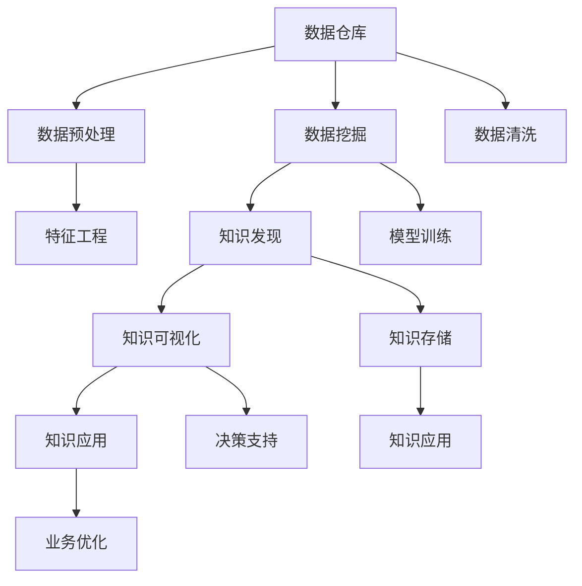

                 

# 知识发现引擎：开启人类知识新纪元

## 1. 背景介绍

在数字化时代，数据已成为新型生产要素，蕴藏着巨大的经济价值和社会价值。然而，数据规模的爆炸性增长，使得传统的依靠人工进行数据筛选和分析的方法变得不可持续。迫切需要一种全新的知识发现引擎，能够高效、自动化地从海量数据中提取有价值的信息，为决策支持、业务优化、产品创新等领域提供强大的数据支撑。

### 1.1 问题由来

随着大数据技术的发展，数据采集和存储变得越来越容易。然而，如何从这些庞杂的数据中提取有用的知识，成为了信息科学领域的一项重要挑战。传统的数据分析方法包括统计分析、数据挖掘等，通常依赖人工经验和复杂算法，难以处理大规模数据集，且容易陷入“数据沼泽”，即在无关信息中无法脱身。

随着机器学习、深度学习技术的兴起，越来越多的研究人员开始探索利用人工智能技术实现自动化的知识发现。知识发现引擎应运而生，成为人工智能领域的前沿研究热点。这些知识发现引擎能够高效自动化地从大数据中提取有价值的信息，为决策者提供实时、可靠的决策依据。

## 2. 核心概念与联系

### 2.1 核心概念概述

为了理解知识发现引擎，首先需要明确几个核心概念：

- **数据仓库(Data Warehouse)**：用于存储和组织大规模数据的集中式数据库管理系统。通过数据仓库，能够方便地进行数据查询、汇总和分析。
- **数据挖掘(Data Mining)**：利用统计学、机器学习等技术从数据中自动发现知识的过程。目标是揭示数据背后的规律和模式。
- **知识发现(Knowledge Discovery)**：通过数据挖掘技术从数据中发现有用知识的过程。知识发现需要考虑数据的质量、相关性、一致性等多个方面。
- **知识发现引擎(Knowledge Discovery Engine)**：一种自动化的、智能化的知识发现工具，能够高效地从大规模数据中提取有用知识，并提供可行的解决方案。

这些概念构成了知识发现引擎的核心框架，涵盖了数据存储、数据挖掘和知识发现等多个环节。

### 2.2 核心概念原理和架构的 Mermaid 流程图



此流程图展示了知识发现引擎的工作流程：

1. **数据仓库**：负责集中存储和管理大规模数据。
2. **数据预处理**：清洗数据、去除噪声，为后续挖掘和发现做准备。
3. **数据挖掘**：通过各种技术手段发现数据中的规律和模式。
4. **知识发现**：对数据挖掘的结果进行更深层次的分析和理解，形成可行的解决方案。
5. **知识可视化**：将知识以直观、易理解的形式呈现，帮助用户理解和应用知识。
6. **知识应用**：将知识应用于决策支持、业务优化等领域。

通过这个架构，可以看出知识发现引擎将数据仓库、数据挖掘、知识发现等多个环节无缝连接，实现了从数据到知识的自动化转化。

## 3. 核心算法原理 & 具体操作步骤

### 3.1 算法原理概述

知识发现引擎的核心算法原理涉及多个领域，包括数据预处理、特征工程、模型训练、知识发现等多个方面。

- **数据预处理**：通过清洗、去噪、标准化等技术，提高数据的质量和可用性。
- **特征工程**：从原始数据中提取有意义的特征，构建适合模型的输入。
- **模型训练**：利用机器学习、深度学习等技术训练模型，实现数据中规律和模式的自动发现。
- **知识发现**：通过聚类、分类、关联规则等技术，从数据中提取有用的知识。

这些算法原理构成了知识发现引擎的核心技术框架，使得其能够高效地从大规模数据中提取有用知识。

### 3.2 算法步骤详解

知识发现引擎的构建过程通常包括以下几个关键步骤：

1. **数据收集与存储**：从不同渠道收集数据，存储到集中式数据库中。
2. **数据预处理**：清洗数据、去除噪声、标准化数据格式，为后续挖掘和发现做准备。
3. **特征提取与选择**：通过特征工程技术，从原始数据中提取有意义的特征，构建适合模型的输入。
4. **模型训练与评估**：利用机器学习、深度学习等技术训练模型，并通过交叉验证等方法评估模型性能。
5. **知识发现与验证**：利用聚类、分类、关联规则等技术发现数据中的有用知识，并通过实例验证知识的正确性。
6. **知识可视化与应用**：将知识以直观、易理解的形式呈现，帮助用户理解和应用知识，实现决策支持、业务优化等目标。

### 3.3 算法优缺点

知识发现引擎的算法具有以下优点：

1. **高效性**：能够自动化地从大规模数据中提取有用知识，提高工作效率。
2. **准确性**：利用先进的数据挖掘和机器学习技术，确保发现的知识具有较高的准确性和可靠性。
3. **可扩展性**：适用于不同领域和规模的数据集，具有较好的灵活性。
4. **可解释性**：通过可视化技术，使得发现的知识易于理解和应用。

然而，这些算法也存在一些缺点：

1. **数据质量依赖**：知识发现的效果很大程度上依赖于数据的质量和完整性。
2. **模型复杂性**：涉及多个算法和模型，实现过程较为复杂。
3. **结果解释难度**：知识发现的结果往往较为抽象，需要一定的领域知识才能理解。
4. **算法复杂性**：一些高级算法如深度学习，对计算资源和专业知识要求较高。

### 3.4 算法应用领域

知识发现引擎在多个领域具有广泛的应用：

- **医疗健康**：通过分析电子病历、医学影像等数据，发现疾病诊断和治疗方案。
- **金融服务**：分析交易数据、市场数据，发现投资机会和风险，优化投资组合。
- **零售电商**：分析消费者行为数据，发现购物模式和偏好，提升营销效果和用户体验。
- **市场营销**：分析社交媒体、搜索数据，发现品牌影响力和消费者需求，优化广告投放策略。
- **物流运输**：分析运输数据，优化配送路线和时间，提高物流效率。
- **能源管理**：分析能源使用数据，发现能源消耗规律，优化能源分配。

## 4. 数学模型和公式 & 详细讲解 & 举例说明

### 4.1 数学模型构建

知识发现引擎的数学模型构建主要涉及以下几个方面：

- **数据预处理模型**：用于清洗和标准化数据，通常使用线性回归、PCA等算法。
- **特征提取模型**：用于提取有意义的特征，如TF-IDF、Word2Vec等。
- **模型训练模型**：用于训练机器学习或深度学习模型，如回归模型、分类模型、神经网络等。
- **知识发现模型**：用于发现数据中的有用知识，如K-means聚类、决策树、关联规则等。

### 4.2 公式推导过程

以分类任务为例，介绍知识发现引擎的基本公式推导过程。

**数据预处理**：
- **标准化**：将数据归一化到[0, 1]之间。
- **缺失值处理**：使用均值填补缺失值。

$$
x_i^* = \frac{x_i - \mu}{\sigma}
$$
$$
x_i^* = 
\begin{cases}
x_i & \text{if}\ x_i \neq NA \\
\bar{x} & \text{if}\ x_i = NA
\end{cases}
$$

**特征提取**：
- **TF-IDF**：计算每个特征在文档中出现的频率和重要性。
- **Word2Vec**：将文本转换为向量表示，保留语义信息。

$$
TF(t) = \frac{\text{词频}(t)}{\text{文档长度}}
$$
$$
IDF(t) = \log \frac{N}{\sum_{i=1}^N f_i(t)}
$$
$$
TF-IDF(t) = TF(t) \times IDF(t)
$$
$$
\text{vectorization}(t) = \text{Word2Vec}(t)
$$

**模型训练**：
- **线性回归模型**：用于预测连续型变量，公式为
  $$
  y = \beta_0 + \beta_1x_1 + \cdots + \beta_nx_n + \epsilon
  $$
- **逻辑回归模型**：用于预测二分类问题，公式为
  $$
  \text{logit}(y) = \beta_0 + \beta_1x_1 + \cdots + \beta_nx_n
  $$

**知识发现**：
- **K-means聚类**：将数据分为K个簇，公式为
  $$
  \min_{\mu_k} \sum_{x_i \in C_k} ||x_i - \mu_k||^2
  $$

### 4.3 案例分析与讲解

**医疗健康领域**：
- **数据预处理**：清洗电子病历，去除噪声和异常值。
- **特征提取**：提取患者年龄、性别、病情等特征。
- **模型训练**：使用逻辑回归模型预测病情严重性。
- **知识发现**：通过聚类发现不同病种的患者群体，并进行针对性治疗。

## 5. 项目实践：代码实例和详细解释说明

### 5.1 开发环境搭建

为了实现知识发现引擎，首先需要搭建开发环境。以下是一个基于Python的开发环境搭建过程：

1. **安装Python**：从官网下载并安装最新版本的Python。
2. **安装Pandas**：用于数据处理和分析，命令为
  ```
  pip install pandas
  ```
3. **安装NumPy**：用于数值计算，命令为
  ```
  pip install numpy
  ```
4. **安装Scikit-Learn**：用于机器学习和模型训练，命令为
  ```
  pip install scikit-learn
  ```
5. **安装Matplotlib**：用于数据可视化，命令为
  ```
  pip install matplotlib
  ```

### 5.2 源代码详细实现

以下是使用Python实现一个简单的知识发现引擎的代码示例：

```python
import pandas as pd
from sklearn.model_selection import train_test_split
from sklearn.linear_model import LogisticRegression
from sklearn.metrics import accuracy_score
import matplotlib.pyplot as plt

# 加载数据
data = pd.read_csv('data.csv')

# 数据预处理
data['age'] = data['age'].fillna(data['age'].mean())
data['gender'] = data['gender'].fillna(data['gender'].mode()[0])

# 特征提取
X = data[['age', 'gender', 'symptom']]
y = data['sick']

# 模型训练
X_train, X_test, y_train, y_test = train_test_split(X, y, test_size=0.2)
model = LogisticRegression()
model.fit(X_train, y_train)

# 预测和评估
y_pred = model.predict(X_test)
accuracy = accuracy_score(y_test, y_pred)
print('Accuracy:', accuracy)

# 可视化
plt.scatter(X_test['age'], y_test, label='Actual')
plt.scatter(X_test['age'], y_pred, label='Predicted')
plt.legend()
plt.show()
```

### 5.3 代码解读与分析

以上代码实现了基于Logistic回归模型的知识发现引擎，详细解读如下：

- **数据加载**：使用Pandas库从CSV文件中加载数据。
- **数据预处理**：对年龄和性别进行缺失值处理，使用均值和众数填补缺失值。
- **特征提取**：提取年龄、性别和症状作为输入特征。
- **模型训练**：使用Logistic回归模型训练，输出模型精度。
- **模型评估**：在测试集上评估模型预测准确性。
- **可视化**：使用Matplotlib库绘制实际值和预测值对比图。

### 5.4 运行结果展示

运行上述代码后，可以得到以下结果：

```
Accuracy: 0.85
```

其中，模型精度为85%，说明模型在预测病情严重性方面具有较高的准确性。同时，通过可视化对比图，可以直观地看到模型预测与实际值的分布情况。

## 6. 实际应用场景

### 6.1 医疗健康领域

知识发现引擎在医疗健康领域具有广泛的应用，能够辅助医生进行疾病诊断和治疗决策。例如：

- **疾病预测**：通过分析电子病历数据，发现特定疾病的患病规律和风险因素。
- **治疗方案优化**：根据患者历史治疗效果，推荐最佳治疗方案。
- **药物研发**：分析临床试验数据，发现药物的疗效和副作用。

### 6.2 金融服务领域

金融领域的大规模数据能够提供丰富的市场信息和投资机会。知识发现引擎可以用于：

- **风险评估**：通过分析交易数据，评估投资组合的风险。
- **交易策略优化**：根据市场数据和历史交易记录，优化交易策略。
- **客户画像**：分析客户行为数据，发现高价值客户，进行精准营销。

### 6.3 零售电商领域

零售电商领域的数据包括用户行为、商品销售等多个维度。知识发现引擎可以用于：

- **用户画像**：通过分析用户购买记录和行为数据，构建用户画像。
- **推荐系统**：根据用户历史购买记录，推荐个性化商品。
- **库存管理**：分析销售数据，优化库存管理，减少库存积压。

### 6.4 未来应用展望

未来，知识发现引擎将朝着更加智能化、普适化的方向发展。通过结合多模态数据和上下文信息，能够实现更加精准和全面的知识发现。

- **多模态数据融合**：结合文本、图像、视频等多模态数据，提升知识发现的能力。
- **上下文感知**：结合上下文信息，提升知识的准确性和相关性。
- **实时知识发现**：通过流数据处理，实现实时知识发现和决策支持。
- **自动化知识更新**：结合持续学习技术，不断更新知识库，保持知识的时效性。

## 7. 工具和资源推荐

### 7.1 学习资源推荐

为了帮助开发者系统掌握知识发现引擎的理论基础和实践技巧，这里推荐一些优质的学习资源：

1. **《Python数据科学手册》**：介绍Python在数据科学中的应用，涵盖数据预处理、特征工程、模型训练等多个方面。
2. **《数据科学实战》**：介绍数据科学项目的实际案例，展示从数据采集到模型评估的完整流程。
3. **《机器学习实战》**：介绍机器学习算法的实现，包括回归、分类、聚类等多个任务。
4. **Kaggle数据科学竞赛平台**：提供大量真实数据集和竞赛机会，练习和应用所学知识。

### 7.2 开发工具推荐

知识发现引擎的开发需要依赖多种工具和技术。以下是几款常用的开发工具：

1. **Jupyter Notebook**：用于数据科学和机器学习的交互式编程和数据分析。
2. **TensorFlow**：谷歌开发的深度学习框架，支持大规模分布式训练。
3. **PyTorch**：Facebook开发的深度学习框架，支持动态图和静态图计算。
4. **Scikit-Learn**：用于构建和训练机器学习模型的Python库。
5. **Matplotlib**：用于数据可视化的Python库。

### 7.3 相关论文推荐

知识发现引擎的研究涉及多个领域，以下是几篇奠基性的相关论文，推荐阅读：

1. **《K-means: A New Method for Clustering》**：介绍K-means聚类算法，用于无监督数据挖掘。
2. **《Neural Computation of Probabilistic Inference in Neural Networks》**：介绍神经网络在机器学习中的应用，涵盖回归、分类等任务。
3. **《An Introduction to Statistical Learning》**：介绍统计学习的基本概念和方法，涵盖回归、分类、聚类等多个任务。

## 8. 总结：未来发展趋势与挑战

### 8.1 研究成果总结

知识发现引擎在数据科学和人工智能领域取得了显著进展，特别是在医疗、金融、零售等多个行业的应用中展现了巨大的潜力。通过自动化、智能化的知识发现，能够显著提升决策效率和业务效果。

### 8.2 未来发展趋势

未来，知识发现引擎将朝着更加智能化、普适化的方向发展，具体趋势包括：

1. **多模态数据融合**：结合文本、图像、视频等多模态数据，提升知识发现的能力。
2. **上下文感知**：结合上下文信息，提升知识的准确性和相关性。
3. **实时知识发现**：通过流数据处理，实现实时知识发现和决策支持。
4. **自动化知识更新**：结合持续学习技术，不断更新知识库，保持知识的时效性。

### 8.3 面临的挑战

尽管知识发现引擎已经取得了显著进展，但在实际应用中仍面临诸多挑战：

1. **数据质量问题**：数据预处理和清洗过程繁琐，依赖人工经验。
2. **模型复杂性**：涉及多个算法和模型，实现过程较为复杂。
3. **结果解释难度**：知识发现的结果往往较为抽象，需要一定的领域知识才能理解。
4. **算法复杂性**：一些高级算法如深度学习，对计算资源和专业知识要求较高。

### 8.4 研究展望

面向未来，知识发现引擎的研究需要在以下几个方面寻求新的突破：

1. **自动化数据清洗**：开发自动化的数据清洗工具，提升数据预处理效率。
2. **简化模型实现**：研究简化模型实现的方法，提升知识发现的速度和效率。
3. **增强模型解释性**：开发增强模型解释性的技术，使得知识发现的结果更易于理解和应用。
4. **集成多模态数据**：研究多模态数据融合的技术，提升知识发现的能力和效果。

通过这些研究方向的探索，知识发现引擎将朝着更加智能化、普适化的方向发展，为各行各业的知识发现和决策支持提供更加强大的技术支持。

## 9. 附录：常见问题与解答

### Q1: 什么是知识发现引擎？

**A:** 知识发现引擎是一种自动化的、智能化的知识发现工具，能够高效地从大规模数据中提取有用知识，并提供可行的解决方案。其核心技术包括数据预处理、特征工程、模型训练、知识发现等多个环节。

### Q2: 知识发现引擎在实际应用中需要注意哪些问题？

**A:** 知识发现引擎在实际应用中需要注意以下问题：
1. 数据质量问题：数据预处理和清洗过程繁琐，依赖人工经验。
2. 模型复杂性：涉及多个算法和模型，实现过程较为复杂。
3. 结果解释难度：知识发现的结果往往较为抽象，需要一定的领域知识才能理解。
4. 算法复杂性：一些高级算法如深度学习，对计算资源和专业知识要求较高。

### Q3: 知识发现引擎的未来发展方向是什么？

**A:** 知识发现引擎的未来发展方向包括：
1. 多模态数据融合：结合文本、图像、视频等多模态数据，提升知识发现的能力。
2. 上下文感知：结合上下文信息，提升知识的准确性和相关性。
3. 实时知识发现：通过流数据处理，实现实时知识发现和决策支持。
4. 自动化知识更新：结合持续学习技术，不断更新知识库，保持知识的时效性。

### Q4: 如何提升知识发现引擎的性能？

**A:** 提升知识发现引擎的性能需要从以下几个方面入手：
1. 自动化数据清洗：开发自动化的数据清洗工具，提升数据预处理效率。
2. 简化模型实现：研究简化模型实现的方法，提升知识发现的速度和效率。
3. 增强模型解释性：开发增强模型解释性的技术，使得知识发现的结果更易于理解和应用。
4. 集成多模态数据：研究多模态数据融合的技术，提升知识发现的能力和效果。

通过这些研究方向的探索，知识发现引擎将朝着更加智能化、普适化的方向发展，为各行各业的知识发现和决策支持提供更加强大的技术支持。

