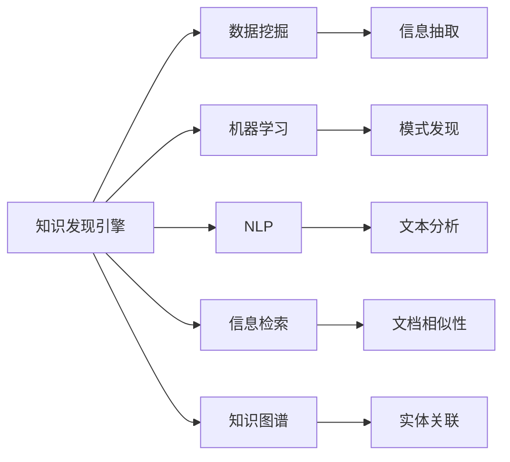

                 

# 知识发现引擎：开启知识创新新纪元

## 1. 背景介绍

在信息爆炸的时代，如何从海量数据中提取有价值的信息，驱动知识创新，是一个亟待解决的重要问题。传统的文本挖掘、数据分析方法在处理大规模数据时，面临效率低下、精度不足的挑战。为此，知识发现引擎应运而生，通过自动化、智能化的方式，从数据中挖掘、聚合、分析知识，帮助人们洞察趋势，驱动决策。

知识发现引擎综合了信息检索、数据挖掘、机器学习、自然语言处理等多种技术，能够在复杂多变的数据环境中，自动发现潜在的模式、趋势和关联，提供深度洞察，驱动企业战略和创新。近年来，随着人工智能技术的发展，知识发现引擎在医疗、金融、制造、教育等多个领域得到了广泛应用，极大提升了决策效率和创新能力。

## 2. 核心概念与联系

### 2.1 核心概念概述

为更好地理解知识发现引擎的原理与实践，本节将介绍几个关键概念及其相互之间的联系：

- **知识发现引擎(Knowledge Discovery Engine, KDE)**：通过自动化、智能化的方式，从大规模数据集中挖掘、聚合、分析知识，驱动决策支持的应用平台。
- **数据挖掘(Data Mining)**：从数据集中发现有用的信息和知识的过程，常用于商业智能、客户关系管理等领域。
- **机器学习(Machine Learning)**：使机器通过数据学习规律和模式，实现预测、分类、聚类等任务。
- **自然语言处理(Natural Language Processing, NLP)**：使机器理解、处理和生成人类语言的技术，常用于智能问答、文本分析等场景。
- **信息检索(Information Retrieval)**：从大规模文本集中快速检索信息，常用于搜索引擎、文献推荐等应用。
- **知识图谱(Knowledge Graph)**：通过图结构表示实体和关系，帮助机器理解和关联复杂信息。

这些概念相互关联，共同构成了知识发现引擎的基础架构。

### 2.2 核心概念原理和架构的 Mermaid 流程图(Mermaid 流程节点中不要有括号、逗号等特殊字符)



这个流程图展示了知识发现引擎中各技术之间的相互关系：

1. 知识发现引擎通过数据挖掘技术，从海量数据中抽取有用的信息。
2. 利用机器学习技术，对数据进行模式发现、分类、聚类等处理。
3. 自然语言处理技术帮助机器理解文本信息，进行文本分析、情感分析等。
4. 信息检索技术用于快速定位和检索信息。
5. 知识图谱技术将信息结构化，使机器能够更好地理解和关联信息。

## 3. 核心算法原理 & 具体操作步骤

### 3.1 算法原理概述

知识发现引擎的核心算法包括数据挖掘、机器学习、自然语言处理等，其原理如下：

1. **数据挖掘**：通过统计、聚类、分类等方法，从数据集中发现潜在模式和关联，如关联规则挖掘、序列模式挖掘、聚类分析等。

2. **机器学习**：利用监督学习、无监督学习、强化学习等算法，从数据中学习规律和模式，进行分类、预测、推荐等任务。

3. **自然语言处理**：通过文本分词、命名实体识别、情感分析等技术，帮助机器理解文本信息，并进行文本分类、问答、摘要生成等。

### 3.2 算法步骤详解

知识发现引擎的算法步骤一般包括以下几个关键步骤：

**Step 1: 数据预处理**

- 收集数据集：从数据仓库、API接口、社交网络等渠道获取数据。
- 清洗数据：处理缺失值、异常值，进行格式转换、归一化等。
- 数据划分：将数据集划分为训练集、验证集和测试集。

**Step 2: 特征工程**

- 特征提取：从原始数据中提取有用的特征，如文本的TF-IDF、图像的像素值、时间序列的差分等。
- 特征选择：选择最相关的特征，避免维度灾难，提高模型性能。

**Step 3: 模型训练**

- 选择合适的模型：根据任务类型选择分类、回归、聚类、神经网络等模型。
- 训练模型：使用训练集对模型进行监督或无监督训练，调整模型参数。

**Step 4: 模型评估**

- 验证集评估：在验证集上评估模型性能，防止过拟合。
- 测试集评估：在测试集上测试模型泛化能力，确保模型可靠性。

**Step 5: 模型优化**

- 超参数调整：调整学习率、正则化系数、特征数等超参数，优化模型性能。
- 集成学习：使用多个模型的结果进行加权平均或投票，提升模型鲁棒性。

**Step 6: 模型部署**

- 模型保存：将训练好的模型保存为文件或模型库。
- 模型服务：部署模型为API服务，供应用系统调用。

### 3.3 算法优缺点

知识发现引擎的算法具有以下优点：

1. **高效自动化**：能够自动从数据中挖掘知识，减少人工干预，提高效率。
2. **灵活性高**：适用于多种数据类型和任务类型，可以根据需求灵活调整算法。
3. **泛化性强**：从大规模数据中学习规律和模式，能够泛化到新数据。

但同时也存在一些缺点：

1. **数据依赖**：依赖高质量、充足的数据，数据质量问题可能导致模型效果不佳。
2. **模型复杂**：一些算法如深度学习模型参数较多，训练复杂度高。
3. **解释性不足**：模型通常是黑盒系统，难以解释其内部工作机制。
4. **可扩展性有限**：处理大规模数据时，可能面临计算资源和存储资源的瓶颈。

### 3.4 算法应用领域

知识发现引擎的应用领域非常广泛，包括但不限于以下几个方面：

1. **医疗健康**：从电子病历、基因数据中发现疾病关联，辅助诊断和治疗。
2. **金融服务**：从交易数据中发现市场趋势，进行风险评估和投资决策。
3. **零售电商**：从客户行为数据中发现购买偏好，进行个性化推荐和营销。
4. **制造业**：从生产数据中发现质量问题，优化生产流程和产品质量。
5. **教育培训**：从学习数据中发现学习模式，进行个性化教学和评估。

## 4. 数学模型和公式 & 详细讲解 & 举例说明

### 4.1 数学模型构建

知识发现引擎的数学模型构建通常包括数据表示、特征工程、模型选择等方面。

假设有一组数据集 $\mathcal{D}=\{(x_i,y_i)\}_{i=1}^N$，其中 $x_i$ 为特征向量，$y_i$ 为标签。

**Step 1: 特征表示**

将原始数据转换为特征向量：

$$
x_i = [x_{i1}, x_{i2}, \ldots, x_{in}]
$$

**Step 2: 特征选择**

选择最相关的特征，构建特征子集 $X$：

$$
X = [x_{i1}, x_{i2}, \ldots, x_{im}]
$$

**Step 3: 模型选择**

选择模型 $M(x)$ 进行训练和预测：

$$
M(x) = f(\theta)
$$

其中 $\theta$ 为模型参数，$f$ 为模型函数。

### 4.2 公式推导过程

以线性回归为例，推导模型的梯度下降算法。

假设线性回归模型的函数形式为：

$$
y_i = \theta^T x_i + b
$$

其中 $\theta$ 为权重向量，$b$ 为偏置项。

目标是最小化预测误差 $L(y,\hat{y})$：

$$
L(y,\hat{y}) = \frac{1}{N}\sum_{i=1}^N (y_i - \hat{y}_i)^2
$$

其中 $\hat{y}_i = M(x_i)$。

利用梯度下降算法最小化损失函数，得到参数更新公式：

$$
\theta \leftarrow \theta - \alpha \frac{\partial L}{\partial \theta}
$$

其中 $\alpha$ 为学习率。

### 4.3 案例分析与讲解

**案例1: 金融风险评估**

假设有一组金融数据，包含贷款申请人的个人信息和贷款记录，目标是评估贷款违约风险。

1. **数据预处理**：
   - 收集数据：从金融数据库、API接口获取贷款申请人和贷款记录。
   - 清洗数据：处理缺失值、异常值，进行归一化。
   - 数据划分：将数据划分为训练集、验证集和测试集。

2. **特征工程**：
   - 特征提取：提取申请人基本信息、贷款金额、期限等特征。
   - 特征选择：选择最相关的特征，避免维度灾难。

3. **模型训练**：
   - 选择模型：使用逻辑回归模型。
   - 训练模型：使用训练集对模型进行监督训练，调整模型参数。

4. **模型评估**：
   - 验证集评估：在验证集上评估模型性能，防止过拟合。
   - 测试集评估：在测试集上测试模型泛化能力。

5. **模型优化**：
   - 超参数调整：调整学习率、正则化系数等超参数，优化模型性能。
   - 集成学习：使用多个模型的结果进行加权平均或投票，提升模型鲁棒性。

6. **模型部署**：
   - 模型保存：将训练好的模型保存为文件或模型库。
   - 模型服务：部署模型为API服务，供应用系统调用。

**案例2: 客户细分**

假设有一组电商平台客户数据，目标是进行客户细分，识别出高价值客户。

1. **数据预处理**：
   - 收集数据：从电商平台数据库获取客户购买记录。
   - 清洗数据：处理缺失值、异常值，进行归一化。
   - 数据划分：将数据划分为训练集、验证集和测试集。

2. **特征工程**：
   - 特征提取：提取客户基本信息、购买金额、频率等特征。
   - 特征选择：选择最相关的特征，避免维度灾难。

3. **模型训练**：
   - 选择模型：使用K-means聚类模型。
   - 训练模型：使用训练集对模型进行无监督训练，调整聚类数。

4. **模型评估**：
   - 验证集评估：在验证集上评估模型性能，防止过拟合。
   - 测试集评估：在测试集上测试模型泛化能力。

5. **模型优化**：
   - 超参数调整：调整聚类数等超参数，优化模型性能。
   - 集成学习：使用多个模型的结果进行加权平均或投票，提升模型鲁棒性。

6. **模型部署**：
   - 模型保存：将训练好的模型保存为文件或模型库。
   - 模型服务：部署模型为API服务，供应用系统调用。

## 5. 项目实践：代码实例和详细解释说明

### 5.1 开发环境搭建

在进行知识发现引擎的开发实践前，我们需要准备好开发环境。以下是使用Python进行PyTorch开发的环境配置流程：

1. 安装Anaconda：从官网下载并安装Anaconda，用于创建独立的Python环境。

2. 创建并激活虚拟环境：
```bash
conda create -n pytorch-env python=3.8 
conda activate pytorch-env
```

3. 安装PyTorch：根据CUDA版本，从官网获取对应的安装命令。例如：
```bash
conda install pytorch torchvision torchaudio cudatoolkit=11.1 -c pytorch -c conda-forge
```

4. 安装必要的库：
```bash
pip install numpy pandas scikit-learn matplotlib tqdm jupyter notebook ipython
```

完成上述步骤后，即可在`pytorch-env`环境中开始开发实践。

### 5.2 源代码详细实现

以下以客户细分案例为例，给出使用Python和Scikit-Learn库进行K-means聚类的代码实现。

首先，定义数据预处理函数：

```python
import pandas as pd
import numpy as np

def preprocess_data(data):
    # 处理缺失值
    data = data.dropna()
    # 归一化
    data = (data - data.mean()) / data.std()
    return data
```

然后，定义模型训练函数：

```python
from sklearn.cluster import KMeans

def train_model(data, k):
    # 进行K-means聚类
    model = KMeans(n_clusters=k, random_state=42)
    model.fit(data)
    return model
```

接着，定义模型评估函数：

```python
def evaluate_model(model, data, k):
    # 在测试集上评估模型性能
    labels = model.predict(data)
    labels = [np.argmax(l) for l in labels]
    # 计算聚类质量指标
    silhouette = silhouette_score(data, labels)
    return silhouette
```

最后，启动训练流程并在测试集上评估：

```python
from sklearn.datasets import load_iris
from sklearn.metrics import silhouette_score
from sklearn.model_selection import train_test_split

# 加载数据
iris = load_iris()
X = iris.data
y = iris.target

# 划分训练集和测试集
X_train, X_test, y_train, y_test = train_test_split(X, y, test_size=0.2, random_state=42)

# 进行数据预处理
X_train = preprocess_data(X_train)
X_test = preprocess_data(X_test)

# 训练模型
k = 3
model = train_model(X_train, k)

# 在测试集上评估模型性能
silhouette = evaluate_model(model, X_test, k)
print(f'Silhouette Score: {silhouette:.2f}')
```

以上就是使用Scikit-Learn库进行K-means聚类的完整代码实现。可以看到，Scikit-Learn库提供了方便的API接口，使得模型训练和评估变得简洁高效。

### 5.3 代码解读与分析

让我们再详细解读一下关键代码的实现细节：

**preprocess_data函数**：
- 处理缺失值：使用dropna方法删除含有缺失值的样本。
- 归一化：对数据进行归一化，使得各个特征在同一量纲下比较。

**train_model函数**：
- 定义K-means模型，指定聚类数为k。
- 使用fit方法训练模型，得到聚类结果。

**evaluate_model函数**：
- 在测试集上预测聚类结果。
- 计算轮廓系数，评估聚类质量。

**训练流程**：
- 加载鸢尾花数据集。
- 划分训练集和测试集。
- 对数据进行预处理。
- 指定聚类数为3，训练K-means模型。
- 在测试集上评估模型性能。

可以看到，Scikit-Learn库的API设计非常人性化，使得模型训练和评估变得简单直接。开发者可以快速上手，进行高效开发。

## 6. 实际应用场景

### 6.1 医疗健康

在医疗健康领域，知识发现引擎可以用于分析电子病历、基因数据，挖掘潜在的疾病关联和风险因素。例如，可以从大量的患者记录中发现高危人群，优化治疗方案，提高医疗效率。

具体应用场景包括：
- 疾病预测：从病历数据中发现疾病发展趋势，提前预警。
- 个性化治疗：根据患者基因信息，推荐个性化治疗方案。
- 药物研发：从临床数据中发现药物相互作用，加速新药开发。

### 6.2 金融服务

金融领域是知识发现引擎的重要应用场景之一。通过分析交易数据、客户记录，发现市场趋势、客户行为，辅助投资决策和风险评估。

具体应用场景包括：
- 风险评估：预测客户违约风险，优化信贷审批流程。
- 投资策略：分析市场数据，发现投资机会，制定投资策略。
- 客户分析：从交易数据中发现客户偏好，进行精准营销。

### 6.3 零售电商

零售电商领域对客户行为分析的需求极高。通过分析客户购买记录、反馈信息，发现客户需求和购买偏好，进行个性化推荐和营销。

具体应用场景包括：
- 客户细分：从购买数据中发现高价值客户，进行精准营销。
- 推荐系统：根据用户行为，推荐相关商品，提升购买转化率。
- 库存管理：从销售数据中发现销售趋势，优化库存管理。

### 6.4 未来应用展望

随着知识发现引擎技术的不断进步，其在更多领域的应用前景将更加广阔。

1. **智能制造**：通过分析生产数据，发现生产异常和瓶颈，优化生产流程和设备维护。
2. **智慧城市**：从交通、环境等数据中发现城市运行规律，优化城市管理。
3. **智能家居**：从用户行为数据中发现生活习惯，提升家居智能化水平。
4. **自动驾驶**：通过分析交通数据，发现交通规律，优化驾驶策略。

总之，知识发现引擎将在更多垂直领域得到应用，为各行各业带来深刻变革。

## 7. 工具和资源推荐

### 7.1 学习资源推荐

为了帮助开发者系统掌握知识发现引擎的理论基础和实践技巧，这里推荐一些优质的学习资源：

1. **《机器学习》（西瓜书）**：经典的机器学习教材，详细介绍了各种机器学习算法和应用。
2. **《Python数据分析》**：介绍Python数据分析库（Pandas、NumPy等）的使用方法和技巧。
3. **Coursera的《数据科学导论》课程**：由Johns Hopkins大学教授主讲，涵盖数据预处理、特征工程、模型训练等核心内容。
4. **Kaggle**：数据科学竞赛平台，提供大量公开数据集和实战项目，供开发者练习和展示。

通过对这些资源的学习实践，相信你一定能够快速掌握知识发现引擎的精髓，并用于解决实际的业务问题。

### 7.2 开发工具推荐

高效的开发离不开优秀的工具支持。以下是几款用于知识发现引擎开发的常用工具：

1. **Python**：作为数据科学和机器学习的主流语言，Python拥有丰富的库和框架，如Scikit-Learn、TensorFlow等，非常适合进行知识发现引擎开发。
2. **Jupyter Notebook**：提供交互式代码开发环境，支持多种语言，支持GPU加速，适合进行数据探索和模型调试。
3. **RapidMiner**：提供可视化建模工具，支持多种数据类型和算法，适合进行复杂的数据分析和建模。
4. **TensorBoard**：提供可视化工具，支持实时监测模型训练状态，帮助开发者调试模型。
5. **Kibana**：提供数据可视化工具，支持从各种数据源中获取数据，进行可视化分析。

合理利用这些工具，可以显著提升知识发现引擎的开发效率，加快创新迭代的步伐。

### 7.3 相关论文推荐

知识发现引擎的研究始于数据挖掘领域，近年来逐渐与人工智能、自然语言处理等领域交叉融合。以下是几篇奠基性的相关论文，推荐阅读：

1. **《数据挖掘：概念与技术》**：经典的机器学习教材，介绍了数据挖掘的基本概念和技术。
2. **《大数据分析：机器学习与知识发现》**：介绍了大数据背景下的数据挖掘和知识发现技术。
3. **《数据挖掘与统计学习》**：介绍了数据挖掘与统计学习的基本理论和算法。
4. **《知识发现与数据挖掘：理论与方法》**：介绍了知识发现与数据挖掘的基本理论和算法。

这些论文代表了大数据背景下知识发现引擎的发展脉络。通过学习这些前沿成果，可以帮助研究者把握学科前进方向，激发更多的创新灵感。

## 8. 总结：未来发展趋势与挑战

### 8.1 总结

本文对知识发现引擎的技术原理与实践进行了全面系统的介绍。首先阐述了知识发现引擎的研究背景和意义，明确了其在驱动知识创新中的独特价值。其次，从原理到实践，详细讲解了知识发现引擎的数学模型和算法步骤，给出了项目实践的完整代码实例。同时，本文还广泛探讨了知识发现引擎在医疗健康、金融服务、零售电商等领域的实际应用，展示了其在企业决策支持中的强大潜力。此外，本文精选了知识发现引擎的学习资源、开发工具和相关论文，力求为读者提供全方位的技术指引。

通过本文的系统梳理，可以看到，知识发现引擎已经成为驱动知识创新的重要工具，其在企业决策支持中的应用前景广阔。未来，伴随知识发现引擎技术的不断进步，其在更多领域的创新潜力将进一步释放，为各行各业带来深刻的变革。

### 8.2 未来发展趋势

展望未来，知识发现引擎将呈现以下几个发展趋势：

1. **深度学习与知识发现的结合**：深度学习技术在图像识别、语音处理等领域已取得巨大成功，未来将在知识发现中发挥更大作用，提升模型性能和泛化能力。
2. **多模态数据融合**：传统的知识发现主要关注单一模态数据，未来将融合图像、视频、语音等多模态数据，提升知识发现的多样性和准确性。
3. **自适应学习**：随着数据分布的变化，知识发现引擎需要具备自适应学习能力，动态调整模型参数，保持模型性能。
4. **联邦学习**：在保护数据隐私的前提下，通过联邦学习技术，从多个数据源中联合学习知识，提升模型鲁棒性和泛化能力。
5. **实时化分析**：随着数据量的增加，知识发现引擎需要具备实时化分析能力，快速响应业务需求。
6. **自动化调参**：通过自动化调参技术，自动搜索最优模型参数，减少人工干预，提升模型性能。

以上趋势凸显了知识发现引擎技术的广阔前景。这些方向的探索发展，必将进一步提升知识发现引擎的性能和应用范围，为构建智能决策系统提供新的动力。

### 8.3 面临的挑战

尽管知识发现引擎技术已经取得了瞩目成就，但在迈向更加智能化、普适化应用的过程中，它仍面临着诸多挑战：

1. **数据质量问题**：高质量、充足的数据是知识发现引擎的基础，但在实际应用中，数据质量往往难以保证，影响模型效果。
2. **模型复杂性**：一些算法如深度学习模型参数较多，训练复杂度高，需要高效的硬件资源。
3. **模型可解释性**：模型通常是黑盒系统，难以解释其内部工作机制和决策逻辑，影响模型可信度。
4. **数据隐私保护**：知识发现引擎需要处理大量敏感数据，如何在保证数据隐私的前提下，进行高效分析，是一大难题。
5. **计算资源限制**：知识发现引擎需要处理大规模数据，计算资源消耗大，如何优化算法，提高计算效率，是一大挑战。
6. **模型公平性**：知识发现引擎可能学习到有偏见的数据，导致模型输出不公平，如何消除模型偏见，提升模型公平性，仍需努力。

正视知识发现引擎面临的这些挑战，积极应对并寻求突破，将是大数据时代知识发现引擎技术不断进步的必由之路。相信随着学界和产业界的共同努力，这些挑战终将一一被克服，知识发现引擎必将在构建智能决策系统、驱动知识创新中发挥更大作用。

### 8.4 研究展望

面对知识发现引擎所面临的挑战，未来的研究需要在以下几个方面寻求新的突破：

1. **自动化数据预处理**：开发自动化数据清洗、特征选择、数据增强等技术，提升数据质量。
2. **高效的深度学习算法**：开发高效的深度学习算法，降低模型复杂度，提升模型性能。
3. **可解释性增强**：引入因果分析、符号推理等技术，增强模型的可解释性，提升模型可信度。
4. **隐私保护技术**：引入联邦学习、差分隐私等技术，保护数据隐私，提升模型安全性。
5. **模型公平性研究**：研究公平性评估指标，优化模型训练，消除模型偏见，提升模型公平性。
6. **多模态数据融合**：开发多模态数据融合技术，提升知识发现的全面性和准确性。

这些研究方向的探索，必将引领知识发现引擎技术迈向更高的台阶，为构建智能决策系统、驱动知识创新提供新的动力。面向未来，知识发现引擎技术还需要与其他人工智能技术进行更深入的融合，如知识表示、因果推理、强化学习等，多路径协同发力，共同推动智能决策系统的进步。只有勇于创新、敢于突破，才能不断拓展知识发现引擎的边界，让智能技术更好地造福人类社会。

## 9. 附录：常见问题与解答

**Q1：知识发现引擎的输入数据有哪些类型？**

A: 知识发现引擎的输入数据类型非常丰富，包括但不限于以下几种：
1. **文本数据**：如新闻、报告、评论等，常用于文本分类、情感分析、主题提取等任务。
2. **图像数据**：如图像、视频等，常用于图像识别、对象检测等任务。
3. **时间序列数据**：如传感器数据、股票价格等，常用于时间序列预测、异常检测等任务。
4. **网络数据**：如社交网络、网络日志等，常用于社交网络分析、网络安全等任务。
5. **视频数据**：如视频流、安防视频等，常用于视频分析、行为识别等任务。

**Q2：知识发现引擎的主要应用场景有哪些？**

A: 知识发现引擎的主要应用场景包括但不限于以下几个领域：
1. **医疗健康**：从电子病历、基因数据中发现疾病关联，辅助诊断和治疗。
2. **金融服务**：从交易数据、客户记录中发现市场趋势，进行风险评估和投资决策。
3. **零售电商**：从客户行为数据中发现客户需求和购买偏好，进行个性化推荐和营销。
4. **制造业**：从生产数据中发现生产异常和瓶颈，优化生产流程和设备维护。
5. **教育培训**：从学习数据中发现学习模式，进行个性化教学和评估。

**Q3：知识发现引擎的主要算法有哪些？**

A: 知识发现引擎的主要算法包括但不限于以下几种：
1. **数据挖掘算法**：如关联规则挖掘、序列模式挖掘、聚类分析等。
2. **机器学习算法**：如分类算法、回归算法、聚类算法、推荐算法等。
3. **自然语言处理算法**：如文本分类、情感分析、命名实体识别、机器翻译等。
4. **知识图谱算法**：如实体关联、图神经网络、知识推理等。

**Q4：知识发现引擎的实现过程中需要注意哪些关键点？**

A: 知识发现引擎的实现过程中需要注意以下几个关键点：
1. **数据质量**：确保输入数据的质量和完备性，避免因数据问题导致模型效果不佳。
2. **特征工程**：选择合适的特征，进行特征提取和特征选择，避免维度灾难。
3. **模型选择**：根据任务类型选择合适的算法，避免因算法选择不当导致模型效果不佳。
4. **模型调参**：通过交叉验证等方法进行模型调参，找到最优参数组合。
5. **模型评估**：在验证集和测试集上评估模型性能，避免因过拟合导致模型泛化能力不足。
6. **模型部署**：将模型部署为API服务，方便应用系统调用，提高系统稳定性。

**Q5：知识发现引擎的输出结果有哪些形式？**

A: 知识发现引擎的输出结果形式非常丰富，包括但不限于以下几种：
1. **模型参数**：如分类器、回归器的参数，用于后续预测和评估。
2. **特征重要性**：如特征选择算法中的特征重要性评分，用于特征工程。
3. **模式发现**：如关联规则、序列模式等，用于业务洞察和决策支持。
4. **聚类结果**：如K-means聚类结果，用于客户细分、市场分组等任务。
5. **文本分析结果**：如情感分析结果、主题提取结果，用于文本处理和文本生成。

总之，知识发现引擎以其自动化、智能化方式，从海量数据中挖掘、聚合、分析知识，驱动决策支持，为各行各业带来深刻变革。未来，伴随知识发现引擎技术的不断进步，其在更多领域的创新潜力将进一步释放，为构建智能决策系统提供新的动力。

