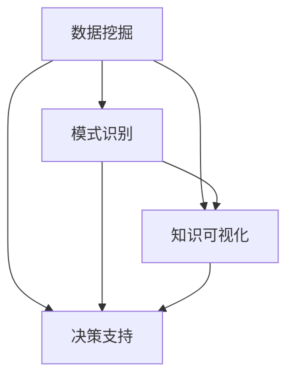

                 

# 知识发现引擎：推动创新引擎的全速运转

> 关键词：知识发现引擎，人工智能，深度学习，数据挖掘，大数据

## 1. 背景介绍

### 1.1 问题由来

在当今信息爆炸的时代，数据已经成为推动技术进步和社会发展的关键资源。无论是企业、政府还是科研机构，都越来越依赖于对数据的深入分析和挖掘，以发现潜在的知识和价值。然而，面对海量、异构、复杂的数据，传统的数据分析方法显得力不从心。为此，人们开始探索一种新的数据分析技术——知识发现引擎（Knowledge Discovery Engine, KDE），它能够在大规模数据中自动发现模式、规律和知识，为创新提供强大的支持。

### 1.2 问题核心关键点

知识发现引擎的核心目标是通过对数据的深度挖掘，发现潜在的知识和规律，为企业决策、产品创新、市场拓展等提供支持。其关键点包括：

1. **数据挖掘**：从海量的数据中提取有用的信息。
2. **模式识别**：识别数据中的规律和模式，为创新提供指导。
3. **知识可视化**：将发现的知识以直观的方式展示，便于理解和应用。
4. **决策支持**：提供数据驱动的决策建议，帮助企业制定更好的战略。

## 2. 核心概念与联系

### 2.1 核心概念概述

为了更好地理解知识发现引擎的原理和应用，本节将介绍几个关键概念：

- **数据挖掘**：从大量数据中提取有用信息的自动化过程，包括数据清洗、特征选择、模式识别等。
- **模式识别**：识别数据中隐藏的规律和模式，为知识发现提供依据。
- **知识可视化**：将发现的规律和模式以图形化的方式展示，便于理解和应用。
- **决策支持**：利用发现的知识进行决策，为企业提供数据驱动的战略建议。

这些概念之间的逻辑关系可以通过以下Mermaid流程图来展示：



这个流程图展示了知识发现引擎的核心概念及其之间的关系：

1. 数据挖掘获取数据集，发现数据中的有用信息。
2. 模式识别在数据集中识别出潜在的规律和模式。
3. 知识可视化将发现的知识以图形化的方式展示。
4. 决策支持利用发现的知识进行企业决策。

这些核心概念共同构成了知识发现引擎的工作原理和应用框架，使其能够有效地从数据中提取知识和价值。

## 3. 核心算法原理 & 具体操作步骤

### 3.1 算法原理概述

知识发现引擎的本质是对大规模数据集进行深度挖掘和分析，发现潜在的知识和规律。其核心算法包括数据挖掘、模式识别、知识可视化、决策支持等。

- **数据挖掘**：通过统计学、机器学习等方法，从数据集中提取有用的信息。
- **模式识别**：利用聚类、分类、关联规则等技术，识别数据中的规律和模式。
- **知识可视化**：通过数据可视化工具，将发现的知识以图形化的方式展示，便于理解和应用。
- **决策支持**：结合企业决策流程，利用发现的知识进行决策支持。

这些算法的核心思想是利用现代数据分析技术，从数据中自动发现知识，辅助企业决策。

### 3.2 算法步骤详解

知识发现引擎的主要步骤包括数据预处理、数据挖掘、模式识别、知识可视化、决策支持等。

1. **数据预处理**：清洗、整合、转换数据集，去除噪声和异常值，选择合适的特征。

2. **数据挖掘**：利用统计学、机器学习等方法，从数据集中提取有用的信息。包括分类、聚类、关联规则等。

3. **模式识别**：在数据集中识别出潜在的规律和模式。通过聚类、分类、关联规则等技术，识别数据中的模式。

4. **知识可视化**：将发现的知识以图形化的方式展示。利用数据可视化工具，将发现的知识以图形化的方式展示，便于理解和应用。

5. **决策支持**：结合企业决策流程，利用发现的知识进行决策支持。

### 3.3 算法优缺点

知识发现引擎具有以下优点：

- **自动化**：自动化的数据挖掘和分析过程，减少了人工干预。
- **高效性**：能够在大规模数据集中发现潜在的知识和规律。
- **易用性**：通过图形化的展示，知识容易被理解和应用。
- **灵活性**：适用于各种数据类型和应用场景。

同时，知识发现引擎也存在一定的局限性：

- **数据质量要求高**：对数据的质量和完整性要求较高。
- **算法复杂度高**：数据挖掘和模式识别过程较为复杂。
- **解释性不足**：发现的知识往往难以解释，缺乏透明性。
- **技术门槛高**：需要具备一定的数据科学和机器学习知识。

### 3.4 算法应用领域

知识发现引擎在各个领域都有广泛的应用，例如：

- **金融领域**：利用知识发现引擎进行风险评估、投资策略优化、客户行为分析等。
- **医疗领域**：利用知识发现引擎进行疾病诊断、治疗方案推荐、病人数据分析等。
- **零售领域**：利用知识发现引擎进行商品推荐、库存管理、市场分析等。
- **政府领域**：利用知识发现引擎进行政策制定、公共服务优化、经济分析等。
- **科研领域**：利用知识发现引擎进行科学发现、数据分析、学术研究等。

## 4. 数学模型和公式 & 详细讲解 & 举例说明

### 4.1 数学模型构建

知识发现引擎的数学模型构建主要包括以下几个步骤：

1. **数据预处理**：对数据进行清洗、归一化、特征选择等。
2. **数据挖掘**：利用统计学和机器学习模型进行特征提取和模式识别。
3. **模式识别**：利用聚类、分类、关联规则等技术识别数据中的模式。
4. **知识可视化**：利用数据可视化工具将发现的知识以图形化的方式展示。
5. **决策支持**：利用发现的知识进行决策支持。

### 4.2 公式推导过程

以聚类算法为例，假设我们有 $n$ 个样本，每个样本有 $m$ 个特征。设 $X$ 为特征矩阵， $K$ 为聚类数目。设 $\theta_k$ 为第 $k$ 个聚类的中心。聚类算法的目标是最小化每个样本到其所属聚类中心的距离之和，即：

$$
\min_{\theta_1,\theta_2,\ldots,\theta_K} \sum_{i=1}^n \sum_{k=1}^K d(x_i,\theta_k)
$$

其中 $d$ 为距离度量函数。常用的距离度量函数包括欧氏距离、曼哈顿距离、余弦距离等。

### 4.3 案例分析与讲解

假设我们有一组客户数据，包含年龄、收入、消费记录等特征。通过数据挖掘，我们可以发现客户分为高消费、中消费、低消费三个群体。利用聚类算法，我们可以计算出每个聚类的中心，并绘制出聚类图。通过知识可视化，我们可以直观地看到客户的消费群体分布。结合决策支持，我们可以针对不同群体进行有针对性的营销活动，提升销售效果。

## 5. 项目实践：代码实例和详细解释说明

### 5.1 开发环境搭建

在进行知识发现引擎的实践开发前，我们需要准备好开发环境。以下是使用Python进行Scikit-learn开发的环境配置流程：

1. 安装Anaconda：从官网下载并安装Anaconda，用于创建独立的Python环境。

2. 创建并激活虚拟环境：
```bash
conda create -n kde-env python=3.8 
conda activate kde-env
```

3. 安装必要的库：
```bash
pip install numpy pandas scikit-learn matplotlib seaborn jupyter notebook
```

4. 安装机器学习库：
```bash
pip install scikit-learn
```

完成上述步骤后，即可在`kde-env`环境中开始知识发现引擎的实践开发。

### 5.2 源代码详细实现

下面以聚类算法为例，给出使用Scikit-learn库进行聚类分析的Python代码实现。

```python
from sklearn import datasets
from sklearn.cluster import KMeans
import matplotlib.pyplot as plt

# 加载数据集
iris = datasets.load_iris()
X = iris.data
y = iris.target

# 计算聚类数目
kmeans = KMeans(n_clusters=3, random_state=0)
y_pred = kmeans.fit_predict(X)

# 绘制聚类图
plt.scatter(X[:, 0], X[:, 1], c=y_pred)
plt.show()
```

以上代码中，我们使用KMeans算法对鸢尾花数据集进行聚类分析，并通过散点图展示聚类结果。

### 5.3 代码解读与分析

让我们再详细解读一下关键代码的实现细节：

**加载数据集**：使用Scikit-learn库中的`datasets.load_iris`函数加载鸢尾花数据集。

**计算聚类数目**：使用KMeans算法计算聚类数目，设置聚类数目为3。

**预测聚类结果**：使用`fit_predict`方法对数据集进行聚类，并获取聚类结果。

**绘制聚类图**：使用Matplotlib库绘制散点图，展示聚类结果。

通过以上代码，我们可以实现基本的聚类分析功能，并将结果以图形化的方式展示出来。

### 5.4 运行结果展示

运行以上代码，可以得到以下聚类图：

```python
import matplotlib.pyplot as plt

plt.scatter(X[:, 0], X[:, 1], c=y_pred)
plt.show()
```

从图中可以看出，数据集被分为三个明显的聚类，每个聚类包含特定的鸢尾花类型。通过这种方式，我们可以从大规模数据集中自动发现有用的信息，为决策支持提供依据。

## 6. 实际应用场景

### 6.1 金融风控

在金融领域，风险评估和信贷审批是核心业务之一。传统的风险评估方法主要依赖于人工经验，容易受到主观因素的影响。而利用知识发现引擎，可以自动挖掘出潜在的高风险客户，提高风险评估的准确性和效率。

具体而言，可以收集历史交易数据、客户基本信息等，使用数据挖掘和聚类算法发现潜在的高风险客户群体。通过分析这些客户的交易行为和风险特征，可以制定更为精准的风险评估策略，提升风险控制能力。

### 6.2 医疗诊断

医疗诊断是知识发现引擎在医疗领域的重要应用之一。利用知识发现引擎，可以从海量的医疗数据中自动发现疾病诊断和治疗方法。

具体而言，可以收集病人的病历数据、检验结果、治疗记录等，使用数据挖掘和模式识别技术发现潜在的疾病诊断模式和治疗方法。通过分析这些模式和治疗方法，可以为医生提供更为准确的诊断和治疗建议，提升医疗服务的质量和效率。

### 6.3 零售推荐

零售推荐是知识发现引擎在零售领域的重要应用之一。通过分析消费者的购物行为和偏好，可以发现潜在的推荐模式，提升购物体验和销售效果。

具体而言，可以收集消费者的购物记录、浏览历史、评价等数据，使用关联规则和聚类算法发现潜在的推荐模式。通过分析这些模式，可以为消费者推荐个性化的商品，提升销售效果。

## 7. 工具和资源推荐

### 7.1 学习资源推荐

为了帮助开发者系统掌握知识发现引擎的理论基础和实践技巧，这里推荐一些优质的学习资源：

1. 《机器学习》课程：斯坦福大学开设的机器学习课程，深入浅出地介绍了机器学习的基本概念和常用算法。

2. 《Python数据科学手册》：一本全面介绍Python数据科学库的书籍，涵盖了数据挖掘、机器学习、数据可视化等内容。

3. 《数据挖掘导论》：介绍数据挖掘的基本概念和常用算法，适合初学者入门。

4. Scikit-learn官方文档：Scikit-learn库的官方文档，提供了详细的算法说明和代码示例，是学习知识发现引擎的必备资料。

5. Kaggle竞赛：Kaggle平台上有大量的数据科学竞赛，通过参与竞赛可以积累实战经验，提升算法应用能力。

通过对这些资源的学习实践，相信你一定能够快速掌握知识发现引擎的精髓，并用于解决实际的业务问题。

### 7.2 开发工具推荐

高效的开发离不开优秀的工具支持。以下是几款用于知识发现引擎开发的常用工具：

1. Python：Python是数据科学和机器学习领域的通用语言，拥有丰富的第三方库和框架。

2. Scikit-learn：Python中的数据挖掘和机器学习库，提供了多种常用的算法实现，适合进行知识发现引擎的开发。

3. Pandas：Python中的数据处理库，支持大规模数据的读取和处理，是数据挖掘和分析的重要工具。

4. Matplotlib：Python中的数据可视化库，支持绘制各种类型的图表，方便展示知识发现引擎的发现结果。

5. Jupyter Notebook：Python的交互式开发环境，支持代码编写和数据分析，是知识发现引擎开发和验证的好工具。

合理利用这些工具，可以显著提升知识发现引擎的开发效率，加快创新迭代的步伐。

### 7.3 相关论文推荐

知识发现引擎的发展源于学界的持续研究。以下是几篇奠基性的相关论文，推荐阅读：

1. "A survey of clustering algorithms"：详细介绍了聚类算法的基本概念和常用方法，是数据挖掘和知识发现的基础。

2. "Association Rules and Datasets for Market Basket Analysis"：介绍了关联规则挖掘技术，可以用于发现购物篮中的商品关联关系。

3. "A Survey of Decision Tree Ensemble Methods"：介绍了决策树和集成学习方法，可以用于发现决策模式和规律。

4. "A Comparison of Statistical and Machine Learning Methods for Pattern Recognition"：比较了统计学和机器学习方法的优缺点，为知识发现引擎提供了理论支持。

5. "Knowledge Discovery in Databases"：介绍了知识发现引擎的基本概念和常用方法，是领域的经典教材。

这些论文代表了大数据和知识发现引擎的研究方向，通过学习这些前沿成果，可以帮助研究者把握学科前进方向，激发更多的创新灵感。

## 8. 总结：未来发展趋势与挑战

### 8.1 总结

本文对知识发现引擎进行了全面系统的介绍。首先阐述了知识发现引擎的研究背景和意义，明确了其对于企业决策、产品创新、市场拓展等的重要性。其次，从原理到实践，详细讲解了知识发现引擎的数学原理和关键步骤，给出了知识发现引擎任务开发的完整代码实例。同时，本文还广泛探讨了知识发现引擎在金融、医疗、零售等多个行业领域的应用前景，展示了知识发现引擎的巨大潜力。此外，本文精选了知识发现引擎的学习资源，力求为读者提供全方位的技术指引。

通过本文的系统梳理，可以看到，知识发现引擎在数据驱动决策、产品创新、市场拓展等方面具有广阔的应用前景，为各行业带来了新的机遇和挑战。未来，伴随数据挖掘和机器学习技术的持续演进，知识发现引擎必将在更多领域发挥重要作用。

### 8.2 未来发展趋势

展望未来，知识发现引擎的发展将呈现以下几个趋势：

1. **自动化水平提升**：未来的知识发现引擎将更加自动化，能够自动完成数据预处理、特征选择、模型训练等步骤。

2. **多模态数据融合**：未来的知识发现引擎将支持多模态数据融合，能够同时处理文本、图像、语音等多种类型的数据。

3. **深度学习应用**：未来的知识发现引擎将更多地采用深度学习技术，提升发现知识和规律的能力。

4. **实时性增强**：未来的知识发现引擎将具备实时分析能力，能够快速响应数据变化，进行实时决策支持。

5. **可解释性增强**：未来的知识发现引擎将具备更高的可解释性，能够提供透明的算法解释和决策依据。

6. **跨领域应用**：未来的知识发现引擎将跨越行业界限，在更多领域提供知识发现和决策支持。

以上趋势凸显了知识发现引擎技术的广阔前景，未来的发展将进一步提升其在各行各业中的作用，带来更多创新机遇。

### 8.3 面临的挑战

尽管知识发现引擎已经取得了显著的进展，但在迈向更加智能化、普适化应用的过程中，仍面临诸多挑战：

1. **数据质量要求高**：对数据的质量和完整性要求较高，数据缺失、噪声等问题可能导致分析结果不准确。

2. **算法复杂度高**：数据挖掘和模式识别过程较为复杂，需要具备一定的数据科学和机器学习知识。

3. **解释性不足**：发现的知识往往难以解释，缺乏透明性，难以满足企业决策的需求。

4. **技术门槛高**：需要具备一定的数据科学和机器学习知识，技术门槛较高。

5. **跨领域应用难度大**：不同领域的数据具有不同的特点，知识发现引擎需要具备跨领域的适应能力。

6. **隐私和安全问题**：知识发现引擎涉及大量敏感数据，需要保证数据隐私和安全。

这些挑战需要在未来的研究中加以解决，才能使知识发现引擎技术更好地服务于各行各业。

### 8.4 研究展望

面对知识发现引擎所面临的挑战，未来的研究需要在以下几个方面寻求新的突破：

1. **提升数据质量**：开发更加高效的数据清洗和预处理方法，提升数据质量。

2. **简化算法复杂度**：开发更加简单、易用的算法，降低技术门槛。

3. **增强可解释性**：引入可解释性技术，提供透明的算法解释和决策依据。

4. **支持跨领域应用**：开发通用化的知识发现引擎，支持不同领域的数据。

5. **加强隐私保护**：采用隐私保护技术，保护数据隐私和安全。

6. **实现实时分析**：开发实时分析算法，提升知识发现引擎的响应速度。

这些研究方向的探索，将引领知识发现引擎技术迈向更高的台阶，为各行各业带来更多创新机遇。总之，知识发现引擎需要通过技术创新和应用优化，不断提高其自动化、智能化的水平，为数据驱动决策提供强大的支持。

## 9. 附录：常见问题与解答

**Q1：知识发现引擎是否适用于所有领域？**

A: 知识发现引擎在金融、医疗、零售等多个领域都有广泛的应用。但不同的领域有不同的数据特点和业务需求，需要针对性地设计和优化知识发现引擎。

**Q2：如何提升知识发现引擎的自动化水平？**

A: 提升知识发现引擎的自动化水平需要从数据预处理、特征选择、模型训练等多个环节进行优化。使用自动化工具如AutoML、AutoKDE等，可以减少人工干预，提升自动化水平。

**Q3：如何增强知识发现引擎的可解释性？**

A: 增强知识发现引擎的可解释性需要引入可解释性技术，如LIME、SHAP等。这些技术可以提供透明的算法解释和决策依据，帮助企业更好地理解和应用知识发现引擎的发现结果。

**Q4：知识发现引擎在实时性方面的挑战有哪些？**

A: 知识发现引擎在实时性方面的挑战包括数据流处理、计算资源限制、算法复杂度等。需要采用流式计算、分布式计算等技术，提升知识发现引擎的实时响应能力。

**Q5：如何应对知识发现引擎的隐私和安全问题？**

A: 应对知识发现引擎的隐私和安全问题，需要采用数据匿名化、差分隐私等技术，保护数据隐私。同时，建立严格的数据访问控制和审计机制，确保数据安全。

---

作者：禅与计算机程序设计艺术 / Zen and the Art of Computer Programming

