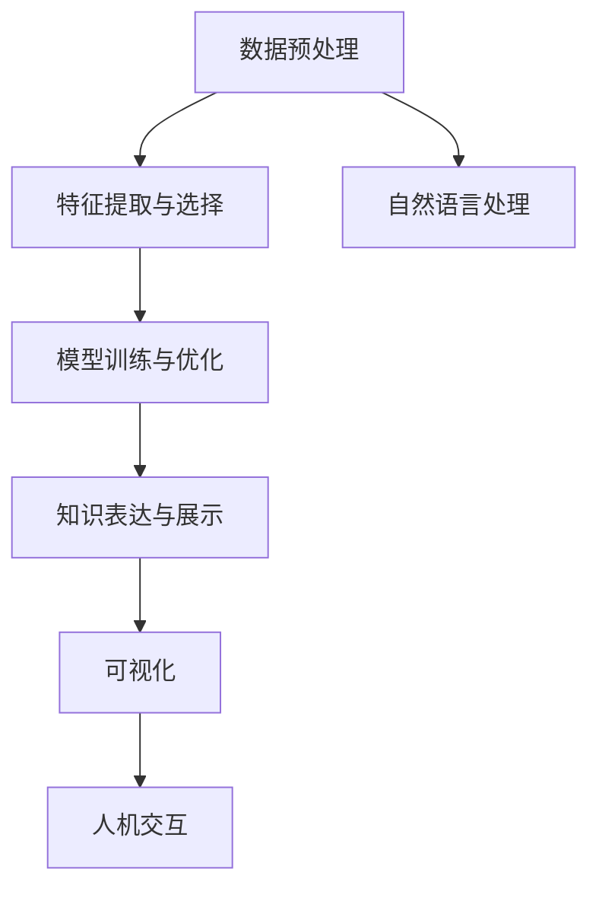

                 

## 1. 背景介绍

### 1.1 问题由来
随着大数据和人工智能技术的迅猛发展，医疗健康行业迎来了全新的数字化转型机遇。海量的医疗数据蕴含着丰富的信息，但如何高效地从中发现和提取有用的知识，一直是困扰医疗领域的重大挑战。传统的数据分析和挖掘方法往往依赖专家知识和经验，耗时耗力且难以覆盖全面。

知识发现引擎(Knowledge Discovery Engine, KDE)的出现，为医疗健康行业提供了一种全新的智能化、自动化的知识获取方式。通过结合大数据、人工智能和自然语言处理技术，KDE能够从电子病历、医学文献、基因组数据等多种来源中自动提取、整合和挖掘有价值的知识，推动医疗决策的智慧化、精准化和个性化。

### 1.2 问题核心关键点
知识发现引擎的核心在于通过数据驱动的方式，自动识别和发现知识模式。其核心方法包括：

- **数据预处理**：清洗和整理原始数据，消除噪音和异常值。
- **特征提取与选择**：从原始数据中提取有意义的特征，并通过算法选择最相关特征。
- **模型训练与优化**：选择合适的机器学习模型，如分类、聚类、关联规则等，并优化模型参数。
- **知识表达与展示**：将发现的知识转化为可视化的报告、图表或规则，供医生决策参考。
- **人机交互**：通过智能问答系统等技术，与用户进行自然语言交互，辅助知识发现过程。

这些关键点共同构成了知识发现引擎的工作框架，使其能够在多种医疗场景中发挥强大的知识发现能力。

## 2. 核心概念与联系

### 2.1 核心概念概述

为更好地理解知识发现引擎的工作原理和优化方向，本节将介绍几个密切相关的核心概念：

- **知识发现(Knowledge Discovery)**：从大量数据中自动识别、抽取、综合和提炼有用知识的过程。知识发现技术在金融、零售、医疗等领域广泛应用，通过智能数据分析提升决策质量。

- **知识工程(Knowledge Engineering)**：将领域专家知识形式化和结构化，转化为机器可理解和处理的知识库。知识工程在知识发现中起着重要的桥梁作用，促进专家知识与数据驱动技术的融合。

- **数据挖掘(Data Mining)**：从数据集中自动发现有用模式和规律的过程。数据挖掘是知识发现的重要技术手段，涵盖分类、聚类、关联规则等多个方向。

- **机器学习(Machine Learning)**：通过算法从数据中学习规律和知识，并应用于预测、分类、回归等任务。机器学习是知识发现的核心工具，推动了数据驱动的决策模式。

- **自然语言处理(Natural Language Processing, NLP)**：使计算机能够理解和处理人类自然语言的技术。NLP在知识发现中用于文本数据的预处理、特征提取、情感分析等，极大地丰富了知识源和处理方式。

- **可视化(Visualization)**：将复杂数据和知识以图形或图表的形式呈现出来，便于用户理解和分析。可视化是知识发现结果的重要展示方式，帮助用户快速获取关键信息。

这些核心概念之间的逻辑关系可以通过以下Mermaid流程图来展示：



这个流程图展示了几项关键任务的逻辑关系：

1. 原始数据经过预处理、特征提取和模型训练，得到中间知识。
2. 中间知识通过特征选择和模型优化进一步精炼，形成最终知识。
3. 最终知识通过可视化展示和自然语言处理技术，转化为用户可理解的形式。
4. 通过人机交互系统，知识发现引擎与用户进行实时互动，动态调整发现过程。

## 3. 核心算法原理 & 具体操作步骤
### 3.1 算法原理概述

知识发现引擎的实现过程可以分为数据预处理、特征提取、模型训练、知识表达和可视化五个步骤。以下是每一步的具体算法原理：

### 3.2 算法步骤详解

**Step 1: 数据预处理**

数据预处理是知识发现的第一步，其目标是从原始数据中清洗、整理和提取有用信息，消除噪音和异常值。常用的预处理方法包括：

- **缺失值处理**：对于缺失值，可以采用插值、删除、均值填补等方法进行填补。
- **数据清洗**：去除重复记录、纠正错误数据、处理不一致的数据格式等。
- **归一化**：将不同量纲的数据进行归一化，如标准化、归一化至[0,1]区间等。
- **特征编码**：将分类变量和文本特征进行编码，便于机器学习算法处理。

**Step 2: 特征提取与选择**

特征提取是从原始数据中提取有意义的特征，通过算法选择最相关的特征。常用的特征提取方法包括：

- **统计特征**：计算均值、中位数、方差、标准差等统计量。
- **文本特征**：提取TF-IDF、词袋模型、词嵌入等文本特征。
- **时间序列特征**：提取滑动窗口、自相关、差分等时间序列特征。

特征选择方法包括：

- **过滤方法**：基于统计学和领域知识，筛选出最相关的特征。
- **包装方法**：通过构建模型和评估特征，逐步选择最优特征。
- **嵌入方法**：在模型训练过程中，自动选择最优特征。

**Step 3: 模型训练与优化**

模型训练是知识发现的第二步，其目标是通过训练机器学习模型，识别数据中的有用规律和模式。常用的模型包括：

- **分类模型**：如逻辑回归、支持向量机、随机森林等。
- **聚类模型**：如K-Means、DBSCAN、层次聚类等。
- **关联规则**：如Apriori、FP-Growth等。

模型优化方法包括：

- **交叉验证**：通过交叉验证，评估模型性能和泛化能力。
- **正则化**：通过L1、L2正则化，避免模型过拟合。
- **集成学习**：通过Bagging、Boosting等方法，提高模型准确率。

**Step 4: 知识表达与展示**

知识表达是将发现的知识转化为可视化的形式，便于用户理解和分析。常用的知识表达方法包括：

- **图表展示**：如柱状图、折线图、饼图等，直观展示数据分布和关系。
- **报告生成**：通过文本报告，详细描述发现的知识模式和规律。
- **仪表盘**：通过动态仪表盘，实时展示关键指标和趋势。

**Step 5: 人机交互**

人机交互是知识发现的重要环节，通过智能问答系统等技术，与用户进行自然语言交互，辅助知识发现过程。

- **智能问答系统**：通过自然语言处理技术，理解用户问题，并返回相关知识。
- **推荐系统**：根据用户兴趣和行为，推荐最相关的知识内容。
- **反馈机制**：通过用户反馈，调整发现过程和知识展示方式。

### 3.3 算法优缺点

知识发现引擎具有以下优点：

- **自动化高效**：通过自动化的处理和分析，显著提高知识发现的效率。
- **跨领域适应**：适用于多种医疗场景，如图像诊断、基因组分析、医学文献挖掘等。
- **结果可视化**：将复杂知识转化为直观易懂的图形和报告，便于用户理解和使用。
- **人机交互**：通过智能问答系统等技术，实时与用户互动，增强用户体验。

同时，该方法也存在一定的局限性：

- **数据质量要求高**：数据预处理和特征提取需要高质量的数据，对数据清洗和异常值处理要求较高。
- **模型选择困难**：选择合适的模型和算法，对领域知识和经验要求较高。
- **可解释性不足**：复杂模型和算法往往难以解释其内部决策过程，用户难以理解模型的输出结果。
- **领域适应性差**：知识发现算法在特定领域内效果较好，但跨领域适应能力有限。
- **处理速度慢**：对大规模数据集的处理时间较长，需要优化算法和硬件资源。

尽管存在这些局限性，但知识发现引擎仍是大数据驱动医疗决策的重要手段。未来相关研究将更多聚焦于提升算法效率和模型可解释性，增强领域适应性，推动知识发现技术的智能化、自动化发展。

### 3.4 算法应用领域

知识发现引擎的应用领域非常广泛，以下是几个典型的应用场景：

- **医学影像分析**：通过分析CT、MRI等医学影像，自动识别病变区域和类型。知识发现引擎可用于自动标注影像，辅助医生诊断。

- **电子病历挖掘**：从电子病历中提取关键信息，如病史、症状、诊断结果等，形成结构化知识库，供医生参考。

- **基因组数据分析**：从基因组数据中挖掘关联基因和疾病模式，揭示基因与疾病之间的关系，为个性化医疗提供依据。

- **医学文献整合**：从大量医学文献中提取关键信息，如研究结果、临床试验等，整合形成统一的医学知识库。

- **药物发现**：从化合物数据和生物信息中挖掘潜在的药物靶点，辅助新药研发。

- **智能问答系统**：通过自然语言处理技术，实时回答用户医疗咨询，提供个性化健康建议。

除了上述这些经典应用外，知识发现引擎还被创新性地应用到更多场景中，如智能监控、健康管理、医疗推荐等，为医疗健康行业的智慧化转型提供了强有力的技术支持。

## 4. 数学模型和公式 & 详细讲解  
### 4.1 数学模型构建

本节将使用数学语言对知识发现引擎的工作原理进行更加严格的刻画。

假设原始数据集为 $D=\{x_i,y_i\}_{i=1}^N$，其中 $x_i \in \mathbb{R}^d$ 为特征向量，$y_i$ 为标签。知识发现引擎的目标是从 $D$ 中自动识别模式，即找到函数 $f$ 使得：

$$
f(x_i) \approx y_i
$$

常用的知识发现算法包括：

- **分类算法**：如逻辑回归、支持向量机、决策树等。目标是找到最优函数 $f(x)$ 以最小化分类误差。
- **聚类算法**：如K-Means、层次聚类等。目标是找到一组聚类中心，使得数据点尽可能聚在同一类别中。
- **关联规则算法**：如Apriori、FP-Growth等。目标是发现数据中的频繁项集和关联规则，揭示数据的内在联系。

### 4.2 公式推导过程

以逻辑回归分类算法为例，推导其损失函数及其梯度计算公式。

假设模型 $M$ 的输出为 $\hat{y}=M(x)$，则二分类问题下的交叉熵损失函数定义为：

$$
\ell(M(x),y) = -[y\log M(x)+(1-y)\log(1-M(x))]
$$

在训练集 $D$ 上的经验风险为：

$$
\mathcal{L}(M)=\frac{1}{N}\sum_{i=1}^N \ell(M(x_i),y_i)
$$

利用梯度下降法优化损失函数，得到模型参数 $\theta$ 的更新公式为：

$$
\theta \leftarrow \theta - \eta \nabla_{\theta} \mathcal{L}(M)
$$

其中 $\eta$ 为学习率，$\nabla_{\theta} \mathcal{L}(M)$ 为损失函数对模型参数的梯度，可以通过反向传播算法高效计算。

### 4.3 案例分析与讲解

以基因组数据分析为例，推导知识发现引擎在挖掘基因与疾病关联中的应用。

基因组数据通常包含大量的基因序列和相关临床信息。知识发现引擎可以从基因序列中提取特征，如基因变异、基因表达量等，并通过分类模型如支持向量机(SVM)发现基因与疾病之间的关联。

具体步骤包括：

1. **数据预处理**：清洗基因序列数据，去除噪音和缺失值，进行归一化和特征编码。
2. **特征提取**：提取基因序列的特征，如基因变异、表达量等。
3. **模型训练**：使用支持向量机(SVM)训练模型，最小化分类误差。
4. **结果分析**：通过可视化展示和报告生成，分析基因与疾病之间的关系。

例如，某研究团队收集了数百名患者的基因组数据，通过知识发现引擎分析发现，某基因的特定变异与某种癌症的发病率显著相关。研究者可以进一步验证这一发现，并根据基因变异情况预测患者患病风险，为个性化医疗提供依据。

## 5. 项目实践：代码实例和详细解释说明
### 5.1 开发环境搭建

在进行知识发现引擎的实践前，我们需要准备好开发环境。以下是使用Python进行Pandas和Scikit-learn开发的简要环境配置流程：

1. 安装Anaconda：从官网下载并安装Anaconda，用于创建独立的Python环境。

2. 创建并激活虚拟环境：
```bash
conda create -n kde-env python=3.8 
conda activate kde-env
```

3. 安装Pandas和Scikit-learn：
```bash
conda install pandas scikit-learn
```

4. 安装各类工具包：
```bash
pip install numpy matplotlib jupyter notebook ipython
```

完成上述步骤后，即可在`kde-env`环境中开始项目实践。

### 5.2 源代码详细实现

以下是使用Pandas和Scikit-learn实现一个简单的医学影像分类器的代码示例：

```python
import pandas as pd
from sklearn.model_selection import train_test_split
from sklearn.ensemble import RandomForestClassifier
from sklearn.metrics import classification_report
from sklearn.preprocessing import StandardScaler

# 读取数据
df = pd.read_csv('medical_imaging.csv')

# 数据预处理
X = df.drop('label', axis=1)
y = df['label']
X = StandardScaler().fit_transform(X)

# 划分训练集和测试集
X_train, X_test, y_train, y_test = train_test_split(X, y, test_size=0.2, random_state=42)

# 训练模型
clf = RandomForestClassifier(n_estimators=100)
clf.fit(X_train, y_train)

# 评估模型
y_pred = clf.predict(X_test)
print(classification_report(y_test, y_pred))
```

### 5.3 代码解读与分析

让我们再详细解读一下关键代码的实现细节：

**数据预处理**：
- 使用Pandas的`read_csv`函数读取CSV格式的数据集。
- 通过`drop`方法删除标签列。
- 使用`StandardScaler`对特征进行归一化处理，保证模型训练的稳定性。

**模型训练**：
- 使用Scikit-learn的`train_test_split`函数将数据集划分为训练集和测试集。
- 使用`RandomForestClassifier`构建随机森林分类器。
- 通过`fit`方法训练模型，最小化分类误差。

**模型评估**：
- 使用训练好的模型对测试集进行预测，得到预测结果。
- 使用`classification_report`函数输出分类准确率、召回率和F1值等指标。

**结果可视化**：
- 可以使用`matplotlib`库绘制混淆矩阵，直观展示模型分类效果。
- 可以通过Jupyter Notebook等工具，展示数据预处理、模型训练和评估的每个步骤，便于调试和优化。

通过上述代码示例，可以初步掌握知识发现引擎的实现流程，并在实际项目中进行应用和扩展。

## 6. 实际应用场景
### 6.1 智能监控

智能监控系统在医疗健康行业中的应用非常广泛，可以通过实时监测患者的生理指标，及时发现异常情况，防止病情恶化。知识发现引擎可以结合多种传感器数据，自动识别和预测潜在风险。

具体而言，智能监控系统可以采集心率、血压、血糖、呼吸频率等生理数据，通过知识发现引擎进行分析和预测。例如，知识发现引擎可以识别出某患者的血压持续偏高，从而发出预警，并建议医生进行进一步检查和治疗。

### 6.2 健康管理

健康管理是知识发现引擎的重要应用场景之一。通过智能推荐系统，知识发现引擎可以根据用户的健康数据，提供个性化的健康建议和行为指导。

例如，知识发现引擎可以分析用户的运动数据、饮食记录、睡眠习惯等，通过机器学习模型发现健康模式，并生成个性化的健康报告。用户可以根据报告调整生活习惯，改善健康状况。

### 6.3 医疗推荐

医疗推荐系统通过知识发现引擎，根据患者的病情和医疗记录，推荐最合适的治疗方案和药品。

知识发现引擎可以从电子病历和医学文献中挖掘相关信息，如疾病的常见症状、治疗效果、药物副作用等。通过匹配用户的病情，推荐最佳治疗方案和药品，提高医疗效率和效果。

### 6.4 未来应用展望

随着知识发现引擎的不断发展，其在医疗健康行业的应用前景更加广阔。

未来的知识发现引擎将更加智能化、自动化，能够自动发现并解释数据中的复杂模式。例如，结合深度学习技术，知识发现引擎可以自动识别图像中的病变区域，并生成详细的诊断报告。

此外，知识发现引擎还将更加个性化和场景化，能够根据不同场景和需求，提供定制化的解决方案。例如，针对儿童健康、老年健康、慢性疾病管理等不同需求，开发专门的知识发现引擎，提供精准化、智能化的健康管理服务。

## 7. 工具和资源推荐
### 7.1 学习资源推荐

为了帮助开发者系统掌握知识发现引擎的理论基础和实践技巧，这里推荐一些优质的学习资源：

1. 《Python数据分析实战》系列书籍：系统介绍Pandas、Scikit-learn等工具的使用，适合初学者和进阶者。

2. 《统计学习方法》课程：清华大学开设的机器学习课程，涵盖各种统计学习方法，并结合实际应用案例。

3. 《机器学习实战》书籍：讲解机器学习模型的实现和调参技巧，适合实战练习。

4. 《自然语言处理入门》课程：北京大学开设的NLP入门课程，涵盖自然语言处理的理论和实践。

5. 《数据科学导论》书籍：全面介绍数据科学的基本概念和技术，适合零基础学习者。

通过对这些资源的学习实践，相信你一定能够快速掌握知识发现引擎的核心技术和应用方法。

### 7.2 开发工具推荐

高效的开发离不开优秀的工具支持。以下是几款用于知识发现引擎开发的常用工具：

1. Jupyter Notebook：强大的交互式编程环境，支持Python、R等多种编程语言，便于代码调试和文档记录。

2. PyTorch：基于Python的深度学习框架，灵活动态，适用于复杂模型的构建。

3. TensorFlow：由Google主导的深度学习框架，生产部署方便，适用于大规模模型训练。

4. Apache Spark：分布式计算框架，适合处理大规模数据集，支持数据预处理和特征提取。

5. Tableau：数据可视化工具，能够将知识发现结果直观展示，便于用户理解和分析。

6. IBM Watson：AI服务平台，提供自然语言处理和知识发现等多种服务，适合企业级应用。

合理利用这些工具，可以显著提升知识发现引擎的开发效率，加快创新迭代的步伐。

### 7.3 相关论文推荐

知识发现引擎的研究源于学界的持续研究。以下是几篇奠基性的相关论文，推荐阅读：

1. "Knowledge Discovery in Databases"：由Pang-Ning Tan、Michael Steinbach、Vipin Kumar合著，是知识发现领域的经典教材，介绍了各种知识发现方法和应用。

2. "Advances in Knowledge Discovery and Data Mining"：国际知识发现和数据挖掘大会（KDD）的历年论文集，涵盖最新的研究成果和技术进展。

3. "Apriori algorithm"：由R.Agrawal等人提出的关联规则算法，是知识发现中的重要方法，广泛应用于市场篮分析、推荐系统等领域。

4. "C4.5 algorithm"：由R.Agrawal等人提出的决策树算法，是分类和聚类任务中的重要工具，具有较高的准确率和可解释性。

5. "Brute Force Counting Approach"：由G.Wang等人提出的基于暴力计算的关联规则挖掘算法，适用于处理大规模数据集。

这些论文代表了大数据驱动知识发现的研究进展，通过学习这些前沿成果，可以帮助研究者把握学科前进方向，激发更多的创新灵感。

## 8. 总结：未来发展趋势与挑战
### 8.1 总结

本文对知识发现引擎进行了全面系统的介绍。首先阐述了知识发现引擎的研究背景和意义，明确了其在大数据驱动医疗决策中的独特价值。其次，从原理到实践，详细讲解了知识发现引擎的数学原理和操作步骤，给出了知识发现任务的完整代码实现。同时，本文还广泛探讨了知识发现引擎在智能监控、健康管理、医疗推荐等多个行业领域的应用前景，展示了其广阔的应用空间。此外，本文精选了知识发现引擎的学习资源和开发工具，力求为读者提供全方位的技术指引。

通过本文的系统梳理，可以看到，知识发现引擎正在成为大数据驱动医疗决策的重要手段。其自动化、智能化的特点，将极大提升医疗决策的效率和质量，推动医疗健康行业的智慧转型。未来，伴随深度学习、自然语言处理等技术的不断进步，知识发现引擎的智能化水平将进一步提升，为医疗健康行业的智能化发展提供更加坚实的技术基础。

### 8.2 未来发展趋势

展望未来，知识发现引擎将呈现以下几个发展趋势：

1. **深度学习的应用**：结合深度学习技术，知识发现引擎可以自动识别和解释复杂模式，提高发现知识的准确性和可解释性。

2. **跨领域知识整合**：知识发现引擎将逐步整合多源异构数据，如医疗影像、基因组数据、医学文献等，形成更加全面和综合的知识库。

3. **个性化和定制化**：根据不同需求和场景，开发专门的知识发现引擎，提供定制化的解决方案，提高用户满意度。

4. **实时性增强**：通过分布式计算和模型压缩等技术，知识发现引擎将实现实时分析和预测，支持动态调整和优化。

5. **模型可解释性**：引入可解释性技术，如因果推断、模型解释器等，使知识发现过程和结果更加透明和可信。

6. **安全性保障**：结合隐私保护技术，确保知识发现过程中的数据安全和隐私保护，防止数据泄露和滥用。

以上趋势凸显了知识发现引擎的广阔前景。这些方向的探索发展，必将进一步提升知识发现引擎的智能化、自动化水平，为医疗健康行业的智慧化转型提供更加坚实的技术支撑。

### 8.3 面临的挑战

尽管知识发现引擎已经取得了一定进展，但在迈向更加智能化、普适化应用的过程中，仍面临诸多挑战：

1. **数据质量瓶颈**：原始数据的质量对知识发现结果有重大影响。如何处理缺失值、异常值等数据问题，仍是知识发现的关键挑战。

2. **模型选择困难**：选择合适的模型和算法，对领域知识和经验要求较高，需要不断优化和调参。

3. **可解释性不足**：复杂模型和算法往往难以解释其内部决策过程，用户难以理解模型的输出结果。

4. **跨领域适应性差**：知识发现引擎在特定领域内效果较好，但跨领域适应能力有限，需要结合领域知识进行优化。

5. **处理速度慢**：对大规模数据集的处理时间较长，需要优化算法和硬件资源。

6. **隐私和安全问题**：知识发现过程中涉及大量敏感数据，如何保护数据隐私和安全，是亟待解决的重要问题。

7. **技术壁垒高**：知识发现引擎需要跨领域的知识整合和处理能力，对技术和人才要求较高。

正视知识发现引擎面临的这些挑战，积极应对并寻求突破，将是大数据驱动医疗决策技术走向成熟的必由之路。

### 8.4 研究展望

面对知识发现引擎所面临的种种挑战，未来的研究需要在以下几个方面寻求新的突破：

1. **结合深度学习技术**：结合深度学习技术，如卷积神经网络、生成对抗网络等，提高知识发现引擎的自动化和智能化水平。

2. **引入多源异构数据**：结合多种数据源，如电子病历、医学影像、基因组数据等，形成更加全面和综合的知识库，提升发现知识的广度和深度。

3. **探索个性化和定制化方案**：结合用户需求和场景，开发专门的知识发现引擎，提供定制化的解决方案，提升用户体验和满意度。

4. **优化算法和硬件资源**：通过分布式计算和模型压缩等技术，提高知识发现引擎的处理速度和效率，支持实时分析和预测。

5. **提升模型可解释性**：引入因果推断、模型解释器等技术，使知识发现过程和结果更加透明和可信，增强用户信任和满意度。

6. **确保数据隐私和安全**：结合隐私保护技术，如差分隐私、联邦学习等，确保知识发现过程中的数据安全和隐私保护，防止数据泄露和滥用。

这些研究方向的探索，必将引领知识发现引擎技术迈向更高的台阶，为医疗健康行业的智慧化转型提供更加坚实的技术支撑。

## 9. 附录：常见问题与解答

**Q1：知识发现引擎是否适用于所有医疗场景？**

A: 知识发现引擎适用于多种医疗场景，如图像诊断、基因组分析、电子病历挖掘等。但对于某些特定领域，如皮肤病、罕见病等，可能还需要结合领域专家的经验，进行人工标注和验证，以确保发现知识的准确性。

**Q2：数据质量对知识发现结果有怎样的影响？**

A: 数据质量对知识发现结果有重大影响。数据中存在缺失值、异常值、噪音等问题，会直接影响发现知识的准确性和泛化能力。因此，在进行知识发现之前，需要仔细清洗和预处理数据，确保数据质量和一致性。

**Q3：如何选择合适的知识发现算法？**

A: 选择合适的知识发现算法，需要综合考虑数据特征、任务需求和算法性能等因素。常用的算法包括分类、聚类、关联规则等，可以根据任务特点进行选择和组合。例如，对于分类任务，可以使用逻辑回归、随机森林等算法；对于聚类任务，可以使用K-Means、层次聚类等算法；对于关联规则挖掘，可以使用Apriori、FP-Growth等算法。

**Q4：知识发现引擎的实现难度大吗？**

A: 知识发现引擎的实现难度较大，涉及数据预处理、特征提取、模型训练等多个环节，需要较强的数据分析和机器学习能力。但借助Python、Scikit-learn等工具，可以大大降低实现难度，简化流程。同时，开源社区提供了丰富的工具和资源，可以方便地进行代码实现和调试。

**Q5：知识发现引擎在医疗决策中的作用是什么？**

A: 知识发现引擎通过自动分析和发现数据中的有用知识，辅助医生进行诊断、治疗、决策等任务。例如，可以通过分析电子病历，发现患者的病情模式，推荐最佳治疗方案；可以通过分析基因组数据，发现疾病与基因之间的关联，指导个性化治疗。

通过上述解答，可以更好地理解知识发现引擎的核心概念和工作原理，掌握其实现方法和应用场景。相信在未来，知识发现引擎将为医疗健康行业的智能化转型提供更加坚实的技术基础，推动医疗决策的智慧化和精准化。

