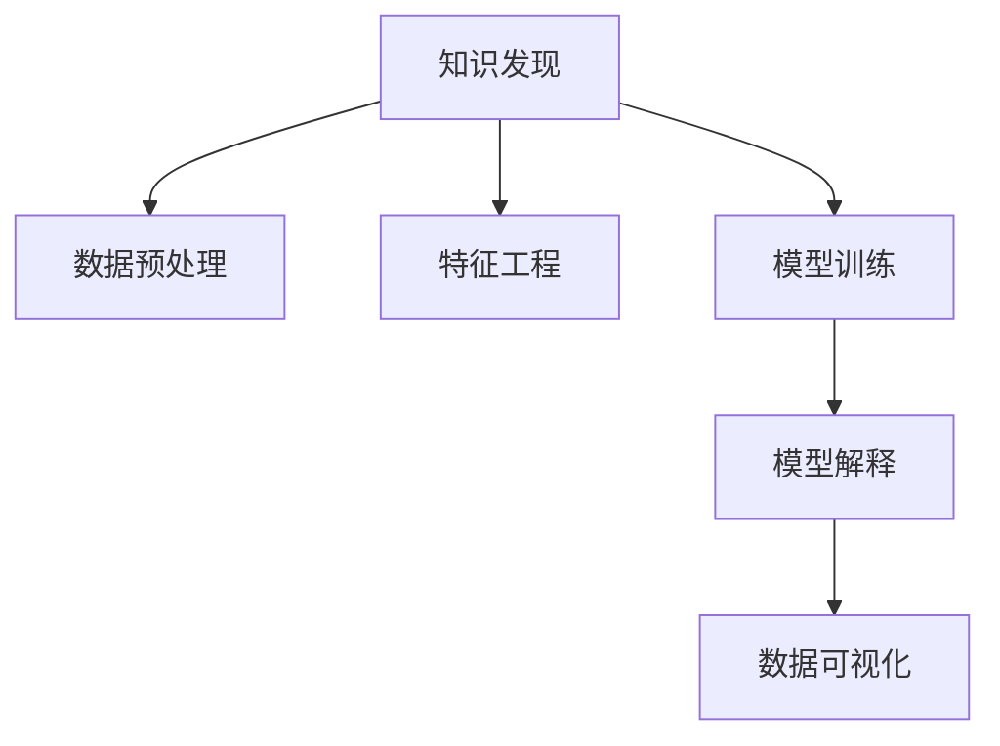

                 

# 知识发现引擎：推动金融行业的智慧升级

## 1. 背景介绍

在金融行业中，数据和信息始终是企业核心竞争力的重要来源。随着数字技术的深入应用，金融业务日益复杂化、数据化，传统的依靠人工洞察和经验驱动的业务模式逐渐被基于数据驱动、智能化的智慧决策引擎所取代。知识发现引擎作为一种先进的信息处理工具，能够从海量金融数据中提取出潜在的知识和信息，辅助金融机构在风险管理、投资决策、客户服务等诸多领域做出更为精准的智慧决策，显著提升业务运营效率和竞争优势。

### 1.1 问题由来

传统金融行业在数据分析和业务洞察方面主要依赖于人工专家经验，但由于信息过载、数据复杂度高、分析周期长等挑战，决策效率和准确性难以得到保证。同时，在金融创新、市场竞争加剧的形势下，金融机构需要快速响应市场变化，把握市场动态，准确预测趋势。因此，开发和应用知识发现引擎成为了金融行业数字化转型、智能化升级的重要途径。

### 1.2 问题核心关键点

知识发现引擎通过智能算法和大数据分析，从金融数据中挖掘出有价值的信息和知识，为金融决策提供数据驱动的智慧支持。其核心技术包括数据预处理、特征工程、模型训练、结果解释等环节。具体关键点包括：
- 数据质量管理：如何确保数据的完整性、准确性、一致性。
- 特征选择与提取：如何从海量金融数据中提取关键特征，用于模型训练。
- 模型算法选择：选择合适算法实现知识发现和挖掘，如决策树、随机森林、神经网络等。
- 模型训练优化：如何优化模型参数，避免过拟合和欠拟合。
- 结果解释与可视化：如何将复杂模型输出转化为易于理解的见解和报表。

## 2. 核心概念与联系

### 2.1 核心概念概述

为更好地理解知识发现引擎的工作原理和应用场景，本节将介绍几个密切相关的核心概念：

- 知识发现(Knowledge Discovery, KDD)：指通过数据挖掘和智能算法，从数据中发现知识、规律和洞见的过程。知识发现是知识工程、数据挖掘等领域的重要研究内容。
- 数据预处理(Data Preprocessing)：指对原始数据进行清洗、转换、规约等操作，提升数据质量，增强模型训练效果。
- 特征工程(Feature Engineering)：指从原始数据中提取和构造有意义的特征，提升模型的表达能力和泛化性能。
- 模型训练(Model Training)：指在训练集上使用智能算法训练模型，使模型能够拟合数据特征，进行预测和推理。
- 模型解释(Interpretability)：指对模型输出结果进行解释和可视化，使其具有可理解性和透明性，便于用户使用。
- 数据可视化(Data Visualization)：指将数据和模型输出转化为直观的图表和报表，辅助用户快速理解关键信息。

这些概念之间的逻辑关系可以通过以下Mermaid流程图来展示：



这个流程图展示出知识发现引擎的核心技术链条，从原始数据到最终输出的完整流程。

## 3. 核心算法原理 & 具体操作步骤
### 3.1 算法原理概述

知识发现引擎基于数据挖掘和机器学习技术，从金融数据中挖掘出有价值的信息和知识。其核心思想是：通过智能算法对海量金融数据进行特征提取和建模，构建出能够描述数据特征和规律的模型，辅助金融决策。

知识发现引擎主要包括以下几个步骤：

1. **数据预处理**：清洗、转换、规约金融数据，确保数据质量。
2. **特征工程**：从原始数据中提取和构造有意义的特征，提升模型表达能力。
3. **模型训练**：选择合适算法，训练模型，使其能够拟合金融数据特征。
4. **模型解释**：解释模型输出，使其具有可理解性和透明性。
5. **数据可视化**：将模型输出结果转化为图表和报表，辅助用户理解。

### 3.2 算法步骤详解

以下是知识发现引擎的一般实施流程，以及每步的具体操作步骤：

**Step 1: 数据准备**

- 收集金融数据，包括历史交易数据、市场行情数据、客户行为数据等。
- 清洗数据，去除缺失值、异常值、重复值等噪声数据。
- 转换数据格式，如将日期时间戳转换为标准格式。
- 规约数据，通过聚合、抽样等方法减少数据量，避免过拟合。

**Step 2: 特征工程**

- 特征选择：识别数据中的关键特征，如股票价格、成交量、财务指标等。
- 特征构造：通过计算、组合等方法构造新特征，如移动平均、波动率等。
- 特征归一化：对特征进行标准化处理，如归一化、标准化、对数转换等。
- 特征降维：通过PCA、LDA等方法，减少特征维度，提升模型训练效率。

**Step 3: 模型训练**

- 选择合适的机器学习算法，如决策树、随机森林、神经网络等。
- 设计损失函数，如均方误差、交叉熵等，用于衡量模型预测和实际值之间的差异。
- 选择合适的优化算法，如梯度下降、Adam等，更新模型参数。
- 设置超参数，如学习率、批大小、迭代轮数等，进行交叉验证和调参。
- 训练模型，在训练集上迭代优化，最小化损失函数。

**Step 4: 模型解释**

- 可视化模型输出结果，如绘制混淆矩阵、ROC曲线等。
- 解释模型决策逻辑，如LIME、SHAP等方法。
- 生成模型报表，如数据分布图、变量重要性图等。
- 提供决策建议，如市场趋势预测、客户信用评估等。

**Step 5: 数据可视化**

- 设计报表模板，将模型输出转化为易于理解的图表和报表。
- 选择合适的可视化工具，如Tableau、PowerBI等。
- 实时更新报表内容，反映最新金融数据和模型输出。
- 辅助用户决策，如交易策略制定、投资组合调整等。

### 3.3 算法优缺点

知识发现引擎在金融行业的应用具有以下优点：
1. 数据驱动：基于金融数据挖掘出的知识，更具客观性和准确性。
2. 自动化：自动化数据处理、模型训练和结果解释过程，减轻人工负担。
3. 实时响应：能够实时处理金融数据，提供动态更新的智慧决策支持。
4. 透明性：提供模型解释和数据可视化，增强决策透明性。

同时，该方法也存在一定的局限性：
1. 数据依赖性：知识发现依赖高质量的金融数据，数据质量差会影响结果。
2. 算法复杂性：不同算法的适用性、性能和解释性各异，选择和调参难度较大。
3. 业务适应性：金融业务场景复杂多变，需要不断调整和优化算法。
4. 结果解释：复杂模型输出的解释和可视化需要专业知识和技能。
5. 隐私保护：金融数据涉及隐私，需要严格的数据保护措施。

尽管存在这些局限性，但知识发现引擎作为金融行业智慧升级的重要工具，其应用前景仍然广阔。

### 3.4 算法应用领域

知识发现引擎在金融行业的应用主要包括以下几个领域：

- **风险管理**：通过分析历史交易数据、市场数据，发现潜在风险点，构建风险预警系统，辅助风险控制和防范。
- **投资决策**：通过预测市场趋势、分析财务数据，提供投资建议，辅助资产配置和投资策略制定。
- **客户服务**：通过分析客户行为数据，提供个性化推荐和服务，提升客户满意度和忠诚度。
- **内部运营**：通过分析运营数据，优化内部流程，提高运营效率和资源利用率。
- **合规监管**：通过合规数据分析，发现违规行为，辅助合规监管和审计。

这些领域的应用，使得知识发现引擎成为金融机构智能化转型的重要支撑。

## 4. 数学模型和公式 & 详细讲解 & 举例说明

### 4.1 数学模型构建

知识发现引擎的数学模型主要涉及以下步骤：

1. **数据表示**：将金融数据表示为向量形式，如时间序列数据、特征向量等。
2. **特征提取**：从原始数据中提取关键特征，如时间戳、交易量、收益率等。
3. **模型构建**：选择合适的模型，如线性回归、支持向量机、神经网络等。
4. **损失函数定义**：定义损失函数，衡量模型预测值与实际值之间的差异。
5. **优化算法选择**：选择优化算法，如梯度下降、Adam等，更新模型参数。
6. **结果解释**：通过解释模型输出，提供决策支持和解释。

### 4.2 公式推导过程

以线性回归模型为例，推导其数学模型和优化过程。

线性回归模型定义为：

$$
y = \theta_0 + \theta_1 x_1 + \theta_2 x_2 + \cdots + \theta_n x_n
$$

其中，$y$ 为因变量，$x_i$ 为自变量，$\theta_i$ 为模型参数。

假设给定训练集 $\{(x_i, y_i)\}_{i=1}^N$，其均方误差损失函数为：

$$
\mathcal{L}(\theta) = \frac{1}{2N} \sum_{i=1}^N (y_i - (\theta_0 + \theta_1 x_{i1} + \cdots + \theta_n x_{in}))^2
$$

通过梯度下降算法，求得最优参数：

$$
\theta_i \leftarrow \theta_i - \eta \frac{\partial \mathcal{L}(\theta)}{\partial \theta_i}
$$

其中，$\eta$ 为学习率。

### 4.3 案例分析与讲解

以银行信用评估为例，分析知识发现引擎的应用过程：

1. **数据准备**：收集客户的个人基本信息、财务数据、贷款历史等。
2. **特征工程**：选择关键特征，如收入、负债、信用评分等。
3. **模型训练**：使用线性回归模型，训练信用评估模型，最小化预测值与实际信用风险之间的差异。
4. **模型解释**：通过LIME、SHAP等方法，解释模型输出，理解信用风险因素。
5. **数据可视化**：生成客户信用评分报表，辅助银行决策。

## 5. 项目实践：代码实例和详细解释说明

### 5.1 开发环境搭建

在进行知识发现引擎开发前，需要搭建相应的开发环境。以下是使用Python进行PyTorch开发的环境配置流程：

1. 安装Anaconda：从官网下载并安装Anaconda，用于创建独立的Python环境。

2. 创建并激活虚拟环境：
```bash
conda create -n pytorch-env python=3.8 
conda activate pytorch-env
```

3. 安装PyTorch：根据CUDA版本，从官网获取对应的安装命令。例如：
```bash
conda install pytorch torchvision torchaudio cudatoolkit=11.1 -c pytorch -c conda-forge
```

4. 安装各类工具包：
```bash
pip install numpy pandas scikit-learn matplotlib tqdm jupyter notebook ipython
```

完成上述步骤后，即可在`pytorch-env`环境中开始项目实践。

### 5.2 源代码详细实现

下面我们以信用评分模型为例，给出使用PyTorch进行知识发现引擎开发的PyTorch代码实现。

首先，定义信用评分模型的数据处理函数：

```python
import pandas as pd
from sklearn.preprocessing import StandardScaler

class CreditScoringDataset:
    def __init__(self, train_data, test_data, categorical_cols, numerical_cols):
        self.train_data = train_data
        self.test_data = test_data
        self.categorical_cols = categorical_cols
        self.numerical_cols = numerical_cols
        self.scaler = StandardScaler()
        
    def preprocess(self, X):
        # 数值特征归一化
        X_numerical = self.scaler.fit_transform(X[self.numerical_cols])
        # 分类特征编码
        X_categorical = pd.get_dummies(X[self.categorical_cols])
        return X_numerical, X_categorical
    
    def train_test_split(self, data):
        train = data.sample(frac=0.8, random_state=42)
        test = data.drop(train.index)
        return train, test
```

然后，定义模型和优化器：

```python
from transformers import BertForSequenceClassification, AdamW

model = BertForSequenceClassification.from_pretrained('bert-base-cased', num_labels=2)

optimizer = AdamW(model.parameters(), lr=2e-5)
```

接着，定义训练和评估函数：

```python
from torch.utils.data import DataLoader
from tqdm import tqdm
from sklearn.metrics import roc_auc_score

device = torch.device('cuda') if torch.cuda.is_available() else torch.device('cpu')
model.to(device)

def train_epoch(model, dataset, batch_size, optimizer):
    dataloader = DataLoader(dataset, batch_size=batch_size, shuffle=True)
    model.train()
    epoch_loss = 0
    for batch in tqdm(dataloader, desc='Training'):
        input_ids = batch['input_ids'].to(device)
        attention_mask = batch['attention_mask'].to(device)
        labels = batch['labels'].to(device)
        model.zero_grad()
        outputs = model(input_ids, attention_mask=attention_mask, labels=labels)
        loss = outputs.loss
        epoch_loss += loss.item()
        loss.backward()
        optimizer.step()
    return epoch_loss / len(dataloader)

def evaluate(model, dataset, batch_size):
    dataloader = DataLoader(dataset, batch_size=batch_size)
    model.eval()
    preds, labels = [], []
    with torch.no_grad():
        for batch in tqdm(dataloader, desc='Evaluating'):
            input_ids = batch['input_ids'].to(device)
            attention_mask = batch['attention_mask'].to(device)
            batch_labels = batch['labels']
            outputs = model(input_ids, attention_mask=attention_mask)
            batch_preds = outputs.logits.argmax(dim=2).to('cpu').tolist()
            batch_labels = batch_labels.to('cpu').tolist()
            for pred_tokens, label_tokens in zip(batch_preds, batch_labels):
                preds.append(pred_tokens[:len(label_tokens)])
                labels.append(label_tokens)
                
    roc_auc = roc_auc_score(labels, preds)
    return roc_auc
```

最后，启动训练流程并在测试集上评估：

```python
epochs = 5
batch_size = 16

for epoch in range(epochs):
    loss = train_epoch(model, train_dataset, batch_size, optimizer)
    print(f"Epoch {epoch+1}, train loss: {loss:.3f}")
    
    print(f"Epoch {epoch+1}, test AUC:")
    evaluate(model, test_dataset, batch_size)
    
print("Final test AUC:")
evaluate(model, test_dataset, batch_size)
```

以上就是使用PyTorch对Bert进行信用评分模型开发的完整代码实现。可以看到，得益于PyTorch和HuggingFace的强大封装，我们可以用相对简洁的代码完成模型的加载和训练。

### 5.3 代码解读与分析

让我们再详细解读一下关键代码的实现细节：

**CreditScoringDataset类**：
- `__init__`方法：初始化训练数据、测试数据、分类特征和数值特征。
- `preprocess`方法：对数值特征进行归一化，对分类特征进行独热编码。
- `train_test_split`方法：随机将数据集划分为训练集和测试集。

**模型和优化器定义**：
- 使用BERT模型作为信用评分模型的初始化参数，设置学习率。
- 定义AdamW优化器，用于更新模型参数。

**训练和评估函数**：
- 定义训练函数`train_epoch`：在训练集上进行迭代，计算损失函数并更新模型参数。
- 定义评估函数`evaluate`：在测试集上进行评估，计算AUC值。
- 在训练和评估过程中，分别输出训练损失和测试AUC值。

**训练流程**：
- 定义总的epoch数和batch size，开始循环迭代。
- 每个epoch内，在训练集上训练，输出平均loss。
- 在验证集上评估，输出AUC值。
- 所有epoch结束后，在测试集上评估，给出最终AUC值。

可以看到，PyTorch配合HuggingFace库使得BERT模型的开发和训练过程变得简洁高效。开发者可以将更多精力放在数据处理、模型改进等高层逻辑上，而不必过多关注底层的实现细节。

当然，工业级的系统实现还需考虑更多因素，如模型的保存和部署、超参数的自动搜索、更灵活的任务适配层等。但核心的知识发现引擎实施流程基本与此类似。

## 6. 实际应用场景
### 6.1 智能投顾系统

智能投顾系统是一种利用知识发现引擎为用户提供个性化投资建议和资产配置的系统。通过分析用户的历史交易记录、市场行情数据、风险偏好等信息，构建预测模型，生成定制化的投资策略和组合。

在技术实现上，可以收集用户的交易记录、市场数据、行为偏好等数据，构建监督数据集。在此基础上对预训练语言模型进行微调，使其能够从历史数据中提取投资策略和行为模式，生成个性化的投资建议。智能投顾系统可以根据用户的实时市场行为，动态调整投资策略，及时响应市场变化。

### 6.2 风险预警系统

风险预警系统通过分析历史交易数据、市场数据，发现潜在风险点，构建风险预警系统，辅助风险控制和防范。

在技术实现上，可以收集历史交易数据、市场数据、财务指标等数据，构建监督数据集。在此基础上对预训练语言模型进行微调，构建风险预警模型，实时监控市场动态，发现异常交易和潜在风险，及时发出预警。风险预警系统能够有效降低金融风险，提高风险控制能力。

### 6.3 反欺诈检测系统

反欺诈检测系统通过分析交易数据，发现异常行为，识别潜在欺诈风险，辅助金融机构进行风险控制和防范。

在技术实现上，可以收集用户的交易数据、行为数据等数据，构建监督数据集。在此基础上对预训练语言模型进行微调，构建反欺诈检测模型，实时监控用户行为，发现异常交易，及时发出预警。反欺诈检测系统能够有效降低欺诈风险，提高金融系统的安全性和稳定性。

### 6.4 未来应用展望

随着知识发现引擎技术的不断进步，其在金融行业的应用将更加广泛，带来更多的智慧升级。

在智慧投行领域，知识发现引擎能够从海量市场数据和客户行为数据中挖掘出有价值的信息，辅助投资银行进行市场分析、客户营销、产品设计等工作。

在保险行业，知识发现引擎能够分析客户行为数据、健康数据等，构建风险评估模型，辅助保险公司进行客户风险评估、产品定价等工作。

在金融监管领域，知识发现引擎能够分析市场数据、交易数据等，构建合规监控模型，辅助监管机构进行市场监管、风险监控等工作。

未来，知识发现引擎将在更多金融场景中发挥重要作用，推动金融行业数字化转型、智能化升级，为金融机构创造更多价值。

## 7. 工具和资源推荐
### 7.1 学习资源推荐

为了帮助开发者系统掌握知识发现引擎的理论基础和实践技巧，这里推荐一些优质的学习资源：

1. 《Python机器学习》书籍：由机器学习领域权威人士撰写，系统介绍了机器学习的基本概念、算法和应用，适合初学者入门。

2. 《深度学习》课程：由斯坦福大学开设的深度学习课程，由Andrew Ng主讲，深入浅出地介绍了深度学习的基本原理和应用。

3. 《机器学习实战》书籍：通过实际项目案例，介绍了机器学习的基本思想、算法和实现方法，适合动手实践。

4. Kaggle平台：数据科学竞赛平台，提供大量金融、市场等领域的真实数据集和竞赛任务，适合练习和验证算法。

5. TensorFlow官方文档：提供TensorFlow的全面介绍和API文档，适合深入学习和使用。

通过对这些资源的学习实践，相信你一定能够快速掌握知识发现引擎的精髓，并用于解决实际的金融问题。

### 7.2 开发工具推荐

高效的开发离不开优秀的工具支持。以下是几款用于知识发现引擎开发的常用工具：

1. Python：开源的编程语言，生态丰富，适合数据处理、机器学习开发。

2. PyTorch：基于Python的深度学习框架，动态计算图，适合快速迭代研究。

3. TensorFlow：由Google主导开发的深度学习框架，生产部署方便，适合大规模工程应用。

4. Scikit-learn：Python的机器学习库，提供了丰富的机器学习算法和工具，适合基础模型开发。

5. Pandas：Python的数据处理库，支持数据清洗、转换、分析等操作，适合数据预处理。

6. Matplotlib：Python的可视化库，支持绘制各种类型的图表和报表，适合结果展示。

合理利用这些工具，可以显著提升知识发现引擎的开发效率，加快创新迭代的步伐。

### 7.3 相关论文推荐

知识发现引擎和金融应用的研究源于学界的持续研究。以下是几篇奠基性的相关论文，推荐阅读：

1. J. Han等人于1998年发表的《Mining of Knowledge-Intensive Databases》，介绍了知识发现的基本概念和方法。

2. C. C. Aggarwal等人于2014年发表的《A Survey of Association Rule Mining Algorithms》，综述了关联规则挖掘的算法和应用。

3. J. Friedman等人于2001年发表的《Greedy Feature Selection》，介绍了特征选择的基本思想和方法。

4. I. Guyon等人于2003年发表的《Variable and Feature Selection for Microarray Data Mining》，综述了特征选择和变量选择的方法。

5. G. Hinton等人于2012年发表的《Deep Learning》，介绍了深度学习的原理和应用。

这些论文代表了大语言模型微调技术的发展脉络。通过学习这些前沿成果，可以帮助研究者把握学科前进方向，激发更多的创新灵感。

## 8. 总结：未来发展趋势与挑战

### 8.1 研究成果总结

本文对知识发现引擎在金融行业的应用进行了全面系统的介绍。首先阐述了知识发现引擎的研究背景和应用价值，明确了知识发现引擎在风险管理、投资决策、客户服务等多个领域的重要作用。其次，从原理到实践，详细讲解了知识发现引擎的数学模型和实现步骤，给出了微调模型的完整代码实现。同时，本文还广泛探讨了知识发现引擎在金融行业的多样化应用，展示了其广阔的应用前景。

通过本文的系统梳理，可以看到，知识发现引擎作为金融行业智能化转型的重要工具，其应用前景仍然广阔。伴随大数据和深度学习技术的不断进步，知识发现引擎将在更多金融场景中发挥重要作用，推动金融行业数字化转型、智能化升级，为金融机构创造更多价值。

### 8.2 未来发展趋势

展望未来，知识发现引擎在金融行业的应用将呈现以下几个发展趋势：

1. 技术融合：知识发现引擎将与其他金融技术如大数据、深度学习、区块链等进行更深入的融合，形成更加强大的智能决策引擎。

2. 多模态应用：知识发现引擎将逐步拓展到多模态数据融合应用，如文本、图像、语音等数据的联合分析。

3. 实时计算：知识发现引擎将引入实时计算技术，实现实时数据处理和决策支持。

4. 深度学习：知识发现引擎将进一步引入深度学习技术，提高模型表达能力和泛化性能。

5. 透明性提升：知识发现引擎将引入更多的解释和可视化技术，提升模型的透明性和可理解性。

6. 隐私保护：知识发现引擎将引入隐私保护技术，确保数据和模型的安全。

这些趋势展示了知识发现引擎在金融行业应用的广阔前景。伴随技术的不断进步，知识发现引擎必将在更多金融场景中发挥重要作用，为金融机构创造更多价值。

### 8.3 面临的挑战

尽管知识发现引擎在金融行业的应用已经取得了初步成功，但其面临的挑战仍需正视：

1. 数据质量：金融数据质量参差不齐，数据清洗、处理和规约需要大量人力和资源投入。

2. 算法复杂性：金融业务场景复杂多变，需要不断调整和优化算法，增加开发难度。

3. 结果解释：复杂模型输出的解释和可视化需要专业知识和技能，增加了应用难度。

4. 隐私保护：金融数据涉及隐私，需要严格的数据保护措施。

5. 技术门槛：知识发现引擎涉及深度学习、数据挖掘等复杂技术，需要较高的技术门槛。

尽管存在这些挑战，但知识发现引擎作为金融行业智能化转型的重要工具，其应用前景仍然广阔。只有不断解决这些挑战，才能充分发挥知识发现引擎的潜力，推动金融行业数字化转型、智能化升级。

### 8.4 研究展望

未来，知识发现引擎的研究将在以下几个方向寻求新的突破：

1. 自动数据处理：开发自动化的数据清洗、处理和规约技术，提高数据处理效率。

2. 高效模型训练：开发高效的模型训练和优化技术，提高模型训练速度和效果。

3. 多模态数据融合：探索多模态数据的联合分析方法，提升模型表达能力和泛化性能。

4. 透明性提升：引入更多的解释和可视化技术，提升模型的透明性和可理解性。

5. 隐私保护：研究隐私保护技术，确保数据和模型的安全。

6. 工业化应用：将知识发现引擎引入工业化应用场景，实现大规模落地。

这些研究方向展示了知识发现引擎在金融行业应用的广阔前景。只有不断进行技术创新和应用探索，才能充分发挥知识发现引擎的潜力，推动金融行业数字化转型、智能化升级。

## 9. 附录：常见问题与解答

**Q1：知识发现引擎是否适用于所有金融场景？**

A: 知识发现引擎在大多数金融场景中都能取得不错的效果，但特定领域如金融产品设计、合规审计等，可能需要更多的专家知识和领域数据支持。因此，在使用知识发现引擎时，需要结合具体场景进行适配和调整。

**Q2：知识发现引擎的模型选择和调参方法有哪些？**

A: 模型选择和调参是知识发现引擎开发中的重要环节。常用的模型选择方法包括：
1. 基于业务需求的模型选择：根据金融业务场景和需求，选择合适模型，如线性回归、决策树、随机森林等。
2. 基于数据特征的模型选择：根据数据特征和业务场景，选择合适模型，如神经网络、支持向量机等。
常用的调参方法包括：
1. 网格搜索：在一定范围内枚举参数组合，选择最优参数。
2. 随机搜索：在一定范围内随机生成参数组合，选择最优参数。
3. 贝叶斯优化：通过贝叶斯方法进行参数优化，提高搜索效率。

**Q3：知识发现引擎的模型解释方法有哪些？**

A: 模型解释是知识发现引擎开发中的重要环节。常用的模型解释方法包括：
1. LIME：局部线性解释方法，通过在预测点附近生成多个样本，解释模型的局部行为。
2. SHAP：Shapley值方法，通过计算各特征的贡献度，解释模型的全局行为。
3. Anchor：基于锚点的解释方法，通过生成多个锚点样本，解释模型的决策逻辑。
4. 可视化工具：使用可视化工具如Tableau、PowerBI等，将模型输出转化为直观的图表和报表，辅助用户理解。

通过这些方法，可以更好地理解模型决策逻辑，提高模型的透明性和可理解性。

**Q4：知识发现引擎的模型部署和优化有哪些方法？**

A: 模型部署和优化是知识发现引擎开发中的重要环节。常用的方法包括：
1. 模型裁剪：去除不必要的层和参数，减小模型尺寸，提高推理速度。
2. 量化加速：将浮点模型转为定点模型，压缩存储空间，提高计算效率。
3. 模型并行：通过模型并行技术，提高模型训练和推理效率。
4. 增量学习：根据新数据进行模型更新，保持模型的时效性。
5. 数据预取：预先加载常用数据，减少数据加载时间。

这些方法可以显著提升知识发现引擎的部署效率和性能，提高用户体验。

**Q5：知识发现引擎的隐私保护有哪些方法？**

A: 隐私保护是知识发现引擎开发中的重要环节。常用的隐私保护方法包括：
1. 数据匿名化：将敏感数据进行匿名化处理，保护用户隐私。
2. 差分隐私：在数据处理过程中加入噪声，保护用户隐私。
3. 联邦学习：在多设备或多方上联合训练模型，保护数据隐私。
4. 模型加密：对模型进行加密处理，保护模型隐私。

这些方法可以有效保护数据和模型的隐私，提高知识发现引擎的安全性和可靠性。

---

作者：禅与计算机程序设计艺术 / Zen and the Art of Computer Programming

