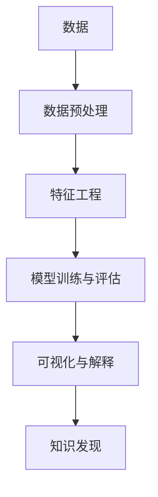

                 

# 知识发现引擎：知识与洞察力的互补与提升

## 1. 背景介绍

在数据爆炸的时代，如何从海量的信息中提取有价值的知识，形成洞察力，是数据科学和人工智能领域面临的重大挑战。知识发现引擎（Knowledge Discovery Engine, KDE）正是针对这一需求而发展起来的核心技术。

KDE通过综合应用统计学、数据挖掘、机器学习等方法，能够自动挖掘数据中的模式、规律和关系，形成洞察力，并转化为知识，为决策、预测、优化等应用提供有力支撑。KDE技术在金融、医疗、教育、交通等多个领域均有广泛应用。

## 2. 核心概念与联系

### 2.1 核心概念概述

在深入探讨知识发现引擎的核心原理前，首先需要理解一些关键概念：

- 数据挖掘(Data Mining)：通过算法从数据中挖掘出有用信息、知识或模式的过程。
- 知识发现(Knowledge Discovery)：结合领域知识，从数据中提取有价值、可应用的知识，形成洞察力。
- 数据预处理：清洗、归一化、采样等技术，将原始数据转化为适合模型处理的形式。
- 特征工程(Feature Engineering)：根据任务需求设计合适的特征表示，优化模型效果。
- 模型训练与评估：选择合适的算法和模型，训练模型并评估其性能，选择最优模型。
- 可视化与解释：将模型输出转化为可视化的形式，辅助理解分析结果，提升模型的可解释性。

这些概念之间的关系可以通过以下Mermaid流程图来展示：



这个流程图展示了数据发现引擎从数据到知识的全过程，包括数据预处理、特征工程、模型训练与评估、可视化与解释等关键环节。

## 3. 核心算法原理 & 具体操作步骤

### 3.1 算法原理概述

知识发现引擎的算法原理主要基于数据挖掘和机器学习的方法，核心思想是：

1. **数据预处理**：清洗、归一化等技术，确保数据质量和一致性，为后续分析奠定基础。
2. **特征提取**：设计合适的特征表示，捕捉数据中的重要信息，提高模型的性能。
3. **模型选择与训练**：选择合适的算法和模型，训练模型并评估其性能，选择最优模型。
4. **可视化与解释**：将模型输出转化为可视化的形式，辅助理解分析结果，提升模型的可解释性。
5. **知识发现**：结合领域知识，从数据中提取有价值、可应用的知识，形成洞察力。

知识发现引擎的整个流程可以概括为：数据预处理 → 特征工程 → 模型训练与评估 → 可视化与解释 → 知识发现。

### 3.2 算法步骤详解

基于上述算法原理，知识发现引擎的具体操作步骤如下：

1. **数据收集与预处理**：
   - 收集原始数据，并进行清洗、归一化、采样等预处理操作，确保数据质量和一致性。

2. **特征提取**：
   - 根据任务需求，设计合适的特征表示，捕捉数据中的重要信息。
   - 例如，使用PCA降维技术，提取数据的潜在特征。

3. **模型选择与训练**：
   - 选择合适的算法和模型，如决策树、支持向量机、神经网络等。
   - 使用训练数据，训练模型并评估其性能，选择最优模型。

4. **可视化与解释**：
   - 将模型输出转化为可视化的形式，如决策树、热力图等。
   - 利用可视化技术，辅助理解分析结果，提升模型的可解释性。

5. **知识发现**：
   - 结合领域知识，从数据中提取有价值、可应用的知识，形成洞察力。
   - 例如，从金融交易数据中提取风险因素，形成风险预警系统。

### 3.3 算法优缺点

知识发现引擎的算法具有以下优点：
- 自动化程度高，能够自动挖掘数据中的模式和规律，减轻人工工作量。
- 适用范围广，可以应用于多个领域，如金融、医疗、教育等。
- 可解释性强，通过可视化技术，能够帮助用户理解模型输出和分析结果。

同时，也存在一些缺点：
- 对数据质量要求高，需要清洗和预处理步骤，操作复杂。
- 特征工程和模型选择对结果有较大影响，需要具备一定的专业技能。
- 对计算资源要求高，模型训练和可视化需要大量计算资源。

### 3.4 算法应用领域

知识发现引擎技术广泛应用于多个领域，具体如下：

- **金融领域**：
  - 风险评估：通过分析历史交易数据，提取风险因素，预测交易风险。
  - 信用评估：利用用户行为数据，评估用户信用水平。
  - 欺诈检测：从交易数据中提取可疑行为模式，进行异常检测。

- **医疗领域**：
  - 疾病预测：通过分析病历数据，预测疾病发生概率。
  - 治疗方案推荐：根据患者数据，推荐最佳治疗方案。
  - 药物研发：从化合物数据中提取新药候选分子。

- **教育领域**：
  - 学生成绩预测：分析学生的学习行为数据，预测其成绩。
  - 课程推荐：根据学生兴趣和历史学习数据，推荐适合课程。
  - 学习效果评估：从学生作业和考试数据中，评估学习效果。

- **交通领域**：
  - 交通流量预测：通过分析交通数据，预测流量变化趋势。
  - 路线优化：根据路况数据，优化行车路线。
  - 事故预警：从历史事故数据中提取高风险区域，进行预警。

## 4. 数学模型和公式 & 详细讲解

### 4.1 数学模型构建

知识发现引擎的数学模型主要基于统计学和机器学习的理论和方法，核心模型包括决策树、支持向量机、神经网络等。

以决策树为例，其数学模型可以表示为：

$$
T = \{(x_i, y_i), i=1,\ldots,N\}
$$

其中，$T$ 为训练数据集，$(x_i, y_i)$ 为第 $i$ 个样本的特征和标签，$N$ 为样本数量。

### 4.2 公式推导过程

以决策树模型为例，推导过程如下：

1. **信息熵**：
   - 定义信息熵 $H(y)$ 为：
   $$
   H(y) = -\sum_{i=1}^K p_i \log_2 p_i
   $$

   其中 $p_i$ 为样本 $y$ 属于第 $i$ 个类别的概率。

2. **信息增益**：
   - 定义信息增益 $Gain$ 为：
   $$
   Gain(S) = H(y) - \sum_{i=1}^{m} \frac{|S_i|}{|S|} H(y|S_i)
   $$

   其中 $S$ 为样本集合，$S_i$ 为第 $i$ 个特征的子集，$y|S_i$ 为 $S_i$ 对应的标签。

3. **决策树构建**：
   - 通过递归地选择最优特征进行分裂，构建决策树模型。
   - 最优特征选择标准为信息增益最大，即：
   $$
   G(S) = \arg\max_{i=1}^{m} Gain(S)
   $$

### 4.3 案例分析与讲解

以金融领域的信用评估为例，分析知识发现引擎的实际应用：

- **数据预处理**：
  - 收集客户的个人信息、信用历史、交易记录等数据。
  - 进行清洗、归一化等预处理操作，确保数据质量和一致性。

- **特征提取**：
  - 提取客户的收入、年龄、信用历史等特征。
  - 使用PCA降维技术，提取数据的潜在特征。

- **模型选择与训练**：
  - 选择决策树模型进行训练。
  - 使用历史信用数据进行训练，评估模型性能，选择最优模型。

- **可视化与解释**：
  - 将模型输出转化为可视化的形式，如决策树图。
  - 利用可视化技术，辅助理解模型输出和分析结果。

- **知识发现**：
  - 结合领域知识，从客户数据中提取有价值的知识，形成洞察力。
  - 例如，提取客户的收入水平、信用历史等特征，形成信用评估模型。

## 5. 项目实践：代码实例和详细解释说明

### 5.1 开发环境搭建

在进行知识发现引擎的实践前，我们需要准备好开发环境。以下是使用Python进行Scikit-learn开发的环境配置流程：

1. 安装Anaconda：从官网下载并安装Anaconda，用于创建独立的Python环境。

2. 创建并激活虚拟环境：
```bash
conda create -n sklearn-env python=3.8 
conda activate sklearn-env
```

3. 安装Scikit-learn：
```bash
pip install -U scikit-learn
```

4. 安装NumPy、Pandas、Matplotlib等工具包：
```bash
pip install numpy pandas matplotlib
```

完成上述步骤后，即可在`sklearn-env`环境中开始项目实践。

### 5.2 源代码详细实现

这里我们以金融领域的信用评估为例，使用Scikit-learn实现决策树模型的构建和训练：

```python
from sklearn.datasets import load_breast_cancer
from sklearn.model_selection import train_test_split
from sklearn.tree import DecisionTreeClassifier
from sklearn.metrics import accuracy_score
from sklearn.model_selection import GridSearchCV

# 加载数据集
data = load_breast_cancer()
X = data.data
y = data.target

# 划分训练集和测试集
X_train, X_test, y_train, y_test = train_test_split(X, y, test_size=0.3, random_state=42)

# 定义决策树模型
model = DecisionTreeClassifier()

# 定义超参数搜索范围
param_grid = {
    'criterion': ['gini', 'entropy'],
    'max_depth': [None, 5, 10, 15],
    'min_samples_split': [2, 5, 10],
    'min_samples_leaf': [1, 2, 4]
}

# 使用网格搜索进行模型调参
grid_search = GridSearchCV(model, param_grid, cv=5)
grid_search.fit(X_train, y_train)

# 输出最优模型参数
print(grid_search.best_params_)

# 在测试集上评估模型性能
y_pred = grid_search.predict(X_test)
print('Accuracy:', accuracy_score(y_test, y_pred))
```

这段代码实现了决策树模型的网格搜索调参，并输出最优参数和模型性能评估结果。

### 5.3 代码解读与分析

让我们再详细解读一下关键代码的实现细节：

**决策树模型训练**：
- 使用Scikit-learn的`DecisionTreeClassifier`类定义决策树模型。
- 通过`GridSearchCV`进行超参数搜索，找到最优参数组合。

**模型调参**：
- 定义超参数搜索范围，包括决策树的分割标准、最大深度、最小叶子节点数等。
- 使用`GridSearchCV`进行模型调参，在交叉验证中寻找最优参数。

**模型评估**：
- 在测试集上使用`predict`方法进行预测，并使用`accuracy_score`计算准确率。

## 6. 实际应用场景

### 6.1 智能投顾系统

智能投顾系统是一种基于数据分析和机器学习的金融顾问服务，可以提供个性化的投资建议。通过知识发现引擎，智能投顾系统可以从客户的投资偏好、历史交易数据等数据中提取关键特征，预测客户风险承受能力，从而提供适合的投资方案。

在技术实现上，可以收集客户的交易数据、问卷调查数据等，结合领域知识，构建知识发现引擎，提取客户投资风险、偏好等特征，形成投资建议。同时，利用知识发现引擎进行模型训练和优化，提升预测准确率。

### 6.2 医疗诊断系统

医疗诊断系统是医疗领域的重要应用之一，通过知识发现引擎，可以分析患者的病历数据，提取疾病特征，辅助医生进行疾病诊断和治疗方案推荐。

具体实现上，可以收集患者的病历数据、检查结果等，结合领域知识，构建知识发现引擎，提取疾病的早期症状、风险因素等特征，预测疾病发生概率。同时，利用知识发现引擎进行模型训练和优化，提升预测准确率。

### 6.3 教育推荐系统

教育推荐系统可以分析学生的学习行为数据，推荐适合的课程和资料。通过知识发现引擎，可以从学生的学习数据中提取关键特征，预测其学习效果，从而推荐适合的课程和资料。

在实现上，可以收集学生的学习数据、历史成绩等，结合领域知识，构建知识发现引擎，提取学生的学习兴趣、成绩变化等特征，预测其学习效果。同时，利用知识发现引擎进行模型训练和优化，提升推荐效果。

### 6.4 未来应用展望

随着知识发现引擎技术的不断发展，其在更多领域的应用将得到拓展，为各行各业带来新的变革：

- **智慧城市**：通过分析城市交通数据，优化城市交通管理，提高城市运行效率。
- **物联网**：从物联网设备数据中提取关键信息，实现设备健康监测、故障预测等应用。
- **智能制造**：分析生产数据，优化生产过程，提高生产效率和产品质量。
- **环境监测**：从环境监测数据中提取关键信息，预测环境变化趋势，制定应对措施。

未来，知识发现引擎技术将与其他人工智能技术进行更深入的融合，如自然语言处理、计算机视觉等，提供更全面、更智能的知识发现服务。

## 7. 工具和资源推荐

### 7.1 学习资源推荐

为了帮助开发者系统掌握知识发现引擎的理论基础和实践技巧，这里推荐一些优质的学习资源：

1. 《数据挖掘与统计学习》书籍：全面介绍了数据挖掘的基本原理和方法，适合初学者和进阶者。
2. 《Python数据科学手册》书籍：介绍了Python在数据科学中的使用，包含大量实际应用案例。
3. 《机器学习实战》书籍：通过实际案例，深入浅出地介绍了机器学习的基本概念和常用算法。
4. Coursera《数据科学基础》课程：由斯坦福大学开设的入门课程，涵盖数据科学的基本概念和方法。
5. Kaggle竞赛平台：提供大量数据集和竞赛，可以练习数据挖掘和机器学习技能，积累实践经验。

通过对这些资源的学习实践，相信你一定能够快速掌握知识发现引擎的精髓，并用于解决实际的NLP问题。

### 7.2 开发工具推荐

高效的开发离不开优秀的工具支持。以下是几款用于知识发现引擎开发的常用工具：

1. Jupyter Notebook：交互式编程环境，方便编写、运行和分享Python代码。
2. Scikit-learn：Python的机器学习库，提供了丰富的算法和模型，适合快速原型开发和实验。
3. TensorBoard：TensorFlow配套的可视化工具，可实时监测模型训练状态，提供丰富的图表呈现方式。
4. Weights & Biases：模型训练的实验跟踪工具，可以记录和可视化模型训练过程中的各项指标。
5. Kaggle平台：提供大量数据集和竞赛，可以练习数据挖掘和机器学习技能，积累实践经验。

合理利用这些工具，可以显著提升知识发现引擎的开发效率，加快创新迭代的步伐。

### 7.3 相关论文推荐

知识发现引擎技术的发展源于学界的持续研究。以下是几篇奠基性的相关论文，推荐阅读：

1. J. R. Quinlan, "Induction of Decision Trees," Machine Learning, 1986。
2. T. Hastie, R. Tibshirani, and J. Friedman, "The Elements of Statistical Learning," 2009。
3. C. M. Bishop, "Pattern Recognition and Machine Learning," 2006。
4. Y. Breuleux, R. De Coster, and G. Follin, "The Decision Trees Learning Algorithm," 2004。
5. T. Ho, "The Random Decision Forest," Machine Learning, 1998。

这些论文代表了大数据挖掘和机器学习领域的经典成果，为知识发现引擎的研究和应用提供了坚实的理论基础。

## 8. 总结：未来发展趋势与挑战

### 8.1 总结

本文对知识发现引擎的核心原理和操作步骤进行了全面系统的介绍。首先阐述了知识发现引擎的背景和意义，明确了其在数据挖掘、机器学习等领域的重要作用。其次，从原理到实践，详细讲解了知识发现引擎的数学模型构建和操作步骤，给出了实际应用的代码实现。同时，本文还广泛探讨了知识发现引擎在金融、医疗、教育等领域的实际应用，展示了知识发现引擎的广阔前景。

通过对这些资源的系统梳理，可以看到，知识发现引擎技术正在成为数据科学和人工智能领域的重要工具，极大地拓展了数据挖掘和机器学习的应用范围，带来了深远的影响。未来，伴随知识发现引擎技术的持续演进，相信其在更多领域的应用将得到拓展，为各行各业带来新的变革。

### 8.2 未来发展趋势

展望未来，知识发现引擎技术将呈现以下几个发展趋势：

1. **自动化程度提高**：随着算法和工具的进步，知识发现引擎的自动化程度将不断提高，能够自动进行数据清洗、特征提取、模型训练等步骤。
2. **深度学习融合**：知识发现引擎将更多地融合深度学习技术，提升模型的表达能力和泛化性能。
3. **多模态融合**：知识发现引擎将更多地融合多模态数据，提升模型的全面性和实用性。
4. **大数据支持**：知识发现引擎将更好地支持大规模数据处理，提高模型的性能和效率。
5. **可解释性增强**：知识发现引擎将更多地关注模型的可解释性，增强其透明度和可信度。

这些趋势凸显了知识发现引擎技术的广阔前景，预示着其在更多领域的应用将得到拓展，为各行各业带来新的变革。

### 8.3 面临的挑战

尽管知识发现引擎技术已经取得了显著进展，但在迈向更加智能化、普适化应用的过程中，仍面临一些挑战：

1. **数据质量和多样性**：高质量、多样化的数据是知识发现引擎成功的基础，但在实际应用中，数据往往存在缺失、噪声等问题，影响模型效果。
2. **模型复杂度和可解释性**：深度学习模型的复杂度较高，难以解释其内部机制，影响其应用范围和可信度。
3. **计算资源限制**：大规模数据和深度学习模型的计算需求较大，需要高性能计算资源支持。
4. **领域知识整合**：知识发现引擎需要结合领域知识进行优化，但领域知识的整合和应用仍然存在挑战。

这些挑战需要从数据质量、算法优化、计算资源、领域知识等多个维度进行综合应对，才能确保知识发现引擎技术的应用效果和可靠性。

### 8.4 研究展望

面对知识发现引擎所面临的挑战，未来的研究需要在以下几个方面寻求新的突破：

1. **数据预处理技术**：研究和开发更多高效的数据预处理方法，提高数据质量和多样性，减少噪声和缺失。
2. **模型优化算法**：研究和开发更高效的模型优化算法，提升模型的表达能力和泛化性能，同时提高可解释性。
3. **多模态融合方法**：研究和开发更多有效的多模态数据融合方法，提升模型的全面性和实用性。
4. **领域知识融合技术**：研究和开发更多有效的领域知识融合技术，增强模型的应用范围和可信度。
5. **计算资源优化**：研究和开发更高效的计算资源优化方法，提高大规模数据和深度学习模型的处理效率。

这些研究方向将推动知识发现引擎技术不断进步，拓展其在更多领域的应用，为各行各业带来新的变革。

## 9. 附录：常见问题与解答

**Q1：知识发现引擎是否适用于所有数据类型？**

A: 知识发现引擎适用于大部分结构化、半结构化数据，但非结构化数据（如文本、图像等）需要经过预处理才能用于分析。

**Q2：知识发现引擎中的数据预处理过程复杂吗？**

A: 数据预处理是知识发现引擎的重要环节，涉及数据清洗、归一化、特征提取等操作，需要根据具体数据类型和任务需求进行设计和实现。

**Q3：如何选择最适合的知识发现引擎算法？**

A: 选择最适合的知识发现引擎算法需要考虑数据类型、任务需求、模型复杂度等多个因素。常用的算法包括决策树、支持向量机、神经网络等。

**Q4：知识发现引擎中的特征提取方法有哪些？**

A: 特征提取是知识发现引擎的重要步骤，常用的方法包括主成分分析（PCA）、独立成分分析（ICA）、线性判别分析（LDA）等。

**Q5：知识发现引擎的可视化方法有哪些？**

A: 可视化是知识发现引擎的重要环节，常用的方法包括决策树图、散点图、热力图等。

---

作者：禅与计算机程序设计艺术 / Zen and the Art of Computer Programming

