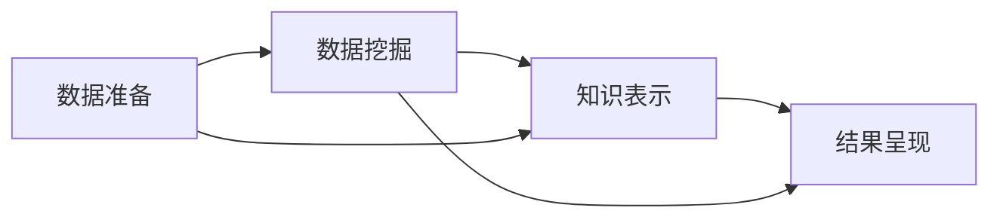

                 

# 知识发现引擎：知识与洞察力的协同进化

## 1. 背景介绍

在数字时代，信息的海量涌现使得知识获取变得愈加困难。面对数据洪流，人们亟需一种智能化的工具，能够在海量数据中挖掘出有价值的模式、趋势和洞见，从而更好地服务于决策制定和问题解决。在这样的背景下，知识发现引擎应运而生。知识发现引擎（Knowledge Discovery Engine, KDE）是一种结合人工智能、数据库管理和数据挖掘技术的综合系统，旨在自动地从数据中发现、组织和呈现有用的知识。本文将深入探讨知识发现引擎的核心概念、算法原理、实际应用以及未来的发展方向。

## 2. 核心概念与联系

### 2.1 核心概念概述

#### 2.1.1 知识发现（Knowledge Discovery, KD）

知识发现是从数据中识别出隐含的有价值信息的过程。它通过对数据进行深入分析，挖掘出能够支持决策、预测和洞察的模式、趋势和关联。知识发现的目的是帮助决策者理解和利用数据，从而做出更好的决策。

#### 2.1.2 数据挖掘（Data Mining, DM）

数据挖掘是从数据集中提取有用信息的过程，包括聚类、分类、回归、关联规则挖掘等技术。数据挖掘帮助从数据中发现潜在的模式和关系，是知识发现的重要组成部分。

#### 2.1.3 人工智能（Artificial Intelligence, AI）

人工智能包括机器学习、深度学习、自然语言处理等技术，用于模拟人类智能行为。在知识发现中，人工智能技术可以自动分析数据，提取知识模式，并用于自动化知识发现过程。

#### 2.1.4 数据库管理（Database Management, DM）

数据库管理是管理数据存储和检索的过程。知识发现引擎通常依赖于高效的数据库管理技术，以支持大规模数据的存储、检索和处理。

### 2.2 核心概念之间的联系

知识发现引擎通过整合数据挖掘、人工智能和数据库管理技术，自动化地从数据中发现知识。它包括以下几个关键步骤：

1. **数据准备**：收集、清洗和预处理数据。
2. **数据挖掘**：使用机器学习、深度学习等技术，从数据中挖掘出有价值的模式和关系。
3. **知识表示**：将挖掘出的知识进行编码和表示，使其易于理解和应用。
4. **结果呈现**：将知识以图表、报告等形式呈现，供决策者参考。

### 2.3 Mermaid 流程图

以下是知识发现引擎的 Mermaid 流程图，展示了知识发现引擎的核心流程和组件：



## 3. 核心算法原理 & 具体操作步骤

### 3.1 算法原理概述

知识发现引擎的算法原理主要基于数据挖掘、机器学习和自然语言处理等技术。以下是几个核心算法：

- **关联规则挖掘**：通过挖掘数据集中的频繁项集和关联规则，发现物品之间的关联性。
- **分类与回归**：使用分类器或回归模型，预测未来事件的结果或分类。
- **聚类**：将数据集中的对象分为若干类，使得同一类内的对象具有相似的特征。
- **序列模式挖掘**：发现时间序列数据中的模式和趋势，用于预测未来的行为。

### 3.2 算法步骤详解

#### 3.2.1 数据准备

1. **数据收集**：从各种数据源（如数据库、Web、社交媒体等）收集数据。
2. **数据清洗**：处理缺失值、异常值和重复数据，确保数据的质量。
3. **数据预处理**：进行特征选择、数据转换和归一化，为后续分析做准备。

#### 3.2.2 数据挖掘

1. **特征提取**：从原始数据中提取有用的特征，如文本中的关键词、图像中的颜色等。
2. **模型训练**：使用机器学习算法，如决策树、随机森林、神经网络等，训练模型。
3. **模式发现**：通过聚类、分类等技术，发现数据中的模式和关系。

#### 3.2.3 知识表示

1. **知识编码**：将发现的模式和关系进行编码，如转换为规则、树、图等形式。
2. **知识推理**：使用推理机，根据知识库中的规则进行推理，发现新的模式和关系。

#### 3.2.4 结果呈现

1. **数据可视化**：将发现的知识以图表、报表等形式呈现，便于理解和使用。
2. **知识应用**：将知识应用于实际场景中，如预测销售趋势、优化产品设计等。

### 3.3 算法优缺点

#### 3.3.1 优点

1. **自动化**：知识发现引擎能够自动从数据中发现知识，减少了人工干预的复杂性。
2. **高效性**：通过并行计算和分布式处理，能够处理大规模数据集。
3. **可扩展性**：可以根据数据规模和复杂度进行扩展，适应不同的应用场景。

#### 3.3.2 缺点

1. **数据质量依赖**：知识发现的效果高度依赖于数据的质量和完整性，数据缺失或错误会影响结果。
2. **算法复杂性**：一些算法（如深度学习）可能需要较长的训练时间和高计算资源。
3. **解释性不足**：一些复杂的模型（如神经网络）缺乏解释性，难以理解和解释其工作原理。

### 3.4 算法应用领域

知识发现引擎广泛应用于以下领域：

- **金融领域**：用于预测股票价格、分析客户行为、评估信用风险等。
- **医疗领域**：用于诊断疾病、发现治疗方案、分析患者数据等。
- **零售领域**：用于个性化推荐、库存管理、销售预测等。
- **社交媒体分析**：用于情感分析、趋势预测、用户行为分析等。
- **网络安全**：用于异常检测、威胁预测、漏洞分析等。

## 4. 数学模型和公式 & 详细讲解 & 举例说明

### 4.1 数学模型构建

知识发现引擎的核心数学模型包括统计模型、机器学习模型和图模型等。以下是一些常用的数学模型：

#### 4.1.1 回归模型

线性回归模型：

$$
y = \beta_0 + \beta_1 x_1 + \beta_2 x_2 + \cdots + \beta_p x_p + \epsilon
$$

其中，$y$ 为因变量，$x_1, x_2, \cdots, x_p$ 为自变量，$\beta_0, \beta_1, \cdots, \beta_p$ 为回归系数，$\epsilon$ 为误差项。

#### 4.1.2 分类模型

逻辑回归模型：

$$
P(y=1|x) = \frac{1}{1 + e^{-\theta^T x}}
$$

其中，$y$ 为二分类变量，$x$ 为特征向量，$\theta$ 为模型参数。

### 4.2 公式推导过程

以逻辑回归模型为例，其推导过程如下：

1. **目标函数**：

$$
L(\theta) = -\frac{1}{N} \sum_{i=1}^N \left[y_i \log P(y_i=1|x_i) + (1-y_i) \log P(y_i=0|x_i)\right]
$$

2. **梯度下降**：

$$
\theta = \theta - \alpha \frac{\partial L(\theta)}{\partial \theta}
$$

其中，$\alpha$ 为学习率。

3. **最大似然估计**：

$$
\theta = \arg\max_{\theta} \prod_{i=1}^N P(y_i|x_i)
$$

### 4.3 案例分析与讲解

假设我们有一组客户数据，包括年龄、收入、购买次数等特征，以及是否购买产品的标签。我们可以使用逻辑回归模型预测客户是否会购买产品。首先，将数据集分成训练集和测试集，然后使用训练集训练逻辑回归模型：

$$
\theta = \arg\min_{\theta} -\frac{1}{N} \sum_{i=1}^N \left[y_i \log P(y_i=1|x_i) + (1-y_i) \log P(y_i=0|x_i)\right]
$$

最后，使用测试集评估模型的性能，计算准确率、召回率等指标。

## 5. 项目实践：代码实例和详细解释说明

### 5.1 开发环境搭建

#### 5.1.1 环境准备

1. **安装 Python**：确保安装了 Python 3.x，建议使用 Anaconda 进行环境管理。
2. **安装相关库**：安装 numpy、pandas、scikit-learn、matplotlib 等常用库。
3. **设置虚拟环境**：创建虚拟环境，并激活。

#### 5.1.2 环境测试

1. **测试 Python 版本**：

```python
import sys
print(sys.version)
```

2. **测试库安装**：

```python
import numpy as np
import pandas as pd
import matplotlib.pyplot as plt
```

### 5.2 源代码详细实现

#### 5.2.1 数据准备

```python
import pandas as pd

# 读取数据集
data = pd.read_csv('customer_data.csv')

# 清洗数据
data = data.dropna()

# 特征选择
features = ['age', 'income', 'purchase_count']
X = data[features]
y = data['purchase_label']
```

#### 5.2.2 数据挖掘

```python
from sklearn.model_selection import train_test_split
from sklearn.linear_model import LogisticRegression

# 划分数据集
X_train, X_test, y_train, y_test = train_test_split(X, y, test_size=0.2, random_state=42)

# 训练逻辑回归模型
model = LogisticRegression()
model.fit(X_train, y_train)

# 预测测试集
y_pred = model.predict(X_test)
```

#### 5.2.3 结果呈现

```python
from sklearn.metrics import classification_report

# 评估模型性能
print(classification_report(y_test, y_pred))
```

### 5.3 代码解读与分析

以上代码展示了使用逻辑回归模型进行客户购买行为预测的完整流程。

- **数据准备**：读取数据、清洗数据、特征选择。
- **数据挖掘**：使用 train_test_split 函数划分数据集，使用 LogisticRegression 训练模型。
- **结果呈现**：使用 classification_report 函数评估模型性能，包括准确率、召回率、F1 分数等指标。

## 6. 实际应用场景

### 6.1 金融风险管理

金融风险管理中，知识发现引擎可以帮助识别高风险客户、预测贷款违约概率、评估信用风险等。例如，使用关联规则挖掘发现某些客户的消费模式与违约风险有关联，从而提前预警风险。

### 6.2 医疗诊断

医疗诊断中，知识发现引擎可以用于发现疾病模式、预测病情发展、推荐治疗方案等。例如，通过分析患者的病历数据，发现某些症状与特定疾病的关联性，提高诊断准确率。

### 6.3 电商个性化推荐

电商个性化推荐中，知识发现引擎可以用于推荐系统中的商品推荐、用户行为分析等。例如，通过关联规则挖掘发现用户购买行为与商品推荐之间的关联性，提高推荐效果。

### 6.4 未来应用展望

未来，知识发现引擎将在更多领域得到应用，包括智慧城市、智能交通、智能制造等。例如，在智慧城市中，知识发现引擎可以用于交通流量预测、能源消耗分析、公共安全预警等。

## 7. 工具和资源推荐

### 7.1 学习资源推荐

#### 7.1.1 在线课程

1. **Coursera - Machine Learning**：由斯坦福大学开设，介绍了机器学习的基本概念和常用算法。
2. **edX - Data Science**：由麻省理工学院和哈佛大学联合开设，涵盖了数据科学和数据分析的各个方面。

#### 7.1.2 书籍

1. **《Python数据科学手册》**：涵盖了 Python 在数据科学中的应用，包括数据清洗、可视化、建模等。
2. **《机器学习实战》**：介绍了机器学习的基本原理和实践，适合初学者入门。

### 7.2 开发工具推荐

#### 7.2.1 数据处理工具

1. **Pandas**：用于数据清洗和预处理，支持大量数据处理和分析。
2. **NumPy**：用于数值计算和数组操作，支持高效的数学运算。

#### 7.2.2 建模工具

1. **Scikit-learn**：用于机器学习和数据挖掘，支持多种模型和算法。
2. **TensorFlow**：用于深度学习和神经网络建模，支持大规模数据处理和分布式计算。

#### 7.2.3 可视化工具

1. **Matplotlib**：用于绘制各种图表，支持丰富的可视化效果。
2. **Seaborn**：基于 Matplotlib，提供了更高级的绘图接口。

### 7.3 相关论文推荐

#### 7.3.1 经典论文

1. **《Apriori algorithm for mining sequential patterns》**：提出了 Apriori 算法，用于关联规则挖掘。
2. **《Inductive reasoning for decision trees》**：介绍了 ID3 算法，用于决策树分类。

#### 7.3.2 最新进展

1. **《Knowledge Discovery in Databases: New Directions and Applications》**：介绍了知识发现的新方向和应用，适合深入研究。
2. **《AI Explained: An Illustrated Guide》**：以图解形式介绍了人工智能的基本概念和算法。

## 8. 总结：未来发展趋势与挑战

### 8.1 研究成果总结

知识发现引擎作为数据驱动的智能系统，已经广泛应用于各个领域，并取得了显著的成果。未来，知识发现引擎将继续发展，推动人工智能技术的进步。

### 8.2 未来发展趋势

#### 8.2.1 自动化和智能化

未来的知识发现引擎将更加自动化和智能化，能够自动从数据中发现更深入的规律和模式，并辅助人类进行决策。

#### 8.2.2 多模态融合

未来的知识发现引擎将融合多模态数据，如文本、图像、语音等，提高数据挖掘的全面性和准确性。

#### 8.2.3 实时处理

未来的知识发现引擎将具备实时处理能力，能够快速响应数据变化，提供实时的分析结果。

#### 8.2.4 跨领域应用

未来的知识发现引擎将应用于更多领域，如医疗、金融、交通等，推动各行业的智能化转型。

### 8.3 面临的挑战

#### 8.3.1 数据质量和完整性

数据质量和完整性是知识发现的关键，数据的缺失或不准确会影响结果的可靠性。

#### 8.3.2 计算资源

大规模数据挖掘和深度学习模型需要大量的计算资源，如何优化资源利用和算法性能是未来的一大挑战。

#### 8.3.3 算法复杂性

一些复杂的算法（如深度学习）需要较长的训练时间和高计算资源，如何简化算法和提高效率是未来的一个重要方向。

### 8.4 研究展望

未来的研究将集中在以下几个方面：

#### 8.4.1 自动化知识发现

如何自动从数据中发现有用的知识和模式，减少人工干预的复杂性。

#### 8.4.2 多模态数据挖掘

如何融合多模态数据，提高数据挖掘的全面性和准确性。

#### 8.4.3 实时知识发现

如何构建实时处理的知识发现系统，快速响应数据变化。

#### 8.4.4 跨领域应用

如何将知识发现引擎应用于更多领域，推动各行业的智能化转型。

## 9. 附录：常见问题与解答

**Q1: 知识发现引擎的原理是什么？**

A: 知识发现引擎通过数据挖掘、机器学习和自然语言处理等技术，从数据中发现有用的模式和关系，支持决策和问题解决。

**Q2: 如何评估知识发现引擎的效果？**

A: 可以通过准确率、召回率、F1 分数等指标评估模型的性能，同时可以使用混淆矩阵、ROC 曲线等可视化工具进行辅助分析。

**Q3: 知识发现引擎在实际应用中需要注意哪些问题？**

A: 需要注意数据的质量和完整性，计算资源的优化，算法的复杂性，以及结果的解释性和可解释性。

**Q4: 未来的知识发现引擎有哪些发展趋势？**

A: 未来的知识发现引擎将更加自动化和智能化，融合多模态数据，具备实时处理能力，应用于更多领域。

---

作者：禅与计算机程序设计艺术 / Zen and the Art of Computer Programming

