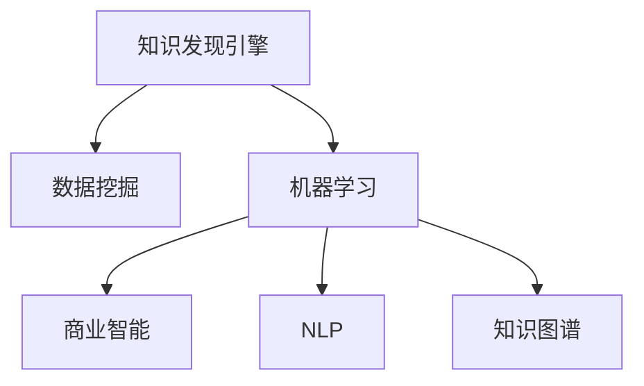

                 

# 知识发现引擎：知识与洞察力的完美结合

> 关键词：知识发现引擎,数据挖掘,机器学习,深度学习,商业智能,知识图谱,自然语言处理

## 1. 背景介绍

### 1.1 问题由来
在当今信息爆炸的时代，数据已成为企业最宝贵的资产之一。然而，海量数据的背后隐藏着诸多有价值的知识，传统的报表分析方式已经无法满足需求。企业亟需一种自动化、智能化的方式，快速从数据中提取有意义的洞见，为企业决策提供支撑。知识发现引擎(Knowledge Discovery Engine, KDE)应运而生，通过数据挖掘、机器学习等技术，帮助企业从海量数据中高效发现知识，实现数据的商业价值。

### 1.2 问题核心关键点
知识发现引擎是连接数据与知识、技术与管理的重要桥梁。其核心目标是通过先进的数据分析技术，将复杂的数据转化为易于理解和利用的知识，帮助企业做出科学决策。关键点包括：
- 数据预处理：清洗、整理、归一化数据，为后续分析打下基础。
- 特征提取：选择和构造有效的特征，以便算法能够从中学习有价值的信息。
- 模型训练：选择合适的模型，并利用标注数据进行训练，生成模型参数。
- 知识评估：对模型性能进行评估，确保输出结果的可靠性。
- 商业应用：将知识应用于实际业务场景，创造商业价值。

## 2. 核心概念与联系

### 2.1 核心概念概述

为了更好地理解知识发现引擎的工作原理和实现方法，本节将介绍几个密切相关的核心概念：

- 知识发现(Knowledge Discovery)：通过数据挖掘、机器学习等技术，从数据中提取有用的知识。知识发现的目标是从数据中提炼出规则、模式、规律等，帮助用户做出更好的决策。
- 数据挖掘(Data Mining)：通过算法从大量数据中自动发现并提取出有价值的信息，包括聚类、分类、关联规则挖掘等。数据挖掘为知识发现提供了数据基础。
- 机器学习(Machine Learning)：通过让机器从数据中学习，从而自动提取规律，实现知识发现和预测。机器学习是知识发现引擎的核心技术手段。
- 商业智能(Business Intelligence)：通过数据分析和商业知识的结合，帮助企业做出更好的商业决策。商业智能是知识发现的应用场景之一。
- 自然语言处理(Natural Language Processing, NLP)：通过处理和理解自然语言，提取文本中的关键信息，辅助知识发现。
- 知识图谱(Knowledge Graph)：通过语义网络技术，将知识以结构化的形式存储和表示，便于机器理解和推理。知识图谱是知识发现的重要输出结果之一。

这些概念之间的逻辑关系可以通过以下Mermaid流程图来展示：



这个流程图展示出知识发现引擎的各个组件及其之间的关系：

1. 知识发现引擎通过数据挖掘和机器学习从数据中提取知识。
2. 提取出的知识可以应用于商业智能，辅助决策。
3. 自然语言处理帮助从文本数据中提取关键信息。
4. 知识图谱存储和表示知识，供后续推理使用。

## 3. 核心算法原理 & 具体操作步骤
### 3.1 算法原理概述

知识发现引擎的工作原理可以概括为数据预处理、特征提取、模型训练、知识评估和商业应用五个步骤。其核心算法包括数据挖掘算法、机器学习算法、自然语言处理算法和知识图谱构建算法等。

数据预处理的目标是清洗、归一化数据，便于后续算法处理。常用的方法包括去重、填补缺失值、数据转换等。

特征提取是知识发现引擎的重要环节，旨在从原始数据中提取出有意义的特征，供算法学习。特征提取方法包括特征选择、特征构建、降维等。

模型训练是知识发现引擎的核心，通过选择合适的机器学习算法和适当的参数，对数据进行训练，得到知识模型。常用的机器学习算法包括决策树、支持向量机、神经网络等。

知识评估旨在对模型进行性能评估，确保输出的知识可靠。常用的评估方法包括交叉验证、ROC曲线、AUC等。

商业应用将知识模型应用于实际业务场景，转化为商业价值。常见的应用包括推荐系统、客户细分、市场分析等。

### 3.2 算法步骤详解

知识发现引擎的完整工作流程可以概括为以下几个步骤：

**Step 1: 数据预处理**
- 数据清洗：去除异常值、噪声，填补缺失值。
- 数据归一化：将数据转换为标准形式，便于算法处理。
- 数据划分：将数据划分为训练集、验证集和测试集。

**Step 2: 特征提取**
- 特征选择：选择有信息量的特征，减少计算量。
- 特征构建：构造新的特征，提高模型的表现力。
- 特征降维：通过降维技术减少特征数量，提高算法效率。

**Step 3: 模型训练**
- 选择合适的算法：如决策树、支持向量机、神经网络等。
- 设定超参数：如学习率、正则化系数、隐藏层数量等。
- 训练模型：使用训练集数据进行模型训练，更新模型参数。

**Step 4: 知识评估**
- 性能评估：使用验证集和测试集数据评估模型性能，如准确率、召回率等。
- 模型调优：根据评估结果调整模型参数，提高模型效果。

**Step 5: 商业应用**
- 应用部署：将训练好的模型部署到实际业务系统中。
- 知识应用：利用知识模型进行客户细分、市场分析、推荐系统等业务操作。
- 持续改进：收集反馈数据，不断优化模型，提升业务效果。

### 3.3 算法优缺点

知识发现引擎具有以下优点：
1. 高效自动：通过算法自动化处理大量数据，提取有用知识。
2. 灵活应用：能够应用于多种业务场景，如市场分析、客户细分等。
3. 可扩展性：能够处理大规模数据，适应不同规模的业务需求。
4. 商业价值高：知识发现引擎能够帮助企业发现潜在商机，提升竞争优势。

同时，知识发现引擎也存在一些缺点：
1. 数据质量依赖：数据质量直接影响知识发现效果，数据缺失或不准确会导致错误结论。
2. 模型复杂性高：复杂的算法模型会增加计算复杂度，降低算法效率。
3. 结果解释性差：机器学习模型往往缺乏可解释性，难以解释其内部决策过程。
4. 结果可靠性低：过度依赖数据挖掘和机器学习，容易受到数据噪音的影响，产生误导性结论。

尽管存在这些缺点，但知识发现引擎仍是大数据时代的重要工具，广泛应用于各行业的决策支持中。未来，需要进一步提高算法效率，增强结果的可解释性，改进模型可靠性。

### 3.4 算法应用领域

知识发现引擎已经在多个行业得到广泛应用，包括但不限于：

- 金融：利用知识发现引擎进行市场分析、客户细分、信用评估等。
- 零售：通过分析客户行为数据，进行商品推荐、销售预测、客户流失预测等。
- 医疗：利用知识发现引擎进行疾病预测、诊断支持、临床决策等。
- 电商：通过分析用户浏览、购买等行为数据，优化商品推荐、广告投放、价格优化等。
- 物流：利用知识发现引擎进行路线规划、库存管理、配送优化等。

## 4. 数学模型和公式 & 详细讲解  
### 4.1 数学模型构建

知识发现引擎的核心算法包括数据挖掘算法、机器学习算法和自然语言处理算法等。这里以决策树算法为例，介绍知识发现引擎的数学模型构建方法。

假设输入特征为 $X=\{x_1,x_2,\ldots,x_n\}$，输出标签为 $y \in \{0,1\}$，训练集为 $D=\{(x_i,y_i)\}_{i=1}^N$。决策树的目标是通过分割特征空间，构建一棵决策树，使得模型能够准确地预测标签。

**决策树的构建**：
1. 选择最佳特征：从特征集合中选择一个最佳的特征 $x_k$ 作为分割点。
2. 确定分割阈值：在特征 $x_k$ 中找到最佳的分割阈值 $\theta_k$，使得模型的预测误差最小。
3. 递归分割：对每个子集重复上述步骤，直到满足停止条件（如叶子节点数量）。

决策树的性能评估可以通过以下指标来衡量：
- 准确率(Accuracy)：模型正确预测的比例。
- 召回率(Recall)：模型正确预测的正样本占实际正样本的比例。
- F1分数(F1-Score)：准确率和召回率的调和平均数。

**公式推导**：
$$
Accuracy = \frac{TP+TN}{TP+TN+FP+FN}
$$
$$
Recall = \frac{TP}{TP+FN}
$$
$$
F1-Score = 2 \times \frac{Precision \times Recall}{Precision + Recall}
$$

其中 $TP$ 表示真正例，$TN$ 表示真负例，$FP$ 表示假正例，$FN$ 表示假负例。

### 4.2 公式推导过程

下面以决策树为例，详细推导其公式。

**决策树的学习过程**：
1. 假设存在一个训练集 $D=\{(x_i,y_i)\}_{i=1}^N$，其中 $x_i$ 为输入特征向量，$y_i$ 为输出标签。
2. 选择最佳特征 $x_k$ 作为决策树的根节点。
3. 在特征 $x_k$ 中找到最佳的分割阈值 $\theta_k$，使得模型的预测误差最小。
4. 对每个子集重复上述步骤，构建决策树的子节点。
5. 设置停止条件，如叶子节点数量。

**准确率的计算**：
假设模型对 $N$ 个样本进行了预测，其中正确预测的样本数为 $TP+TN$，错误预测的样本数为 $FP+FN$。则准确率为：
$$
Accuracy = \frac{TP+TN}{TP+TN+FP+FN}
$$

**召回率的计算**：
假设实际正样本数量为 $TP+FN$，模型正确预测的正样本数量为 $TP$，则召回率为：
$$
Recall = \frac{TP}{TP+FN}
$$

**F1分数的计算**：
假设模型预测的正样本数量为 $TP+FP$，模型正确预测的正样本数量为 $TP$，则精确率为：
$$
Precision = \frac{TP}{TP+FP}
$$
代入精确率和召回率，得：
$$
F1-Score = 2 \times \frac{Precision \times Recall}{Precision + Recall}
$$

## 5. 项目实践：代码实例和详细解释说明
### 5.1 开发环境搭建

在进行知识发现引擎的开发前，需要先搭建好开发环境。以下是使用Python进行Scikit-Learn开发的环境配置流程：

1. 安装Anaconda：从官网下载并安装Anaconda，用于创建独立的Python环境。

2. 创建并激活虚拟环境：
```bash
conda create -n kde-env python=3.8 
conda activate kde-env
```

3. 安装Scikit-Learn：
```bash
conda install scikit-learn numpy pandas matplotlib scikit-learn
```

4. 安装其他工具包：
```bash
pip install joblib jupyter notebook ipython
```

完成上述步骤后，即可在`kde-env`环境中开始知识发现引擎的开发。

### 5.2 源代码详细实现

下面我们以决策树模型为例，给出使用Scikit-Learn进行数据挖掘的Python代码实现。

首先，定义数据集和特征：

```python
import pandas as pd
from sklearn.model_selection import train_test_split

# 读取数据集
data = pd.read_csv('data.csv')

# 特征选择
X = data[['feature1', 'feature2', 'feature3']]
y = data['label']

# 数据划分
X_train, X_test, y_train, y_test = train_test_split(X, y, test_size=0.3, random_state=42)
```

然后，定义模型和训练参数：

```python
from sklearn.tree import DecisionTreeClassifier
from sklearn.metrics import accuracy_score, recall_score, f1_score

# 定义决策树模型
model = DecisionTreeClassifier()

# 训练模型
model.fit(X_train, y_train)
```

接着，定义评估函数：

```python
def evaluate(model, X_test, y_test):
    y_pred = model.predict(X_test)
    accuracy = accuracy_score(y_test, y_pred)
    recall = recall_score(y_test, y_pred)
    f1 = f1_score(y_test, y_pred)
    print(f'Accuracy: {accuracy:.3f}, Recall: {recall:.3f}, F1-Score: {f1:.3f}')
```

最后，启动训练流程并在测试集上评估：

```python
evaluate(model, X_test, y_test)
```

以上就是使用Scikit-Learn对决策树模型进行训练和评估的完整代码实现。可以看到，Scikit-Learn提供了方便的API，可以快速构建和评估多种机器学习模型，极大地简化了知识发现引擎的开发过程。

### 5.3 代码解读与分析

让我们再详细解读一下关键代码的实现细节：

**数据预处理**：
- 使用`pd.read_csv()`函数读取数据集，并使用`data[['feature1', 'feature2', 'feature3']]`选择特征。
- 使用`train_test_split()`函数将数据集划分为训练集和测试集，确保训练集和测试集的分布相似。

**模型定义和训练**：
- 使用`DecisionTreeClassifier()`定义决策树模型，并使用`model.fit()`对训练集进行模型训练。

**评估函数**：
- 使用`predict()`函数对测试集进行预测，使用`accuracy_score()`、`recall_score()`和`f1_score()`评估模型性能，并将结果输出。

**训练流程**：
- 调用`evaluate()`函数，在测试集上评估模型性能。

可以看出，Scikit-Learn提供了完善的API，使得知识发现引擎的开发过程更加简洁高效。开发者只需关注算法选择和参数调优，即可完成模型的构建和评估。

当然，工业级的系统实现还需考虑更多因素，如模型的存储和加载、超参数的自动搜索、更灵活的任务适配层等。但核心的决策树模型构建基本与此类似。

## 6. 实际应用场景
### 6.1 金融风控

知识发现引擎在金融风控领域有着广泛应用。金融机构通过分析客户的交易记录、信用记录、社交行为等数据，利用知识发现引擎进行信用评估、风险预测、欺诈检测等。

例如，金融机构可以使用知识发现引擎构建信用评分模型，通过对客户的交易数据进行多维分析，生成综合信用评分，帮助判断客户的还款能力和还款意愿。通过实时监控客户的交易行为，及时发现异常交易，进行风险预警，防止金融欺诈。

### 6.2 电商个性化推荐

电商企业通过分析用户的浏览、购买、评价等行为数据，利用知识发现引擎进行个性化推荐。

例如，电商平台可以构建用户画像，根据用户的历史行为数据，利用决策树、神经网络等算法，预测用户对不同商品的兴趣，生成个性化推荐列表。通过不断收集用户的反馈数据，动态调整推荐策略，提升用户体验和购买转化率。

### 6.3 医疗诊断

医疗领域的数据量庞大且复杂，知识发现引擎可以通过分析电子病历、基因数据、影像数据等，辅助医生进行疾病诊断和临床决策。

例如，医院可以构建疾病预测模型，通过对患者的基因数据、影像数据等进行多维度分析，预测患者可能患病的概率，提前进行干预和治疗。同时，利用知识图谱存储和表示医疗知识，辅助医生进行临床决策，提高诊疗的准确性和效率。

### 6.4 未来应用展望

随着知识发现引擎技术的不断发展，其在更多领域的应用前景将更加广阔。

在智慧城市领域，知识发现引擎可以通过分析交通、环境、安全等数据，实现智慧交通、智慧安防、智慧环境等。例如，通过分析交通流量数据，实现智能交通管理，提升城市交通效率。

在能源领域，知识发现引擎可以通过分析能源消耗数据、气象数据等，实现能源管理和节能减排。例如，通过分析电网数据，优化能源分配，减少能源浪费。

在农业领域，知识发现引擎可以通过分析气候、土壤、种植数据等，实现精准农业和智慧农业。例如，通过分析气象数据，优化种植方案，提高农产品的产量和质量。

总之，知识发现引擎的应用前景将随着数据量的增长和算法的进步而日益广阔，未来将为各行各业带来更多商业价值和社会效益。

## 7. 工具和资源推荐
### 7.1 学习资源推荐

为了帮助开发者系统掌握知识发现引擎的理论基础和实践技巧，这里推荐一些优质的学习资源：

1. 《数据挖掘导论》书籍：由著名数据挖掘专家Jeffrey Heer撰写，介绍了数据挖掘的基本概念和常用算法，适合入门学习。
2. 《机器学习》课程：斯坦福大学Andrew Ng教授开设的机器学习课程，系统讲解了机器学习的基本原理和常用算法，是机器学习领域的经典教材。
3. 《Python数据科学手册》书籍：由Jake VanderPlas撰写，全面介绍了Python在数据科学中的应用，包括数据预处理、特征工程、模型评估等。
4. Kaggle竞赛：Kaggle平台上定期举办的各类数据科学竞赛，提供丰富的数据集和模型样例，适合实践学习和经验交流。
5. Scikit-Learn官方文档：Scikit-Learn库的官方文档，提供了丰富的机器学习算法样例和API文档，是知识发现引擎开发的重要参考。

通过对这些资源的学习实践，相信你一定能够快速掌握知识发现引擎的核心技术，并用于解决实际的业务问题。

### 7.2 开发工具推荐

高效的开发离不开优秀的工具支持。以下是几款用于知识发现引擎开发的常用工具：

1. Scikit-Learn：基于Python的数据挖掘库，提供了丰富的机器学习算法和API，易于上手和实践。
2. TensorFlow：由Google主导开发的深度学习框架，生产部署方便，适合大规模工程应用。
3. Apache Spark：分布式计算框架，可以高效处理大规模数据集，适合大数据分析任务。
4. Jupyter Notebook：免费的交互式笔记本工具，支持多种编程语言和库，方便开发和协作。
5. R语言：经典的数据科学语言，提供了丰富的统计分析、机器学习工具，适合学术研究和业务开发。

合理利用这些工具，可以显著提升知识发现引擎的开发效率，加快创新迭代的步伐。

### 7.3 相关论文推荐

知识发现引擎领域的研究发展迅速，以下是几篇奠基性的相关论文，推荐阅读：

1. "Decision Trees"（决策树算法）：由J. Ross Quinlan在1986年提出，是知识发现引擎的经典算法之一。
2. "Apriori Algorithm"（Apriori算法）：由Agrawal等人在1993年提出，是关联规则挖掘的经典算法。
3. "Support Vector Machines"（支持向量机）：由Vapnik等人在1995年提出，是机器学习领域的重要算法。
4. "Knowledge-Based Intelligent Information and Engineering System"（基于知识的人工智能信息与工程系统，KIIES）：由C. Y. Chou等人在2000年提出，介绍了基于知识图谱的知识发现引擎的框架。
5. "Text Mining and Statistical Learning"（文本挖掘和统计学习）：由Tan等人在2011年出版的书籍，系统讲解了文本挖掘和机器学习的基本概念和应用。

这些论文代表了大数据时代的知识发现引擎技术的发展脉络。通过学习这些前沿成果，可以帮助研究者把握学科前进方向，激发更多的创新灵感。

## 8. 总结：未来发展趋势与挑战
### 8.1 总结

本文对知识发现引擎的技术原理和应用实践进行了全面系统的介绍。首先阐述了知识发现引擎的背景、核心概念和实现方法，明确了其在数据挖掘、机器学习、商业智能等领域的重要价值。通过详细的代码实例，展示了知识发现引擎的开发流程，帮助读者快速上手实践。通过广泛的实际应用场景分析，展示了知识发现引擎在各行业的广泛应用前景。最后，通过丰富的学习资源推荐，帮助读者进一步提升知识和技能，适应未来知识发现引擎的发展趋势。

通过本文的系统梳理，可以看到，知识发现引擎是连接数据与知识、技术与管理的重要桥梁。通过先进的数据分析技术，从海量数据中提取有意义的洞见，知识发现引擎已经成为各行业决策支持的重要工具。未来，知识发现引擎将随着数据量的增长和算法的发展，进一步拓展其应用边界，推动各行业的智能化升级。

### 8.2 未来发展趋势

展望未来，知识发现引擎技术将呈现以下几个发展趋势：

1. 数据规模持续增大。随着数据采集技术的进步和数据存储能力的提升，数据量将呈指数级增长。知识发现引擎需要处理的数据规模将进一步增大，对算力资源的需求也随之增加。

2. 算法模型不断演进。新的数据挖掘和机器学习算法不断涌现，如深度学习、强化学习、对抗学习等，将进一步提升知识发现引擎的性能和应用范围。

3. 自动化程度提高。自动化机器学习、自动化特征工程等技术将进一步提高知识发现引擎的开发效率和应用效果，使其更加智能化。

4. 集成化趋势明显。知识发现引擎将与其他技术平台如大数据、人工智能、云计算等进一步集成，形成一体化的解决方案。

5. 知识图谱和自然语言处理技术的应用将更加广泛。通过知识图谱和自然语言处理技术，知识发现引擎能够从更多维度的数据中提取有价值的知识，提升决策支持能力。

6. 跨领域知识融合。知识发现引擎将打破学科壁垒，融合不同领域知识，形成更加全面、系统的分析模型。

以上趋势凸显了知识发现引擎技术的广阔前景。这些方向的探索发展，将进一步提升知识发现引擎的性能和应用范围，为各行业的智能化转型提供有力支撑。

### 8.3 面临的挑战

尽管知识发现引擎技术已经取得了显著进展，但在迈向更加智能化、普适化应用的过程中，仍面临诸多挑战：

1. 数据质量和多样性。高质量、多样化的数据是知识发现引擎的基础，然而在实际应用中，数据的缺失、噪声和不一致性等问题难以完全解决。

2. 算法复杂度和效率。新的算法模型往往更加复杂，计算资源和计算时间的需求也随之增加，需要进一步优化算法的效率。

3. 结果的可解释性。复杂的机器学习模型往往缺乏可解释性，难以解释其内部决策过程，影响决策的透明度和可信度。

4. 知识图谱的构建和维护。知识图谱的构建和维护需要大量时间和资源，如何高效构建和动态更新知识图谱，是知识发现引擎的重要挑战。

5. 模型泛化能力不足。知识发现引擎的模型往往局限于训练数据集，面对新数据和新场景时，泛化能力不足，容易产生误导性结论。

6. 技术标准和规范。知识发现引擎需要建立统一的技术标准和规范，以确保数据共享和模型互操作性。

这些挑战是知识发现引擎技术走向成熟的重要瓶颈，需要通过技术创新和规范化措施逐步解决。

### 8.4 研究展望

面对知识发现引擎所面临的挑战，未来的研究需要在以下几个方面寻求新的突破：

1. 自动化的知识发现方法。通过自动化数据清洗、特征选择、模型训练等流程，降低人工干预，提升知识发现的效率和效果。

2. 可解释性的知识发现方法。引入可解释性算法，如LIME、SHAP等，增强模型的可解释性和决策透明度。

3. 高效的算法模型。开发更加高效的算法模型，如分布式计算、模型压缩、量化加速等，提高知识发现的效率和性能。

4. 跨领域知识的融合。将不同领域的知识融合到知识发现引擎中，构建跨领域知识图谱，提升模型的泛化能力。

5. 实时化的知识发现。引入实时数据流处理技术，实现对动态数据的实时分析和预测，提升决策的实时性。

6. 隐私保护和伦理约束。在知识发现过程中，引入隐私保护和伦理约束机制，确保数据的安全和模型的合规性。

这些研究方向的探索，将推动知识发现引擎技术迈向更高的台阶，为构建智能化的决策支持系统提供坚实的技术基础。

## 9. 附录：常见问题与解答

**Q1：知识发现引擎是否适用于所有行业？**

A: 知识发现引擎适用于大多数行业，特别是数据密集型行业。但不同的行业对数据的处理方式和分析需求存在差异，需要根据具体行业需求定制化开发。

**Q2：知识发现引擎的输入数据必须完全一致吗？**

A: 知识发现引擎对数据的质量和一致性有一定要求，但并不需要完全一致。通过数据清洗和预处理，可以弥补数据的不一致性。

**Q3：知识发现引擎需要多少数据才能有效运行？**

A: 知识发现引擎通常需要较大的数据规模才能有效运行，但具体需要多少数据取决于任务复杂度和数据质量。一般来说，数据量越大，知识发现的精度和泛化能力越高。

**Q4：知识发现引擎的输出结果是否可以解释？**

A: 知识发现引擎的输出结果往往缺乏可解释性，特别是复杂的机器学习模型。为了提高模型的可解释性，可以引入可解释性算法，如LIME、SHAP等，增强决策的透明度和可信度。

**Q5：知识发现引擎是否可以与其他技术平台集成？**

A: 知识发现引擎可以与其他技术平台如大数据、人工智能、云计算等进行集成，形成一体化的解决方案，提升数据处理和分析的能力。

总之，知识发现引擎是连接数据与知识、技术与管理的重要桥梁，通过先进的数据分析技术，从海量数据中提取有意义的洞见，帮助企业做出科学决策。未来，随着数据量的增长和算法的发展，知识发现引擎将在各行业得到更广泛的应用，为智能化转型提供坚实的技术支撑。

