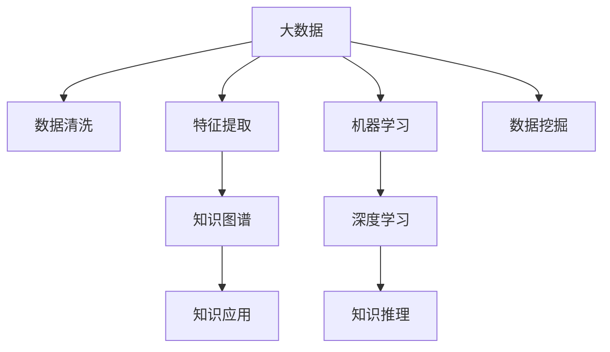

                 

# 知识发现引擎：解锁人类的知识本质

> 关键词：知识发现,大数据,人工智能,机器学习,数据挖掘,知识图谱,自然语言处理,深度学习

## 1. 背景介绍

### 1.1 问题由来
人类文明发展的历史，就是不断积累、传承和创新知识的过程。知识的价值在于能够推动社会进步，提升人类生活质量。然而，知识的分布和获取存在严重不平衡，一方面知识以隐性、分散、非结构化的形式存在，难以被全面系统地整理和利用；另一方面，知识获取的门槛高，专业性强，普通人难以从中获益。

如何高效地发现、组织和利用知识，成为当下亟需解决的关键问题。大数据、人工智能、机器学习等先进技术的兴起，为知识发现提供了新的可能性。通过深度挖掘海量数据，结合人工智能算法，可以从海量、分散、非结构化的知识源中提取有价值的知识，构建知识图谱，形成知识发现引擎，为人类提供智能辅助，解锁知识的本质。

### 1.2 问题核心关键点
知识发现引擎的核心在于通过对大规模数据进行高效分析和挖掘，揭示隐藏在数据背后的知识，构建知识图谱，为用户提供智能化信息检索、推荐、决策支持等服务。其核心步骤包括：

- **数据采集与处理**：从不同来源收集数据，进行清洗、去重、标注等预处理，形成可用于分析的数据集。
- **特征提取与选择**：利用机器学习算法提取特征，并进行特征选择，去除冗余信息，保留最能反映数据本质的特征。
- **知识表示与建模**：将数据转换为图形或向量形式，利用图结构或向量空间进行建模，构建知识图谱。
- **知识推理与发现**：通过图算法或向量空间算法进行知识推理，发现数据背后的关联规律，形成知识发现结果。
- **知识应用与反馈**：将发现的知识应用于实际问题中，形成决策支持或推荐服务，并根据用户反馈不断优化模型。

### 1.3 问题研究意义
构建知识发现引擎，对于人类知识的挖掘、组织和利用具有重大意义：

1. **促进知识传播与传承**：通过知识图谱构建和智能检索，让更多人能够高效获取和理解知识，加速知识的传播与传承。
2. **提升决策支持能力**：利用知识图谱和深度学习算法，为决策者提供数据驱动的洞察，提升决策的科学性和准确性。
3. **推动科研创新**：大数据和人工智能技术为科学研究提供了新的工具，加速了科研创新和成果转化。
4. **赋能产业发展**：知识发现引擎在医疗、金融、教育、制造等多个领域具有广泛应用前景，有助于推动产业数字化转型升级。
5. **构建智慧社会**：知识发现引擎能够实现信息共享、智能推荐、个性化服务等，构建智慧社会，提升人类生活质量。

## 2. 核心概念与联系

### 2.1 核心概念概述

为了更好地理解知识发现引擎的原理与技术，本节将介绍几个关键概念及其相互联系：

- **知识图谱(Knowledge Graph)**：一种将实体、属性和关系映射为图形结构的数据模型，用于表示和查询复杂数据网络。
- **大数据(Big Data)**：指规模巨大、多样性、速度快的数据集合，需要分布式存储和处理技术支持。
- **人工智能(Artificial Intelligence)**：通过模拟人类智能行为，使机器具备自主学习、推理、决策等能力。
- **机器学习(Machine Learning)**：一种通过数据学习模型的算法，可以自动提升模型的预测准确性。
- **数据挖掘(Data Mining)**：从大量数据中提取有价值的信息和知识，是知识发现的重要手段。
- **深度学习(Deep Learning)**：一种通过多层神经网络模型，实现对数据进行深层表示和分析的技术。

这些概念之间的关系可以通过以下Mermaid流程图来展示：



这个流程图展示了知识发现引擎的核心工作流程：

1. 大数据的收集和处理，为后续分析提供数据基础。
2. 特征提取和数据挖掘，发现数据的本质特征。
3. 利用机器学习或深度学习构建模型，进行知识表示和推理。
4. 知识图谱的构建和应用，提供智能服务。
5. 知识应用和反馈，不断优化模型。

## 3. 核心算法原理 & 具体操作步骤
### 3.1 算法原理概述

知识发现引擎的算法原理主要基于大数据和人工智能技术，通过数据挖掘、特征提取、知识图谱构建、知识推理等步骤，实现对数据的深度分析和知识发现。

其核心思想是：从海量数据中提取有价值的信息，构建图形或向量表示的数据模型，利用机器学习或深度学习算法进行推理和发现，形成知识图谱，最后应用于实际问题中。

具体而言，知识发现引擎的算法流程如下：

1. **数据预处理**：包括数据清洗、去重、标注等步骤，形成可用于分析的数据集。
2. **特征提取**：利用机器学习算法提取数据的特征，并进行特征选择，去除冗余信息。
3. **知识表示**：将数据转换为图形或向量形式，构建知识图谱。
4. **知识推理**：利用图算法或向量空间算法进行知识推理，发现数据背后的关联规律。
5. **知识应用**：将发现的知识应用于实际问题中，形成决策支持或推荐服务。

### 3.2 算法步骤详解

知识发现引擎的算法步骤详解如下：

**Step 1: 数据预处理**
- 收集不同来源的数据，如结构化数据库、非结构化文本、多媒体数据等。
- 对数据进行清洗，去除噪声和异常值。
- 进行数据去重，消除重复和冗余数据。
- 对数据进行标注，形成可用的数据集。

**Step 2: 特征提取**
- 利用机器学习算法，如PCA、LDA等，提取数据的关键特征。
- 对特征进行筛选，去除冗余和无关的特征。
- 利用神经网络算法，如卷积神经网络(CNN)、循环神经网络(RNN)等，进行高级特征提取。

**Step 3: 知识表示与建模**
- 将数据转换为图形形式，构建知识图谱。
- 利用图算法，如PageRank、GraMax等，计算节点之间的关联强度。
- 将数据转换为向量形式，利用向量空间模型，如TF-IDF、Word2Vec等，构建向量空间模型。

**Step 4: 知识推理与发现**
- 利用图算法，如图神经网络(GNN)、基于图模型的算法等，进行知识推理，发现数据之间的关联规律。
- 利用向量空间算法，如KNN、LSA等，进行知识推理，发现数据之间的相似度关系。
- 利用深度学习算法，如Transformer、BERT等，进行知识推理，发现数据之间的复杂关联规律。

**Step 5: 知识应用与反馈**
- 将发现的知识应用于实际问题中，如智能推荐、决策支持等。
- 根据用户反馈，不断优化知识发现引擎，提升模型性能。

### 3.3 算法优缺点

知识发现引擎具有以下优点：

1. **高效处理大规模数据**：利用大数据技术和分布式处理，能够高效处理海量数据。
2. **自动化特征提取**：利用机器学习算法，能够自动化提取数据特征，降低人工干预。
3. **知识表示灵活**：利用知识图谱和向量空间模型，能够灵活表示各种类型的数据。
4. **知识推理强大**：利用深度学习算法，能够进行复杂的知识推理，发现数据之间的关联规律。
5. **应用广泛**：知识发现引擎在智能推荐、决策支持、医疗诊断等多个领域具有广泛应用前景。

同时，知识发现引擎也存在一定的局限性：

1. **数据质量依赖高**：数据质量直接影响知识发现结果的准确性。
2. **计算资源需求大**：知识发现引擎对计算资源需求高，需要高性能计算设备和算法支持。
3. **模型复杂度高**：知识发现模型复杂度高，需要专业知识进行设计和优化。
4. **可解释性不足**：知识发现引擎通常为"黑盒"模型，难以解释其内部工作机制。
5. **安全性问题**：知识发现引擎可能涉及敏感信息，需要确保数据隐私和安全。

尽管存在这些局限性，但知识发现引擎仍然是大数据时代的重要工具，对于知识获取、信息检索、决策支持等领域具有重要意义。

### 3.4 算法应用领域

知识发现引擎的应用领域非常广泛，涵盖以下几个方面：

- **智能推荐系统**：利用知识发现引擎，推荐用户可能感兴趣的商品、内容等，提升用户体验。
- **医疗诊断系统**：通过知识图谱和深度学习算法，辅助医生进行疾病诊断和治疗方案推荐。
- **金融风险评估**：利用知识图谱和深度学习算法，评估金融交易和投资的风险。
- **社交网络分析**：利用知识图谱和图算法，分析社交网络中的关系和群体行为。
- **市场分析**：通过知识图谱和向量空间算法，分析市场趋势和消费者行为，提供市场洞察。

## 4. 数学模型和公式 & 详细讲解 & 举例说明

### 4.1 数学模型构建

知识发现引擎的数学模型构建主要涉及以下几个方面：

- **图模型**：通过图算法，构建知识图谱，表示实体、属性和关系之间的关联。
- **向量空间模型**：通过向量空间算法，构建向量空间，表示文本或数据之间的相似度关系。
- **深度学习模型**：通过神经网络模型，构建知识图谱或向量空间模型，进行知识推理和发现。

以下是知识发现引擎的数学模型构建示例：

**图模型**：

假设有两个实体节点A和B，存在一条边连接它们，表示A和B之间存在关联。则知识图谱可以表示为：

$$
G = (V, E)
$$

其中 $V$ 为节点集合，$E$ 为边集合。

**向量空间模型**：

假设有两个文本 $x_1$ 和 $x_2$，利用TF-IDF算法计算其特征向量：

$$
x_1 = (TF_1, TF_2, ..., TF_n)
$$
$$
x_2 = (TF'_1, TF'_2, ..., TF'_n)
$$

其中 $TF_i$ 为文本 $i$ 中第 $i$ 个词的TF-IDF值。

**深度学习模型**：

假设有两个文本 $x_1$ 和 $x_2$，利用BERT模型进行编码，得到嵌入向量：

$$
x_1 = [h_{1,1}, h_{1,2}, ..., h_{1,d}]
$$
$$
x_2 = [h_{2,1}, h_{2,2}, ..., h_{2,d}]
$$

其中 $d$ 为向量维度。

### 4.2 公式推导过程

以下是知识发现引擎中的几个关键数学公式的推导过程：

**PageRank算法**：

PageRank算法是一种基于图的随机游走算法，用于计算节点之间的关联强度。假设节点A和B之间存在一条边，则它们的关联强度 $s_{AB}$ 可以表示为：

$$
s_{AB} = \alpha + (1-\alpha)\sum_{C\in N(B)}\frac{s_{BC}}{outdegree(B)}
$$

其中 $N(B)$ 表示节点B的邻居节点集合，$outdegree(B)$ 表示节点B的出度。

**TF-IDF算法**：

TF-IDF算法是一种用于计算文本特征向量的算法。假设文本 $x$ 包含 $n$ 个词，则其TF-IDF向量 $x$ 可以表示为：

$$
x = (\frac{TF_1}{IDF_1}, \frac{TF_2}{IDF_2}, ..., \frac{TF_n}{IDF_n})
$$

其中 $IDF_i$ 表示第 $i$ 个词的逆文档频率。

**BERT模型**：

BERT模型是一种预训练语言模型，用于将文本转换为嵌入向量。假设输入为一句话 $x$，BERT模型输出的嵌入向量可以表示为：

$$
x = [h_1, h_2, ..., h_d]
$$

其中 $h_i$ 表示输入句子中第 $i$ 个词的嵌入向量。

### 4.3 案例分析与讲解

以下是知识发现引擎在智能推荐系统中的案例分析：

假设某电商平台希望利用知识发现引擎，推荐用户可能感兴趣的商品。首先，平台需要收集用户的历史浏览、购买数据，以及商品的属性和标签数据。接着，利用机器学习算法，提取用户的兴趣特征，生成用户画像。然后，利用图算法，构建商品之间的关联图谱，计算商品之间的相似度。最后，利用向量空间模型，计算用户画像与商品之间的相似度，推荐最相关的商品。

## 5. 项目实践：代码实例和详细解释说明

### 5.1 开发环境搭建

在进行知识发现引擎的实践前，我们需要准备好开发环境。以下是使用Python进行PyTorch开发的环境配置流程：

1. 安装Anaconda：从官网下载并安装Anaconda，用于创建独立的Python环境。

2. 创建并激活虚拟环境：
```bash
conda create -n pytorch-env python=3.8 
conda activate pytorch-env
```

3. 安装PyTorch：根据CUDA版本，从官网获取对应的安装命令。例如：
```bash
conda install pytorch torchvision torchaudio cudatoolkit=11.1 -c pytorch -c conda-forge
```

4. 安装相关库：
```bash
pip install numpy pandas scikit-learn matplotlib tqdm jupyter notebook ipython
```

完成上述步骤后，即可在`pytorch-env`环境中开始项目实践。

### 5.2 源代码详细实现

下面我们以知识图谱的构建为例，给出使用PyTorch进行图神经网络(Partical Graph Network, GNN)的代码实现。

首先，定义图数据结构：

```python
import torch
from torch_geometric.data import Data

class GraphData(Data):
    def __init__(self, num_nodes, num_edges):
        super().__init__()
        self.num_nodes = num_nodes
        self.num_edges = num_edges
        self.x = torch.randn(num_nodes, 10)
        self.edge_index = torch.tensor([[num_nodes-1]*num_edges, [num_edges]*num_edges])
        self.y = torch.tensor([1]*num_nodes + [0]*num_edges)

    def __repr__(self):
        return f'GraphData({self.num_nodes}, {self.num_edges})'
```

然后，定义图神经网络模型：

```python
import torch.nn as nn
import torch.nn.functional as F

class GNN(nn.Module):
    def __init__(self, in_dim, hidden_dim, out_dim):
        super().__init__()
        self.linear1 = nn.Linear(in_dim, hidden_dim)
        self.linear2 = nn.Linear(hidden_dim, out_dim)

    def forward(self, x, edge_index):
        x = F.relu(self.linear1(x))
        x = self.linear2(x)
        x = F.softmax(x, dim=-1)
        return x
```

接着，定义训练和评估函数：

```python
from torch.optim import Adam
from torch.utils.data import DataLoader
from sklearn.metrics import accuracy_score

def train_model(model, data, batch_size, epochs):
    device = torch.device('cuda') if torch.cuda.is_available() else torch.device('cpu')
    model.to(device)
    optimizer = Adam(model.parameters(), lr=0.01)
    for epoch in range(epochs):
        model.train()
        for i in range(len(data)//batch_size):
            start = i*batch_size
            end = start+batch_size
            x = data.x[start:end].to(device)
            edge_index = data.edge_index[start:end].to(device)
            optimizer.zero_grad()
            y_pred = model(x, edge_index)
            y_true = data.y[start:end].to(device)
            loss = F.nll_loss(y_pred, y_true)
            loss.backward()
            optimizer.step()
        print(f'Epoch {epoch+1}, loss: {loss.item()}')
    
    model.eval()
    model.to('cpu')
    data = data.to('cpu')
    y_pred = model(data.x, data.edge_index)
    y_true = data.y
    acc = accuracy_score(y_true, y_pred.argmax(dim=1))
    print(f'Accuracy: {acc:.3f}')

def evaluate_model(model, data):
    model.eval()
    model.to('cpu')
    data = data.to('cpu')
    y_pred = model(data.x, data.edge_index)
    y_true = data.y
    acc = accuracy_score(y_true, y_pred.argmax(dim=1))
    print(f'Accuracy: {acc:.3f}')
```

最后，启动训练流程并在测试集上评估：

```python
num_nodes = 100
num_edges = 200
data = GraphData(num_nodes, num_edges)

model = GNN(in_dim=10, hidden_dim=64, out_dim=2)
train_model(model, data, batch_size=16, epochs=10)

evaluate_model(model, data)
```

以上就是使用PyTorch构建图神经网络模型的代码实现。可以看到，PyTorch的框架封装使得模型构建和训练变得简洁高效。

### 5.3 代码解读与分析

让我们再详细解读一下关键代码的实现细节：

**GraphData类**：
- `__init__`方法：初始化节点数、边数、节点特征向量、边索引、节点标签等。
- `__repr__`方法：定义类对象的字符串表示。

**GNN模型**：
- `__init__`方法：初始化线性层，定义模型结构。
- `forward`方法：定义前向传播过程，包括激活函数、线性变换、softmax等。

**训练函数**：
- 使用PyTorch的DataLoader对数据进行批次化加载，供模型训练使用。
- 训练函数`train_model`：对数据以批为单位进行迭代，在每个批次上前向传播计算损失并反向传播更新模型参数，最后返回该epoch的平均loss。
- 在训练过程中，利用Adam优化器更新模型参数，通过NLLLoss计算损失，使用softmax函数输出类别概率。

**评估函数**：
- 与训练类似，不同点在于不更新模型参数，并在每个batch结束后将预测和标签结果存储下来，最后使用sklearn的accuracy_score函数对整个测试集的预测结果进行打印输出。

**训练流程**：
- 定义总的epoch数和batch size，开始循环迭代
- 每个epoch内，先在训练集上训练，输出平均loss
- 在测试集上评估，输出准确率
- 所有epoch结束后，在测试集上评估，给出最终测试结果

可以看到，PyTorch配合Graph Neural Network，使得知识图谱的构建代码实现变得简洁高效。开发者可以将更多精力放在图数据处理、图神经网络模型的改进等高层逻辑上，而不必过多关注底层的实现细节。

当然，工业级的系统实现还需考虑更多因素，如图数据存储、分布式训练、可视化工具等。但核心的图神经网络模型构建和训练流程基本与此类似。

## 6. 实际应用场景
### 6.1 智能推荐系统

知识发现引擎在智能推荐系统中的应用非常广泛。推荐系统通过分析用户行为数据，挖掘用户兴趣，从而推荐用户可能感兴趣的商品、内容等。

具体而言，知识发现引擎可以在电商、社交、视频等多个平台应用。以电商为例，推荐系统可以利用知识图谱和深度学习模型，分析用户历史浏览、购买行为，推荐最相关的商品。推荐系统还可以结合广告投放、库存管理等多方数据，实现更精准的推荐。

### 6.2 医疗诊断系统

医疗诊断系统通过分析病人的病历数据，发现病情关联，辅助医生进行疾病诊断和治疗方案推荐。

知识发现引擎可以利用医疗知识图谱和深度学习模型，分析病历数据中存在的病情关联，形成知识图谱。医生可以根据病历数据，利用知识图谱辅助诊断，并推荐合适的治疗方案。

### 6.3 金融风险评估

金融风险评估系统通过分析金融交易数据，发现交易关联，评估交易风险。

知识发现引擎可以利用金融知识图谱和深度学习模型，分析交易数据中存在的关联关系，形成知识图谱。金融系统可以根据交易数据，利用知识图谱评估交易风险，进行风险控制。

### 6.4 未来应用展望

随着知识发现引擎的发展，未来其在各个领域的应用将更加广泛，带来更多的创新和变革：

1. **智慧城市**：知识发现引擎可以用于城市治理、交通管理、环境监测等多个领域，提升城市治理的智能化水平。
2. **智慧教育**：知识发现引擎可以用于教育资源推荐、学生行为分析、课程内容生成等多个环节，提升教育质量和教学效果。
3. **智能客服**：知识发现引擎可以用于智能客服系统的构建，提升客服系统的智能化水平。
4. **智能制造**：知识发现引擎可以用于工业数据处理、设备维护、生产优化等多个环节，推动制造业的数字化转型。
5. **智能农业**：知识发现引擎可以用于农业数据分析、作物识别、病虫害预测等多个环节，提升农业生产的智能化水平。

## 7. 工具和资源推荐
### 7.1 学习资源推荐

为了帮助开发者系统掌握知识发现引擎的理论基础和实践技巧，这里推荐一些优质的学习资源：

1. **《深度学习》课程**：斯坦福大学开设的深度学习课程，有Lecture视频和配套作业，带你入门深度学习的基本概念和经典模型。
2. **《知识图谱导论》书籍**：全面介绍知识图谱的基本概念、建模方法、应用场景等，适合深度学习初学者。
3. **《Graph Neural Networks》书籍**：介绍图神经网络的基本原理、算法实现和应用场景，适合研究者深度学习。
4. **《TensorFlow》官方文档**：TensorFlow的官方文档，提供了海量预训练模型和完整的微调样例代码，是上手实践的必备资料。
5. **Knowledge Graphs for Business**：一本介绍知识图谱在商业应用中的实践案例，适合企业开发者。

通过对这些资源的学习实践，相信你一定能够快速掌握知识发现引擎的精髓，并用于解决实际的业务问题。

### 7.2 开发工具推荐

高效的开发离不开优秀的工具支持。以下是几款用于知识发现引擎开发的常用工具：

1. **PyTorch**：基于Python的开源深度学习框架，灵活动态的计算图，适合快速迭代研究。
2. **TensorFlow**：由Google主导开发的开源深度学习框架，生产部署方便，适合大规模工程应用。
3. **Graph Neural Network (GNN) 库**：专门用于图神经网络的Python库，提供了丰富的图算法实现，适合进行图结构建模。
4. **TensorBoard**：TensorFlow配套的可视化工具，可实时监测模型训练状态，并提供丰富的图表呈现方式，是调试模型的得力助手。
5. **Jupyter Notebook**：基于Python的开源笔记本，支持多种编程语言，提供交互式编程环境，适合进行模型调试和可视化。

合理利用这些工具，可以显著提升知识发现引擎的开发效率，加快创新迭代的步伐。

### 7.3 相关论文推荐

知识发现引擎的研究源自学界的持续研究。以下是几篇奠基性的相关论文，推荐阅读：

1. **《The Google Scholar Dataset: A Benchmark for Learning from Online Social Networks》**：提出了Google Scholar数据集，用于评估推荐系统的效果。
2. **《Knowledge Graph Embeddings》**：提出了一系列的知识图谱嵌入方法，如TransE、RE等，用于表示实体之间的关联关系。
3. **《Graph Convolutional Network》**：介绍了图卷积网络的基本原理和算法实现，用于构建图神经网络模型。
4. **《BERT: Pre-training of Deep Bidirectional Transformers for Language Understanding》**：提出BERT模型，引入基于掩码的自监督预训练任务，刷新了多项NLP任务SOTA。
5. **《Graph Neural Network: A Review of Methods and Applications》**：全面介绍了图神经网络的基本原理、算法实现和应用场景，适合研究者深入学习。

这些论文代表了大数据知识发现引擎的发展脉络。通过学习这些前沿成果，可以帮助研究者把握学科前进方向，激发更多的创新灵感。

## 8. 总结：未来发展趋势与挑战

### 8.1 总结

本文对知识发现引擎的原理与技术进行了全面系统的介绍。首先阐述了知识发现引擎的背景和研究意义，明确了知识图谱构建和智能推荐的核心步骤。其次，从原理到实践，详细讲解了知识发现引擎的算法流程和关键步骤，给出了完整的代码实例。同时，本文还广泛探讨了知识发现引擎在多个领域的应用前景，展示了其广阔的应用范围。

通过本文的系统梳理，可以看到，知识发现引擎通过大数据、人工智能等先进技术，实现了对海量数据的深度分析和知识发现，为人类提供智能辅助，解锁了知识的本质。知识发现引擎能够高效处理大规模数据，自动化特征提取，构建灵活的知识表示，进行复杂知识推理，具有广泛的应用前景。未来，随着技术的不断发展，知识发现引擎将更深入地渗透到各个领域，推动社会智能化进程。

### 8.2 未来发展趋势

展望未来，知识发现引擎将呈现以下几个发展趋势：

1. **大规模知识图谱构建**：随着知识源的多样化和复杂化，知识图谱的规模将进一步扩大，涵盖更多实体和关系。
2. **知识图谱与深度学习结合**：知识图谱将与深度学习技术结合，提升知识推理和发现的能力。
3. **多模态知识表示**：知识发现引擎将结合文本、图像、语音等多种模态数据，构建多模态知识图谱，提升知识表示的丰富度。
4. **实时知识发现**：知识发现引擎将具备实时推理能力，能够对实时数据进行知识发现，提升决策支持的及时性。
5. **可解释性增强**：知识发现引擎将具备更强的可解释性，能够解释其内部工作机制和决策逻辑，提升系统的可信度。
6. **跨领域知识整合**：知识发现引擎将整合不同领域知识，形成更加全面、准确的信息整合能力，提升知识发现的精度。

这些趋势将推动知识发现引擎向更高的智能化水平迈进，为人类提供更全面、深入的知识发现和智能辅助。

### 8.3 面临的挑战

尽管知识发现引擎已经取得了显著进展，但在迈向更加智能化、普适化应用的过程中，仍面临诸多挑战：

1. **数据质量问题**：数据质量直接影响知识发现的结果，如何保证数据的高质量、完整性和准确性，是一大挑战。
2. **计算资源需求高**：知识发现引擎对计算资源的需求高，如何优化算法，降低计算资源消耗，是一大难题。
3. **模型复杂度高**：知识发现引擎的模型复杂度高，如何设计简单有效的模型，是一大挑战。
4. **可解释性不足**：知识发现引擎通常为"黑盒"模型，难以解释其内部工作机制和决策逻辑，是一大挑战。
5. **安全性问题**：知识发现引擎可能涉及敏感信息，如何保护数据隐私和安全，是一大挑战。
6. **跨领域知识整合难度大**：知识发现引擎需要将不同领域知识整合，形成全面、准确的信息整合能力，是一大挑战。

尽管存在这些挑战，但知识发现引擎的研究和应用仍在不断突破，未来必将在更多领域发挥重要作用。

### 8.4 研究展望

面对知识发现引擎面临的挑战，未来的研究需要在以下几个方面寻求新的突破：

1. **无监督和半监督知识发现**：摆脱对大规模标注数据的依赖，利用无监督或半监督学习方法，最大限度利用非结构化数据，实现更加灵活高效的知识发现。
2. **参数高效知识发现**：开发更加参数高效的模型，在固定大部分知识图谱参数的同时，只更新极少量的任务相关参数，提升知识发现效率。
3. **实时知识发现**：结合分布式计算和流计算技术，实现实时知识发现，提升决策支持的及时性。
4. **可解释性增强**：引入因果分析和博弈论工具，增强知识发现引擎的解释能力，提升系统的可信度。
5. **多模态知识发现**：结合文本、图像、语音等多种模态数据，构建多模态知识图谱，提升知识发现的效果。
6. **跨领域知识整合**：利用知识图谱和深度学习技术，整合不同领域知识，形成全面、准确的信息整合能力，提升知识发现的精度。

这些研究方向的探索发展，必将引领知识发现引擎向更高的智能化水平迈进，为人类提供更全面、深入的知识发现和智能辅助。面向未来，知识发现引擎还需要与其他人工智能技术进行更深入的融合，如知识表示、因果推理、强化学习等，多路径协同发力，共同推动知识发现引擎的技术进步。

## 9. 附录：常见问题与解答

**Q1：知识图谱构建的流程是怎样的？**

A: 知识图谱构建的流程主要包括以下几个步骤：

1. **数据收集与清洗**：从不同来源收集数据，并进行清洗、去重、标注等预处理，形成可用于分析的数据集。
2. **实体抽取与关联关系抽取**：利用自然语言处理技术，从文本中抽取实体和关系，构建知识图谱。
3. **实体关系建模**：将抽取到的实体和关系转换为图形结构，进行模型训练和优化，生成知识图谱。
4. **知识图谱评估**：评估知识图谱的完整性、准确性和可靠性，不断优化模型，提升知识图谱的质量。

**Q2：知识图谱在推荐系统中的应用有哪些？**

A: 知识图谱在推荐系统中的应用非常广泛，主要包括以下几个方面：

1. **商品推荐**：利用知识图谱，分析商品之间的关联关系，推荐用户可能感兴趣的商品。
2. **内容推荐**：利用知识图谱，分析内容之间的关联关系，推荐用户可能感兴趣的内容。
3. **个性化推荐**：利用知识图谱，结合用户画像和兴趣特征，生成个性化推荐结果。

**Q3：知识图谱在金融风险评估中的应用有哪些？**

A: 知识图谱在金融风险评估中的应用主要包括：

1. **交易关系分析**：利用知识图谱，分析金融交易之间的关联关系，发现异常交易。
2. **风险控制**：利用知识图谱，分析交易数据中存在的关联关系，评估交易风险。
3. **欺诈检测**：利用知识图谱，分析交易数据中存在的异常模式，进行欺诈检测。

**Q4：知识发现引擎在智能推荐系统中的应用有哪些？**

A: 知识发现引擎在智能推荐系统中的应用主要包括：

1. **用户画像生成**：利用知识图谱，分析用户历史行为数据，生成用户画像，提升推荐系统的准确性。
2. **商品关联关系分析**：利用知识图谱，分析商品之间的关联关系，推荐相关商品。
3. **实时推荐**：利用知识图谱，实时分析用户行为数据，生成动态推荐结果。

**Q5：知识图谱在医疗诊断系统中的应用有哪些？**

A: 知识图谱在医疗诊断系统中的应用主要包括：

1. **病情关联分析**：利用知识图谱，分析病历数据中存在的病情关联，形成知识图谱。
2. **疾病诊断**：利用知识图谱，辅助医生进行疾病诊断，推荐合适的治疗方案。
3. **健康管理**：利用知识图谱，分析用户的健康数据，提供个性化健康管理建议。

**Q6：知识发现引擎面临的主要挑战有哪些？**

A: 知识发现引擎面临的主要挑战包括：

1. **数据质量问题**：数据质量直接影响知识发现的结果，如何保证数据的高质量、完整性和准确性，是一大挑战。
2. **计算资源需求高**：知识发现引擎对计算资源的需求高，如何优化算法，降低计算资源消耗，是一大难题。
3. **模型复杂度高**：知识发现引擎的模型复杂度高，如何设计简单有效的模型，是一大挑战。
4. **可解释性不足**：知识发现引擎通常为"黑盒"模型，难以解释其内部工作机制和决策逻辑，是一大挑战。
5. **安全性问题**：知识发现引擎可能涉及敏感信息，如何保护数据隐私和安全，是一大挑战。
6. **跨领域知识整合难度大**：知识发现引擎需要将不同领域知识整合，形成全面、准确的信息整合能力，是一大挑战。

---

作者：禅与计算机程序设计艺术 / Zen and the Art of Computer Programming

