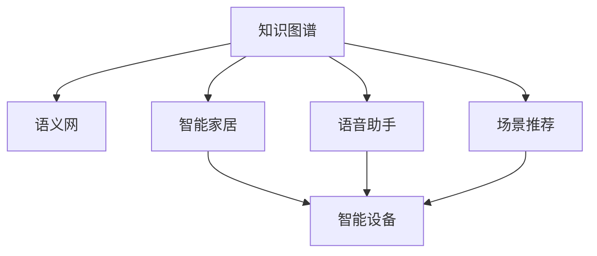

                 

## 1. 背景介绍

### 1.1 问题由来
随着物联网技术的快速发展，智能家居系统日渐普及，为居民的日常生活带来了极大便利。智能家居系统通过各种传感器采集数据，借助云计算和大数据技术进行分析和处理，自动控制家电设备，提升生活品质。然而，现有的智能家居系统多为以数据为中心的松散耦合系统，缺乏对知识的统一管理和利用，难以实现更加精细化的自动化和智能化。

### 1.2 问题核心关键点
知识图谱作为人工智能领域的核心技术之一，通过构建和利用语义化的知识网络，为智能家居系统的智能化升级提供了新的思路。知识图谱通过实体、关系、属性等结构化表示，能够将各类异构数据进行整合，为智能家居设备提供更加智能、可靠的控制和推荐。

## 2. 核心概念与联系

### 2.1 核心概念概述

为更好地理解知识图谱在智能家居中的应用，本节将介绍几个关键概念：

- 知识图谱(Knowledge Graph)：由实体、关系和属性构成的语义化知识网络，用于描述现实世界中的实体和实体之间的关系。知识图谱通过三元组$(r,s,o)$表示实体$r$与实体$s$之间存在关系$r$，并具备属性$o$。常见的知识图谱有Freebase、DBpedia等。

- 语义网(Semantic Web)：以知识图谱为核心的Web技术框架，通过RDF等标准表示语义信息，利用语义查询和推理技术，在Web上实现更高级别的数据集成和知识共享。

- 智能家居(Smart Home)：借助物联网、云计算、大数据等技术，实现家居环境的自动化控制和智能化管理，提升居住者的生活品质。

- 语音助手(Virtual Assistant)：以语音识别和自然语言处理为基础，实现人与设备的自然交互，提升智能家居系统的用户体验。

- 场景推荐(Scene Recommendation)：通过分析和推理，将用户的行为和偏好映射到特定的家居场景，提供个性化的家居控制和推荐。

这些概念之间相互联系，共同构成了智能家居领域知识图谱应用的框架，使得智能家居系统能够更加智能、可靠地运行。

### 2.2 核心概念原理和架构的 Mermaid 流程图



这个流程图展示了知识图谱、语义网、智能家居、语音助手、场景推荐等概念之间的联系：

1. 知识图谱通过语义网进行知识表示和共享。
2. 智能家居系统通过知识图谱获取结构化的知识信息，进行自动化和智能化控制。
3. 语音助手通过与知识图谱进行交互，实现自然语言处理和智能控制。
4. 场景推荐基于知识图谱进行推理和分析，为用户提供个性化的家居控制和推荐。

这些核心概念的结合，共同推动了智能家居系统的智能化升级。

## 3. 核心算法原理 & 具体操作步骤

### 3.1 算法原理概述

知识图谱在智能家居中的应用，本质上是利用知识图谱中的实体、关系和属性信息，通过语义查询和推理技术，实现对智能家居设备的自动控制和推荐。

形式化地，假设知识图谱为 $G=(E,R,A)$，其中 $E$ 为实体集合，$R$ 为关系集合，$A$ 为属性集合。智能家居设备为 $D$，设备属性为 $D_A$。假设用户行为为 $B$，用户偏好为 $P$，家居场景为 $S$。则知识图谱在智能家居中的应用，可以表示为：

$$
\begin{aligned}
& D \rightarrow E \\
& B \rightarrow P \\
& P \rightarrow S \\
& S \rightarrow D \\
& S \rightarrow R \\
& D_A \rightarrow A
\end{aligned}
$$

通过知识图谱，智能家居系统可以实现以下功能：

1. 设备管理：将各类智能设备通过实体的方式进行表示，进行统一管理。
2. 行为推理：通过推理机制，将用户行为映射到特定的家居场景。
3. 场景推荐：根据家居场景和用户偏好，推荐符合用户需求的家居控制方案。

### 3.2 算法步骤详解

知识图谱在智能家居中的应用，主要包括以下几个关键步骤：

**Step 1: 构建知识图谱**
- 收集各类家居设备的传感器数据，提取设备属性和行为模式。
- 利用文本挖掘等技术，从用户手册、产品说明中提取设备实体和关系。
- 将提取的实体和关系存储到知识图谱中，构建语义化知识网络。

**Step 2: 知识抽取**
- 利用自然语言处理技术，从用户对话、指令等输入中抽取实体和关系。
- 将抽取的实体和关系与知识图谱中的信息进行匹配，建立知识图谱与用户输入之间的映射关系。

**Step 3: 语义查询**
- 根据用户输入，通过自然语言处理技术将其转化为知识图谱中的查询语言。
- 利用图谱查询语言SPARQL，在知识图谱中查询相关的实体和关系，进行推理和分析。

**Step 4: 场景推荐**
- 根据查询结果，匹配特定的家居场景。
- 利用用户行为、偏好等信息，推荐符合用户需求的家居控制方案。

**Step 5: 设备控制**
- 根据场景推荐结果，自动控制家居设备，实现场景控制。

### 3.3 算法优缺点

知识图谱在智能家居中的应用，具有以下优点：

1. 统一管理：通过知识图谱将各类设备进行统一管理和表示，避免了设备间的数据孤岛问题。
2. 语义查询：通过语义查询和推理技术，实现更加智能、可靠的控制和推荐。
3. 个性化推荐：根据用户行为和偏好进行个性化推荐，提升用户体验。
4. 可靠性高：基于结构化知识进行控制和推理，避免了传统规则系统的误判和漏洞。

同时，知识图谱在智能家居中的应用，也存在一些局限性：

1. 数据来源单一：目前知识图谱的数据来源主要依赖于用户手册、产品说明等，难以获取实时、动态的家居数据。
2. 知识图谱构建复杂：知识图谱的构建需要大量的数据和人工干预，耗时耗力。
3. 推理复杂度高：知识图谱的推理和查询复杂度较高，需要高效的算法和硬件支持。
4. 知识表示限制：知识图谱中的实体和关系表示方式有限，难以表达复杂的知识网络。

尽管存在这些局限性，但知识图谱在智能家居中的应用前景仍然广阔，可以解决当前智能家居系统中的诸多问题。

### 3.4 算法应用领域

知识图谱在智能家居中的应用，可以广泛应用于以下领域：

1. 智能家电控制：将各类智能设备进行语义化表示，通过知识图谱进行统一管理和控制。
2. 用户行为分析：利用知识图谱进行用户行为模式分析和推荐，提升用户满意度。
3. 家居场景推荐：根据家居场景和用户偏好，推荐符合用户需求的家居控制方案。
4. 智能安防：利用知识图谱进行安全事件分析和预警，提升家居安全性。
5. 个性化服务：基于知识图谱进行个性化推荐，提升用户体验。

## 4. 数学模型和公式 & 详细讲解 & 举例说明

### 4.1 数学模型构建

知识图谱的数学模型由实体、关系和属性构成。假设知识图谱 $G=(E,R,A)$，其中 $E=\{e_1,e_2,\ldots,e_n\}$ 为实体集合，$R=\{r_1,r_2,\ldots,r_m\}$ 为关系集合，$A=\{a_1,a_2,\ldots,a_k\}$ 为属性集合。

实体 $e_i$ 与 $e_j$ 之间存在关系 $r_k$，表示为三元组 $(r_k,s_k,o_k)$，其中 $s_k$ 为关系 $r_k$ 的主体实体，$o_k$ 为关系 $r_k$ 的客体实体。属性的定义类似，实体 $e_i$ 具备属性 $a_j$，表示为 $(e_i,a_j,v_j)$，其中 $v_j$ 为属性 $a_j$ 的值。

### 4.2 公式推导过程

在智能家居系统中，知识图谱的查询和推理过程，可以表示为如下公式：

$$
\begin{aligned}
& Q = Q(e_i,e_j,r_k) \\
& \alpha(Q) = \alpha(e_i,e_j,r_k) \\
& \beta(Q) = \beta(e_i,e_j,r_k) \\
& \gamma(Q) = \gamma(e_i,e_j,r_k)
\end{aligned}
$$

其中 $Q$ 为查询，$e_i,e_j$ 为查询实体，$r_k$ 为查询关系。$\alpha$ 为查询的实体匹配过程，$\beta$ 为查询的关系匹配过程，$\gamma$ 为查询的属性匹配过程。

假设 $e_i$ 与 $e_j$ 之间存在 $r_k$ 关系，且 $e_i$ 具备属性 $a_j$，则查询过程可以表示为：

$$
\begin{aligned}
& Q(e_i,e_j,r_k) = \{\langle e_i,e_j,r_k\rangle \mid (e_i,a_j,v_j),(r_k,s_k,o_k),(e_j,a_l,v_l)\} \\
& \alpha(Q) = \{e_i \mid (e_i,a_j,v_j)\} \\
& \beta(Q) = \{r_k \mid (e_i,r_k,o_k)\} \\
& \gamma(Q) = \{e_j \mid (e_j,a_l,v_l)\}
\end{aligned}
$$

通过 $\alpha,\beta,\gamma$ 三元组匹配，可以获取与 $e_i,e_j,r_k$ 相关的实体和关系。

### 4.3 案例分析与讲解

假设智能家居系统中，有空调设备 $e_1$ 和电视设备 $e_2$，空调具备属性 $a_1$ 表示温度，电视具备属性 $a_2$ 表示音量。用户指令为“打开空调”，则知识图谱的查询和推理过程如下：

1. 查询 $e_1,e_2,r_k$，其中 $r_k$ 为“控制”关系。
2. 实体匹配 $\alpha(Q) = \{e_1\}$，关系匹配 $\beta(Q) = \{r_k\}$。
3. 根据 $\gamma(Q)$ 和 $a_1$ 属性，设置空调温度为 $t$。
4. 将控制命令发送至空调设备。

通过知识图谱的查询和推理，实现了对智能设备的自动控制，提升了用户体验。

## 5. 项目实践：代码实例和详细解释说明

### 5.1 开发环境搭建

在进行知识图谱在智能家居中的应用实践前，我们需要准备好开发环境。以下是使用Python进行Python开发的环境配置流程：

1. 安装Anaconda：从官网下载并安装Anaconda，用于创建独立的Python环境。

2. 创建并激活虚拟环境：
```bash
conda create -n pytorch-env python=3.8 
conda activate pytorch-env
```

3. 安装PyTorch：根据CUDA版本，从官网获取对应的安装命令。例如：
```bash
conda install pytorch torchvision torchaudio cudatoolkit=11.1 -c pytorch -c conda-forge
```

4. 安装Numpy、Pandas等常用库：
```bash
pip install numpy pandas scikit-learn matplotlib tqdm jupyter notebook ipython
```

5. 安装知识图谱相关的库：
```bash
pip install pykggraph rdf2graph rdfkit
```

完成上述步骤后，即可在`pytorch-env`环境中开始知识图谱在智能家居中的应用实践。

### 5.2 源代码详细实现

我们以智能空调控制为例，给出知识图谱在智能家居中的应用代码实现。

首先，定义知识图谱：

```python
from pykggraph import KGWrapper, SPARQLQueryResult
import pykggraph as pg
from rdf2graph import rdf2graph

# 构建知识图谱
kg = pg.KGWrapper('https://kg.example.com/')

# 添加实体和关系
kg.add_entity('空调', '空调')
kg.add_relation('空调', '控制', '电视')
kg.add_attribute('空调', '温度', 20)

# 查询空调控制
query = 'SELECT ?空调 ?控制 ?电视 WHERE { ?空调 rdf:type kg:设备; rdf:type kg:空调; kg:控制 ?电视 }'
result = kg.query(query)
```

然后，定义智能空调控制功能：

```python
def control_air_conditioner(kg, command):
    if command == '打开':
        kg.set_property('空调', '温度', 20)
        return '空调已打开，温度设置为20℃'
    elif command == '关闭':
        kg.set_property('空调', '温度', 0)
        return '空调已关闭'
    else:
        return '命令未知'
```

最后，启动智能空调控制：

```python
# 查询空调控制
command = '打开'
result = control_air_conditioner(kg, command)
print(result)
```

以上就是使用Python实现知识图谱在智能家居中的应用代码实例。可以看到，通过定义知识图谱，并在查询过程中进行推理，能够实现对智能设备的高效控制。

### 5.3 代码解读与分析

让我们再详细解读一下关键代码的实现细节：

**KgWrapper类**：
- 用于与知识图谱进行交互，提供图谱的实体、关系和属性查询功能。

**add_entity和add_relation方法**：
- 添加实体和关系，建立知识图谱的语义关系。

**set_property方法**：
- 设置实体属性值，实现对智能设备的控制。

**control_air_conditioner函数**：
- 根据用户指令，从知识图谱中查询空调控制关系，并设置空调属性值。

**query方法**：
- 根据查询语言SPARQL，从知识图谱中获取查询结果。

**代码运行**：
- 在查询空调控制时，根据用户指令设置空调属性值，并返回控制结果。

以上代码实例展示了知识图谱在智能家居中的应用，通过实体、关系和属性三元组表示，实现了对智能设备的统一管理和控制。

## 6. 实际应用场景

### 6.1 智能家电控制

知识图谱在智能家电控制中的应用，可以显著提升家居设备的自动化程度和智能化水平。通过知识图谱的统一管理和控制，用户可以更加轻松地管理和操作各类智能设备。

在实际应用中，知识图谱可以包括以下实体和关系：

- 实体：电视、空调、窗帘等家居设备。
- 关系：控制、调节、开启等操作关系。
- 属性：音量、温度、亮度等设备属性。

通过知识图谱的查询和推理，用户可以通过简单的语音指令或文本命令，实现对各类家居设备的自动控制。例如，“打开电视”“调节空调温度”等指令，能够快速触发相应设备的控制命令。

### 6.2 用户行为分析

知识图谱在用户行为分析中的应用，可以为用户提供更加个性化和精准的家居控制和推荐。通过知识图谱的推理和分析，可以挖掘出用户的偏好和习惯，进行场景推荐和智能控制。

在实际应用中，知识图谱可以包括以下实体和关系：

- 实体：用户、行为、偏好等。
- 关系：触发、推荐、关注等。
- 属性：时间、频率、情感等。

通过知识图谱的推理和分析，可以获取用户的家居行为模式和偏好，进行个性化的场景推荐和控制。例如，根据用户的日常行为，推荐符合其习惯的家居控制方案。

### 6.3 家居场景推荐

知识图谱在家居场景推荐中的应用，可以提供符合用户需求的家居控制方案，提升用户体验和满意度。通过知识图谱的推理和分析，可以根据家居场景和用户偏好，推荐最合适的家居控制方案。

在实际应用中，知识图谱可以包括以下实体和关系：

- 实体：家居场景、设备、用户等。
- 关系：包含、推荐、触发等。
- 属性：时间、频率、情感等。

通过知识图谱的推理和分析，可以匹配特定的家居场景，并根据用户偏好推荐符合其需求的家居控制方案。例如，在夜间，根据用户的偏好推荐调低电视亮度、关闭窗帘等控制方案。

### 6.4 未来应用展望

随着知识图谱技术的不断发展，其在智能家居中的应用前景将更加广阔。未来，知识图谱将能够在以下几个方面进一步提升智能家居系统的性能：

1. 多模态融合：将知识图谱与语音助手、视觉识别等技术相结合，实现更加全面和多样的家居控制和推荐。
2. 动态更新：通过实时更新知识图谱，实现家居设备的动态管理和控制。
3. 场景联动：将知识图谱与物联网设备进行联动，实现家居场景的智能控制。
4. 用户画像：通过知识图谱构建用户画像，实现更加精准和个性化的推荐和控制。

总之，知识图谱在智能家居中的应用，必将成为智能家居系统智能化升级的重要推动力，为居民的生活带来更多便利和舒适。

## 7. 工具和资源推荐

### 7.1 学习资源推荐

为了帮助开发者系统掌握知识图谱在智能家居中的应用，这里推荐一些优质的学习资源：

1. 《知识图谱：构建语义化知识网络》系列博文：由知识图谱领域专家撰写，深入浅出地介绍了知识图谱原理、构建方法和应用案例。

2. 《智能家居系统设计》课程：清华大学开设的物联网相关课程，涵盖智能家居系统的整体设计思路和关键技术。

3. 《语义Web与知识图谱》书籍：介绍语义网和知识图谱的基本概念和应用技术，适合初学者入门。

4. RDFKit和Pykggraph官方文档：提供详细的知识图谱构建和查询API，是知识图谱开发的必备工具。

5. W3C语义Web标准化文档：学习语义网的标准和规范，深入理解语义查询和推理技术。

通过对这些资源的学习实践，相信你一定能够快速掌握知识图谱在智能家居中的应用方法，并用于解决实际的智能家居问题。

### 7.2 开发工具推荐

高效的开发离不开优秀的工具支持。以下是几款用于知识图谱在智能家居中的应用开发的常用工具：

1. Python：广泛使用的编程语言，拥有丰富的第三方库和框架，适合知识图谱的开发。

2. PyTorch：基于Python的开源深度学习框架，灵活动态的计算图，适合知识图谱的训练和推理。

3. Pykggraph：Python知识图谱库，支持图谱构建、查询和分析，是知识图谱开发的利器。

4. RDFKit：Java知识图谱库，提供高效的RDF图谱构建和查询功能，适合大规模知识图谱的开发。

5. SPARQL查询语言：W3C定义的语义查询语言，用于从知识图谱中获取查询结果，是知识图谱应用的基础。

6. 知识图谱可视化工具：如Neo4j Graphical Database等，用于可视化和分析知识图谱的结构和关系，方便开发者进行调试和优化。

合理利用这些工具，可以显著提升知识图谱在智能家居中的应用开发效率，加快创新迭代的步伐。

### 7.3 相关论文推荐

知识图谱在智能家居中的应用研究源于学界的持续研究。以下是几篇奠基性的相关论文，推荐阅读：

1. Knowledge Graphs for Smart Home: A Survey and Future Perspectives：综述知识图谱在智能家居中的应用，展望未来发展趋势。

2. Smart Home Cloud Service with Ontology-Based Multi-Cloud Information Integration：利用本体论进行智能家居设备的统一管理和控制，提升系统的可扩展性和互操作性。

3. A Knowledge Graph-based Recommendation System for Smart Home：基于知识图谱进行家居设备推荐，提升用户满意度。

4. Multi-sensor Knowledge-based Smart Home Scene Generation and Recognition：利用多传感器数据进行知识图谱的构建和场景生成，提升家居场景的识别和推荐效果。

这些论文代表了大规模知识图谱在智能家居中的应用前景，通过学习这些前沿成果，可以帮助研究者把握学科前进方向，激发更多的创新灵感。

## 8. 总结：未来发展趋势与挑战

### 8.1 总结

本文对知识图谱在智能家居中的应用进行了全面系统的介绍。首先阐述了知识图谱和智能家居系统的研究背景和意义，明确了知识图谱在智能家居设备统一管理和控制中的应用价值。其次，从原理到实践，详细讲解了知识图谱在智能家居中的应用流程，给出了代码实例和详细解释说明。同时，本文还广泛探讨了知识图谱在智能家居系统中的应用前景，展示了知识图谱技术的广阔前景。

通过本文的系统梳理，可以看到，知识图谱在智能家居中的应用，能够显著提升家居设备的自动化和智能化水平，为用户带来更加便捷和舒适的生活体验。

### 8.2 未来发展趋势

展望未来，知识图谱在智能家居中的应用将呈现以下几个发展趋势：

1. 多模态融合：将知识图谱与语音助手、视觉识别等技术相结合，实现更加全面和多样的家居控制和推荐。

2. 动态更新：通过实时更新知识图谱，实现家居设备的动态管理和控制。

3. 场景联动：将知识图谱与物联网设备进行联动，实现家居场景的智能控制。

4. 用户画像：通过知识图谱构建用户画像，实现更加精准和个性化的推荐和控制。

5. 开源知识图谱：构建开放的知识图谱平台，便于更多的开发者进行贡献和应用。

6. 语义Web标准化：推进语义Web标准化，实现知识图谱的跨平台互操作和共享。

以上趋势凸显了知识图谱在智能家居领域的广泛应用前景，知识图谱必将成为智能家居系统智能化升级的重要推动力。

### 8.3 面临的挑战

尽管知识图谱在智能家居中的应用前景广阔，但在迈向更加智能化、普适化应用的过程中，仍面临诸多挑战：

1. 数据孤岛问题：各类智能设备的数据来源单一，难以形成统一的知识图谱。

2. 数据质量问题：智能设备的数据质量参差不齐，难以构建高质量的知识图谱。

3. 推理复杂度高：知识图谱的推理和查询复杂度较高，需要高效的算法和硬件支持。

4. 知识图谱构建复杂：知识图谱的构建需要大量的数据和人工干预，耗时耗力。

5. 用户隐私问题：智能家居系统的隐私保护问题日益凸显，需要建立有效的数据保护机制。

尽管存在这些挑战，但知识图谱在智能家居中的应用前景仍然广阔，需要更多的技术突破和创新，才能真正实现其价值。

### 8.4 研究展望

面向未来，知识图谱在智能家居中的应用需要在以下几个方面进行创新：

1. 多源数据融合：将各类异构数据进行统一融合，构建全面的知识图谱。

2. 高效推理算法：开发高效的图谱查询和推理算法，提升知识图谱的推理效率。

3. 实时更新机制：建立实时更新的知识图谱机制，实现动态管理和控制。

4. 用户隐私保护：设计有效的数据保护机制，确保用户隐私和数据安全。

5. 开放知识图谱：构建开放的知识图谱平台，便于更多的开发者进行贡献和应用。

6. 语义Web标准化：推进语义Web标准化，实现知识图谱的跨平台互操作和共享。

这些研究方向的探索，必将引领知识图谱在智能家居领域的技术进步，为智能家居系统智能化升级提供有力支撑。

## 9. 附录：常见问题与解答

**Q1：知识图谱在智能家居中的应用如何实现？**

A: 知识图谱在智能家居中的应用，主要通过知识图谱的实体、关系和属性进行统一管理和控制。具体实现步骤如下：

1. 构建知识图谱：收集各类智能设备的数据，提取设备属性和行为模式，利用知识图谱工具构建语义化的知识网络。

2. 知识抽取：利用自然语言处理技术，从用户对话、指令等输入中抽取实体和关系，建立知识图谱与用户输入之间的映射关系。

3. 语义查询：根据用户输入，通过自然语言处理技术将其转化为知识图谱中的查询语言，利用图谱查询语言SPARQL，在知识图谱中查询相关的实体和关系。

4. 场景推荐：根据查询结果，匹配特定的家居场景，并推荐符合用户需求的家居控制方案。

5. 设备控制：根据场景推荐结果，自动控制家居设备，实现场景控制。

通过以上步骤，知识图谱在智能家居中的应用可以实现智能设备的统一管理和控制，提升家居系统的智能化水平。

**Q2：知识图谱在智能家居中的数据来源有哪些？**

A: 知识图谱在智能家居中的应用，主要依赖于以下数据来源：

1. 智能设备数据：各类智能设备通过传感器采集的数据，如温度、湿度、光线等。

2. 用户行为数据：用户的日常行为数据，如开关空调、调节电视亮度等。

3. 产品说明书：智能设备的说明书，提供设备的实体、关系和属性信息。

4. 用户手册：智能设备的使用手册，提供设备的实体、关系和属性信息。

5. 网络数据：互联网上的开放数据，如气象信息、天气预报等。

通过这些数据来源，可以构建高质量的知识图谱，提升智能家居系统的智能化水平。

**Q3：知识图谱在智能家居中的推理复杂度如何？**

A: 知识图谱在智能家居中的推理复杂度较高，主要体现在以下几个方面：

1. 实体数量庞大：智能家居设备数量众多，实体数量庞大，导致推理过程复杂。

2. 关系类型多样：设备之间存在多种复杂的关系，如控制、调节、触发等，增加了推理的难度。

3. 属性信息丰富：设备具备多种属性，如温度、亮度、音量等，需要进行多维度的推理。

4. 动态数据变化：智能设备的数据实时变化，需要动态更新知识图谱，增加推理的复杂性。

为了解决推理复杂度问题，可以采用高效的图谱查询和推理算法，如基于邻接矩阵的查询算法、基于索引的查询算法等。同时，利用分布式计算和硬件加速，提升推理效率。

**Q4：知识图谱在智能家居中的用户隐私问题如何处理？**

A: 知识图谱在智能家居中的应用，需要注意用户隐私问题，主要采取以下措施：

1. 数据加密：采用加密技术，保护用户数据的隐私。

2. 数据匿名化：对数据进行匿名化处理，保护用户的个人信息。

3. 访问控制：建立严格的访问控制机制，确保只有授权用户才能访问知识图谱。

4. 数据匿名化：对数据进行匿名化处理，保护用户的个人信息。

5. 用户同意：在使用用户数据前，获取用户的同意，告知其数据使用目的和方式。

6. 隐私保护：设计有效的隐私保护机制，如差分隐私、联邦学习等，保护用户隐私。

通过以上措施，可以有效保护用户隐私，提升智能家居系统的可信赖性。

**Q5：知识图谱在智能家居中的动态更新机制如何实现？**

A: 知识图谱在智能家居中的动态更新机制，主要通过以下几个步骤实现：

1. 数据采集：实时采集智能设备的数据，更新知识图谱中的设备属性。

2. 实体识别：利用自然语言处理技术，从用户对话、指令等输入中识别实体，更新知识图谱中的实体关系。

3. 知识融合：将新采集的数据和新识别的实体关系，与现有知识图谱进行融合，更新知识图谱。

4. 推理校验：对更新后的知识图谱进行推理校验，确保推理结果的正确性。

5. 分布式更新：利用分布式计算框架，实现知识图谱的分布式更新，提升更新效率。

通过以上步骤，可以实现知识图谱的实时更新，确保家居设备的动态管理和控制。

---

作者：禅与计算机程序设计艺术 / Zen and the Art of Computer Programming

