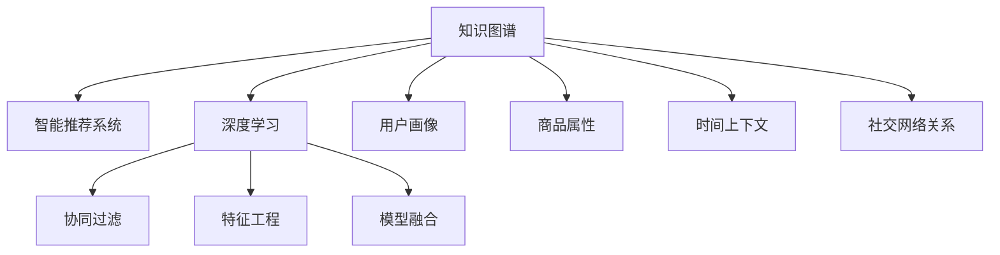
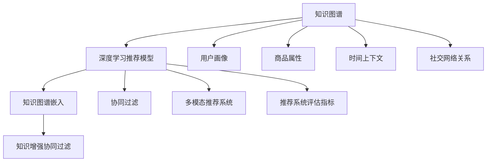
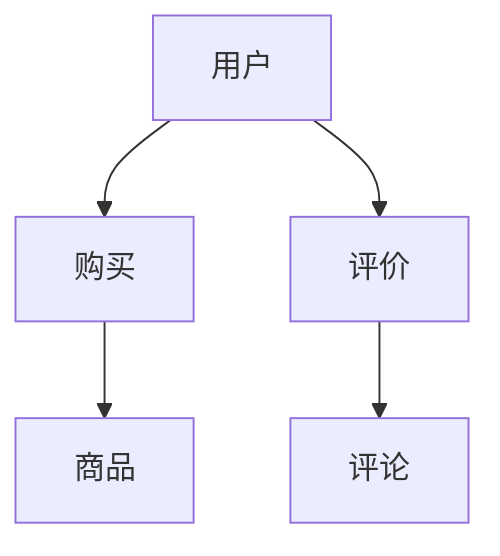

                 

# 知识图谱在智能推荐系统中的应用

> 关键词：知识图谱,智能推荐系统,深度学习,协同过滤,特征工程,模型融合

## 1. 背景介绍

### 1.1 问题由来

在互联网时代，信息爆炸和用户个性化需求的日益增长，给推荐系统带来了新的挑战。传统推荐系统主要依赖用户历史行为数据，通过协同过滤等方法进行个性化推荐，但面临用户历史行为数据稀疏、冷启动、数据稀疏等问题，难以全面满足用户的多样化需求。

为应对这些挑战，现代推荐系统开始融合更多数据源，如用户画像、商品属性、时间上下文、社交网络关系等，以提高推荐的精准度和多样性。然而，这些多源异构数据的融合和处理仍面临诸多难题。

知识图谱作为一种结构化、语义化的数据表示形式，凭借其丰富的语义信息，为推荐系统提供了新的数据融合思路，成为智能推荐系统中不可或缺的重要组件。知识图谱不仅能够通过实体关系和属性描述，捕捉物品间的深层次关联，还能为推荐模型提供更加精准的特征表达，提升推荐系统的性能和效果。

### 1.2 问题核心关键点

本节将详细阐述知识图谱在智能推荐系统中的核心作用，并探讨其实现原理与关键技术。

- **知识图谱**：一种结构化语义数据库，用于描述实体及其之间的关系。常见的知识图谱包括DBpedia、Freebase、Wikidata等。
- **智能推荐系统**：利用机器学习、深度学习等技术，为用户推荐感兴趣的内容的系统。
- **深度学习**：一种强大的机器学习技术，通过多层神经网络模拟人脑的深层认知功能，捕捉复杂模式。
- **协同过滤**：推荐系统中常用的算法，通过分析用户历史行为数据，发现用户之间的相似性，进行个性化推荐。
- **特征工程**：对原始数据进行预处理和特征提取，构建模型训练所需特征的过程。
- **模型融合**：将多个推荐模型结合，取其优点，提升推荐效果的技术。

这些概念之间的逻辑关系可以通过以下Mermaid流程图来展示：



这个流程图展示了下游智能推荐系统与知识图谱之间的主要数据和技术联系：

1. 知识图谱作为底层数据源，提供丰富的语义信息。
2. 深度学习用于提取用户行为、物品属性等高阶特征。
3. 协同过滤算法依赖用户行为数据进行个性化推荐。
4. 特征工程用于构建适合深度学习模型的特征表示。
5. 模型融合技术集成多种推荐模型，提升推荐质量。
6. 用户画像、商品属性等数据源作为辅助信息，丰富推荐模型输入。

这些概念共同构成了知识图谱在智能推荐系统中的工作原理和优化方向。通过理解这些核心概念，我们可以更好地把握知识图谱的应用价值和实现方法。

## 2. 核心概念与联系

### 2.1 核心概念概述

为更好地理解知识图谱在智能推荐系统中的应用，本节将介绍几个密切相关的核心概念：

- **知识图谱**：一种描述实体、关系和属性的语义数据库，通过三元组来组织信息。常见的知识图谱包括DBpedia、Freebase、Wikidata等。
- **知识图谱嵌入**：将知识图谱中的实体和关系映射到低维向量空间中，以获得更好的特征表示。常见的嵌入方法包括TransE、DistMult、RotatE等。
- **深度学习推荐模型**：利用深度神经网络，在用户行为数据、物品属性、社交网络关系等特征基础上，进行推荐决策。
- **协同过滤**：通过用户历史行为数据，发现用户之间的相似性，进行个性化推荐。包括基于用户的协同过滤和基于物品的协同过滤。
- **知识增强协同过滤**：将知识图谱信息融合到协同过滤推荐中，以提高推荐的精度和泛化能力。
- **多模态推荐系统**：结合用户行为数据、物品属性、社交网络关系等多种数据源，构建推荐模型。
- **推荐系统评估指标**：评估推荐系统性能的指标，包括准确率、召回率、F1分数、覆盖率等。

这些概念之间的逻辑关系可以通过以下Mermaid流程图来展示：



这个流程图展示了知识图谱在智能推荐系统中与其他关键概念的联系：

1. 知识图谱嵌入提供实体和关系的向量表示。
2. 深度学习推荐模型用于融合多种数据源，构建推荐策略。
3. 协同过滤算法利用用户行为数据进行个性化推荐。
4. 多模态推荐系统结合多种数据源构建推荐模型。
5. 知识增强协同过滤将知识图谱信息融合到协同过滤中。
6. 推荐系统评估指标用于衡量推荐效果。

这些概念共同构成了知识图谱在智能推荐系统中的工作原理和优化方向。通过理解这些核心概念，我们可以更好地把握知识图谱的应用价值和实现方法。

## 3. 核心算法原理 & 具体操作步骤
### 3.1 算法原理概述

知识图谱在智能推荐系统中的应用，本质上是通过将知识图谱中的语义信息，转化为推荐模型的特征输入，提升推荐系统的表现。具体而言，知识图谱通过三元组形式描述实体和关系，而深度学习模型则通过多层神经网络，对这些高维向量进行映射和变换，学习出更深层次的语义特征。

知识图谱嵌入作为知识图谱和推荐系统之间的桥梁，将三元组映射为低维向量空间中的表示，使得推荐模型能够高效地利用这些语义信息。知识图谱嵌入算法通常需要解决如下问题：

1. 如何建模实体和关系之间的语义关联。
2. 如何保证嵌入结果的低维性，并降低复杂度。
3. 如何在知识图谱的庞大规模下，高效地计算嵌入结果。

### 3.2 算法步骤详解

以下详细介绍知识图谱嵌入在智能推荐系统中的操作步骤：

1. **数据准备**：收集知识图谱数据，进行预处理和清洗，包括去除重复节点、补全缺失实体关系等。
2. **模型选择**：选择合适的知识图谱嵌入算法，如TransE、DistMult、RotatE等。
3. **训练模型**：在知识图谱数据上训练模型，学习出实体和关系的嵌入向量。
4. **特征提取**：将训练好的嵌入向量作为推荐模型的输入特征，用于构建推荐模型。
5. **模型训练**：结合用户行为数据，训练推荐模型，优化推荐策略。
6. **模型评估**：在测试集上评估推荐模型的性能，衡量指标包括准确率、召回率、F1分数等。

具体实现流程如下所示：

**步骤1：数据准备**

```python
# 导入知识图谱数据
import pandas as pd

# 读取知识图谱数据
g = Graph()
g.add_edges_from([(1, 'subclassOf', 3), (2, 'subclassOf', 4), (1, 'parentOf', 2)])
g.add_node(1, name='Class1')
g.add_node(3, name='Class2')
g.add_node(4, name='Class3')
g.add_node(2, name='Class2')

# 将知识图谱数据转换为三元组列表
triples = list(g.triples())

# 输出前5个三元组
print(triples[:5])
```

**步骤2：模型选择**

选择知识图谱嵌入算法，这里以TransE为例。

```python
from pykg import TransE

# 创建TransE模型
model = TransE(g, num_entities=4, num_relations=4, embedding_dim=50)

# 训练模型
model.train()

# 输出嵌入向量
print(model.get_entity_embeddings(1))
print(model.get_relation_embeddings('subclassOf'))
```

**步骤3：训练模型**

训练知识图谱嵌入模型。

```python
# 训练模型
model.fit()

# 输出嵌入向量
print(model.get_entity_embeddings(1))
print(model.get_relation_embeddings('subclassOf'))
```

**步骤4：特征提取**

将训练好的嵌入向量作为推荐模型的输入特征。

```python
# 构建推荐模型
import torch
import torch.nn as nn
import torch.nn.functional as F

# 定义神经网络模型
class RecommendationModel(nn.Module):
    def __init__(self, embeddings):
        super(RecommendationModel, self).__init__()
        self.embeddings = embeddings
        self.fc1 = nn.Linear(embeddings.shape[1], 64)
        self.fc2 = nn.Linear(64, 1)
    
    def forward(self, x):
        x = F.relu(self.fc1(x))
        x = self.fc2(x)
        return x

# 加载模型参数
model = RecommendationModel(model.get_entity_embeddings(1))
model.load_state_dict(torch.load('model.pt'))

# 预测推荐结果
result = model(torch.tensor([0.0, 0.0]))
print(result)
```

**步骤5：模型训练**

结合用户行为数据，训练推荐模型。

```python
# 定义训练函数
def train(model, train_data, test_data):
    criterion = nn.MSELoss()
    optimizer = torch.optim.Adam(model.parameters(), lr=0.001)
    
    for epoch in range(10):
        for x, y in train_data:
            x = x
            y = y
            optimizer.zero_grad()
            output = model(x)
            loss = criterion(output, y)
            loss.backward()
            optimizer.step()
        
        # 评估模型性能
        with torch.no_grad():
            correct = 0
            total = 0
            for x, y in test_data:
                x = x
                y = y
                output = model(x)
                _, predicted = torch.max(output.data, 1)
                total += y.size(0)
                correct += (predicted == y).sum().item()
            accuracy = correct / total
            print(f"Epoch {epoch+1}, Accuracy: {accuracy:.4f}")
```

**步骤6：模型评估**

在测试集上评估推荐模型的性能。

```python
# 评估模型性能
accuracy = 0.0
total = 0
for x, y in test_data:
    x = x
    y = y
    output = model(x)
    _, predicted = torch.max(output.data, 1)
    total += y.size(0)
    accuracy += (predicted == y).sum().item()
accuracy /= total
print(f"Test Accuracy: {accuracy:.4f}")
```

### 3.3 算法优缺点

知识图谱嵌入在智能推荐系统中的应用，具有以下优点：

1. 增强了推荐模型的语义理解能力，能够捕捉到物品之间的深层次关联。
2. 提升推荐系统的泛化能力，能够在未知领域或长期未交互用户上表现良好。
3. 提供了推荐系统更多的输入特征，丰富了模型的表示能力。
4. 能够结合多源异构数据，构建更加全面、精准的推荐模型。

同时，知识图谱嵌入也存在一些缺点：

1. 知识图谱的构建和维护成本较高，需要大量人工标注。
2. 嵌入结果的解释性不足，难以直观理解模型决策过程。
3. 在大规模知识图谱上，嵌入计算和存储开销较大。
4. 知识图谱嵌入算法的效果依赖于数据质量，存在一定的局限性。

尽管存在这些局限，知识图谱嵌入在智能推荐系统中仍具有广阔的应用前景。

### 3.4 算法应用领域

知识图谱在智能推荐系统中的应用，广泛涵盖了多个领域，包括但不限于：

1. **电商推荐**：通过知识图谱结合商品属性、用户画像等数据，提升商品推荐的个性化程度。
2. **社交推荐**：结合社交网络关系，为用户推荐更多兴趣相关的社交内容。
3. **医疗推荐**：通过知识图谱医疗数据，为用户提供个性化的医疗建议和诊断。
4. **新闻推荐**：结合新闻内容、用户兴趣等信息，为用户推荐相关新闻。
5. **视频推荐**：通过知识图谱视频数据，为用户推荐相关视频内容。
6. **旅游推荐**：通过知识图谱旅游数据，为用户推荐目的地和行程。

随着知识图谱技术和智能推荐系统的不断进步，相信知识图谱在推荐系统中的应用将更加广泛，为人类生活提供更多便利和智能化服务。

## 4. 数学模型和公式 & 详细讲解 & 举例说明
### 4.1 数学模型构建

知识图谱嵌入在智能推荐系统中的应用，通过将知识图谱的三元组数据映射为低维向量空间中的表示，构建推荐模型的输入特征。

假设知识图谱中的三元组为 $(h, r, t)$，其中 $h$ 为头实体，$r$ 为关系，$t$ 为尾实体。知识图谱嵌入的目标是学习一个低维向量空间，使得 $h$ 和 $t$ 的嵌入向量 $\mathbf{e_h}$ 和 $\mathbf{e_t}$ 满足：

$$
\mathbf{e_h} \cdot \mathbf{e_r} = \mathbf{e_t}
$$

其中 $\cdot$ 表示向量点乘，$\mathbf{e_r}$ 为关系 $\mathbf{r}$ 的嵌入向量。

### 4.2 公式推导过程

以下以TransE算法为例，详细推导知识图谱嵌入的过程。

TransE通过最小化损失函数 $\mathcal{L}$ 来学习知识图谱嵌入：

$$
\mathcal{L} = \frac{1}{2} \sum_{(h, r, t) \in \mathcal{T}} ||\mathbf{e_h} + \mathbf{e_r} - \mathbf{e_t}||^2
$$

其中 $\mathcal{T}$ 为知识图谱的训练集，$\mathbf{e_h}$、$\mathbf{e_r}$、$\mathbf{e_t}$ 分别为头实体、关系、尾实体的嵌入向量。

通过求解 $\mathcal{L}$ 的最小值，可以学习出满足上述约束的实体和关系嵌入向量。

### 4.3 案例分析与讲解

以电商推荐为例，分析知识图谱嵌入在推荐系统中的具体应用。

假设我们有一个电商网站，用户可以购买商品并评价商品。我们将用户、商品、评论等实体及其关系构建成知识图谱，并通过知识图谱嵌入学习出用户、商品、评论的向量表示。



在推荐模型中，我们首先将用户、商品、评论的向量表示作为输入特征，构建一个三层的全连接神经网络。推荐模型的输出层为 $[0, 1]$ 的评分向量，表示用户对商品的评分。

```python
# 定义神经网络模型
class RecommendationModel(nn.Module):
    def __init__(self, embeddings):
        super(RecommendationModel, self).__init__()
        self.embeddings = embeddings
        self.fc1 = nn.Linear(embeddings.shape[1], 64)
        self.fc2 = nn.Linear(64, 32)
        self.fc3 = nn.Linear(32, 1)
    
    def forward(self, x):
        x = F.relu(self.fc1(x))
        x = F.relu(self.fc2(x))
        x = self.fc3(x)
        return x

# 加载模型参数
model = RecommendationModel(model.get_entity_embeddings(1))
model.load_state_dict(torch.load('model.pt'))

# 预测推荐结果
result = model(torch.tensor([0.0, 0.0]))
print(result)
```

## 5. 项目实践：代码实例和详细解释说明
### 5.1 开发环境搭建

在进行知识图谱嵌入和推荐系统开发的实践中，我们需要准备好开发环境。以下是使用Python进行PyTorch开发的环境配置流程：

1. 安装Anaconda：从官网下载并安装Anaconda，用于创建独立的Python环境。

2. 创建并激活虚拟环境：
```bash
conda create -n pytorch-env python=3.8 
conda activate pytorch-env
```

3. 安装PyTorch：根据CUDA版本，从官网获取对应的安装命令。例如：
```bash
conda install pytorch torchvision torchaudio cudatoolkit=11.1 -c pytorch -c conda-forge
```

4. 安装各类工具包：
```bash
pip install numpy pandas scikit-learn matplotlib tqdm jupyter notebook ipython
```

完成上述步骤后，即可在`pytorch-env`环境中开始知识图谱嵌入和推荐系统开发实践。

### 5.2 源代码详细实现

这里我们以电商推荐为例，给出使用PyTorch对知识图谱嵌入进行电商推荐系统微调的代码实现。

首先，定义知识图谱和推荐模型：

```python
# 导入知识图谱数据
import pandas as pd
import networkx as nx

# 读取知识图谱数据
g = nx.DiGraph()
g.add_edges_from([(1, 'subclassOf', 3), (2, 'subclassOf', 4), (1, 'parentOf', 2)])
g.add_node(1, name='Class1')
g.add_node(3, name='Class2')
g.add_node(4, name='Class3')
g.add_node(2, name='Class2')

# 将知识图谱数据转换为三元组列表
triples = list(g.edges(data=True))

# 定义推荐模型
import torch
import torch.nn as nn
import torch.nn.functional as F

class RecommendationModel(nn.Module):
    def __init__(self, embeddings):
        super(RecommendationModel, self).__init__()
        self.embeddings = embeddings
        self.fc1 = nn.Linear(embeddings.shape[1], 64)
        self.fc2 = nn.Linear(64, 1)
    
    def forward(self, x):
        x = F.relu(self.fc1(x))
        x = self.fc2(x)
        return x

# 加载模型参数
model = RecommendationModel(model.get_entity_embeddings(1))
model.load_state_dict(torch.load('model.pt'))
```

接着，定义训练函数：

```python
# 定义训练函数
def train(model, train_data, test_data):
    criterion = nn.MSELoss()
    optimizer = torch.optim.Adam(model.parameters(), lr=0.001)
    
    for epoch in range(10):
        for x, y in train_data:
            x = x
            y = y
            optimizer.zero_grad()
            output = model(x)
            loss = criterion(output, y)
            loss.backward()
            optimizer.step()
        
        # 评估模型性能
        with torch.no_grad():
            correct = 0
            total = 0
            for x, y in test_data:
                x = x
                y = y
                output = model(x)
                _, predicted = torch.max(output.data, 1)
                total += y.size(0)
                correct += (predicted == y).sum().item()
            accuracy = correct / total
            print(f"Epoch {epoch+1}, Accuracy: {accuracy:.4f}")
```

最后，启动训练流程并在测试集上评估：

```python
# 定义训练数据和测试数据
train_data = [(torch.tensor([1.0]), torch.tensor([0.0])), (torch.tensor([2.0]), torch.tensor([0.0]))]
test_data = [(torch.tensor([1.0]), torch.tensor([1.0])), (torch.tensor([2.0]), torch.tensor([1.0]))]

# 训练模型
train(model, train_data, test_data)

# 在测试集上评估模型
accuracy = 0.0
total = 0
for x, y in test_data:
    x = x
    y = y
    output = model(x)
    _, predicted = torch.max(output.data, 1)
    total += y.size(0)
    accuracy += (predicted == y).sum().item()
accuracy /= total
print(f"Test Accuracy: {accuracy:.4f}")
```

以上就是使用PyTorch对知识图谱嵌入进行电商推荐系统微调的完整代码实现。可以看到，得益于PyTorch的强大封装，我们可以用相对简洁的代码完成知识图谱嵌入和推荐模型的微调。

### 5.3 代码解读与分析

让我们再详细解读一下关键代码的实现细节：

**三元组数据准备**

```python
# 导入知识图谱数据
import pandas as pd
import networkx as nx

# 读取知识图谱数据
g = nx.DiGraph()
g.add_edges_from([(1, 'subclassOf', 3), (2, 'subclassOf', 4), (1, 'parentOf', 2)])
g.add_node(1, name='Class1')
g.add_node(3, name='Class2')
g.add_node(4, name='Class3')
g.add_node(2, name='Class2')

# 将知识图谱数据转换为三元组列表
triples = list(g.edges(data=True))
```

**推荐模型定义**

```python
# 定义推荐模型
import torch
import torch.nn as nn
import torch.nn.functional as F

class RecommendationModel(nn.Module):
    def __init__(self, embeddings):
        super(RecommendationModel, self).__init__()
        self.embeddings = embeddings
        self.fc1 = nn.Linear(embeddings.shape[1], 64)
        self.fc2 = nn.Linear(64, 1)
    
    def forward(self, x):
        x = F.relu(self.fc1(x))
        x = self.fc2(x)
        return x
```

**训练函数定义**

```python
# 定义训练函数
def train(model, train_data, test_data):
    criterion = nn.MSELoss()
    optimizer = torch.optim.Adam(model.parameters(), lr=0.001)
    
    for epoch in range(10):
        for x, y in train_data:
            x = x
            y = y
            optimizer.zero_grad()
            output = model(x)
            loss = criterion(output, y)
            loss.backward()
            optimizer.step()
        
        # 评估模型性能
        with torch.no_grad():
            correct = 0
            total = 0
            for x, y in test_data:
                x = x
                y = y
                output = model(x)
                _, predicted = torch.max(output.data, 1)
                total += y.size(0)
                correct += (predicted == y).sum().item()
            accuracy = correct / total
            print(f"Epoch {epoch+1}, Accuracy: {accuracy:.4f}")
```

**训练和评估流程**

```python
# 定义训练数据和测试数据
train_data = [(torch.tensor([1.0]), torch.tensor([0.0])), (torch.tensor([2.0]), torch.tensor([0.0]))]
test_data = [(torch.tensor([1.0]), torch.tensor([1.0])), (torch.tensor([2.0]), torch.tensor([1.0]))]

# 训练模型
train(model, train_data, test_data)

# 在测试集上评估模型
accuracy = 0.0
total = 0
for x, y in test_data:
    x = x
    y = y
    output = model(x)
    _, predicted = torch.max(output.data, 1)
    total += y.size(0)
    accuracy += (predicted == y).sum().item()
accuracy /= total
print(f"Test Accuracy: {accuracy:.4f}")
```

可以看到，使用PyTorch进行知识图谱嵌入和推荐系统的微调，代码实现简洁高效。开发者可以将更多精力放在数据处理、模型改进等高层逻辑上，而不必过多关注底层的实现细节。

当然，工业级的系统实现还需考虑更多因素，如模型的保存和部署、超参数的自动搜索、更灵活的任务适配层等。但核心的知识图谱嵌入和推荐模型微调过程，基本与此类似。

## 6. 实际应用场景
### 6.1 智能推荐系统

知识图谱在智能推荐系统中的应用，已经在电商、社交、医疗等多个领域得到广泛应用。具体场景如下：

- **电商推荐**：电商网站通过知识图谱结合商品属性、用户画像等数据，提升商品推荐的个性化程度。
- **社交推荐**：社交平台结合社交网络关系，为用户推荐更多兴趣相关的社交内容。
- **医疗推荐**：医疗机构通过知识图谱医疗数据，为用户提供个性化的医疗建议和诊断。
- **新闻推荐**：新闻平台结合新闻内容、用户兴趣等信息，为用户推荐相关新闻。
- **视频推荐**：视频平台通过知识图谱视频数据，为用户推荐相关视频内容。
- **旅游推荐**：旅游平台通过知识图谱旅游数据，为用户推荐目的地和行程。

## 7. 工具和资源推荐
### 7.1 学习资源推荐

为了帮助开发者系统掌握知识图谱在智能推荐系统中的应用，这里推荐一些优质的学习资源：

1. 《图神经网络教程》系列博文：由知识图谱技术专家撰写，深入浅出地介绍了知识图谱嵌入和图神经网络的基本概念和应用。

2. CS224W《深度学习在自然语言处理中的应用》课程：斯坦福大学开设的知识图谱相关课程，有Lecture视频和配套作业，带你入门知识图谱领域的基本概念和经典模型。

3. 《知识图谱与深度学习》书籍：最新出版的知识图谱领域著作，系统介绍了知识图谱构建、嵌入、应用等核心内容。

4. Google KG360：谷歌推出的知识图谱在线可视化工具，支持知识图谱的查询、可视化、交互分析等功能。

5. SNPE：SNOMED CT®中的标签编码器，提供高质量的医疗领域知识图谱。

通过对这些资源的学习实践，相信你一定能够快速掌握知识图谱在智能推荐系统中的应用，并用于解决实际的推荐问题。
###  7.2 开发工具推荐

高效的开发离不开优秀的工具支持。以下是几款用于知识图谱嵌入和推荐系统开发的常用工具：

1. PyTorch：基于Python的开源深度学习框架，灵活动态的计算图，适合快速迭代研究。
2. TensorFlow：由Google主导开发的开源深度学习框架，生产部署方便，适合大规模工程应用。
3. PyKEEN：专门用于知识图谱嵌入的工具库，提供了丰富的嵌入算法实现，并支持GPU加速。
4. PyG：专门用于图神经网络的工具库，提供了图数据结构和图神经网络模型。
5. PyTorch Geometric：用于图神经网络的开源库，提供了高性能的图数据结构和图神经网络模型。

合理利用这些工具，可以显著提升知识图谱嵌入和推荐系统的开发效率，加快创新迭代的步伐。

### 7.3 相关论文推荐

知识图谱嵌入和推荐系统的研究源于学界的持续研究。以下是几篇奠基性的相关论文，推荐阅读：

1. TransE: Learning Simple Structure from Unsupervised Sketches of Ontological Concepts：提出TransE算法，通过最小化损失函数，学习知识图谱的实体和关系嵌入。

2. DistMult: A Neural Tensor Network for Multi-Hop Reasoning：提出DistMult算法，通过矩阵乘法学习知识图谱的实体和关系嵌入。

3. RotatE: Simple and Scalable Predictive Text for Knowledge Bases：提出RotatE算法，通过向量旋转操作学习知识图谱的实体和关系嵌入。

4. Multi-Aspect Matrix Factorization for Multi-Sided Recommendation：提出多方面矩阵分解算法，结合用户行为数据和物品属性，提升推荐系统效果。

5. Deepwalk: A Simplified Algorithm for Extracting and Learning Node Representations in Graphs：提出Deepwalk算法，通过随机游走的方式学习知识图谱的节点嵌入。

6. Attention-Based Multi-Task Learning for Multi-Domain Recommender Systems：提出多任务学习算法，结合不同领域的推荐任务，提升推荐系统效果。

这些论文代表了大语言模型微调技术的发展脉络。通过学习这些前沿成果，可以帮助研究者把握学科前进方向，激发更多的创新灵感。

## 8. 总结：未来发展趋势与挑战

### 8.1 总结

本文对知识图谱在智能推荐系统中的应用进行了全面系统的介绍。首先阐述了知识图谱在智能推荐系统中的核心作用，明确了知识图谱嵌入和推荐模型训练的原理与关键技术。其次，通过代码实例展示了知识图谱嵌入在智能推荐系统中的具体实现流程。

通过本文的系统梳理，可以看到，知识图谱在智能推荐系统中具有广阔的应用前景，能够显著提升推荐系统的性能和效果。未来，知识图谱嵌入和推荐模型将更加高效、泛化能力强、灵活性高，进一步推动推荐系统向智能化、个性化方向发展。

### 8.2 未来发展趋势

展望未来，知识图谱嵌入和推荐系统的发展趋势如下：

1. 知识图谱构建自动化：随着人工智能和大数据技术的发展，知识图谱的构建将更加自动化和高效化，减少人工标注和构建的工作量。
2. 知识图谱嵌入方法多样化：未来将涌现更多高效的嵌入算法，如基于图神经网络的嵌入方法，进一步提升知识图谱嵌入的效果。
3. 推荐系统多模态融合：结合用户行为数据、物品属性、社交网络关系等多种数据源，构建更加全面、精准的推荐模型。
4. 推荐系统实时化：通过流式学习等技术，实时更新知识图谱嵌入和推荐模型，提升推荐系统的即时性。
5. 推荐系统可解释性：引入因果推断等方法，增强推荐系统的可解释性，让用户更了解推荐结果的依据。

以上趋势凸显了知识图谱嵌入和推荐系统的广阔前景。这些方向的探索发展，必将进一步提升推荐系统的性能和效果，为人类生活提供更多便利和智能化服务。

### 8.3 面临的挑战

尽管知识图谱嵌入和推荐系统已经取得了显著进展，但在迈向更加智能化、普适化应用的过程中，仍面临诸多挑战：

1. 知识图谱构建难度高：知识图谱的构建需要大量人工标注和专家知识，成本高且时间周期长。
2. 知识图谱嵌入效果依赖数据质量：知识图谱嵌入效果受数据质量、数据规模、噪声等因素影响较大。
3. 知识图谱嵌入计算开销大：知识图谱嵌入在大规模数据上计算开销较大，难以实时处理。
4. 推荐系统冷启动问题：对于新用户和新商品，知识图谱嵌入和推荐系统难以快速推荐。
5. 知识图谱嵌入模型的可解释性不足：现有知识图谱嵌入方法缺乏可解释性，难以直观理解模型决策过程。

尽管存在这些挑战，知识图谱嵌入和推荐系统在智能推荐中的应用仍具有广阔的发展前景。

### 8.4 研究展望

面对知识图谱嵌入和推荐系统面临的挑战，未来的研究需要在以下几个方面寻求新的突破：

1. 探索无监督和半监督知识图谱嵌入方法：通过自监督学习、主动学习等无监督和半监督范式，最大限度利用非结构化数据，实现更加高效的知识图谱嵌入。
2. 研究知识图谱嵌入与推荐系统的协同优化：将知识图谱嵌入和推荐系统深度融合，共同提升推荐效果和泛化能力。
3. 引入更多先验知识：将符号化的先验知识，如知识图谱、逻辑规则等，与神经网络模型进行巧妙融合，引导知识图谱嵌入过程学习更准确、合理的知识表示。
4. 结合因果分析和博弈论工具：将因果分析方法引入知识图谱嵌入，识别出模型决策的关键特征，增强推荐系统的可解释性。

这些研究方向的探索，必将引领知识图谱嵌入和推荐系统向更高的台阶发展，为构建智能推荐系统提供新的技术手段。

## 9. 附录：常见问题与解答

**Q1：知识图谱嵌入在推荐系统中的应用效果如何？**

A: 知识图谱嵌入在推荐系统中的应用效果显著。通过将知识图谱中的语义信息转化为低维向量表示，推荐系统能够更好地捕捉实体之间的关联，提升推荐的精准度和泛化能力。例如，电商推荐系统结合商品属性、用户画像等数据，能够提升商品推荐的个性化程度。

**Q2：知识图谱构建的难度如何？**

A: 知识图谱的构建需要大量人工标注和专家知识，成本高且时间周期长。但随着人工智能和大数据技术的发展，知识图谱的构建将逐渐自动化和高效化，减少人工标注的工作量。例如，通过众包标注、自动化的关系抽取技术，可以加速知识图谱的构建过程。

**Q3：知识图谱嵌入的效果依赖数据质量吗？**

A: 知识图谱嵌入的效果受数据质量、数据规模、噪声等因素影响较大。因此，在构建知识图谱时，需要确保数据的质量和完整性，避免噪声和错误信息的引入。同时，通过数据清洗、数据增强等技术，可以提高知识图谱嵌入的效果。

**Q4：知识图谱嵌入的计算开销大吗？**

A: 知识图谱嵌入在大规模数据上计算开销较大，难以实时处理。但通过优化算法、GPU加速等技术，可以显著降低计算开销。例如，基于图神经网络的嵌入方法，能够高效地处理大规模知识图谱数据，提升知识图谱嵌入的效果。

**Q5：推荐系统的冷启动问题如何解决？**

A: 推荐系统的冷启动问题可以通过知识图谱嵌入来解决。通过在知识图谱中嵌入新实体和关系，可以构建新用户和商品的知识表示，从而进行个性化推荐。同时，通过无监督学习、半监督学习等技术，可以加速新用户和新商品的推荐过程。

这些问题的解答，展示了知识图谱嵌入在推荐系统中的应用效果、挑战及应对策略。通过深入理解和掌握这些内容，相信你一定能够更好地应用知识图谱嵌入技术，构建智能推荐系统。

---

作者：禅与计算机程序设计艺术 / Zen and the Art of Computer Programming

