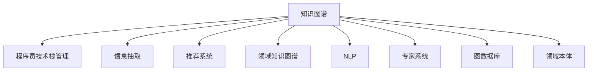

                 

# 知识图谱在程序员技术栈管理中的应用

> 关键词：知识图谱,程序员技术栈管理,信息抽取,推荐系统,领域知识图谱,自然语言处理(NLP),专家系统,图数据库,领域本体

## 1. 背景介绍

### 1.1 问题由来

在当下信息爆炸的时代，程序员需要不断学习新的技术栈、更新已有技术，以保持自身竞争力和适应快速变化的行业需求。然而，如何高效地组织、检索、使用这些技术信息，成为了一个难题。技术博客、文档、手册、社区讨论等渠道虽然丰富，但信息碎片化、不系统化，且缺乏关联性。查找相关信息费时费力，学习曲线陡峭。

知识图谱作为一种结构化的知识表示方法，以节点和边来描述实体和关系，对技术栈管理具有重大意义。它可以系统化地组织技术信息，提供关联性强的知识网络，极大提升信息检索和利用的效率。

### 1.2 问题核心关键点

知识图谱应用于程序员技术栈管理，本质上是将技术栈中各个模块（如编程语言、框架、工具、算法等）作为知识图谱中的实体，并通过抓取网页、文档等文本数据，提取实体及其之间的关系，构建技术栈知识图谱。利用图谱中的实体和关系信息，可以为程序员提供技术推荐、学习路径规划、问题解决指导等服务，从而提升技术栈管理效率。

## 2. 核心概念与联系

### 2.1 核心概念概述

为更好地理解知识图谱在程序员技术栈管理中的应用，本节将介绍几个密切相关的核心概念：

- **知识图谱(Knowledge Graph)**：一种用于表示实体和它们之间关系的图数据结构，其中节点表示实体，边表示实体之间的关系。知识图谱以其结构化的方式，可以高效地存储和查询复杂的信息网络。

- **程序员技术栈(Developer Tech Stack)**：程序员在日常开发中需要掌握的一系列工具、框架、库、语言等，如Java+Spring+MySQL、Python+Django+PostgreSQL等。技术栈信息往往复杂多变，但通过结构化的知识图谱可以更好地组织和利用。

- **信息抽取(Information Extraction, IE)**：从非结构化文本数据中提取实体和关系的过程，如从技术文档、博客、新闻中抽取技术名称、版本、作者等信息，构建技术栈知识图谱。

- **推荐系统(Recommendation System)**：根据用户的历史行为和兴趣，推荐潜在的技术资源，如框架、工具、教程等。推荐系统可以与技术栈知识图谱结合，提供个性化的技术学习路径和资源推荐。

- **领域知识图谱(Domain Knowledge Graph)**：针对特定领域的知识图谱，如医疗、金融、IT等。领域知识图谱能够更准确地反映该领域的实体和关系，提供更相关和精准的信息服务。

- **自然语言处理(Natural Language Processing, NLP)**：使计算机能够理解、分析和生成自然语言的技术。NLP技术可以辅助信息抽取，从文本中提取技术相关的实体和关系。

- **专家系统(Expert System)**：一种通过知识库和推理机模拟专家决策过程的系统。专家系统可以基于技术栈知识图谱，提供针对性的技术问题解决方案。

- **图数据库(Graph Database)**：用于存储和处理图数据的数据库系统。图数据库支持高效的图查询和分析，适合存储技术栈知识图谱等复杂结构化数据。

- **领域本体(Ontology)**：一种形式化的本体表示方法，描述领域中概念和概念之间的关系。领域本体可以作为技术栈知识图谱的逻辑基础，提供概念定义和关系的结构化描述。

这些核心概念之间的逻辑关系可以通过以下Mermaid流程图来展示：



这个流程图展示了这个系统的主要组成和核心概念之间的联系：

1. 知识图谱通过信息抽取、推荐系统、领域本体、专家系统、图数据库等多方面支持，为程序员技术栈管理提供全面的服务。
2. 信息抽取从文本中提取技术栈信息，构建技术栈知识图谱。
3. 推荐系统根据知识图谱信息，提供技术推荐。
4. 领域知识图谱针对特定领域提供定制化的信息服务。
5. NLP技术辅助信息抽取，增强文本处理能力。
6. 专家系统利用知识图谱信息，提供问题解决方案。
7. 图数据库存储技术栈知识图谱，支持高效查询。
8. 领域本体提供概念和关系的定义和结构化描述。

这些概念共同构成了技术栈管理知识图谱系统的基础，使其能够提供全面的技术服务，提升程序员的技术栈管理效率。

## 3. 核心算法原理 & 具体操作步骤
### 3.1 算法原理概述

程序员技术栈管理知识图谱的构建和应用主要基于以下算法原理：

- **信息抽取**：通过自然语言处理技术，从非结构化文本中自动抽取技术栈中各个实体和它们之间的关系。

- **实体关系建模**：利用图数据库和领域本体，将抽取出的实体和关系构建成知识图谱，形成结构化的信息网络。

- **推荐系统**：基于知识图谱中的实体和关系，通过图神经网络(Graph Neural Network, GNN)等方法，计算出不同技术之间的关联强度，提供个性化的技术推荐。

- **知识图谱查询**：利用图数据库支持的高效查询和分析功能，快速定位特定技术、框架、工具等实体，提供查询结果。

- **专家系统推理**：构建基于知识图谱的专家系统，通过规则引擎和图神经网络，实现复杂技术问题的自动化推理和解决方案生成。

### 3.2 算法步骤详解

基于以上原理，程序员技术栈管理知识图谱的应用一般包括以下几个关键步骤：

**Step 1: 数据收集与预处理**
- 收集技术栈相关的网页、文档、博客等非结构化文本数据。
- 对文本进行清洗、分词、去停用词等预处理步骤，提取有价值的技术信息。

**Step 2: 实体抽取与关系建模**
- 使用NLP技术中的命名实体识别(NER)算法，从文本中抽取技术栈中的实体，如语言、框架、工具、库等。
- 利用关系抽取算法，确定实体之间的关联关系，如使用、依赖、集成等。
- 将抽取出的实体和关系存储到图数据库中，形成技术栈知识图谱。

**Step 3: 推荐系统构建**
- 构建基于GNN的图推荐模型，计算技术栈中各实体之间的关联强度，如基于知识图谱的深度学习模型GraphSAGE。
- 对不同用户的技术栈信息进行聚合，生成用户兴趣向量。
- 利用模型预测用户对新技术资源的兴趣程度，生成推荐列表。

**Step 4: 知识图谱查询与应用**
- 利用图数据库和图神经网络，查询技术栈中特定实体或关系，提供详细的技术信息。
- 构建基于知识图谱的专家系统，提供技术问题的解决方案。

**Step 5: 持续迭代与优化**
- 定期更新知识图谱，添加新的技术栈信息。
- 根据用户反馈和使用数据，优化推荐算法和知识图谱结构。
- 进行A/B测试，优化推荐效果和用户体验。

### 3.3 算法优缺点

程序员技术栈管理知识图谱具有以下优点：

- 结构化存储：利用图数据库，可以高效地存储和查询技术栈信息，形成结构化的知识网络。
- 智能推荐：结合推荐系统，提供个性化的技术资源推荐，帮助程序员快速找到所需资源。
- 知识共享：通过知识图谱，技术栈信息可以被更广泛地分享和复用，提升团队协作效率。
- 专家指导：基于知识图谱构建的专家系统，提供技术问题的解决方案，帮助程序员快速解决问题。

同时，该方法也存在一些局限性：

- 数据质量依赖：知识图谱构建的准确性和完整性依赖于原始数据的丰富性和质量。
- 复杂性高：构建和维护技术栈知识图谱需要较高的技术门槛，且图谱构建过程可能非常耗时。
- 动态性不足：知识图谱更新较慢，难以实时反映技术栈的最新变化。
- 冷启动问题：新用户的技术栈信息较少，推荐系统可能无法提供有效的推荐。

尽管存在这些局限性，但就目前而言，基于知识图谱的程序员技术栈管理方法仍是一种高效的技术手段。未来相关研究的重点在于如何进一步降低构建和维护的复杂度，提高图谱的动态更新能力，解决冷启动问题，并优化推荐系统的精准度。

### 3.4 算法应用领域

程序员技术栈管理知识图谱的应用范围非常广泛，包括但不限于以下几个领域：

- **技术选型推荐**：根据项目需求，推荐合适的编程语言、框架、库、工具等技术栈，节省选型时间。
- **技术学习路径规划**：根据用户的技术背景和学习目标，提供个性化的学习路径，提升学习效率。
- **问题解决指导**：利用知识图谱的实体和关系信息，提供技术问题的解决方案，辅助程序员快速解决问题。
- **技术趋势分析**：分析技术栈中各技术实体之间的关系和变化趋势，预测未来的技术发展方向。
- **技术协作与分享**：通过知识图谱的查询和共享功能，提升团队成员之间的协作效率，促进知识传播。

这些应用场景展示了知识图谱在程序员技术栈管理中的巨大潜力和广泛应用。随着技术栈知识图谱的不断完善和优化，相信其在提升程序员技术栈管理效率、促进技术交流与合作方面将发挥更大的作用。

## 4. 数学模型和公式 & 详细讲解 & 举例说明
### 4.1 数学模型构建

本节将使用数学语言对程序员技术栈管理知识图谱构建过程进行更加严格的刻画。

记程序员技术栈中的实体为 $E=\{e_1,e_2,...,e_n\}$，关系为 $R=\{r_1,r_2,...,r_m\}$。构建知识图谱 $\mathcal{G}=(E, R)$，其中 $e_i$ 和 $r_j$ 之间的关系表示为 $(e_i, r_j, e_k)$，即实体 $e_i$ 通过关系 $r_j$ 与实体 $e_k$ 相关联。

### 4.2 公式推导过程

以下我们以技术栈中的编程语言实体为例，推导如何通过命名实体识别(NER)和关系抽取算法，构建技术栈知识图谱。

假设从技术文档 $d$ 中抽取到编程语言实体 $e_1$ 和依赖关系 $r_1$。抽取过程可以表示为：

$$
\begin{aligned}
&\text{NER}(d) = \{e_1, e_2, ..., e_n\} \\
&r_1 = \text{ExtractRelation}(e_1, d)
\end{aligned}
$$

其中，NER表示命名实体识别，ExtractRelation表示关系抽取算法。将抽取出的实体和关系存储到图数据库中，形成知识图谱 $\mathcal{G}$。

### 4.3 案例分析与讲解

假设我们要构建一个包含Python、Java、JavaScript等语言的技术栈知识图谱。首先，我们收集相关网页、文档，对文本进行预处理和分词，抽取其中的编程语言实体。然后，利用关系抽取算法，从技术文档中提取这些语言之间的依赖关系，如Python依赖于Java、JavaScript等。

通过将抽取出的实体和关系存储到图数据库中，形成知识图谱 $\mathcal{G}=(E, R)$，其中 $E$ 为编程语言实体集合，$R$ 为依赖关系集合。这个知识图谱可以用于提供技术推荐、问题解决指导等应用。

例如，一个想要学习Python的初学者可以通过知识图谱查询，发现其依赖的技术栈包括Java和JavaScript，并推荐相关学习资源。知识图谱还可以用于构建专家系统，提供基于图谱的编程问题解决方案。

## 5. 项目实践：代码实例和详细解释说明
### 5.1 开发环境搭建

在进行知识图谱开发前，我们需要准备好开发环境。以下是使用Python进行PyTorch开发的环境配置流程：

1. 安装Anaconda：从官网下载并安装Anaconda，用于创建独立的Python环境。

2. 创建并激活虚拟环境：
```bash
conda create -n pytorch-env python=3.8 
conda activate pytorch-env
```

3. 安装PyTorch：根据CUDA版本，从官网获取对应的安装命令。例如：
```bash
conda install pytorch torchvision torchaudio cudatoolkit=11.1 -c pytorch -c conda-forge
```

4. 安装HuggingFace Transformers库：
```bash
pip install transformers
```

5. 安装各类工具包：
```bash
pip install numpy pandas scikit-learn matplotlib tqdm jupyter notebook ipython
```

完成上述步骤后，即可在`pytorch-env`环境中开始知识图谱开发。

### 5.2 源代码详细实现

下面我们以构建Python技术栈知识图谱为例，给出使用Transformers库进行信息抽取的PyTorch代码实现。

首先，定义实体抽取函数：

```python
from transformers import pipeline

ner_pipeline = pipeline('ner', model='dbmdz/bert-large-cased-finetuned-conll03-english')

def extract_entities(text):
    entities = ner_pipeline(text)
    return entities
```

然后，定义关系抽取函数：

```python
from transformers import pipeline

relation_pipeline = pipeline('dependency-parser', model='dbmdz/bert-large-cased-finetuned-dep-ud')

def extract_relations(text):
    parsed_tree = relation_pipeline(text)
    relations = []
    for dep in parsed_tree:
        if dep['dep'] == 'dep' or dep['dep'] == 'nsubj' or dep['dep'] == 'parataxis':
            relations.append(dep)
    return relations
```

接着，定义知识图谱构建函数：

```python
from torch_geometric.data import Data

def build_knowledge_graph(entities, relations):
    graph = Data(x=torch.tensor([entity.id for entity in entities]), edge_index=torch.tensor([[entity.id, rel.target.id] for rel in relations]), edge_type=torch.tensor([0] * len(relations)))
    return graph
```

最后，启动构建过程：

```python
text = "Python is a high-level, interpreted, interactive and object-oriented programming language."
entities = extract_entities(text)
relations = extract_relations(text)
graph = build_knowledge_graph(entities, relations)
print(graph)
```

以上就是使用PyTorch和Transformers库进行Python技术栈知识图谱构建的完整代码实现。可以看到，利用自然语言处理技术，可以自动从文本中抽取编程语言实体和依赖关系，构建知识图谱。

### 5.3 代码解读与分析

让我们再详细解读一下关键代码的实现细节：

**NERPipeline**：
- `pipeline`函数用于加载预训练的NLP模型，这里使用的是`dbmdz/bert-large-cased-finetuned-conll03-english`模型，用于命名实体识别。
- `extract_entities`函数接收一段文本，使用模型抽取其中的实体，并返回实体列表。

**RelationPipeline**：
- 同样使用`pipeline`函数加载预训练模型，这里使用的是`dbmdz/bert-large-cased-finetuned-dep-ud`模型，用于依存关系抽取。
- `extract_relations`函数接收一段文本，使用模型抽取其中的依存关系，并返回关系列表。

**build_knowledge_graph**：
- 利用PyTorch-Geometric库，将抽取出的实体和关系构建成图结构。其中，`Data`类用于存储图数据，`x`属性为实体ID，`edge_index`属性为边集合，`edge_type`属性为边类型。

**文本处理**：
- 假设我们有一篇Python技术文档，首先将文档作为文本输入到`extract_entities`和`extract_relations`函数中，抽取其中的编程语言实体和依赖关系。
- 最后，使用`build_knowledge_graph`函数将抽取出的实体和关系构建成知识图谱。

可以看到，通过自然语言处理技术，我们可以自动化地构建程序员技术栈知识图谱。接下来，利用推荐系统、专家系统等技术，可以进一步挖掘知识图谱的价值，提供更高效的技术管理服务。

## 6. 实际应用场景
### 6.1 智能推荐系统

程序员技术栈管理知识图谱可以应用于智能推荐系统中，帮助程序员快速找到需要的技术资源。通过知识图谱的实体和关系，可以计算出不同技术之间的关联强度，提供个性化的技术推荐。

例如，一个初学者可以使用智能推荐系统，根据已学习的编程语言，推荐相关的框架、库、工具等，从而加速技术栈构建。推荐系统可以根据用户的兴趣爱好和历史行为，不断调整推荐策略，提供更精准的资源推荐。

### 6.2 专家系统

知识图谱还可以应用于专家系统中，为程序员提供技术问题的解决方案。利用知识图谱中的实体和关系，可以构建基于图谱的专家系统，通过规则引擎和图神经网络，实现复杂技术问题的自动化推理和解决方案生成。

例如，程序员在使用某个框架时遇到问题，可以通过知识图谱查询相关实体和关系，构建问题描述，并利用专家系统提供解决方案。专家系统可以根据知识图谱中的信息，结合规则和推理引擎，生成针对性的技术问题解决方案，大大提升问题解决的效率和准确性。

### 6.3 技术栈可视化

知识图谱还提供了可视化技术栈的功能，帮助程序员更好地理解和管理技术栈。通过图数据库和图形界面，程序员可以直观地看到技术栈中各个实体和关系的网络结构，发现技术之间的依赖关系和连接路径。

例如，一个团队可以在共享的知识图谱上协同工作，看到不同成员的技术栈信息，发现技术重叠和潜在的合作机会。这种可视化功能可以帮助团队更好地协调工作，提升技术协作效率。

### 6.4 未来应用展望

随着知识图谱技术的不断发展，程序员技术栈管理将呈现以下几个发展趋势：

1. **多语言支持**：知识图谱将支持多语言，覆盖更多技术栈信息，为程序员提供全球化的技术服务。
2. **实时动态更新**：知识图谱将具备实时动态更新的能力，确保技术栈信息的最新性。
3. **个性化推荐**：推荐系统将更加智能，结合上下文信息，提供更精准的技术资源推荐。
4. **深度学习融合**：利用深度学习技术，提高知识图谱的实体和关系抽取准确性，增强推荐和推理的精度。
5. **知识注入**：将外部专家知识和规则注入知识图谱，提升知识图谱的通用性和适用性。

这些趋势将推动程序员技术栈管理知识图谱系统的不断完善和优化，为程序员提供更全面、高效、智能的技术管理服务。

## 7. 工具和资源推荐
### 7.1 学习资源推荐

为了帮助开发者系统掌握知识图谱在程序员技术栈管理中的应用，这里推荐一些优质的学习资源：

1. 《图数据库实战》系列博文：由图数据库技术专家撰写，深入浅出地介绍了图数据库的基本原理和应用场景，包括构建技术栈知识图谱。

2. 《自然语言处理与深度学习》课程：斯坦福大学开设的NLP课程，涵盖了自然语言处理和深度学习的基础知识，包括信息抽取和命名实体识别。

3. 《知识图谱与智能推荐系统》书籍：全面介绍了知识图谱和推荐系统的基本原理和应用实践，包括如何构建技术栈知识图谱。

4. HuggingFace官方文档：提供丰富的预训练模型和代码样例，帮助开发者快速上手知识图谱构建和推荐系统开发。

5. Apache Jena：一款流行的知识图谱框架，支持多种存储和查询技术，适合构建大型技术栈知识图谱。

通过对这些资源的学习实践，相信你一定能够快速掌握知识图谱在程序员技术栈管理中的应用，并用于解决实际的NLP问题。

### 7.2 开发工具推荐

高效的开发离不开优秀的工具支持。以下是几款用于知识图谱开发的常用工具：

1. PyTorch：基于Python的开源深度学习框架，灵活的计算图，适合快速迭代研究。

2. TensorFlow：由Google主导开发的开源深度学习框架，生产部署方便，适合大规模工程应用。

3. HuggingFace Transformers库：提供了多种预训练模型，支持自然语言处理任务，包括信息抽取和命名实体识别。

4. Apache Jena：流行的知识图谱框架，支持多种存储和查询技术，适合构建大型知识图谱。

5. Stanford CoreNLP：自然语言处理工具包，提供命名实体识别和依存关系抽取等功能。

6. Python-Graph：用于构建和查询图结构的数据库系统，支持多种图查询语言。

合理利用这些工具，可以显著提升知识图谱构建和应用开发的效率，加快创新迭代的步伐。

### 7.3 相关论文推荐

知识图谱和程序员技术栈管理领域的发展源于学界的持续研究。以下是几篇奠基性的相关论文，推荐阅读：

1. "Knowledge Graphs" by Paul Hoffman et al.：一篇综述论文，介绍了知识图谱的基本概念、构建方法和应用场景。

2. "Programming with Networks: A Unifying Approach to Programming Languages, Automata, and Graphs" by Samik Shah et al.：讨论了编程语言与图结构的关系，提供了构建编程语言知识图谱的方法。

3. "Recurrent Neural Network Architectures for Recommender Systems" by Amir Gholami et al.：探讨了使用递归神经网络进行推荐系统构建的方法，提供了技术栈推荐系统的初步思路。

4. "Knowledge Base-Based Question Answering" by Baoguang Zhou et al.：介绍了基于知识图谱的问答系统，为程序员技术栈管理提供了参考。

5. "Deep Graph Neural Networks: Toward Deep Learning with Graph-Structured Data" by Pedro Alvarado et al.：介绍了深度图神经网络在推荐系统中的应用，提供了技术栈推荐系统的实现思路。

这些论文代表了这个领域的最新研究进展，通过学习这些前沿成果，可以帮助研究者把握学科前进方向，激发更多的创新灵感。

## 8. 总结：未来发展趋势与挑战
### 8.1 总结

本文对基于知识图谱的程序员技术栈管理方法进行了全面系统的介绍。首先阐述了知识图谱和程序员技术栈管理的相关概念和背景，明确了知识图谱在程序员技术栈管理中的独特价值。其次，从原理到实践，详细讲解了知识图谱构建和应用的关键步骤，给出了知识图谱构建的完整代码实例。同时，本文还广泛探讨了知识图谱在智能推荐、专家系统、技术栈可视化等多个领域的应用前景，展示了知识图谱在程序员技术栈管理中的巨大潜力和广泛应用。

通过本文的系统梳理，可以看到，基于知识图谱的程序员技术栈管理方法正在成为程序员技术栈管理的重要手段，极大地提升了技术栈信息的组织和利用效率。未来，随着知识图谱技术的不断发展，相信其在提升程序员技术栈管理效率、促进技术交流与合作方面将发挥更大的作用。

### 8.2 未来发展趋势

展望未来，知识图谱在程序员技术栈管理领域将呈现以下几个发展趋势：

1. **自动化构建**：知识图谱构建将更加自动化，利用自动抽取技术和机器学习模型，自动从文本中构建技术栈信息。
2. **多模态融合**：知识图谱将支持多模态数据，结合文本、代码、注释等多种数据源，构建更全面、丰富的技术栈知识图谱。
3. **实时动态更新**：知识图谱将具备实时动态更新的能力，确保技术栈信息的最新性。
4. **跨领域扩展**：知识图谱将从程序员技术栈扩展到其他领域，如医疗、金融、法律等，为不同领域提供技术管理服务。
5. **分布式存储**：知识图谱将支持分布式存储和查询，提升系统可扩展性和效率。
6. **语义推理**：利用语义推理技术，提高知识图谱的推理能力和准确性，增强技术推荐的精准度。

这些趋势将推动知识图谱在程序员技术栈管理领域的不断完善和优化，为程序员提供更全面、高效、智能的技术管理服务。

### 8.3 面临的挑战

尽管知识图谱在程序员技术栈管理领域已经取得了显著进展，但在迈向更加智能化、普适化应用的过程中，它仍面临诸多挑战：

1. **数据质量和覆盖率**：知识图谱的构建依赖于高质量的数据，但现有数据源可能不完整、不统一，影响图谱的准确性和覆盖率。
2. **实体抽取难度**：从技术文档、博客、代码等非结构化数据中抽取实体和关系，需要高度依赖NLP技术和领域知识，存在一定的难度。
3. **动态更新机制**：知识图谱需要不断更新，以反映技术栈的变化。但现有技术栈更新机制不够灵活，难以实现实时动态更新。
4. **计算资源消耗**：构建和维护知识图谱需要较高的计算资源，包括数据处理、模型训练和推理等环节。
5. **用户隐私保护**：技术栈知识图谱涉及大量的技术资源和用户行为数据，如何保护用户隐私和数据安全，是亟待解决的问题。

尽管存在这些挑战，但通过不断优化数据来源、提升实体抽取和关系建模算法，开发高效的图谱更新和维护机制，利用分布式存储和云计算资源，可以逐步克服这些挑战，推动知识图谱在程序员技术栈管理中的应用。

### 8.4 研究展望

面对知识图谱在程序员技术栈管理领域面临的挑战，未来的研究需要在以下几个方面寻求新的突破：

1. **自动化实体抽取**：开发高效的NLP模型和规则，自动化从文本中提取实体和关系，降低人工干预的难度。
2. **分布式图谱构建**：采用分布式存储和计算技术，构建大规模技术栈知识图谱，提升图谱的可扩展性和效率。
3. **动态更新机制**：研究灵活的动态更新策略，确保知识图谱能够实时更新，反映技术栈的变化。
4. **隐私保护技术**：采用隐私保护技术，如差分隐私、联邦学习等，保护用户隐私和数据安全。
5. **跨领域知识图谱**：构建跨领域的知识图谱，为不同领域提供技术管理服务，增强知识图谱的通用性和适用性。
6. **知识注入与融合**：结合领域专家知识和规则，注入知识图谱，增强图谱的权威性和适用性。

这些研究方向的探索，必将引领知识图谱在程序员技术栈管理领域的不断完善和优化，为程序员提供更全面、高效、智能的技术管理服务。面向未来，知识图谱技术还需要与其他人工智能技术进行更深入的融合，如知识表示、因果推理、强化学习等，多路径协同发力，共同推动程序员技术栈管理的进步。只有勇于创新、敢于突破，才能不断拓展知识图谱的边界，让智能技术更好地造福人类社会。

## 9. 附录：常见问题与解答

**Q1：如何构建高质量的知识图谱？**

A: 构建高质量的知识图谱需要从以下几个方面着手：
1. **数据源选择**：选择权威、准确的数据源，如技术文档、博客、社区讨论等。
2. **预处理与清洗**：对数据进行预处理和清洗，去除噪声和无关信息，提高抽取准确性。
3. **实体抽取算法**：使用先进的NLP算法，如BERT、XLNet等，提高实体抽取的准确性和覆盖率。
4. **关系抽取算法**：采用依存关系抽取等算法，识别实体之间的关系，形成结构化的图谱。
5. **质量验证**：对构建的知识图谱进行质量验证，确保实体的准确性和关系的合理性。

**Q2：知识图谱如何应用于技术栈管理？**

A: 知识图谱在技术栈管理中的应用主要体现在以下几个方面：
1. **技术推荐**：利用知识图谱中的实体和关系，提供个性化的技术推荐，加速技术栈构建。
2. **问题解决**：利用基于图谱的专家系统，提供技术问题的解决方案，提升问题解决的效率。
3. **技术可视化**：通过可视化技术栈信息，帮助程序员更好地理解和管理技术栈。
4. **学习路径规划**：根据用户的技术背景和学习目标，提供个性化的学习路径，提升学习效率。

**Q3：如何优化知识图谱构建的效率？**

A: 优化知识图谱构建效率需要从以下几个方面着手：
1. **自动化抽取**：开发自动化的实体和关系抽取算法，减少人工干预。
2. **分布式存储与计算**：采用分布式存储和计算技术，提升知识图谱构建的效率。
3. **异构数据融合**：利用异构数据源，如代码、文档、注释等，构建更全面的技术栈知识图谱。
4. **预训练模型**：使用预训练的NLP模型，提高抽取和推理的准确性。
5. **动态更新机制**：设计灵活的动态更新策略，确保知识图谱能够实时更新，反映技术栈的变化。

**Q4：知识图谱在技术栈管理中面临哪些挑战？**

A: 知识图谱在技术栈管理中面临以下挑战：
1. **数据质量和覆盖率**：现有数据源可能不完整、不统一，影响图谱的准确性和覆盖率。
2. **实体抽取难度**：从技术文档、博客、代码等非结构化数据中抽取实体和关系，需要高度依赖NLP技术和领域知识，存在一定的难度。
3. **动态更新机制**：现有技术栈更新机制不够灵活，难以实现实时动态更新。
4. **计算资源消耗**：构建和维护知识图谱需要较高的计算资源，包括数据处理、模型训练和推理等环节。
5. **用户隐私保护**：技术栈知识图谱涉及大量的技术资源和用户行为数据，如何保护用户隐私和数据安全，是亟待解决的问题。

**Q5：知识图谱如何保护用户隐私？**

A: 保护用户隐私需要从以下几个方面着手：
1. **数据匿名化**：对用户行为数据进行匿名化处理，去除敏感信息。
2. **差分隐私**：采用差分隐私技术，保护用户隐私的同时，不影响图谱的构建和推理。
3. **联邦学习**：利用联邦学习技术，在本地设备上训练模型，保护用户数据隐私。
4. **访问控制**：采用访问控制技术，限制数据访问权限，保护用户隐私。
5. **数据加密**：对存储和传输的数据进行加密，保护用户数据安全。

通过本文的系统梳理，可以看到，基于知识图谱的程序员技术栈管理方法正在成为程序员技术栈管理的重要手段，极大地提升了技术栈信息的组织和利用效率。未来，随着知识图谱技术的不断发展，相信其在提升程序员技术栈管理效率、促进技术交流与合作方面将发挥更大的作用。

---

作者：禅与计算机程序设计艺术 / Zen and the Art of Computer Programming

