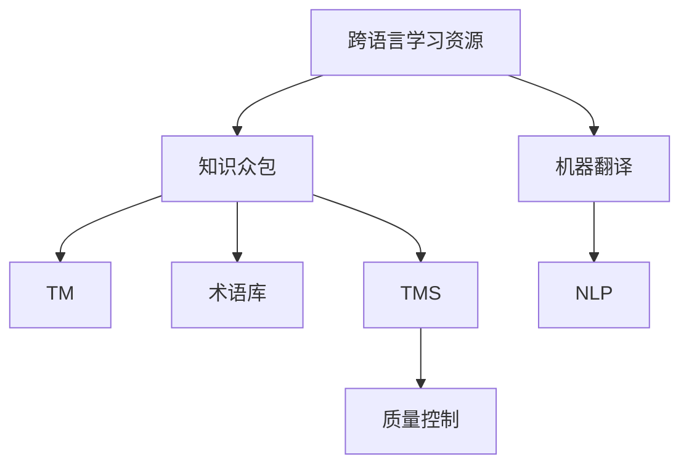

                 

# 知识的众包翻译：跨语言学习资源的创建

> 关键词：知识众包, 跨语言学习, 翻译工具, 语言资源创建, 自然语言处理(NLP)

## 1. 背景介绍

### 1.1 问题由来

在全球化背景下，不同语言间的交流与合作变得日益频繁，跨语言知识共享和翻译的重要性日益凸显。然而，语言之间的差异和隔阂常常成为知识和信息共享的障碍，使得跨语言学习资源的创建和利用成为一大挑战。如何高效、准确地将知识从一种语言翻译成另一种语言，是信息时代跨语言交流的关键问题。

### 1.2 问题核心关键点

跨语言学习资源的创建涉及以下几个核心问题：

1. **大规模语料库的获取和处理**：大规模跨语言语料库的建设是跨语言学习资源创建的基础。如何收集、处理、清洗和标注这些语料，以供翻译模型训练和评估，是一个复杂且耗时的过程。

2. **翻译模型的设计**：选择合适的翻译模型架构和优化方法，是确保翻译质量的关键。当前主流的方法包括基于统计的机器翻译(SMT)和基于神经网络的机器翻译(NMT)。

3. **知识众包平台的设计**：利用众包平台进行跨语言翻译，需要设计合理的任务分配机制、激励机制和质量控制机制，以确保翻译的准确性和一致性。

4. **翻译结果的验证和反馈**：翻译结果的验证和反馈机制对于提高翻译质量至关重要。这包括人工校正、用户评价、自动评估等。

5. **多语言信息融合**：翻译不仅仅是词句的转换，还涉及到语境、文化背景等多维度信息的处理。如何融合多语言信息，提升翻译的全面性和自然度，是跨语言学习资源创建的重要考量。

## 2. 核心概念与联系

### 2.1 核心概念概述

为更好地理解跨语言学习资源创建的原理和实践，本节将介绍几个密切相关的核心概念：

- **跨语言学习资源**：指的是以某种语言为载体的知识资源，其内容或注释能够被自动翻译成其他语言。常见的跨语言学习资源包括文档、书籍、视频、数据集等。

- **机器翻译(Machine Translation, MT)**：指将一种语言的文本自动翻译成另一种语言的文本。机器翻译技术包括统计机器翻译和神经机器翻译两种主要方法。

- **知识众包**：指利用众包平台汇聚分散的个体智慧，共同完成某项任务。在跨语言学习资源创建中，众包平台可以用于收集、翻译和验证跨语言数据。

- **自然语言处理(Natural Language Processing, NLP)**：涉及计算机处理自然语言的技术，包括分词、词性标注、句法分析、语义分析等。NLP是跨语言学习资源创建的基础。

- **翻译记忆库(Translation Memory, TM)**：指在翻译过程中保存已翻译文本和对应源文本的数据库。翻译记忆库通过重复利用已翻译的文本，减少翻译工作量，提高翻译一致性和质量。

- **术语库(Term Database)**：指专业术语和行业术语的集合，是跨语言学习资源创建的重要组成部分，尤其在科技、医学等领域更为重要。

- **翻译管理系统(Translation Management System, TMS)**：指集成翻译记忆库、术语库、项目管理、质量控制等功能于一体的翻译管理软件。

这些核心概念之间的逻辑关系可以通过以下Mermaid流程图来展示：



这个流程图展示了大规模跨语言学习资源创建的流程和核心组件：

1. 跨语言学习资源通过机器翻译和自然语言处理技术实现跨语言转换。
2. 知识众包平台汇集个体智慧，为翻译提供人力支持。
3. 翻译记忆库和术语库提升翻译的一致性和准确性。
4. 翻译管理系统进行项目管理和质量控制。

这些组件协同工作，共同推动跨语言学习资源的创建和利用。

## 3. 核心算法原理 & 具体操作步骤

### 3.1 算法原理概述

跨语言学习资源的创建过程可以分为以下四个主要步骤：

1. **语料收集**：从各种来源收集大量的源语言和目标语言文本数据，包括新闻、网页、书籍、文档等。

2. **语料预处理**：对收集到的语料进行清洗、分词、词性标注、句法分析等处理，确保数据的质量和一致性。

3. **翻译模型训练**：使用收集和预处理后的语料，训练机器翻译模型。目前流行的模型架构包括基于统计的机器翻译模型和基于神经网络的机器翻译模型。

4. **翻译资源整合与共享**：将翻译结果整合到术语库和翻译记忆库中，并通过众包平台共享和利用这些资源。

### 3.2 算法步骤详解

#### 3.2.1 语料收集

1. **数据源选择**：选择多样化的数据源，如官方出版物、专业网站、学术期刊、社交媒体等，以确保语料的多样性和代表性。

2. **数据采集**：使用爬虫、API接口等方式自动或半自动地采集数据。数据采集过程中需注意版权问题，避免侵犯版权。

3. **数据清洗**：去除无关信息、格式不一致、重复内容等，确保语料质量。

#### 3.2.2 语料预处理

1. **文本分词**：将文本分割成有意义的词语或词组，不同语言的分词方法可能有所不同。

2. **词性标注**：确定每个词在句子中的词性，帮助理解文本结构和语义。

3. **句法分析**：分析句子的语法结构，识别主谓宾等成分，便于后续处理。

4. **语义分析**：理解句子或文本的语义，包括情感分析、命名实体识别等。

#### 3.2.3 翻译模型训练

1. **模型选择**：根据任务特点选择合适的模型架构，如基于循环神经网络的模型或基于自注意力机制的模型。

2. **训练集准备**：将预处理后的语料分为训练集、验证集和测试集，用于模型训练和评估。

3. **模型训练**：使用训练集对模型进行迭代训练，优化模型参数，使其能够准确地将源语言翻译为目标语言。

4. **模型评估**：使用验证集和测试集对模型进行评估，根据评估结果调整模型参数，确保翻译质量。

#### 3.2.4 翻译资源整合与共享

1. **翻译结果整合**：将翻译结果存入翻译记忆库和术语库中，方便后续使用。

2. **共享机制设计**：设计合理的共享机制，如开放API接口、共享协议等，确保资源的有效利用和保护。

3. **资源更新与维护**：定期更新和维护翻译资源库，确保资源的实时性和准确性。

### 3.3 算法优缺点

跨语言学习资源的创建通过机器翻译和知识众包技术，具有以下优点：

1. **高效性**：大规模语料的自动处理和翻译，可以极大地节省人力和时间成本。

2. **一致性**：通过翻译记忆库和术语库，确保翻译结果的一致性和准确性。

3. **多样性**：语料来源的多样性，有助于获取不同领域的知识，满足不同用户的需求。

4. **灵活性**：通过众包平台，可以灵活调用众包者的人力资源，适应不同规模和类型的翻译任务。

但同时，该方法也存在一些局限性：

1. **翻译质量依赖数据质量**：如果语料质量差或标注不精确，翻译模型训练效果可能不理想。

2. **文化差异处理困难**：不同语言和文化背景的差异，可能导致翻译结果的歧义或误解。

3. **隐私和版权问题**：大规模数据的收集和使用可能涉及隐私和版权问题，需特别注意。

4. **技术门槛高**：翻译模型和资源库的创建需要较高的技术水平和资金投入。

5. **翻译结果一致性问题**：不同翻译者对同一文本的翻译可能存在差异，需通过质量控制机制进行统一。

### 3.4 算法应用领域

跨语言学习资源的创建已经广泛应用于多个领域，具体包括：

1. **教育与培训**：将各类教育材料翻译成多种语言，支持全球化教育。

2. **商务与国际贸易**：翻译合同、商务文件、广告等，促进国际贸易和商务合作。

3. **医疗与健康**：将医学文献、健康指南等翻译成多种语言，促进全球医疗健康知识共享。

4. **法律与政策**：翻译法律文件、政策文件，支持全球法律与政策交流。

5. **旅游与文化**：翻译旅游指南、文化资料，促进全球旅游和文化交流。

6. **科研与学术**：翻译学术论文、研究报告，促进全球科研交流与合作。

此外，跨语言学习资源在应对自然灾害、危机应对、国际合作等领域也具有重要应用价值。

## 4. 数学模型和公式 & 详细讲解 & 举例说明

### 4.1 数学模型构建

跨语言学习资源创建的数学模型主要涉及以下几个方面：

1. **语言模型**：描述一个语言的概率分布，即给定语言中各个词或短语的出现概率。

2. **翻译模型**：将源语言文本映射到目标语言文本的概率模型，通常使用神经网络实现。

3. **质量评估模型**：用于评估翻译质量的多指标模型，如BLEU、ROUGE、METEOR等。

4. **众包任务分配模型**：优化任务分配机制，确保翻译任务合理分配给合适的翻译者。

### 4.2 公式推导过程

#### 4.2.1 语言模型

语言模型的核心是计算给定语言中一个序列的概率，即：

$$ P(w_1, w_2, ..., w_n) = \frac{P(w_1)P(w_2|w_1)P(w_3|w_1w_2)...P(w_n|w_1w_2...w_{n-1}) }$$

其中 $w_i$ 表示语言中的第 $i$ 个词或短语。

在神经网络中，语言模型可以通过隐马尔可夫模型(HMM)或循环神经网络(RNN)来实现。

#### 4.2.2 翻译模型

常见的翻译模型包括基于统计的机器翻译模型和基于神经网络的机器翻译模型。以下是基于神经网络的机器翻译模型的推导过程：

1. **编码器**：将源语言文本编码成向量表示，公式如下：

$$ e = f(E(x)) $$

其中 $E$ 为编码器，$f$ 为非线性变换。

2. **解码器**：将编码器的输出解码为目标语言文本，公式如下：

$$ y = f(D(e)) $$

其中 $D$ 为解码器，$f$ 为非线性变换。

3. **损失函数**：用于评估翻译质量，常见损失函数包括交叉熵损失、均方误差损失等。

$$ \mathcal{L} = \sum_{i=1}^n \ell(y_i, \hat{y}_i) $$

其中 $y_i$ 为真实翻译结果，$\hat{y}_i$ 为模型预测结果，$\ell$ 为损失函数。

#### 4.2.3 质量评估模型

BLEU（Bilingual Evaluation Understudy）是常用的机器翻译质量评估指标，其计算公式如下：

$$ BLEU = \max_{s \in \mathcal{S}} \prod_{i=1}^m ( \frac{|s_i \cap r_i|}{|r_i|} )^w $$

其中 $s$ 为参考翻译，$r$ 为机器翻译结果，$m$ 为翻译长度，$w$ 为权值。

#### 4.2.4 众包任务分配模型

众包任务分配模型的目标是在满足特定约束条件的前提下，最小化任务分配成本。一种常见的优化模型是线性规划模型：

$$ \min \sum_{i=1}^n p_i x_i $$
$$ s.t. \sum_{i=1}^n a_i x_i \geq b $$
$$ 0 \leq x_i \leq 1, \forall i $$

其中 $p_i$ 为任务价格，$a_i$ 为任务约束条件，$b$ 为约束条件上界，$x_i$ 为任务分配变量。

### 4.3 案例分析与讲解

以谷歌翻译为例，谷歌翻译是一个典型的跨语言学习资源创建项目。其核心流程包括：

1. **数据收集**：从全球网站、新闻、书籍等收集大量语料。

2. **预处理**：对语料进行分词、词性标注、句法分析等处理，构建语料库。

3. **模型训练**：使用神经网络模型进行机器翻译，模型架构包括多层编码器和解码器，采用自注意力机制进行特征提取。

4. **翻译质量评估**：使用BLEU等指标评估翻译质量，不断优化模型。

5. **众包平台**：利用Google Workspace进行众包翻译任务，确保翻译质量和一致性。

6. **翻译记忆库**：构建翻译记忆库，重复利用已翻译的文本。

谷歌翻译的成功经验在于：

- 大规模语料的收集和处理。
- 高效的机器翻译模型架构。
- 科学的翻译质量评估指标。
- 强大的众包平台和质量控制机制。

## 5. 项目实践：代码实例和详细解释说明

### 5.1 开发环境搭建

在进行跨语言学习资源创建实践前，我们需要准备好开发环境。以下是使用Python进行TensorFlow开发的环境配置流程：

1. 安装Anaconda：从官网下载并安装Anaconda，用于创建独立的Python环境。

2. 创建并激活虚拟环境：
```bash
conda create -n tf-env python=3.8 
conda activate tf-env
```

3. 安装TensorFlow：根据CUDA版本，从官网获取对应的安装命令。例如：
```bash
conda install tensorflow -c tf -c conda-forge
```

4. 安装各类工具包：
```bash
pip install numpy pandas scikit-learn matplotlib tqdm jupyter notebook ipython
```

完成上述步骤后，即可在`tf-env`环境中开始跨语言学习资源创建的实践。

### 5.2 源代码详细实现

下面我们以中英文翻译为例，给出使用TensorFlow对BERT模型进行翻译的PyTorch代码实现。

首先，定义模型：

```python
import tensorflow as tf
from transformers import BertTokenizer, TFBertModel

tokenizer = BertTokenizer.from_pretrained('bert-base-cased')
model = TFBertModel.from_pretrained('bert-base-cased')
```

然后，定义翻译函数：

```python
def translate(text, source_lang, target_lang):
    encoding = tokenizer(text, return_tensors='tf', max_length=128, padding='max_length', truncation=True)
    input_ids = encoding['input_ids']
    attention_mask = encoding['attention_mask']
    outputs = model(input_ids, attention_mask=attention_mask)
    logits = outputs.logits
    predicted_ids = tf.argmax(logits, axis=-1)
    predicted_tokens = tokenizer.batch_decode(predicted_ids, skip_special_tokens=True)[0]
    return predicted_tokens
```

接着，在主函数中调用翻译函数：

```python
source_text = 'Hello, world!'
target_text = 'translate-to:zh'

predicted_text = translate(source_text, 'en', target_text)
print(f'Source text: {source_text}')
print(f'Target text: {target_text}')
print(f'Predicted translation: {predicted_text}')
```

以上就是使用TensorFlow对BERT模型进行翻译的完整代码实现。可以看到，利用TensorFlow和Transformers库，可以方便地进行大模型的跨语言翻译。

### 5.3 代码解读与分析

让我们再详细解读一下关键代码的实现细节：

**BERT模型定义**：
- 首先，从预训练模型库中加载BERT模型，并初始化分词器。
- 通过`TFBertModel`类创建BERT模型实例。

**翻译函数实现**：
- `tokenizer`函数将输入文本分词，并将其转换为模型所需的输入。
- `input_ids`和`attention_mask`作为模型的输入，计算出`logits`。
- 通过`tf.argmax`计算输出概率最大的ID，并使用分词器将其转换为文本。

**主函数调用**：
- 调用`translate`函数，将源语言文本和目标语言标识传递给模型。
- 打印源文本、目标语言标识和预测结果。

可以看到，TensorFlow和Transformers库使得跨语言翻译的代码实现变得简洁高效。开发者可以将更多精力放在数据处理、模型改进等高层逻辑上，而不必过多关注底层的实现细节。

当然，工业级的系统实现还需考虑更多因素，如模型的保存和部署、超参数的自动搜索、更灵活的任务适配层等。但核心的跨语言翻译范式基本与此类似。

## 6. 实际应用场景

### 6.1 多语言翻译

跨语言学习资源创建的最常见应用场景是翻译服务，通过机器翻译技术将源语言文本翻译成目标语言文本。例如，谷歌翻译、百度翻译、微软翻译等都是基于大规模语料库的机器翻译服务。

在实际应用中，这些翻译服务可以提供实时翻译、文本翻译、语音翻译等多种服务形式，广泛应用于国际交流、商务合作、旅游等领域。例如，多语言网站、多语言新闻、多语言客服等，都是翻译服务的具体应用。

### 6.2 文档翻译

文档翻译是跨语言学习资源创建的另一个重要应用场景。不同语言的文档资料需要频繁进行翻译和更新，以确保全球用户能够获取最新的信息。

例如，科技公司的技术文档、医疗机构的医疗指南、教育机构的教材等，都可以通过机器翻译和人工翻译相结合的方式进行跨语言翻译。通过构建翻译记忆库和术语库，可以提升翻译的一致性和准确性。

### 6.3 法律与政策翻译

法律与政策的翻译是跨语言学习资源创建的重要应用领域之一。不同国家之间的法律与政策需要频繁进行翻译和交流，以便更好地进行国际合作和协调。

例如，联合国文件、国际公约、各国法律等，都需要通过跨语言翻译进行共享和传播。通过机器翻译和人工翻译相结合的方式，可以提高翻译的效率和准确性。

### 6.4 多语言信息融合

除了文本翻译，跨语言学习资源的创建还涉及到多语言信息的融合。例如，多语言数据库、多语言知识图谱、多语言信息检索等，都是通过跨语言学习资源创建来实现的。

例如，谷歌的知识图谱和百科全书，提供了多种语言版本的知识信息，方便全球用户获取和学习。这些信息可以通过多语言翻译进行统一和融合，提升信息检索的全面性和准确性。

### 6.5 文化交流与教育

跨语言学习资源的创建还涉及到文化交流和教育。不同语言和文化的交流，需要借助跨语言翻译和知识共享来实现。

例如，多语言的文化交流活动、多语言的教育资源、多语言的学习平台等，都是通过跨语言学习资源创建来实现的。通过机器翻译和人工翻译相结合的方式，可以提升文化交流和教育的效率和质量。

## 7. 工具和资源推荐

### 7.1 学习资源推荐

为了帮助开发者系统掌握跨语言学习资源创建的理论基础和实践技巧，这里推荐一些优质的学习资源：

1. 《机器翻译理论与实践》：全面介绍了机器翻译的理论和实践，涵盖了统计机器翻译和神经机器翻译两种主要方法。

2. 《自然语言处理综论》：介绍了自然语言处理的各个方面，包括语言模型、翻译模型、质量评估模型等。

3. 《深度学习与自然语言处理》：介绍了深度学习在自然语言处理中的应用，包括语料处理、模型训练、评估指标等。

4. 《翻译记忆库与术语库构建与管理》：介绍了翻译记忆库和术语库的构建和管理方法，如何提升翻译的一致性和准确性。

5. 《跨语言知识共享与跨文化交流》：介绍了跨语言知识共享和跨文化交流的理论和实践，如何通过机器翻译实现文化交流和教育。

通过对这些资源的学习实践，相信你一定能够快速掌握跨语言学习资源创建的精髓，并用于解决实际的NLP问题。

### 7.2 开发工具推荐

高效的开发离不开优秀的工具支持。以下是几款用于跨语言学习资源创建的常用工具：

1. TensorFlow：基于Python的开源深度学习框架，灵活动态的计算图，适合快速迭代研究。

2. PyTorch：基于Python的开源深度学习框架，提供了高效的自动微分和优化功能，适合模型训练和推理。

3. HuggingFace Transformers库：提供了多种预训练语言模型，方便进行跨语言翻译和语料处理。

4. Crowdin：一个流行的众包翻译平台，方便进行任务分配和质量控制。

5. MemoQ：一个专业的翻译记忆库和术语库软件，支持多种语言和多种文件格式。

6. SDL Trados：一个强大的翻译管理系统，支持项目管理、质量控制和团队协作。

合理利用这些工具，可以显著提升跨语言学习资源创建的开发效率，加快创新迭代的步伐。

### 7.3 相关论文推荐

跨语言学习资源的创建和机器翻译的发展，依赖于学界的持续研究。以下是几篇奠基性的相关论文，推荐阅读：

1. "Sequence to Sequence Learning with Neural Networks"（神经网络序列到序列学习）：提出了基于神经网络的机器翻译模型架构，推动了神经机器翻译的发展。

2. "Google's Neural Machine Translation System: Bridging the Gap Between Human and Machine Translation"（谷歌的神经机器翻译系统）：介绍了谷歌翻译的神经机器翻译系统，展示了其在翻译质量上的提升。

3. "Towards Unsupervised Neural Machine Translation"（走向无监督神经机器翻译）：探讨了无监督学习在机器翻译中的应用，提出了一些新的训练方法。

4. "Neural Machine Translation by Jointly Learning to Align and Translate"（神经机器翻译的对齐与翻译联合学习）：提出了基于注意力机制的神经机器翻译模型，提高了翻译的质量和效率。

5. "Massively Multilingual Unsupervised Translation with Transformers"（多语言无监督翻译与Transformer）：介绍了Transformer在多语言无监督翻译中的应用，展示了其在处理多语言数据时的优势。

这些论文代表了大规模跨语言学习资源创建的最新研究动态，通过学习这些前沿成果，可以帮助研究者把握学科前进方向，激发更多的创新灵感。

## 8. 总结：未来发展趋势与挑战

### 8.1 总结

本文对跨语言学习资源的创建方法进行了全面系统的介绍。首先阐述了跨语言学习资源的创建背景和意义，明确了机器翻译在知识共享中的重要价值。其次，从原理到实践，详细讲解了跨语言学习资源创建的数学模型和关键步骤，给出了跨语言翻译的代码实例。同时，本文还广泛探讨了跨语言学习资源创建在多个领域的应用前景，展示了其广阔的应用空间。

通过本文的系统梳理，可以看到，跨语言学习资源的创建通过机器翻译和知识众包技术，已经取得显著成果，在多个领域得到了广泛应用。未来，伴随预训练语言模型和机器翻译方法的持续演进，跨语言学习资源的创建将更加高效、准确和灵活，进一步推动全球知识共享和信息交流。

### 8.2 未来发展趋势

展望未来，跨语言学习资源的创建将呈现以下几个发展趋势：

1. **多语言预训练模型的普及**：随着多语言预训练模型的出现，大规模语料库的获取将更加容易，翻译质量和效率将进一步提升。

2. **跨语言学习资源的全球化**：跨语言学习资源的创建将更加注重全球化，提升翻译的一致性和准确性，满足不同用户的需求。

3. **深度学习与人工结合**：在翻译任务中，深度学习与人工结合的模式将更加普遍，机器翻译和人工校对相结合，提升翻译质量。

4. **无监督和半监督翻译**：无监督和半监督翻译方法将更加成熟，利用大规模无标注数据和少标注数据进行翻译，降低对大规模标注数据的需求。

5. **多模态翻译**：多模态翻译将更加普及，文本、图像、语音等信息的综合处理，提升翻译的自然度和全面性。

6. **实时翻译和交互翻译**：实时翻译和交互翻译技术将更加成熟，支持语音翻译、实时交流等功能，提升用户体验。

7. **隐私和伦理保护**：隐私和伦理保护将成为跨语言学习资源创建的重要考量，确保数据和模型使用的合法性。

以上趋势凸显了跨语言学习资源创建的广阔前景，这些方向的探索发展，必将进一步提升跨语言学习资源的创建和利用，为全球知识共享和信息交流带来新的突破。

### 8.3 面临的挑战

尽管跨语言学习资源的创建已经取得了显著成果，但在迈向更加智能化、普适化应用的过程中，它仍面临着诸多挑战：

1. **语料质量和标注问题**：语料质量和标注数据的准确性直接影响翻译质量，高质量语料和标注数据的获取成本较高。

2. **跨语言语义理解**：不同语言和文化背景的差异，可能导致翻译结果的歧义或误解，跨语言语义理解仍是一个难题。

3. **计算资源需求高**：大规模跨语言学习资源的创建需要大量的计算资源，包括高性能计算设备和存储设备。

4. **翻译结果的一致性**：不同翻译者对同一文本的翻译可能存在差异，需通过质量控制机制进行统一。

5. **隐私和版权问题**：大规模数据的收集和使用可能涉及隐私和版权问题，需特别注意。

6. **伦理和安全性**：翻译模型的偏见、有害信息等，可能通过翻译传递到下游任务，产生误导性、歧视性的输出。

7. **计算资源和能源消耗**：大规模机器翻译模型的训练和推理，对计算资源和能源消耗较大。

正视跨语言学习资源创建面临的这些挑战，积极应对并寻求突破，将是其持续发展的关键。相信随着学界和产业界的共同努力，这些挑战终将一一被克服，跨语言学习资源创建必将在构建全球知识共享的智能系统中扮演越来越重要的角色。

### 8.4 研究展望

面对跨语言学习资源创建所面临的挑战，未来的研究需要在以下几个方面寻求新的突破：

1. **多语言预训练模型的优化**：进一步优化多语言预训练模型，提升模型在多种语言之间的跨领域迁移能力。

2. **无监督和半监督翻译方法**：探索无监督和半监督翻译方法，利用大规模无标注数据和少标注数据进行翻译，降低对大规模标注数据的需求。

3. **跨语言语义理解技术**：研究跨语言语义理解技术，提升翻译结果的自然度和全面性。

4. **多模态翻译技术**：研究多模态翻译技术，综合处理文本、图像、语音等信息的跨语言翻译。

5. **实时翻译和交互翻译**：研究实时翻译和交互翻译技术，支持语音翻译、实时交流等功能，提升用户体验。

6. **隐私和伦理保护机制**：研究隐私和伦理保护机制，确保数据和模型使用的合法性，避免数据泄露和模型偏见。

7. **计算资源和能源优化**：研究计算资源和能源优化方法，提升跨语言学习资源的创建和使用的效率和可持续性。

这些研究方向的探索，必将引领跨语言学习资源创建的未来发展，为全球知识共享和信息交流提供新的解决方案。

## 9. 附录：常见问题与解答

**Q1：大规模语料的收集和处理需要注意哪些问题？**

A: 大规模语料的收集和处理需要注意以下几个问题：

1. **版权问题**：确保所收集的数据在版权范围内，避免侵犯版权。

2. **数据质量**：收集到的数据需要进行清洗、分词、词性标注、句法分析等处理，确保数据的质量和一致性。

3. **数据多样性**：收集的数据应覆盖不同的语言、领域和语境，确保语料的多样性和代表性。

4. **数据标注**：对收集到的数据进行标注，确保标注的准确性和一致性。标注成本较高，需特别注意。

5. **数据存储和传输**：大规模语料的数据存储和传输需要考虑存储容量和传输速度，确保数据的可靠性和完整性。

**Q2：如何选择适合的机器翻译模型？**

A: 选择适合的机器翻译模型需要考虑以下几个因素：

1. **任务类型**：根据翻译任务的性质选择适合的模型架构，如基于统计的机器翻译模型或基于神经网络的机器翻译模型。

2. **数据规模**：大规模语料适合使用基于神经网络的机器翻译模型，小规模语料适合使用基于统计的机器翻译模型。

3. **语言对**：考虑源语言和目标语言之间的语言相似性，选择适合的模型架构和优化方法。

4. **计算资源**：根据计算资源的情况选择合适的模型架构，如单GPU或分布式训练。

5. **翻译质量要求**：根据翻译质量的要求选择合适的模型架构和优化方法，如多模型融合、自监督学习等。

6. **实时性要求**：根据实时性要求选择合适的模型架构和优化方法，如剪枝、量化等。

**Q3：如何提高跨语言学习资源的翻译质量？**

A: 提高跨语言学习资源的翻译质量可以从以下几个方面入手：

1. **数据质量**：确保语料的高质量和标注的准确性，是提升翻译质量的基础。

2. **模型选择**：选择合适的模型架构和优化方法，如基于神经网络的机器翻译模型、自监督学习、多模型融合等。

3. **众包平台**：利用众包平台进行跨语言翻译，引入更多人力进行翻译和校对，确保翻译质量。

4. **翻译记忆库**：构建翻译记忆库，重复利用已翻译的文本，提升翻译的一致性和准确性。

5. **术语库**：构建术语库，确保翻译中专业术语的准确性。

6. **质量评估**：使用BLEU、ROUGE、METEOR等质量评估指标，评估翻译质量，不断优化模型。

7. **人工校正**：对翻译结果进行人工校正，确保翻译的准确性。

8. **持续学习**：定期更新和维护翻译资源库，确保翻译的实时性和准确性。

**Q4：跨语言学习资源的创建有哪些应用场景？**

A: 跨语言学习资源的创建已经广泛应用于多个领域，具体包括：

1. **教育与培训**：将各类教育材料翻译成多种语言，支持全球化教育。

2. **商务与国际贸易**：翻译合同、商务文件、广告等，促进国际贸易和商务合作。

3. **医疗与健康**：将医学文献、健康指南等翻译成多种语言，促进全球医疗健康知识共享。

4. **法律与政策**：翻译法律文件、政策文件，支持全球法律与政策交流。

5. **旅游与文化**：翻译旅游指南、文化资料，促进全球旅游和文化交流。

6. **科研与学术**：翻译学术论文、研究报告，促进全球科研交流与合作。

7. **多语言信息融合**：如多语言数据库、多语言知识图谱、多语言信息检索等，通过跨语言学习资源创建来实现。

8. **文化交流与教育**：多语言的文化交流活动、多语言的教育资源、多语言的学习平台等，都是跨语言学习资源创建的具体应用。

**Q5：跨语言学习资源的创建如何降低对标注数据的需求？**

A: 降低对标注数据的需求可以通过以下方法实现：

1. **无监督和半监督翻译**：利用大规模无标注数据和少标注数据进行翻译，如自监督学习、主动学习等。

2. **众包平台**：利用众包平台进行跨语言翻译，引入更多人力进行翻译和校对，减少标注成本。

3. **多源数据融合**：利用多种来源的数据进行翻译，如文本、图像、语音等，提升翻译的全面性和准确性。

4. **翻译记忆库**：构建翻译记忆库，重复利用已翻译的文本，降低对标注数据的依赖。

5. **自动评估**：使用自动评估指标，如BLEU、ROUGE、METEOR等，对翻译结果进行评估，减少人工标注的需求。

6. **领域自适应**：针对特定领域进行微调，减少对标注数据的依赖。

**Q6：跨语言学习资源的创建有哪些实际应用场景？**

A: 跨语言学习资源的创建已经广泛应用于多个领域，具体包括：

1. **教育与培训**：将各类教育材料翻译成多种语言，支持全球化教育。

2. **商务与国际贸易**：翻译合同、商务文件、广告等，促进国际贸易和商务合作。

3. **医疗与健康**：将医学文献、健康指南等翻译成多种语言，促进全球医疗健康知识共享。

4. **法律与政策**：翻译法律文件、政策文件，支持全球法律与政策交流。

5. **旅游与文化**：翻译旅游指南、文化资料，促进全球旅游和文化交流。

6. **科研与学术**：翻译学术论文、研究报告，促进全球科研交流与合作。

7. **多语言信息融合**：如多语言数据库、多语言知识图谱、多语言信息检索等，通过跨语言学习资源创建来实现。

8. **文化交流与教育**：多语言的文化交流活动、多语言的教育资源、多语言的学习平台等，都是跨语言学习资源创建的具体应用。

通过这些实际应用场景，可以看到跨语言学习资源创建的广泛应用和重要价值。

---

作者：禅与计算机程序设计艺术 / Zen and the Art of Computer Programming

