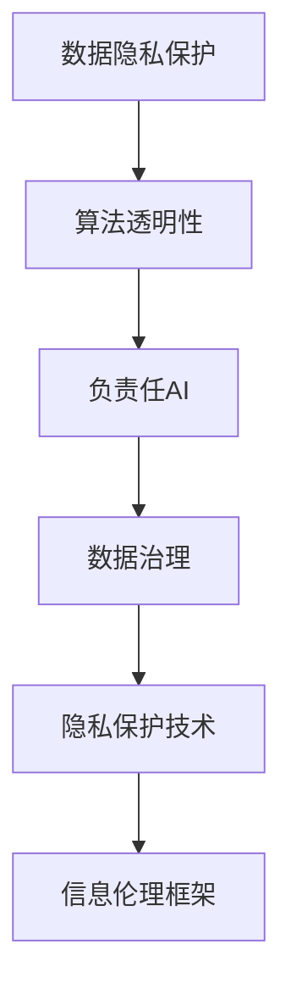

                 

# 知识的伦理：信息使用的道德考量

> 关键词：知识伦理,信息使用,道德考量,人工智能,数据隐私,算法透明,负责任AI,数据治理

## 1. 背景介绍

### 1.1 问题由来
在数字化时代，信息技术的飞速发展极大地推动了知识的获取与传播，但也引发了一系列伦理和道德问题。数据的滥用、隐私泄露、算法偏见等现象，使得公众对信息使用的道德标准提出了更高的要求。尤其是在人工智能（AI）和机器学习（ML）领域，如何合理利用数据，确保算法公正透明，保护用户隐私，成为一个亟待解决的重要课题。

### 1.2 问题核心关键点
信息使用的道德考量主要包括数据隐私保护、算法透明性和负责任AI等关键方面。这些问题不仅关系到个体的权益和尊严，更影响到整个社会的公平与正义。大语言模型（Large Language Models, LLMs）作为信息处理的重要工具，其在数据利用、算法设计、结果应用等方面的伦理道德风险，尤其值得关注。

### 1.3 问题研究意义
研究知识伦理，特别是信息使用的道德考量，对于推动人工智能技术的健康发展，构建公平、透明、负责任的数字社会具有重要意义。

1. **推动技术进步**：通过反思和规范信息使用的伦理道德，可以促进更高效的算法设计和数据管理，推动AI技术的持续创新。
2. **保障用户权益**：合理的伦理考量可以保护用户的隐私和权益，避免数据滥用和算法偏见带来的负面影响。
3. **促进社会和谐**：建立良好的数据治理机制和伦理规范，有助于构建信任，促进社会和谐。

## 2. 核心概念与联系

### 2.1 核心概念概述

为更好地理解信息使用的道德考量，本节将介绍几个核心概念及其相互关系：

- **数据隐私保护**：指在数据收集、存储、使用过程中，保护个人隐私不被泄露，确保用户对其数据的控制权和知情权。
- **算法透明性**：要求算法的决策过程公开透明，用户能够理解算法的运行逻辑和结果，避免“黑箱”问题。
- **负责任AI**：指在设计和应用AI系统时，始终遵循伦理道德规范，避免有害输出，确保系统的社会价值和安全性。
- **数据治理**：涵盖数据采集、处理、共享、保护等多个环节，旨在构建规范、透明的数据管理和使用机制。
- **隐私保护技术**：如差分隐私、联邦学习等技术，通过技术手段保护数据隐私，减少隐私泄露风险。

这些概念之间通过一系列技术、法规、伦理规范和政策框架相互联系，共同构建起信息使用的伦理道德体系。

### 2.2 核心概念原理和架构的 Mermaid 流程图



这个流程图展示了信息使用的道德考量的核心概念及其关系：

1. 数据隐私保护是基础，确保数据的使用在用户同意的前提下进行。
2. 算法透明性是核心，要求用户能理解算法的运行机制和决策依据。
3. 负责任AI是目标，确保AI系统的输出对社会有益，避免有害影响。
4. 数据治理是手段，构建规范的数据管理机制。
5. 隐私保护技术是工具，通过技术手段保护数据隐私。

这些概念共同构成了信息使用伦理道德的完整框架。

## 3. 核心算法原理 & 具体操作步骤

### 3.1 算法原理概述

信息使用的道德考量涉及多个层面，包括但不限于数据隐私保护、算法透明性和负责任AI。这些考量贯穿于数据采集、模型训练、模型应用等各个环节。

### 3.2 算法步骤详解

**Step 1: 数据隐私保护**

1. **数据匿名化**：通过对数据进行去标识化处理，减少个人信息的暴露风险。
2. **差分隐私**：在数据查询和分析过程中，引入噪声，确保个体数据不被泄露。
3. **联邦学习**：分布式训练模型，数据不出本地，保护数据隐私。

**Step 2: 算法透明性**

1. **可解释性模型**：使用可解释性强的模型，如线性回归、决策树等，便于用户理解。
2. **模型可视化**：通过可视化工具展示模型训练过程和决策路径。
3. **公平性检查**：检测算法在性别、种族、年龄等方面的公平性，避免偏见。

**Step 3: 负责任AI**

1. **伦理审查**：在模型设计和应用前进行伦理审查，确保符合伦理规范。
2. **有害输出检测**：设计检测机制，及时发现和修正有害输出。
3. **社会影响评估**：评估模型对社会的影响，确保模型应用的社会价值。

### 3.3 算法优缺点

**数据隐私保护**

优点：
- 通过技术手段减少隐私泄露风险。
- 保护用户对数据的控制权和知情权。

缺点：
- 对隐私保护技术的要求较高，技术复杂度高。
- 可能影响数据可用性和分析精度。

**算法透明性**

优点：
- 提高用户信任度，增强算法接受度。
- 便于发现和修复算法偏见。

缺点：
- 对于复杂模型，解释性可能不足。
- 增加算法的开发和维护成本。

**负责任AI**

优点：
- 确保AI系统的社会价值和安全性。
- 避免有害输出，保护用户权益。

缺点：
- 伦理审查和评估工作耗时耗力。
- 可能限制AI系统的创新应用。

### 3.4 算法应用领域

**医疗健康**：确保患者隐私保护，提高算法透明性和负责任AI，避免误诊和数据滥用。

**金融服务**：保护客户隐私，确保算法透明和负责任，避免欺诈和歧视。

**智能推荐**：确保用户数据隐私，提高推荐算法透明性和负责任AI，避免信息茧房和有害内容推荐。

## 4. 数学模型和公式 & 详细讲解 & 举例说明

### 4.1 数学模型构建

在信息使用的道德考量中，隐私保护和算法透明性可以通过数学模型进行建模和优化。

**隐私保护模型**

隐私保护的核心是数据匿名化和差分隐私。假设有数据集 $D=\{x_1, x_2, ..., x_n\}$，其中每个样本 $x_i$ 包含敏感信息。通过添加噪声 $z_i$，生成匿名化数据集 $D'=\{x_1', x_2', ..., x_n'\}$。

噪声 $z_i$ 的添加方式有多种，如Laplacian机制、Gaussian机制等。以Laplacian机制为例，其噪声添加公式为：

$$
z_i = \mathcal{L}(\Delta) = \Delta + \text{Lap}(\Delta, 1)
$$

其中 $\Delta$ 为数据隐私保护参数，$\text{Lap}(\Delta, 1)$ 为拉普拉斯分布，均值为0，标准差为1。

**算法透明性模型**

算法透明性可以通过模型可视化工具实现。以决策树模型为例，通过树状结构展示模型的决策过程。决策树的构建和可视化可以通过如下代码实现：

```python
import graphviz
from sklearn.tree import DecisionTreeClassifier, export_graphviz
import matplotlib.pyplot as plt

# 构建决策树模型
clf = DecisionTreeClassifier()

# 训练模型
clf.fit(X_train, y_train)

# 可视化决策树
dot_data = export_graphviz(clf, out_file=None, feature_names=X_train.columns, class_names=['0', '1'], filled=True, rounded=True)
graph = graphviz.Source(dot_data)
graph.render("decision_tree", view=True)
```

通过可视化决策树，用户可以清晰地了解模型决策过程，提升算法透明度。

## 5. 项目实践：代码实例和详细解释说明

### 5.1 开发环境搭建

要进行信息使用的道德考量实践，需要构建相应的开发环境。以下是基于Python和相关工具的环境配置流程：

1. 安装Anaconda：从官网下载并安装Anaconda，用于创建独立的Python环境。

2. 创建并激活虚拟环境：
```bash
conda create -n ethical-python python=3.8
conda activate ethical-python
```

3. 安装必要的Python库：
```bash
pip install numpy pandas scikit-learn matplotlib seaborn scipy sklearn
```

4. 安装隐私保护和透明性相关的工具库：
```bash
pip install differential_privacy pyflink flax transformers torch
```

5. 安装可视化工具：
```bash
pip install graphviz matplotlib
```

完成上述步骤后，即可开始信息使用的道德考量实践。

### 5.2 源代码详细实现

以下以数据隐私保护和算法透明性为例，给出Python代码实现：

**数据隐私保护**

使用Laplacian机制进行数据隐私保护：

```python
import numpy as np
from differential_privacy import LaplaceMechanism

# 假设原始数据
original_data = np.random.randn(1000, 10)

# 设置隐私保护参数
delta = 1e-5
epsilon = 0.1

# 构建Laplace机制
mechanism = LaplaceMechanism(epsilon, delta)

# 添加噪声
noisy_data = mechanism(original_data)

# 输出匿名化数据
print(noisy_data)
```

**算法透明性**

构建并可视化决策树模型：

```python
from sklearn.datasets import load_iris
from sklearn.tree import DecisionTreeClassifier
from sklearn.model_selection import train_test_split
from sklearn.metrics import classification_report
import graphviz

# 加载鸢尾花数据集
iris = load_iris()
X, y = iris.data, iris.target

# 划分训练集和测试集
X_train, X_test, y_train, y_test = train_test_split(X, y, test_size=0.2, random_state=42)

# 构建决策树模型
clf = DecisionTreeClassifier()

# 训练模型
clf.fit(X_train, y_train)

# 可视化决策树
dot_data = export_graphviz(clf, out_file=None, feature_names=iris.feature_names, class_names=iris.target_names, filled=True, rounded=True)
graph = graphviz.Source(dot_data)
graph.render("decision_tree", view=True)
```

### 5.3 代码解读与分析

**数据隐私保护代码**

- 首先，我们定义了原始数据集 `original_data`。
- 然后，设置隐私保护参数 `delta` 和 `epsilon`，其中 `delta` 为隐私保护强度的度量，`epsilon` 为隐私保护的预算。
- 接着，使用 `LaplaceMechanism` 类构建隐私保护机制，通过添加噪声实现隐私保护。
- 最后，输出匿名化后的数据 `noisy_data`。

**算法透明性代码**

- 首先，加载鸢尾花数据集，并进行数据划分。
- 然后，构建决策树模型 `clf`，并使用训练集数据进行模型训练。
- 接着，通过 `export_graphviz` 函数将决策树可视化，并生成 `dot_data` 数据。
- 最后，使用 `graphviz` 库渲染并展示决策树图形。

## 6. 实际应用场景

### 6.1 智能推荐系统

智能推荐系统需要收集用户行为数据，以提供个性化的推荐服务。但在数据收集和处理过程中，必须严格遵守数据隐私保护和算法透明性的原则。

**数据隐私保护**

- 采用差分隐私技术，确保用户行为数据不泄露个人隐私。
- 使用联邦学习技术，确保数据不出本地，保护用户隐私。

**算法透明性**

- 在推荐算法中，使用可解释性强的模型，如线性回归或决策树。
- 提供推荐结果的解释，让用户理解推荐依据。

### 6.2 医疗诊断系统

医疗诊断系统需要处理大量患者的敏感数据，隐私保护和算法透明性尤为重要。

**数据隐私保护**

- 对患者数据进行去标识化处理，确保隐私保护。
- 使用差分隐私技术，保护个体数据不被泄露。

**算法透明性**

- 在诊断模型中使用可解释性强的模型，如决策树或逻辑回归。
- 提供诊断结果的解释，帮助医生理解诊断依据。

### 6.3 金融风控系统

金融风控系统需要处理大量客户的金融数据，隐私保护和算法透明性同样不可忽视。

**数据隐私保护**

- 对客户数据进行去标识化处理，确保隐私保护。
- 使用差分隐私技术，保护个体数据不被泄露。

**算法透明性**

- 在风险评估模型中使用可解释性强的模型，如线性回归或逻辑回归。
- 提供风险评估结果的解释，帮助客户理解评估依据。

## 7. 工具和资源推荐

### 7.1 学习资源推荐

为了帮助开发者系统掌握信息使用的道德考量，这里推荐一些优质的学习资源：

1. **《数据隐私保护原理与实践》**：详细介绍数据隐私保护的技术和方法，涵盖差分隐私、联邦学习等前沿技术。
2. **《AI伦理导论》**：系统介绍AI伦理的基本原理和道德规范，包括隐私保护、算法透明性和负责任AI等关键议题。
3. **《负责任AI实践指南》**：提供负责任AI的详细操作指南，涵盖伦理审查、有害输出检测等内容。

通过学习这些资源，相信你一定能够系统掌握信息使用的道德考量，并在实践中灵活应用。

### 7.2 开发工具推荐

高效的开发离不开优秀的工具支持。以下是几款用于信息使用伦理道德考量的常用工具：

1. **Differential Privacy**：用于差分隐私保护的Python库，支持多种隐私保护机制。
2. **PyFlink**：用于分布式数据处理和联邦学习的开源框架，支持大规模数据集的处理。
3. **Flax**：Google开发的深度学习框架，支持可解释性强的模型构建。
4. **Graphviz**：用于可视化算法决策过程的工具，支持多种图形格式输出。
5. **TensorBoard**：TensorFlow配套的可视化工具，可实时监测模型训练状态，提供丰富的图表呈现方式。

合理利用这些工具，可以显著提升信息使用伦理道德考量的开发效率，加快创新迭代的步伐。

### 7.3 相关论文推荐

信息使用的伦理道德考量的研究源于学界的持续研究。以下是几篇奠基性的相关论文，推荐阅读：

1. **《数据隐私保护技术综述》**：系统回顾了数据隐私保护的技术进展，包括差分隐私、联邦学习等前沿技术。
2. **《负责任AI的伦理规范》**：探讨负责任AI的基本伦理规范，提出了一套全面的AI伦理框架。
3. **《可解释AI的研究进展》**：综述了可解释AI的研究现状和前沿技术，包括模型可视化、可解释性评估等内容。

这些论文代表了大语言模型微调技术的发展脉络。通过学习这些前沿成果，可以帮助研究者把握学科前进方向，激发更多的创新灵感。

## 8. 总结：未来发展趋势与挑战

### 8.1 总结

本文对信息使用的伦理道德考量的研究进行了全面系统的介绍。首先阐述了信息使用伦理道德考量的研究背景和意义，明确了隐私保护、算法透明性和负责任AI等关键问题。其次，从原理到实践，详细讲解了信息使用的伦理道德考量的数学模型和关键步骤，给出了具体的代码实例。同时，本文还探讨了信息使用伦理道德考量的实际应用场景，展示了其在推荐系统、医疗诊断、金融风控等领域的广泛应用前景。最后，本文推荐了相关的学习资源、开发工具和学术论文，以期为读者提供全方位的技术指引。

通过本文的系统梳理，可以看到，信息使用的伦理道德考量在人工智能技术的健康发展中具有重要作用。隐私保护、算法透明性和负责任AI是构建公平、透明、负责任的数字社会的关键。

### 8.2 未来发展趋势

展望未来，信息使用的伦理道德考量将呈现以下几个发展趋势：

1. **隐私保护技术的不断进步**：随着技术的不断进步，差分隐私、联邦学习等隐私保护技术将更加成熟，能够更好地保护用户隐私。
2. **算法透明性的提升**：更多的可解释性算法将被开发出来，帮助用户理解算法的运行机制和决策依据，提升算法的透明性。
3. **负责任AI的普及**：负责任AI的理念将进一步普及，更多的AI系统将遵循伦理道德规范，避免有害输出。
4. **数据治理机制的完善**：将建立更加完善的数据治理机制，涵盖数据采集、处理、存储、共享等多个环节，确保数据的安全和合规使用。

这些趋势将推动信息使用的伦理道德考量进入更高级的阶段，为构建公平、透明、负责任的数字社会提供有力支持。

### 8.3 面临的挑战

尽管信息使用的伦理道德考量的研究已经取得了一定的成果，但在实际应用中仍面临诸多挑战：

1. **隐私保护与数据可用性的平衡**：如何在保护隐私的同时，确保数据的质量和可用性，是一个亟待解决的难题。
2. **算法透明性与复杂性的矛盾**：对于复杂的深度学习模型，提高其可解释性往往需要增加模型复杂度，如何平衡两者关系，仍然是一个重要的研究方向。
3. **负责任AI的落地应用**：如何通过伦理审查和有害输出检测等手段，确保负责任AI在实际应用中的社会价值，是一个复杂的工程问题。
4. **数据治理的跨领域协调**：数据治理需要跨部门、跨领域的协调，如何在不同利益相关者之间建立有效的沟通和协作机制，也是一个重要的挑战。

这些挑战需要学界和产业界的共同努力，才能有效解决。只有在技术、伦理、政策等多方面协同发力，才能推动信息使用的伦理道德考量的持续进步。

### 8.4 研究展望

未来的研究需要在以下几个方面寻求新的突破：

1. **多模态数据隐私保护**：研究如何在处理多模态数据（如文本、图像、视频等）时，保护数据隐私，提升隐私保护的全面性。
2. **泛化性算法透明性**：研究如何构建泛化性更强的算法，在保证透明性的同时，提高算法的性能和效果。
3. **动态伦理审查机制**：研究如何构建动态伦理审查机制，实时监测和评估AI系统的社会影响，确保系统的伦理规范。
4. **可解释性增强**：研究如何增强算法的可解释性，提升用户对AI系统的信任度，促进AI技术的普及和应用。

这些研究方向的探索，将推动信息使用的伦理道德考量迈向更高的台阶，为构建公平、透明、负责任的数字社会提供坚实基础。总之，信息使用的伦理道德考量是人工智能技术健康发展的重要保障，需要在技术、伦理、政策等多个层面进行深入研究，才能推动其持续进步，为构建美好数字社会提供有力支持。

## 9. 附录：常见问题与解答

**Q1：如何平衡隐私保护和数据可用性？**

A: 隐私保护和数据可用性之间的平衡可以通过差分隐私技术实现。差分隐私技术通过添加噪声，确保个体数据不被泄露的同时，仍然可以提取有用的统计信息。例如，在数据查询和分析过程中，引入拉普拉斯机制，添加噪声保护个体数据隐私。

**Q2：如何提高算法的透明性？**

A: 提高算法的透明性可以通过可解释性强的模型和可视化工具实现。使用线性回归、决策树等可解释性强的模型，便于用户理解算法的运行机制和决策依据。通过可视化工具展示决策路径，如使用Graphviz可视化决策树，帮助用户理解算法的透明性。

**Q3：如何构建负责任AI系统？**

A: 构建负责任AI系统需要遵循伦理规范，进行伦理审查和有害输出检测。在模型设计和应用前进行伦理审查，确保符合伦理规范。设计有害输出检测机制，及时发现和修正有害输出。评估模型对社会的影响，确保模型的社会价值。

**Q4：如何处理多模态数据隐私保护？**

A: 处理多模态数据隐私保护需要综合考虑不同数据类型的隐私保护需求。例如，在图像数据中，可以采用差分隐私技术，通过添加噪声保护个体隐私。在文本数据中，可以采用联邦学习技术，确保数据不出本地，保护隐私。

**Q5：如何增强算法的可解释性？**

A: 增强算法的可解释性可以通过多种方式实现。例如，使用可解释性强的模型，如线性回归、决策树等。提供模型可视化工具，如Graphviz，帮助用户理解模型决策路径。设计模型解释框架，如LIME、SHAP等，提供模型输出解释。

---

作者：禅与计算机程序设计艺术 / Zen and the Art of Computer Programming

