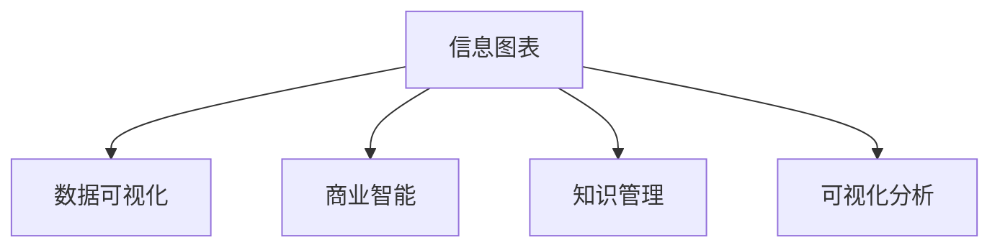

                 

# 知识的可视化工具：信息图表的力量

> 关键词：知识可视化, 信息图表, 数据驱动决策, 商业智能, 数据可视化

## 1. 背景介绍

在信息爆炸的今天，面对海量数据和复杂的信息，人们需要更直观、更高效的渠道来获取和理解知识。信息图表作为一种新型的知识可视化工具，正日益受到广泛关注。通过图形化的展示，信息图表能够将复杂的数据和信息以更易理解和记忆的方式呈现，帮助人们快速、准确地把握信息要点。

### 1.1 问题由来

随着信息技术的发展，数据量呈爆炸式增长。过去，人们依靠纸质文件、纸质地图等传统的信息展示方式，来获取和交流信息。然而，这些方式不仅效率低下，还容易出现理解上的偏差。如今，数字化技术的普及，为知识可视化提供了新的可能性。信息图表作为一种新型的信息展示方式，以其直观、易懂的特点，逐渐成为数据驱动决策的重要手段。

### 1.2 问题核心关键点

信息图表的核心在于将数据和信息通过图形化的方式展示出来，帮助人们快速理解信息要点。其主要关键点包括：
- 直观性：信息图表以图形化的形式呈现数据，直观性强，便于理解。
- 概括性：信息图表将大量信息压缩在一个图表中，便于快速把握信息要点。
- 互动性：信息图表往往具备交互功能，用户可以通过点击、拖动等操作，获得更详细的信息。
- 可记忆性：通过图形化的展示，信息图表中的信息更容易被记住和回忆。
- 可分享性：信息图表便于通过社交媒体等平台分享，传播信息效率更高。

## 2. 核心概念与联系

### 2.1 核心概念概述

为更好地理解信息图表的核心概念，本节将介绍几个密切相关的核心概念：

- **信息图表(Information Chart)**：一种新型的信息可视化方式，通过图形化的形式，将数据和信息直观、易理解地呈现出来。信息图表通常包括各种图表类型，如柱状图、饼图、散点图、折线图等。

- **数据可视化(Data Visualization)**：将数据通过图形化的方式展示出来，帮助人们更好地理解数据，发现数据中的模式和趋势。数据可视化是信息图表的重要组成部分，是信息图表设计的基础。

- **商业智能(Business Intelligence, BI)**：通过数据分析和可视化，帮助企业更好地理解和决策。商业智能利用信息图表进行数据展示和分析，是信息图表的重要应用场景。

- **知识管理(Knowledge Management, KM)**：通过信息图表将组织内的知识进行系统化、结构化的展示和共享。知识管理利用信息图表实现知识传递和共享，是信息图表的另一个重要应用场景。

- **可视化分析(Visual Analytics)**：利用图形化的方式进行数据探索和分析，发现数据中的隐藏模式和规律。可视化分析通过信息图表实现数据的可视化展示，是信息图表的重要功能之一。

这些核心概念之间的逻辑关系可以通过以下Mermaid流程图来展示：



这个流程图展示信息图表的核心概念及其之间的关系：

1. 信息图表基于数据可视化，是数据可视化的应用形式。
2. 信息图表广泛应用于商业智能、知识管理、可视化分析等多个领域，支持不同的数据展示和分析需求。

## 3. 核心算法原理 & 具体操作步骤
### 3.1 算法原理概述

信息图表的生成算法主要基于数据可视化的原理，通过选择合适的图表类型、颜色、标签等，将数据和信息以图形化的方式展示出来。

### 3.2 算法步骤详解

信息图表的生成算法一般包括以下几个关键步骤：

**Step 1: 数据准备**
- 收集需要展示的数据，包括各类数值型和分类型数据。
- 对数据进行清洗和整理，确保数据的完整性和准确性。

**Step 2: 选择图表类型**
- 根据展示数据的类型和特点，选择合适的图表类型，如柱状图、饼图、散点图、折线图等。
- 考虑展示数据的维度和复杂度，选择合适的图表大小和布局。

**Step 3: 数据编码**
- 将数据按照图表类型进行编码，转换为图形化的展示形式。
- 选择合适的颜色和标签，进行数据标记和注释。

**Step 4: 生成图表**
- 根据选择的图表类型和数据编码，生成信息图表。
- 在图表中添加互动元素，如悬停显示、点击跳转等，增强用户体验。

**Step 5: 发布与分享**
- 将生成的信息图表发布到线上平台，如企业网站、社交媒体等。
- 通过各种渠道分享信息图表，扩大其传播范围和影响力。

### 3.3 算法优缺点

信息图表作为一种新型的数据展示方式，具有以下优点：
- 直观易懂：信息图表以图形化的形式呈现数据，直观性强，便于理解。
- 概括性强：信息图表可以将大量信息压缩在一个图表中，便于快速把握信息要点。
- 交互性强：信息图表往往具备交互功能，用户可以通过点击、拖动等操作，获得更详细的信息。
- 可记忆性好：通过图形化的展示，信息图表中的信息更容易被记住和回忆。
- 可分享性强：信息图表便于通过社交媒体等平台分享，传播信息效率更高。

同时，信息图表也存在一定的局限性：
- 对数据质量要求高：信息图表要求数据准确、完整，否则易误导用户。
- 制作复杂：信息图表的制作需要较高的技术水平和设计能力。
- 可能影响美观：过于复杂的图表设计可能会影响美观性。

尽管存在这些局限性，但就目前而言，信息图表正逐渐成为企业决策和知识管理中的重要工具。

### 3.4 算法应用领域

信息图表作为一种新型的信息展示方式，已在多个领域得到广泛应用：

- **商业智能**：企业利用信息图表进行数据分析和展示，帮助决策者快速理解数据。
- **知识管理**：组织利用信息图表进行知识共享和传递，提升团队协作效率。
- **数据可视化**：研究者利用信息图表进行数据探索和分析，发现数据中的隐藏模式和规律。
- **公共健康**：政府和公共组织利用信息图表展示公共健康数据，帮助公众理解疫情趋势和预防措施。
- **环境保护**：环保组织利用信息图表展示环境数据，提高公众环保意识和行动。
- **城市规划**：城市规划部门利用信息图表展示城市发展数据，指导城市建设和管理。

除了上述这些经典应用外，信息图表还被创新性地应用到更多场景中，如电商数据展示、市场分析、金融报告等，为各行各业提供新的信息展示方式。

## 4. 数学模型和公式 & 详细讲解 & 举例说明

### 4.1 数学模型构建

信息图表的生成算法主要基于数据可视化的原理，通过选择合适的图表类型、颜色、标签等，将数据和信息以图形化的方式展示出来。

### 4.2 公式推导过程

以下我们以柱状图为例，推导其生成的数学模型。

假设需要展示的数据为 $x_1, x_2, \ldots, x_n$，其中 $x_i$ 为第 $i$ 个数据点的数值。柱状图的高度 $h_i$ 为数据点 $x_i$ 的大小，横轴表示数据点的位置，纵轴表示数据的大小。柱状图的数学模型可以表示为：

$$
h_i = \frac{x_i}{\max\{x_1, x_2, \ldots, x_n\}}
$$

其中 $\max\{x_1, x_2, \ldots, x_n\}$ 为数据的最大值，用于将数据缩放到 $[0, 1]$ 区间内。

### 4.3 案例分析与讲解

下面以一个简单的例子来说明信息图表的生成过程。

假设某公司需要展示2019年和2020年的销售额对比，数据如下：

| 年份 | 销售额 |
| --- | --- |
| 2019 | 1000 |
| 2020 | 2000 |

根据柱状图的特点，我们选择横轴表示年份，纵轴表示销售额。为了使图表更直观，我们将其缩放至 $[0, 1]$ 区间内。

| 年份 | 缩放后销售额 |
| --- | --- |
| 2019 | 0.5 |
| 2020 | 1.0 |

接下来，我们设计柱状图的高度，使得每个年份的销售额对应一个柱子。由于2020年的销售额是2019年的两倍，因此柱状图的高度也不同，具体如下：

| 年份 | 缩放后销售额 | 柱状图高度 |
| --- | --- | --- |
| 2019 | 0.5 | 0.5 |
| 2020 | 1.0 | 1.0 |

根据上述数据，我们可以绘制如下柱状图：

```
    2020 |---| 1.0
    2019 |---| 0.5
```

通过信息图表，我们可以直观地看出，2020年的销售额比2019年翻了一番。这种图形化的展示方式，比传统的数据表格更容易理解和记忆。

## 5. 项目实践：代码实例和详细解释说明
### 5.1 开发环境搭建

在进行信息图表的开发实践前，我们需要准备好开发环境。以下是使用Python进行D3.js开发的环境配置流程：

1. 安装Node.js和npm：从官网下载并安装Node.js和npm，用于JavaScript项目开发。
2. 创建项目目录：使用命令行创建项目目录，并初始化npm。
3. 安装相关库：通过npm安装D3.js库和其他相关库，如React、Axios等。
4. 创建项目结构：按照D3.js的模板，创建项目结构。
5. 配置开发环境：配置本地开发环境，确保所有库和依赖都正确安装。

完成上述步骤后，即可在项目环境中开始信息图表的开发。

### 5.2 源代码详细实现

下面是一个简单的柱状图信息图表的D3.js代码实现，包括数据准备、图表生成和交互功能。

```javascript
// 导入D3.js库
import * as d3 from 'd3';

// 准备数据
const data = [
  { year: 2019, sales: 1000 },
  { year: 2020, sales: 2000 }
];

// 定义x轴和y轴的域
const xScale = d3.scaleBand()
  .domain(data.map(d => d.year))
  .range([0, 300])
  .padding(0.1);

const yScale = d3.scaleLinear()
  .domain([0, d3.max(data, d => d.sales)])
  .range([250, 0]);

// 创建柱状图
const svg = d3.select('body')
  .append('svg')
  .attr('width', 300)
  .attr('height', 250);

const bars = svg.selectAll('rect')
  .data(data)
  .enter()
  .append('rect')
  .attr('x', d => xScale(d.year))
  .attr('y', d => yScale(d.sales))
  .attr('width', xScale.bandwidth())
  .attr('height', d => 250 - yScale(d.sales))
  .attr('fill', 'steelblue');

// 添加交互功能
bars.on('mouseover', function(d) {
  d3.select(this)
    .attr('fill', 'orange');
});

bars.on('mouseout', function(d) {
  d3.select(this)
    .attr('fill', 'steelblue');
});
```

### 5.3 代码解读与分析

让我们再详细解读一下关键代码的实现细节：

**数据准备**：
- 通过对象形式定义数据，包含年份和销售额。
- 使用D3.js的scaleBand和scaleLinear函数，将数据映射到图形坐标系中。

**柱状图生成**：
- 使用D3.js的append方法，创建一个SVG元素作为图表容器。
- 使用d3.selectAll和data方法，选择数据并创建柱状图。
- 通过attr方法设置柱状图的宽度、高度和填充色。

**交互功能**：
- 通过事件监听器，为柱状图添加鼠标悬停和移出的交互功能。
- 使用d3.select方法，选择当前悬停的柱状图，并将其颜色变为橙色，鼠标移出后恢复原色。

可以看到，D3.js提供了丰富的API和函数，可以方便地创建和操作信息图表。开发者可以基于此，进一步实现更复杂的图表和交互功能。

## 6. 实际应用场景
### 6.1 商业智能

商业智能是信息图表的重要应用场景之一。通过信息图表，企业可以快速获取关键业务指标，进行数据分析和决策。

例如，一家电商平台可以通过信息图表展示月度销售数据，帮助管理层了解销售趋势和市场变化。具体步骤如下：

1. 收集月度销售数据，包括销售额、订单量、客户满意度等。
2. 对数据进行清洗和整理，确保数据的准确性和完整性。
3. 选择适合的图表类型，如柱状图、折线图、饼图等。
4. 生成信息图表，展示月度销售数据和趋势。
5. 通过交互功能，用户可以动态查看各个月份的数据和变化。
6. 结合业务分析，管理层可以根据信息图表的展示，进行决策和调整。

通过信息图表，企业可以快速、直观地理解业务数据，发现潜在的商业机会和风险。

### 6.2 知识管理

在知识管理中，信息图表同样具有重要作用。组织可以利用信息图表进行知识共享和传递，提升团队协作效率。

例如，一家科技公司可以通过信息图表展示公司技术栈、项目进展和知识库。具体步骤如下：

1. 收集公司内部的技术文档、项目代码和知识库数据。
2. 对数据进行整理和清洗，确保数据的准确性和完整性。
3. 选择适合的图表类型，如饼图、树状图、网络图等。
4. 生成信息图表，展示技术栈、项目进展和知识库。
5. 通过交互功能，用户可以动态查看各个项目和知识库的状态。
6. 结合知识管理系统，团队成员可以根据信息图表的展示，进行协作和交流。

通过信息图表，组织可以快速、直观地理解内部的知识资源和项目进展，提高团队协作效率。

### 6.3 数据可视化

在数据可视化中，信息图表是一种重要的展示手段，可以帮助研究者发现数据中的隐藏模式和规律。

例如，某研究团队可以通过信息图表展示气候变化对农业产量的影响。具体步骤如下：

1. 收集农业产量和气候变化数据，包括温度、降雨量、风速等。
2. 对数据进行清洗和整理，确保数据的准确性和完整性。
3. 选择适合的图表类型，如散点图、折线图、热力图等。
4. 生成信息图表，展示气候变化对农业产量的影响。
5. 通过交互功能，用户可以动态查看不同气候条件下的产量变化。
6. 结合数据分析，研究团队可以根据信息图表的展示，进行因果推断和预测。

通过信息图表，研究者可以直观、快速地发现数据中的隐藏模式和规律，提高研究效率。

### 6.4 未来应用展望

随着信息图表技术的不断成熟，其应用领域和场景将进一步拓展。未来，信息图表将会在以下几个方向得到广泛应用：

- **智能决策支持**：企业可以通过信息图表快速获取关键业务指标，进行智能决策和优化。
- **实时数据展示**：结合物联网和传感器技术，信息图表可以实时展示各类数据，帮助用户快速做出决策。
- **个性化推荐**：通过信息图表展示用户行为和偏好，个性化推荐系统可以根据用户数据，推荐合适的产品和服务。
- **社交媒体分析**：社交媒体平台可以利用信息图表展示用户数据和行为，帮助用户理解自身社交活动。
- **公共健康监测**：政府和公共组织可以利用信息图表展示公共健康数据，帮助公众理解疫情趋势和预防措施。

未来，信息图表将会在更多的场景中得到应用，为人们提供更直观、更高效的信息展示方式。

## 7. 工具和资源推荐
### 7.1 学习资源推荐

为了帮助开发者系统掌握信息图表的开发技术，这里推荐一些优质的学习资源：

1. **《D3.js官方文档》**：D3.js官方提供的文档，详细介绍了D3.js库的使用方法和API。
2. **《数据可视化实战》**：讲解数据可视化的基本原理和实践技巧，适合初学者学习。
3. **《Data Wrangling with D3.js》**：讲解数据清洗和处理的工具和技巧，帮助开发者高效地进行数据可视化。
4. **《JavaScript数据可视化教程》**：讲解JavaScript在数据可视化中的应用，适合JavaScript开发人员学习。
5. **《商业智能与数据可视化》**：讲解商业智能和数据可视化的基础知识和应用案例，适合企业决策者学习。
6. **《数据可视化实战案例》**：提供数据可视化实践案例，帮助开发者学习如何设计信息图表。

通过对这些资源的学习实践，相信你一定能够快速掌握信息图表的开发技术，并用于解决实际的问题。

### 7.2 开发工具推荐

高效的信息图表开发离不开优秀的工具支持。以下是几款用于信息图表开发的工具：

1. **D3.js**：一个基于Web的JavaScript库，用于数据可视化。D3.js提供了丰富的API和函数，可以创建各种类型的信息图表。
2. **Highcharts**：一个基于JavaScript的图表库，提供了丰富的图表类型和交互功能。
3. **ECharts**：一个基于Web的图表库，提供了丰富的图表类型和数据处理功能。
4. **Plotly**：一个基于JavaScript和Python的图表库，提供了丰富的图表类型和数据可视化功能。
5. **Google Charts**：谷歌提供的图表库，提供了丰富的图表类型和交互功能。
6. **Tableau Public**：一款数据可视化工具，提供了丰富的图表类型和数据处理功能。

合理利用这些工具，可以显著提升信息图表的开发效率，加速创新迭代的步伐。

### 7.3 相关论文推荐

信息图表技术的发展源于学界的持续研究。以下是几篇奠基性的相关论文，推荐阅读：

1. **《信息图表的视觉设计研究》**：探讨了信息图表的视觉设计原则和方法，提出了设计信息图表的通用框架。
2. **《数据可视化在商业智能中的应用》**：探讨了数据可视化在商业智能中的应用，提出了信息图表的设计和实现方法。
3. **《数据可视化与信息图表的比较研究》**：比较了数据可视化和信息图表的特点和优势，提出了信息图表的应用场景和设计策略。
4. **《信息图表在公共健康中的应用》**：探讨了信息图表在公共健康中的应用，提出了公共健康数据可视化的设计和方法。
5. **《数据可视化的心理学研究》**：探讨了数据可视化的心理学原理，提出了信息图表设计中的心理因素。
6. **《信息图表与商业决策的案例分析》**：探讨了信息图表在商业决策中的应用，提出了商业决策中的信息图表设计方法。

这些论文代表了大数据可视化技术的发展脉络。通过学习这些前沿成果，可以帮助研究者把握学科前进方向，激发更多的创新灵感。

## 8. 总结：未来发展趋势与挑战
### 8.1 总结

本文对信息图表的核心概念和应用进行了全面系统的介绍。首先阐述了信息图表和数据可视化的基本原理，明确了信息图表在商业智能、知识管理、数据可视化等多个领域的重要价值。其次，从原理到实践，详细讲解了信息图表的生成算法和关键步骤，给出了信息图表开发实践的完整代码实例。同时，本文还广泛探讨了信息图表在商业智能、知识管理、数据可视化等多个领域的应用前景，展示了信息图表技术的巨大潜力。

通过本文的系统梳理，可以看到，信息图表正逐渐成为商业决策和知识管理中的重要工具，极大地提高了数据展示和分析的效率。未来，伴随技术的不断进步，信息图表将在更广阔的领域中发挥重要作用。

### 8.2 未来发展趋势

展望未来，信息图表技术将呈现以下几个发展趋势：

1. **实时数据展示**：结合物联网和传感器技术，信息图表可以实时展示各类数据，帮助用户快速做出决策。
2. **交互功能增强**：未来的信息图表将具备更强大的交互功能，用户可以通过点击、拖动等操作，获得更详细的信息。
3. **可视化分析融合**：信息图表将与其他数据可视化工具和技术进行融合，提供更加全面、精准的数据展示和分析。
4. **跨平台支持**：信息图表将支持更多的平台和设备，包括移动端、桌面端、Web端等。
5. **个性化定制**：信息图表将具备更高的个性化定制能力，可以根据用户需求和数据特点进行定制设计。

以上趋势凸显了信息图表技术的广阔前景。这些方向的探索发展，必将进一步提升信息图表的表现力和应用范围，为人们的生产生活带来更高效的智能体验。

### 8.3 面临的挑战

尽管信息图表技术已经取得了显著成果，但在迈向更加智能化、普适化应用的过程中，仍面临诸多挑战：

1. **数据质量要求高**：信息图表要求数据准确、完整，否则易误导用户。数据清洗和处理是信息图表开发的难点之一。
2. **制作复杂**：信息图表的制作需要较高的技术水平和设计能力。开发者需要具备数据处理和图形设计的能力。
3. **美观性不足**：过于复杂的图表设计可能会影响美观性。如何在美观性和功能之间进行平衡，是信息图表设计的一大挑战。
4. **用户交互性有待提高**：目前的信息图表交互功能还有待提升，用户在交互过程中可能存在操作复杂、响应速度慢等问题。

尽管存在这些挑战，但通过不断改进和优化，相信信息图表技术将不断成熟，应用范围将不断拓展。未来，伴随着技术的持续进步，信息图表必将在更广阔的领域中得到应用，为人们的生产生活带来更高效的智能体验。

### 8.4 研究展望

面对信息图表技术面临的种种挑战，未来的研究需要在以下几个方面寻求新的突破：

1. **数据清洗与处理**：开发更高效、智能的数据清洗和处理算法，提高信息图表数据的质量和准确性。
2. **交互设计优化**：设计更加直观、易用的交互界面，提升用户的操作体验和信息获取效率。
3. **可视化分析融合**：将信息图表与其他数据可视化工具和技术进行深度融合，提供更加全面、精准的数据展示和分析。
4. **跨平台支持**：开发支持更多平台和设备的信息图表，提升其跨平台的兼容性和可访问性。
5. **个性化定制**：开发更加个性化定制的信息图表，根据用户需求和数据特点进行设计。

这些研究方向的探索，必将引领信息图表技术迈向更高的台阶，为人们的生产生活带来更高效的智能体验。总之，信息图表技术需要在技术、设计和应用等多个层面进行全面优化，方能真正实现其在商业智能、知识管理、数据可视化等领域的价值。

## 9. 附录：常见问题与解答

**Q1: 信息图表的优点有哪些？**

A: 信息图表的优点主要体现在直观性、概括性、交互性和可记忆性。通过图形化的展示，信息图表将复杂的数据和信息以直观、易懂的方式呈现出来，便于用户快速理解信息要点。

**Q2: 信息图表如何选择合适的图表类型？**

A: 选择合适的图表类型主要取决于展示数据的类型和特点。柱状图适合展示数值型数据，折线图适合展示时间序列数据，饼图适合展示比例数据，散点图适合展示相关性数据。

**Q3: 信息图表在商业智能中有哪些应用？**

A: 信息图表在商业智能中有多种应用。例如，企业可以利用信息图表展示月度销售数据，帮助管理层了解销售趋势和市场变化；利用信息图表展示技术栈、项目进展和知识库，提升团队协作效率；利用信息图表展示农业产量和气候变化数据，进行因果推断和预测。

**Q4: 信息图表如何与商业决策结合？**

A: 信息图表可以通过直观展示关键业务指标，帮助企业快速进行智能决策。例如，电商企业可以利用信息图表展示月度销售数据和趋势，管理层可以根据信息图表的展示，进行销售策略优化和市场调整。

**Q5: 信息图表在数据可视化中有哪些应用？**

A: 信息图表在数据可视化中有多种应用。例如，研究团队可以利用信息图表展示气候变化对农业产量的影响，通过交互功能动态查看不同气候条件下的产量变化；利用信息图表展示用户行为和偏好，个性化推荐系统可以根据用户数据，推荐合适的产品和服务。

通过对这些问题的解答，相信读者可以更全面地理解信息图表的核心概念和应用，掌握其开发技术，将其应用于实际问题中。

