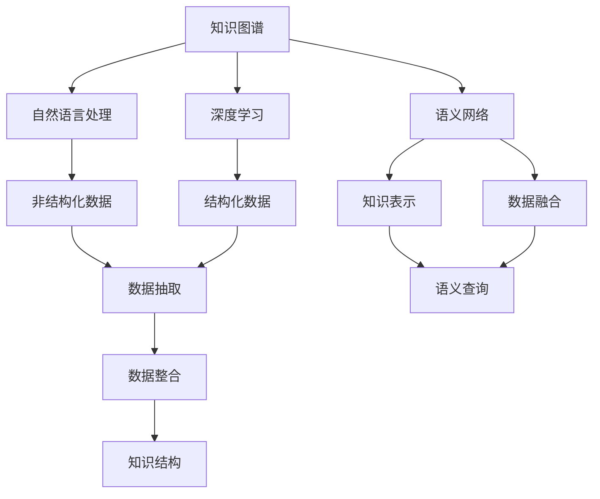

                 

# 知识的碎片化与整合：信息时代的挑战

> 关键词：知识图谱,语义网络,自然语言处理(NLP),深度学习,数据融合,知识表示

## 1. 背景介绍

### 1.1 问题由来

随着信息技术的迅猛发展，人类社会进入了以大数据、云计算、人工智能为代表的信息时代。信息的爆炸式增长，极大地丰富了人类的知识体系，同时也带来了对知识整理、管理与应用的挑战。信息的碎片化、异构化，使得知识的获取、共享与整合变得异常复杂。如何在信息大潮中提炼、重构知识，实现高效、智能的知识管理，成为信息时代亟需解决的重要问题。

### 1.2 问题核心关键点

信息时代知识管理的核心在于：
- 信息的碎片化：互联网的开放性使得信息源和内容高度分散，各类知识库、文献库、百科库等资源体系呈现高度异构性。
- 知识的整合：在碎片化的信息源基础上，如何构建合理的知识结构，实现知识的系统化和标准化。
- 智能化的应用：基于知识图谱、语义网络等技术，实现知识的智能检索、推理、自动生成，提升知识的管理和应用效率。

### 1.3 问题研究意义

通过对知识的碎片化与整合问题的研究，可以：
- 提升信息时代知识管理的效率。通过系统化、标准化的知识表示，减少知识的获取与处理成本。
- 促进知识的智能化应用。借助深度学习、自然语言处理等技术，实现知识的高效检索、推理与生成。
- 推动知识驱动型产业的发展。构建基于知识的智能系统，为各行各业提供决策支持和智能服务。
- 促进知识共享与协作。基于公共知识图谱，实现全球范围内的知识共享与协作创新。

## 2. 核心概念与联系

### 2.1 核心概念概述

为了更清晰地理解知识碎片化与整合的问题，我们需要先定义一些核心概念：

- 知识图谱(Knowledge Graph)：一种结构化的语义网络，用于描述实体之间的关系，并支持实体、关系和属性的语义查询。
- 语义网络(Semantic Network)：一种描述实体和属性之间的语义关系的图结构，通常包含节点和边。
- 知识表示(Knowledge Representation)：一种将知识结构化表示的方法，包括结构化的三元组(RDF)、图形表示(Graph)、逻辑表示等。
- 自然语言处理(NLP)：研究如何让计算机理解和生成自然语言的学科，包括分词、句法分析、语义理解、自动生成等。
- 深度学习(Deep Learning)：一种基于神经网络的机器学习技术，具有强大的数据建模能力，可以处理复杂的非线性问题。
- 数据融合(Data Fusion)：将不同来源和格式的数据进行整合，形成统一、一致的数据集，用于分析和建模。

这些核心概念之间存在紧密的联系：知识图谱和语义网络是知识的结构化表示，自然语言处理和深度学习用于从非结构化数据中提取和构建知识，数据融合则将分散的信息源整合成一致的知识集。

### 2.2 核心概念原理和架构的 Mermaid 流程图



这个流程图展示了知识管理从非结构化数据到结构化知识的完整链条：

1. 非结构化数据（如文本、图像等）通过自然语言处理和深度学习进行抽取和转换。
2. 抽取出的知识通过数据融合进行整合，形成结构化的知识表示。
3. 结构化的知识表示被映射到知识图谱和语义网络中，用于语义查询和推理。

## 3. 核心算法原理 & 具体操作步骤

### 3.1 算法原理概述

基于知识图谱和语义网络的知识管理，其核心算法原理主要包括以下几个步骤：

1. **数据抽取与整合**：从分散的信息源中提取实体、关系和属性，进行去重、合并和标准化处理，形成统一的语义数据集。
2. **知识表示与建模**：将语义数据集转换为知识图谱或语义网络的结构化表示，用于知识的存储和查询。
3. **知识推理与生成**：利用知识图谱和语义网络进行语义推理和知识生成，支持复杂查询和多维关系分析。
4. **应用部署与优化**：将知识图谱和语义网络嵌入到应用系统，提供智能化的知识检索、推理和生成服务，并不断优化算法性能和模型效果。

### 3.2 算法步骤详解

**Step 1: 数据抽取**

数据抽取是知识管理的基础，主要从以下来源进行抽取：

- **网页爬虫**：从各类网站抓取文本、图像、视频等非结构化数据。
- **API接口**：从公开API接口获取结构化数据，如维基百科、DBPedia等。
- **数据库**：从关系型或非关系型数据库中抽取数据，如SQL、NoSQL等。
- **社交网络**：从社交媒体、论坛等平台抽取用户生成内容，如评论、回复等。

数据抽取的方法主要包括：

- **规则抽取**：基于正则表达式或文本规则进行数据解析，适用于数据格式固定的情况。
- **实体抽取**：利用NLP技术进行实体识别和关系抽取，适用于非结构化文本数据。
- **结构化数据抽取**：从结构化数据中提取预定义的实体和属性，适用于数据库数据。

**Step 2: 数据整合**

数据整合的目的是将不同来源的数据进行统一和标准化，形成一致的知识集。主要包括以下步骤：

- **去重**：删除重复数据，保证知识集的唯一性。
- **合并**：将相似或相关数据进行合并，形成完整的知识链。
- **标准化**：对实体、关系和属性进行统一命名和定义，保证知识集的一致性。

数据整合的技术主要包括：

- **去重算法**：基于哈希、唯一标识符等技术进行去重处理。
- **合并算法**：基于实体关系相似度进行合并处理，保证知识链的完整性。
- **标准化技术**：基于标准命名规则进行实体、关系和属性命名标准化。

**Step 3: 知识表示与建模**

知识表示与建模是知识管理的关键步骤，主要将抽取和整合后的数据转换为结构化的知识图谱或语义网络。主要包括以下步骤：

- **节点定义**：定义实体和属性节点，用于描述知识的基本单元。
- **关系定义**：定义实体之间的关系节点，用于描述实体间的语义联系。
- **图形结构**：将节点和关系连接起来，形成语义网络或知识图谱。

知识表示与建模的技术主要包括：

- **RDF/RDFS**：基于Web本体语言进行知识表示，适用于语义网应用。
- **知识图谱构建工具**：如Neo4j、Gephi等，用于构建和可视化知识图谱。
- **语义网络构建技术**：如Wikidata、GaTech OMSA Semantic Web Database等，用于构建语义网络。

**Step 4: 知识推理与生成**

知识推理与生成是知识管理的高阶应用，主要通过知识图谱和语义网络进行语义推理和知识生成。主要包括以下步骤：

- **查询优化**：优化查询路径，提高语义查询的效率。
- **推理引擎**：利用规则引擎或图计算框架进行语义推理，形成推理链。
- **知识生成**：基于推理结果生成新的知识，支持知识创新和扩展。

知识推理与生成的技术主要包括：

- **规则引擎**：如Rete、Eclipse Streaming Rule Engine等，用于执行基于规则的推理。
- **图计算框架**：如GraphX、Neo4j GraphAlgorithms等，用于执行图计算和语义推理。
- **知识生成算法**：如因果推理、生成对抗网络等，用于自动生成新知识。

**Step 5: 应用部署与优化**

知识应用部署与优化是知识管理的最终目标，主要将知识图谱和语义网络嵌入到应用系统中，提供智能化的知识服务。主要包括以下步骤：

- **系统集成**：将知识图谱和语义网络集成到应用系统中，支持智能查询、推荐和决策。
- **服务优化**：优化知识服务的响应速度、准确性和可用性，提升用户体验。
- **持续更新**：基于实时数据和用户反馈，不断更新和维护知识图谱，保持知识的准确性和时效性。

知识应用部署与优化的技术主要包括：

- **Web服务**：基于REST或GraphQL等协议，提供知识服务的API接口。
- **缓存技术**：利用缓存技术加速知识服务的响应速度。
- **监控与分析**：利用监控工具和分析技术，实时评估知识服务的性能和效果。

### 3.3 算法优缺点

基于知识图谱和语义网络的知识管理方法具有以下优点：

1. **系统化和标准化**：通过结构化的知识表示，将知识进行系统化和标准化，便于存储和查询。
2. **语义查询**：基于语义查询技术，支持复杂的多维关系分析，能够发现潜在的知识关联。
3. **智能推理**：利用知识推理引擎，支持知识生成和扩展，增强知识的创新能力。
4. **实时更新**：基于实时数据进行知识更新，保持知识的时效性和准确性。

然而，该方法也存在以下缺点：

1. **数据抽取复杂**：从非结构化数据中抽取知识的过程较为复杂，需要结合多种技术手段。
2. **整合难度大**：不同来源和格式的数据整合难度较大，需要解决去重、合并和标准化问题。
3. **知识图谱构建复杂**：知识图谱的构建和维护需要大量的专家知识和技术支持。
4. **推理效率低**：复杂的语义推理过程需要大量计算资源，推理效率较低。
5. **应用场景受限**：知识图谱和语义网络主要适用于结构化数据和领域知识，对非结构化数据的应用受限。

### 3.4 算法应用领域

基于知识图谱和语义网络的知识管理方法，主要应用于以下领域：

- **知识管理与共享**：构建公共知识图谱，实现全球范围内的知识共享与协作。
- **信息检索与推荐**：利用知识图谱和语义网络进行信息检索和推荐，提升信息检索的准确性和相关性。
- **智能决策支持**：结合知识图谱和语义网络进行决策分析，提供智能化的决策支持。
- **金融风险管理**：利用知识图谱和语义网络进行风险评估和信用评估，支持金融风险管理。
- **健康信息管理**：构建健康知识图谱，支持疾病诊断和个性化治疗建议。
- **教育资源管理**：构建教育知识图谱，支持在线学习和智能推荐。
- **社交网络分析**：利用语义网络分析社交媒体数据，支持社交网络分析和用户行为研究。

## 4. 数学模型和公式 & 详细讲解  
### 4.1 数学模型构建

在知识管理过程中，我们通常使用知识图谱和语义网络进行知识表示和查询。知识图谱通常由节点和边组成，节点表示实体或属性，边表示实体之间的关系。以下是一个简单的知识图谱的数学模型构建：

- **节点**：$N$个节点表示$N$个实体或属性，记为$n_i \in N$，其中$i=1,2,...,N$。
- **边**：$E$条边表示$N$个实体之间的关系，记为$e_j \in E$，其中$j=1,2,...,E$。
- **关系**：边$e_j$对应的关系为$r_j$，记为$(r_i, r_j, r_k)$，其中$i, j, k \in N$。

知识图谱的存储通常使用图数据库，如Neo4j、Amazon Neptune等。语义网络则通常使用本体语言，如RDF/RDFS等。

### 4.2 公式推导过程

知识图谱的查询通常使用SPARQL语言进行描述。以下是一个简单的查询公式的推导过程：

假设知识图谱中包含三个节点$n_1, n_2, n_3$，它们之间存在关系$r_1$和$r_2$，查询条件为$n_1$和$n_3$的公共关系为$r_2$，则查询公式为：

$$
\forall n_2: (n_1, r_1, n_2) \land (n_2, r_2, n_3)
$$

使用图数据库进行查询时，查询语句通常使用三角模式进行描述，如：

```
MATCH (n1:Node)-[r1]->(n2:Node)<-[r2]-(n3:Node) RETURN n2
```

该查询语句返回满足条件$n_1$和$n_3$的公共关系为$r_2$的节点$n_2$。

### 4.3 案例分析与讲解

假设我们有一个包含电影和演员的数据集，需要查询所有出演过两部以上电影的演员。我们可以构建如下知识图谱：

```
电影(Movie) - 主演(Actor) - 演员(ACTOR)
```

然后，使用SPARQL查询，得到出演过两部以上电影的演员：

```
PREFIX rdf:  <http://www.w3.org/1999/02/22-rdf-syntax-ns#>
PREFIX ex:   <http://example.org/>
SELECT DISTINCT ?actor WHERE {
  ?movie ex:主演 ?actor .
  FILTER (COUNT(?movie) >= 2)
}
```

该查询语句返回所有出演过两部以上电影的演员。

## 5. 项目实践：代码实例和详细解释说明

### 5.1 开发环境搭建

在进行知识图谱和语义网络的应用实践前，我们需要准备好开发环境。以下是使用Python进行PyTorch开发的环境配置流程：

1. 安装Anaconda：从官网下载并安装Anaconda，用于创建独立的Python环境。

2. 创建并激活虚拟环境：
```bash
conda create -n pytorch-env python=3.8 
conda activate pytorch-env
```

3. 安装PyTorch：根据CUDA版本，从官网获取对应的安装命令。例如：
```bash
conda install pytorch torchvision torchaudio cudatoolkit=11.1 -c pytorch -c conda-forge
```

4. 安装Python的图形库和可视化工具：
```bash
pip install matplotlib networkx pygraphviz
```

完成上述步骤后，即可在`pytorch-env`环境中开始知识图谱和语义网络的应用实践。

### 5.2 源代码详细实现

这里我们以构建一个简单的电影演员关系图为例，给出使用NetworkX库进行知识图谱构建的PyTorch代码实现。

首先，定义电影和演员的节点和关系：

```python
import networkx as nx
import matplotlib.pyplot as plt

# 定义节点和关系
G = nx.Graph()
G.add_node('电影1')
G.add_node('电影2')
G.add_node('演员1')
G.add_node('演员2')
G.add_edge('电影1', '演员1')
G.add_edge('电影1', '演员2')
G.add_edge('电影2', '演员1')
G.add_edge('电影2', '演员2')
```

然后，可视化知识图谱：

```python
# 绘制知识图谱
pos = nx.spring_layout(G)
nx.draw(G, pos=pos, with_labels=True, node_size=300)
plt.show()
```

代码运行后，即可生成如下知识图谱：

```
电影1 -> 演员1
电影1 -> 演员2
电影2 -> 演员1
电影2 -> 演员2
```

### 5.3 代码解读与分析

让我们再详细解读一下关键代码的实现细节：

**网络图定义**：
- `nx.Graph()`：创建一个无向图。
- `G.add_node(node)`：向图中添加节点。
- `G.add_edge(node1, node2)`：向图中添加边。

**可视化**：
- `nx.spring_layout(G)`：对知识图谱进行布局，使其更美观。
- `nx.draw(G, pos=pos, with_labels=True, node_size=300)`：绘制知识图谱。
- `plt.show()`：显示可视化结果。

通过简单的代码，即可构建和可视化一个基本的知识图谱。当然，实际应用中，知识图谱的构建和维护需要更加复杂的技术和算法，如图数据库、本体语言、语义推理等。

## 6. 实际应用场景

### 6.1 智能推荐系统

基于知识图谱和语义网络的知识管理方法，可以广泛应用于智能推荐系统。传统的推荐系统主要依赖用户的历史行为数据进行推荐，难以充分挖掘用户的潜在兴趣。而基于知识图谱的推荐系统，可以借助领域知识进行智能推荐，提升推荐精度和覆盖面。

具体而言，可以构建领域知识图谱，如商品、电影、音乐等，利用知识推理引擎进行推荐。例如，用户对电影A和B感兴趣，则推荐相关的电影C和D。在推荐时，还可以考虑电影的类型、演员等信息，提供更加个性化的推荐结果。

### 6.2 搜索引擎

搜索引擎是知识管理的重要应用场景之一。传统的搜索引擎主要基于关键词匹配，难以理解查询的语义和背景。而基于知识图谱的搜索引擎，可以通过语义查询技术，理解查询的语义和上下文，提供更加准确的搜索结果。

例如，用户输入“如何养殖蜜蜂”，传统的搜索引擎可能无法理解“养殖”的含义，返回大量不相关的网页。而基于知识图谱的搜索引擎，可以理解“养殖”是指蜜蜂的饲养过程，查询相关的知识图谱，返回养殖蜜蜂的详细步骤和方法。

### 6.3 智能客服系统

智能客服系统是知识管理的重要应用场景之一。传统的客服系统主要依赖人工客服，需要耗费大量人力和时间。而基于知识图谱的智能客服系统，可以通过语义理解和自然语言处理技术，自动理解用户的问题，并从知识图谱中抽取相关知识进行回复。

例如，用户询问“如何治疗高血压”，智能客服系统可以从知识图谱中抽取治疗高血压的相关知识和建议，提供个性化的治疗方案。这不仅提高了客服效率，还能提升用户体验。

### 6.4 未来应用展望

随着知识管理技术的不断发展，基于知识图谱和语义网络的知识管理方法将广泛应用于更多领域，为各行各业带来变革性影响。

在智慧医疗领域，知识图谱可以用于病历管理、疾病诊断、药物推荐等，提升医疗服务的智能化水平，辅助医生诊疗，加速新药开发进程。

在智能教育领域，知识图谱可以用于在线教育、智能评估、个性化推荐等，因材施教，促进教育公平，提高教学质量。

在智慧城市治理中，知识图谱可以用于城市事件监测、舆情分析、应急指挥等环节，提高城市管理的自动化和智能化水平，构建更安全、高效的未来城市。

此外，在企业生产、社会治理、文娱传媒等众多领域，基于知识图谱和语义网络的知识管理方法也将不断涌现，为传统行业数字化转型升级提供新的技术路径。相信随着技术的日益成熟，知识管理必将带来深远的影响，推动人工智能技术在各行各业的广泛应用。

## 7. 工具和资源推荐
### 7.1 学习资源推荐

为了帮助开发者系统掌握知识图谱和语义网络的知识管理理论基础和实践技巧，这里推荐一些优质的学习资源：

1. 《知识图谱与语义网络》书籍：详细介绍了知识图谱和语义网络的基本概念、构建方法与应用场景。
2. 《知识图谱与语义Web》课程：斯坦福大学开设的知识图谱与语义Web课程，涵盖知识图谱的构建、查询与推理。
3. 《自然语言处理》课程：斯坦福大学开设的自然语言处理课程，涵盖NLP的各个方面，包括分词、句法分析、语义理解、自动生成等。
4. 《深度学习》书籍：深度学习领域的经典教材，涵盖了深度学习的基本概念、算法和应用。
5. 《机器学习》课程：斯坦福大学开设的机器学习课程，涵盖机器学习的基本概念、算法和应用。

通过对这些资源的学习实践，相信你一定能够快速掌握知识图谱和语义网络的知识管理精髓，并用于解决实际的NLP问题。
###  7.2 开发工具推荐

高效的开发离不开优秀的工具支持。以下是几款用于知识图谱和语义网络应用开发的常用工具：

1. PyTorch：基于Python的开源深度学习框架，灵活动态的计算图，适合快速迭代研究。大部分预训练语言模型都有PyTorch版本的实现。

2. TensorFlow：由Google主导开发的开源深度学习框架，生产部署方便，适合大规模工程应用。同样有丰富的预训练语言模型资源。

3. GraphX：Apache的分布式图形计算框架，支持大规模图数据的存储和计算。

4. Neo4j：世界领先的图形数据库，支持高效的图存储和查询。

5. Gephi：开源图形可视化工具，支持复杂的图形数据可视化。

6. Jupyter Notebook：交互式编程环境，适合数据科学和机器学习的研究和开发。

合理利用这些工具，可以显著提升知识图谱和语义网络应用开发的效率，加快创新迭代的步伐。

### 7.3 相关论文推荐

知识图谱和语义网络的发展源于学界的持续研究。以下是几篇奠基性的相关论文，推荐阅读：

1. Canonical Labeling in Knowledge Bases: A Survey (IJCAI 2015)：对知识图谱的标签归一化问题进行综述，介绍了多种标签归一化方法。

2. Knowledge Graph Embedding (CSML 2015)：介绍知识图谱嵌入技术，通过向量空间表示知识图谱，支持知识推理和查询。

3. SPARQL: Querying RDF Data on the Semantic Web (W3C 2004)：介绍SPARQL查询语言，用于语义查询和知识推理。

4. LSTM Networks for Named Entity Recognition in Reviews (ACL 2016)：利用LSTM网络进行实体识别，支持从非结构化数据中提取实体。

5. Attention Is All You Need (NeurIPS 2017)：介绍Transformer结构，用于自然语言处理任务。

6. BERT: Pre-training of Deep Bidirectional Transformers for Language Understanding (NAACL 2019)：提出BERT模型，引入基于掩码的自监督预训练任务，刷新了多项NLP任务SOTA。

这些论文代表了大语言模型微调技术的发展脉络。通过学习这些前沿成果，可以帮助研究者把握学科前进方向，激发更多的创新灵感。

## 8. 总结：未来发展趋势与挑战

### 8.1 总结

本文对基于知识图谱和语义网络的知识管理问题进行了全面系统的介绍。首先阐述了知识碎片化与整合的背景和意义，明确了知识图谱和语义网络在知识管理中的核心作用。其次，从原理到实践，详细讲解了知识图谱和语义网络的知识管理流程，包括数据抽取、整合、表示、推理和生成等关键步骤。最后，本文还探讨了知识图谱和语义网络在智能推荐、搜索引擎、智能客服等实际应用场景中的广泛应用前景。

通过本文的系统梳理，可以看到，基于知识图谱和语义网络的知识管理技术，正在成为信息时代知识管理的重要范式，极大地提升了知识管理的效率和智能化水平。伴随知识图谱和语义网络技术的不断发展，未来知识图谱将更加全面、准确和高效，成为支撑各行各业决策和创新的重要基础。

### 8.2 未来发展趋势

展望未来，知识图谱和语义网络的知识管理技术将呈现以下几个发展趋势：

1. **更丰富的知识表示**：未来的知识图谱将涵盖更广泛的领域和更详细的知识，支持更复杂的知识表示和推理。
2. **自动化的知识抽取**：未来的知识抽取将更多依赖于自动学习和智能推理，减少人工干预，提升知识抽取的效率和准确性。
3. **知识图谱的动态更新**：未来的知识图谱将能够实时动态更新，适应数据分布的变化，保持知识的时效性和准确性。
4. **知识推理的智能化**：未来的知识推理将更多依赖于深度学习和符号推理相结合的方式，提升推理的智能性和鲁棒性。
5. **知识图谱的应用场景将更加广泛**：未来的知识图谱将广泛应用于智慧医疗、智能教育、金融风险管理等多个领域，为各行各业提供决策支持和智能服务。

### 8.3 面临的挑战

尽管知识图谱和语义网络的知识管理技术已经取得了不小的进展，但在迈向更加智能化、普适化应用的过程中，仍面临诸多挑战：

1. **数据抽取复杂**：从非结构化数据中抽取知识的过程较为复杂，需要结合多种技术手段，且依赖大量专家知识。
2. **知识整合难度大**：不同来源和格式的数据整合难度较大，需要解决去重、合并和标准化问题。
3. **知识图谱构建复杂**：知识图谱的构建和维护需要大量的专家知识和技术支持，且需要持续更新和维护。
4. **推理效率低**：复杂的语义推理过程需要大量计算资源，推理效率较低。
5. **应用场景受限**：知识图谱和语义网络主要适用于结构化数据和领域知识，对非结构化数据的应用受限。

### 8.4 研究展望

面对知识图谱和语义网络面临的挑战，未来的研究需要在以下几个方面寻求新的突破：

1. **探索无监督和半监督知识图谱构建方法**：摆脱对大规模标注数据的依赖，利用自监督学习、主动学习等无监督和半监督范式，最大限度利用非结构化数据，实现更加灵活高效的知识抽取和整合。
2. **研究知识图谱的动态更新方法**：通过实时数据流，动态更新和维护知识图谱，保持知识的及时性和准确性。
3. **引入更多先验知识**：将符号化的先验知识，如知识图谱、逻辑规则等，与神经网络模型进行巧妙融合，引导知识图谱构建过程，提高知识抽取的效率和准确性。
4. **融合因果分析和博弈论工具**：将因果分析方法引入知识图谱构建，识别出知识图谱构建过程中的关键特征，增强推理的因果性和逻辑性。
5. **纳入伦理道德约束**：在知识图谱构建目标中引入伦理导向的评估指标，过滤和惩罚有偏见、有害的输出倾向，确保知识图谱的道德性和安全性。

这些研究方向的探索，必将引领知识图谱和语义网络技术迈向更高的台阶，为构建安全、可靠、可解释、可控的智能系统铺平道路。面向未来，知识图谱和语义网络技术还需要与其他人工智能技术进行更深入的融合，如知识表示、因果推理、强化学习等，多路径协同发力，共同推动知识图谱和语义网络技术的进步。只有勇于创新、敢于突破，才能不断拓展知识图谱和语义网络技术的边界，让智能技术更好地造福人类社会。

## 9. 附录：常见问题与解答

**Q1：知识图谱和语义网络在实际应用中需要注意哪些问题？**

A: 知识图谱和语义网络在实际应用中需要注意以下问题：

1. **数据质量和完整性**：知识图谱和语义网络的质量很大程度上依赖于原始数据的质量和完整性，需要确保数据的准确性和完备性。
2. **知识图谱的复杂性**：知识图谱的构建和维护较为复杂，需要大量的专家知识和技术支持。
3. **推理效率和准确性**：复杂的语义推理过程需要大量计算资源，推理效率较低，且存在推理错误的风险。
4. **应用场景的局限性**：知识图谱和语义网络主要适用于结构化数据和领域知识，对非结构化数据的应用受限。
5. **知识图谱的更新和维护**：知识图谱需要定期更新和维护，保持知识的及时性和准确性。

**Q2：如何构建高质量的语义网络？**

A: 构建高质量的语义网络需要遵循以下几个步骤：

1. **领域知识定义**：首先需要定义领域知识，包括实体、关系和属性。可以通过专家咨询、文献查阅等方式获取领域知识。
2. **数据抽取**：从结构化数据和非结构化数据中抽取实体、关系和属性，进行去重、合并和标准化处理。
3. **知识图谱构建**：将抽取的数据构建成知识图谱，利用工具如Neo4j、Gephi等进行可视化。
4. **语义查询设计**：设计语义查询语句，确保查询结果的准确性和完整性。

**Q3：知识图谱和语义网络在智能推荐系统中的应用场景有哪些？**

A: 知识图谱和语义网络在智能推荐系统中的应用场景包括：

1. **商品推荐**：利用商品知识图谱进行推荐，支持基于商品属性、类别等信息的推荐。
2. **音乐推荐**：利用音乐知识图谱进行推荐，支持基于音乐流派、歌手等信息的推荐。
3. **视频推荐**：利用视频知识图谱进行推荐，支持基于视频内容、标签等信息的推荐。
4. **个性化推荐**：结合用户行为数据和知识图谱，提供个性化的推荐结果。

通过知识图谱和语义网络技术，可以实现更加智能和精准的推荐系统，提升用户体验和满意度。

**Q4：如何处理知识图谱中的实体歧义问题？**

A: 处理知识图谱中的实体歧义问题，需要遵循以下几个步骤：

1. **歧义识别**：利用实体识别技术识别歧义实体。例如，“李明”可能指代不同的实体。
2. **实体消歧**：通过上下文和语义信息进行实体消歧，确定实体的具体指代。例如，通过实体关系进行推理，确定“李明”指代的是哪位人物。
3. **知识图谱更新**：将消歧结果更新到知识图谱中，保持知识图谱的准确性和一致性。

实体消歧是知识图谱构建和维护中的重要问题，需要结合多种技术手段，如规则抽取、机器学习、深度学习等。

**Q5：知识图谱在智慧医疗中的应用场景有哪些？**

A: 知识图谱在智慧医疗中的应用场景包括：

1. **病历管理**：利用病历知识图谱进行病历信息管理，支持医生快速查找和浏览病历。
2. **疾病诊断**：利用疾病知识图谱进行疾病诊断，支持医生根据症状进行快速诊断。
3. **药物推荐**：利用药物知识图谱进行药物推荐，支持医生选择最合适的药物。
4. **个性化治疗**：利用患者信息知识图谱进行个性化治疗建议，支持医生制定个性化的治疗方案。

通过知识图谱技术，可以实现智慧医疗的高效化和智能化，提升医疗服务的质量和效率。

---

作者：禅与计算机程序设计艺术 / Zen and the Art of Computer Programming

