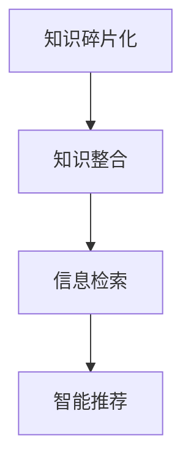

                 

# 知识的碎片化与整合：信息时代的矛盾

在信息时代，知识的碎片化和整合成为了一个重要的议题。随着互联网的发展和数字化进程的加速，人们获取、处理和分享知识的方式发生了翻天覆地的变化。信息的碎片化使得知识变得更加分散、零散，而知识的整合则致力于将零散的知识点系统化、结构化。本文将深入探讨这一矛盾，揭示其中的原理和架构，并提出具体的算法原理与操作步骤，以期为读者提供全面而深刻的见解。

## 1. 背景介绍

### 1.1 问题由来

在过去几十年中，知识的产生和传播方式发生了巨大变化。传统的纸质书籍、报纸、期刊等传统媒介逐渐被电子书、在线文章、博客、社交媒体等数字媒介所取代。这些数字媒介使得知识的获取和传播变得更为便捷、快速，但也导致了知识的碎片化。与此同时，人们面临着如何将这些碎片化知识整合为系统化、结构化的知识体系，以便更好地理解和应用。

### 1.2 问题核心关键点

知识的碎片化与整合，本质上是一个信息处理和知识工程的问题。这一问题涉及多个关键点：

- **知识碎片化**：互联网和社交媒体的兴起，使得信息被分散到不同平台，导致知识点零散、孤立。
- **知识整合**：如何通过算法、技术手段，将零散的知识点组织起来，构建系统化的知识体系。
- **智能推荐**：在知识碎片化的背景下，如何实现智能推荐，帮助用户发现相关知识，整合知识体系。

## 2. 核心概念与联系

### 2.1 核心概念概述

为更好地理解知识的碎片化与整合，本节将介绍几个密切相关的核心概念：

- **知识碎片化**：指在数字化过程中，知识被分散到不同平台、不同媒介，形成孤立的知识点，难以系统化。
- **知识整合**：通过算法、技术手段，将孤立的知识点组织起来，形成结构化的知识体系。
- **信息检索**：通过关键词、相关性匹配等技术手段，帮助用户发现相关知识，提升知识整合效率。
- **智能推荐**：通过机器学习、深度学习等技术，实现基于用户行为和兴趣的个性化知识推荐。

这些核心概念之间的逻辑关系可以通过以下Mermaid流程图来展示：



这个流程图展示出知识碎片化、知识整合、信息检索和智能推荐之间的相互关系。知识碎片化是信息检索和智能推荐的前提，而信息检索和智能推荐则进一步推动了知识的整合。

## 3. 核心算法原理 & 具体操作步骤
### 3.1 算法原理概述

知识碎片化与整合的核心算法原理，主要基于信息检索和知识图谱构建。

- **信息检索**：通过自然语言处理技术，将用户查询转化为机器可理解的查询向量，与知识库中的文档向量进行匹配，返回相关性最高的文档。
- **知识图谱**：构建知识图谱，将孤立的知识点连接起来，形成结构化的知识体系。通过关系抽取、实体识别等技术手段，从大量文本数据中提取实体、关系等信息，构建知识图谱。

### 3.2 算法步骤详解

基于上述原理，知识碎片化与整合的算法步骤如下：

**Step 1: 数据准备**
- 收集大量无标注的文本数据，如维基百科、学术论文、新闻报道等。
- 使用自然语言处理技术对文本进行预处理，如分词、去除停用词、词向量映射等。

**Step 2: 构建知识图谱**
- 使用关系抽取、实体识别等技术手段，从文本中提取实体、关系等信息。
- 构建知识图谱，将提取的实体和关系连接起来，形成结构化的知识体系。

**Step 3: 信息检索**
- 将用户查询转化为查询向量。
- 从知识库中检索与查询向量匹配度最高的文档，返回相关性结果。

**Step 4: 智能推荐**
- 根据用户的行为和兴趣，使用机器学习算法训练推荐模型。
- 将用户查询与推荐模型结合，生成个性化推荐结果。

**Step 5: 反馈与优化**
- 收集用户对推荐结果的反馈，用于优化推荐模型。
- 不断迭代优化，提升推荐效果和用户满意度。

### 3.3 算法优缺点

基于上述原理和操作步骤，知识碎片化与整合的算法具有以下优点和缺点：

**优点**：
- 实现简单，易于理解和使用。
- 可以通过信息检索和智能推荐，快速找到相关知识，提升知识整合效率。

**缺点**：
- 对文本数据的依赖较大，需要大量的高质量数据。
- 知识图谱的构建复杂，需要先进的关系抽取和实体识别技术。
- 推荐模型的训练和优化需要大量用户数据和计算资源。

### 3.4 算法应用领域

知识碎片化与整合的算法主要应用于以下几个领域：

- **知识管理与组织**：帮助企业构建内部知识库，整合员工知识，提高知识共享和协作效率。
- **学术研究和论文发表**：帮助学术机构和研究人员整理和检索相关文献，推动科研进展。
- **智能教育与培训**：帮助教育机构和培训机构组织课程内容和资源，提供个性化学习路径。
- **信息检索与智能推荐**：帮助用户快速找到相关知识，提升信息检索和知识整合效率。

## 4. 数学模型和公式 & 详细讲解 & 举例说明

### 4.1 数学模型构建

知识碎片化与整合的数学模型主要基于向量空间模型(Vector Space Model, VSM)和深度学习模型。

- **向量空间模型**：将文本表示为向量，通过余弦相似度计算文档间的相关性。
- **深度学习模型**：使用神经网络模型，通过多层非线性映射，学习复杂的文本表示。

### 4.2 公式推导过程

以向量空间模型为例，其核心公式为：

$$
\text{cosine similarity}(A, B) = \frac{A \cdot B}{\|A\|\|B\|}
$$

其中，$A$ 和 $B$ 分别为查询向量和文档向量，$\cdot$ 表示点积，$\|A\|$ 和 $\|B\|$ 表示向量 $A$ 和 $B$ 的模长。

### 4.3 案例分析与讲解

以论文检索为例，假设我们有一篇论文 $A$ 和用户查询 $B$。首先将论文 $A$ 和查询 $B$ 分别表示为向量 $A$ 和 $B$，计算它们之间的余弦相似度。根据余弦相似度的大小，返回与查询最相关的论文 $A$。

## 5. 项目实践：代码实例和详细解释说明

### 5.1 开发环境搭建

在进行知识碎片化与整合的项目实践前，我们需要准备好开发环境。以下是使用Python进行TF-IDF开发的环境配置流程：

1. 安装Anaconda：从官网下载并安装Anaconda，用于创建独立的Python环境。

2. 创建并激活虚拟环境：
```bash
conda create -n tfidf-env python=3.8 
conda activate tfidf-env
```

3. 安装相关库：
```bash
pip install tensorflow numpy pandas sklearn
```

4. 安装自然语言处理工具包：
```bash
pip install nltk
```

5. 下载并准备语料库：
```bash
curl -o books_corpus.zip http://mattmahoney.net/dc/text8.zip
unzip books_corpus.zip
```

完成上述步骤后，即可在`tfidf-env`环境中开始项目实践。

### 5.2 源代码详细实现

以下是一个简单的TF-IDF代码实现，用于计算文档之间的相似度。

```python
import numpy as np
from sklearn.feature_extraction.text import TfidfVectorizer

# 准备语料库
with open('text8.txt', 'r') as f:
    texts = f.read().splitlines()

# 计算TF-IDF向量
vectorizer = TfidfVectorizer()
tfidf_matrix = vectorizer.fit_transform(texts)

# 计算余弦相似度
def cosine_similarity(x, y):
    return np.dot(x.toarray(), y.toarray()) / (np.linalg.norm(x.toarray()) * np.linalg.norm(y.toarray()))

# 检索与查询最相关的文档
query = 'machine learning'
query_vec = vectorizer.transform([query])
similarities = [cosine_similarity(query_vec, x) for x in tfidf_matrix]
top_doc = np.argmax(similarities)
print('最相关的文档编号：', top_doc)
```

### 5.3 代码解读与分析

让我们再详细解读一下关键代码的实现细节：

**TF-IDF计算**：
- `TfidfVectorizer` 类用于计算TF-IDF向量。通过调用`fit_transform`方法，将文本数据转化为TF-IDF矩阵。

**余弦相似度计算**：
- `cosine_similarity` 函数用于计算两个向量之间的余弦相似度。通过调用`dot`方法和`linalg.norm`方法计算点积和向量模长，最终得到余弦相似度。

**文档检索**：
- 首先准备查询文本`query`，通过调用`transform`方法将其转化为TF-IDF向量。
- 遍历所有文档向量，计算与查询向量之间的余弦相似度，得到相似度矩阵。
- 选取相似度最高的文档编号，输出结果。

可以看到，TF-IDF和余弦相似度的实现相对简单，但功能强大，可以用于基本的知识检索任务。

### 5.4 运行结果展示

在上述代码中，我们计算了查询`machine learning`与所有文档之间的余弦相似度，并找到了最相关的文档编号。结果展示了如何通过简单的代码实现文档检索功能，为知识整合提供了基础。

## 6. 实际应用场景

### 6.1 智能推荐系统

基于TF-IDF和余弦相似度的知识碎片化与整合技术，已经被广泛应用于智能推荐系统中。推荐系统通过分析用户的历史行为和兴趣，推荐相关的书籍、文章、视频等资源，提升用户体验和满意度。

在技术实现上，推荐系统首先对用户行为数据进行分析和建模，然后使用TF-IDF和余弦相似度计算用户与资源之间的相似度，最终生成个性化推荐列表。这一过程实现了从海量文本数据中快速检索和整合相关知识，为推荐系统的构建提供了基础。

### 6.2 知识图谱构建

知识图谱是知识碎片化与整合的重要应用之一，它通过将孤立的知识点连接起来，形成结构化的知识体系。知识图谱的构建需要大量的文本数据和复杂的自然语言处理技术。

在实践中，可以使用TF-IDF和余弦相似度计算文本之间的相似度，并通过关系抽取和实体识别技术，提取文本中的实体和关系信息。最终构建知识图谱，用于支持搜索引擎、知识发现、智能问答等应用。

### 6.3 学术研究和文献管理

学术研究中的文献管理是一个典型的知识碎片化与整合场景。研究人员需要从大量文献中快速检索到相关论文，进行阅读和引用。传统的手工查找方式效率低下，容易遗漏。

通过使用TF-IDF和余弦相似度，研究人员可以构建学术文献库，快速检索到相关论文，提升科研效率。同时，知识图谱技术可以进一步整合相关论文和作者，形成学术网络，支持科研合作和知识共享。

### 6.4 未来应用展望

随着知识图谱和推荐系统的不断发展，基于知识碎片化与整合的技术将在更多领域得到应用，为各行业带来变革性影响。

在智慧医疗领域，基于知识碎片化与整合的智能推荐系统，可以为医生提供精准的医学文献、研究成果和临床指南，辅助诊疗决策。

在智能教育领域，推荐系统可以个性化推荐学习资源，辅助教师和学生设计课程和作业，提升教育质量。

在智慧城市治理中，知识图谱可以整合各类数据资源，支持智能决策和公共服务优化，提升城市管理水平。

## 7. 工具和资源推荐

### 7.1 学习资源推荐

为了帮助开发者系统掌握知识碎片化与整合的理论基础和实践技巧，这里推荐一些优质的学习资源：

1. 《信息检索与文本挖掘》：经典教材，详细介绍了信息检索和文本挖掘的原理和算法。
2. 《深度学习》：由Ian Goodfellow、Yoshua Bengio、Aaron Courville合著，介绍了深度学习的基本原理和应用。
3. 《自然语言处理综论》：由Christopher D. Manning、Hinrich Schütze合著，系统介绍了自然语言处理的理论和技术。
4. 《Python文本挖掘》：介绍了Python在文本挖掘中的应用，包括TF-IDF、文本分类、情感分析等。
5. 《Kaggle深度学习教程》：由Kaggle平台提供，包含大量深度学习竞赛和项目，适合实战练习。

通过对这些资源的学习实践，相信你一定能够快速掌握知识碎片化与整合的精髓，并用于解决实际的文本数据处理问题。

### 7.2 开发工具推荐

高效的开发离不开优秀的工具支持。以下是几款用于知识碎片化与整合开发的常用工具：

1. TensorFlow：由Google主导开发的深度学习框架，支持分布式训练和优化，适用于大规模应用场景。
2. PyTorch：由Facebook开发的深度学习框架，灵活易用，适用于学术研究和原型开发。
3. Elasticsearch：基于Apache Lucene的开源搜索引擎，支持高效的文本检索和数据存储。
4. Amazon SageMaker：亚马逊提供的云端机器学习平台，提供丰富的算法和工具，支持知识图谱构建和推荐系统开发。
5. IBM Watson：IBM提供的基于知识图谱的智能问答系统，支持自然语言理解和推理。

合理利用这些工具，可以显著提升知识碎片化与整合任务的开发效率，加快创新迭代的步伐。

### 7.3 相关论文推荐

知识碎片化与整合技术的发展源于学界的持续研究。以下是几篇奠基性的相关论文，推荐阅读：

1. "A TextRank Algorithm for Automatic Keyword Extraction" by Rada M. Radev and Ferdinand Saer: 提出了TextRank算法，用于文本摘要和关键词提取。
2. "Latent Semantic Indexing" by Christopher D. Manning and Prabhakar Raghavan: 提出了LSI算法，用于文本的语义相似度计算和信息检索。
3. "Structured Computation Networks" by Daniel Hutter and Daniel Veit: 提出了SCN算法，用于知识图谱的构建和推理。
4. "Neural Machine Translation by Jointly Learning to Align and Translate" by Dzmitry Bahdanau, Kyunghyun Cho, and Yoshua Bengio: 提出了Seq2Seq模型，用于文本翻译和摘要生成。
5. "End-to-End Learning of Information Retrieval" by András Kállay-Gaegy, Zeynep Cem Yildiz, Özgür Tousif Çetin, Umut Artan, and Cem Kang: 提出了端到端的深度学习模型，用于文本检索和推荐。

这些论文代表了大规模知识碎片化与整合技术的发展脉络。通过学习这些前沿成果，可以帮助研究者把握学科前进方向，激发更多的创新灵感。

## 8. 总结：未来发展趋势与挑战

### 8.1 总结

本文对知识碎片化与整合的原理和操作步骤进行了全面系统的介绍。首先阐述了知识碎片化和整合的基本概念，明确了信息检索和知识图谱构建在其中的关键作用。其次，从原理到实践，详细讲解了基于TF-IDF和余弦相似度的数学模型和算法步骤，给出了完整的代码实例。同时，本文还广泛探讨了知识碎片化与整合在智能推荐、知识图谱、学术研究和文献管理等诸多领域的应用前景，展示了这一技术的广阔应用空间。最后，本文精选了相关学习资源、开发工具和经典论文，力求为读者提供全方位的技术指引。

通过本文的系统梳理，可以看到，知识碎片化与整合技术在信息时代发挥着至关重要的作用，为知识检索、信息管理、推荐系统等诸多领域提供了强有力的技术支持。未来，伴随自然语言处理和深度学习技术的不断发展，知识碎片化与整合技术必将在更多的应用场景中发挥重要作用，推动各行业的数字化转型升级。

### 8.2 未来发展趋势

展望未来，知识碎片化与整合技术将呈现以下几个发展趋势：

1. **深度学习的应用加深**：深度学习在知识图谱和推荐系统中的应用将更加广泛，提升系统的智能性和准确性。
2. **知识图谱的普及**：随着知识图谱构建技术的成熟，越来越多的领域将采用知识图谱来管理和整合知识，提升信息检索和推荐的效果。
3. **跨领域融合**：知识碎片化与整合技术将与其他人工智能技术进行更深入的融合，如因果推理、自然语言理解等，推动知识整合和信息检索的全面发展。
4. **隐私保护和安全性**：在知识图谱和推荐系统中，用户隐私和数据安全问题将受到更多重视，相关技术将不断发展，保障用户权益。
5. **分布式和云计算**：分布式计算和云计算技术将为大规模知识图谱和推荐系统的构建提供强有力的技术支持，提升系统的可扩展性和稳定性。

### 8.3 面临的挑战

尽管知识碎片化与整合技术已经取得了瞩目成就，但在迈向更加智能化、普适化应用的过程中，它仍面临着诸多挑战：

1. **数据质量问题**：知识图谱和推荐系统的构建需要大量的高质量数据，数据质量问题可能会影响系统的准确性和可靠性。
2. **模型复杂性**：深度学习模型虽然性能优越，但模型的复杂性也带来了训练和部署的困难。如何平衡模型性能和效率，是一个重要的研究方向。
3. **隐私和安全**：在知识图谱和推荐系统中，用户隐私和数据安全问题需要得到更多的关注和保护。
4. **跨领域通用性**：知识图谱和推荐系统在不同领域的应用中，通用性问题仍然是一个挑战，需要进一步探索和研究。
5. **计算资源需求**：知识图谱和推荐系统的构建和维护需要大量的计算资源，如何降低资源消耗，提高效率，是一个重要课题。

### 8.4 研究展望

面对知识碎片化与整合技术所面临的挑战，未来的研究需要在以下几个方面寻求新的突破：

1. **多模态融合**：将文本、图像、语音等多模态数据进行整合，构建更加全面和丰富的知识图谱。
2. **知识图谱演化**：研究知识图谱的演化机制，使其能够动态更新和维护，保持知识的时效性和准确性。
3. **跨领域通用算法**：研究跨领域通用的知识表示和推理算法，提升知识图谱的通用性和可扩展性。
4. **隐私保护和安全性**：研究隐私保护和安全性技术，确保用户数据和隐私的安全性。
5. **分布式计算**：研究分布式计算技术，支持大规模知识图谱和推荐系统的构建和维护。

这些研究方向的探索，必将引领知识碎片化与整合技术迈向更高的台阶，为构建安全、可靠、可解释、可控的智能系统铺平道路。面向未来，知识碎片化与整合技术还需要与其他人工智能技术进行更深入的融合，如知识表示、因果推理、强化学习等，多路径协同发力，共同推动知识整合和信息检索系统的进步。只有勇于创新、敢于突破，才能不断拓展知识图谱和推荐系统的边界，让智能技术更好地服务于人类社会。

## 9. 附录：常见问题与解答

**Q1: 知识图谱的构建需要哪些步骤?**

A: 知识图谱的构建主要包括以下步骤：
1. 数据收集：收集结构化或非结构化的数据，如文献、新闻、社交媒体等。
2. 数据预处理：对数据进行清洗、归一化、标注等预处理操作。
3. 实体识别：使用NLP技术识别文本中的实体，如人名、地名、机构名等。
4. 关系抽取：从文本中抽取实体之间的关系，如"作者写书"、"城市位于国家"等。
5. 知识图谱构建：将提取的实体和关系构建为知识图谱，形成结构化的知识体系。

**Q2: 如何优化推荐系统中的TF-IDF计算?**

A: 优化推荐系统中的TF-IDF计算，可以采取以下措施：
1. 特征选择：选择最具代表性的特征进行计算，避免计算无关特征的权重。
2. 数据预处理：对数据进行清洗、去噪、归一化等预处理操作，提升计算效果。
3. 分布式计算：使用分布式计算技术，如Hadoop、Spark等，提高计算效率。
4. 缓存机制：利用缓存机制，避免重复计算，提升系统性能。

**Q3: 在知识图谱中如何处理实体和关系的标注?**

A: 在知识图谱中处理实体和关系的标注，可以采取以下措施：
1. 使用开源工具：使用开源工具如Provenance、RDF4J等，进行实体和关系的标注。
2. 人工标注：在数据量较小或标注质量要求较高的情况下，可以采用人工标注的方式。
3. 半自动标注：结合人工标注和自动标注，提升标注效率和质量。

**Q4: 在推荐系统中如何应用知识图谱?**

A: 在推荐系统中应用知识图谱，可以采取以下措施：
1. 实体匹配：通过匹配用户行为和兴趣实体，推荐相关资源。
2. 关系推理：利用知识图谱中的关系，推断用户可能感兴趣的其他实体或资源。
3. 知识增强：在推荐算法中加入知识图谱信息，提升推荐效果。

这些措施可以提升推荐系统的智能性和准确性，为知识图谱在推荐系统中的应用提供支持。

---

作者：禅与计算机程序设计艺术 / Zen and the Art of Computer Programming

