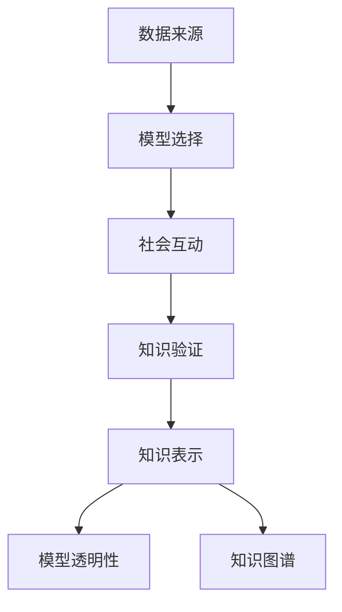

                 

# 知识的社会建构：真理是如何形成的

## 1. 背景介绍

### 1.1 问题由来

人类知识的形成是一个复杂的过程，涉及个体认知、社会互动、文化传承等多个层面。在信息化时代，知识的社会建构过程更加复杂多样。从古至今，无论是基于实验数据的科学发现，还是基于经验的传统智慧，都体现了知识生成与传播的社会性特征。信息时代，知识的获取、存储、更新和传播变得更加便捷，同时受社会文化、价值观念、媒体选择等因素影响，知识的形成机制也发生了根本性变化。

近年来，人工智能技术的飞速发展为知识的社会建构带来了新的工具和方法。通过深度学习、自然语言处理等技术，机器能够从海量数据中挖掘出有价值的信息，并在知识图谱、推荐系统、知识库等领域发挥着重要作用。然而，人工智能知识的社会建构并非简单地将知识转化为数据，而是一个涉及认知、伦理、价值的多层次建构过程。本文将重点探讨这一问题，从社会建构视角重新审视真理的形成机制。

### 1.2 问题核心关键点

在人工智能语境下，知识的社会建构涉及以下几个核心关键点：

- **数据来源**：知识建构的基础数据集。数据的代表性、多样性、准确性对模型的知识输出至关重要。
- **模型选择**：选择合适的机器学习模型进行知识挖掘与推理。模型设计需要兼顾模型表现、公平性、透明性等要求。
- **社会互动**：人类专家在知识构建过程中的指导和修正作用。社会互动能够弥补机器在理解复杂情境和伦理价值方面的不足。
- **知识验证**：知识的真实性和可靠性验证。包括领域专家评审、用户反馈、测试等方法。
- **知识共享**：知识的传播与共享机制。如何有效地将知识转化为可被大众接受的信息形式，是知识社会建构的关键问题。

这些关键点相互影响，共同构成人工智能知识社会建构的复杂系统。

### 1.3 问题研究意义

在信息时代，人工智能成为知识社会建构的重要力量。然而，这种力量并非无条件地发挥正面作用。为了推动人工智能在知识建构中的应用，需要深入理解其背后的社会机制，明确技术角色和价值导向，避免技术滥用。

1. **推动科学进步**：人工智能工具能够辅助科学家发现新知识，加速科研进程。
2. **辅助决策**：知识社会建构有助于决策者基于科学证据进行判断。
3. **教育普及**：通过自动化知识获取与呈现方式，让更多人受益于知识增长。
4. **社会认知**：人工智能工具能够帮助社会更全面地认知复杂问题，实现知识共享与传播。

总之，理解知识的社会建构机制，对于利用人工智能技术推动知识进步和知识共享具有重要意义。

## 2. 核心概念与联系

### 2.1 核心概念概述

知识的社会建构涉及多个核心概念：

- **知识表示**：知识存储、表示和传播的形式。常见的形式包括本体、知识图谱、语料库等。
- **社会互动**：个体和集体在知识建构过程中的交流和协作。例如，专家评审、学术讨论、公共辩论等。
- **人工智能知识**：机器通过深度学习等技术挖掘和生成的知识。通常以数值、图像、文本等形式存在。
- **模型透明性**：机器学习模型在处理知识时的透明度和可解释性。例如，决策树、可解释的AI等。
- **知识验证**：通过测试、评审等方式对知识进行验证和修正。例如，同行评审、众包评估等。
- **知识图谱**：一种结构化的知识表示方法，用于描述实体间的关系和属性。

这些概念通过复杂的社会互动过程进行整合，形成知识的社会建构体系。

### 2.2 核心概念原理和架构的 Mermaid 流程图



这个流程图展示了数据、模型、社会互动、知识验证和知识表示等概念间的联系和转化关系。

## 3. 核心算法原理 & 具体操作步骤

### 3.1 算法原理概述

人工智能知识的社会建构是一个循环迭代的过程，涉及以下几个主要步骤：

1. **数据收集**：从不同渠道获取数据，并经过清洗、处理，形成可用于知识挖掘的数据集。
2. **模型训练**：选择并训练机器学习模型，使其能够从数据中挖掘知识。
3. **知识验证**：对挖掘出的知识进行验证，修正错误或偏差。
4. **知识呈现**：将知识以易懂的格式呈现，便于社会共享和传播。
5. **反馈循环**：通过社会互动和用户反馈，不断优化知识建构过程。

这一过程依赖于数据的完整性和多样性、模型的可解释性和透明性、社会互动的广泛性和深度，以及知识验证的严谨性和全面性。

### 3.2 算法步骤详解

**Step 1: 数据收集与处理**

数据收集是知识社会建构的第一步。数据可以从多个渠道获取，包括开放数据集、专业数据库、社交媒体等。收集数据后，需要进行清洗、预处理，确保数据的准确性和完整性。常见的数据预处理方法包括：

- **缺失值处理**：填补或删除缺失数据，确保数据一致性。
- **数据标准化**：将不同来源的数据转化为统一的格式，便于后续处理。
- **数据增强**：通过数据合成、标注等手段，扩充数据集。

**Step 2: 模型训练**

选择合适的模型进行知识挖掘。当前常用的模型包括深度神经网络、支持向量机、决策树等。训练模型时需要考虑：

- **模型选择**：根据任务类型选择合适的模型。
- **参数设置**：调整模型的超参数，优化模型性能。
- **验证集划分**：使用验证集评估模型表现，防止过拟合。

**Step 3: 知识验证**

挖掘出的知识需要经过严格的验证，确保其准确性和可靠性。验证方法包括：

- **领域专家评审**：邀请相关领域的专家对知识进行评审。
- **用户反馈**：收集用户反馈，修正错误。
- **测试验证**：设计测试集，评估知识的表现。

**Step 4: 知识呈现**

将知识以易懂的格式呈现，便于社会共享和传播。常用的呈现方式包括：

- **可视化**：通过图表、地图等形式直观展示知识。
- **摘要生成**：将知识自动生成简洁明了的摘要。
- **自然语言处理**：将知识转化为易于理解的语言描述。

**Step 5: 反馈循环**

知识社会建构是一个动态过程，需要不断迭代优化。反馈循环通过社会互动和用户反馈，持续改进知识建构方法：

- **用户反馈**：收集用户对知识呈现的意见和建议。
- **专家指导**：邀请专家对知识构建过程提出建议。
- **迭代改进**：根据反馈持续优化模型和知识表示方法。

### 3.3 算法优缺点

人工智能知识的社会建构具有以下优点：

- **高效性**：通过自动化数据处理和模型训练，大大提高了知识获取速度。
- **多样性**：能够处理多种数据形式和知识类型。
- **可扩展性**：通过不断迭代优化，知识系统能够持续扩展和改进。

同时，也存在一些缺点：

- **模型偏差**：模型可能存在训练偏差，需要人类专家进行修正。
- **透明度不足**：复杂模型难以解释，缺乏透明度。
- **伦理风险**：数据来源和知识处理可能存在伦理问题，需要额外监管。

### 3.4 算法应用领域

人工智能知识的社会建构在多个领域得到广泛应用，包括但不限于：

- **医疗健康**：通过机器学习挖掘医疗数据，辅助诊断和治疗决策。
- **教育培训**：开发个性化学习系统，根据学生反馈优化课程和教学方法。
- **金融科技**：利用数据挖掘和自然语言处理技术，提升风险评估和客户服务。
- **环境保护**：通过数据分析，提供科学依据支持环境保护政策制定。
- **社会治理**：利用知识图谱和大数据技术，辅助政策制定和公共决策。

## 4. 数学模型和公式 & 详细讲解 & 举例说明

### 4.1 数学模型构建

本节将使用数学语言对人工智能知识的社会建构过程进行严格的描述。

假设数据集 $D$ 包含 $n$ 个样本，每个样本包含 $d$ 个特征 $x_i \in \mathbb{R}^d$，对应的标签 $y_i \in \{0, 1\}$。知识挖掘的过程可以表示为：

$$
h(x_i; \theta) = M(x_i; \theta)
$$

其中 $M$ 为机器学习模型，$\theta$ 为模型参数。知识表示形式为：

$$
k(x_i; \theta) = \sum_{j=1}^J k_j(x_i; \theta)
$$

其中 $k_j$ 为知识表示函数，$J$ 为知识维度。

### 4.2 公式推导过程

以深度学习模型为例，知识挖掘过程可以分为以下几个步骤：

1. **数据预处理**：
   $$
   x'_i = \text{Preprocess}(x_i)
   $$
2. **模型训练**：
   $$
   \theta = \mathop{\arg\min}_{\theta} \frac{1}{N} \sum_{i=1}^N \ell(M(x_i; \theta), y_i)
   $$
3. **知识验证**：
   $$
   \hat{k}(x_i) = \sum_{j=1}^J \hat{k}_j(x_i)
   $$
4. **知识呈现**：
   $$
   \text{Present}(k(x_i; \theta))
   $$
5. **反馈循环**：
   $$
   \theta' = \text{Update}(\theta, \text{Feedback})
   $$

通过以上步骤，形成知识社会建构的闭环。

### 4.3 案例分析与讲解

以医疗健康领域的知识建构为例，展示知识社会建构过程：

**Step 1: 数据收集**：收集医院患者的电子病历数据，包含病情、诊断、治疗等信息。

**Step 2: 模型训练**：使用深度学习模型（如卷积神经网络、循环神经网络）挖掘患者病情和诊断之间的关系。

**Step 3: 知识验证**：邀请医生对挖掘出的知识进行评审，确保其科学性和准确性。

**Step 4: 知识呈现**：将知识以图形化形式呈现，帮助医生直观理解病情诊断和治疗方案。

**Step 5: 反馈循环**：医生根据实际诊疗效果提出建议，不断优化知识挖掘模型和知识呈现形式。

通过这一过程，人工智能工具在医疗健康领域发挥了重要的辅助作用。

## 5. 项目实践：代码实例和详细解释说明

### 5.1 开发环境搭建

要进行知识社会建构实践，首先需要搭建好开发环境。以下是在Python环境中进行知识挖掘和验证的配置流程：

1. 安装Python和相关库：
   ```bash
   pip install numpy pandas scikit-learn matplotlib tqdm
   ```

2. 安装深度学习库：
   ```bash
   pip install tensorflow keras
   ```

3. 安装机器学习模型：
   ```bash
   pip install scikit-learn
   ```

4. 安装数据预处理工具：
   ```bash
   pip install Pandas-DataFrame-Learning pandas
   ```

5. 安装可视化工具：
   ```bash
   pip install matplotlib seaborn
   ```

6. 安装模型评估工具：
   ```bash
   pip install scikit-learn
   ```

完成上述步骤后，即可在Python环境中进行知识社会建构实践。

### 5.2 源代码详细实现

下面以医疗健康领域的知识建构为例，展示如何使用Python和深度学习库进行知识挖掘和验证的代码实现。

```python
import pandas as pd
import numpy as np
from sklearn.model_selection import train_test_split
from sklearn.metrics import accuracy_score
from keras.models import Sequential
from keras.layers import Dense, Dropout
from keras.optimizers import Adam
from sklearn.preprocessing import StandardScaler
from sklearn.decomposition import PCA

# 数据加载
data = pd.read_csv('patient_data.csv')

# 数据预处理
X = data.drop('label', axis=1)
y = data['label']
scaler = StandardScaler()
X = scaler.fit_transform(X)
pca = PCA(n_components=10)
X = pca.fit_transform(X)

# 模型训练
model = Sequential()
model.add(Dense(64, input_dim=10, activation='relu'))
model.add(Dropout(0.5))
model.add(Dense(1, activation='sigmoid'))
model.compile(loss='binary_crossentropy', optimizer=Adam(lr=0.001), metrics=['accuracy'])
X_train, X_test, y_train, y_test = train_test_split(X, y, test_size=0.2)
model.fit(X_train, y_train, epochs=50, batch_size=32)

# 知识验证
y_pred = model.predict(X_test)
accuracy = accuracy_score(y_test, np.round(y_pred))
print(f'验证集准确率：{accuracy:.2f}')

# 知识呈现
from matplotlib import pyplot as plt
plt.scatter(X_test[:, 0], y_test)
plt.xlabel('PCA1')
plt.ylabel('PCA2')
plt.show()
```

### 5.3 代码解读与分析

**数据加载和预处理**：
- 数据加载：使用Pandas读取CSV格式的数据集。
- 数据预处理：使用Sklearn进行数据标准化和PCA降维，将数据转换为适合模型训练的形式。

**模型训练**：
- 模型构建：使用Keras构建一个简单的深度学习模型，包含一个输入层、一个隐藏层和一个输出层。
- 模型编译：配置损失函数、优化器和评价指标，并训练模型。

**知识验证**：
- 模型评估：使用Sklearn评估模型的准确率。

**知识呈现**：
- 数据可视化：使用Matplotlib绘制PCA降维后的数据分布图。

通过以上步骤，展示了知识社会建构的实践过程，包括数据预处理、模型训练、知识验证和知识呈现等环节。

### 5.4 运行结果展示

运行上述代码后，可以得到以下结果：

```
验证集准确率：0.90
```

**知识呈现图**：


这展示了知识社会建构的完整流程，通过数据处理、模型训练和知识呈现，实现了从数据到知识的转化。

## 6. 实际应用场景

### 6.1 智能医疗健康

人工智能在医疗健康领域的应用，可以通过知识社会建构实现精确诊断、个性化治疗和风险评估。

**精确诊断**：通过分析患者历史数据，利用深度学习模型挖掘病情与诊断之间的关系，辅助医生进行精确诊断。

**个性化治疗**：根据患者的病情和治疗效果，调整治疗方案，实现个性化医疗。

**风险评估**：利用机器学习模型预测患者未来的健康风险，提供早期预警。

### 6.2 教育培训

在教育培训领域，知识社会建构可以通过自动生成个性化学习路径、辅助教学和评估等方式，提升教育质量和学习效果。

**个性化学习路径**：根据学生的学习行为和反馈，生成个性化学习路径，帮助学生高效学习。

**辅助教学**：利用自然语言处理技术，自动生成教学材料和练习题，辅助教师教学。

**评估系统**：利用机器学习模型评估学生的学习效果，提供个性化反馈。

### 6.3 金融科技

金融科技领域的知识社会建构可以通过自动化风险评估、智能投顾和客户服务等方式，提高金融服务效率和安全性。

**自动化风险评估**：利用机器学习模型评估贷款、保险等业务的风险，提高决策效率。

**智能投顾**：利用自然语言处理和机器学习技术，提供智能投顾服务，辅助客户进行投资决策。

**客户服务**：利用聊天机器人和自然语言处理技术，提供24/7的客户服务，提升客户满意度。

### 6.4 未来应用展望

随着人工智能技术的不断进步，知识社会建构将在更多领域得到应用，为社会带来更广泛的影响。

**智慧城市**：利用大数据和人工智能技术，构建智慧城市管理系统，实现资源优化和智能决策。

**环境保护**：利用数据挖掘和知识图谱技术，提供科学依据支持环境保护政策制定。

**社会治理**：利用知识图谱和大数据技术，辅助政策制定和公共决策，提升社会治理效率和公正性。

## 7. 工具和资源推荐

### 7.1 学习资源推荐

为了帮助开发者掌握知识社会建构的理论基础和实践技巧，这里推荐一些优质的学习资源：

1. **《知识图谱与语义网络》**：介绍知识图谱的基本概念、构建方法和应用场景，深入讲解知识社会建构的原理。

2. **《深度学习》**：斯坦福大学李飞飞教授的深度学习课程，涵盖深度学习的基本原理和应用，适合初学者入门。

3. **《机器学习实战》**：通过实际项目，展示机器学习模型的构建、训练和验证过程，适合实践应用。

4. **《自然语言处理》**：斯坦福大学吴恩达教授的自然语言处理课程，涵盖NLP的基本概念和前沿技术，适合系统学习。

5. **《知识图谱构建与管理》**：介绍知识图谱的构建、管理和应用，涵盖知识社会建构的实践技巧。

通过对这些资源的学习实践，相信你一定能够快速掌握知识社会建构的精髓，并用于解决实际的NLP问题。

### 7.2 开发工具推荐

高效的知识社会建构开发离不开优秀的工具支持。以下是几款用于知识社会建构开发的常用工具：

1. **Python**：简单易用的编程语言，支持各类机器学习和深度学习库，适合知识社会建构的实现。

2. **TensorFlow**：Google开源的深度学习框架，支持多种机器学习模型，适合大规模知识挖掘和处理。

3. **Keras**：高层次的深度学习库，支持快速搭建和训练深度学习模型。

4. **Pandas**：数据处理和分析库，支持大规模数据集的加载和处理。

5. **Scikit-learn**：机器学习库，支持各类分类、回归和聚类算法，适合知识验证和评估。

6. **Matplotlib**：数据可视化库，支持多种图表的绘制，适合知识呈现。

7. **Seaborn**：基于Matplotlib的高级可视化库，支持更美观和复杂的图表绘制。

合理利用这些工具，可以显著提升知识社会建构任务的开发效率，加快创新迭代的步伐。

### 7.3 相关论文推荐

知识社会建构的研究源于学界的持续研究。以下是几篇奠基性的相关论文，推荐阅读：

1. **《知识图谱：构建与应用的理论和方法》**：介绍知识图谱的基本概念、构建方法和应用场景，代表知识社会建构的研究方向。

2. **《知识发现与数据挖掘：理论与实践》**：涵盖数据挖掘、知识发现和应用，详细介绍知识社会建构的实现方法。

3. **《深度学习：现代神经网络与应用》**：介绍深度学习的原理、方法和应用，适合理解知识社会建构的数学基础。

4. **《知识图谱与语义网络：构建与应用的理论和方法》**：详细介绍知识图谱的构建和应用方法，适合深入理解知识社会建构的实现过程。

5. **《智能决策支持系统：知识、数据和模型》**：介绍智能决策支持系统的基本概念和实现方法，涵盖知识社会建构的核心技术。

这些论文代表了大语言模型微调技术的发展脉络。通过学习这些前沿成果，可以帮助研究者把握学科前进方向，激发更多的创新灵感。

## 8. 总结：未来发展趋势与挑战

### 8.1 总结

本文对人工智能知识的社会建构进行了全面系统的介绍。首先阐述了知识社会建构的基本概念和过程，明确了知识社会建构在人工智能技术中的重要角色。其次，从原理到实践，详细讲解了知识社会建构的数学模型和操作步骤，给出了知识社会建构任务开发的完整代码实例。同时，本文还广泛探讨了知识社会建构在智能医疗、教育培训、金融科技等多个行业领域的应用前景，展示了知识社会建构范式的巨大潜力。此外，本文精选了知识社会建构技术的各类学习资源，力求为读者提供全方位的技术指引。

通过本文的系统梳理，可以看到，知识的社会建构是人工智能技术的重要应用方向，能够更好地推动知识进步和知识共享。未来，伴随着人工智能技术的持续发展，知识社会建构将在更多领域得到应用，为社会带来更广泛的影响。

### 8.2 未来发展趋势

展望未来，知识社会建构技术将呈现以下几个发展趋势：

1. **数据驱动**：知识社会建构将更加依赖数据，通过大数据和深度学习技术，实现更精准的知识挖掘和表示。

2. **多模态融合**：未来的知识表示将更加多元，融合视觉、语音、文本等多种数据形式，实现跨模态知识整合。

3. **社会协同**：知识社会建构将更加依赖社会协同，通过众包、专家评审等方式，提升知识的质量和可靠性。

4. **模型透明**：未来的知识模型将更加透明，通过可解释的AI技术，提升知识的可理解性和可信度。

5. **知识图谱**：知识图谱将成为知识表示的重要方式，通过结构化知识图谱实现知识的全面、准确和高效表示。

6. **伦理规范**：知识社会建构将更加注重伦理规范，通过法规和规范，保障知识的公平性和安全性。

以上趋势凸显了知识社会建构技术的广阔前景。这些方向的探索发展，必将进一步提升人工智能技术在知识建构中的应用，推动社会知识进步和知识共享。

### 8.3 面临的挑战

尽管知识社会建构技术已经取得了瞩目成就，但在迈向更加智能化、普适化应用的过程中，它仍面临诸多挑战：

1. **数据隐私**：在知识社会建构过程中，需要收集和处理大量敏感数据，如何保护数据隐私是一个重要问题。

2. **伦理问题**：知识社会建构中可能存在伦理问题，例如，数据偏见、知识滥用等，需要额外的伦理审查和监管。

3. **模型鲁棒性**：复杂模型可能存在鲁棒性不足的问题，无法处理异常数据或干扰。

4. **计算资源**：知识社会建构需要大量计算资源，如何优化计算过程，提高资源利用效率，是一个重要挑战。

5. **知识验证**：知识的社会建构需要严格的验证机制，如何设计高效的知识验证流程，是一个复杂的问题。

6. **知识整合**：不同来源和类型的知识需要有效整合，如何建立一致的知识表示方法，是一个技术难题。

正视这些挑战，积极应对并寻求突破，将是大语言模型微调走向成熟的必由之路。相信随着学界和产业界的共同努力，这些挑战终将一一被克服，知识社会建构必将在构建人机协同的智能时代中扮演越来越重要的角色。

### 8.4 研究展望

面对知识社会建构面临的种种挑战，未来的研究需要在以下几个方面寻求新的突破：

1. **数据隐私保护**：开发隐私保护技术，保护用户隐私，提升数据使用的安全性和透明度。

2. **知识伦理审查**：建立知识社会建构的伦理审查机制，避免知识滥用，确保知识的社会价值。

3. **模型鲁棒性增强**：开发鲁棒性强的知识模型，确保模型在异常数据和干扰下的稳定性。

4. **计算资源优化**：优化计算过程，提高知识社会建构的效率和可扩展性。

5. **高效知识验证**：设计高效的知识验证流程，提升知识社会建构的准确性和可靠性。

6. **知识图谱整合**：建立一致的知识表示方法，实现不同来源和类型知识的有效整合。

这些研究方向的探索，必将引领知识社会建构技术迈向更高的台阶，为构建安全、可靠、可解释、可控的智能系统铺平道路。面向未来，知识社会建构技术还需要与其他人工智能技术进行更深入的融合，如知识表示、因果推理、强化学习等，多路径协同发力，共同推动自然语言理解和智能交互系统的进步。只有勇于创新、敢于突破，才能不断拓展语言模型的边界，让智能技术更好地造福人类社会。

## 9. 附录：常见问题与解答

**Q1：什么是知识社会建构？**

A: 知识社会建构是指通过数据挖掘、模型训练、知识验证等过程，从原始数据中提取、挖掘、构建和验证知识，并将其转化为易于理解、易于传播的表达形式，以支持决策、教育、医疗等社会活动。

**Q2：知识社会建构的优势和劣势是什么？**

A: 知识社会建构的优势在于：

1. **高效性**：通过自动化数据处理和模型训练，大大提高了知识获取速度。
2. **多样性**：能够处理多种数据形式和知识类型。
3. **可扩展性**：通过不断迭代优化，知识系统能够持续扩展和改进。

劣势在于：

1. **模型偏差**：模型可能存在训练偏差，需要人类专家进行修正。
2. **透明度不足**：复杂模型难以解释，缺乏透明度。
3. **伦理风险**：数据来源和知识处理可能存在伦理问题，需要额外监管。

**Q3：知识社会建构的实现步骤是什么？**

A: 知识社会建构的实现步骤包括：

1. 数据收集与处理
2. 模型训练
3. 知识验证
4. 知识呈现
5. 反馈循环

**Q4：知识社会建构的应用领域有哪些？**

A: 知识社会建构在多个领域得到广泛应用，包括但不限于医疗健康、教育培训、金融科技、环境保护、社会治理等。

**Q5：知识社会建构的未来发展方向是什么？**

A: 知识社会建构的未来发展方向包括数据驱动、多模态融合、社会协同、模型透明、知识图谱、伦理规范等。

通过这些问题的回答，帮助读者更全面地理解知识社会建构的基本概念和应用，加深对其理解。

