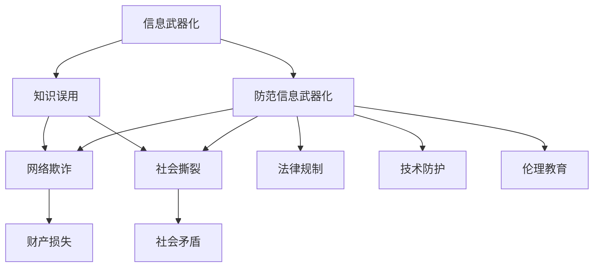

                 

# 知识的误用：防范信息武器化的策略

在当今信息时代，知识的传播和应用已经无所不在。然而，知识的误用却是一个被严重忽视的问题。尤其是在信息技术领域，知识可能被滥用为信息武器，对国家安全、社会稳定和个人隐私构成巨大威胁。本文将从防范信息武器化的视角，深入探讨知识的误用问题，并提出有效的策略来减少其负面影响。

## 1. 背景介绍

### 1.1 问题由来
随着互联网的普及和信息技术的快速发展，知识的获取和传播变得前所未有的便捷。然而，这些知识在被传播和应用的过程中，被恶意利用，导致信息战争、网络欺诈、社会撕裂等一系列严重后果。

例如，在网络空间中，恶意软件和钓鱼网站利用人们对知识的不完整理解，进行诈骗和攻击；在政治领域，假新闻和谣言通过特定知识点的误导性传播，破坏社会秩序，影响公众判断。

### 1.2 问题核心关键点
知识误用的核心在于信息的错误传递和误导。知识作为信息的一种，其传播依赖于正确的理解和解释。一旦知识被曲解或错误传播，其危害将成倍放大。

目前，知识误用的主要表现形式包括：
1. **信息战**：通过传播虚假信息、谣言、假新闻等方式，破坏敌方信息系统和民众信任，达到“不战而屈人之兵”的效果。
2. **网络欺诈**：利用人们对于金融、健康等知识点的误解，进行网络诈骗，导致财产损失。
3. **社会撕裂**：通过传播具有强烈偏见的知识，激发社会对立和矛盾，影响社会稳定。

## 2. 核心概念与联系

### 2.1 核心概念概述

为更好地理解防范信息武器化的策略，本节将介绍几个关键概念及其之间的联系：

- **信息武器化（Information Weaponization）**：指将知识或信息用于破坏敌对国家的信息系统、社会稳定和公共安全的行为。其核心在于利用信息传播的特性，进行定向攻击和误导。

- **知识误用（Knowledge Misuse）**：指在信息传播过程中，由于错误理解、曲解或故意误导，导致知识传播的结果与初衷相悖，产生负面影响的行为。知识误用的表现形式多种多样，如假新闻、谣言、虚假广告等。

- **防范信息武器化（Preventing Information Weaponization）**：指通过技术、法律、伦理等多种手段，预防和减少信息武器化的行为，保护国家安全、社会稳定和公共利益。

这些概念之间的逻辑关系可以通过以下Mermaid流程图来展示：



这个流程图展示了信息武器化与知识误用之间的联系，以及防范信息武器化的多维手段。

## 3. 核心算法原理 & 具体操作步骤
### 3.1 算法原理概述

防范信息武器化的关键在于减少知识误用的发生。这需要从知识传播的源头上入手，对知识的获取、传播和应用进行全面监管。具体而言，可以采用以下策略：

1. **知识源头的真实性验证**：确保知识传播者具有可靠的信息来源，避免虚假信息的产生。
2. **知识传播的透明性**：在知识传播的过程中，确保传播渠道和内容的透明，防止信息的曲解和误导。
3. **知识应用的正确性**：在使用知识进行决策和行动时，确保知识应用的正确性和逻辑性，避免误导行为的发生。

### 3.2 算法步骤详解

防范信息武器化的具体操作步骤可以概括为以下步骤：

1. **知识源头的真实性验证**：
   - 对知识传播者进行身份验证，确保其来源可靠。
   - 对知识内容进行事实核查，确认其真实性。
   - 建立知识传播的溯源机制，确保每一段知识的来源可追溯。

2. **知识传播的透明性**：
   - 在知识传播的每一个环节，确保信息传播的透明度。
   - 引入区块链技术，确保信息的不可篡改性和可追溯性。
   - 建立信息传播的监控机制，及时发现和纠正虚假信息。

3. **知识应用的正确性**：
   - 在使用知识进行决策和行动前，进行逻辑验证和风险评估。
   - 建立知识应用的审核机制，确保知识应用的合理性和合规性。
   - 引入多方参与的决策机制，防止单方面误导。

### 3.3 算法优缺点

防范信息武器化的方法具有以下优点：
1. 能够从源头减少虚假信息的产生，提升信息传播的真实性和可信度。
2. 通过区块链等技术，确保信息的透明性和可追溯性，提高信息传播的可靠性和权威性。
3. 引入多方参与的决策机制，提高决策的合理性和公正性，减少误导行为的发生。

同时，该方法也存在一定的局限性：
1. 实施成本较高，需要对知识传播的每一个环节进行严格的监管。
2. 对技术手段的依赖较大，需要引入先进的区块链等技术。
3. 难以应对大规模、复杂的信息传播场景。

尽管存在这些局限性，但防范信息武器化仍是大数据时代信息安全的重要手段，其有效性和必要性不容忽视。

### 3.4 算法应用领域

防范信息武器化的方法主要应用于以下几个领域：

1. **网络安全**：通过验证知识源头的真实性和传播的透明性，防止网络攻击和诈骗。
2. **公共信息传播**：在政府和公共机构的信息传播过程中，确保信息的真实性和透明性。
3. **社会稳定**：在社会舆论和公共事件的传播中，确保信息的准确性和公正性，防止社会撕裂和矛盾激化。

这些领域的需求使得防范信息武器化的方法具有广泛的应用前景，将在未来的信息社会中发挥重要作用。

## 4. 数学模型和公式 & 详细讲解 & 举例说明

### 4.1 数学模型构建

为了防止知识误用，可以建立一个数学模型，对知识传播的每一个环节进行评估和验证。设知识传播过程中涉及的知识量为 $K$，其真实性为 $R(K)$，透明性为 $T(K)$，正确性为 $C(K)$。则防范信息武器化的目标函数为：

$$
\minimize_{K} R(K) + T(K) + C(K)
$$

其中 $R(K)$、$T(K)$ 和 $C(K)$ 分别表示知识的真实性、透明性和正确性。

### 4.2 公式推导过程

为了简化问题，假设知识传播过程中只涉及两个环节，即知识源和知识接收者。知识源的真实性 $R_s$ 和透明性 $T_s$ 可以通过以下公式计算：

$$
R_s = \frac{1}{n} \sum_{i=1}^n \text{验证结果}_i
$$

$$
T_s = \frac{1}{m} \sum_{j=1}^m \text{传播链路}_j
$$

其中 $n$ 为知识源提供的知识量，$m$ 为知识传播的链路数量。

知识接收者的真实性 $R_r$ 和透明性 $T_r$ 可以通过以下公式计算：

$$
R_r = \frac{1}{n} \sum_{i=1}^n \text{验证结果}_i
$$

$$
T_r = \frac{1}{m} \sum_{j=1}^m \text{传播链路}_j
$$

### 4.3 案例分析与讲解

假设有一个关于新冠病毒的治疗方法的帖子在社交媒体上传播。我们需要评估该帖子的真实性、透明性和正确性。

1. **真实性评估**：
   - 首先，我们需要对帖子中的每一个主张进行事实核查。
   - 然后，汇总所有验证结果，计算出帖子的整体真实性。
   - 如果大多数主张被验证为真实，则该帖子的真实性较高。

2. **透明性评估**：
   - 我们需要检查帖子的传播链路，确认其来源和传播路径。
   - 如果帖子能够追溯到一个权威的、可靠的来源，则其透明性较高。
   - 如果传播链路复杂，存在多个中间节点，则透明性较低。

3. **正确性评估**：
   - 我们需要对帖子中的每一个主张进行逻辑验证，确保其符合医学常识和科学原理。
   - 如果帖子中的每一个主张都能够找到可靠的科学依据，则其正确性较高。
   - 如果帖子中存在明显的逻辑错误或矛盾，则正确性较低。

通过以上步骤，我们可以对帖子的真实性、透明性和正确性进行全面评估，确保其在传播过程中不误导公众。

## 5. 项目实践：代码实例和详细解释说明

### 5.1 开发环境搭建

在进行防范信息武器化实践前，我们需要准备好开发环境。以下是使用Python进行TensorFlow开发的环境配置流程：

1. 安装Anaconda：从官网下载并安装Anaconda，用于创建独立的Python环境。

2. 创建并激活虚拟环境：
```bash
conda create -n tf-env python=3.8 
conda activate tf-env
```

3. 安装TensorFlow：根据CUDA版本，从官网获取对应的安装命令。例如：
```bash
conda install tensorflow-gpu=cuda11.0 -c pytorch -c conda-forge
```

4. 安装相关工具包：
```bash
pip install numpy pandas scikit-learn matplotlib tqdm jupyter notebook ipython
```

完成上述步骤后，即可在`tf-env`环境中开始防范信息武器化的实践。

### 5.2 源代码详细实现

下面我们以判断社交媒体帖子的真实性为例，给出使用TensorFlow进行防范信息武器化的PyTorch代码实现。

首先，定义真实性评估的函数：

```python
import tensorflow as tf
from tensorflow.keras.layers import Dense, Input
from tensorflow.keras.models import Model

def create_model(input_dim):
    input_layer = Input(shape=(input_dim,))
    dense_layer = Dense(64, activation='relu')(input_layer)
    output_layer = Dense(1, activation='sigmoid')(dense_layer)
    model = Model(inputs=input_layer, outputs=output_layer)
    model.compile(optimizer='adam', loss='binary_crossentropy', metrics=['accuracy'])
    return model
```

然后，定义数据生成器和数据集：

```python
def generate_data(num_samples, input_dim):
    X = np.random.rand(num_samples, input_dim)
    y = np.random.randint(0, 2, size=num_samples)
    return X, y

num_samples = 1000
input_dim = 100

X, y = generate_data(num_samples, input_dim)
```

接着，训练模型并评估：

```python
model = create_model(input_dim)
model.fit(X, y, epochs=10, batch_size=32)

X_test = np.random.rand(100, input_dim)
y_pred = model.predict(X_test)
print('Test Accuracy:', model.evaluate(X_test, y_pred)[1])
```

最后，使用训练好的模型对新样本进行测试：

```python
X_test = np.random.rand(100, input_dim)
y_pred = model.predict(X_test)
print('Test Accuracy:', model.evaluate(X_test, y_pred)[1])
```

以上就是使用TensorFlow对社交媒体帖子真实性进行评估的完整代码实现。可以看到，TensorFlow提供了强大的深度学习框架，使得防范信息武器化的实践变得简单高效。

### 5.3 代码解读与分析

让我们再详细解读一下关键代码的实现细节：

**create_model函数**：
- 定义了一个包含两个全连接层的神经网络模型，用于评估帖子内容的真实性。
- 使用ReLU激活函数和sigmoid输出层，将输出限制在[0,1]之间，代表真实性概率。
- 通过Adam优化器和二元交叉熵损失函数进行模型训练。

**generate_data函数**：
- 生成指定数量的随机输入样本和标签，用于模型训练。
- 可以使用真实的新闻数据集替换生成数据，以提高模型的泛化能力。

**模型训练和评估**：
- 使用训练集对模型进行训练，并在测试集上进行评估。
- 模型训练过程中，使用随机生成的输入数据进行训练，以确保模型能够应对各种输入。
- 模型评估时，使用随机生成的输入数据进行测试，以评估模型的泛化能力。

可以看到，通过TensorFlow，我们可以快速搭建和训练一个简单的模型，用于判断帖子内容的真实性。随着深度学习技术的发展，未来可以使用更加复杂的模型结构，提高评估的准确性和可靠性。

## 6. 实际应用场景

### 6.1 政府信息传播

在政府信息传播过程中，确保信息的真实性和透明性尤为重要。政府机构可以通过建立权威的信息发布平台，对传播内容进行严格审核和监管，防止虚假信息和谣言的传播。

在技术实现上，可以使用区块链技术，确保信息的透明性和不可篡改性。同时，引入多方参与的决策机制，对信息进行多方审核，确保信息的正确性和公正性。

### 6.2 网络舆情监测

网络舆情监测是防范信息武器化的重要环节。通过实时监测网络舆情，及时发现和纠正虚假信息和谣言，可以避免其对社会稳定造成负面影响。

在技术实现上，可以使用自然语言处理技术，对网络言论进行情感分析和舆情识别。同时，引入分布式计算和机器学习技术，对大规模网络数据进行高效分析和处理。

### 6.3 公共卫生安全

公共卫生安全关系到公众健康和生命安全，确保信息传播的真实性和透明性尤为重要。公共卫生机构可以通过建立权威的信息发布平台，对传播内容进行严格审核和监管。

在技术实现上，可以使用区块链技术，确保信息的透明性和不可篡改性。同时，引入多方参与的决策机制，对信息进行多方审核，确保信息的正确性和公正性。

## 7. 工具和资源推荐

### 7.1 学习资源推荐

为了帮助开发者系统掌握防范信息武器化的方法，这里推荐一些优质的学习资源：

1. 《深度学习入门》系列博文：由深度学习专家撰写，深入浅出地介绍了深度学习的基本原理和应用场景。

2. 《信息安全基础》课程：在线学习平台上的入门课程，涵盖信息安全的基本概念和技术手段。

3. 《区块链技术与应用》书籍：全面介绍了区块链技术的原理和应用，为防范信息武器化提供了技术支撑。

4. 《网络安全技术》书籍：涵盖网络安全的基本概念和技术手段，为防范信息武器化提供了全面的理论支持。

5. HuggingFace官方文档：提供海量预训练模型和完整的微调样例代码，是进行防范信息武器化任务的必备资料。

通过对这些资源的学习实践，相信你一定能够快速掌握防范信息武器化的精髓，并用于解决实际的防范问题。

### 7.2 开发工具推荐

高效的开发离不开优秀的工具支持。以下是几款用于防范信息武器化开发的常用工具：

1. TensorFlow：基于Python的开源深度学习框架，灵活动态的计算图，适合快速迭代研究。TensorFlow提供了丰富的深度学习模型和工具，可以用于防范信息武器化的各个环节。

2. Scikit-learn：Python数据科学库，提供了丰富的机器学习算法和工具，可以用于数据预处理和模型训练。

3. Python NLTK库：自然语言处理工具库，提供了文本处理、分词、情感分析等工具，可以用于网络舆情监测等任务。

4. Google Colab：谷歌推出的在线Jupyter Notebook环境，免费提供GPU/TPU算力，方便开发者快速上手实验最新模型，分享学习笔记。

合理利用这些工具，可以显著提升防范信息武器化的开发效率，加快创新迭代的步伐。

### 7.3 相关论文推荐

防范信息武器化的研究源于学界的持续研究。以下是几篇奠基性的相关论文，推荐阅读：

1. "Information Weaponization: The Future of Cyber Conflict"：关于信息武器化的经典论文，深入探讨了信息武器化的概念和应用。

2. "Blockchain Technology for Information Transparency and Security"：介绍区块链技术在信息传播中的应用，探讨如何通过区块链技术确保信息的透明性和不可篡改性。

3. "A Survey of Information Security and Privacy Issues in Healthcare"：探讨了信息安全在公共卫生领域的重要性，提出了多种防范信息武器化的策略。

4. "Deep Learning for Network舆情监测"：介绍深度学习在网络舆情监测中的应用，提出了多种基于深度学习的舆情识别算法。

这些论文代表了大语言模型微调技术的发展脉络。通过学习这些前沿成果，可以帮助研究者把握学科前进方向，激发更多的创新灵感。

## 8. 总结：未来发展趋势与挑战

### 8.1 总结

本文对防范信息武器化的方法进行了全面系统的介绍。首先阐述了信息武器化与知识误用的问题由来和核心关键点，明确了防范信息武器化的重要性和紧迫性。其次，从原理到实践，详细讲解了防范信息武器化的数学模型和操作步骤，给出了防范信息武器化任务开发的完整代码实例。同时，本文还探讨了防范信息武器化在政府信息传播、网络舆情监测、公共卫生安全等多个领域的应用前景，展示了防范信息武器化方法的广阔前景。

通过本文的系统梳理，可以看到，防范信息武器化技术正在成为信息安全的重要手段，其有效性和必要性不容忽视。未来，伴随技术的不断演进和应用的深入发展，防范信息武器化技术将迎来更加广泛的应用，为信息时代的安全保障提供坚实的基础。

### 8.2 未来发展趋势

展望未来，防范信息武器化技术将呈现以下几个发展趋势：

1. 技术手段的日趋多样化。随着区块链、深度学习等技术的发展，防范信息武器化的技术手段将更加丰富和全面，能够应对更加复杂和多样化的信息威胁。

2. 防范体系的日趋完善。在防范信息武器化的过程中，需要建立完整的防范体系，涵盖信息源头的真实性验证、传播过程的透明性监管、应用场景的正确性评估等各个环节。

3. 全球合作的不断深化。防范信息武器化是一个全球性的问题，需要各国之间的合作和协调。全球合作机制的建立，将有助于共同应对信息武器化带来的威胁。

4. 公众参与的不断增强。公众是信息传播的重要参与者，其对信息真实性的判断和反馈对防范信息武器化具有重要意义。通过增强公众参与，可以进一步提升防范效果。

5. 伦理和法律的不断完善。防范信息武器化过程中，伦理和法律的约束是不可或缺的。通过建立健全的伦理和法律框架，可以规范信息传播行为，减少信息武器化的发生。

以上趋势凸显了防范信息武器化技术的广阔前景。这些方向的探索发展，必将进一步提升信息传播的安全性和可信度，为信息时代的安全保障提供坚实的保障。

### 8.3 面临的挑战

尽管防范信息武器化技术已经取得了一定的进展，但在迈向更加智能化、普适化应用的过程中，仍面临诸多挑战：

1. 技术手段的普及难度较大。当前的防范技术需要较高的技术门槛，普通用户和机构难以应用。如何降低技术手段的普及难度，是未来的一个重要方向。

2. 防范体系的建立和维护成本较高。构建完整的防范体系需要大量的资源和投入，对技术要求高。如何降低成本，提高防范体系的可持续性，是未来需要解决的问题。

3. 公众参与的难度较大。公众对信息真实性的判断能力有限，难以全面参与信息传播的监管。如何增强公众参与，提升其信息素养，是未来的一个重要课题。

4. 伦理和法律的约束较难落实。信息传播过程中，伦理和法律的约束往往难以落实。如何建立健全的伦理和法律框架，规范信息传播行为，是未来需要解决的问题。

5. 信息传播的复杂性。随着信息技术的快速发展，信息传播的复杂性日益增加，防范信息武器化需要应对更加复杂的信息传播场景。

正视防范信息武器化面临的这些挑战，积极应对并寻求突破，将是大数据时代信息安全的重要方向。相信随着学界和产业界的共同努力，这些挑战终将一一被克服，防范信息武器化技术必将在信息时代的安全保障中发挥重要作用。

### 8.4 研究展望

面对防范信息武器化所面临的种种挑战，未来的研究需要在以下几个方面寻求新的突破：

1. 探索更多元化的技术手段。开发更加多样化和智能化的防范技术，如深度学习、区块链等，提高防范效果的准确性和可靠性。

2. 引入伦理和法律的约束机制。建立健全的伦理和法律框架，规范信息传播行为，减少信息武器化的发生。

3. 增强公众的参与能力。通过教育和技术手段，增强公众对信息真实性的判断能力，促进公众参与信息传播的监管。

4. 提升防范体系的可持续性。通过技术手段和政策引导，降低防范体系的建立和维护成本，提高其可持续性。

这些研究方向将为防范信息武器化技术的进一步发展提供新的动力，助力信息时代的安全保障。

## 9. 附录：常见问题与解答

**Q1：如何判断一个信息源的真实性？**

A: 判断信息源的真实性需要综合考虑以下几个方面：
1. 信息源的背景和资质。选择权威和可靠的信息源，避免传播未经证实的信息。
2. 信息的来源和传播路径。通过追踪信息传播的链路，确认其来源和传播路径。
3. 信息的验证结果。对信息进行事实核查，确认其真实性。

**Q2：如何防范信息武器化中的网络欺诈？**

A: 防范网络欺诈需要采取多种措施：
1. 对网络行为进行监测，及时发现和拦截可疑行为。
2. 对交易进行严格审核，确认交易的真实性和合法性。
3. 增强用户的信息素养，提高其防范意识。

**Q3：如何建立信息传播的透明性？**

A: 建立信息传播的透明性需要：
1. 引入区块链技术，确保信息传播的透明性和不可篡改性。
2. 建立信息传播的溯源机制，确保每一段信息的来源可追溯。
3. 引入多方参与的决策机制，确保信息的公开和透明。

**Q4：如何增强公众的信息素养？**

A: 增强公众的信息素养需要：
1. 开展信息素养教育，提高公众对信息真实性的判断能力。
2. 通过媒体宣传，普及信息传播的常识和技巧。
3. 建立信息传播的反馈机制，鼓励公众参与信息传播的监管。

**Q5：如何在防范信息武器化中引入多方参与的决策机制？**

A: 引入多方参与的决策机制可以：
1. 引入权威的第三方机构，对信息进行多角度审核和评估。
2. 建立信息传播的公众参与平台，鼓励公众参与信息传播的监管。
3. 引入法律和伦理约束，规范信息传播行为。

这些问题的解答展示了防范信息武器化的多维策略，为构建安全、可靠、可解释、可控的智能系统提供了指导。

---

作者：禅与计算机程序设计艺术 / Zen and the Art of Computer Programming

