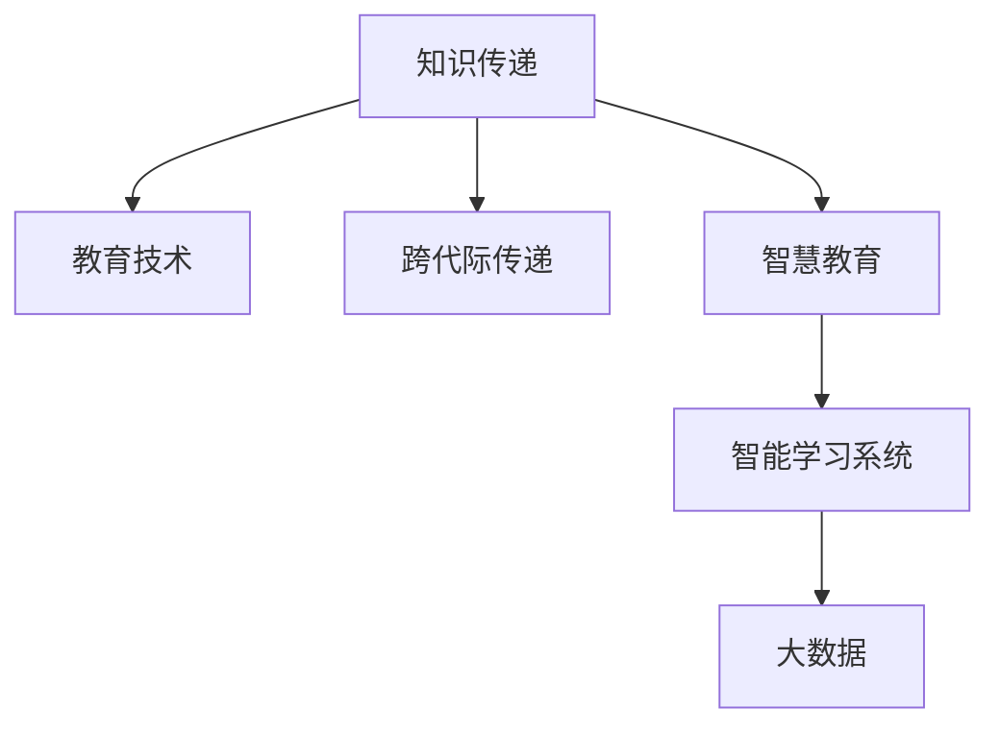

                 

# 知识的跨代际传递：教育的核心使命

> 关键词：知识传递,教育技术,跨代际,智慧教育,智能学习系统,大数据,人工智能

## 1. 背景介绍

在当今社会，知识的传承与更新成为了教育的核心使命。随着科技的飞速发展，知识的增长速度迅猛增加，每一代人获取的知识量与上一代相比有显著的提升。而教育的本质，就是将人类积累的知识有效地传递给下一代，使之能够继承和发展人类的文明。然而，传统的教育方式在面对知识的爆炸式增长时显得力不从心。尤其是随着信息时代和人工智能时代的到来，传统的教育模式已经不能满足当前社会的需求。

### 1.1 教育变革的驱动力
知识传递的过程涉及到多个环节，包括知识源、知识传递者、知识接受者、知识接受环境的构建等。在过去，信息传递主要依赖于口耳相传、书籍、报纸等传统方式，这些方式的效率低下，知识传递的速度和广度有限。但随着科技的进步，尤其是数字技术和大数据技术的应用，知识传递的方式和效率都得到了极大的提升。

人工智能技术的发展，特别是机器学习、自然语言处理等技术的应用，使得教育领域得以更加智能化、个性化地传递知识。例如，智能学习系统可以根据学生的学习行为和偏好，提供个性化的学习内容和路径，从而提高学习效率。此外，大数据技术可以分析学生的学习数据，挖掘出有价值的学习行为模式，为教学决策提供依据。

### 1.2 现代教育面临的挑战
尽管现代教育技术的发展为知识的传递带来了便利，但同时也面临着诸多挑战：

- **信息过载**：现代学生需要处理的信息量巨大，如何在浩如烟海的信息中筛选出真正有用的知识，是现代教育需要解决的问题。
- **个性化教育**：每个学生的学习能力和背景都不同，如何根据学生的特点制定个性化的学习计划，是教育技术需要解决的问题。
- **教学质量与公平性**：教育资源的分配不均，使得不同地区和学校的教学质量差异巨大。如何通过技术手段，让优质教育资源更公平地分配，是当前教育技术的重要任务。
- **教育与工业化的脱节**：教育体系需要与工业化的要求相匹配，培养出能够适应现代社会需求的人才。

## 2. 核心概念与联系

### 2.1 核心概念概述

为更好地理解教育技术在知识传递中的作用，本节将介绍几个密切相关的核心概念：

- **知识传递（Knowledge Transfer）**：指将知识从知识源传递到知识接受者，并使知识接受者能够理解、应用和扩展知识的过程。
- **教育技术（Educational Technology）**：指运用现代信息技术，如计算机、网络、多媒体等技术，改善教育和学习过程的技术手段。
- **跨代际传递（Inter-Generational Transfer）**：指不同代际之间的知识传递，涵盖从老一辈向年轻一代传递知识和技能的过程。
- **智慧教育（Smart Education）**：利用人工智能、大数据等技术，实现教育过程的智能化、个性化，提高教育质量和效率。
- **智能学习系统（Intelligent Learning Systems）**：通过人工智能技术，为学生提供个性化学习体验，提高学习效果的教育系统。
- **大数据（Big Data）**：指海量的、多种类型的数据，通过对大数据的分析，可以发现知识传递中的规律和趋势。

这些核心概念之间的逻辑关系可以通过以下Mermaid流程图来展示：



这个流程图展示了一些核心概念及其之间的关系：

1. 知识传递是教育的核心任务。
2. 教育技术是知识传递的手段。
3. 跨代际传递是知识传承的重要形式。
4. 智慧教育是教育技术的高级形式。
5. 智能学习系统是智慧教育的主要实现手段。
6. 大数据是智慧教育的重要数据基础。

这些概念共同构成了教育技术的知识传递框架，使得教育过程更加高效和智能化。通过理解这些核心概念，我们可以更好地把握教育技术的工作原理和优化方向。

## 3. 核心算法原理 & 具体操作步骤
### 3.1 算法原理概述

教育技术中涉及的知识传递过程，可以抽象为以下几个步骤：

1. **知识采集与整理**：从各种渠道收集知识，包括书籍、课程、论文等。
2. **知识表示与存储**：将知识以结构化的形式表示和存储，便于后续处理和传递。
3. **知识传递与传播**：利用教育技术手段，将知识传递给学习者。
4. **知识应用与反馈**：学习者应用所学知识，并根据反馈进行调整和优化。

知识传递的整个过程，涉及知识的采集、表示、传播和应用等多个环节。以下将详细介绍这些步骤的算法原理和具体操作步骤。

### 3.2 算法步骤详解

**Step 1: 知识采集与整理**

知识采集与整理是知识传递的基础。这一过程涉及从各种渠道获取知识，并进行加工整理，使其适合于后续的存储和传播。

- **数据采集**：利用爬虫等技术，从互联网、图书馆、学术数据库等渠道收集知识。
- **文本预处理**：对收集到的文本进行分词、去停用词、词性标注等处理，以便后续的语义分析。
- **知识分类**：将处理后的文本进行分类，如按学科、主题、难度等进行划分。

**Step 2: 知识表示与存储**

知识表示与存储是将知识结构化、标准化的过程，便于后续的传播和应用。

- **向量表示**：使用向量空间模型（VSM）或词嵌入（Word Embedding）等方法，将文本转化为向量表示。
- **知识图谱构建**：利用本体论等技术，构建知识图谱，描述实体、关系和属性等知识结构。
- **数据库存储**：将结构化的知识存储在数据库中，如SQL数据库或图形数据库等。

**Step 3: 知识传递与传播**

知识传递与传播是知识传递的核心环节，涉及将知识从知识源传递到知识接受者的过程。

- **内容呈现**：利用多媒体技术，如视频、音频、动画等，将知识呈现给学习者。
- **交互式学习**：利用在线课程、智能学习系统等，实现交互式学习，提高学习效果。
- **社交媒体传播**：利用社交媒体平台，如微博、微信等，扩大知识的传播范围。

**Step 4: 知识应用与反馈**

知识应用与反馈是知识传递的最终环节，涉及学习者应用所学知识，并根据反馈进行调整和优化。

- **测试与评估**：利用在线测试、作业、考试等手段，评估学习者的知识掌握情况。
- **学习数据分析**：利用大数据技术，分析学习者的行为和成绩数据，发现学习规律和问题。
- **个性化学习推荐**：利用机器学习算法，为学习者推荐适合的学习资源和路径。

### 3.3 算法优缺点

教育技术中涉及的知识传递过程，通常有以下优缺点：

**优点：**

- **效率高**：利用计算机和大数据技术，可以快速处理和传递大量知识，提高知识传播的速度。
- **个性化**：通过分析学习者的行为数据，可以为每个学习者提供个性化的学习路径和资源。
- **可扩展性**：教育技术可以轻松扩展到全球范围，提供覆盖更广泛的学习资源。
- **交互性强**：通过交互式学习系统，学习者可以实时与教师和同伴进行互动，提高学习效果。

**缺点：**

- **资源投入大**：需要投入大量资金和技术资源进行知识采集、处理和存储。
- **依赖技术**：教育技术依赖于计算机和网络等技术，一旦技术出现故障，知识传递过程会受到影响。
- **学习者自主性要求高**：学习者需要具备一定的技术素养，才能有效利用教育技术。
- **数据隐私问题**：学习者的行为数据涉及个人隐私，如何保障数据安全和隐私保护是一个重要问题。

### 3.4 算法应用领域

教育技术在多个领域得到了广泛应用，涵盖从基础教育到高等教育，从在线学习到职业教育，从学校教育到企业培训等。以下是几个典型应用场景：

- **在线教育平台**：如Coursera、edX等，利用教育技术为全球学生提供大规模在线课程。
- **智能学习系统**：如Khan Academy、Socratic等，通过大数据和人工智能技术，提供个性化的学习体验。
- **教育管理系统**：如School Management System，利用信息化手段，提高学校管理和教学效率。
- **职业培训系统**：如Udemy、LinkedIn Learning等，为职场人士提供技能培训和职业发展支持。
- **智能图书馆**：如IBM Watson Library，利用大数据技术，提升图书馆的智能化服务水平。

这些应用场景展示了教育技术在知识传递中的重要作用，为教育的现代化和智能化提供了新的可能性。

## 4. 数学模型和公式 & 详细讲解  
### 4.1 数学模型构建

本节将使用数学语言对教育技术在知识传递中的应用进行更加严格的刻画。

**知识传递模型**：
设知识源为 $K$，知识接受者为 $L$，知识传递的算法为 $A$，则知识传递的过程可以表示为：
$$
K \xrightarrow{A} L
$$

其中，$A$ 表示知识传递的算法，可以是教师授课、在线课程、智能学习系统等。

**知识传递的损失函数**：
知识传递的损失函数 $L$ 定义为知识源和知识接受者之间的差距。设 $k$ 为知识源，$l$ 为知识接受者，则损失函数为：
$$
L(k,l) = \sum_{i=1}^n |k_i - l_i|
$$
其中 $n$ 为知识传递过程中的节点数，$k_i$ 和 $l_i$ 分别表示节点 $i$ 的知识源和知识接受者的知识表示。

**知识传递的最优化问题**：
知识传递过程的最优化问题可以表示为：
$$
\mathop{\min}_{A} L(K, A(L))
$$

其中，$A$ 表示知识传递的算法，$L$ 表示知识传递的损失函数。

### 4.2 公式推导过程

以下我们以智能学习系统为例，推导知识传递的数学模型和公式。

设智能学习系统为 $A$，知识源为 $K$，知识接受者为 $L$，知识传递过程中的节点为 $n$。则知识传递的数学模型可以表示为：

1. **知识采集与整理**：知识源 $K$ 通过知识采集与整理，生成中间节点 $K_1$。
2. **知识表示与存储**：中间节点 $K_1$ 通过知识表示与存储，生成节点 $K_2$。
3. **知识传递与传播**：节点 $K_2$ 通过知识传递与传播，生成节点 $L_1$。
4. **知识应用与反馈**：节点 $L_1$ 通过知识应用与反馈，生成知识接受者 $L$。

设知识源 $K$ 和知识接受者 $L$ 的知识表示分别为 $\mathbf{k} = [k_1, k_2, \ldots, k_n]$ 和 $\mathbf{l} = [l_1, l_2, \ldots, l_n]$。知识传递过程的损失函数可以表示为：
$$
L(K, L) = \sum_{i=1}^n |k_i - l_i|
$$

为了最小化知识传递的损失函数，需要调整知识传递算法 $A$ 的参数。知识传递算法 $A$ 可以表示为：
$$
A = \{\mathbf{w}\}
$$
其中 $\mathbf{w}$ 为知识传递算法的参数。

知识传递算法的优化目标是最小化知识传递的损失函数，即：
$$
\mathop{\min}_{\mathbf{w}} L(K, A(L))
$$

通过梯度下降等优化算法，求解上述最优化问题，可以得到知识传递算法 $A$ 的最优参数 $\mathbf{w}^*$。

### 4.3 案例分析与讲解

以Khan Academy为例，分析其智能学习系统的知识传递过程。

Khan Academy 是一个大规模在线教育平台，利用大数据和人工智能技术，为全球学生提供个性化的学习体验。其智能学习系统通过以下步骤实现知识传递：

1. **知识采集与整理**：Khan Academy 从全球范围内收集优质的教学资源，包括视频、习题、讲义等。
2. **知识表示与存储**：将收集到的资源进行分词、标注、分类等处理，转化为结构化的知识表示。
3. **知识传递与传播**：利用在线课程、智能推荐系统等，将知识传递给学习者。
4. **知识应用与反馈**：通过在线测试和作业，评估学习者的知识掌握情况，并根据反馈进行调整和优化。

Khan Academy 的智能学习系统通过机器学习算法，分析学习者的行为数据，生成个性化的学习计划和推荐，从而提高学习效果。其知识传递过程可以表示为：

$$
K \xrightarrow{\text{知识采集与整理}} K_1 \xrightarrow{\text{知识表示与存储}} K_2 \xrightarrow{\text{知识传递与传播}} L_1 \xrightarrow{\text{知识应用与反馈}} L
$$

其中，$K_1$ 为整理后的知识资源，$K_2$ 为结构化的知识表示，$L_1$ 为通过智能推荐系统生成的学习路径。

## 5. 项目实践：代码实例和详细解释说明
### 5.1 开发环境搭建

在进行知识传递实践前，我们需要准备好开发环境。以下是使用Python进行教育技术开发的常见环境配置流程：

1. 安装Anaconda：从官网下载并安装Anaconda，用于创建独立的Python环境。

2. 创建并激活虚拟环境：
```bash
conda create -n edutech-env python=3.8 
conda activate edutech-env
```

3. 安装必要的工具包：
```bash
pip install numpy pandas scikit-learn torch transformers
```

4. 安装Web框架：
```bash
pip install flask
```

完成上述步骤后，即可在`edutech-env`环境中开始教育技术开发。

### 5.2 源代码详细实现

下面我们以智能学习系统为例，给出使用Transformers库对智能学习系统进行开发的PyTorch代码实现。

首先，定义数据处理函数：

```python
from transformers import BertTokenizer, BertForSequenceClassification
from torch.utils.data import Dataset
import torch

class CustomDataset(Dataset):
    def __init__(self, texts, labels, tokenizer):
        self.texts = texts
        self.labels = labels
        self.tokenizer = tokenizer
        
    def __len__(self):
        return len(self.texts)
    
    def __getitem__(self, item):
        text = self.texts[item]
        label = self.labels[item]
        
        encoding = self.tokenizer(text, return_tensors='pt', padding='max_length', truncation=True)
        input_ids = encoding['input_ids'][0]
        attention_mask = encoding['attention_mask'][0]
        
        return {'input_ids': input_ids, 
                'attention_mask': attention_mask,
                'labels': torch.tensor(label, dtype=torch.long)}
```

然后，定义模型和优化器：

```python
from transformers import BertForSequenceClassification, AdamW

model = BertForSequenceClassification.from_pretrained('bert-base-uncased', num_labels=2)

optimizer = AdamW(model.parameters(), lr=2e-5)
```

接着，定义训练和评估函数：

```python
from torch.utils.data import DataLoader
from tqdm import tqdm

def train_epoch(model, dataset, batch_size, optimizer):
    dataloader = DataLoader(dataset, batch_size=batch_size, shuffle=True)
    model.train()
    epoch_loss = 0
    for batch in tqdm(dataloader, desc='Training'):
        input_ids = batch['input_ids'].to(device)
        attention_mask = batch['attention_mask'].to(device)
        labels = batch['labels'].to(device)
        model.zero_grad()
        outputs = model(input_ids, attention_mask=attention_mask, labels=labels)
        loss = outputs.loss
        epoch_loss += loss.item()
        loss.backward()
        optimizer.step()
    return epoch_loss / len(dataloader)

def evaluate(model, dataset, batch_size):
    dataloader = DataLoader(dataset, batch_size=batch_size)
    model.eval()
    preds, labels = [], []
    with torch.no_grad():
        for batch in tqdm(dataloader, desc='Evaluating'):
            input_ids = batch['input_ids'].to(device)
            attention_mask = batch['attention_mask'].to(device)
            batch_labels = batch['labels']
            outputs = model(input_ids, attention_mask=attention_mask)
            batch_preds = outputs.logits.argmax(dim=2).to('cpu').tolist()
            batch_labels = batch_labels.to('cpu').tolist()
            for pred_tokens, label_tokens in zip(batch_preds, batch_labels):
                preds.append(pred_tokens)
                labels.append(label_tokens)
                
    print(classification_report(labels, preds))
```

最后，启动训练流程并在测试集上评估：

```python
epochs = 5
batch_size = 16

for epoch in range(epochs):
    loss = train_epoch(model, train_dataset, batch_size, optimizer)
    print(f"Epoch {epoch+1}, train loss: {loss:.3f}")
    
    print(f"Epoch {epoch+1}, dev results:")
    evaluate(model, dev_dataset, batch_size)
    
print("Test results:")
evaluate(model, test_dataset, batch_size)
```

以上就是使用PyTorch对智能学习系统进行开发的完整代码实现。可以看到，Transformers库提供了便捷的工具，使得教育技术的开发变得相对简单。

### 5.3 代码解读与分析

让我们再详细解读一下关键代码的实现细节：

**CustomDataset类**：
- `__init__`方法：初始化文本、标签、分词器等关键组件。
- `__len__`方法：返回数据集的样本数量。
- `__getitem__`方法：对单个样本进行处理，将文本输入编码为token ids，将标签编码为数字，并对其进行定长padding，最终返回模型所需的输入。

**模型和优化器定义**：
- 使用BertForSequenceClassification模型作为智能学习系统的基础，并进行二分类任务适配。
- 定义AdamW优化器，设置学习率为2e-5。

**训练和评估函数**：
- 使用PyTorch的DataLoader对数据集进行批次化加载，供模型训练和推理使用。
- 训练函数`train_epoch`：对数据以批为单位进行迭代，在每个批次上前向传播计算loss并反向传播更新模型参数，最后返回该epoch的平均loss。
- 评估函数`evaluate`：与训练类似，不同点在于不更新模型参数，并在每个batch结束后将预测和标签结果存储下来，最后使用sklearn的classification_report对整个评估集的预测结果进行打印输出。

**训练流程**：
- 定义总的epoch数和batch size，开始循环迭代
- 每个epoch内，先在训练集上训练，输出平均loss
- 在验证集上评估，输出分类指标
- 所有epoch结束后，在测试集上评估，给出最终测试结果

可以看到，PyTorch配合Transformers库使得智能学习系统的开发变得简洁高效。开发者可以将更多精力放在数据处理、模型改进等高层逻辑上，而不必过多关注底层的实现细节。

当然，工业级的系统实现还需考虑更多因素，如模型的保存和部署、超参数的自动搜索、更灵活的任务适配层等。但核心的知识传递逻辑基本与此类似。

## 6. 实际应用场景
### 6.1 智慧课堂

智慧课堂是教育技术的重要应用场景之一。通过智慧课堂，可以实时采集学生的学习行为数据，并根据数据进行个性化教学，从而提高教学效果。

智慧课堂通常包含以下几个关键组件：

- **智能讲台**：利用摄像头、麦克风等设备，实时采集教师的授课内容。
- **智能黑板**：利用投影仪和电子笔，实时呈现教师的板书内容。
- **智能桌椅**：利用传感器和位置追踪技术，实时监控学生的座位和活动。
- **智能交互**：利用电子白板、平板等设备，实现学生与教师的互动。

智慧课堂通过将这些组件与智能学习系统集成，能够实现实时数据采集、分析和反馈，从而提供个性化的教学体验。例如，教师可以通过智能讲台和智能黑板展示PPT，学生可以通过电子白板或平板进行互动，系统可以实时记录学生的注意力和参与度，并生成个性化的学习报告。

### 6.2 在线教育平台

在线教育平台如Coursera、edX等，利用教育技术为全球学生提供大规模在线课程。通过这些平台，学生可以随时随地进行学习，不受地域和时间限制。

在线教育平台通常包含以下几个关键组件：

- **视频课程**：利用视频技术，提供高质量的课程讲授内容。
- **在线测试**：利用在线测试平台，评估学生的学习效果。
- **智能推荐**：利用机器学习算法，为学生推荐合适的学习资源。
- **社交互动**：利用社交媒体平台，实现学生之间的互动和交流。

在线教育平台通过将这些组件与智能学习系统集成，能够提供个性化的学习体验，提升学习效果。例如，学生可以在平台上观看视频课程，进行在线测试，获得个性化的学习推荐，参与在线讨论和交流。

### 6.3 企业培训

企业培训是教育技术的另一个重要应用场景。通过培训系统，企业可以为员工提供技能提升和职业发展支持。

企业培训通常包含以下几个关键组件：

- **在线课程**：利用在线课程平台，提供丰富的培训内容。
- **互动练习**：利用互动练习系统，帮助员工巩固学习内容。
- **在线考试**：利用在线考试平台，评估员工的学习效果。
- **知识管理**：利用知识管理系统，存储和共享培训资源。

企业培训通过将这些组件与智能学习系统集成，能够提供个性化的培训体验，提升培训效果。例如，员工可以通过在线课程平台学习新技能，利用互动练习系统巩固学习内容，进行在线考试评估学习效果，通过知识管理系统共享培训资源。

## 7. 工具和资源推荐
### 7.1 学习资源推荐

为了帮助开发者系统掌握教育技术的知识传递理论基础和实践技巧，这里推荐一些优质的学习资源：

1. 《Educational Data Mining in Higher Education: From Data to Insights》系列书籍：介绍教育数据分析和智能教学系统的经典理论和方法。
2. Coursera《Machine Learning for Education》课程：由机器学习专家Andrew Ng授课，讲解如何利用机器学习技术改进教育系统。
3. edX《Data Science and Machine Learning in Education》课程：由数据科学家和教育技术专家联合授课，讲解数据科学和机器学习在教育中的应用。
4. IBM Watson教育平台：利用IBM Watson技术，提供智能教学和学习解决方案。
5. Kaggle教育数据集：包含多个教育相关的数据集，如学生成绩、学习行为等，供机器学习实践使用。

通过对这些资源的学习实践，相信你一定能够快速掌握教育技术的知识传递逻辑，并用于解决实际的教育问题。

### 7.2 开发工具推荐

高效的开发离不开优秀的工具支持。以下是几款用于教育技术开发的常用工具：

1. Python：Python作为数据科学和机器学习的通用语言，提供丰富的第三方库和工具，如NumPy、Pandas、Scikit-Learn等，支持教育技术的开发。
2. TensorFlow：由Google主导开发的深度学习框架，支持分布式计算，适合大规模的教育数据分析和模型训练。
3. PyTorch：基于Python的开源深度学习框架，灵活动态的计算图，适合快速迭代研究。
4. Flask：Python Web框架，支持Web应用的快速开发和部署。
5. Keras：高级神经网络API，基于TensorFlow和PyTorch等深度学习框架，支持快速搭建和训练神经网络模型。

合理利用这些工具，可以显著提升教育技术的开发效率，加快创新迭代的步伐。

### 7.3 相关论文推荐

教育技术在知识传递中的应用已经得到了广泛的研究，以下是几篇奠基性的相关论文，推荐阅读：

1. <i>Learning and Teaching Computer Science with Data Mining</i>（Goodman, 2014）：介绍数据挖掘在教育中的应用，展示如何通过数据挖掘技术改进教育系统。
2. <i>Teaching Data Science: Data Mining for the Masses</i>（Alonso et al., 2019）：介绍如何利用数据科学和机器学习技术，为大规模的教育提供个性化学习体验。
3. <i>Deep Learning for Education</i>（Otterbacher et al., 2017）：介绍深度学习在教育中的应用，展示如何利用深度学习技术改进教育系统。
4. <i>Teaching Data Mining in a Massive Online Open Course</i>（Wang et al., 2020）：介绍如何利用大规模在线课程平台，教授数据挖掘和机器学习技术。
5. <i>Smart Education: Applications of Data Science and AI in Education</i>（Bhattacharya et al., 2021）：介绍智能教育的应用，展示如何利用数据科学和人工智能技术，提高教育质量和效率。

这些论文代表了大语言模型微调技术的发展脉络。通过学习这些前沿成果，可以帮助研究者把握学科前进方向，激发更多的创新灵感。

## 8. 总结：未来发展趋势与挑战
### 8.1 总结

本文对教育技术的知识传递过程进行了全面系统的介绍。首先阐述了教育技术在知识传递中的重要作用，明确了知识传递在教育中的核心地位。其次，从原理到实践，详细讲解了知识传递的数学原理和关键步骤，给出了知识传递任务开发的完整代码实例。同时，本文还广泛探讨了知识传递技术在智慧课堂、在线教育平台、企业培训等多个行业领域的应用前景，展示了知识传递范式的巨大潜力。

通过本文的系统梳理，可以看到，教育技术在知识传递中的重要作用。教育技术能够利用先进的信息技术和算法，提供个性化的学习体验，提升教学效果和教育质量。未来，随着技术的不断进步，教育技术必将为教育的现代化和智能化提供新的可能性。

### 8.2 未来发展趋势

展望未来，教育技术在知识传递中的应用将呈现以下几个发展趋势：

1. **智能化**：利用人工智能和大数据技术，实现更加智能化的知识传递。例如，智能学习系统可以根据学习者的行为数据，生成个性化的学习路径和推荐。
2. **泛在化**：教育技术将变得更加普及和易于使用，覆盖更多的学习场景和用户。例如，移动设备和智能穿戴设备将为随时随地学习提供更多便利。
3. **个性化**：通过分析学习者的行为数据，为每个学习者提供个性化的学习体验。例如，智能学习系统可以根据学习者的学习进度和能力，生成个性化的学习资源和路径。
4. **虚拟化**：虚拟现实技术将为教育带来更加沉浸式的学习体验。例如，虚拟教室和虚拟实验将为学生提供更加丰富的学习资源和实践机会。
5. **社会化**：教育技术将更加注重社交互动和合作学习。例如，社交媒体平台将为学生提供更多的交流和合作机会，增强学习的互动性和参与度。

以上趋势凸显了教育技术的广阔前景。这些方向的探索发展，必将进一步提升教育系统的效率和质量，为教育的现代化和智能化提供新的可能性。

### 8.3 面临的挑战

尽管教育技术在知识传递中的应用已经取得了一定的进展，但在迈向更加智能化、普适化应用的过程中，它仍面临着诸多挑战：

1. **数据隐私和安全**：学习者的行为数据涉及个人隐私，如何保障数据安全和隐私保护是一个重要问题。
2. **技术门槛高**：教育技术的开发和应用需要具备一定的技术素养，如何降低技术门槛，使其更加易于使用，是一个重要问题。
3. **教师和学生适应性差**：教育技术的引入可能会改变传统的教学模式和学习方式，教师和学生需要适应新的教学和学习方式。
4. **资源不均**：教育资源的分配不均，使得不同地区和学校的教育质量差异巨大，如何通过技术手段，让优质教育资源更公平地分配，是一个重要问题。
5. **效果评估难**：教育技术的效果评估是一个复杂的问题，如何科学地评估教育技术的应用效果，是一个重要问题。

### 8.4 研究展望

面对教育技术在知识传递中面临的挑战，未来的研究需要在以下几个方面寻求新的突破：

1. **数据隐私保护**：开发更加安全、可靠的数据隐私保护技术，保障学习者的行为数据安全。
2. **技术普及化**：降低教育技术的开发和应用门槛，使其更加易于使用，普及到更多教育场景。
3. **教师和学生适应性提升**：通过培训和引导，提升教师和学生对教育技术的适应性，使其能够充分利用教育技术。
4. **资源分配均衡**：通过技术手段，实现教育资源的均衡分配，提升教育质量的公平性。
5. **效果评估体系构建**：建立科学的教育技术效果评估体系，评估教育技术的应用效果，指导教育技术的改进和优化。

这些研究方向的探索，必将引领教育技术的知识传递走向成熟，为教育的现代化和智能化提供新的可能性。

## 9. 附录：常见问题与解答

**Q1：教育技术在知识传递中的优势和劣势是什么？**

A: 教育技术在知识传递中具有以下优势：

1. **效率高**：利用计算机和大数据技术，可以快速处理和传递大量知识，提高知识传播的速度。
2. **个性化**：通过分析学习者的行为数据，可以为每个学习者提供个性化的学习路径和资源。
3. **可扩展性**：教育技术可以轻松扩展到全球范围，提供覆盖更广泛的学习资源。
4. **交互性强**：通过交互式学习系统，学习者可以实时与教师和同伴进行互动，提高学习效果。

但同时也存在以下劣势：

1. **资源投入大**：需要投入大量资金和技术资源进行知识采集、处理和存储。
2. **依赖技术**：教育技术依赖于计算机和网络等技术，一旦技术出现故障，知识传递过程会受到影响。
3. **学习者自主性要求高**：学习者需要具备一定的技术素养，才能有效利用教育技术。
4. **数据隐私问题**：学习者的行为数据涉及个人隐私，如何保障数据安全和隐私保护是一个重要问题。

**Q2：如何选择适合的教育技术工具？**

A: 选择适合的教育技术工具，需要考虑以下几个因素：

1. **功能需求**：根据教育任务的需求，选择具备相应功能的教育技术工具。例如，需要视频授课可以选择支持视频播放的工具，需要在线测试可以选择支持在线测试的工具。
2. **易用性**：选择易于使用和操作的教育技术工具，避免教师和学生在使用过程中遇到困难。例如，选择有良好用户界面和操作手册的工具。
3. **性能和稳定性**：选择性能良好、稳定性高的教育技术工具，避免因技术问题影响教学效果。例如，选择经过大量用户测试和验证的工具。
4. **成本和预算**：选择符合预算的教育技术工具，避免因成本过高导致资源浪费。例如，选择免费开源或性价比高的工具。

**Q3：如何评估教育技术的效果？**

A: 评估教育技术的效果可以从以下几个方面入手：

1. **学习成果**：评估学习者的学习成果，如考试成绩、作业成绩等，了解教育技术对学习成果的影响。
2. **学习行为**：评估学习者的学习行为，如出勤率、参与度等，了解教育技术对学习行为的改善。
3. **学习满意度**：通过问卷调查等方式，了解学习者对教育技术的满意度和使用体验。
4. **技术应用效果**：评估教育技术的实际应用效果，如教师和学生的适应性、工具的使用率等。
5. **成本效益**：评估教育技术的成本效益，如投资回报率、资源利用率等。

**Q4：如何克服教育技术在知识传递中的数据隐私问题？**

A: 克服教育技术在知识传递中的数据隐私问题，可以从以下几个方面入手：

1. **数据匿名化**：对学习者的行为数据进行匿名化处理，避免个人隐私泄露。例如，使用脱敏技术处理数据，只保留统计信息。
2. **数据加密**：对学习者的行为数据进行加密处理，防止数据被未授权访问。例如，使用SSL/TLS协议加密数据传输。
3. **访问控制**：对学习者的行为数据设置访问权限，确保只有授权人员才能访问数据。例如，使用身份验证和授权机制。
4. **隐私保护技术**：利用隐私保护技术，如差分隐私、联邦学习等，保护学习者的行为数据。例如，使用差分隐私算法处理数据。
5. **用户知情权**：确保学习者了解其行为数据的收集和使用方式，并在使用前获得同意。例如，通过隐私政策和用户协议告知学习者。

**Q5：如何提高教育技术的教学效果？**

A: 提高教育技术的教学效果，可以从以下几个方面入手：

1. **个性化学习**：利用学习者行为数据，生成个性化的学习路径和资源，提高学习效果。例如，智能学习系统可以根据学习者的学习进度和能力，推荐合适的学习资源。
2. **交互式学习**：通过交互式学习系统，增强学习者的参与度和互动性，提高学习效果。例如，利用在线讨论和协作工具，促进学习者的互动和合作。
3. **动态评估**：利用在线测试和实时反馈，动态评估学习者的学习效果，及时发现问题并调整学习计划。例如，智能学习系统可以根据学习者的测试结果，生成个性化的学习报告和建议。
4. **资源共享**：利用知识管理系统，共享和更新学习资源，提高资源利用率。例如，教师和学生可以共享教学资源和学习经验。
5. **教师培训**：通过教师培训，提升教师对教育技术的掌握和使用能力，提高教学效果。例如，利用在线培训平台，为教师提供技术培训和支持。

**Q6：如何利用教育技术提高学习者的学习兴趣？**

A: 利用教育技术提高学习者的学习兴趣，可以从以下几个方面入手：

1. **互动性强**：通过交互式学习系统，增强学习者的参与度和互动性，提高学习兴趣。例如，利用电子白板和平板设备，进行互动讨论和协作。
2. **多媒体教学**：利用多媒体技术，提供丰富的教学内容和形式，吸引学习者的注意力。例如，利用视频、音频和动画等形式，呈现学习内容。
3. **游戏化学习**：利用游戏化技术，设计有趣的学习任务和挑战，增强学习者的学习动力。例如，利用游戏化学习平台，提供奖励和积分等激励机制。
4. **个性化学习路径**：根据学习者的兴趣和能力，生成个性化的学习路径和资源，满足学习者的需求。例如，智能学习系统可以根据学习者的学习行为，推荐合适的学习内容和路径。
5. **反馈及时**：通过及时反馈，帮助学习者了解自己的学习效果和进步，增强学习动力。例如，利用在线测试和实时反馈，及时评估学习效果并提供反馈。

**Q7：如何利用教育技术提高教育资源的使用效率？**

A: 利用教育技术提高教育资源的使用效率，可以从以下几个方面入手：

1. **资源共享平台**：利用知识管理系统，共享和更新教育资源，提高资源利用率。例如，教师和学生可以共享教学资源和学习经验。
2. **智能推荐系统**：利用机器学习算法，为学习者推荐合适的学习资源，提高资源利用率。例如，智能学习系统可以根据学习者的学习行为，推荐适合的学习资源和路径。
3. **资源自动化处理**：利用自动化技术，自动处理和分析教育资源，提高资源利用效率。例如，自动分词、标注和分类等处理技术，可以大大提高教育资源的处理速度和质量。
4. **资源优化算法**：利用优化算法，优化教育资源的分配和使用，提高资源利用效率。例如，利用线性规划等算法，优化教育资源的分配。
5. **资源评估体系**：建立科学的教育资源评估体系，评估教育资源的使用效果，指导教育资源的优化和改进。例如，利用学习数据分析工具，评估教育资源的使用效果和改进建议。

**Q8：如何利用教育技术提高教育质量的公平性？**

A: 利用教育技术提高教育质量的公平性，可以从以下几个方面入手：

1. **资源均衡分配**：利用教育技术，实现教育资源的均衡分配，提升教育质量的公平性。例如，利用远程教育和在线课程，覆盖更多的教育资源不足地区。
2. **个性化教育**：利用教育技术，提供个性化的教育服务，提升教育质量的公平性。例如，智能学习系统可以根据学生的特点，提供个性化的学习路径和资源。
3. **学习行为分析**：利用教育技术，分析学习者的行为数据，发现学习障碍和不足，指导教师进行个性化教学。例如，智能学习系统可以分析学习者的学习行为，发现学习问题并提出改进建议。
4. **教师培训和支持**：利用教育技术，提供教师培训和支持，提升教师的教学能力，提高教育质量的公平性。例如，利用在线培训平台，为教师提供技术培训和支持。
5. **学习评估体系**：建立科学的学习评估体系，评估教育技术的应用效果，指导教育技术的改进和优化。例如，利用学习数据分析工具，评估教育技术的应用效果和改进建议。

**Q9：如何利用教育技术提高教育技术的可扩展性？**

A: 利用教育技术提高教育技术的可扩展性，可以从以下几个方面入手：

1. **云平台**：利用云计算平台，实现教育技术的快速部署和扩展。例如，利用云平台，快速搭建在线学习平台和应用系统。
2. **分布式系统**：利用分布式系统，实现教育技术的负载均衡和扩展。例如，利用分布式系统，实现大规模数据处理和存储。
3. **微服务架构**：利用微服务架构，实现教育技术的模块化和扩展性。例如，利用微服务架构，实现教育系统的模块化和灵活扩展。
4. **容器化技术**：利用容器化技术，实现教育技术的快速部署和扩展。例如，利用Docker和Kubernetes等容器化技术，快速部署和扩展教育系统。
5. **开源社区**：利用开源社区，实现教育技术的快速迭代和扩展。例如，利用开源社区，获取教育技术的最新进展和贡献。

**Q10：如何利用教育技术提高教育技术的稳定性？**

A: 利用教育技术提高教育技术的稳定性，可以从以下几个方面入手：

1. **冗余设计**：利用冗余设计，提高教育技术的容错能力和稳定性。例如，利用负载均衡和备份机制，保证教育系统的稳定运行。
2. **性能监控**：利用性能监控工具，实时监控教育技术的运行状态，及时发现和解决性能问题。例如，利用监控工具，监控教育系统的CPU、内存和网络等性能指标。
3. **故障恢复**

