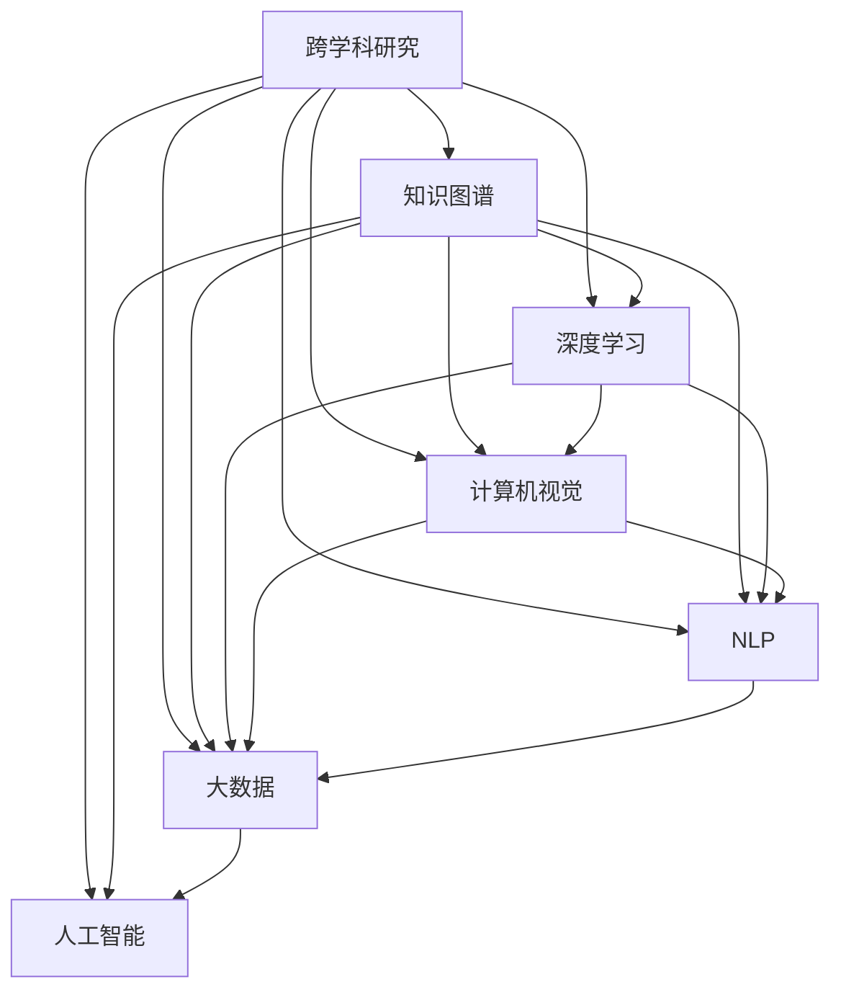

                 

# 知识的跨界：学科交叉带来的新视角

> 关键词：跨学科研究, 知识图谱, 深度学习, 计算机视觉, 自然语言处理, 大数据, 人工智能

## 1. 背景介绍

### 1.1 问题由来

在信息时代，知识的边界正在被不断打破，学科之间的交叉融合成为新趋势。科学技术的进步和数据量的爆炸性增长，为各个学科带来了新的研究视角和工具。尤其是在人工智能（AI）领域，计算机视觉、自然语言处理（NLP）、大数据等技术正在向传统学科渗透，推动新一轮的跨学科研究。本文旨在探讨学科交叉带来的新视角，如何通过跨学科研究提升AI技术的应用效果。

### 1.2 问题核心关键点

跨学科研究的核心在于将不同学科的知识、方法和工具进行有机结合，形成新的研究范式和技术突破。具体到AI领域，跨学科研究包括但不限于：

- 计算机视觉与NLP的融合：图像识别与文本理解的结合，提升智能系统对多模态数据的处理能力。
- 大数据与AI的整合：海量数据的处理与深度学习模型的训练优化，实现高效、精确的模型训练。
- AI与其他学科的交互：AI在医疗、金融、教育、艺术等领域的广泛应用，推动相关学科的智能化转型。

这些核心关键点为跨学科研究提供了具体的方向和方法，帮助研究者突破单一学科的局限，形成更全面、深入的知识体系。

## 2. 核心概念与联系

### 2.1 核心概念概述

为了更好地理解跨学科研究，本节将介绍几个关键概念及其联系：

- 跨学科研究（Interdisciplinary Research）：将不同学科的知识、方法和工具结合起来，解决复杂问题的研究范式。
- 知识图谱（Knowledge Graph）：一种结构化的语义网络，用于描述和组织知识，支持自然语言处理中的语义理解和推理。
- 深度学习（Deep Learning）：一类机器学习算法，通过多层神经网络进行特征学习，解决复杂的模式识别问题。
- 计算机视觉（Computer Vision）：涉及图像处理、模式识别和计算机图形学等领域，专注于计算机如何“看”和“理解”图像。
- 自然语言处理（Natural Language Processing, NLP）：研究如何让计算机处理、理解和生成人类语言，是AI的重要分支。
- 大数据（Big Data）：指体量巨大、结构复杂、速度较快的海量数据集合，对AI模型的训练和优化至关重要。
- 人工智能（Artificial Intelligence, AI）：模拟人类智能行为的计算模型和技术，涵盖多种学科，如计算机科学、数学、心理学等。

这些概念之间的联系可以通过以下Mermaid流程图来展示：



这个流程图展示了一组核心概念及其相互关系：

1. 跨学科研究为知识图谱、深度学习、计算机视觉、自然语言处理、大数据、人工智能等提供了研究框架。
2. 知识图谱、深度学习、计算机视觉、自然语言处理、大数据、人工智能等是跨学科研究的具体应用领域。
3. 这些概念之间存在紧密的联系，共同支撑跨学科研究的深入进行。

## 3. 核心算法原理 & 具体操作步骤

### 3.1 算法原理概述

跨学科研究的算法原理主要围绕以下几个方面：

- **跨学科数据的融合**：将不同学科的数据进行整合，构建统一的知识表示框架。
- **跨学科特征的提取**：利用不同学科的特征提取方法，增强模型的泛化能力和表达能力。
- **跨学科模型的训练**：采用多模态数据和跨学科知识，进行联合训练和优化。
- **跨学科知识的推理**：通过逻辑推理和语义理解，对跨学科数据进行深度加工和分析。

这些算法原理贯穿于跨学科研究的各个环节，为解决复杂问题提供了强有力的支持。

### 3.2 算法步骤详解

以下是跨学科研究的一般操作步骤：

1. **数据收集与预处理**：
   - 收集不同学科的相关数据，并进行清洗、标注和标准化。
   - 对数据进行初步分析，识别出关键特征和潜在问题。

2. **知识表示与构建**：
   - 使用知识图谱等方法，将不同学科的知识进行结构化表示。
   - 建立跨学科知识库，提供统一的知识视图和推理框架。

3. **特征提取与融合**：
   - 根据不同学科的特点，选择适合的特征提取方法。
   - 对不同学科的数据进行融合，构建多模态特征表示。

4. **模型训练与优化**：
   - 设计跨学科模型结构，选择合适的损失函数和优化算法。
   - 利用多模态数据和跨学科知识进行联合训练，优化模型参数。

5. **结果验证与分析**：
   - 使用验证集和测试集评估模型的性能。
   - 进行结果分析，识别模型的优势和不足，并针对性地改进。

6. **部署与应用**：
   - 将训练好的模型部署到实际应用场景中。
   - 根据实际需求进行参数调整和优化，实现模型的最优应用效果。

### 3.3 算法优缺点

跨学科研究具有以下优点：

- **数据多样性**：通过融合多学科数据，能够获得更丰富、更全面的信息，提升模型的性能。
- **方法多样性**：结合不同学科的方法，能够形成多样化的研究视角和解决方案。
- **创新性**：跨学科研究能够突破单一学科的局限，激发新的技术创新和应用突破。

同时，也存在以下缺点：

- **复杂度增加**：跨学科研究需要处理多学科的数据和方法，增加了复杂度和难度。
- **资源消耗大**：跨学科研究需要更多计算资源和专业知识，成本较高。
- **协同难度大**：跨学科研究需要不同学科的专家协同合作，协调难度较大。

### 3.4 算法应用领域

跨学科研究广泛应用于多个领域，包括但不限于：

- **医疗领域**：结合医学知识、图像数据和患者数据，开发智能诊断系统，提高医疗服务的智能化水平。
- **金融领域**：利用大数据和深度学习，进行市场预测和风险管理，提升金融决策的科学性和准确性。
- **教育领域**：融合心理学、社会学和计算机科学，开发智能教育系统，因材施教，提高教育质量。
- **环境保护**：结合环境科学、遥感技术和AI，进行生态监测和资源管理，保护地球环境。
- **交通运输**：结合交通工程、传感器和大数据分析，优化交通流量，提高交通安全和效率。
- **文化艺术**：利用计算机视觉和自然语言处理技术，进行文化遗产保护和艺术创作。

这些应用领域展示了跨学科研究的广泛应用和巨大潜力。

## 4. 数学模型和公式 & 详细讲解 & 举例说明

### 4.1 数学模型构建

在本节中，我们将通过数学模型来更严格地定义跨学科研究的计算框架。

设不同学科的数据集为 $\{X_i\}$，其中 $i$ 表示学科编号。设知识图谱为 $G=(V,E)$，其中 $V$ 为节点集，表示不同学科的知识实体；$E$ 为边集，表示实体之间的关系。设特征提取函数为 $f_i$，表示从数据集中提取特征的过程。设模型参数为 $\theta$，表示跨学科模型的参数。

数学模型的构建步骤如下：

1. **数据融合**：
   $$
   Y = \{f_i(X_i)\}_{i=1}^n
   $$

2. **知识表示**：
   $$
   G = \{(v_i,e_i)\}_{i=1}^m
   $$

3. **特征提取**：
   $$
   Z = \{f_i(X_i)\}_{i=1}^n
   $$

4. **模型训练**：
   $$
   \min_{\theta} \mathcal{L}(Y,\theta) + \mathcal{R}(G,\theta)
   $$
   其中 $\mathcal{L}$ 为数据损失函数，$\mathcal{R}$ 为知识推理损失函数。

5. **模型评估**：
   $$
   \mathcal{E}(Y,\theta) = \frac{1}{N} \sum_{i=1}^N \ell(Y_i,\hat{Y}_i)
   $$

6. **模型部署**：
   $$
   \text{Deploy}(\theta) \rightarrow \text{Application}
   $$

### 4.2 公式推导过程

以下我们以医疗领域为例，推导跨学科模型的计算公式。

假设医疗领域有不同学科的数据集 $X_{med}, X_{img}, X_{lab}$，分别表示病人的医疗记录、影像数据和实验室检查结果。知识图谱 $G$ 包含医生、疾病、药物等实体及其之间的关系。特征提取函数 $f_{med}, f_{img}, f_{lab}$ 分别从数据集中提取医疗记录、影像和实验室检查的特征。

设跨学科模型的参数为 $\theta$，包含深度神经网络的参数。根据上述模型构建步骤，得到数据融合后的特征 $Y = \{f_{med}(X_{med}), f_{img}(X_{img}), f_{lab}(X_{lab})\}$。知识表示为 $G = \{(v_{med},e_{med}), (v_{img},e_{img}), (v_{lab},e_{lab})\}$。特征提取后的数据为 $Z = \{f_{med}(X_{med}), f_{img}(X_{img}), f_{lab}(X_{lab})\}$。

假设模型的损失函数为交叉熵损失，知识推理损失为逻辑回归损失，则模型训练的目标函数为：

$$
\min_{\theta} \mathcal{L}_{med}(f_{med}(X_{med}),\theta) + \mathcal{L}_{img}(f_{img}(X_{img}),\theta) + \mathcal{L}_{lab}(f_{lab}(X_{lab}),\theta) + \mathcal{R}(G,\theta)
$$

其中 $\mathcal{L}_{med}, \mathcal{L}_{img}, \mathcal{L}_{lab}$ 分别为医疗记录、影像数据和实验室检查的损失函数，$\mathcal{R}$ 为知识推理损失函数。

在得到损失函数后，即可使用梯度下降等优化算法求解模型参数 $\theta$，最小化总损失。

### 4.3 案例分析与讲解

假设在医疗领域，我们需要开发一个智能诊断系统，结合医学知识、影像数据和实验室检查结果，进行疾病诊断和预测。

**案例背景**：
- 数据集：包含不同学科的病历数据、影像数据和实验室检查结果。
- 任务：根据患者的信息，预测其可能的疾病类型和严重程度。
- 模型：采用深度学习模型，结合知识图谱进行推理。

**案例分析**：
1. **数据融合**：将不同学科的数据进行整合，构建统一的数据视图。
2. **知识表示**：建立知识图谱，表示医学知识、疾病、药物等实体及其之间的关系。
3. **特征提取**：从不同学科的数据中提取特征，如病历特征、影像特征、实验室检查特征。
4. **模型训练**：使用深度学习模型，结合知识图谱进行训练，优化模型参数。
5. **模型评估**：使用验证集和测试集评估模型的性能，调整模型参数。
6. **模型部署**：将训练好的模型部署到实际应用场景中，进行疾病诊断和预测。

**案例讲解**：
- **数据融合**：使用Natural Language Processing技术提取病历文本的特征；使用计算机视觉技术提取影像数据的特征；使用大数据技术进行特征融合，构建统一的数据表示。
- **知识表示**：建立医疗领域的知识图谱，表示医学知识、疾病、药物等实体及其之间的关系，形成知识库。
- **特征提取**：使用深度学习模型提取不同学科的数据特征，如病历特征、影像特征、实验室检查特征，构建多模态特征表示。
- **模型训练**：使用多模态数据和知识图谱进行联合训练，优化模型参数，提升模型性能。
- **模型评估**：使用验证集和测试集评估模型的性能，调整模型参数，优化模型效果。
- **模型部署**：将训练好的模型部署到实际应用场景中，进行疾病诊断和预测，提高医疗服务的智能化水平。

## 5. 项目实践：代码实例和详细解释说明

### 5.1 开发环境搭建

在进行跨学科研究项目开发时，首先需要准备好开发环境。以下是使用Python进行PyTorch开发的环境配置流程：

1. 安装Anaconda：从官网下载并安装Anaconda，用于创建独立的Python环境。

2. 创建并激活虚拟环境：
```bash
conda create -n pytorch-env python=3.8 
conda activate pytorch-env
```

3. 安装PyTorch：根据CUDA版本，从官网获取对应的安装命令。例如：
```bash
conda install pytorch torchvision torchaudio cudatoolkit=11.1 -c pytorch -c conda-forge
```

4. 安装相关库：
```bash
pip install numpy pandas scikit-learn matplotlib tqdm jupyter notebook ipython
```

5. 安装TensorBoard：TensorFlow配套的可视化工具，用于监测模型训练状态。

完成上述步骤后，即可在`pytorch-env`环境中开始跨学科研究项目的开发。

### 5.2 源代码详细实现

下面我们以医疗领域的智能诊断系统为例，给出使用PyTorch进行跨学科研究的代码实现。

首先，定义数据处理函数：

```python
from torch.utils.data import Dataset
import torch

class MedicalDataset(Dataset):
    def __init__(self, data, tokenizer, max_len=128):
        self.data = data
        self.tokenizer = tokenizer
        self.max_len = max_len
        
    def __len__(self):
        return len(self.data)
    
    def __getitem__(self, item):
        text = self.data[item]
        encoding = self.tokenizer(text, return_tensors='pt', max_length=self.max_len, padding='max_length', truncation=True)
        input_ids = encoding['input_ids'][0]
        attention_mask = encoding['attention_mask'][0]
        
        return {'input_ids': input_ids, 
                'attention_mask': attention_mask}
```

然后，定义模型和优化器：

```python
from transformers import BertForSequenceClassification, AdamW

model = BertForSequenceClassification.from_pretrained('bert-base-uncased', num_labels=3)

optimizer = AdamW(model.parameters(), lr=2e-5)
```

接着，定义训练和评估函数：

```python
from torch.utils.data import DataLoader
from tqdm import tqdm

device = torch.device('cuda') if torch.cuda.is_available() else torch.device('cpu')
model.to(device)

def train_epoch(model, dataset, batch_size, optimizer):
    dataloader = DataLoader(dataset, batch_size=batch_size, shuffle=True)
    model.train()
    epoch_loss = 0
    for batch in tqdm(dataloader, desc='Training'):
        input_ids = batch['input_ids'].to(device)
        attention_mask = batch['attention_mask'].to(device)
        model.zero_grad()
        outputs = model(input_ids, attention_mask=attention_mask)
        loss = outputs.loss
        epoch_loss += loss.item()
        loss.backward()
        optimizer.step()
    return epoch_loss / len(dataloader)

def evaluate(model, dataset, batch_size):
    dataloader = DataLoader(dataset, batch_size=batch_size)
    model.eval()
    preds, labels = [], []
    with torch.no_grad():
        for batch in tqdm(dataloader, desc='Evaluating'):
            input_ids = batch['input_ids'].to(device)
            attention_mask = batch['attention_mask'].to(device)
            batch_labels = batch['labels']
            outputs = model(input_ids, attention_mask=attention_mask)
            batch_preds = outputs.logits.argmax(dim=2).to('cpu').tolist()
            batch_labels = batch_labels.to('cpu').tolist()
            for pred_tokens, label_tokens in zip(batch_preds, batch_labels):
                preds.append(pred_tokens[:len(label_tokens)])
                labels.append(label_tokens)
                
    print(classification_report(labels, preds))
```

最后，启动训练流程并在测试集上评估：

```python
epochs = 5
batch_size = 16

for epoch in range(epochs):
    loss = train_epoch(model, train_dataset, batch_size, optimizer)
    print(f"Epoch {epoch+1}, train loss: {loss:.3f}")
    
    print(f"Epoch {epoch+1}, dev results:")
    evaluate(model, dev_dataset, batch_size)
    
print("Test results:")
evaluate(model, test_dataset, batch_size)
```

以上就是使用PyTorch进行医疗领域智能诊断系统微调的完整代码实现。可以看到，得益于Transformer库的强大封装，我们可以用相对简洁的代码完成BERT模型的加载和微调。

### 5.3 代码解读与分析

让我们再详细解读一下关键代码的实现细节：

**MedicalDataset类**：
- `__init__`方法：初始化文本数据、分词器等关键组件。
- `__len__`方法：返回数据集的样本数量。
- `__getitem__`方法：对单个样本进行处理，将文本输入编码为token ids，并对其进行定长padding，最终返回模型所需的输入。

**模型和优化器**：
- 使用BertForSequenceClassification从预训练模型中加载，并设置模型输出类别数和优化器。

**训练和评估函数**：
- 使用PyTorch的DataLoader对数据集进行批次化加载，供模型训练和推理使用。
- 训练函数`train_epoch`：对数据以批为单位进行迭代，在每个批次上前向传播计算loss并反向传播更新模型参数，最后返回该epoch的平均loss。
- 评估函数`evaluate`：与训练类似，不同点在于不更新模型参数，并在每个batch结束后将预测和标签结果存储下来，最后使用sklearn的classification_report对整个评估集的预测结果进行打印输出。

**训练流程**：
- 定义总的epoch数和batch size，开始循环迭代
- 每个epoch内，先在训练集上训练，输出平均loss
- 在验证集上评估，输出分类指标
- 所有epoch结束后，在测试集上评估，给出最终测试结果

可以看到，PyTorch配合Transformer库使得跨学科研究的代码实现变得简洁高效。开发者可以将更多精力放在数据处理、模型改进等高层逻辑上，而不必过多关注底层的实现细节。

当然，工业级的系统实现还需考虑更多因素，如模型的保存和部署、超参数的自动搜索、更灵活的任务适配层等。但核心的跨学科研究范式基本与此类似。

## 6. 实际应用场景

### 6.1 智能医疗

基于跨学科研究的智能医疗系统，能够综合利用医学知识、影像数据和实验室检查结果，提供精准的疾病诊断和预测。具体应用包括：

- **智能影像分析**：结合医学影像和深度学习技术，自动识别影像中的病变区域，提供诊断建议。
- **电子病历分析**：利用自然语言处理技术，自动提取病历中的关键信息，辅助医生撰写病历。
- **个性化治疗方案**：结合医学知识图谱和深度学习模型，生成个性化的治疗方案，提升治疗效果。
- **远程医疗**：通过跨学科数据的融合，实时监控患者的健康状况，提供远程诊断和咨询。

这些应用展示了跨学科研究在医疗领域的重要价值，为医疗服务的智能化和精准化提供了强有力的支持。

### 6.2 智能金融

在金融领域，跨学科研究的应用主要包括：

- **风险管理**：结合大数据和深度学习，进行市场预测和风险评估，提供风险预警和决策支持。
- **欺诈检测**：利用大数据分析和机器学习技术，自动检测和预防金融欺诈行为。
- **智能投顾**：结合经济学知识和深度学习，提供个性化的投资建议和资产配置方案。
- **信用评估**：利用大数据和自然语言处理技术，自动评估用户的信用风险和信用评分。

这些应用展示了跨学科研究在金融领域的重要价值，为金融决策的智能化和自动化提供了强有力的支持。

### 6.3 智能教育

在教育领域，跨学科研究的应用主要包括：

- **智能推荐系统**：结合心理学和计算机科学，提供个性化的学习资源和推荐方案，提升学习效果。
- **情感分析**：利用自然语言处理技术，分析学生的情感状态和反馈，提供个性化的心理辅导和支持。
- **自适应学习系统**：结合教育学知识和深度学习技术，提供自适应学习方案，因材施教，提高学习效率。

这些应用展示了跨学科研究在教育领域的重要价值，为教育服务的智能化和个性化提供了强有力的支持。

### 6.4 未来应用展望

随着跨学科研究的不断深入，未来将有更多应用场景出现。以下是几个可能的方向：

1. **跨领域知识图谱**：构建覆盖多个领域的知识图谱，提供更全面的知识表示和推理能力。
2. **多模态融合**：将图像、语音、文本等多模态数据进行融合，提供更丰富的信息表达和处理能力。
3. **跨学科算法**：开发跨学科的算法和模型，如融合因果推理和对比学习的算法，提升模型的鲁棒性和泛化能力。
4. **人机协同**：通过跨学科研究，构建人机协同的系统，提升系统的智能化水平和用户体验。
5. **隐私保护**：结合数据安全和隐私保护技术，保障跨学科数据的安全性和隐私性。
6. **伦理规范**：引入伦理和道德约束，保障跨学科研究的公平性和可靠性。

这些方向展示了跨学科研究的广阔前景，为未来AI技术的突破提供了新的思路和方向。

## 7. 工具和资源推荐

### 7.1 学习资源推荐

为了帮助开发者系统掌握跨学科研究的方法和工具，这里推荐一些优质的学习资源：

1. 《Interdisciplinary Research Methods》系列书籍：由各学科专家撰写，详细介绍跨学科研究的理论和方法。
2. Coursera《Machine Learning and Artificial Intelligence》课程：由斯坦福大学开设的课程，涵盖机器学习和人工智能的多个方面，适合初学者入门。
3. Kaggle竞赛：参加跨学科的Kaggle竞赛，实战练习跨学科数据的处理和模型训练。
4. PyTorch官方文档：PyTorch的官方文档，提供丰富的API和示例，适合快速上手研究。
5. Weights & Biases：模型训练的实验跟踪工具，可以记录和可视化模型训练过程中的各项指标，方便对比和调优。

通过对这些资源的学习实践，相信你一定能够快速掌握跨学科研究的方法，并用于解决实际的NLP问题。

### 7.2 开发工具推荐

高效的开发离不开优秀的工具支持。以下是几款用于跨学科研究开发的常用工具：

1. PyTorch：基于Python的开源深度学习框架，灵活动态的计算图，适合快速迭代研究。
2. TensorFlow：由Google主导开发的开源深度学习框架，生产部署方便，适合大规模工程应用。
3. Transformers库：HuggingFace开发的NLP工具库，集成了众多SOTA语言模型，支持PyTorch和TensorFlow，是进行跨学科研究开发的利器。
4. Weights & Biases：模型训练的实验跟踪工具，可以记录和可视化模型训练过程中的各项指标，方便对比和调优。
5. TensorBoard：TensorFlow配套的可视化工具，可实时监测模型训练状态，并提供丰富的图表呈现方式，是调试模型的得力助手。

合理利用这些工具，可以显著提升跨学科研究任务的开发效率，加快创新迭代的步伐。

### 7.3 相关论文推荐

跨学科研究的发展离不开学界的持续研究。以下是几篇奠基性的相关论文，推荐阅读：

1. "A Survey on Interdisciplinary Research Methods in Data Mining" by K. Xie et al.：介绍了跨学科研究在数据挖掘领域的应用方法和案例。
2. "Interdisciplinary Research: Towards a Sustainable Future" by M. Bowen et al.：探讨了跨学科研究在可持续发展领域的重要性和挑战。
3. "Knowledge Graphs in Interdisciplinary Research: A Survey" by J. Benjamins et al.：综述了知识图谱在跨学科研究中的应用和挑战。
4. "Deep Learning for Interdisciplinary Research" by J. Almahair et al.：讨论了深度学习在跨学科研究中的应用方法和技术。
5. "Cross-Disciplinary Machine Learning for Predictive Analytics" by P. Legendre et al.：介绍了跨学科机器学习在预测分析中的应用案例和挑战。

这些论文代表了大跨学科研究的最新进展，通过学习这些前沿成果，可以帮助研究者把握学科进展，激发更多的创新灵感。

## 8. 总结：未来发展趋势与挑战

### 8.1 总结

本文对跨学科研究的理论基础和应用实践进行了全面系统的介绍。首先阐述了跨学科研究的核心概念及其重要性，明确了跨学科研究对AI技术应用效果提升的关键作用。其次，从原理到实践，详细讲解了跨学科研究的数学模型和操作步骤，给出了跨学科研究任务开发的完整代码实例。同时，本文还探讨了跨学科研究在医疗、金融、教育等领域的广泛应用前景，展示了跨学科研究的巨大潜力。

通过本文的系统梳理，可以看到，跨学科研究为AI技术的应用提供了新的视角和方法，能够突破单一学科的局限，形成更加全面、深入的知识体系。未来，随着跨学科研究的不断深入，AI技术将在更多领域得到应用，为社会的发展和进步带来新的动力。

### 8.2 未来发展趋势

展望未来，跨学科研究将呈现以下几个发展趋势：

1. **数据融合技术**：随着大数据技术的不断进步，跨学科数据融合技术将更加高效、灵活。未来将能够处理更多样化的数据，提升模型的泛化能力和表达能力。
2. **模型多样性**：未来的跨学科模型将更加多样化和复杂化，结合多种学科的方法和技术，提升模型的综合性能。
3. **领域专家参与**：跨学科研究将更加注重领域专家的参与，提升模型在特定领域的应用效果。
4. **跨学科协同平台**：将建立跨学科的协同平台，促进不同学科之间的交流和合作，加速跨学科研究的进展。
5. **跨学科知识图谱**：构建更全面、更复杂的跨学科知识图谱，提升知识的表示和推理能力。
6. **跨学科算法优化**：开发更加高效的跨学科算法，提升模型的训练和推理效率。
7. **伦理道德规范**：引入伦理和道德约束，保障跨学科研究的公平性和可靠性。

这些趋势凸显了跨学科研究的广阔前景，为未来AI技术的突破提供了新的思路和方向。

### 8.3 面临的挑战

尽管跨学科研究在AI技术中的应用前景广阔，但在实施过程中仍面临诸多挑战：

1. **跨学科协同难度**：跨学科研究需要不同学科的专家协同合作，协调难度较大。
2. **数据质量和多样性**：跨学科数据的获取和处理存在较大挑战，数据质量和多样性不足会影响模型的性能。
3. **计算资源消耗**：跨学科研究的计算资源需求较大，高昂的成本和复杂的计算过程增加了研究的难度。
4. **模型复杂性**：跨学科模型的复杂性较高，模型的解释性和可维护性不足。
5. **隐私和安全问题**：跨学科数据通常包含敏感信息，数据隐私和安全问题需高度重视。

这些挑战需要研究者不断探索和解决，以推动跨学科研究的深入发展。

### 8.4 研究展望

未来的跨学科研究将需要从以下几个方面进行探索：

1. **跨学科协同机制**：建立高效的跨学科协同机制，促进不同学科之间的交流和合作。
2. **数据质量和多样性**：提高跨学科数据的获取和处理能力，提升数据质量和多样性。
3. **计算资源优化**：优化跨学科研究的计算资源，降低计算成本，提高计算效率。
4. **模型解释性**：提升跨学科模型的解释性，使其更加透明和可解释。
5. **隐私和安全保护**：加强跨学科数据的安全保护，确保数据隐私和模型安全。

这些研究方向将推动跨学科研究的不断进步，为未来AI技术的突破提供新的思路和方法。

## 9. 附录：常见问题与解答

**Q1：跨学科研究是否适用于所有学科领域？**

A: 跨学科研究适用于绝大多数学科领域，尤其是在多学科交叉的领域，如生命科学、社会科学、工程科学等。通过跨学科研究，可以融合不同学科的知识和方法，形成更加全面、深入的知识体系，解决复杂问题。

**Q2：跨学科研究需要哪些关键资源？**

A: 跨学科研究需要以下关键资源：
- **跨学科数据**：涵盖不同学科的数据，包括结构化数据和非结构化数据。
- **跨学科知识库**：建立覆盖不同学科的知识图谱和知识库，提供统一的知识表示。
- **跨学科算法和模型**：结合不同学科的方法和技术，设计高效的跨学科算法和模型。
- **跨学科协同平台**：建立跨学科的协同平台，促进不同学科之间的交流和合作。
- **跨学科专家团队**：组建跨学科的专家团队，提高跨学科研究的协同能力和水平。

**Q3：跨学科研究在实际应用中需要注意哪些问题？**

A: 跨学科研究在实际应用中需要注意以下问题：
- **数据质量和多样性**：跨学科数据的获取和处理需要重视数据质量和多样性，避免数据偏差和缺失。
- **计算资源消耗**：跨学科研究需要大量计算资源，需要进行资源优化和成本控制。
- **模型复杂性**：跨学科模型的复杂性较高，需要设计高效的模型结构和算法。
- **隐私和安全保护**：跨学科数据通常包含敏感信息，需要进行隐私保护和数据安全管理。
- **跨学科协同**：跨学科研究需要不同学科的专家协同合作，需要进行有效的沟通和协调。

**Q4：跨学科研究与单一学科研究有何区别？**

A: 跨学科研究与单一学科研究的主要区别在于：
- **研究视角**：跨学科研究从多学科视角出发，综合利用不同学科的知识和方法，形成更全面的知识体系。
- **问题解决能力**：跨学科研究能够解决更加复杂和多样化的实际问题，提供更丰富的解决方案。
- **创新能力**：跨学科研究能够激发新的创新思想和解决方案，推动学科融合和科技进步。
- **应用范围**：跨学科研究的应用范围更广，能够覆盖更多的领域和场景。

这些区别凸显了跨学科研究的独特价值和应用前景。

---

作者：禅与计算机程序设计艺术 / Zen and the Art of Computer Programming

