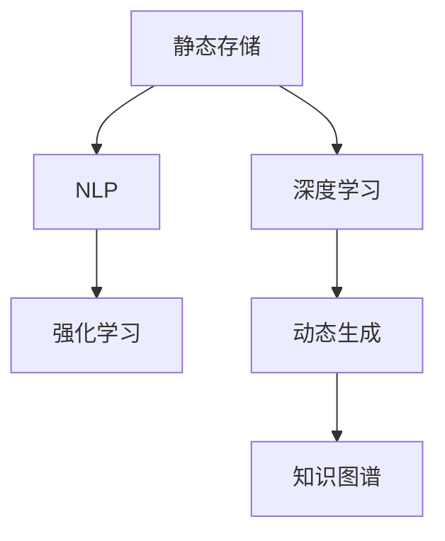

                 

## 1. 背景介绍

在信息时代，知识正以前所未有的速度增长，而如何有效存储、管理和利用这些知识，成为了各个领域面临的重要挑战。传统的数据库系统和文档管理系统，主要采用静态存储的方式，将知识固化在数据库表中，通过查询和搜索获取所需信息。这种静态存储方式虽然便于管理和查询，但却难以适应知识的时效性和动态性需求。

近年来，随着深度学习和大数据技术的迅速发展，知识获取方式正从静态存储逐渐向动态生成转变。通过机器学习算法，可以从海量数据中自动抽取、组织和生成知识，以更灵活、高效的方式支持人类对知识的探索和利用。这一转变，不仅极大地提高了知识处理的效率，也拓展了知识的存储和利用方式，引领了知识管理的未来方向。

本文将从核心概念、算法原理、应用实践、未来展望等多个维度，深入探讨知识从静态存储到动态生成的演变过程，旨在为读者提供全面的技术指导和思考启示。

## 2. 核心概念与联系

### 2.1 核心概念概述

为更好地理解知识动态生成的技术框架，本节将介绍几个密切相关的核心概念：

- 静态存储(Static Storage)：将知识以固定、静态的形式存储在数据库表中，便于管理和查询。这种方式虽然稳定可靠，但难以适应知识的时效性和动态性需求。

- 动态生成(Dynamic Generation)：通过机器学习算法，从海量数据中自动抽取、组织和生成知识，以更灵活、高效的方式支持知识探索和利用。

- 知识图谱(Knowledge Graph)：一种将实体及其关系进行语义化表示的数据结构，通过图谱化方式关联各种知识资源，支持更精确的知识查询和推理。

- 深度学习(Deep Learning)：一类基于神经网络结构的数据驱动算法，通过多层非线性变换，实现对复杂模式的自动学习和识别。

- 自然语言处理(Natural Language Processing, NLP)：通过人工智能技术，使计算机能够理解、处理和生成自然语言，实现对知识的语言化处理。

- 强化学习(Reinforcement Learning)：一种通过奖励和惩罚机制，使智能体通过试错学习最优策略的学习范式。

这些核心概念之间的逻辑关系可以通过以下Mermaid流程图来展示：



这个流程图展示了知识动态生成的核心概念及其之间的关系：

1. 静态存储的知识，通过深度学习、自然语言处理和强化学习等技术，被动态抽取、组织和生成。
2. 生成的知识以知识图谱的形式存储和表示，进一步支持知识的查询和推理。

## 3. 核心算法原理 & 具体操作步骤
### 3.1 算法原理概述

知识动态生成的核心算法，主要基于深度学习模型，通过自监督学习、监督学习和强化学习等不同方式，从海量数据中自动抽取和生成知识。其核心思想是：将知识表示为向量或图谱形式，通过模型学习不同知识间的关联和演化规律，动态生成新的知识。

形式化地，假设知识库中的知识表示为 $K$，目标生成的新知识表示为 $K'$。知识动态生成的优化目标是最小化两个知识表示之间的距离，即：

$$
\min_{K'} \| K' - K \|
$$

在实践中，我们通常使用神经网络模型，如BERT、GPT等，通过特定任务或约束条件进行训练，以生成新的知识。具体步骤包括：

1. 准备海量数据集，包括文本、图像、音频等多种形式的数据。
2. 选择或设计合适的深度学习模型，如Transformer、LSTM等，并加载预训练权重。
3. 定义特定的训练任务，如知识抽取、知识生成、知识推理等。
4. 在数据集上对模型进行训练，学习知识生成的规律和模式。
5. 生成新的知识，并进行后处理和验证，确保知识的时效性和正确性。

### 3.2 算法步骤详解

知识动态生成的一般流程如下：

**Step 1: 数据准备**
- 收集与目标知识相关的多源数据，包括文本、图片、音频等。
- 清洗和标注数据，去除噪音和无用信息，确保数据质量。

**Step 2: 模型选择与加载**
- 选择合适的深度学习模型，如BERT、GPT等，并加载其预训练权重。
- 修改模型结构，增加任务适配层，如知识抽取、知识生成、知识推理等。

**Step 3: 任务定义**
- 定义具体的知识生成任务，如知识抽取、知识生成、知识推理等。
- 设置训练目标，如最小化知识表示间的差异、最大化知识推理准确率等。

**Step 4: 模型训练**
- 将数据集分为训练集、验证集和测试集，划分为多批次进行处理。
- 使用深度学习框架，如PyTorch、TensorFlow等，对模型进行训练。
- 在训练过程中，不断调整模型参数和超参数，以达到最优性能。

**Step 5: 知识生成与验证**
- 对训练好的模型进行测试，评估其在新数据上的生成效果。
- 对生成的知识进行后处理，确保其格式和质量符合预期。
- 引入专家或用户反馈，进一步优化知识生成算法。

### 3.3 算法优缺点

知识动态生成方法具有以下优点：
1. 高效灵活。模型能够自动从数据中学习知识生成规律，动态生成新的知识，适应性强。
2. 成本低廉。不需要大量人工标注，可以节省人力和财务成本。
3. 实时生成。生成过程可以实时进行，支持对知识的时效性需求。

同时，该方法也存在一些局限性：
1. 数据依赖性强。模型生成的知识质量高度依赖于数据质量和多样性，数据偏差可能导致知识生成偏差。
2. 可解释性不足。知识生成过程复杂，难以解释模型生成的逻辑和机制。
3. 安全性问题。生成的知识可能包含错误或有害信息，存在安全隐患。
4. 资源消耗大。大规模模型需要高计算资源和存储空间，对硬件要求较高。

尽管存在这些局限性，但知识动态生成方法在知识管理、信息检索、智能推荐等多个领域已经得到了广泛应用，成为知识获取和利用的一种重要手段。

### 3.4 算法应用领域

知识动态生成技术在多个领域都有显著应用：

- 知识图谱构建：将无结构化数据转换为结构化知识图谱，支持高效的查询和推理。
- 智能推荐系统：根据用户行为和兴趣动态生成推荐内容，提升用户体验。
- 智能问答系统：通过深度学习模型，自动从知识库中抽取和生成答案，支持实时互动。
- 信息检索系统：利用深度学习模型，对海量文档进行自动分类和聚类，提高检索效率。
- 数据挖掘与分析：从大规模数据中自动提取有用信息和模式，支持商业决策和知识发现。
- 自然语言生成：通过深度学习模型，自动生成自然语言文本，应用于机器翻译、文本摘要等任务。

## 4. 数学模型和公式 & 详细讲解 & 举例说明

### 4.1 数学模型构建

知识动态生成涉及多种数学模型和计算框架，以下以知识图谱构建为例，简要介绍其中的数学模型构建。

知识图谱通常表示为三元组 $(h,r,t)$，其中 $h$ 和 $t$ 分别表示头实体和尾实体，$r$ 表示实体间的关系。知识图谱构建的目标是学习隐含的关系模式，使得生成的三元组尽可能地符合真实世界的逻辑和规律。

形式化地，设知识库中的知识表示为 $K=\{h_1,r_1,t_1,h_2,r_2,t_2,\cdots\}$，目标生成的知识表示为 $K'=\{h_1',r_1',t_1',h_2',r_2',t_2',\cdots\}$。知识图谱构建的优化目标可以表示为：

$$
\min_{K'} \sum_{i=1}^{N} \mathcal{L}(h_i, r_i, t_i, h_i', r_i', t_i')
$$

其中，$\mathcal{L}$ 为损失函数，用于衡量生成的三元组与真实三元组之间的差异。

### 4.2 公式推导过程

以下我们以知识图谱构建为例，推导知识表示学习的基本公式。

设知识库中头实体 $h_i$ 的向量表示为 $\vec{h}_i$，尾实体 $t_i$ 的向量表示为 $\vec{t}_i$，关系 $r_i$ 的向量表示为 $\vec{r}_i$。目标生成的知识表示为 $K'=\{h_i',r_i',t_i'\}$。

知识图谱构建的损失函数可以表示为：

$$
\mathcal{L}(h_i, r_i, t_i, h_i', r_i', t_i') = ||\vec{h}_i \cdot \vec{r}_i^T - \vec{h}_i' \cdot \vec{r}_i'^T||^2 + ||\vec{r}_i \cdot \vec{t}_i^T - \vec{r}_i' \cdot \vec{t}_i'^T||^2
$$

其中，$\vec{h}_i \cdot \vec{r}_i^T$ 和 $\vec{r}_i \cdot \vec{t}_i^T$ 表示头实体 $h_i$ 和尾实体 $t_i$ 对关系 $r_i$ 的激活度，$\vec{h}_i' \cdot \vec{r}_i'^T$ 和 $\vec{r}_i' \cdot \vec{t}_i'^T$ 表示目标生成的头实体 $h_i'$ 和尾实体 $t_i'$ 对关系 $r_i'$ 的激活度。损失函数通过对前后激活度差的平方和进行最小化，使得生成的知识尽可能地符合真实世界的关系模式。

### 4.3 案例分析与讲解

以下以知识抽取任务为例，详细讲解知识动态生成的数学模型和计算过程。

知识抽取是指从文本中自动提取结构化信息，如实体、关系等。假设我们有一个包含多个句子的文本数据集 $D=\{x_1,x_2,\cdots,x_N\}$，其中每个句子 $x_i$ 表示为 $(x_i, h_i, t_i)$，其中 $h_i$ 和 $t_i$ 分别表示实体，关系 $r_i$ 为实体间的关系。

定义一个包含多个神经网络层的深度学习模型 $M$，用于对每个句子 $x_i$ 进行编码和关系抽取。模型的输出表示为 $M(x_i)$，其中 $M(x_i)=[\vec{h}_i, \vec{r}_i, \vec{t}_i]$。知识抽取的目标是最大化模型对每个句子的关系抽取准确率。

假设存在 $N$ 个句子 $x_i$，其对应的关系抽取准确率分别为 $p_i$。知识抽取的优化目标可以表示为：

$$
\min_{M} \sum_{i=1}^{N} -\log p_i
$$

其中，$p_i$ 为模型对第 $i$ 个句子 $x_i$ 的关系抽取准确率，可以通过比较模型的输出 $M(x_i)$ 和真实的关系 $r_i$ 进行计算。

在模型训练过程中，可以采用监督学习方法，使用已标注的知识数据集 $D'$ 进行训练。每个句子 $x_i$ 的标签表示为 $(x_i, h_i, t_i, r_i)$。定义损失函数为交叉熵损失函数 $\ell(x_i, h_i, t_i, r_i)$，知识抽取的优化目标可以表示为：

$$
\min_{M} \sum_{i=1}^{N} \ell(x_i, h_i, t_i, r_i)
$$

其中，$\ell(x_i, h_i, t_i, r_i)$ 为交叉熵损失函数，用于衡量模型输出与真实标签之间的差异。通过优化目标和损失函数的设计，可以确保知识抽取模型学习到准确的实体和关系信息。

## 5. 项目实践：代码实例和详细解释说明

### 5.1 开发环境搭建

在进行知识动态生成实践前，我们需要准备好开发环境。以下是使用Python进行PyTorch开发的环境配置流程：

1. 安装Anaconda：从官网下载并安装Anaconda，用于创建独立的Python环境。

2. 创建并激活虚拟环境：
```bash
conda create -n pytorch-env python=3.8 
conda activate pytorch-env
```

3. 安装PyTorch：根据CUDA版本，从官网获取对应的安装命令。例如：
```bash
conda install pytorch torchvision torchaudio cudatoolkit=11.1 -c pytorch -c conda-forge
```

4. 安装Transformers库：
```bash
pip install transformers
```

5. 安装各类工具包：
```bash
pip install numpy pandas scikit-learn matplotlib tqdm jupyter notebook ipython
```

完成上述步骤后，即可在`pytorch-env`环境中开始知识动态生成实践。

### 5.2 源代码详细实现

这里我们以知识图谱构建为例，给出使用Transformers库对GPT模型进行知识图谱构建的PyTorch代码实现。

首先，定义知识图谱的训练函数：

```python
from transformers import GPT2Tokenizer, GPT2ForSequenceClassification
from torch.utils.data import Dataset
import torch
import torch.nn.functional as F

class KnowledgeGraphDataset(Dataset):
    def __init__(self, texts, labels, tokenizer):
        self.texts = texts
        self.labels = labels
        self.tokenizer = tokenizer
        
    def __len__(self):
        return len(self.texts)
    
    def __getitem__(self, index):
        text = self.texts[index]
        label = self.labels[index]
        
        encoding = self.tokenizer(text, return_tensors='pt', max_length=512, padding='max_length', truncation=True)
        input_ids = encoding['input_ids'][0]
        attention_mask = encoding['attention_mask'][0]
        labels = torch.tensor(label, dtype=torch.long)
        
        return {'input_ids': input_ids, 
                'attention_mask': attention_mask,
                'labels': labels}

# 创建dataset
tokenizer = GPT2Tokenizer.from_pretrained('gpt2')
train_dataset = KnowledgeGraphDataset(train_texts, train_labels, tokenizer)
dev_dataset = KnowledgeGraphDataset(dev_texts, dev_labels, tokenizer)
test_dataset = KnowledgeGraphDataset(test_texts, test_labels, tokenizer)
```

然后，定义模型和优化器：

```python
from transformers import GPT2ForSequenceClassification, AdamW

model = GPT2ForSequenceClassification.from_pretrained('gpt2', num_labels=2)

optimizer = AdamW(model.parameters(), lr=2e-5)
```

接着，定义训练和评估函数：

```python
from torch.utils.data import DataLoader
from tqdm import tqdm

device = torch.device('cuda') if torch.cuda.is_available() else torch.device('cpu')
model.to(device)

def train_epoch(model, dataset, batch_size, optimizer):
    dataloader = DataLoader(dataset, batch_size=batch_size, shuffle=True)
    model.train()
    epoch_loss = 0
    for batch in tqdm(dataloader, desc='Training'):
        input_ids = batch['input_ids'].to(device)
        attention_mask = batch['attention_mask'].to(device)
        labels = batch['labels'].to(device)
        model.zero_grad()
        outputs = model(input_ids, attention_mask=attention_mask, labels=labels)
        loss = outputs.loss
        epoch_loss += loss.item()
        loss.backward()
        optimizer.step()
    return epoch_loss / len(dataloader)

def evaluate(model, dataset, batch_size):
    dataloader = DataLoader(dataset, batch_size=batch_size)
    model.eval()
    preds, labels = [], []
    with torch.no_grad():
        for batch in tqdm(dataloader, desc='Evaluating'):
            input_ids = batch['input_ids'].to(device)
            attention_mask = batch['attention_mask'].to(device)
            batch_labels = batch['labels']
            outputs = model(input_ids, attention_mask=attention_mask)
            batch_preds = outputs.logits.argmax(dim=2).to('cpu').tolist()
            batch_labels = batch_labels.to('cpu').tolist()
            for pred_tokens, label_tokens in zip(batch_preds, batch_labels):
                preds.append(pred_tokens[:len(label_tokens)])
                labels.append(label_tokens)
                
    print(f"Accuracy: {accuracy_score(labels, preds):.2f}")
```

最后，启动训练流程并在测试集上评估：

```python
epochs = 5
batch_size = 16

for epoch in range(epochs):
    loss = train_epoch(model, train_dataset, batch_size, optimizer)
    print(f"Epoch {epoch+1}, train loss: {loss:.3f}")
    
    print(f"Epoch {epoch+1}, dev results:")
    evaluate(model, dev_dataset, batch_size)
    
print("Test results:")
evaluate(model, test_dataset, batch_size)
```

以上就是使用PyTorch对GPT模型进行知识图谱构建的完整代码实现。可以看到，得益于Transformers库的强大封装，我们可以用相对简洁的代码完成GPT模型的加载和知识图谱构建。

### 5.3 代码解读与分析

让我们再详细解读一下关键代码的实现细节：

**KnowledgeGraphDataset类**：
- `__init__`方法：初始化文本、标签、分词器等关键组件。
- `__len__`方法：返回数据集的样本数量。
- `__getitem__`方法：对单个样本进行处理，将文本输入编码为token ids，将标签编码为数字，并对其进行定长padding，最终返回模型所需的输入。

**训练和评估函数**：
- 使用PyTorch的DataLoader对数据集进行批次化加载，供模型训练和推理使用。
- 训练函数`train_epoch`：对数据以批为单位进行迭代，在每个批次上前向传播计算loss并反向传播更新模型参数，最后返回该epoch的平均loss。
- 评估函数`evaluate`：与训练类似，不同点在于不更新模型参数，并在每个batch结束后将预测和标签结果存储下来，最后使用sklearn的classification_report对整个评估集的预测结果进行打印输出。

**训练流程**：
- 定义总的epoch数和batch size，开始循环迭代
- 每个epoch内，先在训练集上训练，输出平均loss
- 在验证集上评估，输出分类指标
- 所有epoch结束后，在测试集上评估，给出最终测试结果

可以看到，PyTorch配合Transformers库使得知识图谱构建的代码实现变得简洁高效。开发者可以将更多精力放在数据处理、模型改进等高层逻辑上，而不必过多关注底层的实现细节。

当然，工业级的系统实现还需考虑更多因素，如模型的保存和部署、超参数的自动搜索、更灵活的任务适配层等。但核心的知识图谱构建范式基本与此类似。

## 6. 实际应用场景
### 6.1 智能问答系统

知识动态生成技术在智能问答系统中的应用，可以大幅提升系统的智能化水平和用户体验。传统问答系统往往依赖专家知识库或人工维护，无法实现实时动态更新。而使用知识动态生成技术，系统可以自动从知识图谱中抽取和生成答案，快速响应用户的查询。

具体而言，知识动态生成系统可以通过以下步骤实现：

1. 收集和整理知识库，构建知识图谱。
2. 引入自然语言处理技术，将用户查询转化为结构化实体和关系。
3. 使用知识图谱构建模型，自动生成答案。
4. 引入反馈机制，通过用户反馈优化知识生成算法。

通过知识动态生成，智能问答系统可以实现从静态知识库向动态知识图谱的转变，支持更加灵活和高效的知识检索和推理，为用户提供更加精准和个性化的答案。

### 6.2 个性化推荐系统

知识动态生成技术在个性化推荐系统中的应用，可以更好地理解和满足用户需求，提升推荐效果。传统推荐系统往往依赖用户历史行为数据进行推荐，难以全面捕捉用户的兴趣和偏好。而使用知识动态生成技术，系统可以自动从知识图谱中抽取用户兴趣，生成个性化推荐内容。

具体而言，个性化推荐系统可以通过以下步骤实现：

1. 收集和整理用户行为数据，构建用户兴趣图谱。
2. 引入自然语言处理技术，将用户兴趣转化为结构化实体和关系。
3. 使用知识图谱生成模型，自动生成推荐内容。
4. 引入反馈机制，通过用户反馈优化推荐算法。

通过知识动态生成，个性化推荐系统可以实现从静态用户行为数据向动态知识图谱的转变，支持更加灵活和高效的推荐生成，为用户提供更加精准和个性化的推荐结果。

### 6.3 智能搜索系统

知识动态生成技术在智能搜索系统中的应用，可以大幅提升搜索的准确性和效率。传统搜索系统往往依赖预定义的关键词和索引进行匹配，难以全面理解和处理自然语言查询。而使用知识动态生成技术，系统可以自动从知识图谱中抽取实体和关系，生成更加准确的搜索结果。

具体而言，智能搜索系统可以通过以下步骤实现：

1. 收集和整理各类知识库，构建知识图谱。
2. 引入自然语言处理技术，将用户查询转化为结构化实体和关系。
3. 使用知识图谱检索模型，自动生成搜索结果。
4. 引入反馈机制，通过用户反馈优化搜索结果。

通过知识动态生成，智能搜索系统可以实现从静态索引向动态知识图谱的转变，支持更加灵活和高效的搜索生成，为用户提供更加精准和个性化的搜索结果。

### 6.4 未来应用展望

随着知识动态生成技术的不断发展，其应用场景将越来越广泛，引领知识管理的未来方向。

在智慧医疗领域，基于知识动态生成的智能诊断系统，可以根据病人历史病历和知识图谱，自动生成诊断报告和推荐治疗方案，提升诊疗效率和准确性。

在智能教育领域，基于知识动态生成的智能教材系统，可以根据学生学习行为和兴趣图谱，自动生成个性化教材和练习题，提升学习效果和个性化体验。

在智慧城市治理中，基于知识动态生成的智能决策系统，可以根据城市事件和知识图谱，自动生成决策建议和预警，提高城市管理的安全性和效率。

此外，在金融、物流、制造等多个领域，基于知识动态生成的智能系统也将不断涌现，为各行业的数字化转型升级提供新的技术路径。相信随着技术的日益成熟，知识动态生成必将在构建人机协同的智能时代中扮演越来越重要的角色。

## 7. 工具和资源推荐
### 7.1 学习资源推荐

为了帮助开发者系统掌握知识动态生成的理论基础和实践技巧，这里推荐一些优质的学习资源：

1. 《深度学习与自然语言处理》系列博文：由深度学习专家撰写，深入浅出地介绍了深度学习与自然语言处理的原理和实践。

2. 《自然语言处理与知识图谱》课程：清华大学的在线课程，详细讲解了自然语言处理和知识图谱的理论与技术，适合进阶学习。

3. 《知识图谱构建与应用》书籍：全面介绍了知识图谱的构建方法和应用场景，涵盖知识图谱构建的数学模型和计算框架。

4. 《Transformer从原理到实践》系列博文：由大模型技术专家撰写，介绍了Transformer模型的原理和应用，适合深度学习初学者。

5. 《Kaggle竞赛》：参加Kaggle的机器学习和知识图谱竞赛，实践和应用知识动态生成技术，提升技术水平。

通过对这些资源的学习实践，相信你一定能够快速掌握知识动态生成的精髓，并用于解决实际的NLP问题。

### 7.2 开发工具推荐

高效的开发离不开优秀的工具支持。以下是几款用于知识动态生成开发的常用工具：

1. PyTorch：基于Python的开源深度学习框架，灵活动态的计算图，适合快速迭代研究。大部分预训练语言模型都有PyTorch版本的实现。

2. TensorFlow：由Google主导开发的开源深度学习框架，生产部署方便，适合大规模工程应用。同样有丰富的预训练语言模型资源。

3. Transformers库：HuggingFace开发的NLP工具库，集成了众多SOTA语言模型，支持PyTorch和TensorFlow，是进行知识动态生成开发的利器。

4. Weights & Biases：模型训练的实验跟踪工具，可以记录和可视化模型训练过程中的各项指标，方便对比和调优。与主流深度学习框架无缝集成。

5. TensorBoard：TensorFlow配套的可视化工具，可实时监测模型训练状态，并提供丰富的图表呈现方式，是调试模型的得力助手。

6. Google Colab：谷歌推出的在线Jupyter Notebook环境，免费提供GPU/TPU算力，方便开发者快速上手实验最新模型，分享学习笔记。

合理利用这些工具，可以显著提升知识动态生成任务的开发效率，加快创新迭代的步伐。

### 7.3 相关论文推荐

知识动态生成技术的发展源于学界的持续研究。以下是几篇奠基性的相关论文，推荐阅读：

1. Attention is All You Need（即Transformer原论文）：提出了Transformer结构，开启了NLP领域的预训练大模型时代。

2. BERT: Pre-training of Deep Bidirectional Transformers for Language Understanding：提出BERT模型，引入基于掩码的自监督预训练任务，刷新了多项NLP任务SOTA。

3. Knowledge-Graph Embeddings：提出知识图谱嵌入算法，通过向量表示学习知识图谱中的实体和关系。

4. End-to-End Reading: Graph Neural Networks for Question Answering：提出基于图神经网络的问答系统，将阅读理解和知识图谱推理结合起来。

5. Persona-Chinese：引入人格化编码器，生成具有不同角色视角的知识图谱，支持多样化的问答任务。

这些论文代表了大语言模型知识动态生成的发展脉络。通过学习这些前沿成果，可以帮助研究者把握学科前进方向，激发更多的创新灵感。

## 8. 总结：未来发展趋势与挑战

### 8.1 总结

本文对知识动态生成的技术框架和应用场景进行了全面系统的介绍。首先阐述了知识动态生成的研究背景和意义，明确了其在大规模知识管理、智能推荐、智能问答等多个领域的应用价值。其次，从原理到实践，详细讲解了知识动态生成的数学模型和关键步骤，给出了知识动态生成任务开发的完整代码实例。同时，本文还广泛探讨了知识动态生成在智能问答、个性化推荐、智能搜索等多个行业领域的应用前景，展示了知识动态生成的巨大潜力。此外，本文精选了知识动态生成的各类学习资源，力求为读者提供全方位的技术指引。

通过本文的系统梳理，可以看到，知识动态生成技术正从静态存储向动态生成转变，极大地提高了知识管理的效率和灵活性，为智能系统的发展提供了新的技术路径。知识动态生成技术的应用，不仅提升了信息检索、智能推荐、智能问答等系统的智能化水平，也拓展了知识图谱构建、自然语言处理等技术的边界，引领了知识管理的未来方向。未来，伴随知识动态生成技术的持续演进，基于知识的智能系统必将在更多领域大放异彩，深刻影响人类社会的各个方面。

### 8.2 未来发展趋势

展望未来，知识动态生成技术将呈现以下几个发展趋势：

1. 模型规模持续增大。随着算力成本的下降和数据规模的扩张，知识动态生成模型的参数量还将持续增长。超大规模知识图谱蕴含的丰富知识，有望支撑更加复杂多变的智能任务。

2. 知识动态生成技术将更加普及。伴随深度学习技术的发展，知识动态生成技术将更易使用，更多企业和个人将从中受益。

3. 多模态知识融合成为新方向。知识动态生成技术将拓展到图像、视频、音频等多模态数据的处理，提升知识表示的全面性和多样性。

4. 知识图谱的跨领域应用将更加广泛。知识图谱将不仅用于单一领域的知识管理，还将支持跨领域知识的融合与推理，促进多学科的协同发展。

5. 知识生成过程将更加自动化。通过自动化的知识图谱构建和生成技术，将大大提高知识管理的效率和灵活性，支持更加动态和智能化的应用场景。

以上趋势凸显了知识动态生成技术的广阔前景。这些方向的探索发展，必将进一步提升知识管理的智能化水平，为各行业的数字化转型升级提供新的技术支撑。

### 8.3 面临的挑战

尽管知识动态生成技术已经取得了瞩目成就，但在迈向更加智能化、普适化应用的过程中，它仍面临着诸多挑战：

1. 数据依赖性强。知识动态生成依赖于大量高质量的数据，数据质量和多样性直接影响模型的生成效果。如何获取更多高质量数据，是亟待解决的问题。

2. 知识表示复杂。知识动态生成需要构建知识图谱，知识图谱的复杂性和多样性对模型提出了更高的要求。如何构建高质量、高效的知识图谱，是实现知识动态生成的关键。

3. 模型鲁棒性不足。知识动态生成模型在面对未知或异常数据时，容易产生错误或有害信息，影响系统的安全性和稳定性。如何提高模型的鲁棒性，避免模型过拟合或生成错误信息，是重要的研究方向。

4. 资源消耗大。知识动态生成需要高性能的计算资源和存储资源，对硬件要求较高。如何优化模型结构和算法，减少资源消耗，是知识动态生成技术普及的关键。

5. 知识生成过程的可解释性不足。知识动态生成模型的生成过程复杂，难以解释模型生成的逻辑和机制。如何提高知识生成过程的可解释性，保障系统的透明性和可信度，是亟待解决的问题。

6. 知识动态生成技术的应用场景拓展难度大。知识动态生成技术在特定领域的推广和应用，需要考虑领域特性和知识结构，实现难度较大。如何拓展知识动态生成技术的应用场景，是未来的重要方向。

正视知识动态生成面临的这些挑战，积极应对并寻求突破，将是大规模知识管理走向成熟的必由之路。相信随着学界和产业界的共同努力，这些挑战终将一一被克服，知识动态生成必将在构建智能人机协同的智能时代中扮演越来越重要的角色。

### 8.4 研究展望

面向未来，知识动态生成技术需要在以下几个方面寻求新的突破：

1. 探索无监督和半监督知识动态生成方法。摆脱对大规模标注数据的依赖，利用自监督学习、主动学习等无监督和半监督范式，最大限度利用非结构化数据，实现更加灵活高效的动态生成。

2. 研究参数高效和计算高效的动态生成方法。开发更加参数高效的动态生成方法，在固定大部分预训练参数的同时，只更新极少量的任务相关参数。同时优化动态生成模型的计算图，减少前向传播和反向传播的资源消耗，实现更加轻量级、实时性的部署。

3. 融合因果和对比学习范式。通过引入因果推断和对比学习思想，增强动态生成模型建立稳定因果关系的能力，学习更加普适、鲁棒的知识表示，从而提升模型泛化性和抗干扰能力。

4. 引入更多先验知识。将符号化的先验知识，如知识图谱、逻辑规则等，与神经网络模型进行巧妙融合，引导动态生成过程学习更准确、合理的知识表示。同时加强不同模态数据的整合，实现视觉、语音等多模态信息与文本信息的协同建模。

5. 结合因果分析和博弈论工具。将因果分析方法引入动态生成模型，识别出模型决策的关键特征，增强输出解释的因果性和逻辑性。借助博弈论工具刻画人机交互过程，主动探索并规避模型的脆弱点，提高系统稳定性。

6. 纳入伦理道德约束。在模型训练目标中引入伦理导向的评估指标，过滤和惩罚有偏见、有害的输出倾向。同时加强人工干预和审核，建立模型行为的监管机制，确保输出符合人类价值观和伦理道德。

这些研究方向的探索，必将引领知识动态生成技术迈向更高的台阶，为构建安全、可靠、可解释、可控的智能系统铺平道路。面向未来，知识动态生成技术还需要与其他人工智能技术进行更深入的融合，如知识表示、因果推理、强化学习等，多路径协同发力，共同推动自然语言理解和智能交互系统的进步。只有勇于创新、敢于突破，才能不断拓展知识动态生成技术的应用边界，让人类智能技术更好地造福人类社会。

## 9. 附录：常见问题与解答

**Q1：知识动态生成与传统知识管理方式有何不同？**

A: 知识动态生成与传统知识管理方式相比，有以下几个显著的不同点：
1. 从静态存储到动态生成：传统知识管理方式主要采用静态存储的方式，将知识固化在数据库表中，而知识动态生成通过深度学习模型，从海量数据中自动抽取、组织和生成知识，实现动态生成。
2. 从结构化数据到非结构化数据：传统知识管理方式主要处理结构化数据，如表格、文档等，而知识动态生成可以处理包括文本、图片、音频等多种形式的多模态非结构化数据，具有更强的灵活性。
3. 从人工标注到自动化生成：传统知识管理方式依赖大量人工标注，而知识动态生成通过模型自动学习，可以大大减少人工干预，提高知识生成的效率和准确性。
4. 从单一领域到多领域融合：传统知识管理方式主要集中在单一领域，如医疗、法律、金融等，而知识动态生成可以通过跨领域知识融合，支持更广泛的应用场景。

**Q2：知识动态生成与自然语言处理有何联系？**

A: 知识动态生成与自然语言处理(NLP)有着密切的联系，主要体现在以下几个方面：
1. 知识抽取：知识动态生成可以通过自然语言处理技术，从文本中自动抽取实体、关系等信息，构建知识图谱，支持知识检索和推理。
2. 知识生成：知识动态生成可以通过自然语言处理技术，自动生成自然语言文本，应用于机器翻译、文本摘要等任务。
3. 知识推理：知识动态生成可以通过自然语言处理技术，对知识图谱进行推理，生成新的知识，支持智能问答系统。
4. 知识表示：知识动态生成需要设计合适的知识表示方法，而自然语言处理中的词嵌入、语义表示等技术，为知识表示提供了丰富的工具和方法。

**Q3：知识动态生成在实际应用中面临哪些挑战？**

A: 知识动态生成在实际应用中面临以下几个挑战：
1. 数据依赖性强：知识动态生成依赖大量高质量的数据，数据质量和多样性直接影响模型的生成效果。如何获取更多高质量数据，是亟待解决的问题。
2. 知识表示复杂：知识动态生成需要构建高质量、高效的知识图谱，知识图谱的复杂性和多样性对模型提出了更高的要求。如何构建高质量、高效的知识图谱，是实现知识动态生成的关键。
3. 模型鲁棒性不足：知识动态生成模型在面对未知或异常数据时，容易产生错误或有害信息，影响系统的安全性和稳定性。如何提高模型的鲁棒性，避免模型过拟合或生成错误信息，是重要的研究方向。
4. 资源消耗大：知识动态生成需要高性能的计算资源和存储资源，对硬件要求较高。如何优化模型结构和算法，减少资源消耗，是知识动态生成技术普及的关键。
5. 知识生成过程的可解释性不足：知识动态生成模型的生成过程复杂，难以解释模型生成的逻辑和机制。如何提高知识生成过程的可解释性，保障系统的透明性和可信度，是亟待解决的问题。
6. 知识动态生成技术的应用场景拓展难度大：知识动态生成技术在特定领域的推广和应用，需要考虑领域特性和知识结构，实现难度较大。如何拓展知识动态生成技术的应用场景，是未来的重要方向。

**Q4：知识动态生成在知识管理中的应用场景有哪些？**

A: 知识动态生成在知识管理中的应用场景包括：
1. 智能问答系统：通过知识动态生成，系统可以自动从知识图谱中抽取和生成答案，快速响应用户的查询。
2. 个性化推荐系统：通过知识动态生成，系统可以自动从知识图谱中抽取用户兴趣，生成个性化推荐内容。
3. 智能搜索系统：通过知识动态生成，系统可以自动从知识图谱中抽取实体和关系，生成更加准确的搜索结果。
4. 智能诊断系统：通过知识动态生成，系统可以根据病人历史病历和知识图谱，自动生成诊断报告和推荐治疗方案。
5. 智能教材系统：通过知识动态生成，系统可以根据学生学习行为和兴趣图谱，自动生成个性化教材和练习题。
6. 智能决策系统：通过知识动态生成，系统可以根据城市事件和知识图谱，自动生成决策建议和预警。

通过知识动态生成，知识管理可以实现从静态存储向动态生成的转变，支持更加灵活和高效的智能系统应用。

**Q5：知识动态生成与深度学习有何关系？**

A: 知识动态生成与深度学习有着密切的关系，主要体现在以下几个方面：
1. 数据驱动：知识动态生成主要依赖深度学习模型，通过大量数据驱动的训练过程，自动学习知识生成规律，生成新的知识。
2. 多层次表示：深度学习模型通过多层次的非线性变换，实现对复杂模式的自动学习和识别，支持知识的高级表示和推理。
3. 参数共享：深度学习模型通过参数共享机制，降低模型复杂度，提高知识生成的效率和灵活性。
4. 自动特征提取：深度学习模型通过自动化的特征提取，提高知识生成的准确性和泛化能力。

通过深度学习技术，知识动态生成可以实现从海量数据中自动抽取、组织和生成知识，支持智能系统的实时动态生成。

---

作者：禅与计算机程序设计艺术 / Zen and the Art of Computer Programming

