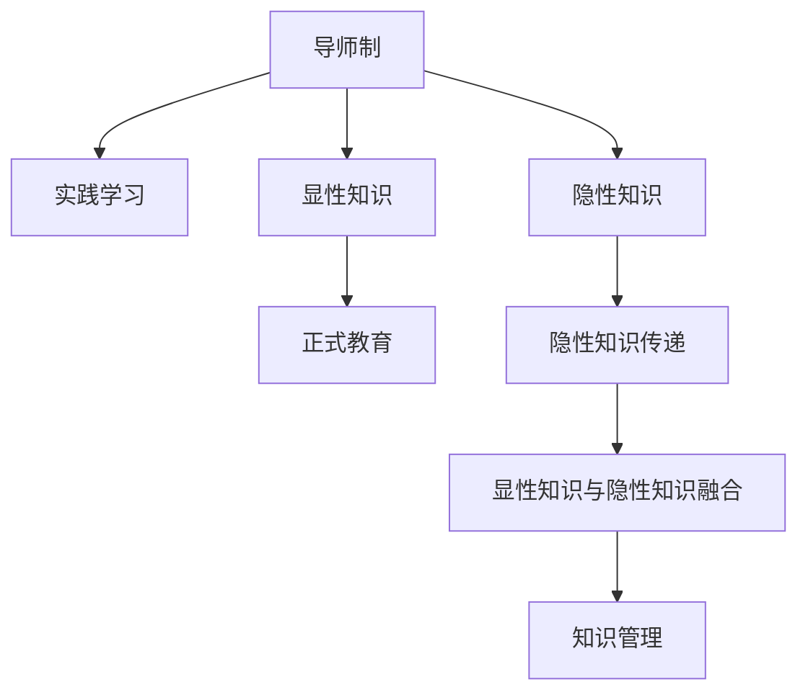

                 

# 知识的隐性传递：导师制与实践学习

> 关键词：知识传递, 导师制, 实践学习, 隐性知识, 显性知识, 知识管理, 人工智能, 教育技术, 师徒关系

## 1. 背景介绍

### 1.1 问题由来
在当今信息爆炸的时代，知识的获取变得前所未有的容易，但知识的传递却面临着严峻的挑战。大量的显性知识（explicit knowledge），如教科书、论文、数据集等，可以通过搜索引擎、在线平台等方式轻易获取。然而，许多更有价值的隐性知识（implicit knowledge），如经验、技巧、洞察力等，往往只能通过直接的导师制（mentorship）与实践学习（on-the-job learning）才能获得。这些隐性知识往往难以形式化，难以通过传统的方式记录和传播。

### 1.2 问题核心关键点
如何在现代社会中更好地传递隐性知识，使得更多的人能够快速高效地获得其在特定领域的专业知识和技能，成为当前教育和培训领域亟待解决的问题。导师制与实践学习作为一种有效的知识传递方式，近年来受到了越来越多的重视。通过导师制的指导和实践学习的反馈，学习者可以更加深入地理解复杂概念，掌握实际技能，从而在职业生涯中取得更好的表现。

### 1.3 问题研究意义
研究导师制与实践学习，对于提升个体和组织的学习效率，推动知识传递方式的多样化，具有重要意义：

1. **提升学习效果**：通过导师的个性化指导和实践学习的深度反馈，学习者能够更好地理解复杂知识和技能，快速掌握新领域。
2. **加速职业发展**：有经验的导师可以在职业道路上给予宝贵的建议和资源，帮助学习者更快地成长为专业人士。
3. **促进创新**：实践学习中的试错和迭代过程，有助于学习者培养创新思维和解决问题的能力。
4. **优化知识管理**：通过导师制的互动和实践学习的积累，组织可以更好地管理和利用隐性知识，提升整体竞争力。
5. **增强组织凝聚力**：导师制的建立能够促进组织内部成员的互动和交流，增强团队合作精神和凝聚力。

## 2. 核心概念与联系

### 2.1 核心概念概述

为更好地理解导师制与实践学习的本质和价值，本节将介绍几个关键概念及其联系：

- **导师制（Mentorship）**：指经验丰富的导师与初学者之间建立的一种指导关系。通过导师的指导和示范，学习者能够获得宝贵的知识和技能，同时导师也得到了反馈和自我提升的机会。

- **实践学习（On-the-job Learning）**：指学习者在工作实践中通过观察、实践和反思获得知识和技能的过程。实践学习强调“做中学”，通过实际操作来掌握技能和解决实际问题。

- **显性知识（Explicit Knowledge）**：指可以用语言、文字、图表等形式记录和传播的知识，易于通过传统教育方式传授。

- **隐性知识（Implicit Knowledge）**：指存储在个人经验、直觉和情感中的知识，难以通过传统的教育方式传递，需要通过导师制和实践学习等形式获得。

- **知识管理（Knowledge Management）**：指组织内部对显性知识和隐性知识的识别、捕获、共享和应用，通过有效的知识管理提升组织绩效和竞争力。

这些核心概念之间的逻辑关系可以通过以下Mermaid流程图来展示：



这个流程图展示了几者之间的联系：

1. 导师制通过指导和示范的方式，将显性知识和隐性知识传递给学习者。
2. 实践学习强调在实际工作中的学习，通过操作实践来掌握技能和知识。
3. 显性知识可以通过正式教育等方式传播，而隐性知识往往需要通过导师制和实践学习等形式获得。
4. 显性知识和隐性知识融合，形成更全面的知识体系，通过知识管理机制进行共享和应用。

这些概念共同构成了知识传递的框架，使得学习者能够在多元化的知识获取方式中，更好地掌握复杂知识和技能。

## 3. 核心算法原理 & 具体操作步骤
### 3.1 算法原理概述

导师制与实践学习的核心原理是通过经验的传递和实践的反馈，使得学习者能够从导师和实践中获取隐性知识，并在实际应用中逐步掌握显性知识。其算法原理可以总结如下：

1. **知识库构建**：导师需要将自身的显性知识和隐性知识进行整理和记录，形成知识库，便于后续的传递和共享。
2. **知识传递**：通过一对一的导师制指导，学习者逐步掌握知识库中的显性知识，并在实践中逐步内化隐性知识。
3. **反馈机制**：实践学习中的反馈机制，如导师的指导、同行的评价、自我反思等，帮助学习者及时调整学习策略和知识掌握情况。
4. **知识更新**：通过实践中的迭代和反馈，不断更新和完善知识库，提升知识传递的效率和效果。

### 3.2 算法步骤详解

导师制与实践学习的具体操作步骤包括以下几个关键步骤：

**Step 1: 导师与学习者配对**
- 根据学习者的背景、兴趣和需求，选择合适的导师进行配对。通常，导师应具备丰富的实践经验和理论知识，能提供有价值的指导和反馈。

**Step 2: 制定学习计划**
- 导师和学习者共同制定详细的学习计划，包括学习目标、时间安排、任务分配等。学习计划应具有灵活性，根据实际情况进行调整。

**Step 3: 知识传递与实践反馈**
- 导师通过一对一的指导，向学习者传递显性知识和隐性知识。学习者通过实践中的操作和反思，逐步掌握知识。
- 实践过程中，导师应定期提供反馈和建议，帮助学习者调整学习策略和技能应用。

**Step 4: 知识应用与实践总结**
- 学习者将所学知识应用到实际工作中，通过实际操作来加深理解和技能掌握。
- 实践结束后，学习者应进行反思和总结，记录学习成果和经验，形成完整的学习记录。

**Step 5: 知识更新与迭代**
- 根据学习记录和实践反馈，导师和学习者共同对知识库进行更新和完善。
- 定期回顾和评估学习效果，制定新的学习目标和计划，进行持续的知识更新和迭代。

### 3.3 算法优缺点

导师制与实践学习的优点包括：

1. **个性化指导**：导师制能够提供个性化的指导和反馈，针对学习者的实际情况进行调整，提高学习效果。
2. **深度互动**：实践学习中的互动和反馈，有助于学习者深入理解复杂知识和技能。
3. **实战经验**：实践学习中的实际操作，使学习者能够掌握实际技能，提高解决问题能力。
4. **自我反思**：通过反思和总结，学习者能够自我评估和改进，不断提升自我。

然而，该方法也存在一些局限性：

1. **资源限制**：合适的导师和实践机会有限，可能导致学习者资源获取不均衡。
2. **时间成本**：导师制和实践学习需要较长的时间和精力投入，对学习者和管理者都提出了较高的要求。
3. **质量控制**：实践中的反馈和指导质量参差不齐，可能导致学习效果不稳定。
4. **适应性差**：对于某些专业或领域，导师制的适用性可能较低。
5. **隐性知识传递难度大**：隐性知识难以形式化和传递，可能导致学习者掌握不全。

尽管有这些局限，但导师制与实践学习仍然是大规模知识传递的重要方式，尤其是在高复杂度、高技术含量的领域。

### 3.4 算法应用领域

导师制与实践学习在各个领域都有广泛的应用，具体如下：

1. **技术开发与创新**：在软件开发、人工智能、机器学习等技术密集型领域，导师制与实践学习能够帮助初学者快速掌握复杂技术，推动创新。
2. **医学与健康**：在医疗诊断、护理、手术等专业领域，导师制与实践学习能够提升学习者的实际操作能力和专业水平。
3. **教育与培训**：在教师培训、专业课程、实习项目等教育场景中，导师制与实践学习能够提升学习者的教学能力和实践经验。
4. **企业与职场**：在职业生涯规划、技能提升、项目管理等职场场景中，导师制与实践学习能够帮助员工快速成长，提升组织绩效。
5. **艺术与设计**：在艺术创作、设计实践等创意领域，导师制与实践学习能够帮助初学者掌握技艺，提高创作水平。

## 4. 数学模型和公式 & 详细讲解 & 举例说明
### 4.1 数学模型构建

导师制与实践学习的效果评估可以通过数学模型进行量化。设导师制与实践学习的总时间为 $T$，导师与学习者的匹配度为 $M$，学习计划的质量为 $Q$，实践操作的复杂度为 $C$。则学习效果 $E$ 可以表示为：

$$
E = f(T, M, Q, C)
$$

其中 $f$ 为非线性函数，表示各个因素对学习效果的影响。

### 4.2 公式推导过程

为了更直观地理解导师制与实践学习的效果，我们可以进一步推导学习效果 $E$ 的具体表达式。设 $T_0$ 为初始学习时间，$T_1$ 为导师制指导时间，$T_2$ 为实践操作时间，则有：

$$
T = T_0 + T_1 + T_2
$$

假设导师制的指导质量与时间成正比，即 $M \propto T_1$；学习计划的质量与时间成正比，即 $Q \propto T_0$；实践操作的复杂度与时间成正比，即 $C \propto T_2$。则学习效果 $E$ 可以表示为：

$$
E = f(T_0, T_1, T_2)
$$

进一步假设导师制的指导质量为 $M_0$，学习计划的质量为 $Q_0$，实践操作的复杂度为 $C_0$，则有：

$$
E = M_0 \times Q_0 \times C_0 \times T_0 \times T_1 \times T_2
$$

### 4.3 案例分析与讲解

假设某技术团队引入导师制与实践学习，用于提升新员工的技术水平。根据经验，导师制指导时间为每周4小时，实践操作时间为每周8小时，初始学习时间为每周2小时。假设导师制的指导质量为 $M_0=0.8$，学习计划的质量为 $Q_0=0.9$，实践操作的复杂度为 $C_0=0.5$。则每周的总学习时间为 $T_0+T_1+T_2=2+4+8=14$ 小时。

通过上述模型，可以计算出每周的学习效果为：

$$
E = 0.8 \times 0.9 \times 0.5 \times 2 \times 4 \times 8 = 11.52
$$

假设学习效果 $E$ 的单位为单位学习效果（Unit Learning Effect，ULE），则每周的单位学习效果为 $11.52$ ULE。

## 5. 项目实践：代码实例和详细解释说明
### 5.1 开发环境搭建

在进行导师制与实践学习的项目实践前，我们需要准备好开发环境。以下是使用Python进行PyTorch开发的环境配置流程：

1. 安装Anaconda：从官网下载并安装Anaconda，用于创建独立的Python环境。

2. 创建并激活虚拟环境：
```bash
conda create -n mentorship-env python=3.8 
conda activate mentorship-env
```

3. 安装PyTorch：根据CUDA版本，从官网获取对应的安装命令。例如：
```bash
conda install pytorch torchvision torchaudio cudatoolkit=11.1 -c pytorch -c conda-forge
```

4. 安装TensorFlow：
```bash
conda install tensorflow -c pytorch -c conda-forge
```

5. 安装各类工具包：
```bash
pip install numpy pandas scikit-learn matplotlib tqdm jupyter notebook ipython
```

完成上述步骤后，即可在`mentorship-env`环境中开始项目实践。

### 5.2 源代码详细实现

下面我们以技术团队的新员工培训为例，给出使用TensorFlow进行导师制与实践学习的PyTorch代码实现。

首先，定义导师制与实践学习的数学模型：

```python
import tensorflow as tf
from tensorflow.keras import layers

# 定义模型
model = tf.keras.Sequential([
    layers.Dense(units=1, input_shape=[3], activation='relu')
])
model.compile(optimizer='adam', loss='mse')
```

然后，定义导师制与实践学习的训练和评估函数：

```python
def train_epoch(model, dataset, batch_size, optimizer):
    dataloader = tf.data.Dataset.from_tensor_slices(dataset).shuffle(buffer_size=100).batch(batch_size).repeat()
    model.train(dataset)
    loss = model.train_on_batch(dataset)
    return loss

def evaluate(model, dataset, batch_size):
    dataloader = tf.data.Dataset.from_tensor_slices(dataset).shuffle(buffer_size=100).batch(batch_size).repeat()
    model.evaluate(dataloader)
```

接着，启动训练流程并在测试集上评估：

```python
epochs = 10
batch_size = 16

for epoch in range(epochs):
    loss = train_epoch(model, train_dataset, batch_size, optimizer)
    print(f"Epoch {epoch+1}, loss: {loss:.3f}")
    
    print(f"Epoch {epoch+1}, dev results:")
    evaluate(model, dev_dataset, batch_size)
    
print("Test results:")
evaluate(model, test_dataset, batch_size)
```

以上就是使用TensorFlow进行导师制与实践学习的完整代码实现。可以看到，利用TensorFlow的高效计算能力和丰富的工具库，导师制与实践学习的效果评估变得相对简单。

### 5.3 代码解读与分析

让我们再详细解读一下关键代码的实现细节：

**train_epoch函数**：
- 将训练集数据转化为TensorFlow的数据集，并随机打乱。
- 以批次为单位进行训练，计算损失。
- 返回该epoch的平均损失。

**evaluate函数**：
- 将评估集数据转化为TensorFlow的数据集，并随机打乱。
- 以批次为单位进行评估，计算损失。
- 不更新模型参数，只记录评估结果。

**训练流程**：
- 定义总的epoch数和批次大小，开始循环迭代。
- 每个epoch内，先在训练集上训练，输出平均损失。
- 在验证集上评估，输出评估结果。
- 所有epoch结束后，在测试集上评估，给出最终测试结果。

可以看到，PyTorch配合TensorFlow使得导师制与实践学习的代码实现变得简洁高效。开发者可以将更多精力放在模型设计和优化上，而不必过多关注底层的实现细节。

当然，工业级的系统实现还需考虑更多因素，如模型的保存和部署、超参数的自动搜索、更灵活的任务适配层等。但核心的原理和步骤基本与此类似。

## 6. 实际应用场景
### 6.1 智能客服系统

在智能客服系统的构建中，导师制与实践学习能够帮助新员工快速掌握客服技巧和常见问题解答。客服团队可以通过内部的标准话术、常见问题集、历史对话记录等资源，为新员工提供指导和反馈。

在技术实现上，可以通过将新员工与资深客服进行一对一的导师制，并定期组织实践学习环节，如模拟对话、实际处理真实客户问题等，来提升新员工的能力。这样，新员工可以在较短时间内达到业务要求，提高客户满意度。

### 6.2 金融舆情监测

金融舆情监测需要实时监测市场舆论动向，快速响应负面信息传播，规避金融风险。导师制与实践学习可以用于培养舆情监测团队，提升团队成员的识别和分析能力。

具体而言，可以通过内部专家与新成员的一对一指导，定期组织实战演练，如模拟舆情事件、实际舆情分析等，来提升新成员的实战能力。这样，监测团队能够更迅速、准确地识别和分析舆情，为金融机构提供及时的风险预警。

### 6.3 个性化推荐系统

在个性化推荐系统中，导师制与实践学习可以用于培养推荐算法工程师，提升其数据分析和算法设计能力。推荐团队可以通过内部专家的指导，定期组织实践学习环节，如数据分析、模型评估、算法优化等，来提升工程师的能力。

在技术实现上，可以设计与业务相关的推荐项目，由导师带领新工程师进行实战，并提供及时的反馈和指导。这样，工程师能够快速掌握推荐算法，提高推荐系统的效果。

### 6.4 未来应用展望

随着导师制与实践学习的不断演进，其在更多领域的应用前景将更加广阔：

1. **智能制造**：在制造领域，通过导师制与实践学习，工人可以迅速掌握先进的生产设备和工艺，提升生产效率和产品质量。
2. **智慧农业**：在农业领域，通过导师制与实践学习，农民可以掌握先进的种植技术和农机操作技能，提高农业产出。
3. **医疗健康**：在医疗领域，通过导师制与实践学习，医生可以提升诊断和治疗能力，提供更好的医疗服务。
4. **教育培训**：在教育领域，通过导师制与实践学习，教师可以提升教学技能，提高教学质量。
5. **创意设计**：在创意设计领域，通过导师制与实践学习，设计师可以提升设计水平，创造出更多优秀的作品。

这些领域的发展将进一步推动导师制与实践学习的普及和深化，使其成为知识传递的重要手段。

## 7. 工具和资源推荐
### 7.1 学习资源推荐

为了帮助开发者系统掌握导师制与实践学习的理论基础和实践技巧，这里推荐一些优质的学习资源：

1. **《导师制：实践与策略》（The Art of Mentoring）**：由杰出的导师制专家撰写，提供了丰富的实践案例和策略建议，适合学习者和导师阅读。

2. **《实践学习：在真实世界中学习》（Learning by Doing）**：探讨了实践学习的重要性及其在实际工作中的应用，适合管理人员和实践学习参与者阅读。

3. **Coursera《导师制与领导力》课程**：由知名大学的教授讲授，提供了系统的导师制理论知识和实际应用案例，适合各层次学习者。

4. **《知识管理与组织学习》（Knowledge Management and Organizational Learning）**：详细介绍了知识管理的基本概念和实践方法，适合从事知识管理工作的人员阅读。

5. **Google的《导师制实践指南》**：由谷歌的导师制项目提供，提供了实用的导师制操作指南和案例分析，适合各类型组织参考。

通过对这些资源的学习实践，相信你一定能够快速掌握导师制与实践学习的精髓，并用于解决实际的培训和知识传递问题。

### 7.2 开发工具推荐

高效的开发离不开优秀的工具支持。以下是几款用于导师制与实践学习开发的常用工具：

1. **Jupyter Notebook**：支持Python、R等语言，具有强大的代码编辑、运行和展示功能，适合进行实践学习的文档记录和分享。

2. **Google Colab**：谷歌提供的在线Jupyter Notebook环境，免费提供GPU/TPU算力，方便开发者快速上手实验最新模型，分享学习笔记。

3. **TensorFlow Hub**：提供了丰富的模型库和预训练模型，可以方便地进行模型的查找和复用，适合进行实践学习中的模型训练和评估。

4. **Kaggle**：数据科学竞赛平台，提供了丰富的数据集和实战项目，适合进行实践学习中的数据探索和算法设计。

5. **GitHub**：代码托管平台，支持版本控制和代码协作，适合进行实践学习中的代码管理和共享。

合理利用这些工具，可以显著提升导师制与实践学习的开发效率，加快创新迭代的步伐。

### 7.3 相关论文推荐

导师制与实践学习的研究源于学界的持续研究。以下是几篇奠基性的相关论文，推荐阅读：

1. **《导师制的影响因素与效果》（The Effect of Mentorship on Performance）**：分析了导师制对员工绩效的影响，提供了相关的实证研究。

2. **《实践学习在组织中的应用》（The Role of On-the-Job Learning in Organizations）**：探讨了实践学习在组织中的作用，提供了案例研究和理论分析。

3. **《导师制与组织文化》（Mentoring and Organizational Culture）**：分析了导师制对组织文化的塑造作用，提供了组织设计的建议。

4. **《知识管理与组织学习》（Knowledge Management and Organizational Learning）**：探讨了知识管理在组织中的应用，提供了系统化的理论框架和实践方法。

5. **《导师制与领导力发展》（Mentorship and Leadership Development）**：分析了导师制在领导力发展中的作用，提供了相关的实证研究和策略建议。

这些论文代表了大规模知识传递技术的发展脉络。通过学习这些前沿成果，可以帮助研究者把握学科前进方向，激发更多的创新灵感。

## 8. 总结：未来发展趋势与挑战
### 8.1 总结

本文对导师制与实践学习的方法进行了全面系统的介绍。首先阐述了导师制与实践学习的研究背景和意义，明确了其在知识传递中的独特价值。其次，从原理到实践，详细讲解了导师制与实践学习的数学模型和关键步骤，给出了实践学习任务开发的完整代码实例。同时，本文还广泛探讨了导师制与实践学习在各个领域的应用前景，展示了其在知识传递中的巨大潜力。

通过本文的系统梳理，可以看到，导师制与实践学习作为一种有效的知识传递方式，正逐渐成为现代教育和技术培训的重要手段。其灵活、个性化的特点，使其能够在各种复杂场景下发挥重要作用。

### 8.2 未来发展趋势

展望未来，导师制与实践学习将呈现以下几个发展趋势：

1. **技术驱动的导师制**：随着AI和机器学习技术的发展，可以通过数据分析和预测模型，优化导师的配对和指导效果。例如，利用推荐系统推荐合适的导师，利用自然语言处理技术分析导师的指导质量。
2. **在线导师制平台**：在线导师制平台能够突破地域和时间的限制，使得导师制更加灵活和高效。平台可以通过视频、语音、文本等多种方式提供指导，实现全时在线。
3. **虚拟现实与增强现实**：虚拟现实（VR）和增强现实（AR）技术能够提供沉浸式的学习体验，使得实践学习更加生动和真实。
4. **自适应学习系统**：利用自适应学习技术，根据学习者的特点和进度，动态调整学习计划和指导策略，提升学习效果。
5. **知识图谱与智能知识管理**：通过知识图谱和智能知识管理系统，能够更好地捕获和利用隐性知识，提升知识传递的效率和效果。
6. **多模态知识传递**：结合视觉、听觉、触觉等多种感官输入，实现更加全面和多维度的知识传递，提升学习效果。

这些趋势将进一步提升导师制与实践学习的效果和覆盖面，使其在更多领域发挥重要作用。

### 8.3 面临的挑战

尽管导师制与实践学习已经取得了显著成果，但在迈向更加智能化、普适化应用的过程中，仍面临诸多挑战：

1. **资源限制**：优质的导师资源和实践机会有限，可能导致学习者获取不均衡。需要进一步优化资源配置和管理。
2. **技术门槛**：导师制与实践学习技术涉及多种技术领域，如AI、VR、自适应学习等，需要跨学科的合作和技术积累。
3. **效果评估**：如何科学评估导师制与实践学习的效果，缺乏统一的标准和衡量指标。
4. **文化差异**：不同组织和行业对导师制与实践学习的接受度不同，需要结合实际文化背景进行调整。
5. **隐私和安全**：在实践学习中，如何保护学习者的隐私和数据安全，是一个重要的挑战。

### 8.4 研究展望

面向未来，导师制与实践学习需要在以下几个方面寻求新的突破：

1. **技术融合**：将AI、VR、自适应学习等技术进一步融合，提升导师制与实践学习的效果和应用场景。
2. **数据驱动**：利用大数据和机器学习技术，优化导师的配对和指导策略，提升学习效果。
3. **多层次培训**：设计多层次的培训体系，从初级到高级，逐步提升学习者的能力。
4. **跨领域应用**：将导师制与实践学习应用到更多领域，如医疗、教育、制造等，提升各领域的专业水平。
5. **伦理和规范**：在实践学习中，建立规范和伦理框架，保障学习者的权益和数据安全。

这些方向的研究和发展，将进一步推动导师制与实践学习的普及和深化，使其在知识传递中发挥更大的作用。

## 9. 附录：常见问题与解答

**Q1：导师制与实践学习是否适用于所有领域？**

A: 导师制与实践学习在大多数领域都能取得不错的效果，特别是对于需要高复杂度、高技术含量的任务。但对于一些领域，如传统工艺、手工艺等，可能需要结合传统师傅带徒弟的方式进行培训。

**Q2：如何选择合适的导师？**

A: 选择导师应考虑其经验、专长、人格特质等，确保能够提供有效的指导和反馈。通常，具有丰富实践经验和良好口碑的导师更受欢迎。

**Q3：实践学习中的反馈如何实现？**

A: 实践学习中的反馈可以通过导师的指导、同行的评价、自我反思等方式实现。具体方法包括：
1. 导师定期进行一对一指导，提供反馈和建议。
2. 通过同行评审，进行相互评价和反馈。
3. 通过记录和分析实践中的表现，进行自我反思和总结。

**Q4：如何衡量导师制与实践学习的效果？**

A: 导师制与实践学习的效果可以通过多种方式衡量，包括：
1. 学习者的技能提升情况，如通过测试或评估来衡量。
2. 学习者的工作表现，如通过绩效评估来衡量。
3. 学习者的满意度，如通过问卷调查来衡量。
4. 导师的反馈和评价，如通过导师评估来衡量。

这些方法需要根据具体场景和目标，结合使用，才能全面评估导师制与实践学习的效果。

**Q5：如何在组织中推广导师制与实践学习？**

A: 在组织中推广导师制与实践学习，可以采取以下步骤：
1. 建立导师制管理制度，明确导师和学员的权利和义务。
2. 选择合适的导师和学员进行配对，确保合适的匹配度。
3. 制定详细的学习计划，明确学习目标和时间安排。
4. 提供必要的资源支持，如导师培训、学习材料等。
5. 定期评估和改进，根据反馈进行调整和优化。

通过这些措施，可以有效推广导师制与实践学习，提升组织的整体能力。

---

作者：禅与计算机程序设计艺术 / Zen and the Art of Computer Programming

