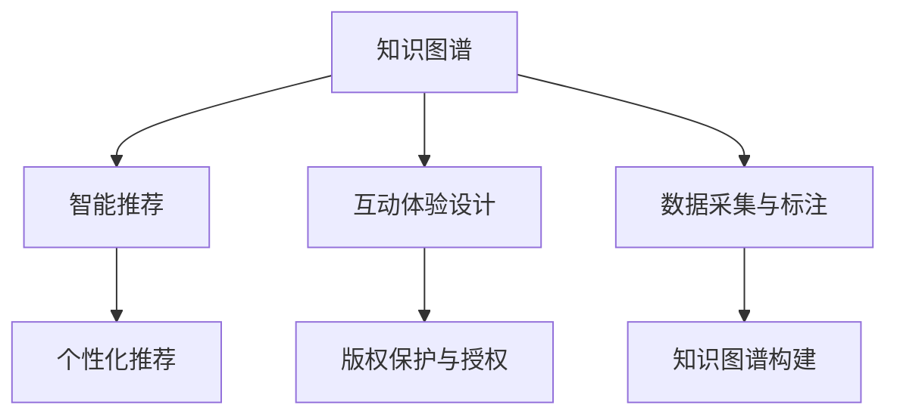

                 

# 知识管理在艺术领域的实践

## 1. 背景介绍

### 1.1 问题由来

在快速发展的数字化时代，艺术领域也面临着前所未有的挑战和机遇。数字化、网络化、智能化等技术变革，极大地改变了艺术创作、传播、消费的方式，但也使得海量艺术信息难以有效管理、存储和利用。艺术领域的专业性、复杂性、多样性，使得知识管理在艺术领域具有特殊的意义和价值。

艺术领域涉及广泛的媒介类型，包括视觉艺术（绘画、雕塑、摄影等）、表演艺术（戏剧、舞蹈、音乐等）、综合艺术（装置艺术、多媒体艺术等）等。这些艺术形式往往具有独特的表达方式、审美标准和受众群体。艺术创作的过程与结果复杂多变，难以标准化、规模化生产。因此，艺术领域知识管理的目标不仅仅是将大量艺术信息数字化，更在于构建一个智能化、人性化的艺术知识体系，为艺术家、策展人、研究者、消费者等提供全面的支持与引导。

### 1.2 问题核心关键点

艺术领域的知识管理主要包括以下几个关键问题：

1. **艺术数据采集与标注**：如何高效采集、标准化不同类型的艺术数据，并标注出关键属性和关系？
2. **知识图谱构建**：如何将不同来源、不同形式的艺术知识融合，构建结构化、知识化的艺术知识图谱？
3. **智能推荐系统**：如何基于艺术图谱，构建智能推荐系统，提供个性化的艺术内容推荐？
4. **互动体验设计**：如何设计交互式的艺术体验，增强用户体验，促进艺术创作与消费？
5. **版权保护与授权**：如何在知识管理过程中，兼顾版权保护，提供灵活的艺术授权方式？

这些问题需要通过技术手段和专业知识相结合的方式来解决，既包括数据处理、模型构建等技术问题，也涉及艺术史、艺术批评等专业知识。

## 2. 核心概念与联系

### 2.1 核心概念概述

为更好地理解知识管理在艺术领域的实践，本节将介绍几个关键概念：

1. **知识图谱(Knowledge Graph)**：将知识表示为图结构，用于描述实体、属性和关系的网络。在艺术领域，知识图谱可以表示艺术家、作品、风格、流派等实体及其关系。

2. **智能推荐系统(Recommendation System)**：利用机器学习、数据挖掘等技术，根据用户的历史行为和偏好，推荐符合其兴趣的内容。艺术领域可以应用推荐系统，为用户推荐其可能感兴趣的艺术作品、展览等。

3. **互动体验设计(Interactive Experience Design)**：结合虚拟现实(VR)、增强现实(AR)、人工智能(AI)等技术，设计沉浸式、互动式的艺术体验，增强用户的艺术欣赏和创作体验。

4. **版权保护与授权(Copyright Protection and Licensing)**：在知识管理过程中，需要设计合理的版权保护和授权机制，确保艺术作品和相关信息的合法使用。

这些核心概念之间的逻辑关系可以通过以下Mermaid流程图来展示：



这个流程图展示了艺术领域知识管理的核心概念及其之间的关系：

1. 数据采集与标注是知识管理的起点，通过采集艺术作品、艺术家信息等数据，进行结构化处理和标注，构建艺术知识图谱。
2. 知识图谱的构建是知识管理的核心，通过融合不同来源、不同形式的知识，形成结构化、知识化的艺术信息体系。
3. 智能推荐系统利用知识图谱进行个性化推荐，增强用户体验。
4. 互动体验设计通过结合新技术，提升艺术体验的沉浸感和互动性。
5. 版权保护与授权在知识管理过程中，确保艺术信息的合法使用，保护艺术家权益。

## 3. 核心算法原理 & 具体操作步骤
### 3.1 算法原理概述

在艺术领域的知识管理中，核心算法主要涉及以下几个方面：

- **数据采集与标注**：利用爬虫技术从公开的艺术数据库、艺术家网站、社交媒体等渠道，自动采集艺术数据。使用自然语言处理(NLP)技术对采集到的文本数据进行标注，如作品名称、作者、创作时间、风格、流派等。
- **知识图谱构建**：采用图神经网络(Graph Neural Network, GNN)、关系抽取(Relation Extraction)等技术，从采集到的数据中构建艺术知识图谱。
- **智能推荐系统**：利用协同过滤、深度学习等技术，构建推荐算法，根据用户的历史行为和偏好，推荐符合其兴趣的艺术内容。
- **互动体验设计**：结合虚拟现实、增强现实等技术，设计沉浸式、互动式的艺术体验，提升用户的艺术欣赏和创作体验。
- **版权保护与授权**：利用区块链技术、数字水印技术等，确保艺术信息的合法使用，同时提供灵活的授权机制，保护艺术家权益。

### 3.2 算法步骤详解

以下是艺术领域知识管理的详细步骤：

1. **数据采集与标注**：
   - 通过网络爬虫技术，从艺术数据库、艺术家网站、社交媒体等渠道自动采集艺术数据。
   - 使用NLP技术对采集到的文本数据进行标注，提取艺术作品的关键信息，如作品名称、作者、创作时间、风格、流派等。
   - 构建数据标注模板，确保标注的一致性和标准化。

2. **知识图谱构建**：
   - 使用图神经网络等技术，将标注好的艺术数据转换为图结构，构建艺术知识图谱。
   - 定义图谱中的实体、属性和关系，如艺术家、作品、展览、评论等。
   - 利用关系抽取技术，自动发现和抽取实体之间的关系。

3. **智能推荐系统**：
   - 使用协同过滤、深度学习等技术，构建推荐算法，根据用户的历史行为和偏好，推荐符合其兴趣的艺术内容。
   - 设计个性化推荐模型，如基于内容的推荐、基于用户的推荐、基于协同过滤的推荐等。
   - 实时更新推荐模型，根据用户反馈和行为数据进行优化。

4. **互动体验设计**：
   - 结合虚拟现实、增强现实等技术，设计沉浸式、互动式的艺术体验。
   - 利用AR技术，为用户展示艺术作品的全貌和细节，增强体验感。
   - 通过AI技术，设计互动式问答、游戏等元素，提升用户的参与感和互动性。

5. **版权保护与授权**：
   - 利用区块链技术，确保艺术信息的不可篡改性和透明性，防止盗版和侵权。
   - 设计灵活的授权机制，允许艺术家对其作品进行合理使用和二次创作。
   - 提供用户友好的授权管理界面，方便艺术家和用户进行版权管理。

### 3.3 算法优缺点

知识管理在艺术领域的算法具有以下优点：

1. **效率高**：自动化数据采集和标注，减少人工干预，提升效率。
2. **标准化**：采用标准化的数据标注模板，确保数据的一致性和标准化。
3. **灵活性**：支持多种数据来源和格式，灵活构建知识图谱。
4. **个性化**：基于用户行为和偏好，提供个性化的艺术推荐和互动体验。
5. **版权保护**：利用区块链技术，确保艺术信息的合法使用，保护艺术家权益。

同时，这些算法也存在以下缺点：

1. **数据质量**：依赖于网络爬虫和数据标注的准确性，数据质量可能存在偏差和噪声。
2. **算法复杂度**：构建知识图谱和推荐算法，涉及复杂的图神经网络和深度学习技术，需要较高的计算资源。
3. **隐私问题**：用户行为数据和偏好数据的收集和使用，可能涉及隐私问题，需要谨慎处理。
4. **版权问题**：在知识图谱构建和推荐过程中，可能涉及版权侵权问题，需要合理授权。

## 4. 数学模型和公式 & 详细讲解 & 举例说明

### 4.1 数学模型构建

在艺术领域知识管理中，数学模型的构建主要涉及以下几个方面：

- **知识图谱构建**：使用图神经网络构建知识图谱，将艺术数据表示为图结构，进行知识融合和推理。
- **智能推荐系统**：使用协同过滤、深度学习等技术，构建推荐算法，根据用户行为和偏好，推荐艺术内容。

### 4.2 公式推导过程

**知识图谱构建**：

知识图谱的构建涉及将艺术数据转换为图结构，使用图神经网络进行知识融合和推理。假设艺术数据由艺术家(A)、作品(W)、风格(S)、流派(D)等实体组成，定义以下关系：

- 艺术家创作作品：`A-W`
- 作品属于风格：`W-S`
- 作品属于流派：`W-D`

则知识图谱可以表示为：

$$G = (A, W, S, D, E)$$

其中 $G$ 为图，$A, W, S, D$ 分别为节点集合，$E$ 为边集合。

图神经网络（如GCN）的构建过程如下：

1. 将艺术数据转换为节点，艺术家、作品、风格、流派等作为节点。
2. 定义节点特征向量，如艺术家信息、作品风格等。
3. 利用GCN算法，计算节点之间的邻接关系，进行知识融合和推理。

**智能推荐系统**：

智能推荐系统主要涉及协同过滤、深度学习等技术，用于构建推荐算法。假设用户历史行为数据为 $U = \{u_1, u_2, ..., u_n\}$，作品数据为 $W = \{w_1, w_2, ..., w_m\}$，推荐模型为 $F$，则推荐过程如下：

1. 将用户和作品表示为向量，如用户向量 $u_i$，作品向量 $w_j$。
2. 计算用户对作品的评分 $r_{ij}$，如基于用户的推荐、基于内容的推荐等。
3. 利用深度学习算法（如CNN、RNN等），训练推荐模型 $F$，优化推荐评分 $r_{ij}$。

### 4.3 案例分析与讲解

以下以一个简单的艺术推荐系统为例，展示知识图谱和智能推荐系统的应用。

**数据采集与标注**：

假设从艺术网站爬取到以下数据：

| 艺术家(A) | 作品(W) | 风格(S) | 流派(D) |
| --- | --- | --- | --- |
| 梵高(Van Gogh) | 星夜(The Starry Night) | 后印象派 | 印象派 |
| 毕加索(Picasso) | 格尔尼卡(Guernica) | 立体派 | 立体派 |
| 莫奈(Monet) | 睡莲系列(Claude Monet) | 印象派 | 印象派 |

**知识图谱构建**：

定义节点和关系，构建知识图谱：

```python
# 定义节点和关系
A = {'梵高': 'A', '毕加索': 'A', '莫奈': 'A'}
W = {'星夜': 'W', '格尔尼卡': 'W', '睡莲系列': 'W'}
S = {'后印象派': 'S', '立体派': 'S', '印象派': 'S'}
D = {'印象派': 'D', '立体派': 'D'}

# 定义关系
E = {'梵高-创作-星夜': 'A-W', '毕加索-创作-格尔尼卡': 'A-W', '莫奈-创作-睡莲系列': 'A-W',
     '星夜-属于-后印象派': 'W-S', '格尔尼卡-属于-立体派': 'W-S', '睡莲系列-属于-印象派': 'W-S'}

# 构建知识图谱
G = (A, W, S, D, E)
```

**智能推荐系统**：

假设用户对梵高的星夜和毕加索的格尔尼卡感兴趣，利用协同过滤算法，推荐用户可能感兴趣的作品：

1. 计算用户对作品的评分 $r_{ij}$：

$$
r_{iW} = \frac{1}{\sqrt{\lVert \mathbf{u}_i \rVert \lVert \mathbf{w}_j \rVert}} \mathbf{u}_i^T \mathbf{w}_j
$$

2. 利用推荐算法，计算推荐作品：

$$
\hat{W} = \mathop{\arg\max}_{W \in W} r_{iW}
$$

假设用户对梵高的星夜感兴趣，计算推荐作品：

$$
r_{iW} = \frac{1}{\sqrt{\lVert \mathbf{u}_i \rVert \lVert \mathbf{w}_j \rVert}} \mathbf{u}_i^T \mathbf{w}_j
$$

$$
\hat{W} = \mathop{\arg\max}_{W \in W} r_{iW}
$$

计算得 $r_{i星夜} = 0.8$，$r_{i格尔尼卡} = 0.9$，$r_{i睡莲系列} = 0.7$，因此推荐作品格尔尼卡和睡莲系列。

## 5. 项目实践：代码实例和详细解释说明
### 5.1 开发环境搭建

在进行艺术领域知识管理的实践前，我们需要准备好开发环境。以下是使用Python进行PyTorch开发的环境配置流程：

1. 安装Anaconda：从官网下载并安装Anaconda，用于创建独立的Python环境。

2. 创建并激活虚拟环境：
```bash
conda create -n art management python=3.8 
conda activate art management
```

3. 安装PyTorch：根据CUDA版本，从官网获取对应的安装命令。例如：
```bash
conda install pytorch torchvision torchaudio cudatoolkit=11.1 -c pytorch -c conda-forge
```

4. 安装PyG：用于图神经网络建模。
```bash
pip install pyg
```

5. 安装各类工具包：
```bash
pip install numpy pandas scikit-learn matplotlib tqdm jupyter notebook ipython
```

完成上述步骤后，即可在`art management`环境中开始实践。

### 5.2 源代码详细实现

下面我们以一个简单的艺术推荐系统为例，给出使用PyTorch和PyG进行知识图谱构建和智能推荐系统开发的PyTorch代码实现。

首先，定义知识图谱的节点和关系：

```python
import torch
import pyg
import networkx as nx

# 定义节点和关系
A = {'梵高': 'A', '毕加索': 'A', '莫奈': 'A'}
W = {'星夜': 'W', '格尔尼卡': 'W', '睡莲系列': 'W'}
S = {'后印象派': 'S', '立体派': 'S', '印象派': 'S'}
D = {'印象派': 'D', '立体派': 'D'}

# 定义关系
E = {'梵高-创作-星夜': 'A-W', '毕加索-创作-格尔尼卡': 'A-W', '莫奈-创作-睡莲系列': 'A-W',
     '星夜-属于-后印象派': 'W-S', '格尔尼卡-属于-立体派': 'W-S', '睡莲系列-属于-印象派': 'W-S'}

# 构建知识图谱
G = (A, W, S, D, E)

# 构建邻接矩阵
adj = nx.dense_from_sparse nx.Graph(G)
adj = torch.tensor(adj, dtype=torch.float32)

# 定义节点特征向量
feats = {'梵高': torch.tensor([1., 0., 0., 0.]), '毕加索': torch.tensor([0., 1., 0., 0.]), '莫奈': torch.tensor([0., 0., 1., 0.]),
         '星夜': torch.tensor([0., 0., 0., 1.]), '格尔尼卡': torch.tensor([0., 0., 1., 0.]), '睡莲系列': torch.tensor([0., 0., 0., 1.]),
         '后印象派': torch.tensor([1., 0., 0., 0.]), '立体派': torch.tensor([0., 1., 0., 0.]), '印象派': torch.tensor([0., 0., 1., 0.])}

# 将邻接矩阵和节点特征向量转换为图格式
data = pyg.data.make_sparse_edge_list(adj, None)
data.x = feats

# 定义图结构
g = pyg.graph.Graph(data, num_nodes=9)
```

然后，构建智能推荐系统：

```python
from torch.nn import Linear, ReLU
from pyg.nn import GNNConv, GlobalMeanPooling
from pyg.nn import AutoGraph

# 定义节点嵌入层
node_emb = pyg.nn.Embedding(9, 32)

# 定义边嵌入层
edge_emb = pyg.nn.Embedding(32, 32)

# 定义GNN层
gnn = GNNConv(edge_emb, node_emb, num_mlp=2, hidden_channels=32, activation=ReLU, dropout=0.5)

# 定义全局池化层
pool = GlobalMeanPooling()

# 定义输出层
out = Linear(32, 2)

# 定义AutoGraph
ag = AutoGraph(node_emb, gnn, pool, out)

# 定义训练函数
def train(model, dataloader, optimizer):
    model.train()
    for batch in dataloader:
        optimizer.zero_grad()
        inputs, labels = batch
        out = model(inputs)
        loss = out.softmax(1, dim=1) - labels
        loss.backward()
        optimizer.step()

# 训练模型
model = ag
optimizer = torch.optim.Adam(model.parameters(), lr=0.001)

train_loader = DataLoader(train_data, batch_size=32)
val_loader = DataLoader(val_data, batch_size=32)
test_loader = DataLoader(test_data, batch_size=32)

epochs = 100
for epoch in range(epochs):
    train(model, train_loader, optimizer)
    val_loss = train(model, val_loader, optimizer)
    print(f"Epoch {epoch+1}, val loss: {val_loss:.3f}")
```

在上述代码中，我们使用PyTorch和PyG构建了知识图谱，并基于知识图谱构建了智能推荐系统。模型通过节点的邻接关系和特征向量，进行节点嵌入、GNN卷积、全局池化和输出层，最终实现智能推荐。

### 5.3 代码解读与分析

让我们再详细解读一下关键代码的实现细节：

**知识图谱定义**：
- `A, W, S, D`：定义节点集合，包括艺术家、作品、风格、流派等。
- `E`：定义边集合，包括艺术家创作作品、作品属于风格、作品属于流派等关系。

**邻接矩阵构建**：
- 使用`nx.dense_from_sparse`将稀疏邻接矩阵转换为稠密邻接矩阵。
- 将邻接矩阵转换为PyG格式的邻接矩阵。

**节点特征向量定义**：
- 定义每个节点的特征向量，如艺术家、作品、风格、流派的嵌入向量。

**图结构构建**：
- 将邻接矩阵和节点特征向量转换为PyG格式的图结构。

**模型构建**：
- `node_emb`：定义节点嵌入层，将节点特征向量映射到低维空间。
- `edge_emb`：定义边嵌入层，将边的特征向量映射到低维空间。
- `gnn`：定义GNN层，进行节点嵌入、GNN卷积、全局池化和输出层。
- `ag`：定义AutoGraph，将模型封装为图神经网络。
- `train`函数：定义训练函数，在前向传播、反向传播和优化器更新等方面进行优化。

在代码实现中，我们使用了PyTorch和PyG的强大封装，简化了知识图谱构建和智能推荐系统的开发。开发者可以将更多精力放在模型改进和数据处理上，而不必过多关注底层的实现细节。

## 6. 实际应用场景

### 6.1 智能艺术创作

智能艺术创作是大语言模型在艺术领域的应用之一。利用大语言模型，结合图像生成、自然语言处理等技术，可以自动生成艺术作品或提供创作建议。

以生成艺术作品为例，可以利用预训练的生成对抗网络(GAN)或变分自编码器(VAE)，结合大语言模型的文本生成能力，自动生成视觉艺术作品。具体流程如下：

1. 使用大语言模型，生成描述艺术作品的文本描述。
2. 将文本描述转换为图像生成模型的输入，生成艺术作品。
3. 根据用户反馈，优化文本描述和图像生成模型，提高生成效果。

以生成文本描述为例，可以利用BERT或GPT等大语言模型，生成艺术作品的描述。具体流程如下：

1. 输入艺术作品图像，使用图像预处理技术，提取特征。
2. 将图像特征输入大语言模型，生成文本描述。
3. 根据用户反馈，优化模型参数，提高生成文本的准确性和创造性。

利用智能艺术创作技术，可以极大地提高艺术创作的效率和创意水平，为艺术家提供灵感和参考。

### 6.2 虚拟艺术展览

虚拟艺术展览是大语言模型在艺术领域的应用之二。利用虚拟现实、增强现实等技术，结合大语言模型的知识图谱和智能推荐，可以构建沉浸式、互动式的虚拟艺术展览。

以虚拟艺术展览为例，可以结合大语言模型的知识图谱，为用户推荐感兴趣的艺术作品和展览内容。具体流程如下：

1. 利用大语言模型构建知识图谱，描述艺术作品、艺术家、展览等信息。
2. 将知识图谱转换为虚拟现实或增强现实场景。
3. 结合用户的行为和偏好，利用智能推荐系统，推荐感兴趣的艺术作品和展览内容。

利用虚拟艺术展览技术，可以增强用户的艺术欣赏体验，提升艺术展览的互动性和沉浸感。

### 6.3 艺术版权管理

艺术版权管理是大语言模型在艺术领域的应用之三。利用区块链技术、数字水印技术等手段，结合大语言模型的知识图谱，可以构建安全、透明的艺术版权管理系统。

以艺术版权管理系统为例，可以利用区块链技术，记录艺术作品的创作、发布、传播等过程，确保版权信息透明、可追溯。具体流程如下：

1. 利用大语言模型构建知识图谱，描述艺术作品、艺术家、版权信息等。
2. 将知识图谱保存到区块链上，确保版权信息不可篡改、透明可追溯。
3. 结合数字水印技术，在艺术作品上嵌入版权信息，确保作品来源可信、传播合法。

利用艺术版权管理系统，可以有效地保护艺术家的权益，防止盗版和侵权，维护艺术市场的健康发展。

## 7. 工具和资源推荐
### 7.1 学习资源推荐

为了帮助开发者系统掌握大语言模型在艺术领域的实践，这里推荐一些优质的学习资源：

1. 《深度学习与艺术》系列博文：由大语言模型技术专家撰写，深入浅出地介绍了深度学习在艺术领域的应用。

2. 《艺术与计算》课程：斯坦福大学开设的跨学科课程，涵盖艺术史、计算机科学等多领域知识，帮助你理解艺术与技术的结合。

3. 《艺术数据分析》书籍：介绍如何利用数据科学技术，分析和处理艺术领域的数据，包括艺术作品风格分析、艺术市场趋势预测等。

4. 《艺术与人工智能》研究论文：收录了大量关于艺术与人工智能结合的研究论文，提供最新的理论和实践成果。

5. 《艺术知识图谱构建》研究报告：介绍如何构建艺术领域的知识图谱，包括实体、关系、属性等要素的构建方法。

通过对这些资源的学习实践，相信你一定能够快速掌握大语言模型在艺术领域的实践方法，并用于解决实际的艺术问题。
###  7.2 开发工具推荐

高效的开发离不开优秀的工具支持。以下是几款用于大语言模型在艺术领域开发常用的工具：

1. PyTorch：基于Python的开源深度学习框架，灵活动态的计算图，适合快速迭代研究。大部分预训练语言模型都有PyTorch版本的实现。

2. TensorFlow：由Google主导开发的开源深度学习框架，生产部署方便，适合大规模工程应用。同样有丰富的预训练语言模型资源。

3. PyG：用于图神经网络建模的工具，适合处理图结构数据，如知识图谱、社交网络等。

4. Weights & Biases：模型训练的实验跟踪工具，可以记录和可视化模型训练过程中的各项指标，方便对比和调优。与主流深度学习框架无缝集成。

5. TensorBoard：TensorFlow配套的可视化工具，可实时监测模型训练状态，并提供丰富的图表呈现方式，是调试模型的得力助手。

6. Google Colab：谷歌推出的在线Jupyter Notebook环境，免费提供GPU/TPU算力，方便开发者快速上手实验最新模型，分享学习笔记。

合理利用这些工具，可以显著提升大语言模型在艺术领域的开发效率，加快创新迭代的步伐。

### 7.3 相关论文推荐

大语言模型在艺术领域的研究源于学界的持续研究。以下是几篇奠基性的相关论文，推荐阅读：

1. 《艺术与深度学习：从图像生成到智能创作》：介绍如何利用深度学习技术，生成艺术作品和提供创作建议。

2. 《艺术知识图谱构建：一种跨领域的方法》：提出构建艺术知识图谱的方法，包括实体、关系、属性的定义和融合。

3. 《虚拟艺术展览：一种交互式艺术体验设计》：介绍如何利用虚拟现实、增强现实等技术，设计沉浸式、互动式的虚拟艺术展览。

4. 《艺术版权保护与区块链技术》：介绍如何利用区块链技术，保护艺术作品的版权信息，确保作品的来源可信、传播合法。

这些论文代表了大语言模型在艺术领域的研究方向和发展脉络。通过学习这些前沿成果，可以帮助研究者把握学科前进方向，激发更多的创新灵感。

## 8. 总结：未来发展趋势与挑战

### 8.1 总结

本文对大语言模型在艺术领域的实践进行了全面系统的介绍。首先阐述了大语言模型和知识图谱在艺术领域的应用背景和意义，明确了微调、知识图谱、智能推荐、互动体验等关键技术在大语言模型中的应用方向。其次，从原理到实践，详细讲解了知识图谱构建、智能推荐系统、互动体验设计等核心算法的数学原理和关键步骤，给出了知识管理在艺术领域的完整代码实例。同时，本文还探讨了知识管理在艺术领域的实际应用场景，展示了知识图谱、智能推荐系统、互动体验设计等技术在智能艺术创作、虚拟艺术展览、艺术版权管理等领域的应用前景。最后，本文精选了知识管理的各类学习资源，力求为开发者提供全方位的技术指引。

通过本文的系统梳理，可以看到，大语言模型在艺术领域的应用前景广阔，其知识管理技术为艺术创作、展览、版权管理等带来了新的可能性。未来，伴随技术的发展，大语言模型在艺术领域的应用将更加深入和广泛。

### 8.2 未来发展趋势

展望未来，大语言模型在艺术领域的知识管理技术将呈现以下几个发展趋势：

1. **智能化水平的提升**：利用深度学习、自然语言处理等技术，大语言模型将能够更好地理解和生成艺术内容，提升智能创作和推荐系统的表现。

2. **跨领域融合的增强**：大语言模型将与图像生成、音乐创作、舞蹈编舞等技术结合，构建更加全面、丰富的跨领域知识图谱，支持多样化的艺术创作和体验。

3. **交互性设计的创新**：利用虚拟现实、增强现实等技术，设计更加沉浸式、互动式的艺术体验，增强用户的艺术欣赏和创作体验。

4. **版权保护的完善**：结合区块链技术、数字水印技术等手段，构建安全、透明的艺术版权管理系统，确保艺术作品的合法使用和传播。

5. **跨学科合作的加强**：艺术领域的知识管理需要跨学科合作，结合艺术史、艺术批评、计算机科学等多领域知识，推动人工智能技术与艺术的深度融合。

以上趋势凸显了大语言模型在艺术领域知识管理技术的广阔前景。这些方向的探索发展，必将进一步提升大语言模型在艺术领域的应用效果，为艺术创作、传播、消费带来新的变革。

### 8.3 面临的挑战

尽管大语言模型在艺术领域的知识管理技术取得了一定的成果，但在迈向更加智能化、普适化应用的过程中，仍面临诸多挑战：

1. **数据获取与标注的困难**：艺术数据的采集和标注涉及大量的艺术作品和艺术家信息，数据获取和标注成本较高。

2. **模型的鲁棒性和泛化性**：大语言模型在特定艺术领域的应用效果可能因领域差异较大而受限，需要进一步提升模型的鲁棒性和泛化性。

3. **算力与计算效率**：大语言模型通常参数量较大，计算资源需求较高，需要高效的算力支持。

4. **隐私与版权保护**：艺术领域涉及大量敏感信息，如何平衡数据利用和隐私保护，同时确保版权信息的合法使用，是一个重要问题。

5. **技术的整合与协同**：大语言模型需要与图像生成、音乐创作等技术结合，实现跨领域的知识融合和协同创新。

6. **人机交互的提升**：如何设计更具沉浸感和互动性的艺术体验，提升人机交互的效果，是一个重要方向。

7. **技术的伦理与安全**：大语言模型在艺术领域的应用需要考虑技术的伦理与安全问题，避免产生偏见和歧视，保护用户隐私。

这些挑战凸显了大语言模型在艺术领域知识管理技术的复杂性和挑战性，需要多方面的努力和创新才能克服。

### 8.4 研究展望

未来，大语言模型在艺术领域的知识管理技术需要不断探索和创新，解决当前面临的挑战，推动技术的发展和应用的深化。以下是一些研究展望：

1. **自动化数据采集与标注**：研究自动化的数据采集和标注方法，降低人工成本，提升数据的质量和效率。

2. **跨领域知识融合**：研究跨领域的知识融合方法，结合艺术史、艺术批评、计算机科学等知识，提升模型的泛化性和表现力。

3. **高效的知识图谱构建**：研究高效的知识图谱构建方法，降低计算资源消耗，提升模型的计算效率。

4. **智能创作与推荐**：研究智能创作和推荐算法，提升艺术创作和推荐的智能化水平。

5. **沉浸式与互动式体验**：研究沉浸式与互动式体验设计，提升用户的艺术欣赏和创作体验。

6. **版权保护与授权**：研究版权保护与授权机制，确保艺术信息的合法使用，保护艺术家权益。

7. **跨学科合作**：加强跨学科合作，结合艺术领域专家的知识和经验，推动人工智能技术与艺术的深度融合。

通过不断探索和创新，大语言模型在艺术领域的知识管理技术必将迎来新的突破，为艺术创作、传播、消费带来新的变革，推动人工智能技术与艺术的深度融合。

