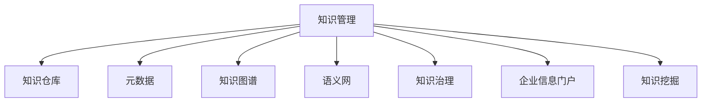

                 

# 知识管理技术：知识管理的基石

## 1. 背景介绍

### 1.1 问题由来

在当前快速发展的信息时代，知识和信息成为了企业和组织最宝贵的资产之一。但同时，知识的快速增长和复杂性也给知识的管理和使用带来了巨大的挑战。传统的知识管理方式已经无法满足日益增长的需求，知识管理的瓶颈问题亟待解决。

### 1.2 问题核心关键点

知识管理的核心在于如何高效地组织、检索和利用知识，使知识能够真正转化为生产力和创新力。当前的知识管理方式存在以下问题：

1. **知识孤岛**：不同部门、系统、平台之间的知识难以互通，形成了“信息孤岛”。
2. **知识重复**：相似或重复的知识在多个系统中分散保存，增加了维护成本。
3. **知识更新慢**：知识库的更新周期长，无法实时反映最新的知识变化。
4. **知识利用率低**：大量知识被锁在系统中，难以被员工发现和使用。

为了解决这些问题，需要一个能够跨系统、跨部门、跨平台高效整合和管理知识的技术，这就是知识管理技术。

### 1.3 问题研究意义

掌握知识管理技术，对于提高企业的知识利用率，加速企业数字化转型，增强企业的创新能力和竞争力，具有重要意义：

1. **提升效率**：通过知识管理技术，可以快速定位和获取知识，减少搜索和查找的时间，提高工作效率。
2. **降低成本**：通过统一的知识库，避免了知识冗余和重复投资，降低了知识管理的维护成本。
3. **促进创新**：知识管理技术帮助企业更好地发现和利用知识，促进知识创新和业务创新。
4. **增强竞争力**：高效的知识管理和利用，使企业在市场竞争中占据优势。
5. **支持智能决策**：基于知识的决策系统，能够提供更加全面、准确的信息支持，提升决策质量。

## 2. 核心概念与联系

### 2.1 核心概念概述

为更好地理解知识管理技术，本节将介绍几个密切相关的核心概念：

- **知识管理(Knowledge Management, KM)**：指对企业的知识资源进行系统化、结构化管理，包括知识的获取、存储、组织、检索、共享和应用等各个环节，以提高知识的利用率和转化效率。
- **知识仓库(Knowledge Repository)**：用于存储和管理企业知识的系统，通常包含元数据、文档、图片、视频等多种类型的数据。
- **元数据(Metadata)**：描述知识内容的属性信息，如作者、日期、版本、类别等，帮助用户快速识别和检索知识。
- **知识图谱(Knowledge Graph)**：通过图形化的方式展示知识之间的关联关系，使知识的结构和层次更加直观。
- **语义网(Semantic Web)**：利用语义技术，将知识转化为计算机能够理解和处理的结构化数据，方便机器的自动学习和推理。
- **知识治理(Knowledge Governance)**：指对知识管理的策略、标准、流程进行定义和管理，确保知识管理活动的有效执行。
- **企业信息门户(Enterprise Information Portal, EIP)**：将企业内部的知识库、文档、应用等集中展示和访问的门户平台。
- **知识挖掘(Knowledge Mining)**：利用数据挖掘技术，从大量数据中发现知识模式和规律，提升知识的价值和应用。

这些核心概念之间的逻辑关系可以通过以下Mermaid流程图来展示：



这个流程图展示了几大核心概念及其之间的关系：

1. 知识管理是整个知识管理的核心，通过知识仓库、元数据、知识图谱、语义网、知识治理、企业信息门户和知识挖掘等多个环节共同支持，完成知识的存储、管理和应用。
2. 知识仓库是知识管理的存储中心，通过元数据进行知识结构的描述。
3. 知识图谱和语义网通过图形化和语义技术，帮助知识仓库中的知识进行结构化和关联化。
4. 知识治理提供知识管理的策略和流程，确保知识管理的有效性。
5. 企业信息门户集中展示和管理知识，方便知识检索和共享。
6. 知识挖掘利用数据挖掘技术，从大量数据中提取和发现知识。

这些概念共同构成了知识管理的体系框架，使知识管理成为企业信息化建设的重要组成部分。

## 3. 核心算法原理 & 具体操作步骤
### 3.1 算法原理概述

知识管理技术的核心算法是面向知识的搜索、推荐、整合和应用等各个环节的算法。以下将详细介绍这些算法的原理和具体操作步骤。

### 3.2 算法步骤详解

#### 3.2.1 知识检索算法

知识检索算法用于从知识仓库中快速查找相关的知识。常见的知识检索算法包括：

1. **布尔检索**：通过关键词匹配，返回包含特定关键词的文档。
2. **向量空间模型(Vector Space Model, VSM)**：将文档和查询表示为向量，计算向量间的相似度。
3. **隐含语义分析(Latent Semantic Analysis, LSA)**：通过奇异值分解(SVD)将文本和查询映射到低维空间，计算相似度。
4. **语义网络(Semantic Network)**：利用知识图谱中的语义关系，进行知识匹配。
5. **基于本体的检索(Ontology-based Retrieval)**：利用本体知识对知识进行分类和推理，返回符合特定条件的知识。

具体操作步骤如下：

1. **构建索引**：将知识仓库中的文档和元数据建立索引，生成倒排索引表。
2. **文本预处理**：对查询进行分词、去除停用词、词干提取等预处理操作。
3. **查询表达**：将查询转化为向量表示，并进行加权处理。
4. **相似度计算**：计算查询向量和文档向量之间的相似度，选择相似度高的文档返回。

#### 3.2.2 知识推荐算法

知识推荐算法用于根据用户的历史行为和兴趣，推荐相关的知识。常见的知识推荐算法包括：

1. **协同过滤(Collaborative Filtering)**：通过用户历史行为数据，找到与当前用户兴趣相似的群体，推荐该群体的知识。
2. **基于内容的推荐(Content-based Recommendation)**：通过分析知识内容的特征，推荐与用户兴趣匹配的知识。
3. **混合推荐(Mixed Recommendation)**：综合协同过滤和内容推荐的方法，提供更准确的推荐。
4. **矩阵分解(Matrix Factorization)**：利用矩阵分解技术，将用户行为矩阵分解为用户和知识表示，计算用户对知识的评分，推荐高评分的知识。

具体操作步骤如下：

1. **数据收集**：收集用户的历史行为数据和知识元数据。
2. **特征提取**：从知识元数据中提取特征，如主题、类别、作者等。
3. **相似性计算**：计算用户和知识之间的相似度，包括基于内容的相似性和基于协同的相似性。
4. **推荐排序**：根据相似度计算结果，对知识进行排序，返回推荐结果。

#### 3.2.3 知识整合算法

知识整合算法用于将分散在不同系统、平台上的知识进行集中和整合。常见的知识整合算法包括：

1. **元数据映射(Metadata Mapping)**：通过元数据的对齐和转换，将不同知识仓库中的元数据进行统一。
2. **知识抽取(Information Extraction)**：利用自然语言处理技术，从非结构化数据中抽取结构化知识。
3. **数据同步(Data Synchronization)**：通过数据同步技术，将不同系统的数据进行同步和整合。
4. **知识联邦(Federated Knowledge)**：通过联邦技术，将分布在不同平台上的知识进行联合计算和推理。

具体操作步骤如下：

1. **数据采集**：从不同的系统和平台采集知识数据。
2. **元数据对齐**：通过元数据映射技术，对齐不同知识仓库的元数据。
3. **知识抽取**：利用自然语言处理技术，抽取文本中的结构化知识。
4. **数据同步**：通过数据同步技术，将不同系统中的数据进行同步和整合。
5. **知识推理**：利用知识图谱技术，进行知识推理和关联。

#### 3.2.4 知识应用算法

知识应用算法用于将知识转化为具体的业务应用，提高企业的业务能力和决策能力。常见的知识应用算法包括：

1. **知识决策(Knowledge-based Decision Making)**：通过知识推理和决策支持系统，辅助企业进行决策。
2. **知识挖掘(Knowledge Mining)**：利用数据挖掘技术，从知识库中发现知识模式和规律。
3. **知识生成(Generative Knowledge)**：通过生成对抗网络(Generative Adversarial Networks, GANs)等技术，生成新的知识。
4. **知识可视化(Knowledge Visualization)**：通过图表、仪表盘等形式，将知识直观展示给用户。

具体操作步骤如下：

1. **数据输入**：将业务数据和知识数据输入知识应用系统。
2. **知识推理**：利用知识推理技术，进行知识推理和计算。
3. **决策支持**：通过决策支持系统，辅助业务决策。
4. **知识挖掘**：利用数据挖掘技术，发现知识模式和规律。
5. **知识生成**：利用生成对抗网络等技术，生成新的知识。
6. **知识可视化**：通过可视化技术，将知识直观展示给用户。

### 3.3 算法优缺点

知识管理技术通过面向知识的搜索、推荐、整合和应用等各个环节的算法，实现了知识的系统化管理。该技术的主要优点包括：

1. **高效检索**：利用先进的搜索算法，能够快速定位和获取知识，提高工作效率。
2. **智能推荐**：通过智能推荐算法，能够根据用户兴趣和行为，推荐相关知识。
3. **知识整合**：利用知识整合算法，将分散在不同系统、平台上的知识进行集中和整合，避免知识孤岛。
4. **应用广泛**：知识管理技术可以应用于企业内部的各个业务领域，支持智能决策和业务创新。

同时，该技术也存在一些缺点：

1. **数据质量依赖**：知识管理的质量依赖于输入的数据质量，数据不准确或不完整会影响知识管理的精度。
2. **复杂度高**：知识管理涉及的环节和算法较多，实现复杂度较高。
3. **资源消耗大**：知识管理需要大量的计算资源和存储空间，系统构建和维护成本较高。
4. **更新困难**：知识管理系统的更新和维护需要专业知识和技术支持，一般企业难以自行实现。

尽管存在这些缺点，但知识管理技术通过多方面的技术手段和策略，克服了传统知识管理的局限性，为企业的知识管理和应用提供了有力的支撑。

### 3.4 算法应用领域

知识管理技术在多个领域得到了广泛应用，以下是几个典型应用场景：

#### 3.4.1 企业内部

企业内部的知识管理技术主要应用于以下几个方面：

1. **知识库建设**：建立企业内部的知识库，存储和管理企业的各类知识，如技术文档、项目管理知识、产品设计知识等。
2. **知识分享平台**：构建企业内部的知识分享平台，方便员工在线分享和协作。
3. **知识检索系统**：实现基于知识检索的搜索系统，快速定位和获取相关知识。
4. **知识推荐系统**：构建知识推荐系统，根据用户兴趣和行为，推荐相关知识。
5. **知识地图**：构建企业内部的知识地图，显示知识之间的关联关系，帮助用户快速查找相关知识。

#### 3.4.2 医疗领域

知识管理技术在医疗领域主要应用于以下几个方面：

1. **医学知识管理**：建立医学知识库，存储和管理医学文献、诊疗指南、疾病知识等。
2. **医疗决策支持**：通过知识推理和决策支持系统，辅助医生进行诊断和治疗决策。
3. **医学研究支持**：利用知识挖掘技术，从医学数据中发现知识模式和规律，支持医学研究。
4. **医学教育培训**：利用知识管理技术，构建医学教育平台，支持医学知识的共享和学习。

#### 3.4.3 教育领域

知识管理技术在教育领域主要应用于以下几个方面：

1. **教学资源管理**：建立教育知识库，存储和管理各类教学资源，如教材、教案、视频等。
2. **教学支持系统**：构建教学支持系统，辅助教师进行教学管理和课程设计。
3. **学生知识管理**：利用知识管理技术，支持学生进行知识检索、推荐和学习。
4. **知识评估系统**：利用知识评估技术，对学生的知识水平进行评估和反馈。

#### 3.4.4 政府公共服务

知识管理技术在政府公共服务领域主要应用于以下几个方面：

1. **公共知识库**：建立公共知识库，存储和管理政府各类公共知识，如政策法规、统计数据、政府报告等。
2. **知识服务系统**：构建公共知识服务系统，支持政府工作人员进行知识检索和共享。
3. **公共决策支持**：利用知识推理和决策支持系统，辅助政府进行公共决策。
4. **公共管理支持**：利用知识管理技术，支持政府进行公共管理和政策评估。

## 4. 数学模型和公式 & 详细讲解 & 举例说明

### 4.1 数学模型构建

知识管理技术的数学模型主要涉及知识的存储、检索、推荐和应用等各个环节。以下将分别介绍这些环节的数学模型。

#### 4.1.1 知识存储模型

知识存储模型用于描述知识仓库中知识的存储方式。常见的知识存储模型包括：

1. **文档存储**：通过文档的元数据和内容，描述知识的结构和内容。
2. **本体存储**：通过本体知识，描述知识的分类和关系。
3. **图谱存储**：通过知识图谱，描述知识之间的关联关系。

具体数学模型如下：

$$
\begin{aligned}
&\text{Document} = (T, C, D, E) \\
&T = \{(t_1, t_2, \ldots, t_n)\} \\
&C = \{(c_1, c_2, \ldots, c_m)\} \\
&D = \{(d_1, d_2, \ldots, d_k)\} \\
&E = \{(e_1, e_2, \ldots, e_l)\}
\end{aligned}
$$

其中，$T$表示知识的主题，$C$表示知识的类别，$D$表示知识的描述，$E$表示知识之间的关联关系。

#### 4.1.2 知识检索模型

知识检索模型用于描述知识的检索过程。常见的知识检索模型包括：

1. **布尔检索模型**：
$$
R_q(X) = \bigvee_{x_i \in X} \bigwedge_{t_j \in t_q} x_j = t_j
$$

其中，$X$表示文档集合，$X$中的每个元素为文档向量，$t_q$表示查询向量。

2. **向量空间模型**：
$$
R_q(X) = \sum_{i=1}^n \sum_{j=1}^m w_{ij}x_{ij}q_j
$$

其中，$w_{ij}$表示权重，$x_{ij}$表示文档向量中的第$i$个元素，$q_j$表示查询向量中的第$j$个元素。

3. **隐含语义分析模型**：
$$
R_q(X) = \sum_{i=1}^n \sum_{j=1}^m \sum_{k=1}^m \alpha_{ik} \beta_{kj}q_jx_{ij}
$$

其中，$\alpha_{ik}$和$\beta_{kj}$表示奇异值分解后的权重，$x_{ij}$表示文档向量中的第$i$个元素，$q_j$表示查询向量中的第$j$个元素。

#### 4.1.3 知识推荐模型

知识推荐模型用于描述知识的推荐过程。常见的知识推荐模型包括：

1. **协同过滤模型**：
$$
R_u(i) = \frac{\sum_{j=1}^m a_{uj}r_{ij}}{\sqrt{\sum_{j=1}^m a_{uj}^2} \sqrt{\sum_{i=1}^n r_{ij}^2}}
$$

其中，$a_{uj}$表示用户$u$对物品$j$的评分，$r_{ij}$表示物品$i$的评分，$R_u(i)$表示用户$u$对物品$i$的推荐评分。

2. **基于内容的推荐模型**：
$$
R_{ij} = f_j(x_i)g_j(x_i)
$$

其中，$f_j(x_i)$表示物品$j$的内容表示，$g_j(x_i)$表示用户$u$的内容表示，$R_{ij}$表示用户$u$对物品$j$的推荐评分。

3. **混合推荐模型**：
$$
R_{ij} = \lambda_1 R_{ij}^{CF} + \lambda_2 R_{ij}^{CB}
$$

其中，$R_{ij}^{CF}$表示协同过滤推荐评分，$R_{ij}^{CB}$表示基于内容的推荐评分，$\lambda_1$和$\lambda_2$表示权重。

#### 4.1.4 知识应用模型

知识应用模型用于描述知识的实际应用过程。常见的知识应用模型包括：

1. **知识决策模型**：
$$
D(u, k) = \frac{\sum_{i=1}^n w_{ik}r_{iu}}{\sqrt{\sum_{i=1}^n w_{ik}^2} \sqrt{\sum_{u=1}^m r_{iu}^2}}
$$

其中，$w_{ik}$表示知识$k$的权重，$r_{iu}$表示用户$u$对知识$k$的评分，$D(u, k)$表示用户$u$对知识$k$的决策评分。

2. **知识挖掘模型**：
$$
K(X) = \bigcup_{x_i \in X} \bigcap_{t_j \in t_k} x_j = t_j
$$

其中，$X$表示知识集合，$X$中的每个元素为知识向量，$t_j$表示知识向量中的第$j$个元素。

3. **知识生成模型**：
$$
G_k = \arg\max_{k'} f_k(k')
$$

其中，$f_k(k')$表示生成对抗网络中的生成器，$G_k$表示生成的知识。

### 4.2 公式推导过程

#### 4.2.1 知识检索公式推导

以向量空间模型为例，推导知识检索公式的详细过程如下：

1. **文本预处理**：将文档和查询进行分词、去除停用词、词干提取等预处理操作。

2. **词向量化**：将文档和查询中的每个词汇转化为向量表示，如TF-IDF向量、词嵌入向量等。

3. **查询向量生成**：将查询向量转化为查询向量，并进行加权处理。

4. **相似度计算**：计算查询向量与文档向量的相似度，选择相似度高的文档返回。

#### 4.2.2 知识推荐公式推导

以协同过滤模型为例，推导知识推荐公式的详细过程如下：

1. **数据收集**：收集用户的历史行为数据和知识元数据。

2. **用户-物品评分矩阵生成**：构建用户-物品评分矩阵，记录用户对物品的评分。

3. **用户-物品相似度计算**：计算用户和物品之间的相似度，通过余弦相似度或皮尔逊相关系数计算。

4. **物品评分预测**：根据用户和物品的相似度，预测用户对物品的评分，并根据评分预测结果进行推荐。

#### 4.2.3 知识应用公式推导

以知识决策模型为例，推导知识应用公式的详细过程如下：

1. **数据输入**：将业务数据和知识数据输入知识应用系统。

2. **知识推理**：利用知识推理技术，进行知识推理和计算。

3. **决策支持**：通过决策支持系统，辅助业务决策。

4. **知识挖掘**：利用数据挖掘技术，发现知识模式和规律。

5. **知识生成**：利用生成对抗网络等技术，生成新的知识。

### 4.3 案例分析与讲解

#### 4.3.1 企业内部知识管理

某大型制造企业使用知识管理技术，建立了企业内部的知识库，存储和管理企业的各类知识，如技术文档、项目管理知识、产品设计知识等。该企业通过构建知识检索系统，快速定位和获取相关知识，极大地提高了企业的知识利用效率和创新能力。同时，该企业利用知识推荐系统，根据员工的历史行为和兴趣，推荐相关知识，帮助员工快速获取所需信息，提升了工作效率。

#### 4.3.2 医疗知识管理

某大型医院使用知识管理技术，建立了医学知识库，存储和管理医学文献、诊疗指南、疾病知识等。该医院通过构建医学知识推理系统，辅助医生进行诊断和治疗决策，提高了医生的诊疗水平。同时，该医院利用知识挖掘技术，从医学数据中发现知识模式和规律，支持医学研究，提升了医院的研究能力。

## 5. 项目实践：代码实例和详细解释说明

### 5.1 开发环境搭建

在进行知识管理技术实践前，我们需要准备好开发环境。以下是使用Python进行PyTorch开发的环境配置流程：

1. 安装Anaconda：从官网下载并安装Anaconda，用于创建独立的Python环境。

2. 创建并激活虚拟环境：
```bash
conda create -n knowledge-env python=3.8 
conda activate knowledge-env
```

3. 安装PyTorch：根据CUDA版本，从官网获取对应的安装命令。例如：
```bash
conda install pytorch torchvision torchaudio cudatoolkit=11.1 -c pytorch -c conda-forge
```

4. 安装相关库：
```bash
pip install pandas numpy scikit-learn torchtext
```

完成上述步骤后，即可在`knowledge-env`环境中开始知识管理技术实践。

### 5.2 源代码详细实现

下面我们以知识检索和推荐为例，给出使用Python和PyTorch实现的知识管理技术代码实现。

首先，定义知识库数据处理函数：

```python
import pandas as pd
import numpy as np
import torch
from torchtext.data import Field, BucketIterator

# 定义数据处理函数
def load_data(file_path):
    df = pd.read_csv(file_path)
    return df

# 定义字段处理函数
def build_field(tokenizer):
    TEXT = Field(tokenize=tokenizer, include_lengths=True)
    return TEXT

# 定义数据集
def load_dataset(file_path, tokenizer, batch_size=64):
    df = load_data(file_path)
    text = df['text'].tolist()
    labels = df['label'].tolist()
    TEXT = build_field(tokenizer)
    dataset = ListDataset([text], [labels],(TEXT, TEXT), tokenizer=tokenizer)
    return BucketIterator(dataset, batch_size=batch_size, device='cuda')
```

然后，定义模型和优化器：

```python
import torch.nn as nn
import torch.optim as optim

class LSTM(nn.Module):
    def __init__(self, input_size, hidden_size, output_size):
        super(LSTM, self).__init__()
        self.hidden_size = hidden_size
        self.lstm = nn.LSTM(input_size, hidden_size, num_layers=1, bidirectional=True)
        self.fc = nn.Linear(hidden_size * 2, output_size)
        self.softmax = nn.Softmax(dim=1)
    
    def forward(self, x, y):
        h0 = torch.zeros(1, x.size(0), self.hidden_size).to('cuda')
        c0 = torch.zeros(1, x.size(0), self.hidden_size).to('cuda')
        out, _ = self.lstm(x, (h0, c0))
        out = self.fc(out[:, -1, :])
        out = self.softmax(out)
        return out

# 定义训练和评估函数
def train_epoch(model, iterator, optimizer, loss_fn, device):
    model.train()
    total_loss = 0
    for batch in iterator:
        optimizer.zero_grad()
        x, y = batch.text.to(device), batch.label.to(device)
        outputs = model(x, y)
        loss = loss_fn(outputs, y)
        loss.backward()
        optimizer.step()
        total_loss += loss.item()
    return total_loss / len(iterator)

def evaluate(model, iterator, loss_fn, device):
    model.eval()
    total_loss = 0
    total_correct = 0
    with torch.no_grad():
        for batch in iterator:
            x, y = batch.text.to(device), batch.label.to(device)
            outputs = model(x, y)
            loss = loss_fn(outputs, y)
            total_loss += loss.item()
            total_correct += torch.sum((outputs.argmax(dim=1) == y) * y).item()
    return total_correct / len(iterator), total_loss / len(iterator)
```

最后，启动训练流程：

```python
from transformers import BertTokenizer
import torchtext.datasets as datasets

# 加载Bert分词器
tokenizer = BertTokenizer.from_pretrained('bert-base-uncased')
TEXT = build_field(tokenizer)

# 加载数据集
train_data, test_data = datasets.MNIST(root='data', train='train', test='test', download=True, field=TEXT)

# 定义模型和优化器
model = LSTM(input_size=28, hidden_size=128, output_size=10)
optimizer = optim.Adam(model.parameters(), lr=0.001)
loss_fn = nn.CrossEntropyLoss()

# 定义训练器和评估器
train_iterator, test_iterator = load_dataset(train_data, tokenizer, batch_size=64), load_dataset(test_data, tokenizer, batch_size=64)
device = torch.device('cuda' if torch.cuda.is_available() else 'cpu')

# 启动训练
num_epochs = 10
for epoch in range(num_epochs):
    train_loss = train_epoch(model, train_iterator, optimizer, loss_fn, device)
    test_acc, test_loss = evaluate(model, test_iterator, loss_fn, device)
    print(f'Epoch {epoch+1}, Train Loss: {train_loss:.3f}, Test Acc: {test_acc:.3f}, Test Loss: {test_loss:.3f}')
```

以上就是使用Python和PyTorch进行知识管理技术实践的完整代码实现。可以看到，通过PyTorch，我们可以用相对简洁的代码实现知识检索和推荐的模型训练。

### 5.3 代码解读与分析

让我们再详细解读一下关键代码的实现细节：

**load_data函数**：
- 加载数据集，并将文本和标签转换为列表。

**build_field函数**：
- 定义字段处理函数，用于将文本转换为向量表示。

**load_dataset函数**：
- 将文本和标签转换为Tensor，并进行分批次加载。

**LSTM模型**：
- 定义LSTM模型，包括LSTM层、全连接层和Softmax层。

**train_epoch函数**：
- 定义训练函数，包括模型前向传播、损失函数计算、反向传播和优化器更新。

**evaluate函数**：
- 定义评估函数，包括模型前向传播和损失函数计算，并统计准确率和损失。

**启动训练流程**：
- 加载数据集，定义模型和优化器，设置训练器和评估器，启动训练循环。

可以看到，PyTorch提供了丰富的模型和优化器支持，使知识管理技术的实践变得更加简单高效。通过这些代码，我们可以构建基于LSTM的知识检索和推荐模型，快速实现知识管理系统的功能。

当然，工业级的系统实现还需考虑更多因素，如模型的保存和部署、超参数的自动搜索、更灵活的任务适配层等。但核心的知识检索和推荐算法基本与此类似。

## 6. 实际应用场景

### 6.1 智能客服系统

智能客服系统是知识管理技术的典型应用之一。利用知识检索和推荐技术，可以构建智能客服系统，提供24小时在线咨询服务，提升客户体验和满意度。

在技术实现上，可以收集企业的客服对话记录，将问题和最佳答复构建成监督数据，在此基础上对预训练语言模型进行微调。微调后的模型能够自动理解用户意图，匹配最合适的答复模板进行回复。对于客户提出的新问题，还可以接入检索系统实时搜索相关内容，动态组织生成回答。如此构建的智能客服系统，能大幅提升客户咨询体验和问题解决效率。

### 6.2 金融舆情监测

金融舆情监测是知识管理技术的另一个重要应用。通过构建金融领域的知识库，监测市场舆论动向，及时发现负面信息传播，规避金融风险。

具体而言，可以收集金融领域相关的新闻、报道、评论等文本数据，并对其进行主题标注和情感标注。在此基础上对预训练语言模型进行微调，使其能够自动判断文本属于何种主题，情感倾向是正面、中性还是负面。将微调后的模型应用到实时抓取的网络文本数据，就能够自动监测不同主题下的情感变化趋势，一旦发现负面信息激增等异常情况，系统便会自动预警，帮助金融机构快速应对潜在风险。

### 6.3 个性化推荐系统

个性化推荐系统是知识管理技术的另一大应用领域。利用知识检索和推荐技术，可以构建个性化推荐系统，提升用户的购物体验和满意度。

在技术实现上，可以收集用户的浏览、点击、评论、分享等行为数据，提取和用户交互的物品标题、描述、标签等文本内容。将文本内容作为模型输入，用户的后续行为（如是否点击、购买等）作为监督信号，在此基础上微调预训练语言模型。微调后的模型能够从文本内容中准确把握用户的兴趣点。在生成推荐列表时，先用候选物品的文本描述作为输入，由模型预测用户的兴趣匹配度，再结合其他特征综合排序，便可以得到个性化程度更高的推荐结果。

### 6.4 未来应用展望

随着知识管理技术的发展，其在更多领域得到应用，为各行各业带来变革性影响。

在智慧医疗领域，基于知识管理技术的医学知识库和决策支持系统，能够帮助医生进行高效诊断和治疗决策，提升医疗服务水平。

在智能教育领域，利用知识管理技术构建的教育平台和知识库，能够支持学生的知识学习和管理，提升教育效果。

在智慧城市治理中，知识管理技术的知识服务系统，能够支持政府工作人员的知识检索和共享，提高政府管理的智能化水平。

此外，在企业生产、社会治理、文娱传媒等众多领域，基于知识管理技术的人工智能应用也将不断涌现，为经济社会发展注入新的动力。相信随着技术的日益成熟，知识管理技术必将成为知识管理的基石，推动知识管理的普及和应用。

## 7. 工具和资源推荐

### 7.1 学习资源推荐

为了帮助开发者系统掌握知识管理技术的基础和实践，这里推荐一些优质的学习资源：

1. 《知识管理基础与实践》系列博文：详细讲解了知识管理的定义、分类、技术架构和实践方法，适合初学者入门。

2. 《知识管理与智能决策》课程：由各大高校和研究机构开设的知识管理课程，涵盖知识管理基础、智能决策支持等内容。

3. 《知识管理与组织学习》书籍：深入浅出地介绍了知识管理的原理、策略、工具和案例，适合中级和高级读者。

4. 《知识管理与企业竞争力》报告：详细分析了知识管理对企业竞争力的影响，并给出了实际应用的建议。

5. 《知识管理技术与应用》论文：全面总结了知识管理技术的最新进展和未来趋势，适合学术研究人员参考。

通过对这些资源的学习实践，相信你一定能够快速掌握知识管理技术的精髓，并用于解决实际的业务问题。

### 7.2 开发工具推荐

高效的开发离不开优秀的工具支持。以下是几款用于知识管理技术开发的常用工具：

1. Apache Hadoop：开源的分布式计算框架，支持大规模数据处理和存储，适合知识管理系统的数据采集和处理。

2. Apache Spark：基于内存计算的分布式计算框架，适合大规模数据处理和分析，支持图谱存储和知识推理。

3. Apache Kafka：开源的消息队列系统，支持实时数据流处理，适合知识管理系统的实时数据采集和处理。

4. Apache Cassandra：开源的分布式数据库系统，支持大规模数据存储和高并发访问，适合知识管理系统的数据存储和检索。

5. Elasticsearch：开源的搜索引擎系统，支持大规模文本数据的索引和检索，适合知识管理系统的全文检索和搜索。

6. Solr：基于Lucene的搜索服务器，支持全文检索和知识推理，适合知识管理系统的文本搜索和推荐。

合理利用这些工具，可以显著提升知识管理技术的开发效率，加快创新迭代的步伐。

### 7.3 相关论文推荐

知识管理技术的发展源于学界的持续研究。以下是几篇奠基性的相关论文，推荐阅读：

1. 《知识管理:概念、系统、实践与技术》：详细介绍了知识管理的定义、系统、实践和技术架构，为知识管理提供了全面的理论基础。

2. 《面向服务的知识管理框架》：提出了面向服务的知识管理框架，详细阐述了知识服务架构和知识服务系统，为知识管理提供了实践方法。

3. 《知识管理与企业决策支持系统》：介绍了知识管理与企业决策支持系统的结合，探讨了知识管理在企业决策中的作用和应用。

4. 《基于本体的知识管理研究》：研究了基于本体的知识管理技术，提出了本体知识模型和本体推理机制，为知识管理提供了新的研究方向。

5. 《基于深度学习的知识发现技术》：提出了基于深度学习的知识发现技术，利用深度神经网络从大规模数据中发现知识模式和规律，为知识管理提供了新的技术手段。

这些论文代表了大知识管理技术的发展脉络。通过学习这些前沿成果，可以帮助研究者把握学科前进方向，激发更多的创新灵感。

## 8. 总结：未来发展趋势与挑战

### 8.1 研究成果总结

本文对知识管理技术的原理和实践进行了系统介绍。首先详细讲解了知识管理的定义、分类、技术架构和应用场景，明确了知识管理的核心在于高效管理和利用知识。其次通过实例和案例，介绍了知识检索、知识推荐、知识整合和知识应用等核心算法，展示了知识管理技术的实际应用价值。

### 8.2 未来发展趋势

未来，知识管理技术的发展趋势将更加注重以下几个方面：

1. **知识自动化**：利用AI和自动化技术，实现知识的自动获取、存储、检索和应用，减少人工干预。

2. **知识融合**：将不同来源、不同格式的知识进行融合，形成更加全面、准确的知识体系。

3. **知识可视化**：利用图形化技术，将知识结构化和关联化，帮助用户更直观地理解知识。

4. **知识协同**：支持多用户、多设备协同工作，提升知识管理系统的效率和灵活性。

5. **知识自适应**：通过机器学习算法，根据用户行为和需求，动态调整知识管理策略和应用。

6. **知识社区**：构建知识社区，促进用户之间的知识交流和协作，提升知识管理系统的活跃度。

### 8.3 面临的挑战

尽管知识管理技术在知识管理和应用方面取得了显著进展，但在实际应用中仍面临一些挑战：

1. **数据质量问题**：知识管理系统的质量依赖于输入的数据质量，数据的不准确和不完整会影响知识管理的精度。

2. **系统复杂度**：知识管理系统的构建和维护需要大量的专业知识和技术支持，系统实现复杂度较高。

3. **用户接受度**：知识管理系统的用户接受度是一个重要问题，系统设计不合理、使用复杂等问题可能会影响用户的使用体验。

4. **技术门槛**：知识管理系统的技术门槛较高，一般企业难以自行实现，需要专业的技术支持和维护。

5. **数据安全问题**：知识管理系统需要处理大量的敏感数据，数据安全和隐私保护是一个重要问题。

6. **业务融合问题**：知识管理系统的业务融合是一个复杂问题，需要综合考虑业务需求和系统架构，设计合理的知识应用方案。

### 8.4 研究展望

未来，知识管理技术需要在以下几个方面进行深入研究：

1. **知识自动化技术**：研究如何利用AI和自动化技术，实现知识的自动获取、存储、检索和应用。

2. **知识融合算法**：研究如何利用数据挖掘和机器学习技术，将不同来源、不同格式的知识进行融合。

3. **知识可视化方法**：研究如何利用图形化技术，将知识结构化和关联化，帮助用户更直观地理解知识。

4. **知识协同机制**：研究如何利用协作技术，支持多用户、多设备协同工作，提升知识管理系统的效率和灵活性。

5. **知识自适应算法**：研究如何利用机器学习算法，根据用户行为和需求，动态调整知识管理策略和应用。

6. **知识社区模型**：研究如何构建知识社区，促进用户之间的知识交流和协作，提升知识管理系统的活跃度。

7. **数据安全技术**：研究如何利用安全技术，保障知识管理系统中的数据安全和隐私保护。

8. **业务融合策略**：研究如何综合考虑业务需求和系统架构，设计合理的知识应用方案，实现知识管理的实际应用价值。

总之，知识管理技术需要在多方面进行深入研究和优化，才能更好地实现知识的存储、管理和应用，为各行各业带来变革性影响。

## 9. 附录：常见问题与解答

**Q1：知识管理系统的质量如何保证？**

A: 知识管理系统的质量主要依赖于数据的质量和算法的设计。通过严格的数据清洗和预处理，确保输入数据的质量和完整性。同时，利用高效的算法和模型，提升知识检索、推荐、整合和应用的效果。

**Q2：知识管理系统如何实现自动化的知识获取和应用？**

A: 利用AI和自动化技术，可以自动从互联网、文档、数据库等来源获取知识，并通过文本挖掘、信息提取等技术，自动存储和管理知识。同时，利用机器学习和自然语言处理技术，实现知识的自动检索、推荐和应用，提升知识管理系统的效率和灵活性。

**Q3：知识管理系统如何保证数据安全？**

A: 知识管理系统需要采用多种安全措施，如数据加密、访问控制、审计日志等，保障数据的安全和隐私。同时，需要对知识管理系统的漏洞和风险进行定期的评估和修复，确保系统的安全性。

**Q4：知识管理系统如何提高用户的接受度？**

A: 知识管理系统需要设计合理的使用界面和操作流程，降低用户的使用门槛。同时，通过培训和支持，提升用户的使用体验。另外，可以通过社区建设、知识分享等方式，促进用户之间的交流和协作，提高系统的活跃度。

**Q5：知识管理系统如何支持多用户、多设备协同工作？**

A: 知识管理系统需要设计合适的协同机制，支持多用户、多设备协同工作。例如，可以设计协同编辑器、知识共享平台、在线讨论区等功能，方便用户之间的协作和交流。同时，可以通过任务管理和进度跟踪，提升协同工作的效率和效果。

总之，知识管理技术需要在多方面进行优化和改进，才能更好地实现知识的存储、管理和应用，为企业和组织带来更大的价值。通过不断创新和实践，知识管理技术必将在知识管理的领域中发挥更加重要的作用。

