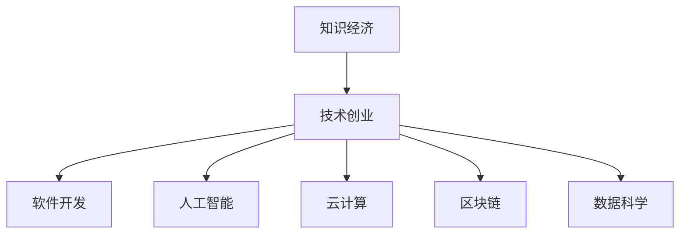

                 

# 知识经济下程序员的创业思路

> 关键词：知识经济,技术创业,软件开发,人工智能,云计算,区块链,数据科学

## 1. 背景介绍

### 1.1 问题由来
21世纪以来，随着信息技术的迅猛发展，全球正迈入知识经济时代。知识经济以知识资源为核心，以信息技术为手段，通过知识的生产、流通、应用，实现经济增长和社会进步。在这一背景下，程序员作为知识和技术的直接创造者和推动者，面临着前所未有的机遇和挑战。

一方面，知识经济为程序员提供了广阔的创业舞台。无论是互联网、人工智能、大数据、物联网，还是区块链、云计算等新兴领域，都需要大量的程序员去研发和实现。许多成功的创业公司，如Google、Facebook、Microsoft等，都是从技术创新和应用实践中成长起来的。

另一方面，知识经济也对程序员的创业思路和能力提出了更高的要求。传统的IT技术已不足以应对现代企业的数字化转型需求，创业者需要具备更强的技术实力和商业敏锐度，才能在激烈的市场竞争中脱颖而出。

### 1.2 问题核心关键点
在知识经济背景下，程序员的创业思路应围绕以下几个核心关键点展开：

- **技术深度与广度**：不仅要在某个领域精通，还要有跨领域融合的能力。
- **市场需求与趋势**：深入理解用户需求和市场趋势，研发出具有广泛应用前景的技术产品。
- **商业模式与创新**：探索多元化的商业模式，如SaaS、API、硬件等，同时不断创新产品功能和服务模式。
- **人才团队与资源**：构建高效的团队和灵活的资源配置机制，充分利用外部资源和合作机会。
- **用户体验与反馈**：重视用户体验，及时收集用户反馈，不断迭代和优化产品。

这些关键点将指导程序员在知识经济下如何创新创业，从而实现技术价值和经济价值的双重提升。

## 2. 核心概念与联系

### 2.1 核心概念概述

为更好地理解知识经济下程序员的创业思路，本节将介绍几个密切相关的核心概念：

- **知识经济**：一种基于知识和信息的经济形态，通过知识的生产、流通、应用推动经济发展。
- **技术创业**：指利用前沿技术进行创业，开发和实现新产品、新服务的过程。
- **软件开发**：涉及计算机软件设计、实现、测试和维护的一系列活动。
- **人工智能**：模拟人类智能行为的计算系统，包括机器学习、深度学习、自然语言处理等技术。
- **云计算**：通过互联网提供按需、可扩展的计算服务，包括IaaS、PaaS和SaaS等。
- **区块链**：一种分布式账本技术，保证数据透明、安全和不可篡改。
- **数据科学**：通过数据驱动的决策过程，提升产品和服务的价值。

这些核心概念之间的逻辑关系可以通过以下Mermaid流程图来展示：



这个流程图展示了一系列核心概念之间的关系：

1. 知识经济为技术创业提供了环境支持。
2. 技术创业包括软件开发、人工智能等多个方向。
3. 软件开发、人工智能等技术为知识经济提供支撑。
4. 云计算、区块链、数据科学等新兴技术，进一步推动技术创业的发展。

这些概念共同构成了知识经济下程序员创业的技术基础，需要深入理解和灵活应用。

## 3. 核心算法原理 & 具体操作步骤
### 3.1 算法原理概述

知识经济下程序员的创业思路，本质上是一个技术创新与市场驱动相结合的实践过程。其核心思想是：利用最新的信息技术，结合用户需求和市场趋势，开发出具有广泛应用前景的技术产品，并通过商业模式创新实现经济价值。

具体来说，核心算法原理包括：

- **市场调研**：通过问卷调查、数据分析等手段，深入了解目标用户的真实需求。
- **技术研发**：基于市场调研结果，选择合适的技术路线和实现方案，进行技术研发。
- **产品设计**：设计出符合用户需求、使用便捷、功能强大的产品原型。
- **商业化运营**：选择合适的商业模式，如SaaS、API、硬件等，开展产品推广和市场运营。
- **持续改进**：根据用户反馈和市场变化，不断迭代和优化产品。

### 3.2 算法步骤详解

知识经济下程序员的创业步骤一般包括以下几个关键环节：

**Step 1: 市场调研**
- 定义目标用户群体，收集用户需求和痛点。
- 分析竞争对手的产品和市场策略。
- 使用问卷调查、数据分析等手段，获取详实的数据支持。

**Step 2: 技术研发**
- 根据市场调研结果，确定技术选型和实现方案。
- 组建技术团队，进行产品原型的开发和测试。
- 不断优化算法和模型，提升产品性能。

**Step 3: 产品设计**
- 设计产品功能和界面，确保用户体验良好。
- 确定产品定价策略，制定营销计划。
- 进行用户测试，收集反馈，改进产品。

**Step 4: 商业化运营**
- 选择合适的商业模式，如SaaS、API、硬件等。
- 建立销售和客服团队，开展市场推广和客户支持。
- 监测产品使用情况，进行数据分析，优化运营策略。

**Step 5: 持续改进**
- 定期收集用户反馈，分析用户行为数据。
- 根据反馈进行产品迭代，不断提升产品性能。
- 拓展新市场，寻找新的增长点。

以上是知识经济下程序员创业的一般流程。在实际应用中，还需要针对具体项目的特点，对各个环节进行优化设计，如改进市场调研方法，优化技术研发路径，灵活设计产品功能等，以进一步提升创业成功率。

### 3.3 算法优缺点

知识经济下程序员的创业方法具有以下优点：

1. **技术驱动创新**：基于前沿技术进行创业，产品具有较高的技术含量和竞争力。
2. **市场导向明确**：根据市场需求进行产品设计和商业运营，风险较低，收益稳定。
3. **用户中心设计**：强调用户体验和用户反馈，提升产品的市场适应性和用户粘性。
4. **资源配置灵活**：可以根据实际情况灵活调整团队和资源配置，快速响应市场变化。

同时，该方法也存在一定的局限性：

1. **技术门槛高**：需要较强的技术实力和研发能力，对创业团队要求较高。
2. **市场需求变化快**：市场需求快速变化，需要持续进行市场调研和产品迭代。
3. **竞争激烈**：新兴技术领域竞争激烈，需要具备较强的市场洞察力和竞争力。
4. **成本投入大**：初期研发和市场推广需要较大的资金投入，创业风险较高。
5. **技术更新快**：技术快速发展，需要持续学习和跟踪新技术，保持产品竞争力。

尽管存在这些局限性，但就目前而言，基于前沿技术进行创业仍是大趋势。创业者需要不断提升自己的技术实力和市场洞察力，才能在知识经济下脱颖而出。

### 3.4 算法应用领域

知识经济下程序员的创业方法，已经在诸多新兴领域得到了广泛应用，例如：

- **互联网应用**：开发各种类型的应用，如社交网络、电子商务、在线教育等。
- **人工智能产品**：基于机器学习、深度学习等技术，开发智能推荐、语音识别、图像识别等产品。
- **大数据分析**：通过数据分析技术，为企业提供数据洞察和决策支持。
- **物联网设备**：开发智能家居、智能交通、智能制造等物联网设备，实现设备的互联互通。
- **区块链应用**：开发基于区块链技术的应用，如数字货币、供应链管理等。
- **云计算服务**：提供IaaS、PaaS和SaaS等云服务，支持企业的数字化转型。
- **数据科学工具**：开发数据清洗、分析和可视化工具，提升数据处理效率和分析深度。

除了上述这些经典应用外，知识经济下程序员的创业思路还将在更多新兴领域中得到应用，为各行各业带来变革性影响。

## 4. 数学模型和公式 & 详细讲解 & 举例说明

### 4.1 数学模型构建

知识经济下程序员的创业思路，可以抽象为一个多阶段的优化问题。具体来说，可以将其建模为以下形式：

- **市场调研模型**：用于获取用户需求和市场趋势，可通过问卷调查、数据分析等方法建模。
- **技术研发模型**：用于优化技术选型和实现方案，可通过实验设计、迭代优化等方法建模。
- **产品设计模型**：用于设计产品功能和界面，可通过用户反馈、A/B测试等方法建模。
- **商业化运营模型**：用于优化商业模式和运营策略，可通过销售预测、用户增长等方法建模。
- **持续改进模型**：用于持续优化产品和服务，可通过产品迭代、市场调研等方法建模。

### 4.2 公式推导过程

以下我们以人工智能产品的研发为例，推导技术研发模型的主要公式。

假设市场需求为 $D$，产品技术可行性为 $T$，市场调研得到的用户需求为 $U$，技术研发的成本为 $C$。技术研发的目标是最大化产品的市场价值 $V$，即：

$$
V = D \times T
$$

根据市场调研和用户反馈，可以得到用户需求 $U$ 和市场调研结果 $C$，进而可以建立技术研发模型：

$$
V = f(U, T) = U \times (1 - C)
$$

其中 $f$ 为映射函数，用于将用户需求和市场调研结果转化为产品市场价值。

### 4.3 案例分析与讲解

**案例分析**：某创业团队开发了一款基于人工智能的推荐系统。该系统通过收集用户行为数据，利用机器学习算法推荐商品。

**分析讲解**：

- **市场调研**：团队通过问卷调查和用户反馈，确定用户对推荐系统的主要需求为个性化推荐、准确性和响应速度。
- **技术研发**：团队选择深度学习模型进行商品推荐，并使用协同过滤、内容推荐等多种技术手段，提升推荐系统的准确性和多样性。
- **产品设计**：团队设计简洁易用的界面，支持用户自定义推荐策略和设置，提升用户体验。
- **商业化运营**：团队采用SaaS模式，向电商企业提供推荐系统服务，收取服务费和使用量分成。
- **持续改进**：团队定期收集用户反馈，分析用户行为数据，不断优化推荐算法和系统架构，提升推荐系统的性能和用户体验。

通过上述分析，可以看出，知识经济下程序员的创业思路是一个多阶段、多因素的优化过程。通过科学地建模和分析，可以最大化地利用技术优势和市场需求，实现技术创业的成功。

## 5. 项目实践：代码实例和详细解释说明

### 5.1 开发环境搭建

在进行创业项目开发前，我们需要准备好开发环境。以下是使用Python进行Web开发的环境配置流程：

1. 安装Anaconda：从官网下载并安装Anaconda，用于创建独立的Python环境。

2. 创建并激活虚拟环境：
```bash
conda create -n myenv python=3.8 
conda activate myenv
```

3. 安装Flask：
```bash
pip install flask
```

4. 安装Flask-RESTful：
```bash
pip install flask-restful
```

5. 安装Flask-SQLAlchemy：
```bash
pip install flask-sqlalchemy
```

6. 安装Flask-WTF：
```bash
pip install flask-wtf
```

7. 安装Flask-Uploads：
```bash
pip install Flask-Uploads
```

完成上述步骤后，即可在`myenv`环境中开始Web开发实践。

### 5.2 源代码详细实现

下面我们以开发一个简单的电商推荐系统为例，给出使用Flask框架进行Web开发的PyTorch代码实现。

首先，定义推荐系统的数据模型：

```python
from flask_sqlalchemy import SQLAlchemy
from flask_login import UserMixin, LoginManager
from werkzeug.security import generate_password_hash, check_password_hash

db = SQLAlchemy()

class User(db.Model, UserMixin):
    id = db.Column(db.Integer, primary_key=True)
    username = db.Column(db.String(64), unique=True, nullable=False)
    password_hash = db.Column(db.String(128))
    is_admin = db.Column(db.Boolean, default=False)

    def __init__(self, username, password):
        self.username = username
        self.password_hash = generate_password_hash(password)
    
    def check_password(self, password):
        return check_password_hash(self.password_hash, password)

class Recommendation(db.Model):
    id = db.Column(db.Integer, primary_key=True)
    user_id = db.Column(db.Integer, db.ForeignKey('user.id'))
    product_id = db.Column(db.Integer, db.ForeignKey('product.id'))
    score = db.Column(db.Float)
```

然后，定义推荐系统的路由和业务逻辑：

```python
from flask import Flask, request, jsonify
from flask_restful import Resource, Api

app = Flask(__name__)
app.config['SQLALCHEMY_DATABASE_URI'] = 'sqlite:///recommendation.db'
db.init_app(app)
app.config['SECRET_KEY'] = 'development key'
login_manager = LoginManager()
login_manager.init_app(app)
login_manager.login_view = 'login'
login_manager.login_message_category = 'info'

@login_manager.user_loader
def load_user(user_id):
    return User.query.get(int(user_id))

class UserResource(Resource):
    def get(self, user_id):
        user = User.query.get(user_id)
        return jsonify({'username': user.username})

class ProductResource(Resource):
    def get(self, product_id):
        product = Product.query.get(product_id)
        return jsonify({'name': product.name, 'description': product.description})

class RecommendationResource(Resource):
    def get(self, user_id):
        recommendations = Recommendation.query.filter_by(user_id=user_id).all()
        scores = [rec.score for rec in recommendations]
        return jsonify({'scores': scores})
```

最后，启动Web服务器：

```python
if __name__ == '__main__':
    app.run(debug=True)
```

以上就是使用Flask框架进行Web开发的完整代码实现。可以看到，Flask框架提供了便捷的路由定义和业务逻辑处理机制，大大降低了Web开发的复杂度。

### 5.3 代码解读与分析

让我们再详细解读一下关键代码的实现细节：

**数据模型**：
- `User`类：定义用户信息，包括用户名、密码、是否是管理员等属性。
- `Recommendation`类：定义推荐记录，包括用户ID、产品ID、推荐分数等属性。

**路由和业务逻辑**：
- `UserResource`类：定义用户资源的路由，支持获取用户信息。
- `ProductResource`类：定义产品资源的路由，支持获取产品信息。
- `RecommendationResource`类：定义推荐资源的路由，支持获取用户推荐列表。

**启动Web服务器**：
- 在`if __name__ == '__main__':`代码块中，调用`app.run(debug=True)`启动Web服务器，并开启调试模式。

在实际应用中，还需要对Web服务器进行安全性、性能优化和异常处理等全面考虑，才能确保Web应用的安全性和可靠性。

## 6. 实际应用场景

### 6.1 互联网应用

知识经济下程序员的创业思路，在互联网应用中得到了广泛应用。例如：

- **电商推荐系统**：通过收集用户行为数据，利用机器学习算法推荐商品。
- **社交网络**：开发社交平台，支持用户登录、发布、评论等功能。
- **在线教育**：开发在线学习平台，提供视频课程、在线测验等功能。
- **内容管理系统**：开发博客、论坛等社区平台，支持内容发布、评论、搜索等功能。

这些互联网应用不仅为用户提供便利，也推动了企业的数字化转型。

### 6.2 人工智能产品

知识经济下程序员的创业思路，在人工智能产品中也得到了广泛应用。例如：

- **智能推荐系统**：基于用户行为和历史数据，利用机器学习算法推荐内容。
- **语音识别**：开发语音助手，支持语音识别、语音合成等功能。
- **图像识别**：开发图像识别系统，支持人脸识别、物体识别等功能。
- **自然语言处理**：开发聊天机器人，支持智能问答、情感分析等功能。

这些人工智能产品为用户提供了更为便捷和智能的交互体验，推动了技术在各行各业中的应用。

### 6.3 大数据分析

知识经济下程序员的创业思路，在大数据分析中也得到了广泛应用。例如：

- **数据清洗工具**：开发数据清洗工具，支持数据去重、数据转换等功能。
- **数据可视化工具**：开发数据可视化工具，支持数据图表展示、数据分析等功能。
- **数据挖掘工具**：开发数据挖掘工具，支持数据聚类、关联规则等功能。

这些大数据分析工具为企业提供了更为深入的数据洞察和决策支持，推动了企业数据化管理的进程。

## 7. 工具和资源推荐

### 7.1 学习资源推荐

为了帮助程序员系统掌握知识经济下的创业思路，这里推荐一些优质的学习资源：

1. **《创业维艰》**：彼得·蒂蒙斯所著，深入浅出地讲述了创业的艰辛和成功经验，适合初学者和创业者阅读。
2. **《精益创业》**：艾瑞克·莱斯所著，介绍了精益创业方法论，强调快速迭代和用户反馈的重要性。
3. **《硅谷钢铁侠》**：沃尔特·艾萨克森所著，讲述了埃隆·马斯克的创业故事，展示了科技创新对企业成功的影响。
4. **《未来简史》**：尤瓦尔·赫拉利所著，深入探讨了知识经济和未来技术的发展趋势，对创业者具有重要启示。
5. **《商业模型画布》**：亚历山大·奥斯特瓦德所著，介绍了商业模型画布工具，帮助创业者系统规划商业模式。

通过学习这些资源，相信你一定能够全面理解知识经济下程序员的创业思路，并将其应用到实际创业中。

### 7.2 开发工具推荐

高效的开发离不开优秀的工具支持。以下是几款用于知识经济下创业开发的常用工具：

1. **Git**：版本控制系统，支持代码版本管理、协作开发等功能。
2. **JIRA**：项目管理工具，支持任务分配、进度跟踪等功能。
3. **Confluence**：知识管理工具，支持团队协作、文档编辑等功能。
4. **Slack**：即时通讯工具，支持团队沟通、消息推送等功能。
5. **Trello**：项目管理工具，支持任务卡片、进度跟踪等功能。
6. **Zoom**：视频会议工具，支持远程协作、视频会议等功能。
7. **Google Colab**：在线Jupyter Notebook环境，支持免费GPU/TPU算力，方便开发者快速上手实验最新模型。

合理利用这些工具，可以显著提升知识经济下创业的开发效率，加快创新迭代的步伐。

### 7.3 相关论文推荐

知识经济下程序员的创业思路，源于学界的持续研究。以下是几篇奠基性的相关论文，推荐阅读：

1. **《创业公司的创新过程》**：Jeanne E. Contin和Alan Nelson所著，深入探讨了创业公司的创新过程和方法。
2. **《技术创业的战略选择》**：Steve Johnson所著，介绍了技术创业的战略选择和成功因素。
3. **《大数据驱动的创业》**：Gary C. Williams和Mark J. Mercer所著，探讨了大数据在创业中的应用和价值。
4. **《人工智能创业的挑战与机遇》**：Andy Ng所著，深入分析了人工智能创业的挑战和机遇。
5. **《区块链技术创业》**：Brian Zhao所著，介绍了区块链技术在创业中的应用和前景。

这些论文代表了大数据、人工智能、区块链等新兴领域的研究进展，对创业者具有重要的参考价值。

## 8. 总结：未来发展趋势与挑战

### 8.1 总结

本文对知识经济下程序员的创业思路进行了全面系统的介绍。首先阐述了知识经济对程序员创业的影响和机遇，明确了技术创新和市场需求驱动的创业方向。其次，从原理到实践，详细讲解了知识经济下创业的关键环节和步骤，给出了具体的代码实现和业务逻辑。同时，本文还广泛探讨了知识经济下创业的实际应用场景，展示了创业思路在互联网、人工智能、大数据等领域的应用前景。此外，本文精选了创业相关的学习资源、开发工具和研究论文，力求为读者提供全方位的技术指引。

通过本文的系统梳理，可以看到，知识经济下程序员的创业思路是一个系统化、多维度的过程。无论是技术创新还是市场驱动，都需要创业者具备全面的素质和能力，才能在激烈的市场竞争中脱颖而出。未来，伴随知识经济的发展和技术创新的不断推进，程序员的创业思路将更加多元化，为社会带来更多的创新价值。

### 8.2 未来发展趋势

展望未来，知识经济下程序员的创业思路将呈现以下几个发展趋势：

1. **技术深度与广度融合**：不仅要在某个领域精通，还要具备跨领域融合的能力，推动技术的深度和广度发展。
2. **市场需求导向明确**：根据市场需求进行技术创新，提高产品的市场适应性和用户粘性。
3. **商业模式创新**：探索多元化的商业模式，如SaaS、API、硬件等，实现商业价值的最大化。
4. **用户中心设计**：重视用户体验和用户反馈，不断优化产品功能和用户体验。
5. **资源配置灵活**：根据实际情况灵活调整团队和资源配置，快速响应市场变化。
6. **全球化视野**：拓展全球市场，寻找新的增长点，提升全球竞争力。

以上趋势凸显了知识经济下程序员创业思路的广阔前景。这些方向的探索发展，必将进一步提升创业项目的创新性和市场竞争力，为社会带来更多的经济价值。

### 8.3 面临的挑战

尽管知识经济下程序员的创业思路已经取得了一定的成果，但在迈向更加智能化、普适化应用的过程中，仍面临诸多挑战：

1. **技术门槛高**：需要较强的技术实力和研发能力，对创业团队要求较高。
2. **市场需求变化快**：市场需求快速变化，需要持续进行市场调研和产品迭代。
3. **竞争激烈**：新兴技术领域竞争激烈，需要具备较强的市场洞察力和竞争力。
4. **成本投入大**：初期研发和市场推广需要较大的资金投入，创业风险较高。
5. **技术更新快**：技术快速发展，需要持续学习和跟踪新技术，保持产品竞争力。
6. **全球化运营**：拓展全球市场需要具备较强的国际化能力和跨文化管理能力。

尽管存在这些挑战，但通过不断提升技术实力、市场洞察力和运营能力，相信知识经济下的程序员创业将取得更加显著的成果。

### 8.4 研究展望

面对知识经济下程序员创业所面临的挑战，未来的研究需要在以下几个方面寻求新的突破：

1. **跨领域融合技术**：将符号化的先验知识，如知识图谱、逻辑规则等，与神经网络模型进行巧妙融合，提升模型的通用性和智能性。
2. **全球化运营机制**：构建高效的国际化运营机制，提升全球市场拓展能力和跨文化管理能力。
3. **自动化工具应用**：利用自动化工具提升开发效率和产品质量，如自动测试、代码审查等。
4. **数据驱动决策**：通过大数据分析，实现数据驱动的决策过程，提升产品创新能力和市场反应速度。
5. **社会责任意识**：注重企业的社会责任和可持续发展，推动社会价值的实现。

这些研究方向的探索，必将引领知识经济下程序员创业思路的发展，为构建智能、高效、可持续的社会做出更大的贡献。

## 9. 附录：常见问题与解答

**Q1：知识经济下程序员的创业思路是否适用于所有领域？**

A: 知识经济下程序员的创业思路可以适用于大多数领域，特别是那些以技术创新和数据驱动为核心的行业。然而，对于一些依赖传统工艺、物理条件较强的领域，如制造、农业等，这种思路可能需要结合行业特点进行适当调整。

**Q2：如何选择合适的技术路径？**

A: 选择合适的技术路径需要结合市场需求、技术实力和资源配置等因素综合考虑。可以参考以下步骤：
1. 深入分析市场需求，明确用户需求和痛点。
2. 评估自身技术实力，选择技术实现方案。
3. 确定资源配置策略，优化团队和资源配置。
4. 定期进行技术迭代，提升产品性能和用户体验。

**Q3：如何降低创业风险？**

A: 降低创业风险需要采取多种措施：
1. 进行充分的市场需求调研，明确用户需求和市场机会。
2. 选择稳定可靠的技术合作伙伴，降低技术风险。
3. 制定详细的商业计划和运营策略，提升市场竞争力。
4. 设立应急预案，应对突发情况和市场变化。

**Q4：如何提升产品的市场竞争力？**

A: 提升产品的市场竞争力需要从多个方面入手：
1. 不断进行技术创新，提高产品的技术含量和用户体验。
2. 制定合理的定价策略，增强产品的市场竞争力。
3. 加强市场营销和品牌建设，提升产品的市场影响力。
4. 持续优化产品和服务，满足用户需求，提升用户粘性。

**Q5：如何构建高效的团队？**

A: 构建高效的团队需要考虑以下几个方面：
1. 招募具有高素质、高能力的团队成员。
2. 设立清晰的目标和任务分工，提升团队协作效率。
3. 定期进行团队培训和绩效评估，提升团队凝聚力。
4. 设立开放的沟通机制，鼓励团队成员提出创新想法。

这些措施可以帮助创业者构建高效的团队，提升项目开发效率和创新能力。

---

作者：禅与计算机程序设计艺术 / Zen and the Art of Computer Programming

