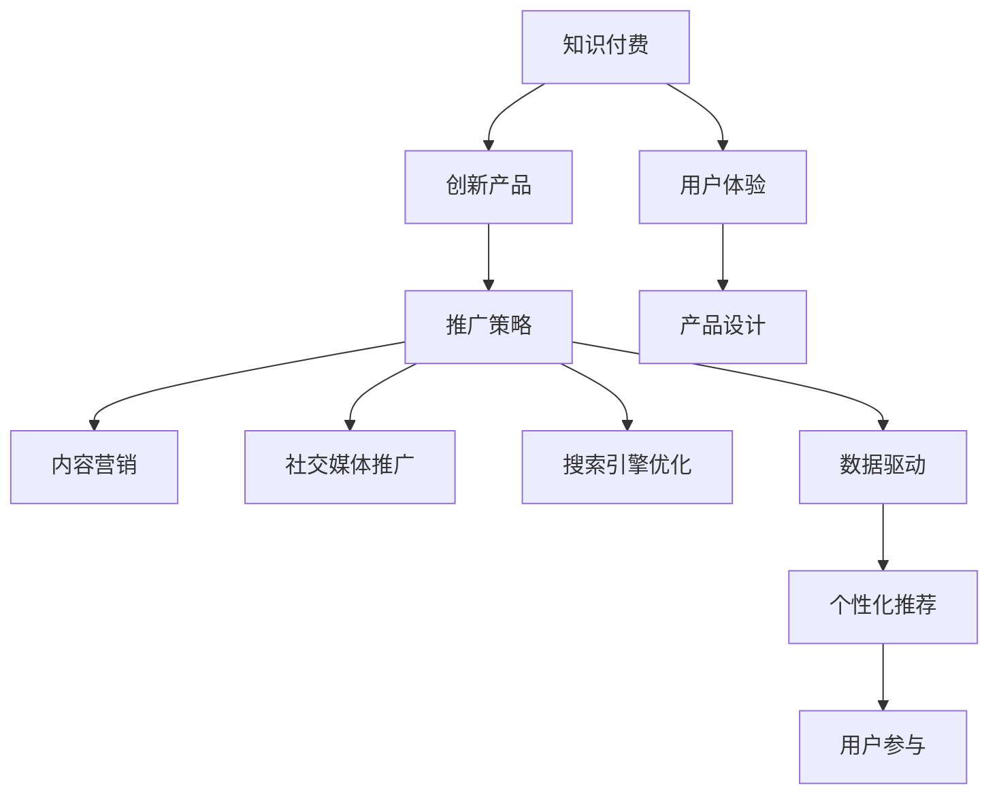

                 

# 知识经济时代下的知识付费创新产品推广与促销策略

> 关键词：知识付费,创新产品,推广策略,用户参与,数据驱动,个性化推荐

## 1. 背景介绍

### 1.1 问题由来

在知识经济时代，知识的获取与传播方式正经历深刻变革。知识付费作为一种新兴的商业模式，利用互联网技术将高质量知识内容变现，满足了用户对知识深度化、个性化的需求。然而，知识付费市场竞争激烈，用户获取信息的渠道多样化，如何精准推广创新产品，实现高销量和用户留存，成为了亟待解决的问题。

### 1.2 问题核心关键点

知识付费产品推广的核心理念在于利用高质量的内容和有效的推广策略，吸引并留住用户。核心关键点包括：

- **内容质量**：知识付费的核心在于内容价值，内容深度、新颖度、实用性是吸引用户的关键。
- **用户体验**：便捷、个性化的产品设计，以及良好的使用体验，能够有效提升用户粘性。
- **营销策略**：通过精准的营销策略，实现产品的高曝光和用户的高参与度。
- **数据驱动**：利用大数据分析和人工智能技术，优化产品推荐和个性化服务，提高用户体验和满意度。

### 1.3 问题研究意义

研究知识付费产品的推广与促销策略，对于知识付费平台的可持续发展具有重要意义：

- **提升盈利能力**：通过有效的推广策略和个性化服务，提高知识付费产品的用户接受度和购买率，从而增加平台的收入来源。
- **增强用户粘性**：通过提升用户体验和个性化推荐，增强用户对平台的依赖性，实现用户的高留存率。
- **品牌价值提升**：高品质的内容和服务，以及精准的推广策略，可以提升平台的品牌形象和市场影响力。
- **技术应用推广**：推广知识付费产品的同时，可以带动大数据、人工智能等相关技术的发展和应用。

## 2. 核心概念与联系

### 2.1 核心概念概述

为更好地理解知识付费产品的推广策略，本节将介绍几个密切相关的核心概念：

- **知识付费**：指通过付费方式获取优质知识内容的模式。平台提供专家课程、电子书、文章等，用户支付费用以获取知识资源。
- **创新产品**：指采用新技术或新方法，提供独特或新颖的服务，如交互式学习、社区问答等。
- **推广策略**：包括内容营销、社交媒体推广、搜索引擎优化等，旨在提高产品的曝光率和用户参与度。
- **用户参与**：用户对知识产品的互动、评价和反馈，直接影响产品的改进和优化。
- **数据驱动**：利用大数据分析和人工智能技术，优化产品推荐和服务，提升用户体验。
- **个性化推荐**：根据用户行为和偏好，提供定制化的内容推荐，提高用户满意度和转化率。

这些核心概念之间的逻辑关系可以通过以下Mermaid流程图来展示：



这个流程图展示了这个体系的核心概念及其之间的关系：

1. 知识付费是核心，提供高质量内容。
2. 创新产品是知识付费的重要补充，通过新技术提高用户满意度。
3. 推广策略直接影响产品曝光和用户参与，是推广的核心手段。
4. 数据驱动和个性化推荐是提升用户体验的关键技术手段。
5. 用户参与反哺产品优化，形成良性循环。

## 3. 核心算法原理 & 具体操作步骤
### 3.1 算法原理概述

知识付费产品的推广与促销策略，本质上是一种基于数据驱动的个性化营销方法。其核心思想是：通过分析用户行为数据和内容特征，定制个性化的推广方案，实现高效的用户吸引和留存。

形式化地，假设用户集合为 $U$，产品集合为 $P$，推广策略为 $S$。推广的目标是最大化用户参与度 $\pi(S)$ 和用户留存率 $\tau(S)$，即：

$$
\max_{S} \pi(S) \times \tau(S)
$$

其中，$\pi(S)$ 和 $\tau(S)$ 分别为用户参与度和留存率的预测模型，可以基于历史数据训练得到。在实际推广过程中，模型会根据用户的行为特征，动态调整策略，实现最佳的推广效果。

### 3.2 算法步骤详解

知识付费产品的推广策略通常包括以下几个关键步骤：

**Step 1: 数据收集与处理**
- 收集用户行为数据，如浏览记录、购买记录、评价反馈等。
- 收集产品特征数据，如课程内容、价格、讲师背景等。
- 对数据进行清洗、预处理，去除噪声和异常值。

**Step 2: 用户画像构建**
- 利用机器学习算法，如K-means、PCA等，构建用户画像，描述用户的行为特征和偏好。
- 利用协同过滤、深度学习等技术，发现用户之间隐含的关系。

**Step 3: 产品匹配与推荐**
- 根据用户画像，利用推荐算法（如基于内容的推荐、协同过滤推荐、矩阵分解推荐等），为用户推荐感兴趣的产品。
- 结合用户评价和反馈，动态调整推荐策略，优化推荐效果。

**Step 4: 推广策略制定**
- 基于用户画像和产品特征，制定个性化的推广策略。
- 利用A/B测试、多臂赌博机等技术，评估不同策略的效果，优化推广方案。

**Step 5: 执行与评估**
- 根据推广策略，在社交媒体、搜索引擎等渠道推广产品。
- 定期评估推广效果，如点击率、转化率、用户参与度等，持续优化推广策略。

### 3.3 算法优缺点

知识付费产品推广的算法策略具有以下优点：

1. **高效性**：通过数据驱动的个性化推荐，快速发现用户需求，提高转化率。
2. **精准性**：基于用户画像和产品特征的推荐，精准匹配用户需求，提高用户满意度。
3. **可扩展性**：算法框架可应用于多种产品类型和推广渠道，具有较好的可扩展性。
4. **动态性**：能够根据用户行为和市场变化，动态调整策略，适应不断变化的市场需求。

同时，该方法也存在一定的局限性：

1. **数据依赖**：算法的准确性和效果高度依赖于数据质量和数量，数据不完整或不准确可能影响结果。
2. **算法复杂度**：复杂推荐算法如深度学习模型，计算成本较高，需要强大的计算资源。
3. **隐私问题**：用户数据的收集和使用可能涉及隐私问题，需要严格遵守数据保护法规。
4. **用户偏好变化**：用户偏好可能随时间变化，需要持续监控和调整推荐策略。

尽管存在这些局限性，但就目前而言，基于数据驱动的个性化推广方法仍是知识付费产品推广的主流范式。未来相关研究将聚焦于如何进一步降低数据收集和算法计算的成本，提高推广策略的精确性和可解释性，同时兼顾用户隐私保护。

### 3.4 算法应用领域

基于知识付费产品推广的算法策略，在知识付费平台、在线教育、在线课程等领域广泛应用。具体包括：

- **在线教育平台**：通过个性化推荐，提高课程购买率和用户留存率。如Coursera、Udacity等。
- **在线课程平台**：利用推荐算法，为学生推荐感兴趣的课程和讲师。如网易云课堂、慕课网等。
- **知识付费社区**：根据用户兴趣和行为，推荐高质量内容，提升社区活跃度。如得到App、小鹅通等。

除了这些领域，知识付费推广策略还将在更多领域得到应用，如企业培训、职业发展、健康管理等，为传统行业数字化转型升级提供新的技术路径。

## 4. 数学模型和公式 & 详细讲解  
### 4.1 数学模型构建

本节将使用数学语言对知识付费产品推广策略进行更加严格的刻画。

假设用户集合为 $U$，产品集合为 $P$，用户行为数据为 $X$，产品特征数据为 $Y$。构建用户画像的数学模型为：

$$
\mathcal{P}(U) = \arg\min_{\theta} \sum_{i \in U} \|X_i - \theta^T Y_i\|
$$

其中，$\theta$ 为用户画像的参数向量，$X_i$ 和 $Y_i$ 分别为第 $i$ 个用户的行为数据和产品特征数据。

用户参与度和留存率的预测模型为：

$$
\pi(S) = \sum_{i \in U} \pi_i
$$

$$
\tau(S) = \prod_{i \in U} \tau_i
$$

其中，$\pi_i$ 和 $\tau_i$ 分别为第 $i$ 个用户参与度和留存率的预测值。

优化目标为：

$$
\max_{S} \sum_{i \in U} \pi_i \times \tau_i
$$

在实际推广过程中，可以利用随机梯度下降等优化算法，迭代调整推广策略 $S$，实现最佳效果。

### 4.2 公式推导过程

以基于内容的推荐算法为例，推导推荐模型的预测公式。

假设用户 $i$ 对产品 $j$ 的评分 $r_{ij}$ 由产品特征 $y_j$ 决定：

$$
r_{ij} = \theta^T \phi(y_j)
$$

其中，$\phi$ 为特征映射函数，$\theta$ 为推荐模型的参数向量。

利用矩阵分解技术，可以进一步表示为：

$$
\hat{r}_{ij} = \sum_{k=1}^{K} u_{ik} v_{kj}
$$

其中，$u_{ik}$ 和 $v_{kj}$ 分别为用户和产品的隐向量。

通过最小化预测误差，可以得到推荐模型的优化公式：

$$
\min_{u,v} \sum_{i \in U} \sum_{j \in P} (r_{ij} - \hat{r}_{ij})^2
$$

### 4.3 案例分析与讲解

假设某在线教育平台收集了用户浏览和购买课程的历史数据，平台利用这些数据训练推荐模型，为每位用户推荐最可能感兴趣的新课程。具体步骤如下：

1. 收集用户行为数据和课程特征数据。
2. 利用协同过滤算法，构建用户画像。
3. 基于用户画像和课程特征，计算推荐分数。
4. 选择前N个推荐课程，展示给用户。
5. 记录用户对推荐课程的点击、购买等反馈，持续优化推荐模型。

通过以上步骤，平台可以有效提升新课程的推广效果，提高用户购买率和平台收益。

## 5. 项目实践：代码实例和详细解释说明
### 5.1 开发环境搭建

在进行知识付费产品推广实践前，我们需要准备好开发环境。以下是使用Python进行PyTorch开发的环境配置流程：

1. 安装Anaconda：从官网下载并安装Anaconda，用于创建独立的Python环境。

2. 创建并激活虚拟环境：
```bash
conda create -n pytorch-env python=3.8 
conda activate pytorch-env
```

3. 安装PyTorch：根据CUDA版本，从官网获取对应的安装命令。例如：
```bash
conda install pytorch torchvision torchaudio cudatoolkit=11.1 -c pytorch -c conda-forge
```

4. 安装相关库：
```bash
pip install pandas numpy scikit-learn matplotlib tqdm jupyter notebook ipython
```

完成上述步骤后，即可在`pytorch-env`环境中开始推广实践。

### 5.2 源代码详细实现

这里我们以一个简化的在线课程推荐系统为例，给出使用PyTorch进行知识付费产品推广的代码实现。

首先，定义数据处理函数：

```python
import pandas as pd
from sklearn.decomposition import TruncatedSVD

# 读取用户行为数据
user_data = pd.read_csv('user_data.csv')

# 构建用户画像
svd = TruncatedSVD(n_components=50)
user_embedding = svd.fit_transform(user_data.drop(['id', 'product_id'], axis=1))
```

然后，定义推荐模型：

```python
from sklearn.metrics.pairwise import cosine_similarity

class RecommendationSystem:
    def __init__(self, user_embedding, product_embedding):
        self.user_embedding = user_embedding
        self.product_embedding = product_embedding
        
    def predict(self, user_id):
        # 计算用户与所有产品的相似度
        similarity = cosine_similarity(self.user_embedding[user_id], self.product_embedding)
        # 选择相似度最高的产品进行推荐
        return similarity.argsort()[-N].tolist()
```

最后，启动推荐系统：

```python
# 加载产品特征数据
product_data = pd.read_csv('product_data.csv')
product_embedding = svd.fit_transform(product_data.drop(['id'], axis=1))

# 创建推荐系统
recommend_system = RecommendationSystem(user_embedding, product_embedding)

# 推荐前N个课程
for user_id in user_data['id']:
    recommendations = recommend_system.predict(user_id)
    print(f"User {user_id}: {recommendations}")
```

以上就是使用PyTorch进行在线课程推荐系统的代码实现。可以看到，利用协同过滤算法，可以简单高效地实现个性化推荐，提升用户体验和平台收益。

### 5.3 代码解读与分析

让我们再详细解读一下关键代码的实现细节：

**数据处理函数**：
- `user_data` 和 `product_data`：分别表示用户行为数据和产品特征数据，格式为csv文件。
- `TruncatedSVD` 类：用于降维处理，将高维数据转换为低维表示。

**推荐模型**：
- `RecommendationSystem` 类：定义推荐系统，包含用户和产品嵌入矩阵。
- `predict` 方法：计算用户与所有产品的相似度，并返回相似度最高的产品列表。

**推荐系统启动**：
- 加载产品特征数据，并进行降维处理。
- 创建推荐系统对象，并调用 `predict` 方法，对每位用户推荐课程。

可以看到，协同过滤算法虽然简单，但在知识付费产品推广中能够取得不错的效果。当然，在实际应用中，还需要进一步优化算法，结合更多用户行为和产品特征，以提高推荐精度。

## 6. 实际应用场景
### 6.1 智能推荐系统

基于知识付费产品推广的推荐算法，可以实现智能推荐系统，提高新课程的推广效果。具体应用场景包括：

- **在线教育平台**：如Coursera、Udacity等，利用推荐算法，为每位用户推荐感兴趣的新课程，提升课程购买率。
- **在线课程平台**：如网易云课堂、慕课网等，根据用户历史浏览记录，推荐相关课程，提升用户参与度。

### 6.2 个性化学习路径

知识付费平台可以根据用户的学习历史和偏好，推荐个性化的学习路径，帮助用户高效学习。具体应用场景包括：

- **企业培训平台**：如培训管理系统，根据员工的工作表现和学习记录，推荐适合的技能培训课程，提升员工绩效。
- **个人学习平台**：如得到App，根据用户的学习进度和偏好，推荐个性化的学习路径，提高学习效果。

### 6.3 用户流失预警

平台可以基于用户行为数据，构建用户画像，识别潜在流失用户，提前采取预警措施，减少用户流失率。具体应用场景包括：

- **在线教育平台**：如新东方在线，通过用户行为分析，预测可能导致用户流失的因素，提前采取补救措施。
- **知识付费平台**：如小鹅通，利用用户行为数据，构建用户流失模型，预测潜在流失用户，减少用户流失率。

### 6.4 未来应用展望

随着知识付费市场的不断成熟，基于推荐算法的推广策略将在更多领域得到应用，为传统行业数字化转型升级提供新的技术路径。

在智慧医疗领域，基于推荐算法的学习路径推荐系统，可以提升医疗服务的智能化水平，辅助医生诊疗，加速新药开发进程。

在智能教育领域，个性化推荐算法可以应用于作业批改、学情分析、知识推荐等方面，因材施教，促进教育公平，提高教学质量。

在智慧城市治理中，推荐算法可以应用于城市事件监测、舆情分析、应急指挥等环节，提高城市管理的自动化和智能化水平，构建更安全、高效的未来城市。

此外，在企业培训、职业发展、健康管理等众多领域，基于推荐算法的个性化服务也将不断涌现，为传统行业数字化转型升级提供新的技术路径。相信随着技术的日益成熟，推荐算法将成为知识付费推广的重要手段，推动知识付费平台的可持续发展。

## 7. 工具和资源推荐
### 7.1 学习资源推荐

为了帮助开发者系统掌握知识付费产品的推广策略的理论基础和实践技巧，这里推荐一些优质的学习资源：

1. 《知识付费平台运营》系列博文：由知识付费领域的专家撰写，深入浅出地介绍了知识付费平台运营的各个方面，从内容策划到用户推广，全面覆盖知识付费产品推广的核心知识。

2. 《推荐系统实战》书籍：深入讲解推荐算法的原理和实现，涵盖协同过滤、基于内容的推荐、深度学习等多种推荐方法，适合深度学习和推荐算法领域的研究者。

3. CS224N《深度学习自然语言处理》课程：斯坦福大学开设的NLP明星课程，涵盖推荐算法的基础知识和实践应用，提供丰富的实际案例和作业练习。

4. Kaggle推荐系统竞赛：参与Kaggle平台上的推荐系统竞赛，通过实战练习提升推荐算法的能力。

5. GitHub推荐系统开源项目：GitHub上有大量开源推荐系统项目，可以学习和借鉴优秀的推荐算法实现。

通过对这些资源的学习实践，相信你一定能够快速掌握知识付费产品推广的精髓，并用于解决实际的推广问题。

### 7.2 开发工具推荐

高效的开发离不开优秀的工具支持。以下是几款用于知识付费产品推广开发的常用工具：

1. PyTorch：基于Python的开源深度学习框架，灵活动态的计算图，适合快速迭代研究。大部分推荐算法都有PyTorch版本的实现。

2. TensorFlow：由Google主导开发的开源深度学习框架，生产部署方便，适合大规模工程应用。同样有丰富的推荐算法资源。

3. Scikit-learn：基于Python的机器学习库，包含多种推荐算法实现，如协同过滤、矩阵分解等。

4. Weights & Biases：模型训练的实验跟踪工具，可以记录和可视化模型训练过程中的各项指标，方便对比和调优。与主流深度学习框架无缝集成。

5. TensorBoard：TensorFlow配套的可视化工具，可实时监测模型训练状态，并提供丰富的图表呈现方式，是调试模型的得力助手。

6. Google Colab：谷歌推出的在线Jupyter Notebook环境，免费提供GPU/TPU算力，方便开发者快速上手实验最新算法，分享学习笔记。

合理利用这些工具，可以显著提升知识付费产品推广的开发效率，加快创新迭代的步伐。

### 7.3 相关论文推荐

知识付费产品推广策略的发展源于学界的持续研究。以下是几篇奠基性的相关论文，推荐阅读：

1. "A Collaborative Filtering Model for Recommendation Systems"：提出了协同过滤推荐算法的基本原理和实现方法，是推荐系统研究的经典之作。

2. "Trust-based Recommendation Algorithms"：探讨了基于信任的推荐算法，考虑了用户之间的信任关系，进一步提升了推荐精度。

3. "Neural Collaborative Filtering"：提出了神经协同过滤推荐算法，结合深度学习技术，提升了推荐系统的表现。

4. "Adaptive Ranking with Learning-to-Rank Models"：介绍了基于学习的排序方法，利用点击数据进行排序模型的训练，提高了推荐效果。

5. "Large-Scale Parallel Collaborative Filtering"：研究了大规模协同过滤算法的实现方法，提升了算法的可扩展性和效率。

这些论文代表了大数据推荐系统的发展脉络。通过学习这些前沿成果，可以帮助研究者把握学科前进方向，激发更多的创新灵感。

## 8. 总结：未来发展趋势与挑战
### 8.1 总结

本文对基于数据驱动的知识付费产品推广策略进行了全面系统的介绍。首先阐述了知识付费产品推广的重要性和核心关键点，明确了推广的核心理念和目标。其次，从原理到实践，详细讲解了推荐算法的数学模型和具体实现，给出了推广任务开发的完整代码实例。同时，本文还广泛探讨了推荐算法在智能推荐、个性化学习、用户流失预警等实际应用场景中的落地策略，展示了推荐算法的广泛应用前景。此外，本文精选了推荐算法的各类学习资源，力求为读者提供全方位的技术指引。

通过本文的系统梳理，可以看到，基于数据驱动的知识付费产品推广策略，能够有效提升用户参与度和平台收益，推动知识付费平台的可持续发展。随着技术的不断进步，推荐算法将在更多领域得到应用，为传统行业数字化转型升级提供新的技术路径。

### 8.2 未来发展趋势

展望未来，知识付费产品推广策略将呈现以下几个发展趋势：

1. **推荐算法多样化**：随着算法的发展，未来的推荐系统将采用更多种类的推荐算法，如深度学习、强化学习等，提高推荐精度和个性化程度。
2. **数据融合与多模态推荐**：未来推荐系统将融合多种数据源，如社交媒体、传感器数据等，结合用户行为、产品属性、时间序列等信息，提供更加精准的推荐。
3. **实时推荐与动态调整**：基于流数据的实时推荐系统，能够实时捕捉用户行为变化，动态调整推荐策略，提升用户体验。
4. **隐私保护与公平性**：随着隐私保护法规的日益严格，推荐系统将更加注重用户隐私保护和公平性，采用差分隐私、联邦学习等技术，保护用户数据安全。
5. **人机协同与交互**：未来的推荐系统将更加注重用户与系统的交互，引入人工智能助手、聊天机器人等，提升用户参与度和满意度。
6. **多任务学习与跨领域推荐**：结合多任务学习，优化不同任务之间的推荐效果，同时进行跨领域推荐，提升推荐系统的适应性和泛化能力。

以上趋势凸显了知识付费产品推广策略的广阔前景。这些方向的探索发展，必将进一步提升推荐系统的性能和应用范围，为知识付费平台提供更强大、智能的推广手段。

### 8.3 面临的挑战

尽管知识付费产品推广策略已经取得了显著成效，但在迈向更加智能化、普适化应用的过程中，它仍面临诸多挑战：

1. **数据隐私与安全**：用户数据的收集和使用可能涉及隐私问题，如何平衡用户隐私保护与推荐效果，是一个重要挑战。
2. **推荐冷启动问题**：新用户没有足够的历史行为数据，推荐系统难以进行个性化推荐，如何解决这个问题，提高新用户的满意度，需要更多研究。
3. **多模态数据整合**：用户数据包括文本、图片、视频等多种形式，如何高效整合和分析这些数据，提升推荐精度，是一个技术难题。
4. **动态数据处理**：用户行为和偏好可能随时间变化，如何动态处理实时数据，持续优化推荐模型，需要更高效的算法和数据处理技术。
5. **跨平台一致性**：推荐系统需要在多个平台和设备上保持一致性，如何实现跨平台的无缝推荐，需要考虑用户行为在不同平台上的异同。
6. **算法可解释性**：推荐系统的复杂度越来越高，如何提高算法的可解释性，让用户理解推荐逻辑，需要更多的理论和技术突破。

正视知识付费产品推广所面临的这些挑战，积极应对并寻求突破，将使推荐系统更加成熟，为用户带来更好的服务体验。

### 8.4 研究展望

面对知识付费产品推广策略所面临的种种挑战，未来的研究需要在以下几个方面寻求新的突破：

1. **隐私保护与公平性**：开发隐私保护算法和隐私计算技术，保护用户数据隐私，同时提高推荐公平性，避免推荐算法对某些群体的不公平偏见。
2. **冷启动问题解决**：研究多模态数据融合和利用，通过用户行为预测用户兴趣，解决冷启动问题。
3. **多模态数据整合**：研究多模态数据挖掘和融合方法，提高用户数据的整合和分析能力，提升推荐精度。
4. **动态数据处理**：研究在线学习方法和动态数据更新策略，实现实时推荐系统的构建。
5. **跨平台一致性**：研究跨平台数据同步和推荐策略适应性方法，实现跨平台的无缝推荐。
6. **算法可解释性**：研究推荐系统的可解释性方法，让用户理解推荐逻辑，提高用户信任度和满意度。

这些研究方向的探索，必将引领知识付费产品推广策略迈向更高的台阶，为构建安全、可靠、可解释、可控的智能系统铺平道路。面向未来，知识付费产品推广策略还需要与其他人工智能技术进行更深入的融合，如自然语言处理、计算机视觉等，多路径协同发力，共同推动知识付费平台的可持续发展。

## 9. 附录：常见问题与解答

**Q1：知识付费产品推广的推荐算法有哪些？**

A: 常见的推荐算法包括：
1. 协同过滤：利用用户行为数据，发现相似用户，推荐相似产品。
2. 基于内容的推荐：利用产品特征，推荐内容相似的产品。
3. 矩阵分解：将用户-产品关系表示为矩阵，通过分解矩阵获取用户和产品的隐向量，进行推荐。
4. 深度学习：利用神经网络模型，学习用户行为和产品特征的复杂关系，提高推荐精度。

**Q2：如何选择推荐算法？**

A: 选择推荐算法需要考虑多个因素：
1. 数据质量：推荐算法的适用性取决于数据的质量和数量。
2. 数据类型：不同类型的用户数据和产品数据，适合不同的推荐算法。
3. 推荐精度：不同算法的推荐精度和性能，需要根据具体应用场景选择。
4. 系统复杂度：算法的复杂度和计算成本，需要考虑系统可扩展性和效率。
5. 用户需求：用户对推荐效果的接受度和反馈，需要根据用户需求选择。

**Q3：知识付费产品推广的个性化推荐策略有哪些？**

A: 个性化推荐策略主要包括以下几种：
1. 基于内容的推荐：根据产品内容，推荐相似的产品。
2. 协同过滤推荐：利用用户行为数据，发现相似用户，推荐相似产品。
3. 矩阵分解推荐：将用户-产品关系表示为矩阵，通过分解矩阵获取用户和产品的隐向量，进行推荐。
4. 深度学习推荐：利用神经网络模型，学习用户行为和产品特征的复杂关系，提高推荐精度。

**Q4：如何提升知识付费产品推广的推荐效果？**

A: 提升推荐效果可以从以下几个方面入手：
1. 数据质量：保证数据完整性和准确性，避免噪声和异常值。
2. 算法优化：优化推荐算法，选择适合具体应用场景的算法。
3. 模型调参：通过调整超参数，优化模型性能。
4. 用户行为分析：深入理解用户行为，提高推荐策略的针对性。
5. 动态数据更新：实时更新推荐模型，跟踪用户行为变化。
6. 用户反馈利用：利用用户反馈，不断优化推荐策略。

**Q5：知识付费产品推广的隐私保护有哪些措施？**

A: 隐私保护措施主要包括以下几种：
1. 数据匿名化：对用户数据进行匿名化处理，保护用户隐私。
2. 差分隐私：采用差分隐私技术，在保证推荐效果的同时，保护用户隐私。
3. 联邦学习：利用联邦学习技术，在用户端进行模型训练，保护用户数据不离开本地。
4. 模型透明化：提高推荐模型的可解释性，让用户理解推荐逻辑。
5. 合规管理：严格遵守隐私保护法规，保护用户数据安全和隐私权利。

这些措施可以结合使用，确保知识付费产品推广过程中的隐私保护。

---

作者：禅与计算机程序设计艺术 / Zen and the Art of Computer Programming

