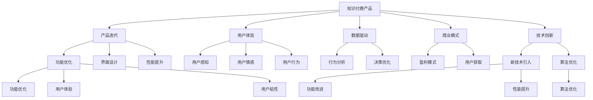

                 

# 知识经济时代下的知识付费创新产品迭代优化

> 关键词：知识付费,产品迭代,用户需求,商业模式,数据驱动,用户体验,技术创新,用户留存

## 1. 背景介绍

### 1.1 问题由来

知识付费是知识经济时代下新兴的商业模式，随着互联网和移动设备的普及，越来越多的人选择通过付费获取知识。知识付费产品如得到、知乎live、喜马拉雅等，在提升用户学习效率和价值方面取得了显著成效。然而，在知识付费行业快速发展的同时，也面临着产品同质化严重、用户体验参差不齐、用户流失率高、数据驱动不足等诸多问题。

为了适应日益激烈的市场竞争，持续优化和创新知识付费产品变得尤为重要。本文聚焦于知识付费创新产品的迭代优化，通过技术创新、数据驱动、用户体验优化等手段，系统性地探讨如何构建和提升知识付费产品的竞争力。

### 1.2 问题核心关键点

知识付费产品的迭代优化，主要包括以下几个关键点：

- 技术创新：通过引入新的技术手段和算法，提升产品性能和用户体验。
- 数据驱动：充分利用用户行为数据，驱动产品优化和迭代，实现精细化运营。
- 用户体验：通过优化界面设计、互动机制、推荐算法，提升用户粘性和满意度。
- 商业模式：构建差异化的商业模式，如知识付费+社交互动、知识付费+企业培训等，开拓新的用户增长渠道。
- 用户留存：通过提升用户参与度和付费意愿，降低用户流失率。

这些关键点互相作用，共同决定了知识付费产品的迭代方向和优化策略。

## 2. 核心概念与联系

### 2.1 核心概念概述

为更好地理解知识付费产品的迭代优化，本节将介绍几个密切相关的核心概念：

- 知识付费产品：以在线课程、音频书籍、电子书、问答社区等为代表，用户通过付费获取知识和信息的服务。
- 产品迭代：通过不断优化和更新产品功能、界面、性能，提升用户体验和服务质量的持续改进过程。
- 用户体验：用户在使用产品时产生的感知、情感和行为，是衡量产品竞争力的关键指标。
- 数据驱动：利用用户行为数据进行分析和决策，驱动产品和运营优化的过程。
- 商业模式：产品提供的服务类型、收费模式、用户获取渠道等，决定了产品的盈利能力和用户获取方式。
- 技术创新：通过引入新技术，提升产品功能和性能的过程。

这些核心概念之间的逻辑关系可以通过以下Mermaid流程图来展示：



这个流程图展示的知识付费产品的核心概念及其之间的关系：

1. 知识付费产品作为迭代优化的起点，通过产品迭代不断提升服务质量。
2. 用户体验是产品迭代的核心驱动力，通过优化用户感知、情感和行为，提升用户满意度。
3. 数据驱动是产品优化的重要支撑，通过分析用户行为数据，驱动产品迭代和决策优化。
4. 商业模式是产品盈利和用户获取的基础，通过构建差异化的盈利模式和获取渠道，提升用户增长和留存。
5. 技术创新是产品迭代的关键引擎，通过引入新技术和新算法，不断提升产品功能和性能。

这些概念共同构成了知识付费产品迭代优化的框架，使其能够在竞争激烈的市场中保持持续的生命力和竞争力。

## 3. 核心算法原理 & 具体操作步骤

### 3.1 算法原理概述

知识付费产品的迭代优化，本质上是一个多目标优化问题。其核心思想是：通过数据驱动和技术创新，持续改进产品的功能和性能，提升用户体验和商业价值。

在具体的实现中，知识付费产品的迭代优化通常包括以下几个关键步骤：

1. 数据采集：收集用户在产品中的行为数据，包括点击、浏览、购买、评价等行为。
2. 行为分析：通过数据分析和挖掘，理解用户需求和行为模式，驱动产品优化。
3. 功能改进：根据行为分析结果，优化产品功能和界面设计，提升用户体验。
4. 技术创新：引入新技术和新算法，提升产品性能和效率。
5. 迭代发布：通过A/B测试等手段，逐步推出优化后的功能，验证用户反馈和效果。

这些步骤相互关联，共同构成了一个持续迭代优化的闭环流程。

### 3.2 算法步骤详解

以下是知识付费产品迭代优化的详细步骤：

**Step 1: 数据采集**

知识付费产品的数据来源主要包括以下几个方面：

1. 用户行为数据：通过分析用户在平台上的点击、浏览、购买、评价等行为数据，了解用户需求和行为模式。
2. 用户反馈数据：通过用户评价、建议、投诉等渠道，收集用户对产品的意见和建议。
3. 社交媒体数据：通过监测社交媒体上的讨论和评论，获取用户对产品的新反馈和新需求。

**Step 2: 行为分析**

行为分析是知识付费产品迭代优化的核心环节。其主要任务是通过数据挖掘和分析，理解用户需求和行为模式，驱动产品优化。

常见的行为分析方法包括：

1. 用户路径分析：通过追踪用户在平台上的行为路径，识别出用户常见的行为模式和触发点。
2. 用户分群分析：将用户根据行为特征分成不同的群体，识别出不同群体的需求和偏好。
3. 行为预测分析：通过机器学习算法，预测用户未来的行为和需求，指导产品优化。

**Step 3: 功能改进**

功能改进是知识付费产品迭代优化的重要环节。其主要任务是根据行为分析结果，优化产品功能和界面设计，提升用户体验。

常见的功能改进方法包括：

1. 界面设计优化：通过UI/UX设计，提升产品的视觉和交互体验。
2. 功能模块优化：根据用户需求和行为模式，优化产品功能模块和交互逻辑。
3. 互动机制设计：通过互动机制设计，提升用户参与度和满意度。

**Step 4: 技术创新**

技术创新是知识付费产品迭代优化的关键引擎。其主要任务是引入新技术和新算法，提升产品性能和效率。

常见的技术创新方法包括：

1. 推荐算法优化：通过优化推荐算法，提升内容推荐的相关性和准确性。
2. 性能优化：通过优化前端渲染和后端处理，提升产品性能和响应速度。
3. 大数据分析：通过引入大数据分析技术，提升用户行为分析和决策优化能力。

**Step 5: 迭代发布**

迭代发布是知识付费产品迭代优化的最后一步。其主要任务是通过A/B测试等手段，逐步推出优化后的功能，验证用户反馈和效果。

常见的迭代发布方法包括：

1. A/B测试：通过对比测试新旧功能的用户反馈和效果，验证新功能的优化效果。
2. 灰度发布：逐步推出新功能，观察用户行为和反馈，逐步完善功能。
3. 用户回访：通过用户回访，收集用户对新功能的反馈和建议，持续优化。

这些步骤相互关联，共同构成了一个持续迭代优化的闭环流程。

### 3.3 算法优缺点

知识付费产品迭代优化的算法具有以下优点：

1. 数据驱动：通过数据分析和挖掘，能够更准确地理解用户需求和行为模式，指导产品优化。
2. 用户体验：通过优化界面设计、互动机制和推荐算法，提升用户满意度和粘性。
3. 技术创新：引入新技术和新算法，提升产品性能和效率。
4. 迭代改进：通过持续迭代和优化，保持产品竞争力和用户粘性。

同时，该算法也存在一定的局限性：

1. 数据质量和完整性：数据采集和分析的质量直接影响到产品的优化效果，数据缺失或不准确可能导致优化失效。
2. 技术依赖度：技术创新的难度和成本较高，可能存在技术实现上的瓶颈。
3. 用户接受度：新功能和新机制的引入可能引起用户不适应，导致用户流失。
4. 运营成本：持续的数据采集、分析和功能改进需要大量的运营成本和资源投入。

尽管存在这些局限性，但就目前而言，数据驱动和技术创新仍然是知识付费产品迭代优化的主流范式。未来相关研究的重点在于如何进一步提升数据质量和完整性，降低技术依赖度，同时兼顾用户接受度和运营成本，以实现更高效的产品优化。

### 3.4 算法应用领域

知识付费产品迭代优化的算法，广泛应用于知识付费行业的各个领域，例如：

- 内容推荐：通过优化推荐算法，提升内容相关性和用户满意度。
- 界面设计：通过UI/UX设计，提升产品视觉和交互体验。
- 用户运营：通过行为分析和用户分群，制定更精准的用户运营策略。
- 功能开发：根据用户需求和行为模式，开发更具吸引力和实用性的新功能。
- 技术架构：通过优化技术架构，提升系统的稳定性和扩展性。

除了上述这些经典应用外，知识付费产品的迭代优化还被创新性地应用到更多场景中，如内容付费、知识问答、在线教育等，为知识付费行业带来了全新的突破。随着知识付费技术的持续演进，相信知识付费产品的迭代优化将进一步提升用户体验和服务质量，推动行业不断向前发展。

## 4. 数学模型和公式 & 详细讲解  
### 4.1 数学模型构建

本节将使用数学语言对知识付费产品的迭代优化过程进行更加严格的刻画。

记知识付费产品的用户行为数据为 $D=\{(x_i,y_i)\}_{i=1}^N, x_i \in \mathcal{X}, y_i \in \mathcal{Y}$。其中 $\mathcal{X}$ 为输入空间，$\mathcal{Y}$ 为输出空间，$x_i$ 表示用户行为特征，$y_i$ 表示用户行为结果。

定义产品的推荐评分函数为 $f: \mathcal{X} \rightarrow [0,1]$，表示用户对内容的满意度评分。推荐模型的优化目标是最小化均方误差损失函数，即：

$$
\mathcal{L}(\theta) = \frac{1}{N} \sum_{i=1}^N (y_i - f(x_i))^2
$$

其中 $\theta$ 为模型参数。

通过梯度下降等优化算法，推荐模型不断更新模型参数 $\theta$，最小化损失函数 $\mathcal{L}$，使得模型输出逼近用户满意度评分。

### 4.2 公式推导过程

以下我们以推荐系统为例，推导推荐评分函数及其梯度的计算公式。

假设推荐模型为 $f_\theta(x) = \theta^T\varphi(x)$，其中 $\varphi(x)$ 为特征映射函数，$\theta$ 为模型参数。推荐评分函数 $f_\theta(x)$ 在用户行为 $x$ 上的预测值为 $\hat{y}=f_\theta(x)$，真实标签 $y \in \{0,1\}$。则均方误差损失函数为：

$$
\mathcal{L}(\theta) = \frac{1}{N} \sum_{i=1}^N (y_i - f_\theta(x_i))^2
$$

根据链式法则，损失函数对参数 $\theta$ 的梯度为：

$$
\frac{\partial \mathcal{L}(\theta)}{\partial \theta} = -\frac{2}{N} \sum_{i=1}^N (y_i - f_\theta(x_i))\varphi(x_i)
$$

其中 $\varphi(x_i)$ 为特征映射函数，可通过自动微分技术高效计算。

在得到损失函数的梯度后，即可带入参数更新公式，完成推荐模型的迭代优化。重复上述过程直至收敛，最终得到适应用户行为预测的最优模型参数 $\theta^*$。

## 5. 项目实践：代码实例和详细解释说明
### 5.1 开发环境搭建

在进行知识付费产品迭代优化实践前，我们需要准备好开发环境。以下是使用Python进行TensorFlow开发的环境配置流程：

1. 安装Anaconda：从官网下载并安装Anaconda，用于创建独立的Python环境。

2. 创建并激活虚拟环境：
```bash
conda create -n tf-env python=3.8 
conda activate tf-env
```

3. 安装TensorFlow：根据CUDA版本，从官网获取对应的安装命令。例如：
```bash
conda install tensorflow
```

4. 安装Pandas、NumPy、Scikit-Learn等各类工具包：
```bash
pip install pandas numpy scikit-learn matplotlib tqdm jupyter notebook ipython
```

完成上述步骤后，即可在`tf-env`环境中开始迭代优化实践。

### 5.2 源代码详细实现

这里我们以知识付费产品的推荐系统为例，给出使用TensorFlow进行推荐评分函数的PyTorch代码实现。

首先，定义推荐评分函数：

```python
import tensorflow as tf
from tensorflow import keras

# 定义特征映射函数
def feature_map(x):
    return tf.layers.dense(x, units=128, activation=tf.nn.relu)

# 定义推荐评分函数
def recommendation_score(theta, x):
    return tf.reduce_sum(tf.multiply(theta, feature_map(x)))

# 加载数据集
x_train = ...
y_train = ...

# 定义模型参数
theta = ...

# 定义损失函数和优化器
loss_fn = tf.losses.mean_squared_error
optimizer = tf.train.AdamOptimizer(learning_rate=0.01)

# 训练模型
for epoch in range(100):
    with tf.GradientTape() as tape:
        predictions = recommendation_score(theta, x_train)
        loss_value = loss_fn(y_train, predictions)
    grads = tape.gradient(loss_value, theta)
    optimizer.apply_gradients(zip(grads, theta))
```

然后，定义行为分析和用户运营函数：

```python
import numpy as np

# 行为分析函数
def behavior_analysis(data):
    # 将用户行为数据转化为特征向量
    features = []
    for x, y in data:
        features.append(feature_map(x))
    features = np.array(features)
    
    # 计算均方误差损失函数
    loss_value = tf.reduce_mean(tf.square(y - tf.reduce_sum(tf.multiply(features, theta), axis=1)))
    
    # 返回损失函数值和梯度
    return loss_value, tf.gradients(loss_value, theta)

# 用户运营函数
def user运营(data):
    # 将用户行为数据转化为特征向量
    features = []
    for x, y in data:
        features.append(feature_map(x))
    features = np.array(features)
    
    # 计算推荐评分函数
    predictions = recommendation_score(theta, features)
    
    # 返回推荐评分函数值和梯度
    return predictions, tf.gradients(predictions, theta)
```

最后，启动训练流程并在测试集上评估：

```python
# 加载测试集数据
x_test = ...
y_test = ...

# 在测试集上评估模型性能
predictions = recommendation_score(theta, x_test)
loss_value = loss_fn(y_test, predictions)
print("Test loss: {:.4f}".format(loss_value))
```

以上就是使用TensorFlow进行知识付费产品迭代优化的完整代码实现。可以看到，通过TensorFlow的强大计算能力和自动微分技术，推荐评分函数的优化过程变得简洁高效。

### 5.3 代码解读与分析

让我们再详细解读一下关键代码的实现细节：

**特征映射函数**：
- 将用户行为数据转化为特征向量，提升模型的表达能力和泛化能力。
- 使用全连接神经网络进行特征映射，并激活ReLU函数，增强非线性表达能力。

**推荐评分函数**：
- 使用矩阵乘法计算推荐评分，提升计算效率和可扩展性。
- 通过优化推荐评分函数，提升内容推荐的相关性和准确性。

**行为分析和用户运营函数**：
- 将用户行为数据转化为特征向量，进行行为分析和用户运营。
- 通过损失函数和梯度计算，驱动推荐模型的优化和迭代。

**训练流程**：
- 通过梯度下降算法，最小化均方误差损失函数，更新推荐模型参数。
- 在训练集上循环迭代，不断优化模型性能。
- 在测试集上评估模型性能，验证模型效果。

通过TensorFlow的实现，推荐系统的迭代优化过程变得高效、灵活、可扩展。开发者可以轻松地通过调整模型参数、特征映射函数、损失函数等，不断优化推荐系统的性能和用户体验。

## 6. 实际应用场景
### 6.1 智能推荐系统

智能推荐系统是知识付费产品迭代优化的重要应用场景。通过用户行为数据分析，推荐系统能够精准预测用户需求，推荐相关内容，提升用户满意度和粘性。

在技术实现上，推荐系统通常基于协同过滤、内容推荐、基于知识的推荐等算法，对用户行为数据进行分析，生成推荐结果。智能推荐系统的推荐结果需要经过实时计算和排序，才能即时提供给用户。

### 6.2 用户运营和留存

用户运营和留存是知识付费产品的核心目标之一。通过行为分析和用户分群，推荐系统能够识别出高价值用户，制定针对性的运营策略，提升用户粘性和留存率。

具体而言，推荐系统可以根据用户行为数据，识别出高频用户、流失用户、新用户等不同群体，设计不同的运营策略。对于高频用户，推荐系统可以提供个性化推荐和定制内容；对于流失用户，推荐系统可以发送回访提醒和优惠活动；对于新用户，推荐系统可以提供引导教程和免费试用。

### 6.3 内容创作和更新

内容创作和更新是知识付费产品的另一重要环节。通过行为分析，推荐系统能够识别出用户对内容的需求和偏好，指导内容创作者进行内容创作和更新。

具体而言，推荐系统可以根据用户行为数据，分析出热门主题、热门课程、热门作者等信息，指导内容创作者进行相关内容创作。同时，推荐系统可以监测内容的表现和用户反馈，及时调整内容策略，提升内容质量和用户满意度。

### 6.4 未来应用展望

随着知识付费产品迭代优化的不断深入，未来的推荐系统将更加智能化、个性化和可解释化。

未来推荐系统可能具备以下特点：

1. 实时化：通过实时计算和实时更新，推荐系统能够即时提供推荐结果，提升用户体验。
2. 个性化：通过用户画像和行为分析，推荐系统能够提供更加个性化和精准的推荐结果，提升用户满意度和粘性。
3. 可解释化：推荐系统能够提供推荐结果的解释，增强用户信任和理解，降低用户流失率。
4. 跨平台：推荐系统能够跨平台无缝协作，提升用户在不同平台之间的体验一致性。
5. 融合AI：推荐系统将更加深入地融合人工智能技术，如自然语言处理、语音识别等，提升推荐系统的智能化水平。

这些特点的实现，将使得推荐系统在知识付费产品中扮演更加重要的角色，为用户带来更加优质的学习体验。

## 7. 工具和资源推荐
### 7.1 学习资源推荐

为了帮助开发者系统掌握知识付费产品的迭代优化，这里推荐一些优质的学习资源：

1. TensorFlow官方文档：提供了详细的TensorFlow使用方法和案例，是快速上手的必备资料。
2. PyTorch官方文档：提供了PyTorch使用方法和案例，适合深度学习算法的研究和实现。
3. Scikit-Learn官方文档：提供了机器学习算法和数据分析的详细实现，适合入门和进阶。
4. Kaggle数据集和竞赛：提供了大量数据集和竞赛项目，适合进行数据驱动的算法研究和实践。
5. Coursera和edX在线课程：提供了系统化的知识付费产品开发课程，从入门到高级课程皆有涉及。

通过对这些资源的学习实践，相信你一定能够快速掌握知识付费产品的迭代优化技术，并用于解决实际的NLP问题。
###  7.2 开发工具推荐

高效的开发离不开优秀的工具支持。以下是几款用于知识付费产品迭代优化的常用工具：

1. TensorFlow：由Google主导开发的深度学习框架，适合大规模工程应用。提供了丰富的机器学习算法和优化器，适合知识付费产品的推荐系统和行为分析。
2. PyTorch：由Facebook开发的深度学习框架，灵活动态的计算图，适合深度学习算法的研究和实现。
3. Scikit-Learn：提供了丰富的机器学习算法和数据分析工具，适合知识付费产品的用户运营和内容分析。
4. Jupyter Notebook：提供了交互式编程环境，适合数据驱动的算法研究和实验。
5. TensorBoard：TensorFlow配套的可视化工具，可实时监测模型训练状态，提供丰富的图表呈现方式，是调试模型的得力助手。

合理利用这些工具，可以显著提升知识付费产品迭代优化的开发效率，加快创新迭代的步伐。

### 7.3 相关论文推荐

知识付费产品迭代优化的技术源于学界的持续研究。以下是几篇奠基性的相关论文，推荐阅读：

1. “An Introduction to Recommender Systems”：Rendle 和 Bösc 在 KDD'2006 上发表的综述性论文，介绍了推荐系统的基本原理和常用算法。
2. “Knowledge-based Recommender Systems”：Geng 等人在 WWW'2008 上发表的论文，介绍了基于知识的推荐系统的构建方法和应用效果。
3. “A Survey on Deep Learning Techniques for Recommendations”：Zhao 等人在 ACME'2019 上发表的综述性论文，介绍了深度学习在推荐系统中的应用。
4. “Adaptive Nearest Neighbor Recommendations: Leveraging Non-Randomwalks”：Yang 等人在 ICDM'2014 上发表的论文，介绍了自适应最近邻推荐算法。
5. “Deep Collaborative Filtering via Rank-Sensitive Ranking Loss”：Qin 等人在 KDD'2018 上发表的论文，介绍了深度协作过滤算法。

这些论文代表了大数据推荐技术的发展脉络。通过学习这些前沿成果，可以帮助研究者把握学科前进方向，激发更多的创新灵感。

## 8. 总结：未来发展趋势与挑战

### 8.1 总结

本文对知识付费产品的迭代优化方法进行了全面系统的介绍。首先阐述了知识付费产品迭代优化的背景和意义，明确了迭代优化在提升用户体验、优化产品性能和推动行业发展方面的重要作用。其次，从原理到实践，详细讲解了知识付费产品迭代优化的数学原理和关键步骤，给出了迭代优化任务开发的完整代码实例。同时，本文还广泛探讨了知识付费产品迭代优化在智能推荐、用户运营、内容创作等各个领域的实际应用场景，展示了迭代优化的广泛应用前景。此外，本文精选了知识付费产品迭代优化的各类学习资源，力求为读者提供全方位的技术指引。

通过本文的系统梳理，可以看到，知识付费产品的迭代优化方法正在成为知识付费产品开发的重要范式，极大地提升了产品的用户体验和市场竞争力。未来，伴随技术的不断演进，知识付费产品迭代优化必将在推荐系统、用户运营、内容创作等领域发挥更加重要的作用，为知识付费行业带来更多的创新和突破。

### 8.2 未来发展趋势

展望未来，知识付费产品迭代优化将呈现以下几个发展趋势：

1. 技术创新：引入更多先进算法和技术手段，提升推荐系统的智能化和精准化水平。
2. 数据驱动：利用更丰富、更深入的数据，进行更精细化的用户行为分析和行为预测。
3. 用户运营：构建更加精细化的用户画像和运营策略，提升用户粘性和留存率。
4. 内容创作：通过行为分析和用户反馈，指导内容创作者进行更加精准的内容创作和更新。
5. 跨平台协作：实现跨平台无缝协作，提升用户在不同平台之间的体验一致性。
6. 融合AI：将更多AI技术，如自然语言处理、语音识别等，融入推荐系统和用户运营中，提升系统的智能化水平。

这些趋势将使得知识付费产品迭代优化更加智能、个性化和高效，为知识付费行业带来更多的创新和突破。

### 8.3 面临的挑战

尽管知识付费产品迭代优化取得了显著进展，但在迈向更加智能化、普适化应用的过程中，仍面临诸多挑战：

1. 数据质量问题：推荐系统依赖于用户行为数据，数据质量差、数据不完整等问题可能导致推荐效果不佳。
2. 算法复杂度：推荐系统的算法复杂度高，需要较强的计算能力和资源支持，可能存在技术实现上的瓶颈。
3. 用户接受度：推荐系统的新功能和新机制可能导致用户不适应，影响用户满意度和粘性。
4. 运营成本：持续的数据采集、分析和功能改进需要大量的运营成本和资源投入。

尽管存在这些挑战，但就目前而言，数据驱动和技术创新仍然是知识付费产品迭代优化的主流范式。未来相关研究的重点在于如何进一步提升数据质量和完整性，降低技术依赖度，同时兼顾用户接受度和运营成本，以实现更高效的产品优化。

### 8.4 研究展望

面对知识付费产品迭代优化所面临的种种挑战，未来的研究需要在以下几个方面寻求新的突破：

1. 引入更多先进算法和技术手段，提升推荐系统的智能化和精准化水平。
2. 构建更加精细化的用户画像和运营策略，提升用户粘性和留存率。
3. 融合更多AI技术，如自然语言处理、语音识别等，提升系统的智能化水平。
4. 实现跨平台无缝协作，提升用户在不同平台之间的体验一致性。
5. 引入更多用户反馈和行为数据，进行更精细化的用户行为分析和行为预测。
6. 构建更加完善的数据治理机制，提升数据质量和完整性。

这些研究方向的探索，将引领知识付费产品迭代优化技术迈向更高的台阶，为构建安全、可靠、可解释、可控的智能系统铺平道路。面向未来，知识付费产品迭代优化技术还需要与其他人工智能技术进行更深入的融合，如知识表示、因果推理、强化学习等，多路径协同发力，共同推动人工智能技术在知识付费领域的不断进步。

## 9. 附录：常见问题与解答

**Q1：知识付费产品迭代优化是否适用于所有领域？**

A: 知识付费产品迭代优化方法在大多数领域都有广泛的应用。例如，在线教育、在线课程、在线阅读等领域都可以应用知识付费产品迭代优化方法，提升用户体验和产品性能。但是，对于一些需要深度定制和专业知识的领域，如医疗、法律等，还需要结合领域特点进行优化。

**Q2：知识付费产品迭代优化的算法是否可以应用于其他领域？**

A: 知识付费产品迭代优化的算法可以应用于许多其他领域，如电商推荐、社交网络、游戏推荐等。不同的领域可能需要结合具体的业务场景和用户行为特征，进行相应的优化和改进。

**Q3：知识付费产品迭代优化的过程是否需要大量的数据支持？**

A: 知识付费产品迭代优化通常需要大量的用户行为数据来驱动推荐和运营优化。对于缺乏用户数据的领域，可以通过数据采集和合成等手段，增加数据量。但是，数据质量也是关键因素，需要确保数据真实、准确。

**Q4：知识付费产品迭代优化的效果是否取决于推荐算法的选择？**

A: 推荐算法是知识付费产品迭代优化的重要组成部分，不同的推荐算法适用于不同的场景和数据特征。选择合适的推荐算法能够显著提升推荐效果和用户体验。但是，推荐算法的复杂度和实现难度也需要考虑，需要综合评估算法的优劣和可行性。

**Q5：知识付费产品迭代优化的效果是否受到用户行为的影响？**

A: 用户行为是知识付费产品迭代优化的关键因素。不同的用户行为特征可能导致不同的推荐结果和运营策略。因此，对于用户行为数据的采集和分析，需要结合业务场景和用户特征进行深入挖掘。同时，需要注意保护用户隐私和数据安全，确保数据合法合规。

总之，知识付费产品迭代优化是一个复杂多目标的优化问题，需要在数据、算法、运营等多个方面进行综合考虑。唯有从用户需求、业务场景、技术手段等多个维度协同发力，才能实现更加智能、高效、可解释、可控的知识付费产品。

