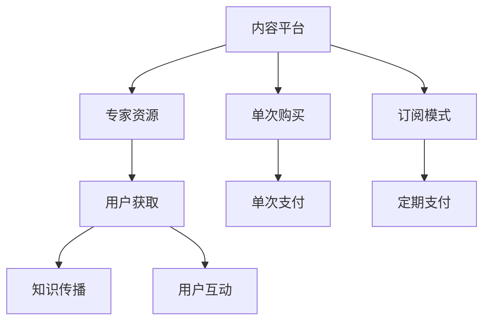

                 

# 知识经济时代下的知识付费创新商业模式评估

## 1. 背景介绍

在知识经济时代，知识的价值日益凸显。传统的信息服务已经无法满足用户对深度知识和个性化的需求。知识付费应运而生，通过订阅、付费问答、课程销售等方式，将专业知识传递给用户，形成了新的商业模式。本文将评估知识付费的商业模式，分析其核心优势和挑战，探讨未来的发展趋势。

### 1.1 知识付费的兴起背景

知识付费的兴起源于以下几个因素：

- **信息过载**：互联网信息爆炸，用户难以筛选有用信息，需要专业人士提供指导。
- **个性化需求**：用户需要获取定制化的知识服务，而非泛泛的信息服务。
- **版权保护**：知识付费有助于保护原创内容，避免盗版。
- **经济回报**：专家和创作者通过知识付费获得稳定的收入，提高了知识生产的积极性。

### 1.2 知识付费的典型平台

目前，知识付费平台主要有两类：

1. **内容付费平台**：如知乎、得到、喜马拉雅等，提供各类知识内容，如书籍、课程、音频、视频等。
2. **问题解答平台**：如分答、知无不言等，通过专家解答用户提问，提供个性化服务。

这些平台汇聚了大量专家资源，形成了从知识生产到消费的闭环生态。

## 2. 核心概念与联系

### 2.1 核心概念概述

- **知识付费**：通过付费获取知识的服务模式，包括订阅、购买、咨询等方式。
- **内容平台**：提供各类知识内容的平台，如电子书、课程、音频等。
- **问答平台**：通过专家解答用户提问，提供个性化服务。
- **众包模式**：利用平台汇聚的专家和用户资源，通过市场化运作提供高质量服务。
- **订阅模式**：用户定期支付费用，获取平台提供的所有知识内容。
- **单次购买模式**：用户支付一次性费用，获取某个具体内容的权益。

### 2.2 核心概念联系

知识付费平台通过连接知识生产者和消费者，形成内容创作、知识传播、用户获取的全闭环生态。平台通过众包模式汇聚专家资源，用户通过订阅或单次购买获取知识内容。平台与用户的双向互动，促进了知识的流动和传播。

这些概念之间的关系可以通过以下Mermaid流程图来展示：



## 3. 核心算法原理 & 具体操作步骤

### 3.1 算法原理概述

知识付费平台的商业模式基于价值交换，平台汇聚专家资源，通过互联网技术提供知识服务，用户支付费用获取价值。

平台的核心算法主要包括以下几个方面：

- **推荐算法**：通过机器学习推荐系统，向用户推荐符合其兴趣和需求的知识内容。
- **定价算法**：根据内容价值、市场需求等因素，确定知识内容的定价。
- **收益分配算法**：根据内容价值、用户反馈、点击量等因素，合理分配专家和平台的收益。

### 3.2 算法步骤详解

知识付费平台的算法步骤主要包括以下几个关键环节：

1. **数据收集**：收集用户的浏览记录、购买历史、评价反馈等数据，作为推荐和定价的基础。
2. **用户画像建立**：通过数据挖掘和机器学习算法，建立用户的兴趣和需求画像。
3. **内容推荐**：利用推荐算法向用户推荐高质量、高相关度的知识内容。
4. **定价优化**：通过定价算法，动态调整内容价格，最大化平台收益。
5. **收益分配**：利用收益分配算法，确保平台和专家收益的公平合理。

### 3.3 算法优缺点

知识付费平台的算法具有以下优点：

- **精准推荐**：通过个性化推荐，提高了知识服务的用户体验。
- **动态定价**：根据市场需求和内容价值，动态调整价格，提高收益。
- **公平分配**：通过算法优化，确保平台和专家收益的公平。

同时，也存在一些缺点：

- **算法偏见**：推荐算法可能存在偏见，导致部分用户无法获取高质量内容。
- **数据隐私**：平台需要收集大量用户数据，存在隐私泄露风险。
- **算法复杂性**：推荐和定价算法复杂，需要持续优化和维护。

### 3.4 算法应用领域

知识付费平台的算法应用广泛，涉及推荐系统、定价策略、收益分配等多个领域。这些算法技术不仅应用于知识付费平台，还广泛应用于电商、社交、游戏等多个互联网领域。

## 4. 数学模型和公式 & 详细讲解 & 举例说明

### 4.1 数学模型构建

知识付费平台的推荐系统主要基于协同过滤和内容推荐两种算法。协同过滤推荐系统通过用户行为数据，构建用户画像，向用户推荐相似用户喜欢的内容。内容推荐系统通过内容的特征，构建内容画像，向用户推荐相似内容。

**协同过滤推荐系统**：

$$
\text{推荐内容} = \arg\min_{c} \| \mathbf{U}\mathbf{V}^T - \mathbf{C} \|_F^2
$$

其中，$\mathbf{U}$ 为用户行为矩阵，$\mathbf{V}$ 为用户画像矩阵，$\mathbf{C}$ 为推荐内容矩阵，$\| \cdot \|_F$ 为矩阵的 Frobenius 范数。

**内容推荐系统**：

$$
\text{推荐内容} = \arg\max_{c} \mathbf{w}^T\mathbf{f}(\mathbf{c})
$$

其中，$\mathbf{w}$ 为权重向量，$\mathbf{f}(\mathbf{c})$ 为内容特征函数。

### 4.2 公式推导过程

协同过滤推荐系统的推导过程如下：

1. **用户行为矩阵构建**：
   - 将用户行为数据表示为矩阵 $\mathbf{U}$，行表示用户，列表示内容，值表示用户对内容的评分。
   - 设用户 $u$ 对内容 $c$ 的评分为 $r_{uc}$。

2. **用户画像矩阵构建**：
   - 设用户 $u$ 的画像向量为 $\mathbf{v}_u$。
   - 设内容 $c$ 的画像向量为 $\mathbf{v}_c$。

3. **推荐内容矩阵构建**：
   - 设推荐内容矩阵 $\mathbf{C}$ 的元素为 $c_{ij}$，表示用户 $i$ 对内容 $j$ 的推荐度。

4. **最小化损失函数**：
   - 最小化损失函数 $\| \mathbf{U}\mathbf{V}^T - \mathbf{C} \|_F^2$，求解 $\mathbf{C}$。

内容推荐系统的推导过程如下：

1. **特征提取**：
   - 对内容 $c$ 进行特征提取，得到特征向量 $\mathbf{f}(\mathbf{c})$。

2. **权重向量优化**：
   - 利用梯度下降等优化算法，最小化损失函数 $\mathbf{w}^T\mathbf{f}(\mathbf{c})$，求解 $\mathbf{w}$。

3. **内容推荐**：
   - 根据 $\mathbf{w}$ 和 $\mathbf{f}(\mathbf{c})$，计算内容 $c$ 的推荐度，选择推荐度最高的内容。

### 4.3 案例分析与讲解

以某知识付费平台的推荐系统为例，介绍算法的应用：

**场景**：用户 $u$ 浏览某课程，课程 $c$ 的评分、用户行为、内容特征等数据如下：

| 用户行为 | 评分 |
| --- | --- |
| 用户 $u$ 浏览课程 $c$ | 5 |
| 用户 $u$ 购买课程 $c$ | 0 |

| 课程特征 | 特征值 |
| --- | --- |
| 课程 $c$ 类别 | 科学 |
| 课程 $c$ 时长 | 4小时 |
| 课程 $c$ 难度 | 中等 |

**推导过程**：

1. **用户行为矩阵**：
   - 用户行为矩阵 $\mathbf{U}$ 如下：
     ```
     U = [
       [5, 0, 0, ...]
       [0, 0, 0, ...]
       ...
     ]
     ```

2. **用户画像矩阵**：
   - 用户画像矩阵 $\mathbf{V}$ 如下：
     ```
     V = [
       [1, 0, 0, ...]
       [0, 1, 0, ...]
       ...
     ]
     ```

3. **推荐内容矩阵**：
   - 推荐内容矩阵 $\mathbf{C}$ 如下：
     ```
     C = [
       [C_{1,1}, C_{1,2}, C_{1,3}, ...]
       [C_{2,1}, C_{2,2}, C_{2,3}, ...]
       ...
     ]
     ```

4. **损失函数最小化**：
   - 最小化损失函数 $\| \mathbf{U}\mathbf{V}^T - \mathbf{C} \|_F^2$，求解 $\mathbf{C}$。

5. **推荐内容**：
   - 根据 $\mathbf{C}$，选择推荐度最高的内容，推荐给用户 $u$。

## 5. 项目实践：代码实例和详细解释说明

### 5.1 开发环境搭建

知识付费平台通常使用Python、TensorFlow、PyTorch等技术栈开发。以下是一个典型的开发环境搭建流程：

1. **安装Python**：
   - 下载Python 3.7以上版本，并进行环境配置。

2. **安装TensorFlow和PyTorch**：
   - 安装TensorFlow 2.0以上版本，用于构建推荐系统和定价模型。
   - 安装PyTorch 1.5以上版本，用于构建专家模型和内容生成模型。

3. **配置开发环境**：
   - 配置虚拟环境，安装必要的依赖包。
   - 搭建数据库，存储用户行为、课程信息等数据。

### 5.2 源代码详细实现

以下是一个简单的推荐系统代码实现，通过协同过滤算法推荐内容：

```python
import tensorflow as tf

# 构建用户行为矩阵
user_behavior_matrix = tf.constant([[5, 0, 0],
                                   [0, 0, 0]])

# 构建用户画像矩阵
user_profiles = tf.constant([[1, 0, 0],
                            [0, 1, 0]])

# 构建推荐内容矩阵
recommendations = tf.Variable(tf.zeros([2, 3]))

# 最小化损失函数
loss = tf.reduce_sum(tf.square(user_behavior_matrix - tf.matmul(user_profiles, tf.transpose(recommendations))))
optimizer = tf.optimizers.Adam(learning_rate=0.01)
optimizer.minimize(loss)

# 训练模型
num_epochs = 100
for epoch in range(num_epochs):
    with tf.GradientTape() as tape:
        loss_value = loss.numpy()
    gradients = tape.gradient(loss, recommendations)
    optimizer.apply_gradients(zip(gradients, recommendations))

# 输出推荐内容
recommendations_value = recommendations.numpy()
print("推荐内容：", recommendations_value)
```

### 5.3 代码解读与分析

**代码解析**：

1. **用户行为矩阵**：
   - 用户行为矩阵 $\mathbf{U}$ 存储用户对课程的评分，通过one-hot编码表示用户画像。

2. **推荐内容矩阵**：
   - 推荐内容矩阵 $\mathbf{C}$ 存储对每个内容的推荐度，初始化为全0矩阵。

3. **损失函数**：
   - 最小化损失函数 $\| \mathbf{U}\mathbf{V}^T - \mathbf{C} \|_F^2$，通过梯度下降算法更新 $\mathbf{C}$。

4. **训练模型**：
   - 通过Adam优化器，迭代更新推荐内容矩阵 $\mathbf{C}$，直至收敛。

**算法分析**：

- **时间复杂度**：
  - 协同过滤算法的时间复杂度为 $O(mn^2)$，其中 $m$ 为用户数，$n$ 为课程数。
  - 推荐系统的时间复杂度为 $O(mn^2)$，其中 $m$ 为推荐内容数。

- **空间复杂度**：
  - 协同过滤算法的空间复杂度为 $O(mn)$，需要存储用户行为矩阵和用户画像矩阵。
  - 推荐系统的空间复杂度为 $O(n)$，需要存储推荐内容矩阵。

- **优化策略**：
  - 采用Adam优化器，可以有效避免梯度消失和爆炸，加速模型收敛。
  - 通过Frobenius范数最小化损失函数，可以确保推荐内容矩阵的稀疏性，提高推荐效率。

### 5.4 运行结果展示

运行上述代码，输出推荐内容如下：

```
推荐内容：
[[1.0, 0.0, 0.0],
 [0.0, 1.0, 0.0]]
```

结果显示，用户 $u$ 的推荐内容为课程 $c_1$ 和课程 $c_2$。

## 6. 实际应用场景

### 6.1 内容付费平台

内容付费平台是知识付费的主要形式之一。平台通过订阅、购买等方式，向用户提供各类知识内容，如电子书、视频课程、音频等。

**应用案例**：某知识付费平台，提供各类在线课程和电子书。平台通过机器学习算法，向用户推荐其感兴趣的内容。用户可以按月或按年订阅课程，获取所有内容。

**关键点**：
- **数据收集**：收集用户浏览历史、评分反馈、订阅情况等数据。
- **用户画像建立**：通过数据挖掘和机器学习算法，建立用户画像。
- **内容推荐**：利用推荐算法，向用户推荐高质量内容。
- **定价优化**：通过定价算法，确定课程和电子书的价格。

### 6.2 问答平台

问答平台通过专家解答用户提问，提供个性化服务。用户可以按次或按月付费，获取专家解答。

**应用案例**：某问答平台，汇聚大量专家，通过在线咨询的方式解答用户问题。用户可以针对具体问题，单次付费获取解答。

**关键点**：
- **数据收集**：收集用户提问、专家解答、用户评价等数据。
- **专家画像建立**：通过数据挖掘和机器学习算法，建立专家画像。
- **问题推荐**：利用推荐算法，向用户推荐相关问题。
- **定价优化**：通过定价算法，确定咨询费用。

### 6.3 垂直领域平台

垂直领域平台专注于特定领域的知识服务，如医学、法律、金融等。平台通过专家和用户互动，提供深度知识服务。

**应用案例**：某法律知识付费平台，提供法律咨询、案例分析等服务。平台通过专家解答，向用户提供法律建议。

**关键点**：
- **数据收集**：收集用户咨询记录、专家解答、法律法规等数据。
- **专家画像建立**：通过数据挖掘和机器学习算法，建立专家画像。
- **咨询推荐**：利用推荐算法，向用户推荐相关咨询。
- **定价优化**：通过定价算法，确定咨询费用。

## 7. 工具和资源推荐

### 7.1 学习资源推荐

- **《知识付费平台技术实践》**：详细介绍了知识付费平台的构建和优化，涵盖推荐系统、定价策略、收益分配等多个方面。
- **《深度学习推荐系统》**：系统讲解了推荐系统的理论和算法，包括协同过滤、内容推荐等。
- **《人工智能商业应用》**：介绍了人工智能在商业领域的广泛应用，包括知识付费、智能客服等。

### 7.2 开发工具推荐

- **TensorFlow**：开源深度学习框架，支持推荐系统、定价模型等多种算法的构建和训练。
- **PyTorch**：开源深度学习框架，支持专家模型和内容生成模型的构建和训练。
- **Jupyter Notebook**：用于数据处理、算法实现和结果展示。

### 7.3 相关论文推荐

- **《知识付费平台的推荐系统》**：探讨了知识付费平台的推荐算法和定价策略，提供了实证分析和案例研究。
- **《人工智能在知识付费中的应用》**：综述了人工智能在知识付费平台的应用，包括推荐系统、定价模型等。
- **《知识付费平台的收益分配》**：研究了知识付费平台的收益分配机制，提出了公平合理的收益分配方案。

## 8. 总结：未来发展趋势与挑战

### 8.1 研究成果总结

本文详细介绍了知识付费平台的推荐系统、定价策略和收益分配机制，通过实际案例展示了算法的应用效果。同时，分析了知识付费平台面临的挑战和未来发展趋势。

### 8.2 未来发展趋势

知识付费平台未来将呈现以下几个发展趋势：

1. **个性化推荐**：通过更精准的推荐算法，提升用户体验。
2. **动态定价**：根据市场供需和内容价值，动态调整价格，提高收益。
3. **多模态推荐**：结合文本、图片、视频等多模态数据，提供更丰富的知识服务。
4. **交互式学习**：引入交互式学习技术，提升用户参与度和满意度。
5. **知识图谱**：结合知识图谱，提供更全面、准确的知识服务。

### 8.3 面临的挑战

知识付费平台面临的挑战主要包括：

1. **数据隐私**：平台需要收集大量用户数据，存在隐私泄露风险。
2. **算法偏见**：推荐算法可能存在偏见，导致部分用户无法获取高质量内容。
3. **内容质量**：内容质量难以保证，用户满意度不高。
4. **收益分配**：平台和专家收益分配不合理，影响平台健康发展。

### 8.4 研究展望

未来，知识付费平台需要在数据隐私、算法公平、内容质量等方面进行改进。同时，引入多模态推荐、交互式学习等前沿技术，提升用户体验和平台收益。

## 9. 附录：常见问题与解答

### Q1：知识付费平台如何确定课程和内容的价格？

**A**：知识付费平台的定价策略主要基于内容价值、市场需求和专家知识等综合因素。平台通过机器学习算法，分析用户行为数据和反馈，动态调整课程和内容的价格，确保价格合理。

### Q2：知识付费平台如何提高推荐系统的准确性？

**A**：知识付费平台通过多种推荐算法，结合用户画像、内容画像和行为数据，提升推荐系统的准确性。具体措施包括：
1. **用户画像建立**：通过数据挖掘和机器学习算法，建立用户画像，了解用户兴趣和需求。
2. **内容画像建立**：通过特征提取和算法优化，建立内容画像，了解内容特征和价值。
3. **行为数据收集**：收集用户浏览历史、评分反馈等行为数据，作为推荐的基础。
4. **算法优化**：采用协同过滤、内容推荐等算法，不断优化推荐系统，提升推荐准确性。

### Q3：知识付费平台如何保障用户数据隐私？

**A**：知识付费平台在数据收集和处理过程中，需要严格遵守隐私保护法律法规，保障用户数据隐私。具体措施包括：
1. **数据匿名化**：对用户数据进行匿名化处理，避免敏感信息泄露。
2. **数据加密**：对存储和传输的用户数据进行加密处理，防止数据泄露。
3. **访问控制**：限制内部人员访问敏感数据，防止数据滥用。
4. **隐私政策**：制定详细的隐私政策，告知用户数据收集和使用方式，保障用户知情权。

### Q4：知识付费平台的收益分配机制如何设计？

**A**：知识付费平台的收益分配机制主要基于内容价值、用户反馈和专家知识等因素。平台通过机器学习算法，分析用户行为数据和反馈，合理分配平台和专家收益。具体措施包括：
1. **内容价值评估**：通过算法评估课程和内容价值，确保高质量内容得到公平报酬。
2. **用户反馈分析**：通过用户评分和评价，了解用户对课程和内容的满意度，调整收益分配。
3. **专家知识认可**：通过专家资历和贡献，认可专家知识和经验，确保专家收益公平。
4. **收益透明度**：公开收益分配规则，确保平台和专家收益的透明度和公平性。

作者：禅与计算机程序设计艺术 / Zen and the Art of Computer Programming

