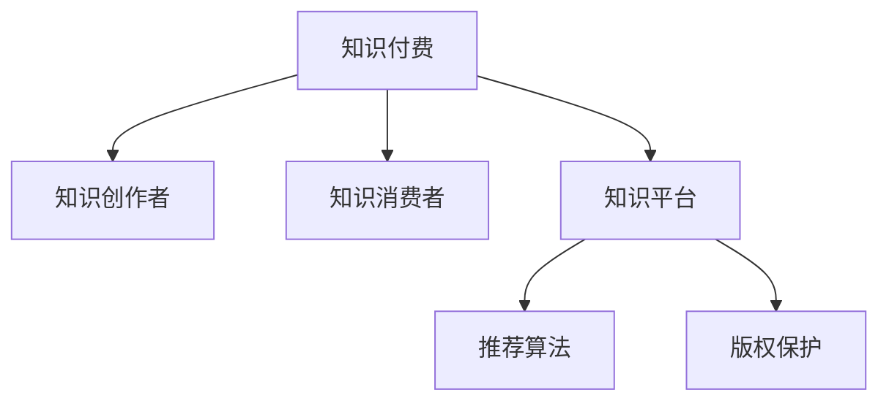

                 

# 知识经济时代下的知识付费创新商业模式运营

在知识经济的时代，知识付费已经成为一种重要的商业模式，其背后的驱动因素多样，包括知识的社会价值、信息不对称、知识分享的意愿、技术的赋能等。文章将从背景介绍、核心概念与联系、核心算法原理与具体操作步骤、数学模型与公式、项目实践、实际应用场景、工具和资源推荐、未来发展趋势与挑战以及附录等几个方面深入探讨知识付费创新商业模式运营的机制和策略。

## 1. 背景介绍

### 1.1 问题由来

知识付费是随着互联网技术的发展、信息获取方式的变化和人们对于知识价值认知的提高而逐步兴起的商业模式。它通过为知识产品设定价格，激励知识和技能的高效传播，同时满足人们在获取高质量信息方面的需求。在知识经济时代，随着技术的进步，知识付费模式正在不断创新和发展，从单一的线上课程、电子书等扩展到更丰富的形式，如问答社区、咨询服务等。

### 1.2 问题核心关键点

知识付费的核心在于知识内容的价值实现，如何平衡知识的商业化和其公益属性，是创新的关键。它需要建立一套能够吸引知识创作者和消费者的生态系统，同时确保内容的质量和平台的安全性。此外，如何通过数据和算法驱动内容推荐，提高用户粘性，也是值得深入探讨的课题。

## 2. 核心概念与联系

### 2.1 核心概念概述

为更好地理解知识付费的运营机制，本节将介绍几个密切相关的核心概念：

- **知识付费**：一种商业模式，通过为知识产品设置价格，激励知识生产者创作优质内容，满足用户对知识和技能的需求。
- **知识创作者**：内容生产者，通常包括专家、学者、作者等，他们通过提供有价值的信息和技能获取报酬。
- **知识消费者**：付费获取知识的个人或企业，他们在知识消费中寻求知识解决具体问题或获取新技能。
- **知识平台**：提供知识付费服务的网络平台，如知识付费APP、在线教育平台等。
- **推荐算法**：利用机器学习技术，为用户推荐可能感兴趣的内容。
- **版权保护**：确保知识内容不被非法复制和传播，保护创作者的知识产权。

这些概念之间的逻辑关系可以通过以下Mermaid流程图来展示：



这个流程图展示出知识付费的基本构成要素及其相互关系：知识付费的运营主要依赖于知识创作者提供优质内容、知识消费者支付费用、知识平台提供服务、推荐算法驱动内容推荐、版权保护确保内容安全。

## 3. 核心算法原理 & 具体操作步骤
### 3.1 算法原理概述

知识付费平台的核心算法通常基于用户行为数据和内容特征，通过机器学习模型构建推荐系统，为知识消费者提供个性化的内容推荐。这一过程通常包括以下几个步骤：

1. **数据收集**：收集用户浏览、搜索、订阅、购买等行为数据，以及知识内容的元数据（如作者、主题、关键词等）。
2. **特征提取**：将用户行为数据和内容特征转化为机器学习算法能够处理的数值特征。
3. **模型训练**：选择适当的机器学习模型，利用历史行为数据进行训练，预测用户对不同内容的可能兴趣。
4. **内容推荐**：根据预测结果，向用户推荐可能感兴趣的知识内容。

### 3.2 算法步骤详解

知识付费平台的推荐算法通常包含以下几个关键步骤：

**Step 1: 数据收集与预处理**
- 利用API或爬虫技术收集用户行为数据（如搜索记录、浏览历史、购买记录等）。
- 收集内容元数据（如标题、作者、标签等），用于特征提取。
- 对数据进行清洗、去重、填充缺失值等预处理操作。

**Step 2: 特征提取与工程**
- 选择有效的特征，如用户ID、内容ID、浏览时长、评分、评论数等。
- 利用TF-IDF、词嵌入（如Word2Vec、GloVe）等技术，将文本数据转化为数值特征。
- 构建用户-内容交互矩阵，记录用户对内容的交互情况。

**Step 3: 模型选择与训练**
- 选择适当的推荐算法，如协同过滤、矩阵分解、深度学习等。
- 利用交叉验证、网格搜索等技术，选择最优的模型参数。
- 训练模型，利用历史数据进行预测。

**Step 4: 内容推荐与优化**
- 根据模型预测结果，向用户推荐可能感兴趣的内容。
- 利用A/B测试、在线实验等方法，优化推荐效果。
- 实时监控推荐系统性能，根据用户反馈进行迭代优化。

### 3.3 算法优缺点

知识付费平台的推荐算法具有以下优点：

- **提升用户体验**：个性化推荐能够显著提升用户满意度，增加平台粘性。
- **优化资源配置**：合理分配内容资源，让高质量的内容能够获得更多曝光。
- **市场定位明确**：通过推荐算法，平台能够精准定位目标用户，提升市场竞争力。

同时，也存在以下缺点：

- **数据隐私问题**：收集和分析用户行为数据涉及隐私，需要采取严格的保护措施。
- **冷启动问题**：新用户没有足够的历史数据，难以进行有效推荐。
- **算法偏见**：推荐算法可能存在偏见，影响推荐结果的公平性和多样性。
- **动态变化**：用户兴趣和行为不断变化，需要持续优化模型。

### 3.4 算法应用领域

知识付费平台的推荐算法在多个领域得到广泛应用，包括但不限于：

- **在线教育**：推荐用户感兴趣的课程和教材，提高学习效果。
- **职业培训**：推荐与用户职业发展相关的技能和认证，提升职业竞争力。
- **心理咨询**：推荐合适的心理咨询师或课程，提供心理支持。
- **健康管理**：推荐健康相关的内容，如饮食、运动、医疗咨询等。
- **职业技能**：推荐与职业发展相关的书籍、课程、工作坊等。

## 4. 数学模型和公式 & 详细讲解 & 举例说明
### 4.1 数学模型构建

知识付费平台的推荐系统通常基于协同过滤和矩阵分解等算法，通过用户行为数据和内容特征，预测用户对不同内容的兴趣。以协同过滤算法为例，数学模型可表示如下：

设用户集合为 $U$，内容集合为 $I$，用户与内容之间的交互关系表示为 $R_{ui}$。协同过滤算法的目标是根据用户 $u$ 与内容 $i$ 的交互关系 $R_{ui}$，预测用户 $u$ 对内容 $i$ 的兴趣 $p_u(i)$。常见的方法包括基于用户的协同过滤、基于内容的协同过滤等。

### 4.2 公式推导过程

以基于用户的协同过滤为例，设 $U$ 中用户 $u$ 对内容 $i$ 的评分 $r_{ui}$ 为 1 或 0（表示是否进行过交互），则协同过滤算法可以表示为：

$$
p_u(i) = \frac{\sum_{j \in N_u} r_{uj} r_{ji}}{\sqrt{\sum_{j \in N_u} r_{uj}^2} \sqrt{\sum_{j \in N_i} r_{ji}^2}}
$$

其中 $N_u$ 为与用户 $u$ 进行过交互的内容集合，$N_i$ 为内容 $i$ 进行过交互的用户集合。

利用矩阵分解技术，可以将协同过滤算法表示为如下形式：

$$
P \approx QDQ^T
$$

其中 $P$ 为用户兴趣矩阵，$Q$ 为内容特征矩阵，$D$ 为对角矩阵，用于表示内容的权重。

### 4.3 案例分析与讲解

以某知识付费平台为例，利用协同过滤算法进行用户内容推荐。设该平台有 $M$ 个用户和 $N$ 个课程，用户对课程的评分矩阵为 $R \in \{0,1\}^{M \times N}$。利用协同过滤算法，对用户 $u$ 推荐前 $k$ 个课程 $i_1, i_2, \ldots, i_k$，可以表示为：

$$
(i_1, i_2, \ldots, i_k) = \text{argsort}\left(\frac{1}{\sqrt{\sum_{j \in N_u} r_{uj}^2}}\left(\frac{R_u^T D^{1/2} Q Q^T D^{1/2} R_i}{\sqrt{\sum_{j \in N_i} r_{ji}^2}}\right)\right)
$$

其中 $\text{argsort}$ 函数返回从大到小排序后的索引。

## 5. 项目实践：代码实例和详细解释说明
### 5.1 开发环境搭建

在进行知识付费平台推荐系统的开发前，需要先准备好开发环境。以下是使用Python进行开发的环境配置流程：

1. 安装Anaconda：从官网下载并安装Anaconda，用于创建独立的Python环境。

2. 创建并激活虚拟环境：
```bash
conda create -n recommendation-env python=3.8 
conda activate recommendation-env
```

3. 安装PyTorch：根据CUDA版本，从官网获取对应的安装命令。例如：
```bash
conda install pytorch torchvision torchaudio cudatoolkit=11.1 -c pytorch -c conda-forge
```

4. 安装各类工具包：
```bash
pip install numpy pandas scikit-learn matplotlib tqdm jupyter notebook ipython
```

完成上述步骤后，即可在`recommendation-env`环境中开始开发。

### 5.2 源代码详细实现

我们以某知识付费平台的协同过滤推荐系统为例，给出使用PyTorch进行实现的完整代码。

```python
import torch
from torch import nn
from torch.nn import functional as F
from torch.utils.data import Dataset, DataLoader
from sklearn.model_selection import train_test_split
from sklearn.metrics import mean_squared_error

class RecommendationDataset(Dataset):
    def __init__(self, ratings, num_users, num_items):
        self.ratings = ratings
        self.num_users = num_users
        self.num_items = num_items
        self.train_users = []
        self.train_items = []
        self.test_users = []
        self.test_items = []
        for u, item in ratings:
            if u < num_users:
                self.train_users.append(u)
                self.train_items.append(item)
            else:
                if u == num_users + 1:
                    self.test_users.append(u)
                    self.test_items.append(item)
    
    def __len__(self):
        return len(self.train_users) + len(self.test_users)
    
    def __getitem__(self, idx):
        if idx < len(self.train_users):
            user = self.train_users[idx]
            item = self.train_items[idx]
            return user, item
        else:
            user = self.test_users[idx - len(self.train_users)]
            item = self.test_items[idx - len(self.train_users)]
            return user, item

class CollaborativeFiltering(nn.Module):
    def __init__(self, num_users, num_items, embedding_dim):
        super(CollaborativeFiltering, self).__init__()
        self.user_embed = nn.Embedding(num_users, embedding_dim)
        self.item_embed = nn.Embedding(num_items, embedding_dim)
        self.w = nn.Parameter(torch.randn(num_users, num_items))
    
    def forward(self, user_ids, item_ids):
        user_emb = self.user_embed(user_ids)
        item_emb = self.item_embed(item_ids)
        dot_product = (user_emb * item_emb).sum(dim=1)
        w = self.w[user_ids]
        return dot_product + w
    
    def predict(self, user_ids, item_ids):
        user_emb = self.user_embed(user_ids)
        item_emb = self.item_embed(item_ids)
        dot_product = (user_emb * item_emb).sum(dim=1)
        w = self.w[user_ids]
        return dot_product + w
    
    def compute_mse_loss(self, predictions, targets):
        return F.mse_loss(predictions, targets)

# 数据准备
ratings = [(0, 1), (1, 0), (2, 1), (3, 0), (4, 1), (5, 0), (6, 1), (7, 0), (8, 1), (9, 0)]
num_users = 10
num_items = 10

# 数据集划分
train, test = train_test_split(ratings, test_size=0.2, random_state=42)

# 模型训练
embedding_dim = 10
num_epochs = 100
model = CollaborativeFiltering(num_users, num_items, embedding_dim)
optimizer = torch.optim.Adam(model.parameters(), lr=0.01)
criterion = nn.MSELoss()

for epoch in range(num_epochs):
    for user, item in train:
        optimizer.zero_grad()
        predictions = model.predict(user, item)
        loss = criterion(predictions, 1)
        loss.backward()
        optimizer.step()
    
    # 评估
    with torch.no_grad():
        for user, item in test:
            predictions = model.predict(user, item)
            loss = criterion(predictions, 1)
            print(f'Epoch {epoch+1}, Test Loss: {loss:.4f}')

# 结果展示
```

以上就是使用PyTorch进行知识付费平台协同过滤推荐系统的完整代码实现。可以看到，通过定义`RecommendationDataset`和`CollaborativeFiltering`类，我们可以很方便地构建数据集和推荐模型，并通过优化器进行训练。

### 5.3 代码解读与分析

让我们再详细解读一下关键代码的实现细节：

**RecommendationDataset类**：
- `__init__`方法：初始化用户、物品、评分等关键组件，并将数据划分为训练集和测试集。
- `__len__`方法：返回数据集的样本数量。
- `__getitem__`方法：对单个样本进行处理，返回用户ID和物品ID。

**CollaborativeFiltering类**：
- `__init__`方法：定义嵌入层和权重参数。
- `forward`方法：实现前向传播，计算用户-物品交互的加权和。
- `predict`方法：根据输入的用户和物品ID，计算预测值。
- `compute_mse_loss`方法：计算预测值和真实值的均方误差损失。

**训练流程**：
- 利用`RecommendationDataset`构建训练集和测试集。
- 定义`CollaborativeFiltering`模型和优化器。
- 循环迭代，对每个训练样本进行前向传播和反向传播，计算损失，更新模型参数。
- 周期性在测试集上评估模型性能。

## 6. 实际应用场景

### 6.1 智能课程推荐

智能课程推荐是知识付费平台的重要应用场景之一。通过协同过滤等算法，平台可以为用户推荐与其兴趣相匹配的课程，提高用户满意度和平台粘性。

在技术实现上，可以收集用户的历史浏览、评分、购买等数据，构建用户-课程交互矩阵。利用协同过滤算法，根据用户的历史行为，预测其对不同课程的兴趣，并推荐相关课程。此外，平台还可以通过内容标签、热门课程、用户评价等多维度信息，综合优化推荐结果。

### 6.2 个性化阅读推荐

个性化阅读推荐系统可以为用户提供定制化的书籍推荐，满足用户对高质量内容的追求。推荐系统通过分析用户阅读历史、评分、标记等数据，为用户推荐可能感兴趣的书籍。

在技术实现上，可以构建用户-书籍交互矩阵，利用协同过滤算法预测用户对不同书籍的兴趣，并推荐相关书籍。平台还可以引入文本分类、主题模型等技术，进一步提高推荐效果。

### 6.3 职业发展路径规划

职业发展路径规划是知识付费平台在职业培训领域的重要应用。推荐系统可以根据用户的职业背景、技能水平、职业发展目标，为其推荐合适的培训课程和认证，帮助用户提升职业竞争力。

在技术实现上，可以构建用户-课程交互矩阵，利用协同过滤算法预测用户对不同课程的兴趣，并推荐相关课程。平台还可以通过分析用户的工作经历、技能图谱等信息，推荐合适的职业发展路径。

### 6.4 未来应用展望

随着知识付费平台推荐技术的发展，未来将有更多创新的应用场景出现，如：

- **智能问答系统**：利用自然语言处理技术，为用户提供24小时在线咨询服务。推荐系统可以根据用户的问题类型、历史互动记录，推荐合适的回答模板。
- **智能决策支持**：为企业管理者提供智能决策支持，如市场分析、风险评估、战略规划等。推荐系统可以根据企业历史数据、市场环境，推荐合适的决策方案。
- **个性化健康管理**：为健康管理平台提供个性化推荐，如饮食方案、运动计划、健康咨询等。推荐系统可以根据用户健康数据、生活习惯，推荐合适的健康方案。
- **创意内容创作**：为创意内容创作者提供灵感推荐，如写作素材、艺术作品等。推荐系统可以根据用户的创作背景、风格偏好，推荐相关内容。

## 7. 工具和资源推荐

### 7.1 学习资源推荐

为了帮助开发者系统掌握知识付费的推荐技术，这里推荐一些优质的学习资源：

1. **《推荐系统实战》**：介绍推荐系统的原理、算法和实践，包含协同过滤、矩阵分解、深度学习等多个方面的内容。
2. **《推荐系统评价》**：涵盖推荐系统评估的各类指标和方法，帮助理解推荐系统的性能。
3. **Kaggle推荐系统竞赛**：通过参与竞赛，实践推荐系统算法，学习推荐系统开发的最佳实践。
4. **Coursera推荐系统课程**：由斯坦福大学开设的推荐系统课程，涵盖推荐系统的理论基础和实践技巧。
5. **Udacity推荐系统纳米学位**：提供系统化的推荐系统课程，包括推荐系统设计、算法实现、系统优化等。

通过这些资源的学习实践，相信你一定能够快速掌握知识付费平台的推荐技术，并用于解决实际的推荐问题。

### 7.2 开发工具推荐

高效的开发离不开优秀的工具支持。以下是几款用于知识付费平台推荐系统开发的常用工具：

1. **PyTorch**：基于Python的开源深度学习框架，灵活的计算图，适合快速迭代研究。
2. **TensorFlow**：由Google主导开发的开源深度学习框架，生产部署方便，适合大规模工程应用。
3. **Spark**：分布式计算框架，适用于大规模数据处理和推荐系统优化。
4. **Elasticsearch**：分布式搜索引擎，适合处理大规模文本数据，用于推荐系统的用户行为记录存储。
5. **Flume**：分布式数据采集系统，用于实时收集用户行为数据，保障数据的准确性和完整性。

合理利用这些工具，可以显著提升知识付费平台推荐系统的开发效率，加快创新迭代的步伐。

### 7.3 相关论文推荐

知识付费平台的推荐技术源于学界的持续研究。以下是几篇奠基性的相关论文，推荐阅读：

1. **《协同过滤推荐系统》**：详细介绍了协同过滤算法的基本原理和实现方法。
2. **《深度学习在推荐系统中的应用》**：介绍了深度学习技术在推荐系统中的应用，包括神经协同过滤、深度矩阵分解等。
3. **《基于内容的推荐系统》**：介绍了基于内容的推荐算法，通过分析物品的特征，为用户推荐相关物品。
4. **《用户行为分析与推荐系统》**：介绍了用户行为分析在推荐系统中的作用，如兴趣建模、时间关联等。
5. **《推荐系统的多样性和公平性》**：讨论了推荐系统的多样性和公平性问题，提出了相应的优化方法。

这些论文代表了大数据推荐系统的研究进展，通过学习这些前沿成果，可以帮助研究者把握学科前进方向，激发更多的创新灵感。

## 8. 总结：未来发展趋势与挑战

### 8.1 总结

本文对知识付费平台的推荐技术进行了全面系统的介绍。首先阐述了知识付费平台的背景和意义，明确了推荐系统在平台运营中的核心地位。其次，从原理到实践，详细讲解了推荐算法的数学模型、实现步骤和应用场景，给出了推荐系统开发的完整代码实例。同时，本文还探讨了知识付费平台在多个领域的应用前景，展示了推荐技术在NLP、健康管理、职业培训等领域的创新潜力。此外，本文精选了推荐技术的各类学习资源，力求为读者提供全方位的技术指引。

通过本文的系统梳理，可以看到，知识付费平台的推荐技术正在成为平台运营的重要驱动力，极大地提升了用户满意度和平台竞争力。未来，伴随推荐算法的不断演进，知识付费平台推荐技术将进一步深化和拓展，为知识付费商业模式的可持续发展提供强有力保障。

### 8.2 未来发展趋势

展望未来，知识付费平台的推荐技术将呈现以下几个发展趋势：

1. **算法多样化**：除了协同过滤、矩阵分解等传统方法，未来将涌现更多高效的推荐算法，如深度学习、知识图谱等。
2. **数据智能化**：利用大数据技术，对用户行为数据进行深度分析和挖掘，提升推荐精度和个性化程度。
3. **实时化**：通过实时数据流处理技术，实现推荐系统的实时更新和优化。
4. **多模态融合**：将推荐算法与其他模态信息（如视觉、音频等）进行融合，提升推荐效果。
5. **隐私保护**：引入隐私保护技术，保护用户数据隐私，提升用户信任度。
6. **模型可解释性**：提高推荐算法的可解释性，帮助用户理解推荐结果的依据。

这些趋势凸显了推荐技术在知识付费平台中的重要地位，未来需要不断创新和优化，才能实现推荐系统的持续优化和升级。

### 8.3 面临的挑战

尽管知识付费平台的推荐技术已经取得了一定的进展，但在迈向更加智能化、个性化的过程中，它仍面临着诸多挑战：

1. **数据隐私问题**：收集和分析用户行为数据涉及隐私，需要采取严格的保护措施。
2. **冷启动问题**：新用户没有足够的历史数据，难以进行有效推荐。
3. **算法偏见**：推荐算法可能存在偏见，影响推荐结果的公平性和多样性。
4. **动态变化**：用户兴趣和行为不断变化，需要持续优化模型。
5. **资源限制**：推荐系统需要大量的计算资源和时间，需要进行优化和优化。

### 8.4 研究展望

面对知识付费平台推荐技术面临的挑战，未来的研究需要在以下几个方面寻求新的突破：

1. **多模态推荐**：将推荐算法与其他模态信息（如视觉、音频等）进行融合，提升推荐效果。
2. **实时推荐系统**：利用实时数据流处理技术，实现推荐系统的实时更新和优化。
3. **知识图谱推荐**：利用知识图谱技术，提升推荐系统的多样性和准确性。
4. **用户行为预测**：利用机器学习技术，预测用户的行为变化，提高推荐系统的动态适应性。
5. **个性化推荐**：通过分析用户的多样化需求，提供更加个性化的推荐服务。

这些研究方向的探索，必将引领知识付费平台推荐技术的不断进步，为知识付费商业模式的可持续发展提供强有力的技术支持。面向未来，知识付费平台需要不断创新和优化推荐算法，才能在激烈的市场竞争中保持领先地位。

## 9. 附录：常见问题与解答

**Q1：知识付费平台的用户画像如何构建？**

A: 用户画像的构建需要收集用户的各类行为数据，如搜索记录、浏览历史、评分、评价等。利用数据挖掘和机器学习技术，可以对用户的行为特征进行聚类和建模，形成用户画像。常用的方法包括K-means聚类、协同过滤、关联规则挖掘等。

**Q2：知识付费平台的推荐系统如何评估效果？**

A: 推荐系统的效果评估通常包括以下指标：准确率、召回率、F1值、NDCG等。这些指标可以帮助评估推荐系统的性能，并指导算法优化。此外，还可以利用A/B测试、在线实验等方法，评估不同推荐策略的效果。

**Q3：知识付费平台的推荐系统如何应对冷启动问题？**

A: 冷启动问题是推荐系统面临的重要挑战。为了应对冷启动问题，可以采用以下方法：
1. 利用用户注册信息、兴趣标签等先验信息，进行初始推荐。
2. 利用先验知识（如领域专家推荐、热门推荐），进行冷启动推荐。
3. 利用推荐算法（如基于内容的推荐、协同过滤），逐步提升推荐精度。

**Q4：知识付费平台的推荐系统如何优化资源利用率？**

A: 推荐系统需要大量的计算资源和时间，需要进行优化和优化。常用的方法包括：
1. 利用分布式计算框架（如Spark），提升计算效率。
2. 利用GPU、TPU等高性能计算设备，加速模型训练和推理。
3. 利用模型压缩、稀疏化存储等技术，减少模型占用资源。

**Q5：知识付费平台的推荐系统如何保护用户隐私？**

A: 保护用户隐私是推荐系统的重要考虑因素。为了保护用户隐私，可以采用以下方法：
1. 对用户数据进行匿名化处理，防止个人信息泄露。
2. 采用差分隐私技术，限制信息泄露的可能性。
3. 设置用户数据访问权限，防止未经授权的访问。

这些回答希望能帮助开发者更好地理解知识付费平台的推荐系统，并解决实际开发中可能遇到的问题。

