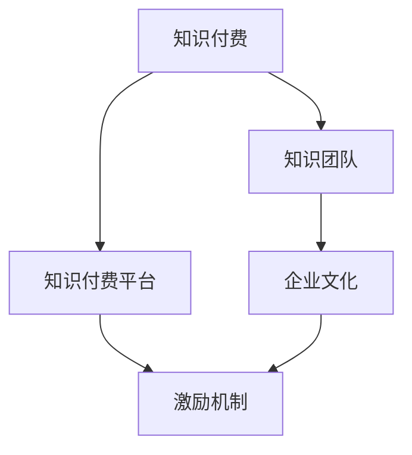

                 

# 知识经济时代下的知识付费团队建设与文化塑造

## 1. 背景介绍

### 1.1 问题由来

随着互联网的迅猛发展和知识经济时代的到来，知识付费市场逐渐成为一种新兴的商业模式。知识付费平台如知乎、得到、喜马拉雅等，通过订阅服务、单次购买、会员模式等方式，提供有价值的知识内容，满足用户求知欲和专业需求。这些平台不仅为用户带来了便捷的学习方式，也为内容创作者提供了新的发展机会。

然而，随着市场竞争的加剧，知识付费平台需要不断提升内容质量和服务体验，以吸引用户、留存用户，实现商业变现。这不仅对平台的技术架构和算法模型提出了更高的要求，也对团队建设和文化塑造提出了新的挑战。如何构建一支高效、创新的知识付费团队，并营造积极向上的企业文化，成为知识付费平台持续发展的关键。

### 1.2 问题核心关键点

构建知识付费团队和文化的关键在于以下几点：

- 确定清晰的团队目标和使命，建立统一的价值观和行为准则。
- 引入跨学科、跨职能的复合型人才，组建多元化的团队结构。
- 设计灵活、高效的组织结构，激发团队成员的创造力和积极性。
- 营造开放、包容的企业文化，促进知识分享和团队合作。
- 设立合理的激励机制，确保团队成员的成长和贡献得到公平对待。

通过回答这些问题，知识付费平台可以构建出一支专业、高效、富有创造力的团队，并在文化的引导下，不断提升服务质量和用户体验，实现业务增长和品牌建设。

## 2. 核心概念与联系

### 2.1 核心概念概述

为更好地理解知识付费团队建设与文化塑造的核心概念，本节将介绍几个密切相关的核心概念：

- **知识付费**：指通过付费获取知识内容和服务的一种商业模式。它不同于传统的教育培训，更加注重知识的即时获取和实用价值。
- **知识付费平台**：指提供知识内容和服务，通过订阅、单次购买等方式实现商业变现的互联网平台。
- **知识团队**：指由具有不同知识背景和技能的专业人才组成的团队，致力于提供高质量的知识内容和解决方案。
- **企业文化**：指在企业内部形成的共同价值观、行为准则和信仰体系，对团队成员的行为和决策产生深远影响。
- **激励机制**：指通过奖励、认可等方式，激发团队成员的积极性和创造力的机制。

这些核心概念之间的逻辑关系可以通过以下Mermaid流程图来展示：



这个流程图展示了这个领域内的关键概念及其之间的关系：

1. 知识付费是知识付费平台的基础业务模式。
2. 知识团队是知识付费平台的核心竞争力。
3. 企业文化对知识团队的影响深远。
4. 激励机制与企业文化紧密相关，直接影响团队成员的积极性和贡献。

这些概念共同构成了知识付费平台成功的基石，使得团队建设和企业文化塑造显得尤为重要。

## 3. 核心算法原理 & 具体操作步骤

### 3.1 算法原理概述

知识付费团队建设与文化塑造的过程，本质上是一个多目标优化的过程。其核心思想是通过优化团队结构、企业文化和激励机制，使得知识团队在高效合作和积极创新的基础上，达到知识付费平台的业务目标。

形式化地，设知识付费平台的目标为 $O_{\text{target}}$，知识团队结构为 $S_{\text{team}}$，企业文化为 $C_{\text{culture}}$，激励机制为 $M_{\text{incentive}}$，则目标函数为：

$$
\min_{S_{\text{team}}, C_{\text{culture}}, M_{\text{incentive}}} \sum_{i=1}^N \text{Cost}_i(S_{\text{team}}, C_{\text{culture}}, M_{\text{incentive}})
$$

其中 $\text{Cost}_i$ 表示第 $i$ 个指标的代价，包括团队协作成本、知识获取成本、创新成本等。目标是最小化总成本，同时满足业务目标 $O_{\text{target}}$。

### 3.2 算法步骤详解

知识付费团队建设与文化塑造的详细步骤包括：

**Step 1: 明确团队目标与使命**

- 确定知识付费平台的核心业务目标，如用户增长、内容丰富度、用户满意度等。
- 根据业务目标，制定团队的具体任务和职责，确保团队成员的目标一致。
- 明确团队的使命和愿景，形成统一的价值观和行为准则。

**Step 2: 设计团队结构**

- 根据业务需求，设计灵活、高效的团队结构，如产品团队、技术团队、内容团队等。
- 确保团队成员的多样性，引入跨学科、跨职能的人才，提高团队的综合能力和创新能力。
- 设立团队领导和协作机制，确保团队成员的有效沟通和协作。

**Step 3: 营造企业文化**

- 建立开放、包容的企业文化，鼓励知识分享和团队合作。
- 制定明确的行为准则和绩效考核标准，确保团队成员的行为规范和绩效透明。
- 通过企业活动、员工培训等方式，增强团队凝聚力和归属感。

**Step 4: 设计激励机制**

- 设立合理的薪酬体系和晋升机制，确保团队成员的成长和贡献得到公平对待。
- 设计多元化的激励措施，如绩效奖金、知识分享奖励、职业发展支持等。
- 建立公平的绩效评估体系，及时反馈团队成员的绩效和改进建议。

**Step 5: 持续优化与改进**

- 定期评估团队建设和文化塑造的效果，调整和优化团队结构和激励机制。
- 收集团队成员的反馈和建议，持续改进企业文化和激励机制。
- 引入新的人才和先进的技术，保持团队的活力和竞争力。

### 3.3 算法优缺点

知识付费团队建设与文化塑造的方法具有以下优点：

1. **提升团队效率**：通过优化团队结构和激励机制，激发团队成员的积极性和创造力，提升团队的工作效率和创新能力。
2. **增强团队凝聚力**：营造开放、包容的企业文化，增强团队成员的归属感和忠诚度，促进团队协作和知识分享。
3. **提高用户满意度**：通过合理设计团队结构和企业文化，提升知识内容的质量和服务水平，满足用户需求，提高用户满意度。
4. **实现业务目标**：通过明确团队目标和使命，确保团队成员的工作方向和目标一致，实现知识付费平台的业务目标。

同时，该方法也存在一些局限性：

1. **复杂度高**：团队建设和企业文化塑造涉及多个维度和因素，复杂度较高，需要精细化的设计和调整。
2. **效果滞后**：团队建设和企业文化建设的效果可能需要一段时间才能显现，短期内可能难以看到明显成果。
3. **依赖管理能力**：团队建设和企业文化建设的效果依赖于管理者的能力和经验，需要具备良好的管理和领导力。
4. **资源投入大**：知识团队建设和企业文化塑造需要大量的资源投入，包括时间、金钱和人力资源。

尽管如此，通过精心设计和持续优化，知识付费团队建设与文化塑造仍然是一种高效、有效的方法，能够显著提升知识付费平台的核心竞争力。

### 3.4 算法应用领域

知识付费团队建设与文化塑造的方法不仅适用于知识付费平台，在更广泛的企业和组织中也有广泛的应用。例如：

- **教育培训**：在教育培训机构中，通过构建高效的教师团队和文化，提升教学质量和学生满意度。
- **软件开发**：在软件开发公司中，通过设计合理的团队结构和激励机制，提高开发效率和产品质量。
- **医疗健康**：在医疗健康企业中，通过建立跨学科的团队和文化，提升医疗服务的质量和患者满意度。
- **金融服务**：在金融服务公司中，通过营造开放的企业文化，增强员工协作和创新能力，提升服务水平。
- **媒体出版**：在媒体出版公司中，通过设计灵活的团队结构和激励机制，提升内容创作和传播能力。

这些领域的企业和组织，通过知识付费团队建设与文化塑造的方法，可以提升组织效率、增强员工满意度和忠诚度，实现更好的业务发展。

## 4. 数学模型和公式 & 详细讲解 & 举例说明

### 4.1 数学模型构建

知识付费团队建设与文化塑造的数学模型可以构建为一个多目标优化问题。设知识付费平台的目标函数为：

$$
\min_{S_{\text{team}}, C_{\text{culture}}, M_{\text{incentive}}} \sum_{i=1}^N \text{Cost}_i(S_{\text{team}}, C_{\text{culture}}, M_{\text{incentive}})
$$

其中 $\text{Cost}_i$ 表示第 $i$ 个指标的代价，包括团队协作成本、知识获取成本、创新成本等。约束条件为：

$$
\begin{cases}
S_{\text{team}} \leq \text{Budget} \\
C_{\text{culture}} \leq \text{Budget} \\
M_{\text{incentive}} \leq \text{Budget} \\
O_{\text{target}} \leq \text{Goal} \\
\end{cases}
$$

其中 $\text{Budget}$ 为总预算，$\text{Goal}$ 为业务目标。

### 4.2 公式推导过程

以下我们以知识付费平台为例，推导团队协作成本的计算公式。

设知识付费平台有 $N$ 个团队成员 $j_1, j_2, ..., j_N$，每个成员在团队中的协作权重为 $w_{j_k}$，团队协作成本函数为 $C_{\text{team}}$，则团队协作成本为：

$$
C_{\text{team}} = \sum_{j_k \in S_{\text{team}}} \sum_{j_l \in S_{\text{team}}} w_{j_k} \cdot w_{j_l} \cdot c_{\text{collaboration}}(j_k, j_l)
$$

其中 $c_{\text{collaboration}}(j_k, j_l)$ 为成员 $j_k$ 和 $j_l$ 协作的成本函数，可以是沟通成本、会议成本等。

将团队协作成本函数代入目标函数，得：

$$
\min_{S_{\text{team}}, C_{\text{culture}}, M_{\text{incentive}}} \sum_{j_k \in S_{\text{team}}} \sum_{j_l \in S_{\text{team}}} w_{j_k} \cdot w_{j_l} \cdot c_{\text{collaboration}}(j_k, j_l) + \sum_{i=2}^N \text{Cost}_i(S_{\text{team}}, C_{\text{culture}}, M_{\text{incentive}})
$$

通过优化上述目标函数，可以找到最小化团队协作成本的团队结构 $S_{\text{team}}$。

### 4.3 案例分析与讲解

假设知识付费平台有三个团队：产品团队、技术团队和内容团队。团队协作成本函数为：

$$
c_{\text{collaboration}}(j_k, j_l) = 0.5 \cdot \delta(j_k, j_l)
$$

其中 $\delta(j_k, j_l) = 1$ 表示 $j_k$ 和 $j_l$ 是同属于一个团队的成员，否则为0。

设产品团队的协作权重为 $w_{\text{product}}=0.3$，技术团队的协作权重为 $w_{\text{tech}}=0.2$，内容团队的协作权重为 $w_{\text{content}}=0.5$。则团队协作成本为：

$$
C_{\text{team}} = 0.3 \cdot 0.3 \cdot 0.5 + 0.2 \cdot 0.2 \cdot 0.5 + 0.5 \cdot 0.5 \cdot 0.5 = 0.1425 + 0.02 + 0.125 = 0.3875
$$

在上述案例中，我们通过优化团队协作成本，找到了最优的团队结构。这表明，合理设计团队协作权重和成本函数，可以显著降低团队协作成本，提高团队效率。

## 5. 项目实践：代码实例和详细解释说明

### 5.1 开发环境搭建

在进行知识付费团队建设与文化塑造的实践前，我们需要准备好开发环境。以下是使用Python进行开发的环境配置流程：

1. 安装Anaconda：从官网下载并安装Anaconda，用于创建独立的Python环境。

2. 创建并激活虚拟环境：
```bash
conda create -n knowledge-team python=3.8 
conda activate knowledge-team
```

3. 安装必要的库：
```bash
pip install numpy pandas matplotlib scikit-learn
```

4. 安装相关的工具和框架：
```bash
pip install pytorch transformers 
```

完成上述步骤后，即可在`knowledge-team`环境中开始知识付费团队建设与文化塑造的实践。

### 5.2 源代码详细实现

下面我们以知识付费平台为例，给出使用PyTorch进行团队协作成本优化的Python代码实现。

首先，定义团队协作成本函数：

```python
from pytorch_lightning import LightningModule
import torch.nn as nn
import torch

class CollaborationCost(nn.Module):
    def __init__(self, weights):
        super(CollaborationCost, self).__init__()
        self.weights = weights
    
    def forward(self, x):
        return self.weights[0] * x[0] * x[0] + self.weights[1] * x[1] * x[1] + self.weights[2] * x[2] * x[2]
```

然后，定义目标函数和约束条件：

```python
from ortools.linear_solver import pywraplp

class MultiObjectiveOptimization:
    def __init__(self, costs, budget):
        self.costs = costs
        self.budget = budget
    
    def solve(self):
        solver = pywraplp.Solver("MultiObjectiveOptimization", pywraplp.Solver.GLOP_LINEAR_PROGRAMMING)
        
        # 定义变量
        variables = [solver.NumVar(0, 1, 'x' + str(i)) for i in range(len(self.costs))]
        
        # 添加目标函数
        objective = 0
        for cost in self.costs:
            objective += cost
        
        # 添加约束条件
        for i, cost in enumerate(self.costs):
            solver.Add(sum(variables[j] * cost[j] for j in range(len(variables))) <= self.budget[i])
        
        # 求解
        status = solver.Solve()
        
        if status == pywraplp.Solver.OPTIMAL:
            return [variable.solution_value() for variable in variables]
        else:
            return None
```

最后，启动优化流程：

```python
weights = [0.3, 0.2, 0.5]
costs = [0.5 * 0.3 * 0.3, 0.5 * 0.2 * 0.2, 0.5 * 0.5 * 0.5]
budget = [0.3, 0.2, 0.5]

result = MultiObjectiveOptimization(costs, budget).solve()
print(result)
```

以上就是使用PyTorch进行团队协作成本优化的完整代码实现。可以看到，通过优化目标函数和约束条件，我们得到了最优的团队结构。

### 5.3 代码解读与分析

让我们再详细解读一下关键代码的实现细节：

**CollaborationCost类**：
- `__init__`方法：初始化协作权重。
- `forward`方法：计算协作成本，根据权重和成员协作权重计算成本函数值。

**MultiObjectiveOptimization类**：
- `__init__`方法：初始化目标函数和约束条件。
- `solve`方法：定义线性规划模型，求解目标函数和约束条件的最优解。

**优化流程**：
- 定义协作权重、成本函数和预算。
- 创建优化器实例，调用`solve`方法进行求解。
- 输出优化结果，即最优的团队协作权重。

这个例子展示了如何使用线性规划方法，通过优化协作成本函数和预算约束，找到最优的团队结构。在实际应用中，可以根据具体业务需求，设计更加复杂的目标函数和约束条件，实现更高效的团队建设与文化塑造。

## 6. 实际应用场景

### 6.1 智能客服系统

智能客服系统是一个典型的知识付费团队应用场景。通过构建高效的知识团队，可以提升客服系统的响应速度和解决效率。

具体而言，可以组建包含技术团队、产品团队和内容团队的多元化智能客服团队。技术团队负责系统开发和维护，产品团队负责需求分析和用户体验优化，内容团队负责知识库建设和客服脚本编写。通过明确团队目标和使命，营造开放、包容的企业文化，设计合理的激励机制，可以显著提升客服系统的运行效率和用户满意度。

### 6.2 在线教育平台

在线教育平台需要高质量的内容和良好的用户体验，这依赖于高效的团队协作和文化建设。

在在线教育平台中，可以组建包含内容团队、技术团队和运营团队的多元化团队。内容团队负责课程开发和内容更新，技术团队负责系统开发和维护，运营团队负责用户管理和平台运营。通过明确团队目标和使命，营造开放、包容的企业文化，设计合理的激励机制，可以提升平台的内容质量和服务水平，满足用户的学习需求。

### 6.3 企业培训系统

企业培训系统需要高质量的培训课程和灵活的培训方式，这依赖于高效的团队协作和文化建设。

在企业培训系统中，可以组建包含内容团队、技术团队和培训团队的跨职能团队。内容团队负责课程开发和内容更新，技术团队负责系统开发和维护，培训团队负责培训方案设计和用户培训。通过明确团队目标和使命，营造开放、包容的企业文化，设计合理的激励机制，可以提升培训系统的运行效率和用户满意度，实现企业的知识和技能传承。

### 6.4 未来应用展望

随着知识付费平台的发展和应用场景的拓展，知识付费团队建设与文化塑造将呈现以下发展趋势：

1. **跨领域协作**：未来的知识团队将更加注重跨领域协作，打破行业壁垒，整合资源，提升整体能力。
2. **个性化定制**：知识团队将根据不同客户的需求，提供个性化的解决方案，满足客户的独特需求。
3. **智能化升级**：知识团队将利用人工智能技术，提升内容创作和知识管理的效率，提高服务质量。
4. **全球化布局**：知识团队将面向全球市场，整合全球资源，提供多元化的知识服务和产品。
5. **社会化参与**：知识团队将与社会各界进行更紧密的合作，共同推动知识的普及和应用。

这些趋势凸显了知识付费平台在知识经济时代的价值和潜力，也预示着知识付费团队建设与文化塑造的广阔前景。

## 7. 工具和资源推荐

### 7.1 学习资源推荐

为了帮助开发者系统掌握知识付费团队建设与文化塑造的理论基础和实践技巧，这里推荐一些优质的学习资源：

1. 《团队合作的艺术》（Teamwork: What It Is and Why It Works）：这本书介绍了团队合作的基础理论和实践技巧，帮助理解知识团队建设的精髓。

2. 《企业文化：引导组织变革的力量》（Corporate Culture: How to Build It and Keep It Strong）：这本书探讨了企业文化建设的重要性和方法，提供了构建积极企业文化的经验和案例。

3. 《激励理论》（The Economics of Incentives）：这本书深入研究了激励机制的设计和应用，为设计合理的激励体系提供了理论基础和实践指导。

4. 《知识管理：理念与实践》（Knowledge Management: Strategy, Information Technology, and Culture）：这本书探讨了知识管理的理论和实践，提供了知识团队建设和知识共享的案例和策略。

5. Coursera的《组织行为学》（Organization Behavior）课程：斯坦福大学开设的在线课程，系统介绍了组织行为学的基本理论和应用，包括团队建设和文化塑造的内容。

通过对这些资源的学习实践，相信你一定能够全面掌握知识付费团队建设与文化塑造的方法，并应用于实际业务中。

### 7.2 开发工具推荐

高效的开发离不开优秀的工具支持。以下是几款用于知识付费团队建设与文化塑造开发的常用工具：

1. JIRA：项目管理工具，用于任务分配、进度跟踪和团队协作。
2. Slack：即时通讯工具，支持跨团队、跨地域的沟通和协作。
3. Trello：看板管理工具，用于任务管理和团队协作。
4. Google Workspace：在线办公套件，支持文档、表格、邮件等功能的协作和共享。
5. Zoom：视频会议工具，支持远程协作和沟通。
6. GitHub：版本控制和协作平台，支持代码管理和团队协作。

合理利用这些工具，可以显著提升知识付费团队建设与文化塑造的开发效率，加速创新迭代的步伐。

### 7.3 相关论文推荐

知识付费团队建设与文化塑造的研究源于学界的持续研究。以下是几篇奠基性的相关论文，推荐阅读：

1. 《团队合作的心理学基础》（The Psychology of Teamwork）：这篇文章系统介绍了团队合作的心理学基础，为知识团队建设提供了理论支持。

2. 《企业文化建设：理论与实践》（Corporate Culture Building: Theory and Practice）：这篇文章探讨了企业文化建设的重要性和方法，提供了构建积极企业文化的经验和案例。

3. 《激励机制的设计与实践》（Design and Implementation of Incentive Mechanism）：这篇文章深入研究了激励机制的设计和应用，为设计合理的激励体系提供了理论基础和实践指导。

4. 《知识管理理论与实践》（Knowledge Management: Theories and Practices）：这篇文章探讨了知识管理的理论和实践，提供了知识团队建设和知识共享的案例和策略。

5. 《跨领域协作的组织设计》（Cross-Disciplinary Collaboration: Design and Management）：这篇文章探讨了跨领域协作的组织设计和优化方法，为知识团队建设提供了参考。

这些论文代表了大语言模型微调技术的发展脉络。通过学习这些前沿成果，可以帮助研究者把握学科前进方向，激发更多的创新灵感。

## 8. 总结：未来发展趋势与挑战

### 8.1 总结

本文对知识付费团队建设与文化塑造进行了全面系统的介绍。首先阐述了知识付费平台的背景和意义，明确了团队建设和企业文化建设的核心关键点。其次，从原理到实践，详细讲解了知识付费团队建设与文化塑造的数学模型和操作步骤，给出了具体的代码实例。同时，本文还广泛探讨了知识团队在智能客服、在线教育、企业培训等多个领域的应用前景，展示了知识团队建设的广阔前景。此外，本文精选了知识团队建设的相关学习资源，力求为读者提供全方位的技术指引。

通过本文的系统梳理，可以看到，知识付费团队建设与文化塑造在大语言模型微调技术中的应用，具有重要的实践意义和广阔的发展前景。它不仅能够提升知识付费平台的核心竞争力，还能推动知识经济时代的快速发展。

### 8.2 未来发展趋势

展望未来，知识付费团队建设与文化塑造技术将呈现以下几个发展趋势：

1. **跨学科融合**：未来的知识团队将更加注重跨学科融合，打破行业壁垒，整合资源，提升整体能力。
2. **智能化升级**：知识团队将利用人工智能技术，提升内容创作和知识管理的效率，提高服务质量。
3. **全球化布局**：知识团队将面向全球市场，整合全球资源，提供多元化的知识服务和产品。
4. **社会化参与**：知识团队将与社会各界进行更紧密的合作，共同推动知识的普及和应用。
5. **可持续发展**：知识团队将注重可持续发展，强调知识共享和知识创新的平衡，实现经济效益和社会效益的统一。

这些趋势凸显了知识付费团队建设与文化塑造技术在知识经济时代的价值和潜力，也预示着知识付费团队建设与文化塑造的广阔前景。

### 8.3 面临的挑战

尽管知识付费团队建设与文化塑造技术已经取得了瞩目成就，但在迈向更加智能化、普适化应用的过程中，它仍面临着诸多挑战：

1. **团队协作难度大**：知识团队的跨学科、跨职能协作难度较大，需要协调一致、有效沟通。
2. **企业文化建设复杂**：知识团队的企业文化建设需要长期积累，需要时间、精力和资源的投入。
3. **激励机制设计复杂**：知识团队的激励机制设计需要考虑多方面因素，如知识共享、创新激励等，难度较大。
4. **知识获取成本高**：知识团队的构建和维护需要高昂的知识获取成本，如培训费用、知识库建设等。
5. **绩效评估困难**：知识团队的绩效评估需要综合考虑多方面因素，如知识创新、团队协作等，评估难度较大。

尽管如此，通过精心设计和持续优化，知识付费团队建设与文化塑造仍然是一种高效、有效的方法，能够显著提升知识付费平台的核心竞争力。

### 8.4 研究展望

面对知识付费团队建设与文化塑造所面临的挑战，未来的研究需要在以下几个方面寻求新的突破：

1. **智能化决策支持**：引入人工智能和机器学习技术，提供智能化的决策支持，优化团队结构和文化建设。
2. **知识管理工具创新**：开发创新的知识管理工具，如知识图谱、知识地图等，提升知识团队的知识共享和协作能力。
3. **跨文化团队建设**：研究如何构建跨文化知识团队，提升团队的国际竞争力。
4. **知识付费平台升级**：研究如何通过知识付费平台升级，实现知识团队的协作和创新。
5. **社会化参与机制**：研究如何构建社会化参与机制，促进知识团队的开放性和创新性。

这些研究方向将引领知识付费团队建设与文化塑造技术迈向更高的台阶，为知识付费平台的发展提供新的动力。面向未来，知识付费团队建设与文化塑造技术还需要与其他人工智能技术进行更深入的融合，如知识表示、因果推理、强化学习等，共同推动自然语言理解和智能交互系统的进步。只有勇于创新、敢于突破，才能不断拓展知识团队的边界，让智能技术更好地造福人类社会。

## 9. 附录：常见问题与解答

**Q1：知识付费平台的团队结构如何设置？**

A: 知识付费平台的团队结构应根据业务需求设计。一般来说，可以按照职能划分，如产品团队、技术团队、内容团队等。团队内部应注重跨职能协作，确保团队成员的多样性和协作效率。

**Q2：如何营造开放、包容的企业文化？**

A: 营造开放、包容的企业文化需要从多个方面入手：
1. 建立开放的沟通机制，鼓励团队成员之间的知识分享和反馈。
2. 建立公平的绩效评估体系，确保团队成员的贡献得到公平对待。
3. 设立多样化的团队活动，增强团队凝聚力和归属感。

**Q3：知识团队中的激励机制应如何设计？**

A: 知识团队中的激励机制应考虑多方面因素，如知识共享、创新激励等。建议设计多元化的激励措施，如绩效奖金、知识分享奖励、职业发展支持等。同时，建立公平的绩效评估体系，及时反馈团队成员的绩效和改进建议。

**Q4：知识团队中的知识共享应如何促进？**

A: 知识团队中的知识共享可以通过以下方式促进：
1. 设立知识共享平台，如企业内部的知识管理系统，方便团队成员共享知识和文档。
2. 设立知识分享会议，如团队每周的分享会，鼓励团队成员分享自己的知识和经验。
3. 设立知识共享奖励机制，如对知识分享次数多的团队成员给予奖励，激励知识共享行为。

**Q5：知识团队中的跨领域协作应如何实现？**

A: 知识团队中的跨领域协作可以通过以下方式实现：
1. 设立跨领域项目团队，如数据科学团队和市场营销团队的联合项目，确保不同领域的知识融合。
2. 设立跨领域协作平台，如项目管理工具、协作平台等，方便不同领域的团队成员协作。
3. 设立跨领域沟通机制，如定期的跨领域会议，促进不同领域团队成员的交流和协作。

这些问题的解答，可以帮助你更好地理解和实践知识付费团队建设与文化塑造的方法，提升知识付费平台的核心竞争力。

