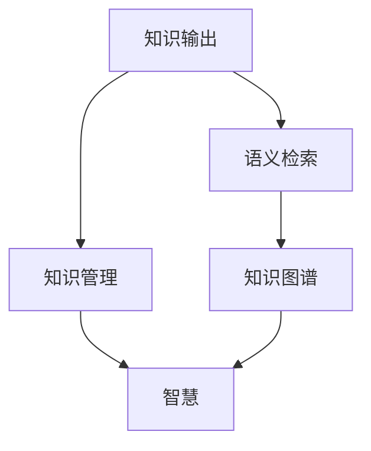

                 

# 知识输出与管理智慧的积累和传播

## 1. 背景介绍

### 1.1 问题由来
在信息爆炸的现代社会，知识输出与管理变得日益重要。从学术研究成果到技术进展，再到日常经验，几乎所有领域都充斥着大量的信息。如何有效地收集、存储、组织和传播这些知识，使其成为推动人类文明进步的动力，是当前社会急需解决的问题。知识管理不仅涉及技术层面的数据处理与存储，更关乎组织内部的人文与合作机制。

### 1.2 问题核心关键点
- **知识输出的重要性**：知识的输出不仅能推动技术进步和社会发展，还能塑造人类思维与认知方式。
- **知识管理的挑战**：海量数据、多样格式、分布式存储等挑战，需要高效的技术工具和合理的组织策略。
- **智慧的传播**：如何准确、高效地将智慧传递给需要的人，是知识管理的最终目的。

### 1.3 问题研究意义
研究知识输出与管理，不仅有助于提升知识应用效率，还能推动跨学科合作和创新。具体而言，它具有以下意义：

1. **加速科研进程**：有效的知识管理可以加快学术研究成果的发表和传播，提升科研效率。
2. **促进技术创新**：通过合理组织和共享技术知识，推动各行业的技术迭代和创新。
3. **增强决策支持**：高质量的知识管理有助于决策者快速获取关键信息，做出科学决策。
4. **提升教育质量**：知识输出与管理在教育领域的应用，可以提升教学质量和学生学习效率。
5. **增强组织竞争力**：企业通过知识输出与管理，提升员工知识和技能，增强组织创新力和市场竞争力。

## 2. 核心概念与联系

### 2.1 核心概念概述

为更好地理解知识输出与管理的概念，本节将介绍几个核心概念：

- **知识输出**：指的是将个人、团队或组织所积累的知识以文本、数据、代码等形式，向外输出、传播的过程。包括学术论文发表、技术博客、开源项目、专利申请等。
- **知识管理**：指组织内知识的收集、存储、检索、共享和应用的系统化过程。涉及知识库构建、元数据标注、权限控制等多方面内容。
- **智慧**：指通过知识整合、推理和创新，形成的具有较高价值和应用前景的解决方案或洞察。智慧往往需要多方协作和深度思考。
- **知识图谱**：一种用于表示实体间关系的图结构数据，有助于发现和利用隐含知识。
- **语义检索**：利用自然语言处理技术，理解用户查询意图，从知识库中检索出相关信息的机制。

这些核心概念之间的逻辑关系可以通过以下Mermaid流程图来展示：



这个流程图展示了几大核心概念之间的关系：

1. 知识输出是知识管理的基础，为智慧的产生提供素材。
2. 语义检索帮助用户从知识库中快速找到所需信息，提升知识管理的效率。
3. 知识图谱通过图形化表示实体关系，辅助发现和利用知识。
4. 智慧是知识管理的最终目标，通过知识整合和创新，形成高质量的解决方案。

## 3. 核心算法原理 & 具体操作步骤
### 3.1 算法原理概述

知识输出与管理的核心算法包括知识表示、语义检索、知识图谱构建等。这些算法旨在将知识高效地存储、组织和传播，为用户提供高效、精准的服务。

### 3.2 算法步骤详解

#### 3.2.1 知识表示

知识表示是将知识以结构化或半结构化的形式编码和存储的过程。常见的知识表示方法包括：

- **本体论（Ontology）**：使用本体描述语言（如OWL）定义实体、属性和关系，形成系统的知识体系。
- **语义网（Semantic Web）**：利用RDF、RDFS等技术描述网页中的语义信息，构建可互操作的知识库。
- **知识图谱（Knowledge Graph）**：使用图结构表示实体与关系，支持复杂的查询和推理。

#### 3.2.2 语义检索

语义检索通过自然语言处理技术，理解用户查询的意图，从知识库中检索出最相关的信息。具体步骤如下：

1. **查询理解**：使用分词、词性标注、命名实体识别等技术，理解用户查询的语义。
2. **知识匹配**：将用户查询转化为语义表达式，与知识库中的信息进行匹配。
3. **结果排序**：根据相关度、权威性等指标，对检索结果进行排序，展示给用户。

#### 3.2.3 知识图谱构建

知识图谱是用于表示实体间关系的图结构数据。构建知识图谱的关键步骤包括：

1. **实体识别**：从文本中提取实体，如人名、地名、组织名等。
2. **关系抽取**：识别实体之间的关系，如“是一个人”、“在某个地方”等。
3. **图结构构建**：将实体和关系存储在图结构中，形成知识图谱。

### 3.3 算法优缺点

知识输出与管理算法具有以下优点：

- **高效存储与检索**：结构化或半结构化的知识表示，便于存储和检索。
- **语义理解与推理**：利用自然语言处理技术，提升查询和检索的精准度。
- **知识图谱的可视化**：通过图形化展示实体关系，便于用户理解和应用。

同时，这些算法也存在以下缺点：

- **技术复杂性高**：知识表示、语义检索等技术难度较高，需专业知识积累。
- **数据质量依赖**：知识图谱的构建需要高质量的数据，数据质量直接影响结果的准确性。
- **成本高**：构建和维护知识库需要大量的人力和时间投入。

### 3.4 算法应用领域

知识输出与管理算法在多个领域具有广泛应用：

- **学术研究**：通过知识图谱和语义检索，快速查找和引用相关文献，加速科研进程。
- **企业知识管理**：构建企业知识库，提升员工知识共享和协作效率。
- **图书馆与博物馆**：利用知识图谱和语义检索，提供精准的知识查询服务。
- **教育**：通过知识库和语义检索，辅助教学和个性化学习。
- **医疗**：构建医疗知识图谱，提供医疗信息和决策支持。

## 4. 数学模型和公式 & 详细讲解 & 举例说明
### 4.1 数学模型构建

本节将使用数学语言对知识输出与管理的核心算法进行更加严格的刻画。

假设有一个知识库 $K$，其中包含 $n$ 个实体 $E=\{e_1, e_2, ..., e_n\}$ 和 $m$ 条关系 $R=\{r_1, r_2, ..., r_m\}$。定义实体 $e_i$ 的属性集合为 $A_i=\{a_{i1}, a_{i2}, ..., a_{ik}\}$，关系 $r_j$ 的定义为 $r_j: e_i \rightarrow e_j$。

知识图谱可以表示为一个图结构 $G=(E, R)$，其中 $E$ 为节点集，$R$ 为边集。每个节点 $e_i$ 表示一个实体，每条边 $r_j$ 表示实体之间的关系。

### 4.2 公式推导过程

对于知识图谱的构建，核心问题是如何从文本数据中提取实体和关系。假设文本数据为 $D$，通过自然语言处理技术，可以得到实体 $e_i$ 和关系 $r_j$。构建知识图谱的过程可以表示为：

$$
G = \{(E, R)\} \rightarrow \{(e_i, r_j)\}
$$

其中，$E$ 和 $R$ 分别表示实体和关系集合。关系 $r_j$ 的定义可以表示为 $r_j: e_i \rightarrow e_j$。

语义检索的核心问题是如何理解用户查询 $Q$ 并从知识库中检索出相关实体和关系。查询理解过程可以表示为：

$$
\text{Q} = \text{NLP}(\text{raw\_query})
$$

其中，$\text{NLP}$ 表示自然语言处理过程，$\text{raw\_query}$ 表示原始查询文本。

### 4.3 案例分析与讲解

以Google Scholar为例，其知识图谱和语义检索技术对学术研究具有重要意义。Google Scholar通过自然语言处理技术，从学术论文中抽取实体和关系，构建学术知识图谱。用户可以通过关键词查询，检索出相关论文、引用关系和作者信息。通过语义检索技术，用户可以更精准地找到所需信息，加速科研进程。

## 5. 项目实践：代码实例和详细解释说明
### 5.1 开发环境搭建

在进行知识输出与管理项目开发前，我们需要准备好开发环境。以下是使用Python进行TensorFlow开发的 environment 配置流程：

1. 安装Anaconda：从官网下载并安装Anaconda，用于创建独立的Python环境。

2. 创建并激活虚拟环境：
```bash
conda create -n tf-env python=3.8 
conda activate tf-env
```

3. 安装TensorFlow：根据CUDA版本，从官网获取对应的安装命令。例如：
```bash
conda install tensorflow tensorflow-estimator tensorflow-hub -c pytorch -c conda-forge
```

4. 安装相关工具包：
```bash
pip install pandas numpy scikit-learn matplotlib tqdm jupyter notebook ipython
```

完成上述步骤后，即可在`tf-env`环境中开始项目开发。

### 5.2 源代码详细实现

下面我们以知识图谱构建为例，给出使用TensorFlow进行知识图谱构建的PyTorch代码实现。

首先，定义知识图谱的实体和关系：

```python
import tensorflow as tf
from tensorflow.keras.layers import Input, Embedding, Dot, Dense

# 定义实体和关系
entity = Input(shape=(1,))
relation = Input(shape=(1,))

# 实体嵌入层
embedding = Embedding(10000, 100, input_length=1)(entity)

# 关系嵌入层
embedding_relation = Embedding(1000, 100, input_length=1)(relation)

# 点积计算
dot = Dot(axes=[1, 1])([embedding, embedding_relation])
dot = tf.keras.layers.Lambda(lambda x: tf.reduce_sum(x, axis=1))(dot)

# 输出层
output = Dense(1, activation='sigmoid')(dot)
```

接着，定义知识图谱的训练函数：

```python
from tensorflow.keras.optimizers import Adam

# 定义损失函数和优化器
loss = tf.keras.losses.BinaryCrossentropy()
optimizer = Adam()

# 定义模型
model = tf.keras.Model(inputs=[entity, relation], outputs=output)

# 编译模型
model.compile(optimizer=optimizer, loss=loss)

# 训练模型
model.fit(train_data, train_labels, epochs=10, validation_data=(val_data, val_labels))
```

最后，启动知识图谱构建流程：

```python
# 获取训练数据和标签
train_data = get_train_data()
train_labels = get_train_labels()

# 获取验证数据和标签
val_data = get_val_data()
val_labels = get_val_labels()

# 训练模型
model.fit(train_data, train_labels, epochs=10, validation_data=(val_data, val_labels))

# 保存模型
model.save('knowledge_graph_model.h5')
```

以上就是使用TensorFlow构建知识图谱的完整代码实现。可以看到，TensorFlow提供了丰富的工具和组件，可以方便地构建和训练知识图谱模型。

### 5.3 代码解读与分析

让我们再详细解读一下关键代码的实现细节：

**定义实体和关系**：
- `entity` 和 `relation` 分别表示实体和关系的输入层。
- `Embedding` 层用于将实体和关系映射到低维向量空间。
- `Dot` 层用于计算点积，表示实体和关系之间的相似度。

**训练函数**：
- `BinaryCrossentropy` 损失函数用于二分类任务，假设知识图谱的构建为二分类问题。
- `Adam` 优化器用于更新模型参数。
- `Model` 层将输入和输出层连接起来，形成完整的知识图谱构建模型。
- `compile` 方法用于模型编译，指定优化器和损失函数。
- `fit` 方法用于训练模型，指定训练数据、验证数据、迭代轮数等参数。

**启动知识图谱构建流程**：
- 调用 `get_train_data` 和 `get_train_labels` 获取训练数据和标签。
- 调用 `get_val_data` 和 `get_val_labels` 获取验证数据和标签。
- 调用 `fit` 方法训练模型。
- 调用 `save` 方法保存模型。

可以看到，TensorFlow使得知识图谱构建的代码实现变得简洁高效。开发者可以将更多精力放在数据处理、模型改进等高层逻辑上，而不必过多关注底层的实现细节。

当然，工业级的系统实现还需考虑更多因素，如模型的保存和部署、超参数的自动搜索、更灵活的任务适配层等。但核心的知识图谱构建范式基本与此类似。

## 6. 实际应用场景
### 6.1 智慧医疗

在智慧医疗领域，知识输出与管理可以用于构建医疗知识图谱，提供医疗信息和决策支持。通过知识图谱和语义检索技术，医生可以快速查找相关文献、临床指南和疾病案例，提升诊疗效率和质量。

具体而言，可以收集医疗领域的专家知识、临床数据和文献资料，构建医疗知识图谱。医生可以通过查询疾病名称、症状、诊断等关键词，获取精准的医疗信息，辅助诊断和治疗。知识图谱还可以实时更新，反映最新的医学研究成果，提升医疗服务的智能化水平。

### 6.2 智慧教育

在智慧教育领域，知识输出与管理可以用于构建知识库和智能推荐系统，提升教育质量和学习效率。通过知识库和语义检索技术，教师可以快速查找教学资源和教学案例，学生可以获取个性化的学习建议和资源。

具体而言，可以收集各学科的教学资源、习题题库和学习案例，构建知识库。教师可以通过查询课程名称、知识点等关键词，获取相关教学资源。学生可以通过查询学习主题、学习进度等关键词，获取个性化的学习建议和资源。智能推荐系统可以根据学生的学习行为和偏好，动态调整推荐内容，提升学习效果。

### 6.3 智慧金融

在智慧金融领域，知识输出与管理可以用于构建金融知识图谱，提供金融信息和决策支持。通过知识图谱和语义检索技术，金融分析师可以快速查找相关文献、投资策略和市场数据，提升投资决策的科学性和准确性。

具体而言，可以收集金融领域的专家知识、投资策略和市场数据，构建金融知识图谱。分析师可以通过查询公司名称、行业等关键词，获取相关的金融信息。语义检索技术可以理解用户的查询意图，提供精准的金融信息，帮助分析师做出科学决策。

### 6.4 未来应用展望

随着知识输出与管理技术的不断发展，知识图谱、语义检索等技术将在更多领域得到应用，为各个行业带来变革性影响。

在智慧医疗、智慧教育、智慧金融等众多领域，知识输出与管理的应用将不断涌现，为各行各业注入新的活力。未来，随着预训练语言模型和微调方法的持续演进，知识输出与管理技术必将与人工智能技术深度融合，推动各行业的智能化进程。相信随着技术的日益成熟，知识输出与管理技术将成为各行各业知识管理的重要工具，推动经济社会的全面进步。

## 7. 工具和资源推荐
### 7.1 学习资源推荐

为了帮助开发者系统掌握知识输出与管理的技术基础和实践技巧，这里推荐一些优质的学习资源：

1. 《Knowledge Graphs: Concepts, Technologies and Applications》系列书籍：深入介绍了知识图谱的基本概念、技术和应用，适合全面学习。
2. Google Scholar的论文和博客：Google Scholar作为全球领先的学术搜索引擎，提供了丰富的学术资源，适合深入学习和研究。
3. Stanford University的CS224N课程：斯坦福大学开设的知识图谱课程，涵盖知识图谱的构建、查询和应用，是学习知识图谱的绝佳资源。
4. DeepMind的《Knowledge-Based Question Answering》论文：DeepMind在知识图谱和语义检索方面的创新工作，适合前沿学习。
5. IBM Watson Knowledge Studio：IBM的知识管理平台，提供强大的知识图谱构建和查询功能，适合实际操作练习。

通过对这些资源的学习实践，相信你一定能够快速掌握知识输出与管理的精髓，并用于解决实际的NLP问题。
### 7.2 开发工具推荐

高效的开发离不开优秀的工具支持。以下是几款用于知识输出与管理的常用工具：

1. TensorFlow：由Google主导开发的深度学习框架，提供丰富的工具和组件，适合构建知识图谱等知识管理任务。
2. PyTorch：由Facebook主导开发的深度学习框架，灵活高效，适合自然语言处理等任务。
3. Apache Jena：Apache基金会支持的语义网工具，提供丰富的知识图谱构建和查询功能，适合学术研究和实际应用。
4. Elasticsearch：Elastic公司开发的开源搜索引擎，提供强大的语义检索功能，适合构建智能问答系统。
5. Apache Nutch：Apache基金会支持的开源网络爬虫，可以高效抓取网络数据，用于知识图谱构建。

合理利用这些工具，可以显著提升知识输出与管理任务的开发效率，加快创新迭代的步伐。

### 7.3 相关论文推荐

知识输出与管理的研究源于学界的持续研究。以下是几篇奠基性的相关论文，推荐阅读：

1. Semantic Representations for Query Expansion (Kelly & Kreutzer)：提出了基于知识图谱的查询扩展方法，提升了信息检索的精准度。
2. Ontology-Based Semantic Web Services (van Wynsberghe)：讨论了基于本体论的知识服务构建方法，适合知识图谱的应用研究。
3. Knowledge Graphs: A Rich Source of Scholarly Knowledge (Burley & Noy)：讨论了知识图谱在学术研究中的应用，提供了丰富的案例和分析。
4. Knowledge Graphs and Semantic Web Services (Lampi & Pejic)：详细介绍了知识图谱和语义服务的技术和应用，适合全面学习。
5. Deep Learning for Knowledge Graphs (Zhou et al.)：讨论了深度学习在知识图谱构建中的应用，适合前沿学习。

这些论文代表了大语言模型微调技术的发展脉络。通过学习这些前沿成果，可以帮助研究者把握学科前进方向，激发更多的创新灵感。

## 8. 总结：未来发展趋势与挑战
### 8.1 总结

本文对知识输出与管理技术进行了全面系统的介绍。首先阐述了知识输出与管理的背景和重要性，明确了知识管理在科研、教育、医疗等领域的价值。其次，从原理到实践，详细讲解了知识表示、语义检索、知识图谱构建等核心算法的具体步骤和实现。同时，本文还广泛探讨了知识输出与管理技术在多个行业领域的应用前景，展示了其广阔的前景。

通过本文的系统梳理，可以看到，知识输出与管理技术正成为各领域知识管理的重要手段，极大地提升了知识应用效率。未来，伴随知识图谱、语义检索等技术的不断进步，知识输出与管理必将在更多领域大放异彩，深刻影响人类的生产生活方式。

### 8.2 未来发展趋势

展望未来，知识输出与管理技术将呈现以下几个发展趋势：

1. **知识图谱的普及化**：随着数据量和计算力的提升，知识图谱的应用将更加普及，成为各行业知识管理的基础设施。
2. **语义检索的智能化**：利用深度学习和自然语言处理技术，提升语义检索的精准度和智能化水平。
3. **知识图谱的动态化**：知识图谱将能够实时更新，反映最新的知识变化，提升知识的时效性和可靠性。
4. **跨领域知识整合**：知识图谱将能够跨领域整合不同类型的数据，形成更加全面和丰富的知识体系。
5. **知识图谱的可视化**：通过图形化展示实体关系，提升知识的可读性和理解性。
6. **智慧知识传播**：通过知识图谱和语义检索技术，提供精准的知识传播服务，加速智慧的普及和应用。

以上趋势凸显了知识输出与管理技术的广阔前景。这些方向的探索发展，必将进一步提升知识应用效率，推动各行业的智能化进程。

### 8.3 面临的挑战

尽管知识输出与管理技术已经取得了一定的进展，但在迈向更加智能化、普适化应用的过程中，仍面临诸多挑战：

1. **数据质量问题**：高质量的知识数据是知识图谱和语义检索的基础，但数据的获取和标注需要大量人力和时间。
2. **模型复杂性**：知识图谱和语义检索模型需要高精度的计算和复杂的逻辑推理，对硬件和算法要求较高。
3. **应用场景复杂性**：不同行业的知识图谱和语义检索需求差异较大，需针对特定场景进行定制化开发。
4. **隐私和安全性**：知识图谱和语义检索可能涉及敏感数据，需保障数据隐私和安全。
5. **跨语言知识管理**：不同语言的语义检索和知识图谱构建方法差异较大，需提供多语言的解决方案。

正视知识输出与管理面临的这些挑战，积极应对并寻求突破，将使知识输出与管理技术更加成熟，更好地服务于各行业。相信随着学界和产业界的共同努力，这些挑战终将一一被克服，知识输出与管理技术必将进一步提升知识应用效率，推动各行业的智能化进程。

### 8.4 研究展望

面向未来，知识输出与管理技术需要在以下几个方面寻求新的突破：

1. **大规模知识图谱的构建**：开发更加高效的知识图谱构建工具，支持大规模数据集的处理。
2. **语义检索的实时化**：开发实时更新的语义检索系统，支持动态知识检索。
3. **跨语言知识管理**：提供多语言的语义检索和知识图谱构建方法，支持跨语言的智能交互。
4. **知识图谱的交互式展示**：通过交互式展示工具，提升知识图谱的理解和使用体验。
5. **智慧知识传播**：利用知识图谱和语义检索技术，提供精准的知识传播服务，加速智慧的普及和应用。

这些研究方向的探索，必将引领知识输出与管理技术迈向更高的台阶，为构建安全、可靠、可解释、可控的智能系统铺平道路。面向未来，知识输出与管理技术还需要与其他人工智能技术进行更深入的融合，如知识表示、因果推理、强化学习等，多路径协同发力，共同推动自然语言理解和智能交互系统的进步。只有勇于创新、敢于突破，才能不断拓展知识输出与管理技术的边界，让智能技术更好地造福人类社会。

## 9. 附录：常见问题与解答

**Q1：如何构建高质量的知识图谱？**

A: 构建高质量的知识图谱需要遵循以下步骤：

1. **数据收集**：收集尽可能全面的实体和关系数据，确保数据的质量和完整性。
2. **数据清洗**：清洗和标注数据，去除噪声和错误，提升数据质量。
3. **实体识别**：使用自然语言处理技术，自动识别实体和关系。
4. **关系抽取**：通过关系抽取算法，提取实体之间的关联关系。
5. **图结构构建**：将实体和关系存储在图结构中，形成知识图谱。

在构建过程中，需要不断迭代和优化，确保知识图谱的准确性和完整性。

**Q2：知识图谱的实时更新和维护有哪些策略？**

A: 知识图谱的实时更新和维护需要以下策略：

1. **数据流处理**：使用实时流处理技术，如Apache Kafka、Apache Flink等，实时采集和处理数据。
2. **增量更新**：定期更新知识图谱，避免全量更新带来的计算和存储压力。
3. **自动清洗**：引入自动清洗机制，定期检测和移除过时和错误的数据。
4. **分布式存储**：使用分布式存储系统，如Hadoop、Apache Cassandra等，提高存储和查询效率。
5. **元数据管理**：引入元数据管理机制，跟踪和记录知识图谱的更新历程和变化。

这些策略可以保证知识图谱的实时性和准确性，提升知识管理的效率和可靠性。

**Q3：知识图谱和语义检索在实际应用中需要注意哪些问题？**

A: 知识图谱和语义检索在实际应用中需要注意以下问题：

1. **数据隐私**：知识图谱和语义检索可能涉及敏感数据，需保障数据隐私和安全。
2. **查询效率**：在实际应用中，查询效率可能成为瓶颈，需优化算法和数据结构。
3. **跨语言处理**：跨语言的语义检索和知识图谱构建需要特殊的处理方法，需提供多语言的解决方案。
4. **用户界面设计**：知识图谱和语义检索的用户界面设计需符合用户需求，提升用户体验。
5. **知识图谱的扩展性**：需考虑知识图谱的扩展性，支持新增实体和关系的快速添加。

合理应对这些问题，可以提升知识图谱和语义检索的实用性和可靠性。

**Q4：如何利用知识图谱进行智能推荐？**

A: 利用知识图谱进行智能推荐需要以下步骤：

1. **构建推荐知识图谱**：收集用户行为数据和推荐内容数据，构建推荐知识图谱。
2. **实体嵌入**：使用实体嵌入技术，将用户和物品表示为向量。
3. **相似度计算**：通过计算用户和物品之间的相似度，生成推荐列表。
4. **多维推荐**：结合多维数据，如用户画像、物品属性等，生成更精准的推荐结果。
5. **反馈机制**：引入用户反馈机制，根据用户反馈调整推荐模型。

通过知识图谱和实体嵌入技术，可以提升推荐系统的准确性和个性化水平。

**Q5：知识图谱在教育中的应用场景有哪些？**

A: 知识图谱在教育中的应用场景包括：

1. **教学资源推荐**：根据学生学习进度和偏好，推荐适合的学习资源，如视频、文章、练习等。
2. **知识图谱可视化**：通过图形化展示知识关系，帮助学生理解复杂概念和知识点。
3. **智能辅导系统**：利用知识图谱和语义检索技术，提供智能辅导和答疑服务。
4. **学习路径规划**：根据学生知识水平和兴趣，推荐适合的学习路径和课程。
5. **学习效果评估**：通过知识图谱和语义检索技术，评估学生学习效果，提供个性化反馈。

知识图谱在教育中的应用，可以有效提升教学质量和学生学习效率。

---

作者：禅与计算机程序设计艺术 / Zen and the Art of Computer Programming

