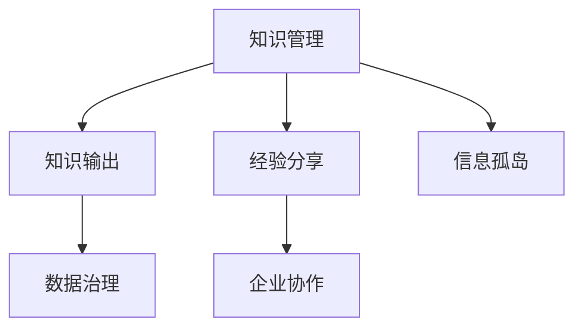

                 

# 知识输出与管理经验的系统化

> 关键词：知识管理, 知识输出, 经验分享, 企业协作, 数据治理

## 1. 背景介绍

### 1.1 问题由来
在当今的信息爆炸时代，企业和组织面临着前所未有的挑战和机遇。信息量的爆炸式增长，使得知识管理成为企业管理中的重要课题。企业需要通过高效的知识管理与输出，帮助员工快速获取和分享知识，提高工作效率和创新能力。与此同时，经验分享平台和社区的兴起，为企业员工之间的交流合作提供了新的可能性。

然而，尽管知识管理与经验分享在企业中的重要性逐渐得到认可，但在实践过程中，仍存在诸多问题。例如，知识孤岛现象严重，知识管理流程复杂，经验分享缺乏系统化方法等。这些问题不仅影响了知识管理的效率和效果，也阻碍了企业创新能力的提升。

### 1.2 问题核心关键点
为了解决知识管理与经验分享中的问题，本文聚焦于知识输出与管理的系统化方法。具体来说，本文将从知识管理的理论基础出发，探讨如何通过系统化方法，将知识输出与经验分享结合起来，提升企业知识管理的效果和效率。同时，本文还将结合实际案例，展示如何构建一个有效的知识输出与管理系统，帮助企业实现知识的高效管理和快速共享。

## 2. 核心概念与联系

### 2.1 核心概念概述

为更好地理解知识输出与管理的系统化方法，本节将介绍几个密切相关的核心概念：

- **知识管理(Knowledge Management, KM)**：指通过系统的工具和方法，对企业内部和外部的知识进行收集、存储、共享和利用，以提高企业的创新能力和竞争力。
- **知识输出(Knowledge Output)**：指将组织内部积累的知识转化为可传播和可利用的信息，通过分享、交流、传播等方式，将知识扩散到更广泛的范围，提升知识的应用价值。
- **经验分享(Experience Sharing)**：指将个人的实践经验、案例分析、教训总结等转化为知识资源，与他人共享，促进团队和组织的共同进步。
- **数据治理(Data Governance)**：指对企业内部数据的收集、整理、存储、共享和利用进行系统化的管理和控制，以提高数据的质量和利用效率。
- **企业协作(Enterprise Collaboration)**：指通过信息技术手段，将企业内部各部门和各团队联结起来，促进知识的交流和共享，提升企业的整体协作能力。
- **信息孤岛(Information Island)**：指企业内部信息资源分散、独立，不同系统间数据难以互通，导致知识无法有效共享和利用。

这些核心概念之间的逻辑关系可以通过以下Mermaid流程图来展示：



这个流程图展示了几大核心概念及其之间的关系：

1. 知识管理是知识输出和经验分享的基础，通过系统化的方法对知识进行收集和存储。
2. 知识输出将知识转化为可传播的信息，促进知识的广泛应用。
3. 经验分享是将实践经验和教训转化为知识资源，与他人共享，提升整体团队的协作能力。
4. 数据治理是对企业内部数据的系统化管理和控制，确保数据的质量和利用效率。
5. 企业协作是促进知识交流和共享的技术手段，提升企业的整体协作水平。
6. 信息孤岛是知识管理中的主要问题，需要通过系统化方法进行解决。

## 3. 核心算法原理 & 具体操作步骤
### 3.1 算法原理概述

知识输出与管理的系统化方法，本质上是通过一系列的系统化工具和流程，对企业内部的知识进行高效管理和利用。其核心思想是：将知识管理、经验分享和数据治理等环节有机结合起来，形成闭环的知识输出和管理流程，提升企业整体的知识水平和创新能力。

形式化地，假设企业内部有 $N$ 个知识点 $K_1, K_2, ..., K_N$，分别代表不同类型的知识资源。知识输出的系统化流程可以表示为：

$$
\text{KM} \rightarrow \text{KO} \rightarrow \text{ES} \rightarrow \text{DG} \rightarrow \text{EC}
$$

其中 $\text{KM}$ 表示知识管理，$\text{KO}$ 表示知识输出，$\text{ES}$ 表示经验分享，$\text{DG}$ 表示数据治理，$\text{EC}$ 表示企业协作。

该流程的核心是知识管理的循环反馈，通过不断优化知识管理流程，提升知识输出和共享的效果，从而实现企业知识水平的持续提升。

### 3.2 算法步骤详解

知识输出与管理的系统化方法主要包括以下几个关键步骤：

**Step 1: 知识采集与整理**
- 定义知识分类和标签，对企业内部知识进行分类整理，形成知识库。
- 收集企业外部知识资源，如行业报告、专利文献、公开出版物等，丰富知识库。
- 对收集到的知识资源进行清洗和筛选，去除无效和重复内容，提高知识库的质量。

**Step 2: 知识存储与共享**
- 选择合适的知识管理系统，如SharePoint、Confluence、OneDrive for Business等，建立企业知识库。
- 设计知识库的存储结构，包括文档、目录、标签、版本控制等。
- 设置权限和访问控制，确保知识的安全共享和保密性。
- 提供搜索和查询功能，方便知识检索和利用。

**Step 3: 知识输出与传播**
- 将知识库中的知识资源，转化为易于传播的格式，如文档、视频、演示文稿等。
- 通过企业内部邮件、社交网络、知识分享平台等方式，将知识传播到更广泛的范围。
- 定期发布企业内部的知识分享报告，总结和推广成功的经验和教训。

**Step 4: 经验分享与积累**
- 建立企业内部的经验分享平台，如Wiki、Slack、Confluence等，促进员工之间的交流与合作。
- 鼓励员工分享个人的工作经验和教训，形成企业内部的知识库。
- 定期组织知识分享会、案例分析会等活动，提升员工的知识水平和协作能力。

**Step 5: 数据治理与优化**
- 建立企业内部的数据治理框架，包括数据收集、清洗、存储、共享和利用等环节。
- 设计数据治理的流程和规范，确保数据的质量和一致性。
- 使用数据治理工具，如ETL工具、数据仓库、数据湖等，对企业数据进行管理和优化。
- 定期审计数据治理的效果，调整和优化数据治理策略。

**Step 6: 企业协作与集成**
- 使用协作工具和平台，如Microsoft Teams、Slack、Zoom等，促进企业内部的协作。
- 设计协作流程和规范，确保知识共享和利用的高效性。
- 定期评估企业协作的效果，优化协作流程和工具。

### 3.3 算法优缺点

知识输出与管理的系统化方法具有以下优点：
1. 提升知识管理效率：通过系统化的流程和工具，提升企业知识管理的效率和效果。
2. 促进知识传播：通过知识输出与共享，将知识转化为可传播的信息，提升知识的利用价值。
3. 加强经验积累：通过经验分享与积累，形成企业内部的知识库，提升团队和组织的协作能力。
4. 提高数据质量：通过数据治理，提升数据的质量和利用效率，为企业决策提供可靠依据。
5. 增强企业协作：通过协作工具和平台，提升企业内部的协作水平，促进知识的交流与共享。

同时，该方法也存在一定的局限性：
1. 系统复杂度高：知识输出与管理的系统化流程较为复杂，需要投入大量的时间和资源。
2. 技术依赖性强：需要依赖先进的信息技术工具和平台，对企业的IT基础设施要求较高。
3. 数据安全风险：知识管理和经验分享需要严格的数据安全控制，防止信息泄露和滥用。
4. 文化阻力：企业文化和管理理念的转变，需要时间和努力，难以在短期内实现。
5. 流程僵化：系统化的流程和规范，可能限制员工的创新能力和灵活性。

尽管存在这些局限性，但就目前而言，知识输出与管理的系统化方法仍是大企业知识管理的主流范式。未来相关研究的重点在于如何进一步降低系统复杂度，提升系统灵活性和易用性，同时兼顾数据安全和企业文化建设。

### 3.4 算法应用领域

知识输出与管理的系统化方法，在企业知识管理、经验分享、数据治理、企业协作等多个领域都有广泛的应用，例如：

- **企业内部培训与教育**：通过知识输出与共享，将企业内部的培训资源和学习资料分享给员工，提升员工的知识水平和技能。
- **项目管理与协作**：通过协作工具和平台，促进项目团队之间的沟通和协作，确保项目的高效推进。
- **市场营销与销售**：通过知识库和经验分享，提升市场营销和销售团队的协作水平，提高客户满意度。
- **产品设计与开发**：通过知识库和经验分享，提升产品设计和开发的创新能力，加速产品迭代。
- **客户服务与支持**：通过知识库和协作平台，提升客户服务与支持团队的知识水平和响应速度。

除了上述这些经典应用外，知识输出与管理的系统化方法还被创新性地应用到更多场景中，如智能搜索与推荐、知识图谱构建、智能文档生成等，为企业知识管理和信息利用提供了新的可能性。

## 4. 数学模型和公式 & 详细讲解
### 4.1 数学模型构建

知识输出与管理的系统化方法，涉及的知识库构建、数据治理、经验分享等多个环节，可以通过数学模型进行抽象和描述。

假设企业内部有 $N$ 个知识点 $K_1, K_2, ..., K_N$，每个知识点的价值为 $V_i$。知识管理的目标是通过系统化的流程和工具，最大化知识点的总价值 $V_{total}$。具体数学模型为：

$$
V_{total} = \sum_{i=1}^N V_i
$$

其中 $V_i$ 为第 $i$ 个知识点的价值，可以通过知识点的使用频率、更新频率、扩散范围等指标进行评估。

### 4.2 公式推导过程

通过数学模型，我们可以对知识管理的优化目标进行量化和计算。具体步骤如下：

1. 定义知识点的价值评估指标，如使用频率 $U_i$、更新频率 $U_i$、扩散范围 $D_i$ 等。
2. 构建知识点的价值函数 $V_i = f(U_i, U_i, D_i)$，将价值指标转化为知识点的价值。
3. 最大化知识点的总价值 $V_{total} = \sum_{i=1}^N V_i$，通过优化算法求解最优的知识管理策略。

例如，对于知识点的使用频率和更新频率，可以设定如下函数：

$$
U_i = \alpha \cdot \frac{u_i}{U_{max}} + \beta \cdot \frac{u_i}{U_{avg}}
$$

其中 $u_i$ 为知识点的使用频率，$\alpha$ 和 $\beta$ 为权重系数，$U_{max}$ 和 $U_{avg}$ 为使用频率的上下限。

通过数学模型，我们可以系统化地评估和优化知识点的价值，提升知识管理的效率和效果。

### 4.3 案例分析与讲解

为了更好地理解知识输出与管理的系统化方法，我们以某大型跨国企业的知识管理项目为例，进行详细分析：

1. **知识采集与整理**：该企业通过手动和自动化的方式，收集和整理了企业内部的所有文档、报告、案例等知识资源，形成了知识库。

2. **知识存储与共享**：企业使用了SharePoint作为知识库的存储平台，通过权限控制和访问权限的设置，确保了知识的安全共享。同时，企业内部建立了搜索和查询功能，方便员工检索和利用知识。

3. **知识输出与传播**：企业通过定期发布内部知识分享报告，总结和推广成功的经验和教训，提升员工的知识水平和协作能力。同时，企业还在企业内部邮件和社交网络中传播知识，促进知识的广泛应用。

4. **经验分享与积累**：企业内部建立了Wiki和Confluence平台，鼓励员工分享个人的工作经验和教训，形成企业内部的知识库。企业还定期组织知识分享会、案例分析会等活动，提升员工的知识水平和协作能力。

5. **数据治理与优化**：企业建立了数据治理框架，设计了数据收集、清洗、存储、共享和利用等环节的规范和流程。企业使用ETL工具和数据仓库，对企业数据进行管理和优化。

6. **企业协作与集成**：企业使用了Microsoft Teams和Slack等协作工具，促进企业内部的协作。企业还设计了协作流程和规范，确保知识共享和利用的高效性。

通过上述步骤，该企业实现了系统化的知识输出与管理工作，提升了企业的知识水平和创新能力。

## 5. 项目实践：代码实例和详细解释说明
### 5.1 开发环境搭建

在进行知识输出与管理的系统化方法实践前，我们需要准备好开发环境。以下是使用Python进行知识管理系统开发的常见环境配置流程：

1. 安装Python：从官网下载并安装Python，选择适合的版本。

2. 安装所需库：安装必要的Python库，如Flask、Django、SQLAlchemy等，用于搭建知识管理系统。

3. 搭建开发环境：使用虚拟环境，如Python Venv，隔离开发和生产环境。

4. 安装数据库：安装MySQL、PostgreSQL等关系型数据库，用于存储和管理知识库。

5. 安装协作工具：安装Slack、Confluence等协作工具，用于企业内部的知识共享和协作。

完成上述步骤后，即可在虚拟环境中开始知识管理系统开发的实践。

### 5.2 源代码详细实现

下面以一个简单的知识管理系统为例，展示知识输出与管理的系统化方法的代码实现。

首先，定义知识管理系统的数据模型：

```python
from django.db import models

class Knowledge(models.Model):
    title = models.CharField(max_length=255)
    content = models.TextField()
    tags = models.ManyToManyField('Tag')
    create_date = models.DateTimeField(auto_now_add=True)
    update_date = models.DateTimeField(auto_now=True)

class Tag(models.Model):
    name = models.CharField(max_length=255)
    create_date = models.DateTimeField(auto_now_add=True)
    update_date = models.DateTimeField(auto_now=True)
```

然后，定义知识管理系统的视图和控制器：

```python
from django.shortcuts import render, redirect
from .models import Knowledge, Tag

def knowledge_list(request):
    knowledge_list = Knowledge.objects.all().order_by('-create_date')
    return render(request, 'knowledge/knowledge_list.html', {'knowledge_list': knowledge_list})

def knowledge_detail(request, pk):
    knowledge = Knowledge.objects.get(pk=pk)
    return render(request, 'knowledge/knowledge_detail.html', {'knowledge': knowledge})

def create_knowledge(request):
    if request.method == 'POST':
        title = request.POST.get('title')
        content = request.POST.get('content')
        tags = request.POST.getlist('tags')
        knowledge = Knowledge(title=title, content=content, tags=tags)
        knowledge.save()
        return redirect('knowledge_list')
    return render(request, 'knowledge/create_knowledge.html')

def edit_knowledge(request, pk):
    knowledge = Knowledge.objects.get(pk=pk)
    if request.method == 'POST':
        knowledge.title = request.POST.get('title')
        knowledge.content = request.POST.get('content')
        knowledge.tags.clear()
        for tag in request.POST.getlist('tags'):
            tag_obj = Tag.objects.get_or_create(name=tag)
            knowledge.tags.add(tag_obj)
        knowledge.save()
        return redirect('knowledge_detail', pk=pk)
    return render(request, 'knowledge/edit_knowledge.html', {'knowledge': knowledge})
```

最后，定义知识管理系统的模板：

```html
<!-- knowledge_list.html -->


  <h1>知识库列表</h1>
  <ul>
    
      <li><a href="">{{ knowledge.title }}</a></li>
    
  </ul>


<!-- knowledge_detail.html -->


  <h1>{{ knowledge.title }}</h1>
  <p>{{ knowledge.content }}</p>
  <h2>标签</h2>
  <ul>
    
      <li>{{ tag.name }}</li>
    
  </ul>
  <a href="">编辑</a>
  <a href="">删除</a>


<!-- create_knowledge.html -->


  <h1>创建新知识</h1>
  <form method="post">
    
    <label>标题：</label>
    <input type="text" name="title"><br>
    <label>内容：</label>
    <textarea name="content"></textarea><br>
    <label>标签：</label>
    <input type="checkbox" name="tags" value="tag1">
    <label>标签1</label>
    <input type="checkbox" name="tags" value="tag2">
    <label>标签2</label>
    <button type="submit">提交</button>
  </form>


<!-- edit_knowledge.html -->


  <h1>编辑知识</h1>
  <form method="post">
    
    <label>标题：</label>
    <input type="text" name="title" value="{{ knowledge.title }}"><br>
    <label>内容：</label>
    <textarea name="content" value="{{ knowledge.content }}"></textarea><br>
    <label>标签：</label>
    
      <input type="checkbox" name="tags" value="{{ tag.name }}">
      <label>{{ tag.name }}</label>
    
    <button type="submit">提交</button>
  </form>

```

### 5.3 代码解读与分析

让我们再详细解读一下关键代码的实现细节：

**知识模型**：
- `Knowledge` 模型：定义了知识的基本属性，如标题、内容、标签等。通过 ManyToManyField 关系，建立了知识与标签之间的关联。
- `Tag` 模型：定义了标签的基本属性，如名称等。通过 create_date 和 update_date 字段，记录了标签的创建和更新时间。

**视图和控制器**：
- `knowledge_list` 视图：获取所有知识，并按照创建时间倒序排序，显示知识列表。
- `knowledge_detail` 视图：获取指定知识，并显示详细信息和标签。
- `create_knowledge` 视图：创建新知识，将标题、内容、标签保存到数据库。
- `edit_knowledge` 视图：编辑指定知识，将标题、内容、标签更新到数据库。

**模板**：
- `knowledge_list.html`：显示知识列表，包含链接到知识详情页。
- `knowledge_detail.html`：显示指定知识的详情信息，包括标题、内容和标签。
- `create_knowledge.html`：创建新知识的页面，包含表单和标签选择框。
- `edit_knowledge.html`：编辑指定知识的页面，包含表单和标签选择框。

通过上述代码实现，我们搭建了一个简单的知识管理系统，实现了知识的创建、查看、编辑和删除等功能。

### 5.4 运行结果展示

运行上述代码，即可在浏览器中看到知识管理系统的界面：

- 首页：知识库列表页，显示所有知识的标题和创建时间。
- 详情页：显示指定知识的详细内容、标签和编辑/删除链接。
- 创建页：创建新知识的表单页面，包含标题、内容和标签选择框。
- 编辑页：编辑指定知识的表单页面，包含标题、内容和标签选择框。

这些页面通过 Django 的模板引擎，渲染 HTML 页面，实现了知识管理系统的基本功能。

## 6. 实际应用场景
### 6.1 智能客服系统

智能客服系统通过知识输出与管理系统，实现了客户问题的快速响应和知识共享。企业内部通过知识库和协作平台，积累和共享各类常见问题及其解决方案，提升客服团队的协作能力和服务质量。

在具体实践中，企业可以通过知识管理系统，收集和整理客服团队的历史对话记录，形成问答对，并在知识库中进行存储。同时，企业还定期更新和维护知识库，确保知识的时效性和准确性。

通过知识输出与管理系统，智能客服系统可以自动匹配客户问题和知识库中的解决方案，生成智能回复。对于无法匹配的问题，系统还可以提供建议答案，引导客服团队提供更准确的答案。这种知识驱动的客服系统，不仅提高了响应速度，还提升了客服团队的知识水平和协作能力。

### 6.2 医疗信息管理系统

医疗信息管理系统通过知识输出与管理系统，实现了医生和护士的协作和知识共享。医院内部通过知识库和协作平台，积累和共享各类医疗知识和经验，提升医疗团队的知识水平和诊疗能力。

在具体实践中，医院可以通过知识管理系统，收集和整理医生的诊疗记录、病例分析、治疗方案等知识资源，形成医疗知识库。同时，医院还定期更新和维护知识库，确保知识的时效性和准确性。

通过知识输出与管理系统，医疗信息管理系统可以自动匹配患者的病情和知识库中的治疗方案，生成智能诊疗建议。对于复杂的病情，系统还可以提供多种治疗方案的比较和分析，帮助医生选择最佳的治疗方案。这种知识驱动的医疗信息管理系统，不仅提高了诊疗效率，还提升了医疗团队的知识水平和协作能力。

### 6.3 在线教育平台

在线教育平台通过知识输出与管理系统，实现了课程内容的制作和共享。教育机构可以通过知识管理系统，积累和共享各类课程内容及其教学资源，提升课程的制作和教学质量。

在具体实践中，教育机构可以通过知识管理系统，收集和整理各类课程的教学内容、课件、习题等知识资源，形成课程知识库。同时，教育机构还定期更新和维护知识库，确保知识的及时性和准确性。

通过知识输出与管理系统，在线教育平台可以自动匹配学生的学习需求和知识库中的课程内容，生成个性化的学习路径和推荐。对于学生的学习问题，系统还可以提供智能化的答疑和辅导，帮助学生提升学习效果。这种知识驱动的在线教育平台，不仅提高了学习效果，还提升了教育机构的知识水平和教学能力。

## 7. 工具和资源推荐
### 7.1 学习资源推荐

为了帮助开发者系统掌握知识输出与管理的系统化方法，这里推荐一些优质的学习资源：

1. **《Knowledge Management: Creating a Culture of Shared Intelligence》**：由Drexel教授Maria Nijsch著，详细介绍了知识管理的理论基础和实践方法，适用于企业管理人员和知识管理从业人员。

2. **《The Systematic Art of Knowledge Management》**：由美国学者Robert S. Kaplan和Robin L. Norton著，系统介绍了知识管理的流程、工具和成功案例，适用于企业知识管理实践。

3. **《The Knowledge Management Bible》**：由日本学者Kazuhito Asai著，结合日本的知识管理实践，提供了丰富的工具和案例，适用于日本企业知识管理实践。

4. **《Data Governance and Management: Concepts, Organizations, Technologies》**：由D.P. Archer和Christopher A. Srivastava著，详细介绍了数据治理的理论和实践，适用于企业数据管理和知识管理从业人员。

5. **《Enterprise Collaboration with Microsoft Teams》**：由微软工程师编写，详细介绍了使用Microsoft Teams进行企业协作的方法和技巧，适用于企业IT从业人员和知识管理从业人员。

通过对这些资源的学习实践，相信你一定能够系统掌握知识输出与管理的系统化方法，并用于解决实际的NLP问题。

### 7.2 开发工具推荐

高效的开发离不开优秀的工具支持。以下是几款用于知识输出与管理系统开发的常用工具：

1. **Flask**：基于Python的轻量级Web框架，简单易用，适合搭建知识管理系统。

2. **Django**：基于Python的全栈Web框架，功能强大，适合搭建复杂的企业知识管理系统。

3. **SQLAlchemy**：Python ORM库，用于与数据库进行交互，适合管理知识库中的数据。

4. **Django Rest Framework**：基于Django的RESTful API框架，用于提供知识库的API接口，适合知识管理系统的前端开发。

5. **PostgreSQL**：开源的关系型数据库，性能稳定，适合存储和管理知识库中的数据。

6. **JIRA**：Atlassian提供的项目管理工具，用于知识管理系统的项目管理，适合企业知识管理实践。

合理利用这些工具，可以显著提升知识输出与管理系统的开发效率，加快创新迭代的步伐。

### 7.3 相关论文推荐

知识输出与管理的系统化方法，涉及的知识管理、数据治理、经验分享等多个领域，相关论文众多。以下是几篇奠基性的相关论文，推荐阅读：

1. **《Knowledge Management: Critical Factors Affecting Organizational Performance》**：美国学者J. V. Olson和T. L. McGuire发表，分析了知识管理对企业绩效的影响，适用于企业管理人员和知识管理从业人员。

2. **《Effective Knowledge Management: A Framework for the Knowledge Worker》**：美国学者D.S. Wilkinson和A.L. Gourley发表，提出了知识管理的方法和工具框架，适用于知识管理从业人员和企业IT从业人员。

3. **《A Theory of Data Governance》**：美国学者A.P. Neale和M.E. Hudson发表，详细介绍了数据治理的理论和实践，适用于企业数据管理和知识管理从业人员。

4. **《The Role of Knowledge Sharing and Collaboration in the Development of Practical Knowledge》**：美国学者J.W. Belasco和D.C. Kent发表，探讨了知识共享和协作对知识管理的影响，适用于企业管理人员和知识管理从业人员。

5. **《The Role of Information Technology in Knowledge Management》**：美国学者G.F. Fiedler和D.C. Kent发表，分析了信息技术在知识管理中的应用，适用于企业IT从业人员和知识管理从业人员。

这些论文代表了大语言模型微调技术的发展脉络。通过学习这些前沿成果，可以帮助研究者把握学科前进方向，激发更多的创新灵感。

## 8. 总结：未来发展趋势与挑战

### 8.1 总结

本文对知识输出与管理的系统化方法进行了全面系统的介绍。首先阐述了知识管理、数据治理、经验分享等核心概念及其在系统化方法中的作用。其次，从理论基础到实践细节，详细讲解了知识输出与管理的系统化方法，给出了知识输出与管理系统的代码实例和详细解释说明。同时，本文还广泛探讨了知识输出与管理系统在智能客服、医疗信息管理、在线教育等多个行业领域的应用前景，展示了知识输出与管理方法的广泛适用性。此外，本文精选了知识管理的相关学习资源，力求为读者提供全方位的技术指引。

通过本文的系统梳理，可以看到，知识输出与管理的系统化方法，是企业知识管理的重要手段，通过系统化的流程和工具，实现了知识的高效管理和快速共享。这种系统化的方法，不仅提高了知识管理的效率和效果，还促进了知识在企业内部的广泛传播和应用，提升了企业的整体竞争力。

### 8.2 未来发展趋势

展望未来，知识输出与管理的系统化方法将呈现以下几个发展趋势：

1. **知识图谱的引入**：随着知识图谱技术的不断成熟，知识管理系统将能够更好地理解和组织知识，提升知识的整合和利用能力。

2. **智能搜索与推荐**：通过引入智能搜索与推荐技术，知识管理系统将能够更加精准地匹配用户需求，提升知识共享的效率。

3. **多模态数据的融合**：未来的知识管理系统将能够融合多种类型的数据，如文本、图片、视频等，提升知识的丰富性和多样性。

4. **知识驱动的协作平台**：未来的知识管理系统将更加注重协作，通过协作工具和平台，提升企业内部团队的知识共享和协作能力。

5. **跨组织的知识共享**：未来的知识管理系统将能够跨组织、跨企业进行知识共享，促进不同组织之间的协作和创新。

6. **隐私保护和安全机制**：未来的知识管理系统将更加注重数据隐私和安全，确保知识共享过程中的数据安全和用户隐私。

以上趋势凸显了知识输出与管理系统的广阔前景。这些方向的探索发展，必将进一步提升知识管理的效率和效果，推动企业知识管理的创新和进步。

### 8.3 面临的挑战

尽管知识输出与管理的系统化方法已经取得了一定成效，但在迈向更加智能化、普适化应用的过程中，它仍面临诸多挑战：

1. **知识孤岛问题**：企业内部知识库的孤立性，导致不同部门和团队之间的知识无法互通，影响知识的共享和利用。

2. **数据质量问题**：知识库中的数据质量参差不齐，存在错误、冗余等问题，影响知识管理的准确性和可靠性。

3. **文化阻力问题**：企业文化和管理理念的转变，需要时间和努力，难以在短期内实现。

4. **技术复杂度问题**：知识管理系统涉及的流程和技术复杂度高，需要投入大量的时间和资源。

5. **数据安全问题**：知识管理系统需要严格的数据安全和隐私保护，防止信息泄露和滥用。

6. **系统灵活性问题**：知识管理系统的流程和规范，可能限制员工的创新能力和灵活性。

尽管存在这些挑战，但通过不断优化知识管理系统的流程和工具，提升企业内部的协作和知识共享，知识输出与管理的系统化方法仍具有广泛的应用前景和深远的价值。相信在未来的发展中，这些挑战终将得到有效解决，知识输出与管理系统必将在构建知识驱动的企业中发挥越来越重要的作用。

### 8.4 研究展望

未来的研究需要在以下几个方面寻求新的突破：

1. **知识图谱的引入**：通过知识图谱技术，构建更加丰富和结构化的知识体系，提升知识的整合和利用能力。

2. **智能搜索与推荐**：开发更加精准和智能的搜索与推荐算法，提升知识共享的效率和效果。

3. **多模态数据的融合**：开发能够融合多种类型数据的知识管理系统，提升知识的丰富性和多样性。

4. **跨组织的知识共享**：开发能够跨组织、跨企业进行知识共享的协作平台，促进不同组织之间的协作和创新。

5. **数据隐私与安全**：开发更加严格的数据隐私和安全保护机制，确保知识共享过程中的数据安全和用户隐私。

6. **系统灵活性提升**：开发更加灵活和易于使用的知识管理系统，提升企业内部的协作和知识共享。

通过这些研究方向的探索发展，相信知识输出与管理系统将在企业知识管理中发挥更大的作用，推动企业知识管理的创新和进步。面向未来，知识输出与管理系统需要与其他人工智能技术进行更深入的融合，共同推动自然语言理解和智能交互系统的进步。

## 9. 附录：常见问题与解答

**Q1：知识输出与管理系统适用于所有企业吗？**

A: 知识输出与管理系统适用于大多数企业，特别是对于那些拥有大量知识和经验的企业，能够显著提升企业的知识管理效率和效果。但对于一些规模较小、业务简单的企业，可能需要根据实际情况进行调整。

**Q2：知识输出与管理系统需要多长时间才能建设完成？**

A: 知识输出与管理系统建设的时间取决于企业的规模和复杂度。一般来说，中小型企业可以较快建设完成，大型企业可能需要数月或数年的时间和资源。在建设过程中，企业需要根据自身需求和实际情况，进行合理规划和调整。

**Q3：知识输出与管理系统需要投入哪些资源？**

A: 知识输出与管理系统需要投入的人力、时间、资金和IT资源。具体资源投入取决于企业的规模和需求。一般而言，需要投入一定的IT基础设施，如服务器、数据库、网络等，以及专业知识和技术支持。

**Q4：如何评估知识输出与管理系统的效果？**

A: 知识输出与管理系统的效果评估可以从以下几个方面进行：
1. 知识库的质量和数量：评估知识库中知识的数量和质量，确保知识的准确性和时效性。
2. 知识共享的频率和效果：评估知识共享的频率和效果，确保知识在企业内部的广泛传播和应用。
3. 知识利用的效率：评估知识利用的效率，确保知识能够快速地转化为生产力。
4. 知识管理的成本：评估知识管理的成本，确保知识管理的投入能够带来合理的回报。

通过这些评估指标，可以全面了解知识输出与管理系统的运行效果，及时发现和解决问题。

**Q5：知识输出与管理系统在企业中的应用场景有哪些？**

A: 知识输出与管理系统在企业中的应用场景包括但不限于：
1. 企业内部的培训与教育：通过知识输出与管理系统，将企业内部的培训资源和学习资料分享给员工，提升员工的知识水平和技能。
2. 项目管理与协作：通过知识输出与管理系统，促进项目团队之间的沟通和协作，确保项目的高效推进。
3. 市场营销与销售：通过知识输出与管理系统，提升市场营销和销售团队的协作水平，提高客户满意度。
4. 产品设计与开发：通过知识输出与管理系统，提升产品设计和开发的创新能力，加速产品迭代。
5. 客户服务与支持：通过知识输出与管理系统，提升客户服务与支持团队的知识水平和响应速度。

这些应用场景展示了知识输出与管理系统在企业中的广泛应用，能够显著提升企业的知识管理效率和效果。

---

作者：禅与计算机程序设计艺术 / Zen and the Art of Computer Programming

