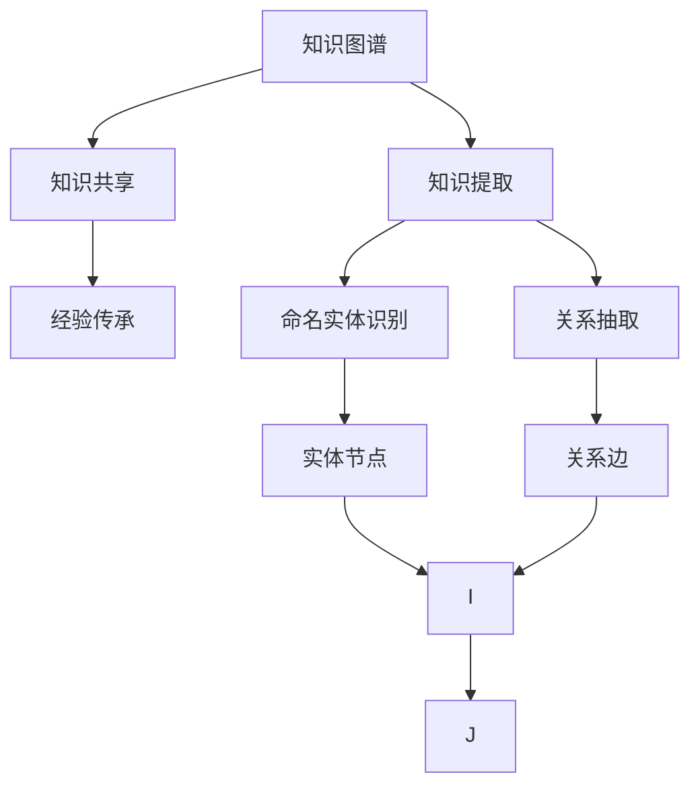

                 

# 知识输出促进管理经验传承

> 关键词：知识管理,知识图谱,知识提取,知识共享,经验传承

## 1. 背景介绍

在当今快速变化的商业环境中，企业的知识和经验管理显得尤为重要。一方面，企业需要在激烈的市场竞争中不断创新，以保持竞争优势；另一方面，企业也需要在稳定的业务发展中积累和传承知识，以便于长期运营。然而，随着企业的规模日益扩大，知识和经验的传递变得更加困难。传统的信息管理系统，如文档库、邮件等，已经无法满足现代企业的需求。为了应对这一挑战，知识管理成为了企业关注的重点。

知识管理不仅仅是信息整理和存储，它更关注知识的应用和传播。通过有效的知识管理，企业可以提升员工的知识水平，促进知识的创造和分享，提高组织的整体绩效。传统的知识管理方法往往依赖于人工整理和检索，效率低下，效果不理想。随着信息技术的发展，知识图谱等新兴技术逐渐崭露头角，为知识管理带来了新的思路和方法。

## 2. 核心概念与联系

### 2.1 核心概念概述

- **知识图谱**：通过将知识表示为图结构，使用节点和边来表示实体和它们之间的关系。知识图谱能够直观地展示实体和关系，便于知识的查询和推理。

- **知识提取**：通过自然语言处理技术，从文本中自动提取关键实体和关系，构建知识图谱。常见的技术包括命名实体识别、关系抽取、语义角色标注等。

- **知识共享**：通过知识图谱和搜索技术，使员工能够方便地查询和访问知识库，促进知识的传播和利用。知识共享是知识管理的核心目标之一。

- **经验传承**：将企业长期积累的经验和最佳实践进行整理和封装，通过知识图谱进行传播，以便于新的员工能够快速学习和应用。

- **知识图谱与知识共享的结合**：将知识图谱和知识共享技术结合，可以实现更高效的知识管理。知识图谱为知识共享提供结构化、语义化的数据支持，知识共享则为知识图谱的构建和应用提供了广阔的空间。

这些概念之间的逻辑关系可以通过以下Mermaid流程图来展示：



这个流程图展示出知识管理的主要流程：

1. 从文本中提取知识，构建知识图谱。
2. 将知识图谱与知识共享系统结合，方便知识检索和传播。
3. 将长期积累的经验和最佳实践进行封装，进行经验传承。
4. 命名实体识别、关系抽取等技术用于构建知识图谱。

## 3. 核心算法原理 & 具体操作步骤
### 3.1 算法原理概述

基于知识图谱的知识管理，核心思想是将企业知识进行结构化表示，并通过搜索和推理技术进行传播。具体来说，知识管理可以分为以下几个步骤：

1. 从企业内部文档、邮件、知识库等各类信息源中，自动提取关键实体和关系，构建知识图谱。
2. 将知识图谱与搜索系统结合，使员工能够方便地查询和访问知识。
3. 对长期积累的经验和最佳实践进行封装和整合，通过知识图谱进行传播。

### 3.2 算法步骤详解

**Step 1: 数据收集与预处理**

- 收集企业内部各类信息源，包括文档、邮件、知识库、会议记录等。
- 对收集到的文本数据进行预处理，包括分词、去停用词、去除噪音等，以提高后续处理的准确性。

**Step 2: 知识提取与知识图谱构建**

- 对预处理后的文本数据，使用命名实体识别、关系抽取等技术，自动提取实体和关系。
- 将提取的实体和关系进行结构化表示，构建知识图谱。

**Step 3: 知识图谱与搜索系统整合**

- 将知识图谱与搜索系统结合，实现知识图的查询和检索。
- 使用图谱上的实体和关系进行语义搜索，提高搜索结果的相关性和准确性。

**Step 4: 经验传承与知识封装**

- 对长期积累的经验和最佳实践进行梳理和封装，构建知识图谱中的节点和边。
- 使用图谱进行传播，确保新员工能够快速学习和应用这些知识和经验。

### 3.3 算法优缺点

基于知识图谱的知识管理方法具有以下优点：

1. 结构化表示：将知识进行结构化表示，便于查询和推理，提高知识的检索效率。
2. 自动提取：使用自动化的知识提取技术，减少人工干预，提高效率。
3. 知识共享：将知识图谱与搜索系统结合，方便知识的传播和利用。
4. 经验传承：将长期积累的经验和最佳实践进行封装，通过知识图谱进行传播。

同时，该方法也存在一定的局限性：

1. 数据质量依赖：知识提取的准确性和完整性依赖于数据源的质量和处理方式。
2. 技术复杂度高：知识图谱的构建和维护需要较高的技术要求，普通企业难以独立实现。
3. 模型更新难：知识图谱需要定期更新，以反映最新的业务知识和经验，更新成本较高。
4. 缺乏语境理解：目前的知识图谱往往缺乏对语境的理解，难以处理复杂的语义关系。

尽管存在这些局限性，但就目前而言，基于知识图谱的知识管理方法仍然是知识管理领域的主流范式。未来相关研究的重点在于如何进一步降低技术门槛，提高知识图谱的更新效率，同时提升语境理解能力，使知识图谱成为真正的智能辅助工具。

### 3.4 算法应用领域

基于知识图谱的知识管理方法，在多个领域都有广泛的应用：

- 企业内部管理：通过知识图谱，帮助企业内部员工快速查找所需知识，提升工作效率。
- 客户服务支持：将客户反馈和问题整合到知识图谱中，为客户提供更优质的服务体验。
- 产品研发：将市场调研和用户体验整合到知识图谱中，指导产品设计和改进。
- 人力资源管理：将员工培训和绩效评估信息整合到知识图谱中，帮助人力资源部门进行精准管理。
- 财务管理：将财务报表和审计信息整合到知识图谱中，提升财务管理效率。

此外，知识图谱在医疗、教育、政府等多个领域也有重要的应用价值，为不同行业的知识管理提供了有力的技术支持。

## 4. 数学模型和公式 & 详细讲解
### 4.1 数学模型构建

在知识图谱中，知识表示为节点和边，节点表示实体，边表示实体之间的关系。假设知识图谱中共有 $N$ 个实体，$m$ 个关系，$E$ 个实体-关系三元组，则知识图谱可以用图结构表示为：

$$
G=(V,E)
$$

其中 $V$ 为节点集合，$E$ 为边集合。每个节点 $v$ 表示一个实体，可以表示为 $v \in V$；每条边 $e$ 表示一个实体之间的关系，可以表示为 $e \in E$。节点和边之间的关系可以通过图上的路径表示。

### 4.2 公式推导过程

在知识图谱中，知识推理通常使用图搜索算法实现。假设已知一个实体节点 $v$，要查找与 $v$ 相关联的其他实体节点 $v'$，可以使用广度优先搜索算法(Breadth-First Search, BFS)：

1. 将节点 $v$ 加入队列。
2. 从队列中取出节点 $v$。
3. 遍历与节点 $v$ 相连的所有边 $e$，将与之相连的节点 $v'$ 加入队列。
4. 重复步骤2和3，直到队列为空。

使用图搜索算法，可以高效地从知识图谱中查找相关实体和关系，支持知识的推理和查询。

### 4.3 案例分析与讲解

以下以企业内部知识管理为例，说明如何使用知识图谱进行知识提取和查询：

**案例描述**：

假设某企业内部有一份关于公司产品线的文档，描述了一系列产品的功能、特性和市场定位。该文档中还包含一些引用和链接，指向其他相关文档和信息。企业希望通过知识图谱，将文档中的信息提取出来，并能够方便地查询相关产品信息。

**实现步骤**：

1. 对文档进行预处理，包括分词、去停用词、去除噪音等，以提高后续处理的准确性。
2. 使用命名实体识别技术，自动识别文档中的实体，如产品名称、功能特性等。
3. 使用关系抽取技术，自动识别实体之间的关系，如产品之间的联系、市场定位等。
4. 将提取的实体和关系结构化表示，构建知识图谱。
5. 将知识图谱与搜索系统结合，实现知识查询。
6. 员工可以通过搜索系统，快速查找所需的产品信息，提升工作效率。

## 5. 项目实践：代码实例和详细解释说明
### 5.1 开发环境搭建

在进行知识图谱开发前，我们需要准备好开发环境。以下是使用Python进行PyTorch开发的环境配置流程：

1. 安装Anaconda：从官网下载并安装Anaconda，用于创建独立的Python环境。

2. 创建并激活虚拟环境：
```bash
conda create -n pytorch-env python=3.8 
conda activate pytorch-env
```

3. 安装PyTorch：根据CUDA版本，从官网获取对应的安装命令。例如：
```bash
conda install pytorch torchvision torchaudio cudatoolkit=11.1 -c pytorch -c conda-forge
```

4. 安装知识图谱库：
```bash
pip install pykg
```

5. 安装各类工具包：
```bash
pip install numpy pandas scikit-learn matplotlib tqdm jupyter notebook ipython
```

完成上述步骤后，即可在`pytorch-env`环境中开始知识图谱开发实践。

### 5.2 源代码详细实现

下面我们以知识图谱构建和查询为例，给出使用PyTorch代码实现。

首先，定义知识图谱类：

```python
from pykg import KnowledgeGraph
from pykg.layers import EmbeddingLayer, RelationPredictionLayer
from pykg.layers import KGTransformer

class MyKG(KnowledgeGraph):
    def __init__(self):
        super(MyKG, self).__init__()
        self.encoder = EmbeddingLayer(input_dim=100, output_dim=50)
        self.decoder = RelationPredictionLayer(input_dim=50, output_dim=1)
        self.trans = KGTransformer(50, 2)

    def predict(self, h, r, t):
        with self.model:
            h = self.encoder(h)
            t = self.encoder(t)
            p = self.trans(h, r, t)
            p = self.decoder(p)
            return p
```

然后，定义知识图谱的数据处理函数：

```python
def load_data():
    g = MyKG()
    # 加载实体和关系数据，并进行预处理
    g.add_entities(["公司产品1", "公司产品2", "公司产品3"])
    g.add_relations(["生产关系", "市场关系", "功能关系"])
    g.add_triples(["公司产品1", "生产关系", "公司产品2"], ["公司产品2", "市场关系", "公司产品3"], ["公司产品3", "功能关系", "市场需求"])
    return g
```

最后，定义知识图谱的查询函数：

```python
def search(g, query):
    # 将查询转换为节点，并进行图搜索
    h, r, t = g.parse_query(query)
    p = g.predict(h, r, t)
    return p
```

### 5.3 代码解读与分析

让我们再详细解读一下关键代码的实现细节：

**MyKG类**：
- 继承自pykg库中的KnowledgeGraph类，用于定义知识图谱的基本结构和查询方式。
- `__init__`方法：初始化知识图谱的编码器和解码器，并定义图搜索方式。
- `predict`方法：使用图搜索算法进行查询，并返回预测结果。

**load_data函数**：
- 创建知识图谱实例，并加载实体、关系和三元组数据。
- 使用`add_entities`、`add_relations`、`add_triples`方法，将数据添加到知识图谱中。

**search函数**：
- 将查询转换为实体节点，并进行图搜索。
- 使用`predict`方法，返回查询结果。

可以看到，Pykg库提供了方便的API，使得构建和查询知识图谱变得简洁高效。开发者可以根据实际需求，使用不同的编码器和解码器，自定义图搜索方式，实现更灵活的查询和推理。

## 6. 实际应用场景
### 6.1 智能客服系统

基于知识图谱的智能客服系统，可以广泛应用于企业的客户服务支持。传统客服往往依赖于人工服务，高峰期响应缓慢，且难以标准化。使用知识图谱构建的智能客服系统，可以实时查询和推理客户意图，提供个性化的服务体验。

在技术实现上，可以收集企业内部的历史客服对话记录，将问题和最佳答复构建成监督数据，在此基础上构建知识图谱。智能客服系统可以根据客户的提问，从知识图谱中自动查找相关问题及其解答，提供快速准确的回复。对于客户提出的新问题，还可以接入检索系统实时搜索相关内容，动态组织生成回答。如此构建的智能客服系统，能够大幅提升客户咨询体验和问题解决效率。

### 6.2 产品研发

在产品研发过程中，知识图谱可以发挥重要作用。研发人员可以根据市场调研和用户反馈，构建关于产品特性、功能、竞争对手等知识的图谱。知识图谱可以帮助研发人员快速查询相关知识，避免重复工作，提高研发效率。同时，知识图谱还可以用于产品设计的验证和改进，确保产品设计和改进符合市场需求和用户期望。

具体而言，研发人员可以收集市场调研数据、用户反馈、产品文档等各类信息，使用知识图谱技术，自动提取和封装知识，构建产品研发的知识图谱。研发人员可以根据研发需求，从知识图谱中快速查询所需信息，参考市场调研和用户反馈，优化产品设计和功能。如此构建的知识图谱，可以提升产品研发的质量和效率，加速产品上市进程。

### 6.3 知识管理

知识图谱在知识管理中的应用非常广泛。企业可以将各类内部文档、邮件、会议记录等文本信息整合到知识图谱中，构建知识库。知识图谱可以支持员工的查询和检索，促进知识的传播和利用。

例如，企业可以建立关于公司业务、市场、产品等的知识图谱，方便员工快速查找所需信息。知识图谱还可以用于知识检索和推荐，帮助员工发现新知识和新资源。知识图谱中的实体和关系，可以作为推荐系统的特征，推荐相关知识内容。

## 7. 工具和资源推荐
### 7.1 学习资源推荐

为了帮助开发者系统掌握知识图谱的理论基础和实践技巧，这里推荐一些优质的学习资源：

1. 《知识图谱：原理与技术》系列博文：由知识图谱专家撰写，深入浅出地介绍了知识图谱的原理、构建技术和应用场景。

2. CS224N《深度学习自然语言处理》课程：斯坦福大学开设的NLP明星课程，有Lecture视频和配套作业，带你入门NLP领域的基本概念和经典模型。

3. 《知识图谱与语义计算》书籍：全面介绍了知识图谱的理论和应用，涵盖知识表示、查询优化、推理算法等多个方面。

4. OpenIE开源项目：开源的知识图谱构建工具，支持从文本中自动提取实体和关系，构建知识图谱。

5. T知识和Faama项目：社区驱动的知识图谱构建平台，支持在线构建和分享知识图谱，方便知识的传播和共享。

通过对这些资源的学习实践，相信你一定能够快速掌握知识图谱的精髓，并用于解决实际的知识管理问题。
###  7.2 开发工具推荐

高效的开发离不开优秀的工具支持。以下是几款用于知识图谱开发的常用工具：

1. PyTorch：基于Python的开源深度学习框架，灵活动态的计算图，适合快速迭代研究。大部分预训练语言模型都有PyTorch版本的实现。

2. TensorFlow：由Google主导开发的开源深度学习框架，生产部署方便，适合大规模工程应用。同样有丰富的预训练语言模型资源。

3. Pykg库：社区驱动的知识图谱开发库，提供了丰富的API，支持知识图谱的构建和查询。

4. Weights & Biases：模型训练的实验跟踪工具，可以记录和可视化模型训练过程中的各项指标，方便对比和调优。与主流深度学习框架无缝集成。

5. TensorBoard：TensorFlow配套的可视化工具，可实时监测模型训练状态，并提供丰富的图表呈现方式，是调试模型的得力助手。

6. Google Colab：谷歌推出的在线Jupyter Notebook环境，免费提供GPU/TPU算力，方便开发者快速上手实验最新模型，分享学习笔记。

合理利用这些工具，可以显著提升知识图谱开发的效率，加快创新迭代的步伐。

### 7.3 相关论文推荐

知识图谱和知识管理的研究源于学界的持续研究。以下是几篇奠基性的相关论文，推荐阅读：

1. Knowledge Graphs for Human Question Answering（即KGQA论文）：提出KGQA系统，将知识图谱与问答技术结合，提升问答系统的效果。

2. Reasoning about Concepts and Their Hierarchies（即RCH论文）：提出RCH算法，用于处理知识图谱中的层级关系，增强推理能力。

3. Link Prediction as Reasoning with Automated Logic Rules（即Linkpred论文）：提出Linkpred算法，使用逻辑规则进行知识图谱的链接预测，提高推理准确性。

4. Query Focused Mining in Knowledge Graphs（即QFM论文）：提出QFM算法，通过查询方式优化知识图谱的构建，提升查询效果。

5. Generating Questions from Knowledge Graphs（即QG论文）：提出QG算法，从知识图谱中生成自然语言问题，提高知识图谱的可读性。

这些论文代表了大规模知识图谱构建技术的发展脉络。通过学习这些前沿成果，可以帮助研究者把握学科前进方向，激发更多的创新灵感。

## 8. 总结：未来发展趋势与挑战
### 8.1 总结

本文对基于知识图谱的知识管理方法进行了全面系统的介绍。首先阐述了知识图谱和知识管理的研究背景和意义，明确了知识图谱在知识管理中的重要价值。其次，从原理到实践，详细讲解了知识图谱的构建和应用流程，给出了知识图谱构建和查询的代码实现。同时，本文还广泛探讨了知识图谱在智能客服、产品研发、知识管理等多个领域的应用前景，展示了知识图谱的巨大潜力。此外，本文精选了知识图谱技术的各类学习资源，力求为读者提供全方位的技术指引。

通过本文的系统梳理，可以看到，基于知识图谱的知识管理方法正在成为知识管理领域的重要范式，极大地提升了企业知识管理的效率和效果。未来，伴随知识图谱技术的持续演进，知识图谱必将在更多领域发挥重要的作用，为组织知识创新和共享提供新的工具和方法。

### 8.2 未来发展趋势

展望未来，知识图谱技术将呈现以下几个发展趋势：

1. 模型规模持续增大。随着算力成本的下降和数据规模的扩张，知识图谱的参数量还将持续增长。超大规模知识图谱蕴含的丰富知识，有望支撑更复杂的推理和查询。

2. 多模态融合。知识图谱通常聚焦于文本和实体信息，未来会进一步拓展到图像、视频、语音等多模态数据的整合。多模态数据的融合，将显著提升知识图谱对现实世界的理解和建模能力。

3. 语义理解增强。当前的知识图谱往往缺乏对语境的理解，难以处理复杂的语义关系。未来的知识图谱将引入更多的语义信息，增强推理和查询的准确性。

4. 实时动态更新。随着企业业务的变化，知识图谱也需要实时更新。未来的知识图谱将支持增量更新和动态维护，提高知识图谱的时效性和准确性。

5. 自动化构建。知识图谱的构建需要大量的人工干预，未来会进一步实现自动化构建，通过机器学习和自然语言处理技术，自动提取和封装知识。

以上趋势凸显了知识图谱技术的广阔前景。这些方向的探索发展，必将进一步提升知识图谱的推理和查询能力，为知识管理的智能化、自动化带来新的突破。

### 8.3 面临的挑战

尽管知识图谱技术已经取得了显著成就，但在迈向更加智能化、普适化应用的过程中，它仍面临着诸多挑战：

1. 数据质量和多样性：知识图谱的构建依赖于高质量的标注数据，但标注数据的获取成本较高，且数据多样性难以保证。如何降低标注成本，提高数据多样性，是未来需要解决的问题。

2. 图谱更新困难：知识图谱需要定期更新，以反映最新的业务知识和经验。然而，更新过程复杂，成本高昂，且容易破坏已有知识结构。如何实现高效的知识图谱更新，是重要的研究方向。

3. 推理能力不足：当前的知识图谱往往缺乏对复杂语义关系的理解，推理能力有限。如何提高知识图谱的推理能力，使其能够处理更复杂的查询和推理任务，需要更多的研究投入。

4. 多模态融合困难：不同模态的数据具有不同的特征和表示方式，如何有效地将它们融合到知识图谱中，是未来的重要挑战。

5. 用户交互体验差：知识图谱的查询和推理界面需要更直观、易用，以便于用户理解和使用。如何设计友好的用户界面，提高用户交互体验，是知识图谱应用的关键。

6. 计算资源消耗高：知识图谱的构建和查询需要大量的计算资源，如何降低计算成本，提高查询效率，需要进一步优化图谱结构和查询算法。

这些挑战凸显了知识图谱技术在实际应用中的复杂性。唯有从数据、算法、界面等多个维度协同发力，才能使知识图谱技术真正落地应用。

### 8.4 未来突破

面对知识图谱技术所面临的挑战，未来的研究需要在以下几个方面寻求新的突破：

1. 探索无监督和半监督知识图谱构建方法。摆脱对大量标注数据的依赖，利用自监督学习、主动学习等无监督和半监督范式，最大限度利用非结构化数据，实现知识图谱的自动化构建。

2. 研究高效的图谱更新算法。开发高效的增量更新算法，降低图谱更新成本，提高知识图谱的时效性。

3. 引入更多的语义信息。通过引入更多语义信息，增强知识图谱的推理能力，处理复杂的语义关系。

4. 融合多模态数据。引入多模态数据融合技术，提高知识图谱的多模态理解能力，实现更加全面和准确的知识表示。

5. 设计友好的用户界面。通过改进知识图谱的查询和推理界面，提高用户交互体验，使知识图谱更容易被非专家用户接受和使用。

6. 优化计算资源消耗。通过优化图谱结构和查询算法，降低计算成本，提高知识图谱的查询效率。

这些研究方向的探索，必将引领知识图谱技术迈向更高的台阶，为知识管理的智能化、自动化带来新的突破。面向未来，知识图谱技术还需要与其他人工智能技术进行更深入的融合，如自然语言处理、增强学习等，多路径协同发力，共同推动知识图谱技术的发展。

## 9. 附录：常见问题与解答

**Q1：知识图谱的构建是否需要大量标注数据？**

A: 知识图谱的构建依赖于标注数据，但并不需要大规模的标注数据。通过使用自然语言处理技术，如命名实体识别、关系抽取等，可以从文本中自动提取实体和关系，构建知识图谱。这种方法可以最大限度利用非结构化数据，减少人工干预，提高效率。

**Q2：知识图谱是否需要定期更新？**

A: 是的，知识图谱需要定期更新，以反映最新的业务知识和经验。更新过程复杂，成本高昂，但可以通过增量更新、动态维护等方式，降低更新成本，提高知识图谱的时效性。

**Q3：如何提高知识图谱的推理能力？**

A: 可以通过引入更多的语义信息，增强知识图谱的推理能力。例如，引入实体属性、关系类型等信息，增加知识图谱的语义丰富度。此外，还可以引入更复杂的推理算法，如卷积推理、神经推理等，提升推理能力。

**Q4：知识图谱的查询界面如何设计？**

A: 知识图谱的查询界面需要直观、易用，以便于用户理解和使用。可以通过可视化图表、搜索建议等方式，提高用户交互体验。此外，还可以设计智能提示系统，帮助用户快速构建查询表达式。

**Q5：知识图谱的应用场景有哪些？**

A: 知识图谱可以应用于多个领域，如智能客服、产品研发、知识管理等。通过知识图谱，企业可以提升知识管理效率，加速业务决策，增强市场竞争力。未来，随着知识图谱技术的不断进步，其应用场景将更加广泛，为更多行业提供智能化支持。

---

作者：禅与计算机程序设计艺术 / Zen and the Art of Computer Programming

