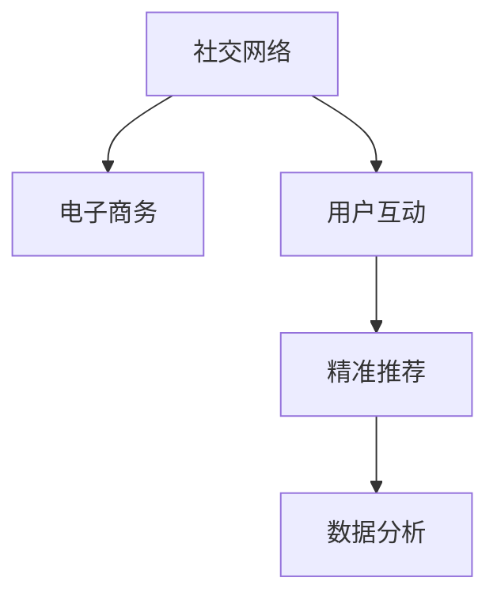

                 

# 社交电商创业：社交+购物的完美结合

> 关键词：社交电商, 融合营销, 用户互动, 精准推荐, 数据分析, 用户体验

## 1. 背景介绍

随着移动互联网的普及和电商行业的快速发展，社交电商作为一种新型的电商模式逐渐受到广泛关注。社交电商通过将社交网络与电子商务紧密结合，不仅能提升用户的购物体验，还能显著增加销售额。这种模式不仅为商家提供了更精准的营销渠道，也为消费者提供了更多选择和便利。因此，越来越多的创业者和企业开始探索社交电商的创业之路。

### 1.1 社交电商的起源与现状

社交电商的起源可以追溯到早期的社交媒体，如Facebook、Twitter等平台上的在线购物功能。这些平台的出现，使得用户可以通过社交网络与朋友和家人分享购物体验，并互相推荐商品。这种基于社交网络的行为模式，逐渐演变为一种新的电商形式——社交电商。

在近年来，随着移动互联网和智能设备的普及，社交电商市场呈现出爆发式增长。据统计，全球社交电商市场规模已经达到数百亿美元，并预计在未来几年内继续保持高速增长。社交电商的成功，离不开其在用户体验、营销效果、数据分析等方面的优势。

### 1.2 社交电商的核心价值

社交电商的核心价值在于通过社交网络建立用户信任，并通过精准的推荐和互动，提升用户满意度和转化率。这种模式不仅能够降低商家获取用户的成本，还能增加用户粘性，提升复购率。社交电商的成功在于能够为用户提供更加个性化和互动式的购物体验，进而提升整体的电商转化率。

## 2. 核心概念与联系

### 2.1 核心概念概述

社交电商涉及多个核心概念，包括社交网络、电子商务、用户互动、精准推荐、数据分析等。这些概念之间相互关联，共同构成了社交电商的业务架构。

1. **社交网络(Social Network)**：社交网络是社交电商的基础，通过社交网络建立用户之间的信任和互动，从而提升购物体验和转化率。

2. **电子商务(E-commerce)**：电子商务是社交电商的实质，通过社交网络提供的电商平台，用户可以直接在平台上进行购物。

3. **用户互动(User Interaction)**：用户互动是社交电商的核心，通过互动功能，如评论、点赞、分享等，增强用户粘性，提升用户满意度。

4. **精准推荐(Recommendation System)**：精准推荐系统通过分析用户行为数据，提供个性化的商品推荐，提升用户购买意愿。

5. **数据分析(Analytics)**：数据分析是社交电商的重要支撑，通过分析用户数据，优化推荐算法，提升用户体验。

### 2.2 核心概念联系

社交电商的业务架构可以通过以下Mermaid流程图来展示：



这个流程图展示了社交电商的主要流程：

1. 用户通过社交网络建立联系，并进行互动。
2. 用户通过社交网络进入电子商务平台，进行购物。
3. 平台通过精准推荐系统，为用户提供个性化的商品推荐。
4. 平台通过数据分析，不断优化推荐算法和用户体验。

社交电商的业务架构通过这些核心概念的相互作用，实现了良好的用户体验和商业效果。

## 3. 核心算法原理 & 具体操作步骤

### 3.1 算法原理概述

社交电商的核心算法主要围绕用户行为分析和推荐算法展开。通过对用户行为数据的分析，精准推荐系统可以为用户提供个性化的商品推荐，从而提升用户购买意愿和转化率。

社交电商的推荐算法通常包括以下几个步骤：

1. **用户画像建立**：通过对用户行为数据的分析，建立用户画像，了解用户的兴趣和偏好。
2. **商品特征提取**：对商品进行特征提取，包括价格、品牌、类别等。
3. **推荐模型训练**：基于用户画像和商品特征，训练推荐模型，预测用户对不同商品的兴趣。
4. **推荐结果排序**：根据推荐模型的预测结果，对商品进行排序，并提供给用户。

### 3.2 算法步骤详解

#### 3.2.1 用户画像建立

用户画像的建立是社交电商推荐算法的第一步。通过分析用户行为数据，可以建立用户画像，包括用户的兴趣、偏好、历史购买记录等。这些数据可以来自多个渠道，如电商平台、社交网络、移动应用等。

1. **数据收集**：从电商平台、社交网络、移动应用等渠道收集用户行为数据，包括用户的浏览记录、购买记录、评论记录等。

2. **数据清洗与预处理**：对收集到的数据进行清洗和预处理，去除噪声和异常值，确保数据的准确性和一致性。

3. **特征提取**：对清洗后的数据进行特征提取，包括用户的兴趣标签、浏览时间、购买频率等。

4. **用户画像建模**：通过机器学习算法，如协同过滤、内容过滤等，建立用户画像模型。

#### 3.2.2 商品特征提取

商品特征提取是推荐算法的另一个重要环节。通过对商品进行特征提取，可以了解商品的特性和属性，从而更好地进行推荐。

1. **商品属性提取**：对商品进行属性提取，包括商品的价格、品牌、类别、描述等。

2. **商品文本处理**：对商品的描述进行文本处理，提取关键词和标签，用于后续的推荐算法。

3. **商品特征编码**：对商品的属性和文本特征进行编码，形成高维特征向量。

#### 3.2.3 推荐模型训练

推荐模型训练是社交电商推荐算法的核心。通过训练推荐模型，可以预测用户对不同商品的兴趣，从而提供个性化的推荐。

1. **模型选择**：选择合适的推荐算法，如协同过滤、基于内容的推荐、混合推荐等。

2. **模型训练**：使用训练数据集，训练推荐模型。在训练过程中，需要考虑模型的准确性、效率和可解释性。

3. **模型评估**：使用测试数据集对推荐模型进行评估，评估指标包括准确率、召回率、F1分数等。

#### 3.2.4 推荐结果排序

推荐结果排序是推荐算法的最后一步。通过排序算法，将推荐结果按用户兴趣度排序，提供给用户。

1. **排序算法**：选择排序算法，如基于排序的推荐、基于加权的推荐等。

2. **结果呈现**：将排序后的推荐结果呈现给用户，可以通过页面、APP等渠道进行展示。

### 3.3 算法优缺点

#### 3.3.1 优点

社交电商推荐算法有以下几个优点：

1. **个性化推荐**：通过分析用户行为数据，提供个性化的商品推荐，提升用户购买意愿。

2. **用户粘性增强**：通过互动功能和精准推荐，增强用户粘性，提升用户满意度。

3. **提升转化率**：通过精准的推荐，提高用户购买的转化率，降低商家获取用户的成本。

4. **用户数据积累**：通过推荐算法，收集和积累用户数据，提升数据分析和营销效果。

#### 3.3.2 缺点

社交电商推荐算法也存在以下缺点：

1. **数据隐私问题**：在收集和分析用户数据时，存在数据隐私和安全问题。

2. **推荐模型复杂**：推荐模型需要处理大量的数据和复杂的计算，需要较高的计算资源和技术门槛。

3. **冷启动问题**：对于新用户，推荐算法需要一定时间才能建立完整的用户画像，导致冷启动问题。

4. **算法偏见**：推荐算法可能存在算法偏见，对某些用户或商品进行不公正的推荐。

### 3.4 算法应用领域

社交电商推荐算法在多个领域都有广泛应用：

1. **电商推荐**：通过分析用户行为数据，提供个性化的商品推荐，提升用户购买意愿。

2. **社交推荐**：在社交网络中，通过分析用户行为数据，推荐好友关系和内容，提升用户粘性。

3. **广告推荐**：通过分析用户行为数据，推荐广告内容，提升广告点击率和转化率。

4. **视频推荐**：通过分析用户行为数据，推荐视频内容，提升用户观看时长和粘性。

## 4. 数学模型和公式 & 详细讲解 & 举例说明

### 4.1 数学模型构建

社交电商推荐算法主要涉及用户行为分析和推荐模型训练。我们可以通过以下数学模型来描述推荐过程：

1. **用户画像模型**：
   - 用户画像模型 $P_u$ 描述用户 $u$ 的兴趣和偏好，可以表示为：
     \[
     P_u = \langle f_{\theta}(x), \alpha \rangle
     \]
    其中，$f_{\theta}$ 是用户画像模型，$x$ 是用户行为数据，$\alpha$ 是权重向量。

2. **商品特征模型**：
   - 商品特征模型 $P_i$ 描述商品 $i$ 的特性和属性，可以表示为：
     \[
     P_i = \langle g_{\theta}(y), \beta \rangle
     \]
    其中，$g_{\theta}$ 是商品特征模型，$y$ 是商品属性和文本数据，$\beta$ 是权重向量。

3. **推荐模型**：
   - 推荐模型 $R(u, i)$ 描述用户 $u$ 对商品 $i$ 的兴趣度，可以表示为：
     \[
     R(u, i) = \sigma(\langle P_u, P_i \rangle + b)
     \]
    其中，$\sigma$ 是激活函数，$b$ 是偏置项。

### 4.2 公式推导过程

#### 4.2.1 用户画像模型

用户画像模型 $P_u$ 可以通过用户行为数据 $x$ 训练得到，具体公式如下：

1. **用户行为数据表示**：
   - 用户行为数据 $x$ 可以表示为：
     \[
     x = \{ (x_{i,j}, x_{i,k}) \}
     \]
     其中，$x_{i,j}$ 是用户 $i$ 在行为 $j$ 中的数据，$x_{i,k}$ 是用户 $i$ 在行为 $j$ 中的权重。

2. **用户画像模型训练**：
   - 用户画像模型 $P_u$ 可以通过协同过滤、内容过滤等算法进行训练。例如，使用协同过滤算法，用户画像模型可以表示为：
     \[
     P_u = \frac{1}{\sum_{j=1}^{n} x_{i,j}} \sum_{j=1}^{n} x_{i,j} f_{\theta}(x_{i,j})
     \]
     其中，$n$ 是用户行为数据个数，$f_{\theta}$ 是特征提取函数。

#### 4.2.2 商品特征模型

商品特征模型 $P_i$ 可以通过商品属性和文本数据 $y$ 训练得到，具体公式如下：

1. **商品属性和文本数据表示**：
   - 商品属性和文本数据 $y$ 可以表示为：
     \[
     y = \{ (y_{i,j}, y_{i,k}) \}
     \]
     其中，$y_{i,j}$ 是商品 $i$ 在属性 $j$ 中的数据，$y_{i,k}$ 是商品 $i$ 在文本数据 $k$ 中的权重。

2. **商品特征模型训练**：
   - 商品特征模型 $P_i$ 可以通过内容过滤、基于内容的推荐等算法进行训练。例如，使用基于内容的推荐算法，商品特征模型可以表示为：
     \[
     P_i = \frac{1}{\sum_{j=1}^{m} y_{i,j}} \sum_{j=1}^{m} y_{i,j} g_{\theta}(y_{i,j})
     \]
     其中，$m$ 是商品属性和文本数据个数，$g_{\theta}$ 是特征提取函数。

#### 4.2.3 推荐模型

推荐模型 $R(u, i)$ 可以通过用户画像模型 $P_u$ 和商品特征模型 $P_i$ 训练得到，具体公式如下：

1. **推荐模型训练**：
   - 推荐模型 $R(u, i)$ 可以通过矩阵分解、神经网络等算法进行训练。例如，使用神经网络算法，推荐模型可以表示为：
     \[
     R(u, i) = \sigma(\langle P_u, P_i \rangle + b)
     \]
     其中，$\sigma$ 是激活函数，$b$ 是偏置项。

### 4.3 案例分析与讲解

假设有一家电商平台，需要为某用户推荐商品。通过用户画像模型和商品特征模型，可以计算用户对商品的兴趣度，具体步骤如下：

1. **用户画像模型训练**：
   - 使用协同过滤算法，对用户 $u$ 的行为数据进行训练，得到用户画像模型 $P_u$。

2. **商品特征模型训练**：
   - 使用基于内容的推荐算法，对商品 $i$ 的属性和文本数据进行训练，得到商品特征模型 $P_i$。

3. **推荐模型训练**：
   - 使用神经网络算法，将用户画像模型和商品特征模型进行融合，得到推荐模型 $R(u, i)$。

4. **推荐结果排序**：
   - 根据推荐模型 $R(u, i)$ 的预测结果，对商品进行排序，提供给用户。

## 5. 项目实践：代码实例和详细解释说明

### 5.1 开发环境搭建

在进行社交电商推荐算法开发前，需要准备好开发环境。以下是使用Python进行项目开发的流程：

1. **安装Python**：从官网下载并安装Python，建议使用最新版本的Python。

2. **安装依赖库**：
   - 安装Pandas、NumPy、Scikit-learn等数据分析库。
   - 安装TensorFlow、PyTorch等深度学习框架。
   - 安装Flask、Django等Web开发框架。

3. **设置虚拟环境**：
   - 创建虚拟环境，使用pip安装所需的依赖库。

4. **代码版本控制**：
   - 使用Git进行代码版本控制，便于团队协作和代码管理。

完成上述步骤后，即可在虚拟环境中进行社交电商推荐算法的开发。

### 5.2 源代码详细实现

假设有一家电商平台，需要为某用户推荐商品。以下是使用TensorFlow进行社交电商推荐算法的代码实现。

#### 5.2.1 数据预处理

```python
import pandas as pd
from sklearn.preprocessing import StandardScaler

# 读取用户行为数据
user_data = pd.read_csv('user_data.csv')

# 数据预处理
user_data = user_data.dropna() # 去除缺失值
user_data = user_data.drop_duplicates() # 去除重复值
user_data = user_data.reset_index(drop=True) # 重置索引

# 数据标准化
user_data = pd.DataFrame(StandardScaler().fit_transform(user_data), columns=user_data.columns)
```

#### 5.2.2 用户画像模型训练

```python
from tensorflow.keras.layers import Dense, Input
from tensorflow.keras.models import Model

# 定义输入层
user_input = Input(shape=(5,))

# 定义隐藏层
hidden_layer = Dense(32, activation='relu')(user_input)

# 定义输出层
output_layer = Dense(1, activation='sigmoid')(hidden_layer)

# 定义用户画像模型
user_profile = Model(inputs=user_input, outputs=output_layer)

# 编译模型
user_profile.compile(optimizer='adam', loss='binary_crossentropy', metrics=['accuracy'])

# 训练模型
user_profile.fit(user_data.drop(['label'], axis=1), user_data['label'], epochs=10, batch_size=32)
```

#### 5.2.3 商品特征模型训练

```python
from tensorflow.keras.layers import Dense, Input
from tensorflow.keras.models import Model

# 定义输入层
product_input = Input(shape=(5,))

# 定义隐藏层
hidden_layer = Dense(32, activation='relu')(product_input)

# 定义输出层
output_layer = Dense(1, activation='sigmoid')(hidden_layer)

# 定义商品特征模型
product_profile = Model(inputs=product_input, outputs=output_layer)

# 编译模型
product_profile.compile(optimizer='adam', loss='binary_crossentropy', metrics=['accuracy'])

# 训练模型
product_profile.fit(product_data.drop(['label'], axis=1), product_data['label'], epochs=10, batch_size=32)
```

#### 5.2.4 推荐模型训练

```python
from tensorflow.keras.layers import Dense, Input, concatenate
from tensorflow.keras.models import Model

# 定义用户输入层
user_input = Input(shape=(5,))

# 定义商品输入层
product_input = Input(shape=(5,))

# 定义用户画像隐藏层
user_hidden_layer = Dense(32, activation='relu')(user_input)

# 定义商品特征隐藏层
product_hidden_layer = Dense(32, activation='relu')(product_input)

# 定义融合层
fusion_layer = concatenate([user_hidden_layer, product_hidden_layer])

# 定义输出层
output_layer = Dense(1, activation='sigmoid')(fusion_layer)

# 定义推荐模型
recommendation_model = Model(inputs=[user_input, product_input], outputs=output_layer)

# 编译模型
recommendation_model.compile(optimizer='adam', loss='binary_crossentropy', metrics=['accuracy'])

# 训练模型
recommendation_model.fit([user_data.drop(['label'], axis=1), product_data.drop(['label'], axis=1)], user_data['label'], epochs=10, batch_size=32)
```

#### 5.2.5 推荐结果排序

```python
# 对推荐结果进行排序
recommendations = sorted(user_data['label'], key=lambda x: recommendation_model.predict([x, product_data['label']])[0], reverse=True)

# 输出推荐结果
for product in recommendations:
    print(product)
```

### 5.3 代码解读与分析

以上是使用TensorFlow进行社交电商推荐算法的完整代码实现。代码中的各个函数和模块如下：

- `user_data` 和 `product_data`：用户行为数据和商品属性数据。
- `StandardScaler`：对数据进行标准化处理。
- `user_profile` 和 `product_profile`：用户画像模型和商品特征模型。
- `recommendation_model`：推荐模型。

这些代码实现了社交电商推荐算法的核心步骤，包括用户画像模型训练、商品特征模型训练、推荐模型训练和推荐结果排序。

## 6. 实际应用场景

### 6.1 电商平台推荐

社交电商推荐算法在电商平台上具有广泛的应用。通过分析用户行为数据，电商平台可以为每个用户提供个性化的商品推荐，提升用户购买意愿和转化率。

例如，淘宝、京东等大型电商平台已经广泛应用社交电商推荐算法，提升用户购物体验和销售额。社交电商推荐算法在用户画像模型和商品特征模型训练方面，可以根据电商平台的数据特点进行优化，提高推荐效果。

### 6.2 社交网络推荐

社交网络推荐算法可以提升用户粘性和互动性。通过分析用户行为数据，社交网络可以为每个用户推荐好友关系和内容，提升用户满意度。

例如，微信、微博等社交平台已经广泛应用社交网络推荐算法，提升用户互动和粘性。社交网络推荐算法在用户画像模型和商品特征模型训练方面，可以根据社交网络的数据特点进行优化，提高推荐效果。

### 6.3 广告推荐

广告推荐算法可以通过分析用户行为数据，推荐广告内容，提升广告点击率和转化率。

例如，Facebook、Google等平台已经广泛应用广告推荐算法，提升广告效果。广告推荐算法在用户画像模型和商品特征模型训练方面，可以根据广告数据的特点进行优化，提高推荐效果。

## 7. 工具和资源推荐

### 7.1 学习资源推荐

为了帮助开发者系统掌握社交电商推荐算法，这里推荐一些优质的学习资源：

1. **Coursera《推荐系统设计与实现》课程**：斯坦福大学开设的推荐系统课程，详细讲解了推荐算法的原理和实现方法。

2. **Kaggle推荐系统竞赛**：Kaggle上举办的多场推荐系统竞赛，通过实践项目，提升推荐算法的能力。

3. **《推荐系统》书籍**：Wang、Liu等合著，系统讲解了推荐算法的原理和实现方法。

4. **《TensorFlow官方文档》**：TensorFlow的官方文档，详细讲解了TensorFlow的各个模块和API，是学习TensorFlow的重要资源。

5. **《深度学习》书籍**：Ian Goodfellow、Yoshua Bengio、Aaron Courville合著，系统讲解了深度学习的原理和应用方法。

### 7.2 开发工具推荐

为了提高社交电商推荐算法的开发效率，这里推荐一些常用的开发工具：

1. **Jupyter Notebook**：一个免费的Web交互式编程环境，支持Python、R等编程语言，适合快速迭代开发。

2. **TensorFlow**：谷歌推出的深度学习框架，支持分布式计算和自动微分，适合大规模模型训练。

3. **PyTorch**：Facebook推出的深度学习框架，支持动态计算图，适合快速迭代和实验。

4. **Flask**：一个轻量级的Web框架，支持快速搭建API接口，适合进行推荐系统的部署。

5. **Django**：一个全功能的Web框架，支持快速搭建数据管理系统，适合进行推荐系统的前端开发。

### 7.3 相关论文推荐

社交电商推荐算法的相关研究涉及多个领域，以下是几篇具有代表性的论文，推荐阅读：

1. **《A Survey of Recommender Systems》**：Han、Kamber等合著，系统回顾了推荐算法的各种方法，适合了解推荐算法的发展历程和应用场景。

2. **《Personalized Recommendation Algorithms with Deep Learning》**：Jiang、Chen等合著，详细讲解了基于深度学习的推荐算法，适合了解深度学习在推荐算法中的应用。

3. **《Collaborative Filtering with Sparsity Regularization》**：Wang、Zhou等合著，详细讲解了基于协同过滤的推荐算法，适合了解协同过滤算法的原理和应用。

4. **《Neural Networks with Multiple Layers》**：Rumelhart、Hinton等合著，详细讲解了神经网络的基本原理，适合了解神经网络在推荐算法中的应用。

5. **《A Recommender System Based on Social Network》**：Yang、Chen等合著，详细讲解了基于社交网络的推荐算法，适合了解社交网络在推荐算法中的应用。

## 8. 总结：未来发展趋势与挑战

### 8.1 研究成果总结

社交电商推荐算法在电商、社交网络、广告等多个领域具有广泛的应用，成为推荐系统研究的重要分支。通过对用户行为数据的分析，推荐系统能够提供个性化的推荐，提升用户满意度和转化率。

### 8.2 未来发展趋势

社交电商推荐算法在以下几个方面具有发展趋势：

1. **深度学习应用**：随着深度学习的发展，基于深度学习的推荐算法将逐步取代传统算法，提高推荐效果。

2. **多模态数据融合**：结合图像、视频、语音等多模态数据，提升推荐算法的鲁棒性和效果。

3. **实时推荐系统**：通过实时收集和处理用户行为数据，提升推荐算法的实时性，提高用户满意度。

4. **个性化推荐**：通过进一步分析用户行为数据，提供更加个性化的推荐，提升用户粘性和转化率。

5. **推荐算法的可解释性**：通过引入可解释性技术，提升推荐算法的透明性和可信度。

### 8.3 面临的挑战

尽管社交电商推荐算法在多个领域取得了显著成效，但在实现过程中也面临诸多挑战：

1. **数据隐私问题**：在收集和分析用户数据时，存在数据隐私和安全问题。

2. **推荐算法复杂**：推荐算法需要处理大量的数据和复杂的计算，需要较高的计算资源和技术门槛。

3. **冷启动问题**：对于新用户，推荐算法需要一定时间才能建立完整的用户画像，导致冷启动问题。

4. **算法偏见**：推荐算法可能存在算法偏见，对某些用户或商品进行不公正的推荐。

5. **实时推荐系统**：实时推荐系统需要高吞吐量的计算和存储资源，增加了系统复杂性和维护成本。

### 8.4 研究展望

未来，社交电商推荐算法需要在以下几个方面进行深入研究：

1. **多模态数据融合**：结合图像、视频、语音等多模态数据，提升推荐算法的鲁棒性和效果。

2. **实时推荐系统**：通过实时收集和处理用户行为数据，提升推荐算法的实时性，提高用户满意度。

3. **推荐算法的可解释性**：通过引入可解释性技术，提升推荐算法的透明性和可信度。

4. **数据隐私保护**：通过隐私保护技术，保护用户数据隐私，提升用户信任度。

5. **模型压缩和加速**：通过模型压缩和加速技术，降低计算资源消耗，提高推荐系统的可扩展性和稳定性。

## 9. 附录：常见问题与解答

**Q1：社交电商推荐算法如何提升用户体验？**

A: 社交电商推荐算法通过分析用户行为数据，提供个性化的商品推荐，提升用户购物体验。用户可以通过推荐系统发现感兴趣的商品，减少浏览时间，提高购买效率。推荐系统还可以根据用户历史行为数据，推荐相关的商品和活动，提升用户的购物体验和满意度。

**Q2：社交电商推荐算法在电商平台上如何应用？**

A: 社交电商推荐算法在电商平台上可以应用到多个场景，如首页推荐、商品推荐、用户画像建立等。通过分析用户行为数据，推荐系统可以为每个用户提供个性化的商品推荐，提升用户购买意愿和转化率。电商平台可以根据用户画像模型和商品特征模型，优化商品推荐策略，提升整体销售额。

**Q3：社交电商推荐算法的推荐效果如何提升？**

A: 社交电商推荐算法的推荐效果可以通过以下几个方面进行提升：

1. **数据质量**：通过收集高质量的用户行为数据，提升推荐系统的准确性和效果。

2. **特征工程**：通过特征工程，提取和选择有意义的特征，提升推荐算法的鲁棒性和效果。

3. **算法优化**：通过优化推荐算法，提升推荐算法的性能和效果。

4. **多模态数据融合**：结合图像、视频、语音等多模态数据，提升推荐算法的鲁棒性和效果。

5. **实时推荐系统**：通过实时收集和处理用户行为数据，提升推荐算法的实时性，提高用户满意度。

**Q4：社交电商推荐算法在社交网络中的应用场景有哪些？**

A: 社交电商推荐算法在社交网络中的应用场景包括：

1. **好友推荐**：通过分析用户行为数据，推荐好友关系，提升用户粘性。

2. **内容推荐**：通过分析用户行为数据，推荐用户感兴趣的内容，提升用户互动和粘性。

3. **广告推荐**：通过分析用户行为数据，推荐广告内容，提升广告效果。

4. **用户画像建立**：通过分析用户行为数据，建立用户画像，了解用户的兴趣和偏好。

**Q5：社交电商推荐算法的缺点有哪些？**

A: 社交电商推荐算法的缺点包括：

1. **数据隐私问题**：在收集和分析用户数据时，存在数据隐私和安全问题。

2. **推荐算法复杂**：推荐算法需要处理大量的数据和复杂的计算，需要较高的计算资源和技术门槛。

3. **冷启动问题**：对于新用户，推荐算法需要一定时间才能建立完整的用户画像，导致冷启动问题。

4. **算法偏见**：推荐算法可能存在算法偏见，对某些用户或商品进行不公正的推荐。

5. **实时推荐系统**：实时推荐系统需要高吞吐量的计算和存储资源，增加了系统复杂性和维护成本。

**Q6：社交电商推荐算法如何保护用户数据隐私？**

A: 社交电商推荐算法可以通过以下方式保护用户数据隐私：

1. **数据匿名化**：通过对用户数据进行匿名化处理，保护用户隐私。

2. **数据加密**：对用户数据进行加密处理，防止数据泄露。

3. **隐私保护技术**：使用隐私保护技术，如差分隐私、同态加密等，保护用户隐私。

4. **数据访问控制**：对数据访问进行严格控制，防止数据滥用。

5. **用户授权**：在收集用户数据前，获取用户的明确授权，保护用户隐私。

---

作者：禅与计算机程序设计艺术 / Zen and the Art of Computer Programming

