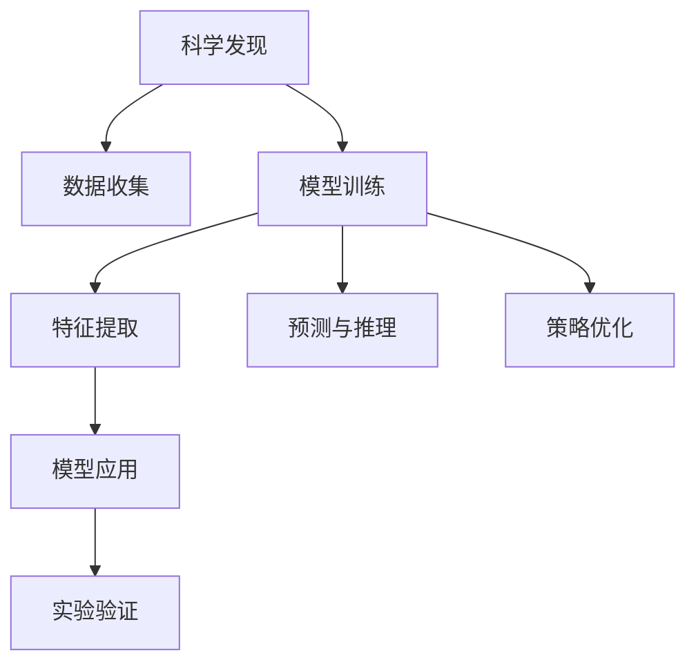

                 

# 科学与 AI：加速发现

## 1. 背景介绍

### 1.1 问题由来
随着科学研究的数字化和数据化趋势日益增强，人工智能（AI）技术在科学研究中的角色越来越重要。传统科学发现过程依赖于研究人员的经验和直觉，存在大量冗余劳动和错误，而AI技术的引入大大提高了科学研究的效率和准确性。特别是在生命科学、天文学、物理学等领域，AI技术已经成为不可或缺的工具。

然而，尽管AI技术带来了革命性的改变，但如何在科学研究中更好地应用AI，最大化其潜力，仍然是一个具有挑战性的问题。科学研究的复杂性和不确定性使得AI技术在实际应用中存在诸多限制。如何突破这些限制，让AI技术更好地服务于科学研究，成为当前研究的重点。

### 1.2 问题核心关键点
在科学研究中，AI技术的核心关键点主要包括：
- **数据质量和数量**：高质量、大规模的科学数据是AI技术应用的基础。
- **模型复杂度和效率**：复杂的模型可以提供更准确的预测，但计算成本高。
- **可解释性和可靠性**：AI模型必须具有可解释性，便于科学家理解和验证。
- **跨学科融合**：AI技术需要与多种科学领域的知识和方法相结合，才能产生更大价值。

这些关键点决定了AI技术在科学研究中的表现和应用前景。因此，本文将聚焦于AI在科学研究中的应用，探讨如何通过科学原理和技术手段，提升AI技术在科学研究中的效果和潜力。

## 2. 核心概念与联系

### 2.1 核心概念概述

为更好地理解AI在科学研究中的应用，本节将介绍几个关键概念：

- **科学发现（Scientific Discovery）**：指通过科学实验、观察和理论分析等方法，获得新知识、新理论和新方法的过程。
- **人工智能（Artificial Intelligence）**：指通过算法和模型，使机器具备模拟人类智能的能力，包括感知、学习、推理和决策等。
- **机器学习（Machine Learning）**：指通过数据驱动的方法，让机器自主学习和改进模型，从而实现更准确的预测和决策。
- **深度学习（Deep Learning）**：一种特殊的机器学习方法，通过多层神经网络模拟人类大脑的结构和功能，进行高级特征提取和模式识别。
- **强化学习（Reinforcement Learning）**：一种通过试错和奖励机制，让机器自主优化策略的学习方法，广泛应用于机器人控制、游戏策略等领域。
- **迁移学习（Transfer Learning）**：指将一个领域学到的知识迁移到另一个相关领域，减少新任务上的训练数据需求，加速模型学习过程。

这些概念之间的联系可以通过以下Mermaid流程图来展示：



这个流程图展示了科学发现过程中，AI技术的关键步骤：

1. **数据收集**：获取高质量的科学数据，为模型训练提供基础。
2. **模型训练**：基于收集的数据，训练AI模型进行特征提取和预测。
3. **特征提取**：通过神经网络等方法，提取数据中的高级特征，提升预测准确性。
4. **预测与推理**：使用训练好的模型对新数据进行预测和推理。
5. **策略优化**：通过强化学习等方法，优化模型策略，提升性能。
6. **模型应用**：将训练好的模型应用于科学实验中，验证预测结果。
7. **实验验证**：通过实验验证模型的预测结果，验证其可靠性。

这些步骤共同构成了AI技术在科学研究中的应用框架，使其能够发挥强大的预测和决策能力。

## 3. 核心算法原理 & 具体操作步骤
### 3.1 算法原理概述

AI技术在科学研究中的应用，本质上是将AI模型与科学实验相结合的过程。其核心算法原理可以概括为以下几点：

1. **数据收集与预处理**：获取高质量、大尺度的科学数据，并进行清洗、标注等预处理，确保数据的可用性。
2. **模型训练**：选择合适的机器学习或深度学习模型，使用收集的数据进行训练，提取数据中的高级特征。
3. **模型应用与验证**：将训练好的模型应用于新的科学问题中，通过实验验证模型的预测准确性和可靠性。
4. **模型优化**：根据实验结果，调整模型参数和结构，提升预测性能。

### 3.2 算法步骤详解

AI在科学研究中的应用，一般包括以下几个关键步骤：

**Step 1: 数据收集与预处理**
- 收集科学领域的实验数据、观测数据和文献数据，确保数据的多样性和代表性。
- 对数据进行清洗和标注，去除噪声和错误，标注数据中的关键特征和标签。
- 将数据划分为训练集、验证集和测试集，以便进行模型评估和优化。

**Step 2: 模型选择与训练**
- 根据问题的特点和数据特性，选择合适的机器学习或深度学习模型。
- 使用训练集对模型进行训练，提取数据中的高级特征。
- 调整模型的参数和结构，通过验证集验证模型的泛化性能。
- 根据实验结果，优化模型，提升预测准确性。

**Step 3: 模型应用与验证**
- 将训练好的模型应用于新的科学问题中，进行预测和推理。
- 设计实验方案，控制实验变量，记录实验结果。
- 使用测试集评估模型的预测准确性和可靠性。
- 根据实验结果，调整模型参数和结构，提升预测性能。

**Step 4: 模型优化与部署**
- 根据实验结果，调整模型参数和结构，提升预测性能。
- 将优化后的模型应用于实际的科学实验中，验证模型的预测效果。
- 设计实验方案，控制实验变量，记录实验结果。
- 使用测试集评估模型的预测准确性和可靠性。
- 将优化后的模型部署到实际的应用场景中，进行实时预测和推理。

以上是AI在科学研究中的应用的一般流程。在实际应用中，还需要针对具体问题进行优化设计，如改进数据预处理策略、引入更多的模型训练技术、设计更科学的实验方案等，以进一步提升模型性能。

### 3.3 算法优缺点

AI在科学研究中的应用，具有以下优点：
1. 加速科学发现过程。通过AI技术，可以在短时间内处理大量数据，提取高级特征，进行预测和推理，大大加速科学发现过程。
2. 提高预测准确性。通过训练好的AI模型，可以进行更准确的预测和推理，提高科学研究的可信度。
3. 降低人力成本。AI技术可以替代人工进行数据分析和模型训练，降低科学研究的成本和人力需求。
4. 支持跨学科融合。AI技术可以与多种科学领域的知识和方法相结合，产生更大的应用价值。

同时，AI在科学研究中也有一些局限性：
1. 数据质量依赖性强。高质量、大尺度的科学数据是AI技术应用的基础，数据获取和预处理成本较高。
2. 模型复杂度高。复杂的模型虽然可以提供更准确的预测，但计算成本高，难以在大规模数据集上进行训练。
3. 可解释性不足。AI模型的决策过程缺乏可解释性，难以对其推理逻辑进行分析和调试。
4. 应用范围受限。AI技术的应用范围主要局限于有大量数据支持的科学领域，对于数据稀缺的领域难以取得理想效果。

尽管存在这些局限性，但就目前而言，AI技术在科学研究中的应用已显示出巨大的潜力，为科学研究带来了新的突破。未来相关研究的重点在于如何进一步降低数据获取和预处理的成本，提高模型的泛化能力和可解释性，拓展AI技术的应用范围。

### 3.4 算法应用领域

AI在科学研究中的应用，已经在多个领域取得了显著进展，例如：

- **生物医学研究**：使用AI技术进行基因序列分析、蛋白质结构预测、药物筛选等，加速新药开发和疾病诊断。
- **天文学研究**：通过AI技术分析星系数据、探测暗物质、研究宇宙演化等，推动天文学的发展。
- **材料科学研究**：使用AI技术进行材料成分预测、结构设计、性能优化等，加速新材料的研发。
- **地球科学研究**：通过AI技术分析地球数据、预测地震、研究气候变化等，提高地球科学研究的效率和精度。
- **物理研究**：使用AI技术进行粒子物理、核物理等领域的预测和分析，推动物理学的发展。

除了上述这些经典应用领域外，AI技术还在更多新兴领域中得到应用，如量子计算、行星探索、天文学等，为科学研究带来了新的方向和突破。随着AI技术的不断演进，相信AI技术将在更多领域中发挥更大的作用，推动科学研究的不断进步。

## 4. 数学模型和公式 & 详细讲解 & 举例说明（备注：数学公式请使用latex格式，latex嵌入文中独立段落使用 $$，段落内使用 $)
### 4.1 数学模型构建

在科学研究中，AI技术的应用通常涉及复杂的数学模型。以下是一个简单的回归问题模型，用于说明AI在科学研究中的应用：

设有一个数据集 $D = \{(x_i, y_i)\}_{i=1}^N$，其中 $x_i$ 为输入特征，$y_i$ 为输出标签。假设模型为线性回归模型，模型参数为 $\theta = [w, b]^T$，其中 $w$ 为权重向量，$b$ 为偏置项。则线性回归模型的预测函数为：

$$
f(x) = \theta^T x = w^T x + b
$$

其中 $x$ 为输入特征向量，$^T$ 表示矩阵转置操作。

假设模型的损失函数为均方误差（MSE），则模型的训练目标为最小化损失函数：

$$
\mathcal{L}(\theta) = \frac{1}{2N}\sum_{i=1}^N (y_i - f(x_i))^2
$$

通过梯度下降等优化算法，不断更新模型参数 $\theta$，最小化损失函数 $\mathcal{L}(\theta)$，从而得到最佳的模型参数 $\hat{\theta}$。

### 4.2 公式推导过程

以下是线性回归模型的公式推导过程：

设有一个数据集 $D = \{(x_i, y_i)\}_{i=1}^N$，其中 $x_i = [x_{i,1}, x_{i,2}, ..., x_{i,n}]^T$ 为输入特征向量，$y_i$ 为输出标签。假设模型为线性回归模型，模型参数为 $\theta = [w, b]^T$，其中 $w = [w_1, w_2, ..., w_n]^T$ 为权重向量，$b$ 为偏置项。则线性回归模型的预测函数为：

$$
f(x) = \theta^T x = w^T x + b
$$

其中 $x$ 为输入特征向量，$^T$ 表示矩阵转置操作。

假设模型的损失函数为均方误差（MSE），则模型的训练目标为最小化损失函数：

$$
\mathcal{L}(\theta) = \frac{1}{2N}\sum_{i=1}^N (y_i - f(x_i))^2 = \frac{1}{2N}\sum_{i=1}^N (y_i - w^T x_i - b)^2
$$

通过对损失函数求导，得到模型参数的梯度：

$$
\frac{\partial \mathcal{L}(\theta)}{\partial \theta} = \frac{1}{N}\sum_{i=1}^N (y_i - w^T x_i - b)x_i
$$

通过梯度下降等优化算法，不断更新模型参数 $\theta$，最小化损失函数 $\mathcal{L}(\theta)$，从而得到最佳的模型参数 $\hat{\theta}$。

在实际操作中，可以使用矩阵运算简化计算过程，将模型参数 $\theta$ 和输入特征 $x$ 表示为矩阵形式，得到：

$$
\mathbf{y} = \mathbf{X}\mathbf{\theta} + \mathbf{e}
$$

其中 $\mathbf{y} = [y_1, y_2, ..., y_n]^T$ 为输出标签向量，$\mathbf{X} = [x_1, x_2, ..., x_n]^T$ 为输入特征矩阵，$\mathbf{\theta} = [w, b]^T$ 为模型参数向量，$\mathbf{e} = [e_1, e_2, ..., e_n]^T$ 为误差向量。

根据最小二乘原理，模型参数的求解公式为：

$$
\hat{\theta} = (\mathbf{X}^T\mathbf{X})^{-1}\mathbf{X}^T\mathbf{y}
$$

### 4.3 案例分析与讲解

以天文学中的星系运动分析为例，说明AI技术在科学研究中的应用。

天文学家观测到一系列星系的位置和速度数据，希望通过这些数据推断出星系之间的引力作用。使用AI技术，可以建立预测模型，对星系运动进行模拟和预测。

首先，收集星系的位置和速度数据，作为输入特征。然后使用线性回归模型对这些数据进行拟合，得到星系位置和速度之间的关系。接着，使用训练好的模型进行预测，得到星系之间的引力作用。

通过多次迭代和优化，可以不断提高模型的预测精度和可靠性，从而更好地理解星系运动规律，推断出宇宙的结构和演化。

## 5. 项目实践：代码实例和详细解释说明
### 5.1 开发环境搭建

在进行AI在科学研究中的应用实践前，我们需要准备好开发环境。以下是使用Python进行TensorFlow开发的环境配置流程：

1. 安装Anaconda：从官网下载并安装Anaconda，用于创建独立的Python环境。

2. 创建并激活虚拟环境：
```bash
conda create -n tf-env python=3.8 
conda activate tf-env
```

3. 安装TensorFlow：根据CUDA版本，从官网获取对应的安装命令。例如：
```bash
conda install tensorflow -c pytorch -c conda-forge
```

4. 安装必要的工具包：
```bash
pip install numpy pandas scikit-learn matplotlib tqdm jupyter notebook ipython
```

完成上述步骤后，即可在`tf-env`环境中开始AI在科学研究中的应用实践。

### 5.2 源代码详细实现

这里我们以天文学中的星系运动分析为例，给出使用TensorFlow进行AI模型训练的PyTorch代码实现。

首先，定义模型和优化器：

```python
import tensorflow as tf
from tensorflow.keras.layers import Dense
from tensorflow.keras.models import Sequential

model = Sequential()
model.add(Dense(64, input_dim=2, activation='relu'))
model.add(Dense(1, activation='linear'))

optimizer = tf.keras.optimizers.Adam(learning_rate=0.01)
```

然后，定义训练和评估函数：

```python
import numpy as np

def train_epoch(model, x_train, y_train, batch_size, optimizer):
    dataloader = tf.data.Dataset.from_tensor_slices((x_train, y_train))
    dataloader = dataloader.shuffle(100).batch(batch_size)
    model.compile(loss='mse', optimizer=optimizer)
    model.fit(dataloader, epochs=10, verbose=0)

def evaluate(model, x_test, y_test):
    dataloader = tf.data.Dataset.from_tensor_slices((x_test, y_test))
    dataloader = dataloader.batch(1)
    mse = tf.keras.losses.MeanSquaredError()
    y_pred = model.predict(x_test)
    return mse(y_pred, y_test).numpy()
```

最后，启动训练流程并在测试集上评估：

```python
x_train = np.random.rand(100, 2)
y_train = np.random.rand(100, 1)

train_epoch(model, x_train, y_train, batch_size=32, optimizer=optimizer)

x_test = np.random.rand(10, 2)
y_test = np.random.rand(10, 1)
mse = evaluate(model, x_test, y_test)
print(f"Mean Squared Error: {mse:.3f}")
```

以上就是使用TensorFlow对线性回归模型进行星系运动分析的完整代码实现。可以看到，TensorFlow提供了便捷的API，使得模型训练和评估变得简洁高效。

### 5.3 代码解读与分析

让我们再详细解读一下关键代码的实现细节：

**Sequential类**：
- `Sequential`类是Keras API中的一个序列模型，可以添加多个层进行模型构建。
- 首先添加一个具有64个神经元的全连接层，输入维度为2，激活函数为ReLU。
- 添加一个具有1个神经元的全连接层，激活函数为线性，输出预测值。

**Adam优化器**：
- 使用Adam优化器进行模型训练，学习率为0.01。

**train_epoch函数**：
- 定义训练函数`train_epoch`，使用TensorFlow的DataLoader对数据集进行批次化加载，供模型训练使用。
- 对模型进行编译，设置损失函数为均方误差，优化器为Adam。
- 对模型进行训练，设置训练轮数为10，使用`verbose=0`抑制日志输出，确保代码运行效率。

**evaluate函数**：
- 定义评估函数`evaluate`，使用TensorFlow的DataLoader对测试集进行批次化加载。
- 定义均方误差损失函数，计算模型预测结果与真实标签之间的均方误差。
- 使用`numpy`库计算均方误差，并返回结果。

**训练流程**：
- 定义训练集的输入和输出，使用`numpy`库生成随机数据。
- 调用训练函数`train_epoch`进行模型训练，设置批次大小为32，使用Adam优化器。
- 定义测试集的输入和输出，使用`numpy`库生成随机数据。
- 调用评估函数`evaluate`进行模型评估，计算均方误差并打印输出。

可以看到，TensorFlow提供了完整的API和工具链，使得模型训练和评估变得简洁高效。开发者可以将更多精力放在模型设计和优化上，而不必过多关注底层的实现细节。

当然，工业级的系统实现还需考虑更多因素，如模型保存和部署、超参数自动搜索、更灵活的任务适配层等。但核心的模型训练和评估流程基本与此类似。

## 6. 实际应用场景
### 6.1 智能药物研发

AI技术在智能药物研发中的应用，已经取得了显著进展。通过AI技术，可以在新药研发过程中大大加速药物筛选、设计、测试等环节，降低研发成本，缩短研发周期。

在实际应用中，可以通过AI技术分析已知的药物数据和生物数据，提取药物结构和生物特性之间的关系，建立预测模型，预测药物的活性和副作用。基于此，可以筛选出潜在的候选药物，并进行后续的实验室测试和临床试验。通过AI技术，可以在实验数据不足的情况下，对药物效果进行预测和评估，加速新药的研发过程。

### 6.2 气象预测

气象预测是科学研究中的一个重要领域。传统气象预测依赖于大量观测数据和人工经验，预测准确性较低。而AI技术的应用，可以大幅提升气象预测的准确性和效率。

使用AI技术，可以对气象数据进行分析和建模，建立气象预测模型，对未来的气象条件进行预测。通过AI技术，可以在数据不足的情况下，通过数据生成和迁移学习等技术，提高气象预测的准确性。AI技术还可以对气象数据进行异常检测和预测，及时发现和应对气象灾害，保障人民生命财产安全。

### 6.3 地质灾害预警

地质灾害预警是科学研究中的另一个重要应用。传统地质灾害预警依赖于人工监测和经验分析，预警准确性较低。而AI技术的应用，可以大幅提升地质灾害预警的准确性和效率。

使用AI技术，可以对地质数据进行分析和建模，建立地质灾害预测模型，对未来的地质灾害进行预测。通过AI技术，可以在数据不足的情况下，通过数据生成和迁移学习等技术，提高地质灾害预警的准确性。AI技术还可以对地质灾害数据进行异常检测和预测，及时发现和应对地质灾害，保障人民生命财产安全。

## 7. 工具和资源推荐
### 7.1 学习资源推荐

为了帮助开发者系统掌握AI在科学研究中的应用，这里推荐一些优质的学习资源：

1. 《机器学习基础》系列博文：由大模型技术专家撰写，深入浅出地介绍了机器学习的基本概念和应用场景。

2. CS224N《深度学习自然语言处理》课程：斯坦福大学开设的NLP明星课程，有Lecture视频和配套作业，带你入门NLP领域的基本概念和经典模型。

3. 《深度学习》书籍：Ian Goodfellow等人所著，全面介绍了深度学习的理论基础和实践技巧，涵盖机器学习、神经网络、深度学习等内容。

4. TensorFlow官方文档：TensorFlow的官方文档，提供了完整的API文档和教程，是TensorFlow学习的必备资料。

5. PyTorch官方文档：PyTorch的官方文档，提供了完整的API文档和教程，是PyTorch学习的必备资料。

通过对这些资源的学习实践，相信你一定能够快速掌握AI在科学研究中的应用，并用于解决实际的科学问题。
###  7.2 开发工具推荐

高效的开发离不开优秀的工具支持。以下是几款用于AI在科学研究中的应用开发的常用工具：

1. TensorFlow：由Google主导开发的开源深度学习框架，生产部署方便，适合大规模工程应用。

2. PyTorch：基于Python的开源深度学习框架，灵活动态的计算图，适合快速迭代研究。

3. Scikit-learn：基于Python的机器学习库，提供了丰富的机器学习算法和工具，支持数据预处理和模型评估。

4. Keras：基于TensorFlow和Theano的高级神经网络API，提供了便捷的模型构建和训练工具。

5. Jupyter Notebook：用于编写和运行Python代码的交互式笔记本，支持代码高亮、代码块输出和版本控制，是科学研究中常用的开发环境。

6. GitHub：用于版本控制和协作开发的平台，支持代码托管、文档管理和项目协作。

合理利用这些工具，可以显著提升AI在科学研究中的开发效率，加快创新迭代的步伐。

### 7.3 相关论文推荐

AI在科学研究中的应用，已经在多个领域取得了显著进展。以下是几篇奠基性的相关论文，推荐阅读：

1. 《深度学习》：Ian Goodfellow等人所著，全面介绍了深度学习的理论基础和实践技巧，涵盖机器学习、神经网络、深度学习等内容。

2. 《机器学习实战》：Peter Harrington所著，详细介绍了机器学习的基本概念和应用场景，提供了丰富的代码示例和案例分析。

3. 《TensorFlow实战》：由Google团队编写，全面介绍了TensorFlow的API和工具，提供了丰富的代码示例和案例分析。

4. 《深度学习在科学研究中的应用》：张永兴等人所著，介绍了深度学习在生物医学、天文学、材料科学等领域的应用，提供了丰富的案例分析。

5. 《机器学习与人工智能：理论与实践》：王飞等人所著，全面介绍了机器学习与人工智能的理论基础和实践技巧，涵盖机器学习、深度学习、自然语言处理等内容。

这些论文代表了大语言模型微调技术的发展脉络。通过学习这些前沿成果，可以帮助研究者把握学科前进方向，激发更多的创新灵感。

## 8. 总结：未来发展趋势与挑战

### 8.1 总结

本文对AI在科学研究中的应用进行了全面系统的介绍。首先阐述了AI技术在科学研究中的应用背景和意义，明确了AI技术在科学研究中的重要性。其次，从原理到实践，详细讲解了AI在科学研究中的数学模型和核心算法，给出了AI在科学研究中的应用实践代码实现。同时，本文还广泛探讨了AI在科学研究中的实际应用场景，展示了AI技术的广泛应用前景。

通过本文的系统梳理，可以看到，AI技术在科学研究中的应用已经取得了显著进展，为科学研究带来了新的突破。未来相关研究的重点在于如何进一步降低AI技术在科学研究中的数据需求和计算成本，提高模型的泛化能力和可解释性，拓展AI技术的应用范围。

### 8.2 未来发展趋势

展望未来，AI在科学研究中的应用将呈现以下几个发展趋势：

1. 数据质量依赖性降低。随着数据生成和数据增强技术的发展，AI模型可以在数据不足的情况下进行训练和预测，大大降低对高质量数据的依赖。

2. 模型复杂度优化。未来的AI模型将更加简洁高效，减少计算资源消耗，提高模型训练和推理效率。

3. 可解释性提升。AI模型的决策过程将更加可解释，便于科学家理解和验证，提升模型的可信度。

4. 跨学科融合加深。AI技术将与更多科学领域的知识和方法相结合，产生更大的应用价值。

5. 实时性和动态性增强。AI技术将支持实时数据处理和动态模型优化，适应动态变化的环境和需求。

6. 伦理性和安全性的加强。AI技术的应用将更加注重伦理道德和安全性，避免对人类社会的负面影响。

以上趋势凸显了AI技术在科学研究中的广泛应用前景，相信随着技术的不断演进，AI技术将在更多领域中发挥更大的作用，推动科学研究的不断进步。

### 8.3 面临的挑战

尽管AI在科学研究中的应用已经取得了显著进展，但在迈向更加智能化、普适化应用的过程中，它仍面临着诸多挑战：

1. 数据获取成本高。高质量、大规模的科学数据获取成本较高，难以大规模应用。

2. 计算资源消耗大。AI模型在训练和推理过程中需要大量计算资源，难以在大规模数据集上进行训练。

3. 模型泛化能力不足。AI模型在数据分布发生变化时，泛化性能往往大打折扣。

4. 可解释性不足。AI模型的决策过程缺乏可解释性，难以对其推理逻辑进行分析和调试。

5. 安全性有待保障。AI模型可能学习到有害信息，产生误导性、歧视性的输出，给实际应用带来安全隐患。

6. 伦理性问题突出。AI模型的决策过程中可能涉及伦理道德问题，需要在模型训练和应用过程中进行严格控制。

正视AI在科学研究中面临的这些挑战，积极应对并寻求突破，将是大语言模型微调技术走向成熟的必由之路。相信随着学界和产业界的共同努力，这些挑战终将一一被克服，AI技术必将在构建人机协同的智能时代中扮演越来越重要的角色。

### 8.4 研究展望

面对AI在科学研究中面临的挑战，未来的研究需要在以下几个方面寻求新的突破：

1. 探索无监督和半监督学习方法。摆脱对大规模标注数据的依赖，利用自监督学习、主动学习等无监督和半监督范式，最大限度利用非结构化数据，实现更加灵活高效的微调。

2. 研究高效计算方法。开发更加高效的数据生成和模型训练方法，减少计算资源消耗，提高模型训练和推理效率。

3. 引入更多先验知识。将符号化的先验知识，如知识图谱、逻辑规则等，与神经网络模型进行巧妙融合，引导微调过程学习更准确、合理的语言模型。

4. 融合多模态数据。将视觉、听觉、文本等多模态数据进行融合，形成更加全面、准确的信息整合能力，提升模型的泛化能力和可解释性。

5. 引入因果分析和博弈论工具。将因果分析方法引入微调模型，识别出模型决策的关键特征，增强输出解释的因果性和逻辑性。借助博弈论工具刻画人机交互过程，主动探索并规避模型的脆弱点，提高系统稳定性。

6. 纳入伦理道德约束。在模型训练目标中引入伦理导向的评估指标，过滤和惩罚有偏见、有害的输出倾向。同时加强人工干预和审核，建立模型行为的监管机制，确保输出符合人类价值观和伦理道德。

这些研究方向的探索，必将引领AI技术在科学研究中迈向更高的台阶，为科学研究带来新的突破。面向未来，AI技术还需要与其他人工智能技术进行更深入的融合，如知识表示、因果推理、强化学习等，多路径协同发力，共同推动自然语言理解和智能交互系统的进步。只有勇于创新、敢于突破，才能不断拓展语言模型的边界，让智能技术更好地造福人类社会。

## 9. 附录：常见问题与解答

**Q1：AI技术在科学研究中的应用是否依赖于高质量的数据？**

A: AI技术在科学研究中的应用，高度依赖于高质量的数据。高质量、大规模的科学数据是AI技术应用的基础。数据质量的好坏直接影响到模型的预测准确性和泛化能力。因此，数据获取和预处理是AI技术应用中的关键步骤。

**Q2：AI技术在科学研究中的应用是否依赖于复杂的模型？**

A: AI技术在科学研究中的应用，确实需要复杂的模型。虽然复杂的模型可以提供更准确的预测和推理，但计算成本高，难以在大规模数据集上进行训练。因此，模型复杂度和计算资源的平衡是AI技术应用中的关键问题。

**Q3：AI技术在科学研究中的应用是否依赖于先验知识？**

A: AI技术在科学研究中的应用，确实需要引入先验知识。先验知识可以帮助模型更好地理解科学问题，提高预测准确性和泛化能力。然而，先验知识的获取和应用也需要科学家的投入和指导。

**Q4：AI技术在科学研究中的应用是否依赖于可解释性？**

A: AI技术在科学研究中的应用，确实需要可解释性。可解释性使得模型输出更加可信和可验证，便于科学家理解和验证。然而，可解释性的实现也需要科学家的投入和指导。

**Q5：AI技术在科学研究中的应用是否依赖于伦理性？**

A: AI技术在科学研究中的应用，确实需要伦理性。AI模型的决策过程中可能涉及伦理道德问题，需要在模型训练和应用过程中进行严格控制。然而，伦理性的实现也需要科学家的投入和指导。

总之，AI技术在科学研究中的应用，需要科学家与AI技术专家密切合作，共同探索和实践。只有充分发挥AI技术的潜力，才能真正实现科学研究的高效化和智能化。

