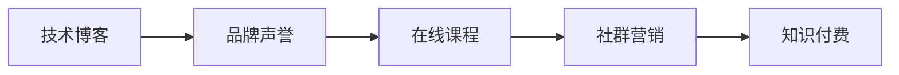

                 

# 程序员利用知识付费打造个人品牌的策略

> 关键词：知识付费, 程序员, 个人品牌, 技术博客, 在线课程, 社群营销, 知识共享

## 1. 背景介绍

### 1.1 问题由来
在互联网高度发达的今天，个人品牌的重要性越来越凸显。尤其在科技行业，优秀的程序员可以通过个人品牌吸引更多关注和机会。然而，不少程序员在成名前仍然缺乏系统性、结构化的职业规划，难以明确目标，无法形成系统化、差异化的职业成长路径。

### 1.2 问题核心关键点
构建个人品牌是一项系统性工程，涉及技术、市场、个人等多方面因素，需要有明确的策略和规划。本文将围绕知识付费这一方向，探讨程序员如何通过提供有价值的内容，打造独特的个人品牌，积累口碑，获取更多的机会。

### 1.3 问题研究意义
本文的实践指导意义在于：

- 帮助程序员构建自己的个人品牌，提升自己的市场竞争力。
- 通过知识付费，实现个人成长和商业价值的同步增长。
- 为有意愿通过知识付费拓展业务的其他技术从业者提供参考。

## 2. 核心概念与联系

### 2.1 核心概念概述

在讨论如何利用知识付费打造个人品牌之前，我们先需要明确一些关键概念：

- **知识付费**：指消费者为获取专业知识和技能而支付费用的模式。这包括在线课程、技术博客、技术咨询等形式。

- **个人品牌**：指个人在行业内形成的独特形象和声誉。主要包括技术水平、专业领域、创新能力等方面。

- **技术博客**：指程序员通过撰写技术文章，记录技术实践、分享经验，形成品牌影响力的行为。

- **在线课程**：程序员通过设计教学内容，录制视频，为学员提供系统性学习的平台。

- **社群营销**：指通过创建专业社群，定期组织技术交流、讨论、项目实践，建立和维护社群影响力。

这些概念之间的联系可以归纳如下：

1. 技术博客是个人品牌建设的重要手段，帮助程序员在行业内形成个人声誉。
2. 在线课程提供系统化的专业知识，形成个人品牌的核心竞争力。
3. 知识付费是实现个人品牌价值和职业成长的主要方式。
4. 社群营销帮助程序员建立社群影响力，提升个人品牌。

通过这些手段的有机结合，程序员可以系统性地构建自己的个人品牌，在技术领域脱颖而出。

### 2.2 核心概念原理和架构的 Mermaid 流程图



## 3. 核心算法原理 & 具体操作步骤

### 3.1 算法原理概述

构建个人品牌的核心在于提供有价值的内容，形成影响力。这需要程序员具备系统性思维和组织能力，通过选择合适的知识付费形式，逐步扩大个人品牌的影响力。

### 3.2 算法步骤详解

基于以上概念，构建个人品牌的步骤可以分为以下几个方面：

**Step 1: 确定个人品牌定位**

- **明确技术领域**：选择技术领域，如Web开发、人工智能、云计算等。
- **定位目标群体**：确定目标受众，如初/中级开发者、数据科学家等。

**Step 2: 发布高质量技术博客**

- **撰写高质量文章**：详细描述技术原理、实现细节、项目经验、疑难问题等。
- **定期更新内容**：保持博客更新频率，以维持受众的持续关注。
- **互动交流**：鼓励读者留言、评论，提供有针对性的反馈和解答。

**Step 3: 制作优质在线课程**

- **制定课程大纲**：根据目标受众的需求，设计课程内容和知识结构。
- **制作教学视频**：录制详尽的课程讲解，注重实操性和互动性。
- **搭建课程平台**：选择Udemy、Coursera等平台，发布课程并进行推广。

**Step 4: 社群营销与互动**

- **创建专业社群**：加入或创建技术社群，定期组织技术分享、问答等活动。
- **提供个性化指导**：对社群成员的技术问题进行个性化解答和指导。
- **拓展社交网络**：利用LinkedIn、Twitter等平台，进行技术交流和资源分享。

**Step 5: 知识付费变现**

- **设置合理价格**：根据课程和内容质量，设置适当的课程价格。
- **多样化收入来源**：除了课程收入，还可以通过技术咨询、技术演讲、顾问服务等方式获得收入。
- **持续改进和优化**：根据用户反馈，持续优化课程和博客内容，提高质量和互动性。

### 3.3 算法优缺点

知识付费和品牌建设策略的主要优点：

- **提升专业能力**：通过持续学习和输出，不断提升自己的技术水平和专业知识。
- **扩大影响范围**：借助平台和社群，将影响力扩大到更广泛的用户群体。
- **多元收入来源**：知识付费和品牌变现，增加了多种收入渠道。

但同时，也存在一些缺点：

- **时间和精力投入**：内容创作和社群维护需要大量时间和精力。
- **市场风险**：技术快速变化，内容需要不断更新，否则可能失去吸引力。
- **内容质量风险**：如果内容质量低下，反而会影响个人品牌。

### 3.4 算法应用领域

这些策略不仅适用于程序员，在所有技术领域内，具有一定技术深度和专业能力的人士，都可以通过知识付费构建个人品牌，提升自身价值。

- **软件工程师**：撰写技术博客，制作开发教程，加入技术社群。
- **数据科学家**：分享数据分析技巧，制作机器学习课程，进行技术讲座。
- **网络安全专家**：发布安全漏洞分析，制作安全课程，参与网络安全社区。
- **人工智能专家**：撰写AI应用案例，制作深度学习课程，参与AI研讨会。

这些领域内的专家通过知识付费，都可以形成自己的品牌影响力，提升行业地位，增加商业机会。

## 4. 数学模型和公式 & 详细讲解 & 举例说明

### 4.1 数学模型构建

这里我们将知识付费与品牌建设的模型用数学公式进行抽象。

设品牌影响力 $B$ 由三部分组成：技术深度 $D$、市场覆盖 $C$ 和用户互动 $I$。具体如下：

$$
B = f(D, C, I)
$$

其中：
- $D$：技术深度，包括技术专业性和创新能力。
- $C$：市场覆盖，指受众的广泛程度和品牌曝光率。
- $I$：用户互动，指读者参与度、反馈质量等。

模型中的各个参数可以通过不同的知识付费手段进行提升，最终得到品牌影响力的最大化。

### 4.2 公式推导过程

通过变量分析法，假设每次发布一篇高质量技术博客，增加互动次数为 $\Delta I$，通过社群营销新增用户数为 $\Delta C$，制作一次高质量在线课程增加品牌曝光度 $\Delta C'$，获得一次付费课程收益为 $\Delta P$。则品牌影响力提升量为：

$$
\Delta B = f(\Delta D, \Delta C, \Delta I) = \Delta D + \Delta C + \Delta I
$$

其中，

$$
\Delta D = f(\Delta I, \Delta C')
$$

$$
\Delta C' = f(\Delta P, \Delta I)
$$

公式推导得出：技术深度提升依赖于用户互动和市场覆盖，而市场覆盖提升依赖于课程收入和用户互动。通过持续的知识输出和互动反馈，可以有效提升技术深度和市场覆盖，增加品牌影响力。

### 4.3 案例分析与讲解

以下以一位成功案例进行分析：

**案例1：著名开发者 Erica Rhinehart**

Erica Rhinehart 通过在Github上发布高质量的技术博客和代码库，形成了自己的品牌。随后，她通过创建技术社区、制作在线课程和编写技术书籍，进一步扩大了影响力，最终获得了业界广泛的认可和职业发展机会。

**分析**：

1. **技术博客**： Erica 定期在博客上分享最新技术，记录项目实现细节和开发心得，形成稳定的内容输出。
2. **技术社区**：她创建了技术社区，聚集了一大批志同道合的开发者，通过定期的线上交流和技术分享活动，增强了社群粘性。
3. **在线课程**：Erica 通过制作高品质的技术课程，逐步建立起了个人品牌和市场影响力，并通过课程销售和演讲活动变现。

通过这些系统性策略，Erica 成功地将个人品牌价值转化为商业价值，并在职业发展上获得了显著的回报。

## 5. 项目实践：代码实例和详细解释说明

### 5.1 开发环境搭建

为了进行知识付费和品牌建设的实践，以下是一个基本环境搭建流程：

1. 创建域名并注册博客平台，如Medium、CSDN、博客园等。
2. 安装本地博客开发环境，如Jekyll、WordPress等，搭建个人博客。
3. 安装视频录制软件，如OBS、Adobe Premiere等，制作教学视频。
4. 选择在线课程平台，如Udemy、Coursera等，进行课程上传和推广。
5. 创建社交媒体账号，如LinkedIn、Twitter等，积极进行技术交流和资源分享。

### 5.2 源代码详细实现

这里以Medium技术博客的搭建为例，展示一篇高质量技术文章的实现步骤：

```python
# 假设博客内容
content = """
# 高级Web开发实战：响应式布局的实现

## 前言

随着移动设备的普及，响应式设计已成为Web开发中的重要技术之一。本文将详细介绍响应式布局的实现方法，帮助开发者轻松实现跨设备适配。

## 一、响应式布局的基本概念

响应式布局是指根据设备的屏幕尺寸和分辨率，动态调整网页布局，确保在不同设备上都有良好的显示效果。

## 二、实现响应式布局的方法

1. 使用媒体查询

   通过媒体查询，可以根据屏幕尺寸设置不同的CSS样式，实现动态布局。

   ```css
   /* 小屏幕样式 */
   @media (max-width: 768px) {
       .container {
           width: 100%;
           padding: 0 10px;
       }
   }

   /* 大屏幕样式 */
   @media (min-width: 768px) {
       .container {
           width: 80%;
           margin: 0 auto;
       }
   }
   ```

2. 使用弹性布局

   弹性布局是一种灵活的布局方式，可以根据容器的大小和子元素的尺寸，自动调整布局。

   ```css
   .container {
       display: flex;
       flex-wrap: wrap;
       justify-content: center;
   }
   
   .item {
       flex: 1 1 30%;
   }
   ```

3. 使用CSS网格布局

   CSS网格布局提供了一种更为强大的布局方式，可以轻松实现复杂的网格结构。

   ```css
   .container {
       display: grid;
       grid-template-columns: repeat(3, 1fr);
       grid-gap: 20px;
   }
   
   .item {
       grid-column: span 2;
   }
   ```

## 三、总结

响应式布局是Web开发中的重要技术，通过媒体查询、弹性布局和CSS网格布局等方法，可以轻松实现跨设备的适配。希望本文的分享能够帮助开发者提升响应式设计的水平。
   """

# 生成HTML博客

from markdown import markdown

blog_html = markdown(content)

# 上传博客至Medium平台
# 代码略
```

### 5.3 代码解读与分析

博客文章由标题、摘要、正文、总结四部分组成。其中，标题和摘要用于吸引读者注意力，正文部分详细介绍技术实现，总结部分对全文进行总结。这种结构清晰、逻辑严密的博客布局，有助于提高读者阅读体验和内容质量。

### 5.4 运行结果展示

假设将上述代码生成博客文章并成功上传至Medium平台，一篇高质量的技术博客将帮助程序员在行业内建立起个人品牌，吸引更多读者关注和互动。

## 6. 实际应用场景

### 6.1 技术博客

技术博客是程序员展示技术深度和专业能力的重要渠道。通过撰写高质量的技术文章，可以吸引更多的读者关注，逐渐形成品牌影响力。

- **教程型博客**：提供系统化的技术教程，如Python、JavaScript、深度学习等。
- **实践型博客**：分享项目实践经验，展示技术应用场景，如Web开发、移动应用等。
- **趋势型博客**：分析行业动态和技术趋势，帮助读者把握技术方向，如区块链、大数据、人工智能等。

### 6.2 在线课程

在线课程提供系统化的知识体系，可以吸引更多的学员学习，扩大品牌影响力。

- **入门课程**：针对初学者，提供基础技术讲解，如Python基础、SQL基础等。
- **进阶课程**：针对有一定基础的学习者，提供高级技术讲解，如Web开发框架、数据结构与算法等。
- **实战课程**：提供项目实战案例，帮助学员应用所学知识，如Web项目开发、数据分析应用等。

### 6.3 社群营销

社群营销通过定期组织技术交流和讨论，增强用户粘性和品牌互动，提升社群影响力。

- **技术分享会**：定期组织技术分享会，邀请行业专家和知名人士进行技术讲解和讨论。
- **问题答疑**：通过社群平台，实时回答用户的技术问题，提供有针对性的解答。
- **项目合作**：组织社群成员进行项目合作，共同开发和发布技术成果，提升社群的活跃度和影响力。

### 6.4 未来应用展望

未来，知识付费和品牌建设将更加多元化、系统化，展现出更大的发展潜力：

- **内容平台多样化**：除了博客和课程，还将出现更多元化的知识付费形式，如视频、音频、直播等。
- **智能推荐系统**：利用智能推荐系统，精准推送用户感兴趣的内容，提升用户体验和粘性。
- **国际化发展**：随着知识付费市场国际化，全球化的内容生产和营销也将成为重要趋势。
- **结合AI技术**：结合AI技术进行内容生成和推荐，提升内容质量和用户互动体验。

## 7. 工具和资源推荐

### 7.1 学习资源推荐

以下推荐的资源将帮助程序员系统性地提升知识付费和品牌建设的能力：

1. **Coursera、Udemy等在线课程平台**：提供大量高质量的课程资源，覆盖各技术领域。
2. **Medium、CSDN等技术博客平台**：提供丰富的技术文章和社区资源，帮助程序员展示和分享技术成果。
3. **Github、Stack Overflow等技术社区**：提供丰富的开源项目和技术交流机会，帮助程序员提升技术能力和品牌影响力。
4. **LinkedIn、Twitter等社交媒体平台**：进行技术交流和资源分享，拓展职业网络和市场机会。

### 7.2 开发工具推荐

以下是一些实用的工具，用于知识付费和品牌建设：

1. **Jekyll、WordPress等博客开发工具**：用于搭建和管理个人博客，发布高质量技术文章。
2. **OBS、Adobe Premiere等视频录制软件**：制作高品质的教学视频，提升课程和博客质量。
3. **Udemy、Coursera等在线课程平台**：提供课程上传和推广，实现知识变现。
4. **GitHub等代码托管平台**：提供开源项目展示和技术合作机会，提升品牌影响力。

### 7.3 相关论文推荐

以下是几篇相关论文，帮助程序员深入理解知识付费和品牌建设的理论基础：

1. **《基于社交网络的知识传播机制研究》**：研究社交网络对知识传播的影响和机制，帮助理解社群营销的重要性和方法。
2. **《知识付费平台的用户行为分析》**：通过用户行为数据，分析知识付费平台的用户需求和付费意愿，指导课程设计和推广策略。
3. **《构建品牌影响力的策略研究》**：系统研究品牌影响力构建的方法和策略，提供实践指导。

## 8. 总结：未来发展趋势与挑战

### 8.1 研究成果总结

本文通过系统的分析，探讨了程序员如何通过知识付费和品牌建设，提升市场竞争力，实现职业成长和商业价值的同步增长。

### 8.2 未来发展趋势

未来知识付费和品牌建设将呈现以下几个趋势：

1. **内容多样化**：知识付费形式更加多样化，除了博客和课程，还将出现更多元化的内容形式。
2. **智能化**：结合AI技术，提升内容生成和推荐效率，提高用户互动体验。
3. **国际化**：知识付费和品牌建设将实现国际化发展，拓展全球市场。
4. **结合社群营销**：通过社群营销，增强用户粘性和品牌影响力。

### 8.3 面临的挑战

知识付费和品牌建设也面临一些挑战：

1. **内容质量风险**：内容质量低劣，难以吸引用户关注，影响品牌声誉。
2. **市场竞争激烈**：知识付费市场竞争激烈，如何突出自身特色，吸引用户关注。
3. **用户粘性不足**：用户互动和粘性不足，难以形成稳定的受众群体。
4. **技术变革快速**：技术快速变化，需要不断更新课程和博客内容，以保持竞争力。

### 8.4 研究展望

面对这些挑战，未来的研究需要在以下几个方面寻求新的突破：

1. **内容优化和质量控制**：通过内容优化和质量控制，提升课程和博客质量，吸引更多用户关注。
2. **社群互动和粘性提升**：通过建立活跃的社群，提高用户粘性和品牌互动。
3. **AI辅助内容生成**：结合AI技术进行内容生成和推荐，提高效率和质量。
4. **市场定位和差异化策略**：进行市场定位和差异化策略，形成独特的品牌影响力。

## 9. 附录：常见问题与解答

**Q1: 如何选择合适的知识付费平台？**

A: 选择知识付费平台需要考虑以下因素：

- **平台的用户群体**：选择与目标受众匹配的平台。
- **平台的用户粘性**：选择有活跃用户群体的平台，提高课程和博客的曝光率。
- **平台的内容质量**：选择提供高质量内容和技术支持的平台。

**Q2: 如何吸引更多读者关注和互动？**

A: 吸引读者关注和互动需要以下方法：

- **高质量内容**：提供系统化、详细化的技术文章和课程，吸引用户深入阅读。
- **定期更新**：保持内容更新频率，持续提供有价值的信息。
- **互动交流**：鼓励读者留言、评论，提供有针对性的解答，建立良好的互动环境。

**Q3: 如何提升课程和博客的质量？**

A: 提升课程和博客质量需要以下措施：

- **高质量内容**：深入挖掘技术原理，详细描述实现细节，提供实际应用案例。
- **互动反馈**：根据读者反馈，不断优化课程和博客内容，提高质量和实用性。
- **持续学习**：持续更新知识和技能，保持课程和博客的先进性和实用性。

**Q4: 如何应对技术快速变化带来的挑战？**

A: 应对技术快速变化，需要以下策略：

- **持续学习**：不断更新和补充知识，保持技术前沿性。
- **多样化内容**：提供多种形式的内容，如博客、视频、音频等，适应不同用户需求。
- **社群合作**：与其他技术专家和社群合作，共同推动技术进步。

总之，知识付费和品牌建设是一个系统性工程，需要程序员具备系统性思维和持续学习的能力。通过提供有价值的内容，建立独特个人品牌，程序员可以在技术领域中脱颖而出，实现个人成长和商业价值的同步增长。相信通过不断努力和创新，程序员将在知识付费和品牌建设的道路上越走越远，成就非凡的职业生涯。

---

作者：禅与计算机程序设计艺术 / Zen and the Art of Computer Programming

