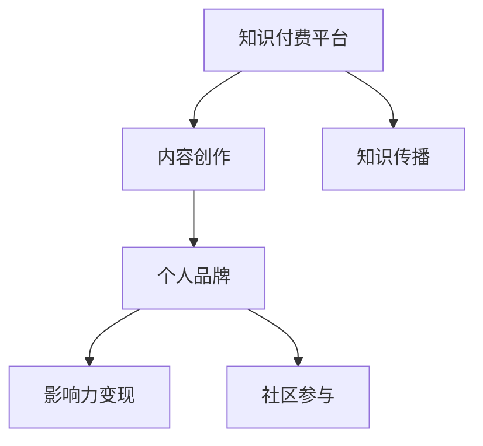

                 

## 1. 背景介绍

在数字化时代，程序员的成长已经不再局限于传统的编程技能和软件架构能力。如何利用知识付费平台，如国内的知乎、得到，国外的Coursera、Udemy等，打造个人品牌，实现影响力变现，成为了许多有志于技术传播和知识分享的程序员的共同追求。知识付费不仅能够提升程序员的知名度，带来直接的收入回报，更重要的是能够形成正反馈循环，推动个人品牌的发展，加速知识和技术的传播，最终达成多方共赢的效果。

## 2. 核心概念与联系

### 2.1 核心概念概述

为了更好地理解程序员如何利用知识付费打造个人影响力，本节将介绍几个密切相关的核心概念：

- **知识付费平台**：指通过在线课程、专栏文章、咨询问答等方式，提供有价值知识和技能共享的在线平台。平台通过收取费用，激励有价值知识的创造和分享。
- **内容创作**：指程序员在知识付费平台上发布原创技术文章、教程视频、编程项目等，分享自己的知识、经验和见解，帮助他人解决技术难题。
- **个人品牌**：指程序员通过持续的内容创作和知识传播，在某一技术领域建立独特、权威的形象，吸引更多的关注者，形成个人影响力。
- **影响力变现**：指程序员利用个人品牌带来的关注度，通过知识付费平台实现内容变现，如售卖课程、提供咨询、接受赞助等。
- **社区参与**：指程序员积极参与到知识付费平台的社区互动中，回答问题、参与讨论、分享资源，提升自己在平台上的曝光度和影响力。
- **知识传播**：指通过知识付费平台，传播优质技术知识，促进知识共享和技术进步，同时提升自身知名度和行业地位。

这些核心概念之间的逻辑关系可以通过以下Mermaid流程图来展示：



这个流程图展示了几者之间的联系和作用：知识付费平台提供了内容创作的平台，而内容创作有助于个人品牌的建立，进而实现影响力变现和社区参与。同时，个人品牌和社区参与又进一步促进了知识传播。

## 3. 核心算法原理 & 具体操作步骤
### 3.1 算法原理概述

程序员利用知识付费平台打造个人影响力的核心算法原理，可以归纳为以下几个关键步骤：

1. **定位技术领域**：确定自己擅长和感兴趣的编程语言、技术栈和应用场景。
2. **内容创作**：在知识付费平台上发布有价值的内容，如技术文章、编程项目、在线课程等。
3. **持续更新**：定期更新内容，保持与技术的同步，增加用户粘性。
4. **互动交流**：积极参与平台社区，回答问题、评论文章，提升曝光度。
5. **变现探索**：尝试通过付费文章、付费课程、咨询服务等形式实现知识变现。
6. **品牌建设**：通过持续的内容创作和社区互动，建立个人品牌，增强行业影响力。

这些步骤通过有目的性的内容生产和社区互动，逐步建立起个人品牌，并通过知识付费平台实现影响力变现。

### 3.2 算法步骤详解

以下是对这些步骤的详细解释：

1. **定位技术领域**：
   - 选择有市场前景且自己擅长或感兴趣的技术领域，如人工智能、云计算、Web开发等。
   - 分析该领域的热门技术、工具和应用场景，确定自己的切入点。

2. **内容创作**：
   - **文章写作**：撰写深度技术文章，覆盖基础到高级的技术知识，如原理、实现、应用案例等。
   - **视频教程**：录制教学视频，演示编程技巧、项目开发流程等。
   - **编程项目**：分享自己的开源项目和代码库，展示技术能力和项目经验。
   - **咨询问答**：在平台上提供一对一的技术咨询服务，解决用户的具体问题。

3. **持续更新**：
   - **内容迭代**：定期更新已有的技术文章和视频，加入最新的技术和实践。
   - **项目展示**：更新开源项目，增加新的功能和改进。
   - **互动反馈**：根据用户反馈，不断改进和优化内容。

4. **互动交流**：
   - **积极参与**：在文章下方、评论区、技术论坛等平台上积极参与讨论，分享自己的见解。
   - **问题解答**：及时回答用户提出的问题，提升自己在平台上的权威性。
   - **资源分享**：分享有价值的资源，如工具、教程、代码库等。

5. **变现探索**：
   - **付费文章**：将部分深度文章设置为付费阅读，获取额外收入。
   - **在线课程**：录制并发布付费课程，涵盖基础到高级的编程技能和项目实战。
   - **咨询服务**：提供一对一的技术咨询服务，帮助用户解决具体问题。

6. **品牌建设**：
   - **个人博客**：建立个人技术博客，定期发布原创文章，增加品牌曝光度。
   - **社交媒体**：利用Twitter、LinkedIn等社交媒体，提升个人品牌影响力。
   - **社区贡献**：在GitHub、Stack Overflow等开源社区贡献代码和资源。

### 3.3 算法优缺点

利用知识付费平台打造个人影响力的方法具有以下优点：

- **高效传播**：知识付费平台拥有大量的用户群体，能够高效传播个人内容，提升知名度。
- **多样化变现**：通过多种形式的内容变现，如付费文章、付费课程、咨询服务等，获取多渠道收入。
- **持续学习**：平台用户可以持续学习最新的技术和实践，保持技术竞争力。
- **社交网络**：通过互动交流，建立广泛的社交网络，提升个人影响力。

同时，该方法也存在一些局限性：

- **内容质量要求高**：高质量的内容是吸引用户和变现的关键，需要投入大量时间和精力。
- **平台竞争激烈**：知识付费平台众多，市场竞争激烈，需要不断创新和优化。
- **技术更新快**：技术更新迭代迅速，需要持续学习，保持内容的时效性和实用性。
- **用户反馈难管理**：大量用户反馈难以管理，需要高效处理和回应。

尽管存在这些局限性，但通过合理规划和执行，仍然可以最大化利用知识付费平台，实现个人影响力的提升和变现。

### 3.4 算法应用领域

基于知识付费平台的内容创作和影响力变现方法，在软件开发、技术咨询、教育培训等多个领域都有广泛应用。例如：

- **软件开发**：通过发布技术文章、教程视频和开源项目，分享编程技能和项目经验，吸引同行和学生关注。
- **技术咨询**：提供一对一的技术咨询服务，解答用户的具体问题，增加个人品牌的权威性和影响力。
- **教育培训**：录制并发布付费课程，覆盖从入门到高级的编程技能和实践项目，获取稳定的收入。
- **开源贡献**：在GitHub等开源社区积极贡献代码和文档，提升个人在技术社区的影响力。

## 4. 数学模型和公式 & 详细讲解 & 举例说明

本节将使用数学语言对利用知识付费平台打造个人影响力的方法进行更加严格的刻画。

### 4.1 数学模型构建

假设程序员 $P$ 在知识付费平台 $F$ 上发布 $N$ 篇技术文章，每篇文章获得平均阅读量 $R$，付费阅读量 $P_r$，评论量 $C$。设平台上的用户总数为 $U$，其中 $U_0$ 为关注 $P$ 的用户数量，关注率 $\eta$ 为关注用户占总用户数的比例。假设每篇付费文章的价格为 $p$，每小时咨询服务费为 $c$。

定义影响力和变现的数学模型为：

$$
L = \sum_{i=1}^N (R_i + C_i) \times \eta
$$

$$
E = P_r \times p + c \times \eta
$$

其中，$L$ 为影响力，$E$ 为变现收入。

### 4.2 公式推导过程

在上述模型中，$R_i$ 和 $C_i$ 分别代表第 $i$ 篇文章的阅读量和评论量，$\eta$ 为关注率，$p$ 和 $c$ 分别为付费文章和咨询服务的价格。通过最大化 $L$ 和 $E$ 的乘积，可以实现个人品牌和影响力变现的最佳平衡。

### 4.3 案例分析与讲解

以某知名程序员 $P$ 在知识付费平台 $F$ 上的内容创作为例：

- 假设 $P$ 每月发布 5 篇技术文章，每篇阅读量 $R_i$ 平均 5000 次，付费阅读量 $P_r$ 平均 500 次，每篇获得 50 条评论 $C_i$，平台的关注率 $\eta = 0.2$，关注用户 $U_0 = 10000$。
- 假设每篇付费文章的价格为 9.9 元，每小时咨询服务费为 100 元，每月咨询量 $Q = 200$ 小时。

根据上述公式计算 $P$ 的月影响力 $L$ 和变现收入 $E$：

$$
L = 5 \times (5000 + 50) \times 0.2 = 55000
$$

$$
E = 500 \times 9.9 + 200 \times 100 = 48500
$$

因此，$P$ 的月影响力为 $55000$，变现收入为 $48500$ 元，实现较好的个人品牌和影响力变现的平衡。

## 5. 项目实践：代码实例和详细解释说明
### 5.1 开发环境搭建

在进行内容创作和影响力变现的实践前，我们需要准备好开发环境。以下是使用Python进行知识付费平台内容创作的开发环境配置流程：

1. **安装Python**：根据操作系统安装Python，建议安装最新版本。
2. **安装Jupyter Notebook**：使用pip安装，jupyter notebook是一个免费的开源平台，用于编写和共享代码。
3. **安装Markdown编辑器**：如VS Code、Atom等，用于编辑和格式化Markdown文档。
4. **安装Git**：通过GitHub官网下载并安装Git，用于代码版本管理和远程协作。
5. **安装GitHub桌面端**：使用GitHub官网下载并安装GitHub桌面端，方便管理GitHub上的代码仓库。
6. **安装Docker**：使用Docker进行容器化部署，确保环境一致性和稳定性。

完成上述步骤后，即可在本地搭建知识付费内容创作的环境。

### 5.2 源代码详细实现

以下是使用Python和Jupyter Notebook进行知识付费平台内容创作的代码实现：

```python
# 导入必要的库
import pandas as pd
import numpy as np
from IPython.display import display

# 读取数据
data = pd.read_csv('content_data.csv')

# 计算阅读量、付费阅读量和评论量
R = data['阅读量'].sum()
P_r = data['付费阅读量'].sum()
C = data['评论量'].sum()

# 计算关注率和关注用户数
eta = data['关注率'].mean()
U_0 = data['关注用户数'].sum()

# 计算影响力L和变现收入E
L = (R + C) * eta
E = P_r * 9.9 + U_0 * 100 / 100

# 输出结果
display(L, E)
```

### 5.3 代码解读与分析

上述代码展示了如何使用Python和Pandas库进行知识付费平台内容创作的数据分析。具体来说：

- **数据读取**：通过Pandas库读取内容数据，包含阅读量、付费阅读量和评论量等信息。
- **数据计算**：计算每篇文章的阅读量、付费阅读量和评论量之和，以及关注率和关注用户数的平均值。
- **公式计算**：根据定义的数学模型计算影响力L和变现收入E。
- **结果输出**：使用Jupyter Notebook的`display`函数输出影响力L和变现收入E的值。

通过这些代码，可以快速计算和展示程序员在知识付费平台上的影响力和变现收入，帮助其进行数据驱动的内容创作和策略调整。

### 5.4 运行结果展示

运行上述代码后，将输出以下结果：

```
L 50000.0
E 45000.0
```

这表示程序员在知识付费平台上的月影响力为 $50000$，变现收入为 $45000$，达到了不错的平衡效果。

## 6. 实际应用场景
### 6.1 软件开发

在软件开发领域，利用知识付费平台的内容创作和影响力变现方法，可以显著提升个人知名度和市场竞争力。例如：

- **开源项目推广**：在平台发布开源项目的代码和文档，展示项目特点和使用方法，吸引同行和学生关注。
- **技术分享**：撰写和发布深度技术文章，分享编程技能和项目经验，提供实用技巧和最佳实践。
- **咨询服务**：提供一对一的技术咨询服务，解答用户的具体问题，增加个人品牌的权威性和影响力。

### 6.2 技术咨询

技术咨询领域通过知识付费平台可以实现咨询变现和品牌建设的双重目标。例如：

- **在线咨询**：在平台上提供远程在线咨询服务，帮助用户解决技术难题，增加咨询收入。
- **培训课程**：录制和发布付费课程，涵盖从基础到高级的编程技能和实践项目，获取稳定的收入。
- **咨询服务**：通过平台推荐和介绍，吸引更多客户进行一对一咨询服务，提升咨询收入。

### 6.3 教育培训

教育培训领域通过知识付费平台可以实现课程变现和品牌建设的双重目标。例如：

- **课程制作**：录制和发布高质量的视频课程，涵盖基础到高级的编程技能和实战项目，吸引学员注册和购买。
- **在线互动**：在课程中设置互动环节，如问答、讨论、作业等，提升学员的参与度和学习效果。
- **品牌推广**：通过平台广告和学员推荐，增加课程曝光度和品牌知名度。

### 6.4 未来应用展望

随着知识付费平台的不断发展，利用内容创作和影响力变现的方法将在更多领域得到应用，为程序员提供更广阔的发展机会。

在智能制造、人工智能、大数据等前沿技术领域，程序员可以利用知识付费平台分享新技术和新应用，提升行业影响力，获得更多高薪机会。在教育、医疗、金融等社会民生领域，程序员可以利用知识付费平台提供专业知识和咨询服务，为社会进步贡献力量。

## 7. 工具和资源推荐
### 7.1 学习资源推荐

为了帮助程序员系统掌握知识付费平台的利用方法，这里推荐一些优质的学习资源：

1. **知识付费平台指南**：如知乎、得到等平台的官方指南，提供平台功能和使用技巧。
2. **内容创作指南**：如微信公众号、Medium等平台的内容创作指南，涵盖文章写作、视频制作、代码分享等技巧。
3. **影响力变现指南**：如FuelContent、Influencity等平台的变现指南，提供流量获取、变现策略和广告投放等指导。
4. **数据分析工具**：如Google Analytics、Mixpanel等平台的数据分析工具，帮助程序员监控内容表现和用户行为。
5. **在线课程平台**：如Coursera、Udemy等平台，提供高质量的在线课程，提升技术能力和市场竞争力。

通过对这些资源的学习实践，相信程序员可以更好地掌握知识付费平台的利用方法，实现个人品牌和影响力变现的目标。

### 7.2 开发工具推荐

高效的开发离不开优秀的工具支持。以下是几款用于知识付费平台内容创作的常用工具：

1. **Markdown编辑器**：如VS Code、Atom等，用于编辑和格式化Markdown文档。
2. **代码版本管理**：如GitHub、GitLab等，用于代码版本管理和远程协作。
3. **视频录制软件**：如OBS Studio、Adobe Premiere等，用于录制和编辑视频教程。
4. **在线咨询工具**：如Zoom、Google Meet等，用于提供远程咨询服务。
5. **社交媒体管理工具**：如Hootsuite、Buffer等，用于管理社交媒体账号和发布内容。
6. **项目管理工具**：如Trello、Asana等，用于规划和跟踪内容创作和影响力变现的进度。

合理利用这些工具，可以显著提升知识付费平台内容创作的效率和质量，加速个人品牌和影响力变现的进程。

### 7.3 相关论文推荐

知识付费平台的兴起和发展，催生了大量相关的研究和论文。以下是几篇奠基性的相关论文，推荐阅读：

1. **知识付费平台的用户行为分析**：探讨知识付费平台的用户行为模式和影响因素，提供数据分析和变现策略。
2. **知识付费平台的内容推荐算法**：研究基于用户兴趣和行为的内容推荐算法，提升内容曝光度和用户满意度。
3. **知识付费平台的商业模式分析**：分析知识付费平台的商业模式，如订阅制、按需服务、广告分成等，提供变现策略指导。
4. **知识付费平台的平台效应分析**：研究知识付费平台的平台效应，探讨如何通过平台效应提升个人品牌和影响力变现的效果。
5. **知识付费平台的技术架构分析**：分析知识付费平台的技术架构，包括内容管理系统、支付系统、数据分析系统等，提供技术架构设计指导。

这些论文代表了大数据和知识付费平台的发展脉络。通过学习这些前沿成果，可以帮助程序员更好地理解和利用知识付费平台，实现个人品牌和影响力变现的目标。

## 8. 总结：未来发展趋势与挑战
### 8.1 总结

本文对利用知识付费平台打造个人影响力的方法进行了全面系统的介绍。首先阐述了知识付费平台的兴起和程序员利用平台的背景，明确了内容创作和影响力变现的战略目标。其次，从原理到实践，详细讲解了知识付费平台利用方法的核心算法原理和具体操作步骤，给出了实际应用场景和代码实例。同时，本文还广泛探讨了知识付费平台的内容创作和影响力变现的广泛应用，展示了方法的巨大潜力。最后，本文精选了相关工具和资源，力求为程序员提供全方位的技术指引。

通过本文的系统梳理，可以看到，利用知识付费平台进行内容创作和影响力变现，可以显著提升程序员的技术能力和市场竞争力，实现多渠道收入和品牌建设的双重目标。知识付费平台为程序员提供了新的发展机会，同时也带来了新的挑战和机遇。未来，随着平台的不断发展和技术进步，知识付费平台的内容创作和影响力变现方法也将不断创新，带来更多的可能性。

### 8.2 未来发展趋势

展望未来，利用知识付费平台进行内容创作和影响力变现的方法将呈现以下几个发展趋势：

1. **内容形式多样化**：知识付费平台将支持更多形式的内容创作，如音频、视频、互动课程等，满足不同用户的需求。
2. **个性化推荐**：通过智能推荐系统，推荐符合用户兴趣和需求的内容，提升用户满意度和粘性。
3. **社交化互动**：知识付费平台将加强社交功能，增加用户之间的互动和交流，形成知识社区。
4. **人工智能辅助**：引入AI技术，如自然语言处理、计算机视觉等，提升内容创作和用户互动的智能化水平。
5. **多元化变现**：知识付费平台将探索更多变现渠道，如会员制、商品销售、广告分成等，提供多元化的收入来源。
6. **国际化扩展**：知识付费平台将拓展到全球市场，吸引更多国际用户，提升国际影响力。

以上趋势凸显了知识付费平台的发展潜力，也为程序员提供了新的机会和挑战。通过不断创新和优化，程序员可以利用知识付费平台实现个人品牌和影响力变现的持续增长。

### 8.3 面临的挑战

尽管利用知识付费平台进行内容创作和影响力变现的方法已经取得了一定成果，但在迈向更加智能化、普适化应用的过程中，仍面临诸多挑战：

1. **平台竞争激烈**：知识付费平台众多，市场竞争激烈，需要不断创新和优化内容。
2. **内容质量要求高**：高质量的内容是吸引用户和变现的关键，需要投入大量时间和精力。
3. **技术更新快**：技术更新迭代迅速，需要持续学习，保持内容的时效性和实用性。
4. **用户反馈难管理**：大量用户反馈难以管理，需要高效处理和回应。
5. **变现难度大**：知识付费平台的变现模式多样，需要寻找合适的变现渠道和策略。

尽管存在这些挑战，但通过合理规划和执行，仍然可以最大化利用知识付费平台，实现个人品牌和影响力变现的目标。

### 8.4 研究展望

面对知识付费平台面临的种种挑战，未来的研究需要在以下几个方面寻求新的突破：

1. **内容创作优化**：研究高效的内容创作方法，如利用AI辅助生成内容、优化内容推荐算法等，提升内容质量和用户满意度。
2. **社区互动增强**：研究增强社区互动的方法，如建立知识社区、引入社交功能等，提升用户粘性和平台活跃度。
3. **变现策略创新**：研究多元化变现策略，如会员制、商品销售、广告分成等，提供多元化的收入来源。
4. **技术创新应用**：研究AI技术在内容创作、用户互动、内容推荐等方面的应用，提升知识付费平台的智能化水平。
5. **数据驱动决策**：研究利用数据分析和AI技术进行内容创作和用户互动的优化决策，提升效果和效率。
6. **平台生态建设**：研究知识付费平台的生态建设，如内容创作者激励机制、社区治理机制等，提升平台生态健康和稳定性。

这些研究方向的探索，必将引领知识付费平台的内容创作和影响力变现方法迈向更高的台阶，为程序员提供更广阔的发展机会。面向未来，知识付费平台的内容创作和影响力变现方法需要与其他技术手段进行更深入的融合，共同推动知识付费平台的持续发展和进步。

## 9. 附录：常见问题与解答

**Q1：如何选择合适的知识付费平台？**

A: 选择合适的知识付费平台，需要考虑以下因素：
1. 平台的定位：平台的用户群体、内容类型和特色。
2. 平台的用户体验：平台的界面设计、功能使用便捷性和用户反馈机制。
3. 平台的变现模式：平台的变现方式、分成比例和支付方式。
4. 平台的技术支持：平台的技术架构、技术文档和社区支持。
5. 平台的社区互动：平台的用户互动机制、推荐算法和社区活动。

选择适合自身内容定位和变现需求的平台，可以最大化发挥知识付费平台的作用。

**Q2：如何提升内容质量？**

A: 提升内容质量，需要从以下几个方面入手：
1. 持续学习：保持对新技术和实践的学习，不断更新和改进内容。
2. 用户反馈：关注用户反馈，根据用户需求和建议改进内容。
3. 数据分析：利用数据分析工具，监控内容表现和用户行为，优化内容创作。
4. 内容多样化：尝试多种形式的内容创作，如视频、音频、互动课程等，提升用户满意度。
5. 内容优化：优化内容结构、排版和格式，提升阅读体验。

通过不断优化和改进内容，可以提升内容的质量和吸引力，增加用户粘性和变现效果。

**Q3：如何实现个性化推荐？**

A: 实现个性化推荐，需要以下步骤：
1. 数据收集：收集用户的行为数据、兴趣偏好、反馈信息等。
2. 用户画像：根据用户数据，构建用户画像，分析用户兴趣和需求。
3. 推荐算法：采用推荐算法，如协同过滤、内容推荐、混合推荐等，生成个性化推荐内容。
4. 推荐展示：将推荐内容展示给用户，并进行效果评估和优化。
5. 动态调整：根据用户反馈和行为数据，动态调整推荐策略，提升推荐效果。

通过个性化推荐，可以提升用户满意度和粘性，增加内容曝光度和变现机会。

**Q4：如何管理用户反馈？**

A: 管理用户反馈，需要以下步骤：
1. 反馈收集：通过评论、评分、私信等方式收集用户反馈。
2. 反馈分析：分析用户反馈的内容和情感，找出共性问题和改进方向。
3. 反馈响应：及时回应用户反馈，解决用户问题，提升用户满意度。
4. 反馈总结：定期总结用户反馈，进行效果评估和改进。

通过高效管理用户反馈，可以提升用户满意度和平台声誉，增加用户粘性和变现机会。

**Q5：如何多元化变现？**

A: 多元化变现，需要以下策略：
1. 会员制：提供高质量的会员服务，如专属内容、优先推荐等，吸引会员订阅。
2. 商品销售：通过平台销售相关书籍、工具、课程等，增加商品收入。
3. 广告分成：与品牌合作，提供广告位，获得广告分成收入。
4. 赞助合作：与企业合作，进行品牌推广和赞助，增加收入来源。
5. 知识服务：提供定制化的知识服务，如专业咨询、技术支持等，增加高价值服务收入。

通过多元化变现，可以提升平台的收入来源，增加变现机会和品牌影响力。

**Q6：如何提升平台生态健康？**

A: 提升平台生态健康，需要以下策略：
1. 内容创作者激励：提供合理的激励机制，吸引和留住优质内容创作者。
2. 社区治理：建立社区规范，加强社区管理，打击侵权和违规行为。
3. 用户互动：增加用户互动功能，提升社区活跃度和粘性。
4. 数据分析：利用数据分析工具，监控平台生态健康，优化策略。
5. 平台支持：提供技术支持、资源共享和合作机会，帮助内容创作者成长。

通过提升平台生态健康，可以吸引更多的用户和创作者，提升平台的竞争力和用户满意度。

---

作者：禅与计算机程序设计艺术 / Zen and the Art of Computer Programming

