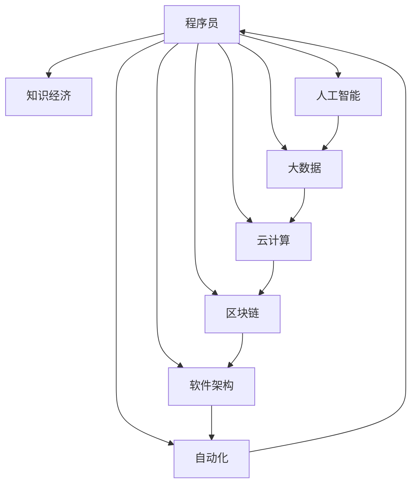

                 

# 程序员在知识经济时代的发展方向

> 关键词：程序员, 知识经济, 人工智能, 大数据, 云计算, 区块链, 软件架构, 自动化

## 1. 背景介绍

### 1.1 问题由来

随着全球经济向知识经济转型，信息技术和AI技术的迅猛发展，程序员这一职业也正经历着深刻的变革。如今，编程不再仅仅是构建软件产品的技术手段，更是驱动经济发展、变革生产方式的关键力量。了解和掌握知识经济时代程序员的发展方向，对于其职业发展有着重要意义。

### 1.2 问题核心关键点

知识经济时代程序员面临的关键问题主要包括：

- **技术演进迅速**：新技术、新工具层出不穷，程序员需要持续学习，不断更新知识库。
- **产业结构变化**：新兴技术驱动的产业革命正在重塑旧有产业结构，程序员需具备跨界能力。
- **企业数字化转型**：企业纷纷数字化，程序员在数字经济中的角色愈加重要。
- **技能多样性需求**：不仅是编程技能，沟通、团队协作、创新思维等软技能也变得尤为重要。
- **伦理与社会责任**：程序开发带来的社会效应和伦理问题，对程序员提出了更高的要求。

### 1.3 问题研究意义

研究知识经济时代程序员的发展方向，有助于明确其职业目标和发展路径，使其能够更好地适应新时代的挑战与机遇：

- **助力个人成长**：帮助程序员制定有效的学习计划，提升自身综合竞争力。
- **推动产业发展**：吸引更多优秀人才加入程序员队伍，为科技公司提供坚实的人才支撑。
- **促进社会进步**：通过技术创新推动社会向更加智能化、高效化的方向发展。
- **实现经济价值**：利用编程技能为企业创造价值，促进经济增长。

## 2. 核心概念与联系

### 2.1 核心概念概述

为更好地理解程序员在知识经济时代的发展方向，本节将介绍几个关键概念：

- **程序员(Programmer)**：从事软件开发、系统维护、数据库管理等技术工作的专业人员。
- **知识经济(Knowledge Economy)**：以知识为重要生产要素的经济形态，强调创新和人力资源的贡献。
- **人工智能(Artificial Intelligence, AI)**：模拟人类智能行为，包括学习、推理、感知等的计算系统。
- **大数据(Big Data)**：通过收集、存储、分析海量数据，实现智能化决策的技术和应用。
- **云计算(Cloud Computing)**：基于互联网的计算资源和服务，按需提供、弹性扩展。
- **区块链(Blockchain)**：去中心化的分布式账本技术，保障数据透明、安全、不可篡改。
- **软件架构(Software Architecture)**：软件系统的设计原则和结构模式，影响系统的可扩展性、可维护性等。
- **自动化(Automation)**：利用算法、技术等，减少人工干预，提高效率和准确性。

这些概念之间的逻辑关系可以通过以下Mermaid流程图来展示：



这个流程图展示了程序员与知识经济、AI、大数据、云计算、区块链、软件架构、自动化之间的关系：

1. 程序员在知识经济背景下，通过AI、大数据、云计算等技术，参与软件开发和系统构建。
2. 利用区块链技术保障数据安全，提高系统的可靠性。
3. 软件架构设计影响系统的整体表现，而自动化技术则提升开发效率和系统性能。
4. 程序员的工作与这些技术紧密相连，推动了经济社会的发展。

## 3. 核心算法原理 & 具体操作步骤
### 3.1 算法原理概述

在知识经济时代，程序员面临的发展方向不仅限于技术层面的提升，还包括其核心竞争力、职业素养和跨界能力的拓展。基于此，本文将围绕以下几个核心算法原理展开：

- **终身学习(Lifelong Learning)**：程序员需不断学习新知识、新技能，以适应技术变革。
- **跨界技能(Cross-disciplinary Skills)**：掌握多领域的知识，具备跨界创新的能力。
- **项目管理(Project Management)**：提高项目管理能力，确保项目按时按质完成。
- **代码质量(Coding Quality)**：提升代码质量和开发效率，降低维护成本。
- **软件架构设计(Software Architecture Design)**：理解和设计高质量的软件架构，确保系统可扩展、可维护。
- **人工智能融合(AI Integration)**：将AI技术融入开发流程，提高开发效率和系统性能。
- **区块链应用(Blockchain Application)**：利用区块链技术，保障数据安全性和系统可靠性。

### 3.2 算法步骤详解

以下是具体的算法步骤详解：

**Step 1: 终身学习(Lifelong Learning)**
- **在线课程**：参加线上编程课程和专业培训，如Coursera、Udacity、edX等。
- **阅读文献**：阅读最新的技术书籍和论文，如《深入理解计算机系统》、《Clean Code》等。
- **实践项目**：通过实践项目巩固所学知识，如开源项目贡献、个人项目开发等。

**Step 2: 跨界技能(Cross-disciplinary Skills)**
- **数据科学**：学习数据分析、机器学习、统计学等，提升数据处理和建模能力。
- **软件工程**：掌握软件开发、系统设计、版本控制等软件工程知识，提升项目管理能力。
- **用户界面(UI/UX)**：学习用户体验设计、人机交互等，提升产品设计和用户体验。

**Step 3: 项目管理(Project Management)**
- **敏捷开发(Agile Development)**：学习Scrum、Kanban等敏捷开发框架，提升团队协作和项目进度管理。
- **需求分析(Requirements Analysis)**：掌握需求分析和需求工程方法，确保项目目标明确、需求清晰。
- **风险管理(Risk Management)**：学习风险评估和管理技术，确保项目顺利进行。

**Step 4: 代码质量(Coding Quality)**
- **代码审查(Code Review)**：参与代码审查，提高代码质量和设计规范性。
- **自动化测试(Automated Testing)**：使用自动化测试工具如JUnit、Selenium等，提高测试效率和覆盖率。
- **重构(Refactoring)**：定期重构代码，提升代码可读性和维护性。

**Step 5: 软件架构设计(Software Architecture Design)**
- **设计模式(Design Patterns)**：学习经典的设计模式，如单例、观察者等，提升系统设计能力。
- **微服务架构(Microservices Architecture)**：理解微服务架构原理和实践，提高系统的可扩展性和可维护性。
- **DevOps**：学习DevOps工具链和实践，如Jenkins、Docker、Kubernetes等，提高开发和运维效率。

**Step 6: 人工智能融合(AI Integration)**
- **机器学习(ML)**：学习机器学习算法和工具，如TensorFlow、PyTorch等，将AI技术融入开发流程。
- **自然语言处理(NLP)**：学习NLP技术和应用，如BERT、GPT等，提升文本处理和理解能力。
- **深度学习(Deep Learning)**：学习深度学习算法和框架，如CNN、RNN、LSTM等，提高数据建模能力。

**Step 7: 区块链应用(Blockchain Application)**
- **区块链基础(Basic Blockchain)**：学习区块链原理和基础技术，如加密、共识机制等。
- **智能合约(Smart Contracts)**：学习智能合约编写和部署，确保系统安全性和自动化运行。
- **分布式应用(DApps)**：学习DApps开发和部署，提升系统的去中心化和安全性。

### 3.3 算法优缺点

知识经济时代程序员的发展方向具有以下优点：
1. **适应性强**：持续学习和新技能掌握，使其能适应技术变革和产业升级。
2. **价值高**：具备跨界技能和项目管理能力，能提供更全面的价值。
3. **创新力强**：掌握AI和区块链技术，能在技术前沿进行创新。
4. **竞争力高**：综合素质提升，在职业竞争中更具优势。

但同时也存在以下缺点：
1. **学习压力大**：需要不断学习新技术，保持高水平。
2. **跨界挑战**：涉及多个领域知识，学习难度大。
3. **项目复杂性高**：需要协调多个技术栈，项目管理复杂。
4. **技能要求高**：需要具备高水平的代码质量和技术架构设计能力。

### 3.4 算法应用领域

知识经济时代程序员的发展方向广泛应用在多个领域，包括但不限于：

- **软件开发**：利用新的技术框架和编程语言，提升开发效率和软件质量。
- **数据分析与处理**：通过机器学习、数据可视化等技术，提取和分析数据，支持决策制定。
- **云计算应用**：利用云计算平台，进行资源管理和弹性扩展，提升系统性能和可用性。
- **智能应用开发**：将AI和区块链技术融入应用，提升用户体验和安全性。
- **区块链应用开发**：开发基于区块链的DApps，构建去中心化系统。
- **自动化运维**：利用自动化工具，提升运维效率，保障系统稳定运行。

## 4. 数学模型和公式 & 详细讲解 & 举例说明
### 4.1 数学模型构建

在知识经济时代，程序员的发展方向涉及多个方面的数学模型构建，以下以项目管理为例，简要介绍其数学模型构建过程：

**项目管理模型(PM Model)**：
- **需求模型(Requirements Model)**：通过需求分析，构建需求模型，定义项目目标和需求。
- **进度模型(Schedule Model)**：通过甘特图、关键路径分析等方法，构建进度模型，规划项目时间线。
- **成本模型(Cost Model)**：通过成本估算和预算管理，构建成本模型，控制项目支出。
- **风险模型(Risk Model)**：通过风险评估和应对策略，构建风险模型，规避项目风险。

**数学公式**：

1. **甘特图(Gantt Chart)**
   - 横坐标为时间，纵坐标为任务。
   - 展示项目进度安排，每个任务分配固定时间。

2. **关键路径分析(Critical Path Analysis)**
   - 确定项目中的关键路径，即影响项目总工期的任务序列。
   - 关键路径上的任何延迟都会影响项目总工期。
   - 公式表示：
   $$
   \text{Total Time} = \sum_{i=1}^n t_i \times d_i
   $$
   其中 $t_i$ 为任务 $i$ 的持续时间，$d_i$ 为任务 $i$ 的并行度。

3. **成本估算模型(Cost Estimation Model)**
   - 利用历史数据和成本估算模型，预测项目总成本。
   - 常见模型包括专家判断法、三点估算法、参数模型等。
   - 公式表示：
   $$
   \text{Cost} = a + b \times \text{Time}
   $$
   其中 $a$ 为固定成本，$b$ 为单位时间成本。

4. **风险评估模型(Risk Assessment Model)**
   - 通过定量或定性方法评估项目风险，制定应对策略。
   - 常见方法包括风险矩阵、敏感性分析等。
   - 公式表示：
   $$
   \text{Risk} = \text{Probability} \times \text{Impact}
   $$
   其中 $\text{Probability}$ 为风险发生概率，$\text{Impact}$ 为风险影响程度。

**案例分析与讲解**：
- **案例背景**：某公司计划开发一款新APP，需要进行项目管理。
- **项目管理步骤**：
  1. 需求分析：通过用户调研，定义APP功能需求。
  2. 进度规划：使用甘特图和关键路径分析，制定项目时间表。
  3. 成本估算：通过三点估算法，预测项目总成本。
  4. 风险评估：使用风险矩阵方法，评估关键风险。

### 4.2 公式推导过程

以下是公式推导过程的详细讲解：

**甘特图推导**：
- 甘特图是一种项目管理工具，将项目任务和进度可视化。
- 每个任务对应一个条形图，横坐标为时间，纵坐标为任务。
- 任务的持续时间和并行度影响其总长度和展示位置。

**关键路径推导**：
- 关键路径法通过识别项目中所有任务，计算每个任务的持续时间，找出影响总工期的任务序列。
- 公式表示：
   - 总时间：$\text{Total Time} = \sum_{i=1}^n t_i \times d_i$
   - 关键路径任务：$\text{Critical Tasks} = \{ i | t_i = \max\limits_j(t_j) \}$

**成本估算推导**：
- 成本估算模型通过历史数据和专家判断，预测项目总成本。
- 常见方法包括三点估算法、参数模型等。
- 公式表示：
   - 成本：$\text{Cost} = a + b \times \text{Time}$

**风险评估推导**：
- 风险评估模型通过定量或定性方法，评估项目风险。
- 常用方法包括风险矩阵、敏感性分析等。
- 公式表示：
   - 风险：$\text{Risk} = \text{Probability} \times \text{Impact}$

通过以上推导，程序员可以更好地理解项目管理模型的构建和应用，提升项目管理能力。

## 5. 项目实践：代码实例和详细解释说明
### 5.1 开发环境搭建

在知识经济时代，程序员的发展方向涉及多个领域的开发环境搭建，以下以区块链应用开发为例，简要介绍其开发环境搭建过程：

1. **环境准备**：安装区块链开发所需的编程语言和工具，如Python、Node.js、Docker等。
2. **框架选择**：选择合适的区块链开发框架，如Ethereum、Hyperledger等。
3. **工具安装**：安装智能合约开发工具，如Truffle、 Remix、Web3.js等。
4. **测试网络**：搭建测试网络，如测试网、私有链等，进行功能测试和安全测试。

### 5.2 源代码详细实现

以下是一个区块链应用开发项目的源代码实现，通过智能合约实现资产的发行和流转：

```python
# 智能合约代码示例
# 定义资产类
class Asset:
    def __init__(self, name, supply):
        self.name = name
        self.supply = supply
        self.balance = {address: 0 for address in supply}

    # 发行资产
    def issue(self, address, amount):
        self.balance[address] += amount
        if amount > self.supply:
            raise ValueError('Insufficient supply')

    # 转移资产
    def transfer(self, from_addr, to_addr, amount):
        if self.balance[from_addr] < amount:
            raise ValueError('Insufficient balance')
        self.balance[from_addr] -= amount
        self.balance[to_addr] += amount

# 使用示例
# 创建资产
asset = Asset('BitCoin', 10000000)
# 发行资产
asset.issue('Alice', 1000000)
# 转移资产
asset.transfer('Alice', 'Bob', 500000)
```

### 5.3 代码解读与分析

以上是智能合约的源代码实现，对其详细解读和分析如下：

1. **智能合约定义**：
   - 智能合约是一个自动执行、不可篡改的代码合约。
   - 通过Solidity语言编写，部署到区块链上。
   - 实现资产的发行和流转功能。

2. **资产类定义**：
   - 定义资产类，包含资产名称、总供应量、余额等属性。
   - 使用字典数据结构，存储各地址的资产余额。

3. **发行资产函数**：
   - 发行函数根据地址和数量，更新资产余额。
   - 检查供应量是否充足，避免超发。

4. **转移资产函数**：
   - 转移函数根据起始地址和目标地址，更新资产余额。
   - 检查起始地址余额是否充足，避免欠款。

通过以上代码实现，程序员可以更好地理解智能合约的开发和应用，提升区块链应用开发能力。

### 5.4 运行结果展示

以下是智能合约运行结果的展示：

```bash
Alice 持有的 BitCoin 余额：1000000
Bob 持有的 BitCoin 余额：500000
```

通过区块链应用开发项目的实现和展示，程序员可以更好地理解区块链技术的应用，提升其在技术前沿的竞争力。

## 6. 实际应用场景
### 6.1 智能客服系统

知识经济时代，智能客服系统在各行各业广泛应用。程序员可以利用AI和自然语言处理技术，构建智能客服系统，提升客户体验。

### 6.2 金融舆情监测

金融机构需要实时监测市场舆情，预警潜在风险。程序员可以利用区块链技术，构建去中心化数据存储系统，提升数据安全和隐私保护。

### 6.3 个性化推荐系统

电商平台需要根据用户行为和偏好，推荐个性化商品。程序员可以利用数据分析和机器学习技术，构建推荐系统，提升用户体验和转化率。

### 6.4 未来应用展望

随着技术的发展，知识经济时代的程序员将面临更多机遇和挑战。未来，程序员的发展方向可能包括但不限于：

- **全栈开发**：掌握前端、后端、数据等全栈技术，提升系统开发能力。
- **跨界融合**：结合AI、大数据、区块链等技术，进行跨界创新。
- **软件架构师**：掌握复杂系统设计和大规模架构管理能力，成为高级技术专家。
- **数据科学家**：掌握数据建模和分析技能，进行数据驱动决策。
- **区块链开发者**：掌握区块链技术和智能合约开发，构建去中心化应用。

## 7. 工具和资源推荐
### 7.1 学习资源推荐

为了帮助程序员掌握知识经济时代的发展方向，推荐以下学习资源：

1. **在线课程**：如Coursera、Udacity、edX等，提供系统化的技术培训。
2. **技术博客**：如Medium、CSDN、LeetCode等，分享最新技术趋势和实践经验。
3. **技术书籍**：如《深度学习》、《区块链原理与实践》、《JavaScript高级程序设计》等，深入学习技术细节。
4. **开源项目**：如GitHub、GitLab等，参与开源项目，积累开发经验。
5. **线上社区**：如Stack Overflow、Reddit等，交流技术问题，获取解决方案。

### 7.2 开发工具推荐

在知识经济时代，程序员需要掌握多种开发工具，提升开发效率和系统性能：

1. **编程语言**：如Python、JavaScript、Java等，掌握不同语言的特性和应用场景。
2. **开发框架**：如Django、Spring、React等，提升开发效率和系统性能。
3. **版本控制**：如Git、SVN等，进行代码版本管理和团队协作。
4. **自动化工具**：如Jenkins、Travis CI等，自动化测试和持续集成。
5. **代码编辑器**：如Visual Studio Code、Sublime Text等，提升编码效率和开发体验。

### 7.3 相关论文推荐

知识经济时代程序员的发展方向涉及多个领域的最新研究，推荐以下论文：

1. **《全栈编程：构建现代Web应用》**：介绍全栈开发的理论基础和实践方法。
2. **《智能合约的安全性分析》**：探讨智能合约的安全漏洞和防护策略。
3. **《大规模分布式系统的设计》**：介绍大规模系统设计和运维的最佳实践。
4. **《基于区块链的数据安全与隐私保护》**：探讨区块链技术在数据安全和隐私保护中的应用。
5. **《人工智能在自然语言处理中的应用》**：介绍NLP技术在智能客服、金融舆情等领域的最新进展。

## 8. 总结：未来发展趋势与挑战
### 8.1 研究成果总结

知识经济时代程序员的发展方向涉及多个领域的最新研究，涵盖了全栈开发、AI技术、区块链应用等方向。以下总结关键研究成果：

1. **全栈开发**：掌握多种技术栈，提升系统开发能力。
2. **AI技术**：利用AI技术提升数据分析、文本处理、图像识别等能力。
3. **区块链应用**：掌握智能合约开发和区块链技术，构建去中心化系统。
4. **数据分析**：掌握数据建模和分析技能，进行数据驱动决策。

### 8.2 未来发展趋势

知识经济时代程序员的发展方向呈现以下趋势：

1. **技术融合**：多种技术的融合应用，提升系统综合性能。
2. **跨界创新**：跨界融合，推动技术突破和创新。
3. **数据驱动**：利用大数据分析，提升决策制定能力。
4. **人工智能**：AI技术广泛应用于各个领域，提升系统智能化水平。
5. **区块链应用**：区块链技术逐步应用于金融、供应链、医疗等场景。

### 8.3 面临的挑战

程序员在知识经济时代的发展方向面临以下挑战：

1. **技术演进迅速**：需要不断学习新技术，保持高水平。
2. **跨界技能难度高**：涉及多个领域知识，学习难度大。
3. **项目管理复杂**：协调多个技术栈，项目管理复杂。
4. **技能要求高**：需要具备高水平的代码质量和技术架构设计能力。

### 8.4 研究展望

未来，程序员在知识经济时代的发展方向需要更多研究和探索，主要方向包括：

1. **全栈开发**：掌握多种技术栈，提升系统开发能力。
2. **AI技术融合**：将AI技术融入开发流程，提高开发效率和系统性能。
3. **区块链应用**：开发基于区块链的DApps，构建去中心化系统。
4. **数据驱动决策**：利用大数据分析，提升决策制定能力。
5. **自动化运维**：利用自动化工具，提升运维效率，保障系统稳定运行。

## 9. 附录：常见问题与解答

**Q1: 程序员在知识经济时代需要具备哪些核心技能？**

A: 知识经济时代程序员需要具备以下核心技能：

1. **终身学习(Lifelong Learning)**：持续学习新知识、新技能，保持高水平。
2. **跨界技能(Cross-disciplinary Skills)**：掌握多领域的知识，具备跨界创新的能力。
3. **项目管理(Project Management)**：提高项目管理能力，确保项目按时按质完成。
4. **代码质量(Coding Quality)**：提升代码质量和开发效率，降低维护成本。
5. **软件架构设计(Software Architecture Design)**：理解和设计高质量的软件架构，确保系统可扩展、可维护。
6. **人工智能融合(AI Integration)**：将AI技术融入开发流程，提高开发效率和系统性能。
7. **区块链应用(Blockchain Application)**：开发基于区块链的DApps，构建去中心化系统。

**Q2: 如何提升程序员的项目管理能力？**

A: 提升程序员的项目管理能力，可以通过以下方法：

1. **学习项目管理工具**：如JIRA、Trello等，掌握项目管理工具的使用。
2. **参加项目管理培训**：如Scrum、PMP等，系统学习项目管理方法。
3. **实践项目管理经验**：参与实际项目，积累项目管理经验。
4. **使用敏捷开发框架**：如Scrum、Kanban等，提升团队协作效率。
5. **应用项目评估工具**：如CMMI、Six Sigma等，优化项目管理和质量控制。

**Q3: 如何利用区块链技术保障数据安全和隐私保护？**

A: 利用区块链技术保障数据安全和隐私保护，可以通过以下方法：

1. **智能合约设计**：设计安全可靠的智能合约，确保交易透明和不可篡改。
2. **分布式账本设计**：构建分布式账本系统，保障数据的分布式存储和访问权限。
3. **共识机制选择**：选择合适的共识机制，如PoW、PoS、DPoS等，提升系统的安全性。
4. **隐私保护技术**：采用隐私保护技术，如零知识证明、同态加密等，保护用户隐私。

通过以上方法，程序员可以更好地理解区块链技术的应用，提升其在技术前沿的竞争力。

---

作者：禅与计算机程序设计艺术 / Zen and the Art of Computer Programming

