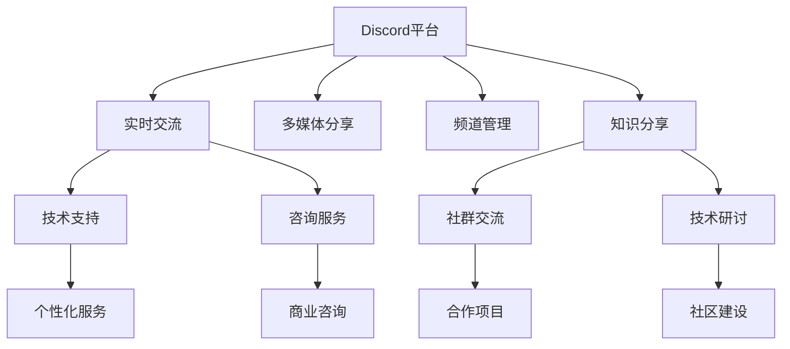

                 

# 程序员如何利用Discord进行知识变现

在数字化时代的浪潮中，程序员作为互联网创新和构建数字基础设施的核心力量，面临着前所未有的机遇与挑战。随着AI和云计算技术的迅猛发展，程序员的知识和技能日益成为市场争夺的焦点。Discord作为全球最大的语音和文字交流平台，其丰富的功能已经不仅仅局限于游戏社群，更在教育、知识分享、技术讨论等领域发挥着重要作用。本文将探讨程序员如何利用Discord进行知识变现，解锁未来职业发展的无限可能。

## 1. 背景介绍

### 1.1 问题由来
随着远程工作和在线教育的兴起，全球程序员对于高质量、实时交互的学习资源和交流平台的需求日益增长。传统的视频教程和博客等形式已难以满足即时性和互动性的需求。Discord以其即时通讯、语音聊天、多媒体分享等多元化功能，为程序员提供了一个全新的知识交流平台。程序员可以利用Discord进行知识变现，不仅能够提供个性化的技术支持和咨询服务，还能够建立自己的社群，分享经验和技术，获得社区成员的支持和认可，从而提升知名度和影响力。

### 1.2 问题核心关键点
程序员利用Discord进行知识变现的核心在于：
- 利用Discord的实时交流功能，提供高质量的技术支持和服务。
- 构建自己的技术社群，形成知识分享和交流的生态。
- 利用平台的内置功能，如货币交易系统，进行知识变现。

## 2. 核心概念与联系

### 2.1 核心概念概述
- **Discord**：一个多功能的社交平台，支持语音和文字通讯，拥有丰富的多媒体分享和频道管理功能，广泛应用于游戏社群、技术交流、教育培训等多个领域。
- **知识变现**：通过提供专业知识、技术支持、咨询服务等形式，将自身的技术知识转化为经济收益的过程。
- **技术社群**：由技术人员组成的网络社群，通过在线交流、分享经验、合作项目等方式，形成知识交流和技能提升的良性循环。

### 2.2 核心概念原理和架构的 Mermaid 流程图



这个流程图展示了Discord平台的核心功能如何与知识变现和技术社群构建相联系：

1. 实时交流：为技术支持和服务提供基础。
2. 多媒体分享：丰富知识分享形式，增强互动性。
3. 频道管理：构建知识社群，形成良好的交流环境。
4. 知识分享：促进社区成员之间的经验交流和技术提升。

## 3. 核心算法原理 & 具体操作步骤

### 3.1 算法原理概述

基于Discord的知识变现过程，本质上是一个多对多、即时反馈的交流系统。它通过实时交流、频道管理和多媒体分享等手段，促进知识的传递和变现。以下是核心算法原理：

1. **实时交流**：利用Discord的聊天室和私聊功能，实现技术支持和咨询服务。
2. **频道管理**：构建技术专题频道，组织技术讨论和知识分享活动。
3. **多媒体分享**：利用音频、视频、文档等形式，丰富知识分享内容。
4. **社群构建**：通过活跃的交流和合作项目，提升社群成员的粘性和贡献度。
5. **知识变现**：利用Discord内置的交易系统，进行知识付费和赞助。

### 3.2 算法步骤详解

1. **账号和频道设置**
   - 注册并完善Discord账号，创建个人和专业账号。
   - 创建专业频道，命名如“技术支持”、“知识分享”等。
   - 设置频道访问权限，确保只允许具有特定权限的用户进入。

2. **内容生产**
   - 制作技术教程、编程实例、解决方案等多媒体内容，通过频道发布。
   - 实时在线回答技术问题，提供一对一咨询。
   - 定期举办技术研讨和编程挑战，吸引更多用户参与。

3. **社群管理**
   - 创建技术兴趣群组，如“Python开发者”、“Web开发者”等。
   - 设立贡献度评价体系，通过任务完成、问题解答等方式给予积分和奖励。
   - 定期组织线上线下活动，增强社群凝聚力。

4. **知识变现**
   - 利用Discord的交易系统，设置知识付费模块。
   - 通过出售课程、提供一对一咨询服务等方式进行变现。
   - 接受社区成员的赞助和打赏，提升经济收益。

### 3.3 算法优缺点

#### 优点
- **实时互动**：提供了即时的技术支持和交流平台，提升服务质量和用户体验。
- **多元内容**：多媒体分享形式丰富，增加了知识传播的趣味性和效果。
- **社区生态**：构建了技术社群，增强了用户粘性和活跃度。
- **经济收益**：利用内置的交易系统，实现知识变现，获取稳定收入。

#### 缺点
- **平台依赖**：Discord平台的稳定性和功能更新对知识变现影响较大。
- **时间管理**：需要投入大量时间进行内容生产和社群管理。
- **知识门槛**：技术社区对专业知识要求较高，新入群成员需要适应和成长。
- **安全风险**：用户隐私和数据安全需严格管理和监控。

### 3.4 算法应用领域

Discord平台支持的知识变现应用领域广泛，涵盖以下几个方面：

- **技术支持**：为远程工作者、开源项目维护者等提供实时技术支持。
- **在线教育**：通过直播课程、编程实例、技术研讨等方式进行在线教育。
- **技术咨询**：提供商业咨询、项目管理和技术方案设计等服务。
- **知识分享**：组织开源社区、技术博客、编程挑战等活动，推动知识共享。
- **知识交易**：利用Discord的内置交易系统，进行课程付费、咨询服务、知识打赏等。

## 4. 数学模型和公式 & 详细讲解 & 举例说明

### 4.1 数学模型构建

我们以技术支持为例，构建一个简单的数学模型：

- **用户输入**：用户提问，问题描述为 $x$，问题类型 $y$。
- **模型响应**：模型回答，答案为 $a$。
- **反馈调整**：根据用户满意度和问题解决情况，对模型进行调整。

我们可以用如下数学模型描述：

$$
a = f(x, y, \theta)
$$

其中 $f$ 表示模型函数，$\theta$ 为模型参数。

### 4.2 公式推导过程

以简单的二分类问题为例，推导模型响应的计算公式。

假设问题类型 $y$ 为二分类，即 $y \in \{0, 1\}$，模型响应的正确性可以用 $a$ 与 $y$ 的匹配度来衡量。我们定义匹配度 $m$ 为：

$$
m = \begin{cases} 
1 & a = y \\
0 & a \neq y
\end{cases}
$$

模型的目标是最小化错误率 $E$，即：

$$
E = \mathop{\min}_{\theta} \frac{1}{N} \sum_{i=1}^N (1 - m_i)
$$

其中 $N$ 为总样本数，$E$ 为错误率。

### 4.3 案例分析与讲解

假设有一个关于Python编程的问题，用户 $x$ 提问，问题类型 $y=1$。模型响应的答案 $a$ 是正确的，即 $a=y$，匹配度 $m=1$。模型的参数 $\theta$ 可以通过监督学习算法进行优化，最小化错误率 $E$。

## 5. 项目实践：代码实例和详细解释说明

### 5.1 开发环境搭建

在开始项目实践之前，需要搭建好Discord开发环境。具体步骤如下：

1. 安装Discord开发工具包。
2. 创建和配置Discord账号。
3. 创建和管理频道。

### 5.2 源代码详细实现

以下是一个简单的Discord技术支持插件的实现示例：

```python
from discord.ext import commands

class TechSupport(commands.Cog):
    def __init__(self, bot):
        self.bot = bot

    @commands.command(name='tech_support')
    async def tech_support(self, ctx, question):
        # 处理技术问题，生成回答
        answer = generate_answer(question)
        # 发送回答到指定频道
        await ctx.send(f'{ctx.author.mention} 你的问题已处理，以下是回答：{answer}')

def generate_answer(question):
    # 根据问题生成回答
    # 返回生成的回答
    pass

# 初始化Discord客户端和插件
bot = commands.Bot(command_prefix='!')

bot.add_cog(TechSupport(bot))
bot.run('YOUR_DISCORD_BOT_TOKEN')
```

### 5.3 代码解读与分析

该代码实现了一个基于Discord的简单技术支持插件，具体如下：

- `TechSupport` 类：定义了技术支持的命令处理逻辑。
- `tech_support` 命令：处理用户的提问，生成回答，并发送到指定频道。
- `generate_answer` 函数：根据用户提问生成回答。

在代码中，使用了Discord的命令扩展库 `discord.ext` 来创建和管理Discord插件。`generate_answer` 函数可以根据用户提问生成回答，具体实现需要结合实际业务逻辑和数据模型。

### 5.4 运行结果展示

在实际运行中，用户可以发送指定格式的问题到Discord频道，如 `!tech_support 如何安装Python 3.9`。插件收到问题后，自动生成回答并发送到频道。用户可以看到回答，进行确认和反馈。

## 6. 实际应用场景

### 6.1 智能客服系统

智能客服系统是Discord知识变现的重要应用场景之一。程序员可以利用Discord构建智能客服系统，提供24/7的技术支持。用户可以通过聊天室或私聊发送问题，客服系统自动生成并发送回答，大大提升客户满意度和服务效率。

### 6.2 在线教育平台

在线教育平台可以通过Discord进行知识分享和互动教学。程序员可以创建技术专题频道，发布课程和讲座，进行直播讲解。学生可以在频道中提问，教师及时解答，形成良好的互动和反馈机制。

### 6.3 技术交流社群

技术社群是程序员交流知识和经验的理想场所。程序员可以利用Discord创建技术兴趣群组，组织技术研讨和编程挑战，分享技术心得和成果。社群内成员相互支持，共同提升技术水平。

### 6.4 未来应用展望

随着Discord平台功能的不断拓展，程序员的知识变现将迎来更多可能性。例如：

- **虚拟现实教育**：结合VR技术，提供沉浸式学习体验。
- **增强现实协作**：利用AR技术进行远程协作和代码审查。
- **AI驱动分析**：利用AI技术进行问题解答和知识推荐，提升服务质量。
- **跨平台整合**：与微信、QQ等平台进行整合，提供多渠道知识变现。

## 7. 工具和资源推荐

### 7.1 学习资源推荐

为了帮助程序员利用Discord进行知识变现，推荐以下学习资源：

1. **Discord官方文档**：详细介绍了Discord的API和开发工具包，是开发者入门的基础。
2. **Python编程语言**：作为Discord插件的主要开发语言，Python提供了丰富的开发工具和库。
3. **开源项目**：GitHub上众多开源的Discord插件和工具，可以学习和借鉴。
4. **技术博客和论坛**：如CSDN、Stack Overflow等，提供丰富的技术讨论和经验分享。
5. **在线课程和视频**：如Udemy、Coursera等平台上的在线课程，深入讲解Discord开发和知识变现技巧。

### 7.2 开发工具推荐

以下是几款常用的Discord开发工具：

1. **Discord API**：Discord官方提供的API，用于创建和管理Discord应用和插件。
2. **GitHub**：版本控制和协作平台，适合团队共同开发和维护Discord插件。
3. **PyCharm**：Python开发IDE，支持代码调试、版本控制和项目管理。
4. **Postman**：API测试工具，用于测试和调试Discord API请求。
5. **JIRA**：项目管理工具，帮助团队协作和跟踪Discord插件开发进度。

### 7.3 相关论文推荐

以下是几篇与Discord知识变现相关的论文，推荐阅读：

1. **《基于Discord平台的在线教育系统设计》**：研究Discord在在线教育中的应用，提出了一套完整的系统设计方案。
2. **《利用Discord进行知识分享的实践与探索》**：探讨Discord在技术社群构建和知识分享中的应用，分享实践经验和案例分析。
3. **《利用AI技术提升Discord智能客服系统》**：研究AI技术在Discord智能客服中的应用，提高客服系统的准确性和效率。
4. **《Discord平台的多模态交互技术研究》**：探讨Discord多模态交互技术的实现，提升用户体验和互动效果。

## 8. 总结：未来发展趋势与挑战

### 8.1 总结

本文详细探讨了程序员如何利用Discord进行知识变现，通过实时交流、频道管理和多媒体分享等手段，构建技术支持和知识分享平台。Discord平台以其丰富的功能和灵活的接口，为程序员提供了全新的变现途径。程序员通过构建技术社群，提供高质量的技术支持和咨询服务，不仅能够获得稳定的收入，还能提升自身影响力和知名度。

### 8.2 未来发展趋势

Discord平台在知识变现和技术交流中的应用将持续扩展，未来趋势包括：

1. **多模态交互**：结合语音、图像、视频等多种交互方式，提升用户体验。
2. **AI驱动分析**：利用AI技术进行问题解答和知识推荐，提高服务质量。
3. **跨平台整合**：与微信、QQ等平台进行整合，提供多渠道知识变现。
4. **实时协作**：利用增强现实和虚拟现实技术，提供沉浸式学习体验。
5. **智能客服**：基于AI的智能客服系统，提升客服效率和满意度。

### 8.3 面临的挑战

尽管Discord知识变现具有巨大的潜力，但仍然面临以下挑战：

1. **平台依赖**：Discord平台的稳定性和功能更新对知识变现影响较大。
2. **用户管理**：如何管理用户账号和权限，确保平台安全和健康发展。
3. **内容质量**：如何保证技术支持和内容质量，避免误导性信息传播。
4. **法律和伦理**：用户隐私和数据安全需严格管理和监控，避免法律风险和伦理问题。

### 8.4 研究展望

面对Discord知识变现面临的挑战，未来的研究方向包括：

1. **技术标准化**：制定Discord开发和知识变现的标准和规范，提升平台稳定性。
2. **用户行为分析**：利用数据分析技术，优化用户行为和内容质量管理。
3. **法律合规**：制定用户隐私保护和数据安全的法律法规，确保平台合规运营。
4. **伦理考量**：建立技术支持和内容分享的伦理评估机制，避免误导性信息传播。

总之，Discord知识变现为程序员提供了全新的发展机遇，但也需要面对诸多挑战。未来需要在技术、管理、法律和伦理等多个方面进行综合优化，才能更好地实现知识变现和社区发展。

## 9. 附录：常见问题与解答

**Q1：Discord知识变现的主要盈利模式有哪些？**

A: Discord知识变现的主要盈利模式包括：
1. **课程付费**：提供高质量的在线课程，用户通过付费订阅或单次购买获取课程。
2. **一对一咨询服务**：提供个性化技术支持和咨询服务，按次收费或按月订阅。
3. **赞助和打赏**：通过社区成员的赞助和打赏，获取经济收益。
4. **知识分享和内容付费**：发布高质量的技术文章、编程实例和解决方案，通过打赏和付费阅读获取收入。

**Q2：如何保证Discord平台的安全和健康发展？**

A: 保证Discord平台的安全和健康发展，需从以下几个方面入手：
1. **用户认证和管理**：建立严格的账号认证机制，定期审查用户行为，防止不良信息的传播。
2. **内容审核和过滤**：使用机器学习和人工审核的方式，对内容进行筛选和过滤，避免有害信息的传播。
3. **法律合规**：遵守相关法律法规，确保平台运营的合法性和合规性。
4. **社区管理**：建立社区管理规则，培养积极的社区氛围，促进健康互动和交流。

**Q3：Discord知识变现对程序员的技能要求有哪些？**

A: Discord知识变现对程序员的技能要求包括：
1. **技术能力**：具备扎实的编程和算法基础，能够开发和维护高质量的Discord插件和应用程序。
2. **沟通能力**：能够与用户进行有效沟通，解决技术问题和提供咨询服务。
3. **项目管理**：具备良好的项目管理能力，能够高效组织和协调团队合作。
4. **法律和伦理意识**：具备良好的法律和伦理意识，确保平台和内容符合相关规定。

**Q4：Discord知识变现的潜在风险有哪些？**

A: Discord知识变现的潜在风险包括：
1. **平台依赖**：Discord平台的稳定性和功能更新对知识变现影响较大。
2. **用户管理**：用户账号和权限管理不当，可能造成平台安全和健康问题。
3. **内容质量**：技术支持和内容质量问题，可能导致用户流失和平台信任度下降。
4. **法律和伦理**：用户隐私和数据安全需严格管理和监控，避免法律风险和伦理问题。

总之，Discord知识变现为程序员提供了广阔的发展空间，但也需要面对诸多挑战。通过不断优化技术和管理，提升平台的安全和健康性，程序员将能够更好地实现知识变现和社区发展。

---

作者：禅与计算机程序设计艺术 / Zen and the Art of Computer Programming

