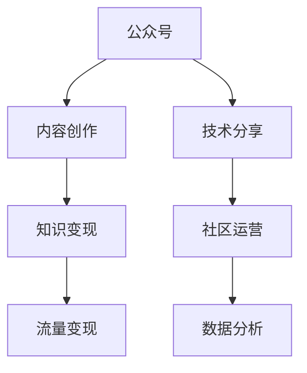

                 

# 程序员如何利用公众号进行知识变现

> 关键词：知识变现, 公众号, 内容创作, 技术分享, 商业化, 社区运营, 数据分析, 流量变现

## 1. 背景介绍

### 1.1 问题由来
随着移动互联网的普及和自媒体时代的到来，知识变现成为越来越多程序员和内容创作者的新路径。传统的书籍、培训课程等知识传播方式正在逐渐被线上内容消费模式取代，而微信公众号作为领先的自媒体平台之一，为知识变现提供了新的机遇。越来越多的程序员利用公众号进行技术分享、经验交流、项目合作，构建起自己的品牌和影响力，并通过公众号实现知识变现。

## 2. 核心概念与联系

### 2.1 核心概念概述

为更好地理解程序员如何利用公众号进行知识变现，本节将介绍几个关键概念：

- **公众号**：微信提供的自媒体平台，拥有庞大的用户基础和丰富的功能，可以实现文章发布、社区互动、付费阅读等功能。
- **知识变现**：通过提供高质量、有价值的内容，获得用户付费阅读、打赏、广告分成等收益，实现知识价值的货币化。
- **内容创作**：高质量、有深度的技术文章、视频、代码等原创内容的生产，是公众号实现知识变现的基础。
- **技术分享**：将个人的编程经验、项目案例、学习心得等内容分享到公众号，与读者进行技术交流，建立社群。
- **商业化**：利用公众号流量和内容影响力，开展付费内容、技术培训、项目合作等商业活动，实现盈利。
- **社区运营**：通过公众号建立和维护一个有粘性、有活跃度的技术社区，吸引更多读者，提升公众号的影响力和变现能力。
- **数据分析**：利用数据工具和分析方法，对公众号运营数据进行统计和分析，优化内容策略，提高流量和转化率。
- **流量变现**：通过公众号的流量优势，开展电商导流、付费推广、合作广告等活动，实现流量变现。

这些核心概念之间的逻辑关系可以通过以下Mermaid流程图来展示：



这个流程图展示了一体化知识变现的完整流程：

1. 通过公众号进行内容创作和技术分享，建立内容品牌。
2. 通过社区运营吸引更多读者，提升公众号的影响力。
3. 利用数据分析优化内容策略，提高流量和转化率。
4. 实现知识变现，如付费阅读、打赏等。
5. 通过流量变现，开展电商导流、付费推广等商业活动。

## 3. 核心算法原理 & 具体操作步骤

### 3.1 算法原理概述

基于微信公众号的知识变现，核心思想是通过高质量的内容吸引用户，建立社群，并利用流量进行变现。这与传统的书籍、培训课程等知识传播方式相比，具有更强的互动性和参与度，因此效果通常更好。

形式化地，假设有一个公众号 $P$，其内容创作者数量为 $n$，关注用户数量为 $N$。知识变现的目标是最大化用户在内容消费上的花费 $V$，即：

$$
\max_{n,N} V = \sum_{i=1}^{n} c_i \cdot p_i(N)
$$

其中 $c_i$ 为内容创作者 $i$ 每篇文章的收费标准，$p_i(N)$ 为内容创作者 $i$ 的流量与读者数量 $N$ 的函数关系，通常与内容质量、互动频率、社群粘性等正相关。

### 3.2 算法步骤详解

基于微信公众号的知识变现一般包括以下几个关键步骤：

**Step 1: 确定公众号定位和内容风格**
- 明确公众号的定位和目标受众，如编程、数据科学、前端开发等。
- 确定内容风格，如技术教程、项目案例、代码分享等。

**Step 2: 设计内容生产流程**
- 设计内容生产流程，包括选题、写作、校对、排版等。
- 建立内容创作团队，分工协作，提高内容产出效率。

**Step 3: 开展技术分享和社群运营**
- 在公众号上定期发布高质量内容，建立技术社区。
- 引入互动机制，如评论区讨论、在线问答、微信群等，提升社群活跃度。

**Step 4: 优化流量和变现策略**
- 利用数据分析工具，如公众号后台分析、第三方流量分析工具等，优化内容策略。
- 根据数据结果调整付费策略，如免费预览、梯度收费等。
- 引入流量变现手段，如广告、电商导流、付费推广等。

**Step 5: 持续迭代和优化**
- 根据读者反馈和数据结果，持续迭代和优化内容。
- 调整商业化策略，寻找更多变现途径，扩大收入来源。

### 3.3 算法优缺点

基于微信公众号的知识变现方法具有以下优点：
1. 互动性强。与读者有直接互动，可以迅速调整内容策略。
2. 平台资源丰富。利用微信平台的流量和广告资源，实现流量变现。
3. 门槛低。只需初步技术基础和内容创作热情，即可轻松运营。
4. 低成本高回报。相比线下培训，运营成本低，变现效率高。

同时，该方法也存在以下局限性：
1. 高度依赖内容质量。内容的深度、实用性和吸引力决定了用户粘性和变现能力。
2. 平台流量限制。微信平台的流量分发策略和规则变化可能影响公众号的曝光和变现能力。
3. 盈利模式单一。目前主要依赖付费阅读、打赏等模式，需要更多探索和创新。
4. 版权风险。未经许可转载他人的内容，可能面临版权纠纷。

尽管存在这些局限性，但就目前而言，基于微信公众号的知识变现方法仍是一种高效、便捷的知识变现手段。未来相关研究的重点在于如何进一步优化流量变现策略，拓展盈利模式，同时兼顾版权保护和内容质量提升等因素。

### 3.4 算法应用领域

基于公众号的知识变现方法，在技术社区、在线教育、技术培训、技术咨询等领域得到了广泛应用：

- **技术社区**：如掘金、CSDN、阮一峰博客等，通过发布高质量技术文章，建立技术社区，实现流量变现。
- **在线教育**：如慕课网、极客时间、网易云课堂等，通过技术课程的付费订阅和推广，实现盈利。
- **技术培训**：如腾讯云学院、阿里云大学、华为云学院等，通过线上线下结合的培训活动，实现变现。
- **技术咨询**：如技术博客、技术专栏作家等，通过提供技术咨询和个性化解决方案，实现变现。

除了上述这些经典应用外，公众号知识变现方法也被创新性地应用到更多场景中，如开源项目、数据报告、技术评测等，为技术行业带来了新的商业机会。

## 4. 数学模型和公式 & 详细讲解 & 举例说明

### 4.1 数学模型构建

本节将使用数学语言对基于微信公众号的知识变现过程进行更加严格的刻画。

假设公众号 $P$ 的内容创作者数量为 $n$，每篇文章的收费标准为 $c_i$，每篇文章的流量为 $f_i$，总读者数量为 $N$，每篇文章的打赏比例为 $p_i$。则总变现收益 $V$ 为：

$$
V = \sum_{i=1}^{n} c_i \cdot f_i \cdot p_i
$$

其中 $p_i$ 为文章打赏比例，通常与文章的互动率和深度正相关。

### 4.2 公式推导过程

以一篇文章的变现收益为例，推导其打赏收益和付费阅读收益的计算公式。

假设一篇文章的付费阅读价格为 $p$，打赏比例为 $p_i$，打赏金额为 $a$，总阅读量为 $r$，阅读量中打赏的人数比例为 $q$，则打赏收益为：

$$
\text{打赏收益} = a \cdot p_i = p \cdot r \cdot q \cdot p_i
$$

其中 $q$ 为阅读量中打赏的人数比例，通常与文章互动率正相关。

若文章提供免费预览，用户需支付 $t$ 元才能完全阅读，则付费阅读收益为：

$$
\text{付费阅读收益} = p \cdot r \cdot (1-q) \cdot t
$$

综合考虑打赏收益和付费阅读收益，一篇文章的变现收益为：

$$
\text{一篇文章的变现收益} = p \cdot r \cdot (1-q) \cdot t + p \cdot r \cdot q \cdot p_i
$$

通过优化上述公式，可以找到最大变现收益的定价策略和互动策略。

### 4.3 案例分析与讲解

以微信公众号「掘金」为例，分析其内容创作、流量变现和社群运营策略：

- **内容创作**：「掘金」聚焦于高质量技术文章，内容创作者包括技术专家、公司高管、产品经理等，他们定期发布技术文章、项目案例和经验分享。
- **流量变现**：「掘金」主要通过付费阅读和打赏变现，文章定价和打赏比例由创作者自主设定。此外，「掘金」还通过电商导流、广告分成等手段进行流量变现。
- **社群运营**：「掘金」通过评论区互动、技术讨论、微信群等方式，建立了一个活跃的技术社区，读者之间互相交流和帮助，提升了公众号的粘性和活跃度。

通过这些策略，「掘金」实现了内容变现和社群运营的双重成功，成为技术社区中的佼佼者。

## 5. 项目实践：代码实例和详细解释说明

### 5.1 开发环境搭建

在进行公众号运营和内容创作时，我们需要准备好开发环境。以下是使用Python进行微信公众号开发的环境配置流程：

1. 安装微信公众平台API开发工具包：从官网下载并安装微信公众平台API开发工具包，用于与微信公众号进行数据交互。
2. 创建微信公众平台开发账号：前往微信公众平台，创建开发账号，获取APPID、AppSecret等配置信息。
3. 配置开发环境：在本地搭建开发环境，包括安装Python、微信公众平台API开发工具包、第三方流量分析工具等。

完成上述步骤后，即可在开发环境中进行微信公众号的开发和运营。

### 5.2 源代码详细实现

下面我们以技术文章分享为例，给出使用Python进行微信公众号内容创作的完整代码实现。

首先，编写内容发布函数：

```python
import requests

def publish_article(article_id, access_token):
    url = 'https://api.weixin.qq.com/cgi-bin/material/add_material'
    params = {
        'type': 2,  # 2为图文消息
        'media_id': article_id,  # 文章在微信公众号后台的媒体ID
        'msgtype': 'news'  # 消息类型，news为图文消息
    }
    headers = {
        'Content-Type': 'application/json',
        'Authorization': f'Bearer {access_token}'
    }
    response = requests.post(url, params=params, headers=headers)
    if response.status_code == 200:
        return response.json()
    else:
        return None
```

然后，编写文章生成函数：

```python
def generate_article(title, content, summary):
    article = {
        'author': '技术创作者',
        'title': title,
        'content': content,
        'summary': summary
    }
    return article
```

最后，编写公众号消息回复函数：

```python
def reply_message(message, access_token):
    url = 'https://api.weixin.qq.com/cgi-bin/message/custom/send'
    params = {
        'touser': message['FromUser'],
        'msgtype': 1,  # 1为文字消息
        'content': '感谢您的提问，我将尽快为您解答'
    }
    headers = {
        'Content-Type': 'application/json',
        'Authorization': f'Bearer {access_token}'
    }
    response = requests.post(url, params=params, headers=headers)
    if response.status_code == 200:
        return response.json()
    else:
        return None
```

以上代码实现了从文章生成、内容发布到消息回复的完整流程。开发者可以将这些函数模块化，封装成库文件，方便重复使用。

### 5.3 代码解读与分析

让我们再详细解读一下关键代码的实现细节：

**publish_article函数**：
- 使用requests库发送POST请求，将文章信息提交到微信公众号后台。
- 使用access_token进行身份验证，确保请求的合法性。
- 根据返回的JSON数据判断请求是否成功。

**generate_article函数**：
- 生成一篇包含标题、内容和摘要的完整文章。
- 文章包含作者信息，读者可以通过作者昵称识别文章来源。

**reply_message函数**：
- 生成一条文字消息回复，告知用户正在处理。
- 使用access_token进行身份验证，确保回复的合法性。
- 根据返回的JSON数据判断请求是否成功。

可以看到，微信公众号的内容发布和消息回复操作，可以通过API接口简单实现，开发者只需关注内容生产和消息处理，无须过多关注底层实现细节。

## 6. 实际应用场景

### 6.1 技术社区

基于公众号的知识变现方法，在技术社区领域得到了广泛应用。技术社区通过发布高质量的技术文章、项目案例和经验分享，吸引了大量技术爱好者，形成了活跃的技术讨论氛围。社区中的技术创作者，通过付费阅读、打赏等方式实现了变现。

**案例**：掘金、CSDN、阮一峰博客等。

### 6.2 在线教育

在线教育平台通过微信公众号提供高质量的技术课程，通过付费订阅和推广实现变现。这些平台通常提供视频课程、技术直播、技术培训等形式，帮助学员掌握编程技能。

**案例**：慕课网、极客时间、网易云课堂等。

### 6.3 技术培训

技术培训平台通过微信公众号提供线上线下结合的培训活动，通过课程报名、技术咨询等实现变现。这些平台通常提供技术培训、项目合作、技术交流等形式，帮助学员提高技术水平。

**案例**：腾讯云学院、阿里云大学、华为云学院等。

### 6.4 技术咨询

技术博客、技术专栏作家等通过微信公众号提供技术咨询和个性化解决方案，通过付费咨询、打赏等方式实现变现。

**案例**：技术博客、技术专栏作家等。

## 7. 工具和资源推荐

### 7.1 学习资源推荐

为了帮助开发者系统掌握基于公众号的知识变现理论基础和实践技巧，这里推荐一些优质的学习资源：

1. 《微信公众号开发实战》系列书籍：深入介绍微信公众号的API开发、内容创作、流量变现等技术细节，是公众号运营的基础。
2. 《微信公众平台开发指南》官方文档：微信公众平台提供的详细开发文档，包含API接口、功能接口等详细说明。
3. 《微信公众号流量变现实战》在线课程：针对微信公众号流量变现的实战课程，帮助开发者学习流量变现的策略和技巧。
4. 《微信公众号数据分析》在线课程：利用数据工具和分析方法，提升公众号的内容策略和运营效果。
5. 《微信公众号运营手册》社区资源：微信公众号运营者的交流社区，分享运营经验和技术技巧，提供丰富的资源和支持。

通过对这些资源的学习实践，相信你一定能够快速掌握基于公众号的知识变现精髓，并用于解决实际的微信公众号运营问题。

### 7.2 开发工具推荐

高效的开发离不开优秀的工具支持。以下是几款用于微信公众号开发和运营的常用工具：

1. 微信公众号后台管理系统：微信公众平台提供的后台管理系统，用于管理公众号的文章、用户、互动等。
2. 第三方流量分析工具：如百度统计、CNZZ等，用于分析公众号的流量来源、用户行为等，优化内容策略。
3. 微信公众号编辑器：如微信公众平台提供的编辑器、腾讯云内容创作平台等，用于文章排版、图片上传等操作。
4. 微信公众号分析工具：如微信公众平台提供的分析工具、第三方分析工具等，用于统计公众号的数据表现。
5. 在线协作平台：如Trello、Jira等，用于内容团队的分工协作，提高内容创作的效率。

合理利用这些工具，可以显著提升微信公众号的运营效率，提高内容创作的产出和变现能力。

### 7.3 相关论文推荐

基于微信公众号的知识变现技术，在学术界和工业界已经得到了广泛的研究和应用。以下是几篇奠基性的相关论文，推荐阅读：

1. "微信公众号流量变现策略研究"（国内期刊）：探讨了微信公众号流量变现的不同策略，如付费阅读、打赏、广告分成等。
2. "微信公众平台API开发实战指南"（技术博客）：详细介绍微信公众号的API接口、功能接口等开发细节，是公众号开发的基础。
3. "基于微信公众号的内容创作与流量变现"（会议论文）：介绍了微信公众号内容创作的流程和策略，以及流量变现的技术细节。
4. "微信公众号数据分析与应用"（学术论文）：利用数据工具和分析方法，探讨了微信公众号的数据分析技术，以及数据驱动的内容策略优化。
5. "微信公众号流量变现的商业化路径"（商业报告）：分析了微信公众号流量变现的不同商业化路径，如电商导流、付费推广等。

这些论文代表了大语言模型微调技术的发展脉络。通过学习这些前沿成果，可以帮助研究者把握学科前进方向，激发更多的创新灵感。

## 8. 总结：未来发展趋势与挑战

### 8.1 总结

本文对基于微信公众号的知识变现方法进行了全面系统的介绍。首先阐述了公众号的运营和变现原理，明确了公众号运营对技术创作者和内容创作者的重要性。其次，从原理到实践，详细讲解了公众号的运营流程和变现策略，给出了公众号运营的完整代码实现。同时，本文还广泛探讨了公众号在技术社区、在线教育、技术培训、技术咨询等领域的实际应用，展示了公众号变现的广阔前景。此外，本文精选了公众号运营的相关学习资源和工具，力求为读者提供全方位的技术指引。

通过本文的系统梳理，可以看到，基于公众号的知识变现方法正在成为技术创作者和内容创作者的重要变现手段，极大地拓展了知识变现的途径和渠道。公众号的流量优势、互动性、低成本等特性，使其成为技术创作者和内容创作者不可多得的变现工具。未来，伴随微信公众平台的不断升级和优化，公众号的内容创作和变现能力将进一步提升，为技术创作者和内容创作者带来更多的商业机会。

### 8.2 未来发展趋势

展望未来，基于公众号的知识变现技术将呈现以下几个发展趋势：

1. **内容形式多样化**：除了传统的文章和视频，将出现更多形式的内容，如音频、播客、直播等。
2. **流量变现模式创新**：除了付费阅读、打赏等传统模式，将出现更多创新的流量变现方式，如AR/VR导流、虚拟商品销售等。
3. **社群运营精准化**：通过数据分析和算法推荐，精准定位用户需求，提升社群运营的效果。
4. **内容创作社区化**：建立创作者社区，共享资源、协作创作，提高内容创作的质量和效率。
5. **流量变现智能化**：利用AI技术进行流量分析和智能推荐，优化变现策略，提升变现效率。
6. **商业化生态化**：构建多层次、多元化的商业生态系统，实现更丰富的商业合作和变现途径。

以上趋势凸显了基于公众号的知识变现技术的广阔前景。这些方向的探索发展，必将进一步提升公众号的流量变现能力，为技术创作者和内容创作者带来更多的商业机会。

### 8.3 面临的挑战

尽管基于微信公众号的知识变现技术已经取得了显著成效，但在迈向更加智能化、普适化应用的过程中，它仍面临着诸多挑战：

1. **内容质量保障**：如何保证公众号内容的深度、实用性和吸引力，成为公众号运营的关键。
2. **流量获取难度**：获取高质量用户和提升公众号曝光，需要更多创意和运营策略。
3. **变现模式单一**：目前主要依赖付费阅读、打赏等模式，需要更多探索和创新。
4. **版权和合规风险**：未经许可转载他人的内容，可能面临版权纠纷和合规问题。
5. **算法推荐准确性**：如何提高算法推荐的准确性，提升用户体验和互动率。

尽管存在这些挑战，但微信公众号运营者和内容创作者可以通过不断优化运营策略、提升内容质量、拓展变现模式等手段，克服这些挑战，实现持续增长。

### 8.4 研究展望

未来，基于微信公众号的知识变现技术还需要在以下几个方面进行深入研究：

1. **内容生产自动化**：开发自动生成内容的工具，提高内容创作的效率和质量。
2. **流量数据分析**：利用深度学习、自然语言处理等技术，对公众号的流量数据进行更深入的分析，优化内容策略和变现策略。
3. **流量智能化**：结合推荐系统、广告系统等技术，实现流量智能推荐和优化。
4. **商业化生态化**：构建更多元、更丰富的商业生态系统，拓展变现途径和合作机会。
5. **用户粘性提升**：通过互动机制、社群运营等方式，提升用户的粘性和活跃度，增强变现能力。

这些研究方向将进一步推动微信公众号的运营和技术变现能力的提升，为技术创作者和内容创作者带来更多的商业机会。相信随着微信公众平台的不断优化和升级，基于微信公众号的知识变现技术将迎来更广阔的发展前景。

## 9. 附录：常见问题与解答

**Q1：如何判断一篇文章是否适合进行付费阅读？**

A: 判断一篇文章是否适合进行付费阅读，可以从以下几个方面考虑：
1. 文章内容的深度和实用性：文章是否提供有价值的知识、经验或解决方案，是否具有较高的参考价值。
2. 文章的互动性和用户反馈：文章是否引发读者的讨论和反馈，是否受到用户的欢迎和认可。
3. 文章的创作成本和收益预期：文章创作成本是否低于预期的变现收益，是否具有商业化的潜力。

**Q2：如何提升公众号的流量和变现能力？**

A: 提升公众号的流量和变现能力，可以从以下几个方面入手：
1. 优化内容策略：根据用户反馈和数据分析结果，优化文章选题、写作风格、互动机制等。
2. 拓展变现途径：除了付费阅读、打赏外，还可以通过电商导流、广告分成、付费推广等方式实现流量变现。
3. 提高用户粘性：通过评论区互动、技术讨论、社群运营等方式，提升用户粘性和活跃度。
4. 引入KOL和专家：邀请行业KOL和专家撰写内容，提升公众号的影响力和变现能力。
5. 定期更新内容：保持内容的持续更新，吸引更多用户关注和参与。

**Q3：如何进行微信公众号的商业化运营？**

A: 进行微信公众号的商业化运营，需要从以下几个方面考虑：
1. 明确商业化方向：根据公众号的定位和内容特点，选择合适的商业化方向，如技术培训、在线教育、技术咨询等。
2. 制定商业化策略：结合公众号的用户需求和变现能力，制定具体的商业化策略，如付费课程、技术培训、项目合作等。
3. 引入第三方平台：与电商平台、广告平台等第三方合作，拓展变现途径和商业机会。
4. 优化流量和变现模型：根据用户行为和变现结果，优化流量和变现模型，提高变现效率和效果。
5. 保持内容创新：不断探索和创新内容形式和变现模式，保持公众号的竞争力和生命力。

以上是微信公众号运营和知识变现的一些常见问题和解答，希望能为公众号运营者和内容创作者提供一些有价值的参考。

---

作者：禅与计算机程序设计艺术 / Zen and the Art of Computer Programming

