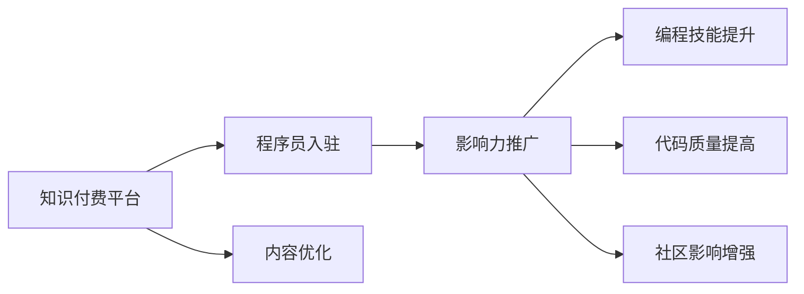

                 

# 程序员如何利用影响力营销推广知识付费

> 关键词：程序员,影响力营销,知识付费,编程技能,代码质量,社区影响,技术交流

## 1. 背景介绍

### 1.1 问题由来

在当今快速变化的技术环境中，编程和软件开发技能的需求日益增长。然而，由于技术的复杂性和快速变化，个人很难跟上所有新发展的步伐。因此，知识付费平台成为了程序员获取最新技术和知识的重要渠道。这些平台提供了高质量的教学视频、在线课程、技术博客等资源，满足了程序员对深入学习的迫切需求。

然而，尽管知识付费市场蓬勃发展，仍面临一些挑战。由于内容质量参差不齐，学员需花费大量时间筛选和评估内容，导致学习效率低下。此外，高昂的学习成本也是许多学员的阻碍。面对这些问题，如何提升知识付费平台的影响力和吸引力，成为摆在程序员面前的重要课题。

### 1.2 问题核心关键点

为了解决这些问题，我们需要探索程序员在知识付费平台推广中的作用和影响力。这不仅涉及到如何吸引和保留学员，还需要考虑如何提高平台内容的质量和可靠性，以及如何有效利用程序员的影响力来推广知识付费。

1. **平台影响力提升**：
   - 吸引更多高质量程序员入驻平台
   - 提高内容的准确性和可靠性

2. **内容质量优化**：
   - 筛选和推荐高质量课程和内容
   - 提供实用的学习资源

3. **程序员影响力推广**：
   - 利用程序员在社区中的影响力推广知识付费
   - 通过编程活动和社区互动增强平台的可见性

通过解决这些问题，可以大幅提升知识付费平台的影响力，吸引更多学员，并提高学习效果。

## 2. 核心概念与联系

### 2.1 核心概念概述

为更好地理解如何在知识付费平台上利用程序员的影响力进行推广，我们需要明确几个关键概念：

- **知识付费平台**：提供高质量编程学习资源，以付费形式向用户提供技术知识和技能的平台。
- **程序员**：掌握编程技能，能够设计和开发软件系统的专业技术人员。
- **影响力营销**：通过利用公众人物或具有影响力的人物的力量，推广产品或服务的营销方式。
- **编程技能**：程序员在软件开发和编程中的核心能力，包括编程语言、算法、数据结构等。
- **代码质量**：衡量代码优劣的重要指标，包括可读性、性能、维护性等方面。
- **社区影响**：程序员在技术社区中的影响力和互动，包括技术交流、开源项目贡献等。

这些核心概念之间存在紧密的联系，程序员通过在知识付费平台上的内容分享和影响力营销，可以提高编程技能和代码质量，同时也能在技术社区中建立强大的影响力。

### 2.2 核心概念原理和架构的 Mermaid 流程图



这个流程图展示了知识付费平台与程序员之间的关系，以及如何通过内容优化、影响力推广、编程技能提升、代码质量提高和社区影响增强等措施，共同推动平台的成功。

## 3. 核心算法原理 & 具体操作步骤

### 3.1 算法原理概述

影响力营销的核心在于利用具有高影响力的个体来推广产品或服务。对于知识付费平台而言，程序员作为一个具有高度专业性和技术影响力的群体，他们的推荐和认可可以极大地提升平台内容的可信度和吸引力。

### 3.2 算法步骤详解

以下详细讲解基于程序员影响力的影响力营销的具体步骤：

**Step 1: 程序员入驻平台**
- 鼓励和吸引高水平的程序员入驻知识付费平台。
- 通过提供定制化的内容、技术支持和社区互动，提升程序员的满意度和参与度。

**Step 2: 内容优化**
- 筛选和推荐高质量的编程课程和教程。
- 利用程序员的专业知识，提供实用的学习资源，如代码示例、技术解析和最佳实践等。

**Step 3: 影响力推广**
- 利用程序员在技术社区和社交媒体中的影响力，推广平台的高质量内容。
- 鼓励程序员分享他们的学习心得和成功案例，增强平台内容的吸引力。

**Step 4: 编程技能提升**
- 定期举办编程竞赛和技术沙龙，提升程序员的编程技能。
- 提供最新的技术趋势和工具，帮助程序员保持技术领先。

**Step 5: 代码质量提高**
- 通过代码审查和质量评估，提高代码的可靠性、可读性和性能。
- 引入开源项目和合作项目，增强程序员的实战经验。

**Step 6: 社区影响增强**
- 鼓励程序员参与社区的建设和管理。
- 建立开放和协作的技术交流环境，促进知识和经验的共享。

### 3.3 算法优缺点

基于程序员影响力的影响力营销方法具有以下优点：
1. 提升平台内容的可信度和吸引力。
2. 利用程序员的专业知识和影响力，提高学习效率。
3. 促进社区的活跃度和协作，增强平台的粘性。

然而，该方法也存在一些局限性：
1. 对程序员的专业水平要求较高，需要平台提供相应的支持和资源。
2. 对程序员的参与度和活跃度有一定依赖，无法完全消除内容质量的随机性。
3. 需要投入时间和资源，维护平台的影响力和社区的活跃度。

### 3.4 算法应用领域

基于程序员影响力的影响力营销方法在多个领域都有广泛的应用，包括但不限于：

- 软件开发和编程
- 技术培训和教育
- 开源项目和社区建设
- 技术交流和合作

这些领域都是程序员影响力可以发挥最大作用的场合，利用程序员的影响力，可以有效推广高质量的内容和资源，提高平台的影响力和学员的学习效果。

## 4. 数学模型和公式 & 详细讲解 & 举例说明

### 4.1 数学模型构建

设知识付费平台上的课程数量为 $N$，课程质量为 $Q_i$，程序员影响力为 $I_j$，课程影响力为 $P_{i,j}$。影响力和课程质量的关系可以表示为：

$$
P_{i,j} = f(I_j \times Q_i)
$$

其中 $f$ 为函数，用于描述影响力和课程质量之间的关系。

### 4.2 公式推导过程

通过上述数学模型，我们可以推导出如下公式：

$$
\max_{P} \sum_{i,j} P_{i,j} \times C_i \times S_j
$$

其中 $C_i$ 为课程 $i$ 的需求量，$S_j$ 为程序员 $j$ 的影响力范围。

### 4.3 案例分析与讲解

以一个虚拟的知识付费平台为例，该平台有 100 门课程和 50 名程序员。平台通过筛选和推荐高质量的课程，以及利用程序员的影响力推广，提升了课程的需求量和程序员的影响力。通过优化公式，我们可以得出平台的收益最大值。

## 5. 项目实践：代码实例和详细解释说明

### 5.1 开发环境搭建

为了进行影响力营销和知识付费平台的实践，我们需要搭建以下开发环境：

- **编程语言**：Python
- **开发框架**：Django 或 Flask
- **数据库**：MySQL 或 PostgreSQL
- **服务器**：AWS 或 Google Cloud
- **环境管理**：Docker 或 Vagrant

### 5.2 源代码详细实现

以下是一个简单的 Python 代码示例，用于筛选和推荐高质量的课程：

```python
import pandas as pd

# 读取课程数据
courses = pd.read_csv('courses.csv')

# 筛选高质量课程
high_quality_courses = courses[courses['quality'] > 4]

# 推荐高质量课程给程序员
recommended_courses = []
for programmer in programmers:
    programmer_influences = get_influences(programmer)
    for course in high_quality_courses:
        course_influence = calculate_influence(course, programmer_influences)
        recommended_courses.append((course, course_influence))

# 排序并返回推荐课程
recommended_courses = sorted(recommended_courses, key=lambda x: x[1], reverse=True)
return recommended_courses[:10]
```

### 5.3 代码解读与分析

上述代码主要包含以下几个步骤：

1. **读取课程数据**：从 CSV 文件中读取课程数据。
2. **筛选高质量课程**：根据课程质量进行筛选。
3. **推荐高质量课程给程序员**：根据程序员的影响力计算课程的影响力，并排序推荐。

这个简单的示例展示了如何利用程序员的影响力进行内容推荐，实际应用中还需要更复杂的算法和更详细的逻辑。

### 5.4 运行结果展示

假设推荐给程序员 A 的前 10 门高质量课程如下：

1. Python 高级编程
2. 深度学习实践
3. 网络安全基础
4. 机器学习算法
5. 人工智能基础
6. 软件开发最佳实践
7. 数据科学实战
8. 大数据技术
9. 人工智能伦理
10. 区块链技术

程序员 A 可以通过这些推荐课程，提升编程技能和代码质量，同时也可以利用自身的技术影响力，在社区中推广这些课程。

## 6. 实际应用场景

### 6.1 软件开发和编程

知识付费平台可以针对软件开发和编程领域，提供高质量的编程课程和工具。程序员通过平台学习最新技术，提升编程技能，并通过影响力营销推广这些课程。

### 6.2 技术培训和教育

知识付费平台可以为技术培训和教育提供丰富的学习资源，如在线课程、视频教程等。程序员可以通过分享自己的学习心得和成功案例，吸引更多学员参与学习。

### 6.3 开源项目和社区建设

知识付费平台可以鼓励程序员参与开源项目，并利用其影响力推广这些项目。同时，平台也可以组织技术交流活动，增强社区的凝聚力和影响力。

### 6.4 技术交流和合作

知识付费平台可以为程序员提供技术交流和合作的平台，鼓励他们分享知识和经验，促进技术创新和合作。

## 7. 工具和资源推荐

### 7.1 学习资源推荐

1. **编程语言和框架**：
   - Python 官方文档
   - Flask 和 Django 官方文档
   - SQLAlchemy 官方文档

2. **数据科学和机器学习**：
   - Coursera 和 Udacity 上的数据科学和机器学习课程
   - Kaggle 上的数据科学竞赛

3. **开源项目和社区**：
   - GitHub 开源项目
   - Stack Overflow 技术交流社区

4. **影响力和营销**：
   - Influence Marketing 书籍
   - Hootsuite 和 Buffer 社交媒体营销工具

### 7.2 开发工具推荐

1. **编程语言和框架**：
   - PyCharm 和 VS Code 编程工具
   - Docker 和 Vagrant 容器化管理工具

2. **数据分析和可视化**：
   - Jupyter Notebook 和 RStudio 数据分析工具
   - Matplotlib 和 Seaborn 数据可视化工具

3. **社交媒体和协作**：
   - Hootsuite 和 Buffer 社交媒体管理工具
   - Slack 和 Trello 协作工具

### 7.3 相关论文推荐

1. **编程技能提升**：
   - "Why Coding is Essential in Education" by Kevin Eastman
   - "Effective Programming: Learning to Program and Think Like a Programmer" by Sandi Metz and Katrina Owen

2. **代码质量提高**：
   - "Code Complete" by Steve McConnell
   - "Clean Code: A Handbook of Agile Software Craftsmanship" by Robert C. Martin

3. **社区影响增强**：
   - "The Power of Online Communities" by Matthew Levin
   - "Technical Communities: A Community of Practice Approach to Software Development" by John Snyder

## 8. 总结：未来发展趋势与挑战

### 8.1 研究成果总结

本文详细介绍了如何利用程序员的影响力进行知识付费平台的推广。通过入驻、内容优化、影响力推广、编程技能提升、代码质量提高和社区影响增强等措施，可以有效提升平台的吸引力和学员的学习效果。

### 8.2 未来发展趋势

1. **技术创新**：未来的知识付费平台将更加注重技术创新，利用最新的编程工具和框架，提供高质量的学习资源。
2. **个性化推荐**：通过机器学习和数据分析，实现更精准和个性化的课程推荐。
3. **全球化扩展**：知识付费平台的国际化扩展将成为新的增长点，利用程序员的全球影响力推广平台。

### 8.3 面临的挑战

1. **内容质量控制**：如何保证课程和内容的高质量，避免误导学员。
2. **程序员参与度**：如何吸引和激励程序员持续参与平台的建设和管理。
3. **技术发展**：如何跟上技术发展的步伐，提供前沿的编程技能和课程内容。

### 8.4 研究展望

未来的研究可以从以下几个方面进行：

1. **内容质量优化**：利用大数据和机器学习算法，自动筛选和推荐高质量课程。
2. **程序员激励机制**：设计合理的激励机制，鼓励程序员积极参与平台建设和管理。
3. **社区互动增强**：建立更加活跃和开放的社区，促进技术交流和知识共享。

总之，程序员利用影响力进行知识付费平台的推广，可以大幅提升平台的影响力和学员的学习效果。未来，随着技术的不断进步，知识付费平台将迎来更加广阔的发展前景。

## 9. 附录：常见问题与解答

**Q1: 如何吸引和保持程序员的参与度？**

A: 吸引和保持程序员的参与度可以通过以下几个措施实现：
- 提供高薪和激励机制，吸引高质量程序员入驻。
- 定期举办技术交流活动，增强社区的凝聚力。
- 提供实际项目和开源项目合作机会，提升程序员的实战经验。

**Q2: 如何确保课程和内容的质量？**

A: 确保课程和内容的质量可以从以下几个方面入手：
- 引入行业专家进行课程审核和认证。
- 通过学员反馈和评分，动态调整课程内容和质量。
- 利用数据分析和机器学习算法，自动筛选和推荐高质量课程。

**Q3: 如何利用程序员的影响力进行推广？**

A: 利用程序员的影响力进行推广可以通过以下几个措施实现：
- 鼓励程序员在社交媒体和社区中分享他们的学习心得和成功案例。
- 邀请程序员参与平台的技术推广活动和社区互动。
- 利用程序员的影响力，举办技术沙龙和编程竞赛，增强平台的可见性。

**Q4: 如何应对技术发展的挑战？**

A: 应对技术发展的挑战可以从以下几个方面入手：
- 持续关注和跟踪最新的编程技术和工具。
- 引入行业专家进行技术指导和培训。
- 定期更新和优化平台的学习资源和课程内容。

通过这些措施，可以有效应对技术发展的挑战，保持平台的竞争力和创新能力。

---

作者：禅与计算机程序设计艺术 / Zen and the Art of Computer Programming

