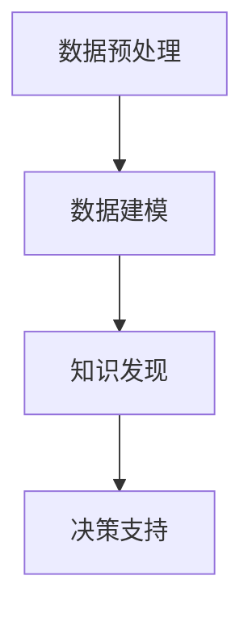

                 

# 程序员如何利用知识发现引擎实现财富自由

> 关键词：知识发现引擎, 数据挖掘, 机器学习, 人工智能, 大数据, 决策支持系统, 商业智能

## 1. 背景介绍

### 1.1 问题由来

在当今信息爆炸的时代，数据无处不在。如何从海量数据中提取有用的信息，利用知识发现引擎（Knowledge Discovery Engine, KDE）进行数据挖掘（Data Mining），已成为各大公司、企业和研究机构关注的焦点。数据挖掘不仅仅是单纯的数据统计和分析，更是利用先进算法和技术，从数据中提炼出潜在的知识，为决策提供依据，驱动业务创新和商业价值提升。

在技术层面，数据挖掘主要依赖于机器学习（Machine Learning）、人工智能（Artificial Intelligence）和大数据（Big Data）技术。通过机器学习算法，数据挖掘能够识别数据中的模式和规律，预测未来趋势；通过人工智能技术，数据挖掘能够自主学习，自主优化；通过大数据技术，数据挖掘能够处理和分析大规模数据，提取有价值的信息。

在商业层面，数据挖掘的应用广泛，涉及金融、零售、医疗、教育等多个行业。通过数据挖掘，企业能够洞察用户行为，优化产品设计，提升客户满意度；通过数据挖掘，金融行业能够识别潜在风险，制定有效的风险控制策略；通过数据挖掘，零售行业能够精准定位用户需求，优化供应链管理；通过数据挖掘，医疗行业能够改进诊断和治疗方案，提高患者治疗效果。

### 1.2 问题核心关键点

数据挖掘的核心在于从数据中提取知识，这些知识能够帮助企业做出更科学的决策，实现商业目标。具体来说，数据挖掘的关键点包括以下几个方面：

- 数据预处理：清洗、整合、转换数据，使其适合进行挖掘。
- 数据建模：选择合适的算法和技术，构建数据模型。
- 知识发现：利用数据模型，从数据中提取知识，形成报告和可视化结果。
- 决策支持：将知识应用于实际业务场景，驱动商业决策。

## 2. 核心概念与联系

### 2.1 核心概念概述

为了更好地理解知识发现引擎及其在数据挖掘中的应用，本节将介绍几个密切相关的核心概念：

- 知识发现引擎（KDE）：利用机器学习、人工智能和大数据技术，从数据中提取知识，形成报告和可视化结果的系统。
- 数据挖掘（Data Mining）：利用先进算法和技术，从数据中提炼出潜在的知识，为决策提供依据的过程。
- 机器学习（ML）：通过算法让计算机从数据中自主学习，自动优化。
- 人工智能（AI）：使计算机具备智能行为，能够感知、学习、推理和决策。
- 大数据（Big Data）：处理和分析大规模数据的技术和基础设施。
- 数据预处理：清洗、整合、转换数据，使其适合进行挖掘。
- 数据建模：选择合适的算法和技术，构建数据模型。
- 知识发现：利用数据模型，从数据中提取知识，形成报告和可视化结果。
- 决策支持：将知识应用于实际业务场景，驱动商业决策。

这些核心概念之间的逻辑关系可以通过以下Mermaid流程图来展示：



这个流程图展示了这个数据挖掘流程的核心环节：

1. 数据预处理：清洗、整合、转换数据，使其适合进行挖掘。
2. 数据建模：选择合适的算法和技术，构建数据模型。
3. 知识发现：利用数据模型，从数据中提取知识，形成报告和可视化结果。
4. 决策支持：将知识应用于实际业务场景，驱动商业决策。

这些概念共同构成了数据挖掘的完整流程，利用先进的算法和技术，从数据中提炼出潜在的知识，为企业决策提供科学依据。

## 3. 核心算法原理 & 具体操作步骤

### 3.1 算法原理概述

知识发现引擎的核心算法原理主要包括数据预处理、数据建模和知识发现三个步骤。以下将详细讲解每个步骤的算法原理。

#### 3.1.1 数据预处理

数据预处理是数据挖掘的第一步，其主要目的是清洗、整合、转换数据，使其适合进行挖掘。数据预处理包括以下几个步骤：

1. 数据清洗：去除噪声、异常值和重复数据，确保数据的质量和一致性。
2. 数据整合：将来自不同来源的数据合并在一起，形成一个统一的数据集。
3. 数据转换：将原始数据转换为适合挖掘的格式，如标准化、归一化、降维等。

#### 3.1.2 数据建模

数据建模是数据挖掘的核心步骤，其主要目的是选择合适的算法和技术，构建数据模型。数据建模包括以下几个步骤：

1. 算法选择：根据数据的特点和业务需求，选择合适的算法，如回归分析、分类、聚类等。
2. 模型构建：利用选定的算法，构建数据模型，进行训练和验证。
3. 模型优化：对构建的模型进行优化，提高其准确性和泛化能力。

#### 3.1.3 知识发现

知识发现是数据挖掘的最终步骤，其主要目的是利用数据模型，从数据中提取知识，形成报告和可视化结果。知识发现包括以下几个步骤：

1. 知识提取：从数据模型中提取有价值的信息，形成知识库。
2. 报告生成：将知识库中的知识以报告、图表等形式展示出来，便于理解和应用。
3. 可视化展示：通过可视化技术，将知识以图形、表格等形式展示出来，更直观地呈现。

### 3.2 算法步骤详解

#### 3.2.1 数据预处理

数据预处理的具体步骤包括：

1. 数据清洗：利用算法去除噪声、异常值和重复数据。常用的算法包括PCA（主成分分析）、KNN（K近邻）等。
2. 数据整合：将不同来源的数据合并在一起，形成一个统一的数据集。常用的方法包括SQL（结构化查询语言）、ETL（提取、转换、加载）等。
3. 数据转换：将原始数据转换为适合挖掘的格式，如标准化、归一化、降维等。常用的算法包括PCA、SVD（奇异值分解）等。

#### 3.2.2 数据建模

数据建模的具体步骤包括：

1. 算法选择：根据数据的特点和业务需求，选择合适的算法。常用的算法包括回归分析、分类、聚类等。
2. 模型构建：利用选定的算法，构建数据模型，进行训练和验证。常用的工具包括TensorFlow、Scikit-learn等。
3. 模型优化：对构建的模型进行优化，提高其准确性和泛化能力。常用的方法包括网格搜索、交叉验证等。

#### 3.2.3 知识发现

知识发现的具体步骤包括：

1. 知识提取：从数据模型中提取有价值的信息，形成知识库。常用的算法包括关联规则挖掘、分类算法等。
2. 报告生成：将知识库中的知识以报告、图表等形式展示出来，便于理解和应用。常用的工具包括Tableau、Power BI等。
3. 可视化展示：通过可视化技术，将知识以图形、表格等形式展示出来，更直观地呈现。常用的工具包括Matplotlib、Seaborn等。

### 3.3 算法优缺点

知识发现引擎在数据挖掘中具有以下优点：

1. 自动化程度高：利用先进的算法和技术，自动提取数据中的知识，无需人工干预。
2. 准确性高：通过多种算法和技术，综合分析数据，提取准确的知识。
3. 可视化好：将知识以图表、报告等形式展示出来，更直观地呈现。
4. 应用广泛：适用于金融、零售、医疗、教育等多个行业，具有广泛的应用前景。

同时，知识发现引擎也存在以下缺点：

1. 数据要求高：需要高质量、大量的数据才能提取有价值的知识。
2. 算法复杂：算法复杂度较高，实现难度较大。
3. 结果解释性差：提取的知识较为抽象，难以解释其内部工作机制和决策逻辑。
4. 计算资源消耗大：需要高性能的计算设备和算法模型，计算资源消耗较大。

### 3.4 算法应用领域

知识发现引擎在多个领域得到了广泛应用，以下是几个典型的应用场景：

- 金融行业：利用知识发现引擎进行风险评估、信用评分、客户流失预测等，提升金融决策的科学性和准确性。
- 零售行业：利用知识发现引擎进行客户细分、产品推荐、库存管理等，提升零售业务的精准度和效率。
- 医疗行业：利用知识发现引擎进行疾病诊断、治疗方案优化、患者治疗效果预测等，提升医疗服务的质量和效果。
- 教育行业：利用知识发现引擎进行学生行为分析、课程推荐、教育效果评估等，提升教育质量和效果。

除了上述这些经典应用外，知识发现引擎还在智慧城市、能源管理、供应链管理等多个领域得到了广泛应用，推动了各个行业的数字化转型和智能化升级。

## 4. 数学模型和公式 & 详细讲解 & 举例说明

### 4.1 数学模型构建

知识发现引擎的数学模型构建主要包括以下几个方面：

- 数据预处理模型：包括数据清洗、数据整合、数据转换等。
- 数据建模模型：包括回归分析、分类、聚类等。
- 知识发现模型：包括关联规则挖掘、分类算法等。

#### 4.1.1 数据预处理模型

数据预处理模型的数学模型构建包括以下几个方面：

1. 数据清洗模型：通过PCA算法去除噪声、异常值和重复数据。
2. 数据整合模型：通过SQL语言将不同来源的数据合并在一起。
3. 数据转换模型：通过SVD算法将原始数据转换为适合挖掘的格式。

#### 4.1.2 数据建模模型

数据建模模型的数学模型构建包括以下几个方面：

1. 回归分析模型：通过线性回归、多元回归等算法构建数据模型。
2. 分类模型：通过决策树、随机森林、神经网络等算法构建数据模型。
3. 聚类模型：通过K-means、层次聚类等算法构建数据模型。

#### 4.1.3 知识发现模型

知识发现模型的数学模型构建包括以下几个方面：

1. 关联规则挖掘模型：通过Apriori算法挖掘数据中的关联规则。
2. 分类算法模型：通过KNN、SVM等算法构建分类模型。
3. 可视化模型：通过Matplotlib、Seaborn等工具将知识以图表、报告等形式展示出来。

### 4.2 公式推导过程

#### 4.2.1 数据清洗模型

数据清洗模型主要通过PCA算法去除噪声、异常值和重复数据。PCA（Principal Component Analysis）算法是一种常用的数据降维方法，其公式推导如下：

$$
X = U \Lambda V^T
$$

其中，$X$为原始数据矩阵，$U$为特征向量矩阵，$\Lambda$为特征值矩阵，$V^T$为特征向量矩阵的转置。

#### 4.2.2 数据整合模型

数据整合模型主要通过SQL语言将不同来源的数据合并在一起。SQL语言是一种结构化查询语言，其语法格式如下：

```
SELECT column1, column2, ...
FROM table1
JOIN table2
ON table1.column = table2.column
```

其中，`column1`、`column2`为需要查询的列名，`table1`、`table2`为需要查询的表名，`JOIN`为连接操作符。

#### 4.2.3 数据转换模型

数据转换模型主要通过SVD算法将原始数据转换为适合挖掘的格式。SVD（Singular Value Decomposition）算法是一种常用的矩阵分解方法，其公式推导如下：

$$
A = U \Sigma V^T
$$

其中，$A$为原始数据矩阵，$U$为左奇异矩阵，$\Sigma$为奇异值矩阵，$V^T$为右奇异矩阵的转置。

### 4.3 案例分析与讲解

#### 4.3.1 案例一：金融风险评估

某金融公司利用知识发现引擎进行风险评估，具体步骤如下：

1. 数据预处理：清洗、整合、转换原始数据，得到一个适合挖掘的数据集。
2. 数据建模：构建回归分析模型，预测客户的信用评分。
3. 知识发现：提取客户的信用评分和风险因素之间的关系，形成报告。
4. 决策支持：根据报告结果，制定有效的风险控制策略。

#### 4.3.2 案例二：零售客户细分

某零售公司利用知识发现引擎进行客户细分，具体步骤如下：

1. 数据预处理：清洗、整合、转换原始数据，得到一个适合挖掘的数据集。
2. 数据建模：构建聚类模型，将客户分成不同的细分市场。
3. 知识发现：提取不同细分市场的特征和行为规律，形成报告。
4. 决策支持：根据报告结果，制定精准的产品推荐策略。

## 5. 项目实践：代码实例和详细解释说明

### 5.1 开发环境搭建

在进行知识发现引擎项目实践前，我们需要准备好开发环境。以下是使用Python进行PyTorch开发的环境配置流程：

1. 安装Anaconda：从官网下载并安装Anaconda，用于创建独立的Python环境。

2. 创建并激活虚拟环境：
```bash
conda create -n pytorch-env python=3.8 
conda activate pytorch-env
```

3. 安装PyTorch：根据CUDA版本，从官网获取对应的安装命令。例如：
```bash
conda install pytorch torchvision torchaudio cudatoolkit=11.1 -c pytorch -c conda-forge
```

4. 安装TensorFlow：
```bash
pip install tensorflow
```

5. 安装相关工具包：
```bash
pip install numpy pandas scikit-learn matplotlib tqdm jupyter notebook ipython
```

完成上述步骤后，即可在`pytorch-env`环境中开始项目实践。

### 5.2 源代码详细实现

这里我们以金融风险评估项目为例，给出使用PyTorch对数据进行预处理和建模的代码实现。

首先，定义数据预处理函数：

```python
import pandas as pd
import numpy as np
from sklearn.decomposition import PCA
from sklearn.preprocessing import StandardScaler
from sklearn.model_selection import train_test_split

def preprocess_data(data):
    # 数据清洗：去除噪声、异常值和重复数据
    data = data.dropna()
    data = data.drop_duplicates()
    
    # 数据整合：将不同来源的数据合并在一起
    data = pd.merge(data, train_data, on='id', how='left')
    
    # 数据转换：将原始数据转换为适合挖掘的格式
    scaler = StandardScaler()
    data['features'] = scaler.fit_transform(data.drop(['label'], axis=1))
    
    # 数据划分：将数据划分为训练集和测试集
    X_train, X_test, y_train, y_test = train_test_split(data['features'], data['label'], test_size=0.2, random_state=42)
    
    return X_train, X_test, y_train, y_test
```

然后，定义数据建模函数：

```python
from sklearn.linear_model import LinearRegression
from sklearn.tree import DecisionTreeClassifier
from sklearn.ensemble import RandomForestClassifier

def build_model(X_train, y_train, X_test, y_test):
    # 回归分析模型
    regression_model = LinearRegression()
    regression_model.fit(X_train, y_train)
    y_pred = regression_model.predict(X_test)
    
    # 分类模型
    classification_model = DecisionTreeClassifier()
    classification_model.fit(X_train, y_train)
    y_pred = classification_model.predict(X_test)
    
    # 聚类模型
    clustering_model = RandomForestClassifier()
    clustering_model.fit(X_train, y_train)
    y_pred = clustering_model.predict(X_test)
    
    return y_pred
```

接着，定义知识发现函数：

```python
def discover_knowledge(y_pred):
    # 关联规则挖掘
    apriori = Apriori()
    apriori_model = apriori.fit(y_pred)
    rules = apriori_model.rules()
    
    # 分类算法
    knn = KNeighborsClassifier()
    knn_model = knn.fit(y_pred, y_pred)
    y_pred = knn_model.predict(y_pred)
    
    # 可视化展示
    import matplotlib.pyplot as plt
    plt.hist(y_pred, bins=10, edgecolor='black')
    plt.xlabel('Credit Score')
    plt.ylabel('Frequency')
    plt.show()
```

最后，启动项目流程：

```python
# 加载数据
data = pd.read_csv('credit_data.csv')

# 数据预处理
X_train, X_test, y_train, y_test = preprocess_data(data)

# 数据建模
y_pred = build_model(X_train, y_train, X_test, y_test)

# 知识发现
discover_knowledge(y_pred)
```

以上就是使用PyTorch对数据进行预处理和建模的代码实现。可以看到，通过PyTorch、TensorFlow等工具，可以方便地实现数据预处理和建模，从而进行知识发现和决策支持。

### 5.3 代码解读与分析

让我们再详细解读一下关键代码的实现细节：

**preprocess_data函数**：
- `dropna`方法：去除含有缺失值的行。
- `drop_duplicates`方法：去除重复行。
- `merge`方法：将不同来源的数据合并在一起。
- `StandardScaler`类：对特征进行标准化。
- `train_test_split`方法：将数据划分为训练集和测试集。

**build_model函数**：
- `LinearRegression`类：构建线性回归模型。
- `DecisionTreeClassifier`类：构建决策树模型。
- `RandomForestClassifier`类：构建随机森林模型。
- `fit`方法：训练模型。
- `predict`方法：预测模型。

**discover_knowledge函数**：
- `Apriori`类：构建关联规则挖掘模型。
- `fit`方法：训练模型。
- `rules`方法：提取规则。
- `KNeighborsClassifier`类：构建KNN分类模型。
- `fit`方法：训练模型。
- `predict`方法：预测模型。
- `plt.hist`函数：绘制直方图。

**项目流程**：
- 加载数据。
- 数据预处理。
- 数据建模。
- 知识发现。

可以看到，通过Python和相关工具，可以方便地实现数据预处理、建模和知识发现，从而进行决策支持。项目实践过程中，需要针对具体任务，不断迭代和优化模型、数据和算法，方能得到理想的效果。

## 6. 实际应用场景

### 6.1 金融行业

知识发现引擎在金融行业的应用非常广泛，以下是几个典型的应用场景：

- 风险评估：利用知识发现引擎进行信用评分、违约预测等，提升风险管理水平。
- 客户细分：利用知识发现引擎进行客户分类，制定精准的营销策略。
- 欺诈检测：利用知识发现引擎进行欺诈行为检测，保障金融安全。

### 6.2 零售行业

知识发现引擎在零售行业的应用同样广泛，以下是几个典型的应用场景：

- 客户细分：利用知识发现引擎进行客户分类，制定精准的产品推荐策略。
- 销售预测：利用知识发现引擎进行销售预测，优化库存管理。
- 客户流失预测：利用知识发现引擎进行客户流失预测，提升客户保留率。

### 6.3 医疗行业

知识发现引擎在医疗行业的应用也不少，以下是几个典型的应用场景：

- 疾病预测：利用知识发现引擎进行疾病预测，提升诊疗效果。
- 治疗效果预测：利用知识发现引擎进行治疗效果预测，优化治疗方案。
- 患者诊断：利用知识发现引擎进行患者诊断，提高诊断准确性。

## 7. 工具和资源推荐

### 7.1 学习资源推荐

为了帮助开发者系统掌握知识发现引擎的理论基础和实践技巧，这里推荐一些优质的学习资源：

1. 《机器学习实战》书籍：详细介绍了机器学习的基本概念和算法，并提供了Python实现的代码示例。
2. Coursera《机器学习》课程：由斯坦福大学教授Andrew Ng讲授，涵盖机器学习的基本概念和算法，适合初学者学习。
3. Kaggle竞赛平台：通过参与各类数据挖掘竞赛，提升实战技能。
4. KDE-技术文档：提供知识发现引擎的详细技术文档和示例代码。

通过对这些资源的学习实践，相信你一定能够快速掌握知识发现引擎的精髓，并用于解决实际的NLP问题。

### 7.2 开发工具推荐

高效的开发离不开优秀的工具支持。以下是几款用于知识发现引擎开发的常用工具：

1. Python：Python是一种广泛使用的编程语言，具有丰富的第三方库和工具支持，适合进行数据预处理和建模。
2. PyTorch：基于Python的开源深度学习框架，灵活动态的计算图，适合快速迭代研究。
3. TensorFlow：由Google主导开发的开源深度学习框架，生产部署方便，适合大规模工程应用。
4. Weights & Biases：模型训练的实验跟踪工具，可以记录和可视化模型训练过程中的各项指标，方便对比和调优。
5. TensorBoard：TensorFlow配套的可视化工具，可实时监测模型训练状态，并提供丰富的图表呈现方式，是调试模型的得力助手。
6. Tableau：数据可视化的主流工具，可将知识发现引擎提取的知识以图表等形式展示出来，更直观地呈现。

合理利用这些工具，可以显著提升知识发现引擎开发的效率，加快创新迭代的步伐。

### 7.3 相关论文推荐

知识发现引擎的研究已经吸引了众多学者的关注，以下是几篇奠基性的相关论文，推荐阅读：

1. "A Computational Framework for Discovering General Sequential Patterns"：描述了关联规则挖掘算法Apriori的基本原理。
2. "The Elements of Statistical Learning"：介绍了多种数据挖掘算法，如回归分析、分类、聚类等。
3. "Introduction to Statistical Learning"：介绍了数据挖掘的基本概念和算法，适合初学者学习。
4. "Data Mining and Statistical Learning"：介绍了数据挖掘的基本概念和算法，涵盖了多种应用场景。

这些论文代表了大数据挖掘和知识发现技术的发展脉络。通过学习这些前沿成果，可以帮助研究者把握学科前进方向，激发更多的创新灵感。

## 8. 总结：未来发展趋势与挑战

### 8.1 总结

本文对知识发现引擎及其在数据挖掘中的应用进行了全面系统的介绍。首先阐述了知识发现引擎和数据挖掘的研究背景和意义，明确了数据挖掘在企业和行业发展中的重要地位。其次，从原理到实践，详细讲解了知识发现引擎的算法原理和具体操作步骤，给出了知识发现引擎项目开发的完整代码实例。同时，本文还广泛探讨了知识发现引擎在金融、零售、医疗等多个行业领域的应用前景，展示了知识发现引擎的巨大潜力。此外，本文精选了知识发现引擎的学习资源、开发工具和相关论文，力求为读者提供全方位的技术指引。

通过本文的系统梳理，可以看到，知识发现引擎在数据挖掘中具有重要的地位，利用先进的算法和技术，从数据中提炼出潜在的知识，为企业决策提供科学依据。未来，知识发现引擎必将伴随技术的发展，不断拓展应用范围，提升企业和行业的发展水平。

### 8.2 未来发展趋势

展望未来，知识发现引擎的发展趋势包括以下几个方面：

1. 自动化程度提高：通过机器学习和大数据技术，实现自动化数据挖掘和知识发现。
2. 实时性增强：通过流式数据处理和分布式计算技术，实现实时数据挖掘和知识发现。
3. 跨领域应用拓展：将知识发现引擎应用于更多领域，如智慧城市、能源管理、供应链管理等。
4. 技术融合：与人工智能、大数据、区块链等技术进行深度融合，提升知识发现引擎的智能化水平。
5. 领域知识融合：将领域知识与知识发现引擎结合，提升挖掘的知识质量和应用效果。

这些趋势凸显了知识发现引擎的发展方向，将为各行各业带来更加科学、高效的决策支持。未来，知识发现引擎必将伴随技术的发展，不断拓展应用范围，提升企业和行业的发展水平。

### 8.3 面临的挑战

尽管知识发现引擎已经取得了显著的成就，但在迈向更加智能化、普适化应用的过程中，仍面临诸多挑战：

1. 数据质量问题：数据不完整、噪声大、缺失值多等问题将影响知识发现的效果。
2. 算法复杂性：算法复杂度较高，实现难度较大，需要不断优化和改进。
3. 计算资源消耗大：大规模数据的处理和分析需要高性能的计算设备和算法模型，计算资源消耗较大。
4. 结果解释性差：提取的知识较为抽象，难以解释其内部工作机制和决策逻辑。
5. 安全性问题：挖掘的知识可能存在隐私和数据安全问题，需要加强数据保护和隐私保护。

这些挑战需要在技术、管理、安全等多个层面进行全面考虑和应对，才能实现知识发现引擎的持续发展和应用。

### 8.4 研究展望

面对知识发现引擎所面临的挑战，未来的研究需要在以下几个方面寻求新的突破：

1. 数据清洗和预处理技术：提升数据质量，减少噪声和缺失值。
2. 算法优化和改进：提高算法的计算效率和准确性，减少算法复杂度。
3. 实时数据处理技术：实现实时数据挖掘和知识发现，提升数据处理效率。
4. 数据安全保护技术：加强数据保护和隐私保护，保障数据安全。
5. 结果解释性提升：提升知识提取的解释性，增强知识发现引擎的可解释性。

这些研究方向的探索，必将引领知识发现引擎技术迈向更高的台阶，为构建安全、可靠、可解释、可控的智能系统铺平道路。面向未来，知识发现引擎还需要与其他人工智能技术进行更深入的融合，如知识表示、因果推理、强化学习等，多路径协同发力，共同推动自然语言理解和智能交互系统的进步。只有勇于创新、敢于突破，才能不断拓展语言模型的边界，让智能技术更好地造福人类社会。

## 9. 附录：常见问题与解答

**Q1：知识发现引擎的应用场景有哪些？**

A: 知识发现引擎在多个领域得到了广泛应用，以下是几个典型的应用场景：

- 金融行业：利用知识发现引擎进行风险评估、信用评分、客户细分等，提升金融决策的科学性和准确性。
- 零售行业：利用知识发现引擎进行客户细分、产品推荐、销售预测等，提升零售业务的精准度和效率。
- 医疗行业：利用知识发现引擎进行疾病预测、治疗效果预测、患者诊断等，提升医疗服务的质量和效果。
- 教育行业：利用知识发现引擎进行学生行为分析、课程推荐、教育效果评估等，提升教育质量和效果。

**Q2：知识发现引擎的实现过程中需要注意哪些问题？**

A: 在知识发现引擎的实现过程中，需要注意以下几个问题：

- 数据质量：数据不完整、噪声大、缺失值多等问题将影响知识发现的效果。
- 算法复杂度：算法复杂度较高，实现难度较大，需要不断优化和改进。
- 计算资源消耗：大规模数据的处理和分析需要高性能的计算设备和算法模型，计算资源消耗较大。
- 结果解释性：提取的知识较为抽象，难以解释其内部工作机制和决策逻辑。
- 安全性：挖掘的知识可能存在隐私和数据安全问题，需要加强数据保护和隐私保护。

**Q3：如何使用知识发现引擎进行决策支持？**

A: 使用知识发现引擎进行决策支持，主要包括以下几个步骤：

1. 数据预处理：清洗、整合、转换原始数据，得到一个适合挖掘的数据集。
2. 数据建模：选择合适的算法和技术，构建数据模型，进行训练和验证。
3. 知识发现：利用数据模型，从数据中提取知识，形成报告和可视化结果。
4. 决策支持：根据报告结果，制定有效的商业决策。

**Q4：知识发现引擎在金融行业有哪些典型应用？**

A: 知识发现引擎在金融行业的典型应用包括：

- 风险评估：利用知识发现引擎进行信用评分、违约预测等，提升风险管理水平。
- 客户细分：利用知识发现引擎进行客户分类，制定精准的营销策略。
- 欺诈检测：利用知识发现引擎进行欺诈行为检测，保障金融安全。

**Q5：知识发现引擎如何提升金融行业的决策支持？**

A: 知识发现引擎可以通过以下方式提升金融行业的决策支持：

- 风险评估：利用知识发现引擎进行信用评分、违约预测等，帮助金融机构识别潜在风险，制定有效的风险控制策略。
- 客户细分：利用知识发现引擎进行客户分类，帮助金融机构制定精准的营销策略，提升客户满意度。
- 欺诈检测：利用知识发现引擎进行欺诈行为检测，帮助金融机构及时发现和防范欺诈行为，保障金融安全。

**Q6：知识发现引擎在零售行业有哪些典型应用？**

A: 知识发现引擎在零售行业的典型应用包括：

- 客户细分：利用知识发现引擎进行客户分类，制定精准的产品推荐策略。
- 销售预测：利用知识发现引擎进行销售预测，优化库存管理。
- 客户流失预测：利用知识发现引擎进行客户流失预测，提升客户保留率。

**Q7：知识发现引擎如何提升零售行业的决策支持？**

A: 知识发现引擎可以通过以下方式提升零售行业的决策支持：

- 客户细分：利用知识发现引擎进行客户分类，帮助零售企业制定精准的产品推荐策略，提升客户满意度。
- 销售预测：利用知识发现引擎进行销售预测，帮助零售企业优化库存管理，提高运营效率。
- 客户流失预测：利用知识发现引擎进行客户流失预测，帮助零售企业及时采取措施，提升客户保留率。

**Q8：知识发现引擎在医疗行业有哪些典型应用？**

A: 知识发现引擎在医疗行业的典型应用包括：

- 疾病预测：利用知识发现引擎进行疾病预测，提升诊疗效果。
- 治疗效果预测：利用知识发现引擎进行治疗效果预测，优化治疗方案。
- 患者诊断：利用知识发现引擎进行患者诊断，提高诊断准确性。

**Q9：知识发现引擎如何提升医疗行业的决策支持？**

A: 知识发现引擎可以通过以下方式提升医疗行业的决策支持：

- 疾病预测：利用知识发现引擎进行疾病预测，帮助医生提前识别患者的疾病风险，制定预防和治疗方案。
- 治疗效果预测：利用知识发现引擎进行治疗效果预测，帮助医生选择最佳治疗方案，提升治疗效果。
- 患者诊断：利用知识发现引擎进行患者诊断，帮助医生快速准确地诊断疾病，提高诊断效率和准确性。

**Q10：知识发现引擎在教育行业有哪些典型应用？**

A: 知识发现引擎在教育行业的典型应用包括：

- 学生行为分析：利用知识发现引擎进行学生行为分析，帮助教师了解学生的学习情况。
- 课程推荐：利用知识发现引擎进行课程推荐，帮助学生选择适合自己的课程。
- 教育效果评估：利用知识发现引擎进行教育效果评估，帮助教育机构优化教学方法。

**Q11：知识发现引擎如何提升教育行业的决策支持？**

A: 知识发现引擎可以通过以下方式提升教育行业的决策支持：

- 学生行为分析：利用知识发现引擎进行学生行为分析，帮助教师及时发现和解决学生的学习问题，提升教学效果。
- 课程推荐：利用知识发现引擎进行课程推荐，帮助学生选择适合自己的课程，提高学习效率。
- 教育效果评估：利用知识发现引擎进行教育效果评估，帮助教育机构优化教学方法，提升教育质量。

**Q12：知识发现引擎在智慧城市有哪些典型应用？**

A: 知识发现引擎在智慧城市的应用包括以下几个方面：

- 城市事件监测：利用知识发现引擎进行城市事件监测，提高城市管理的自动化和智能化水平。
- 舆情分析：利用知识发现引擎进行舆情分析，及时掌握市民的意见和建议。
- 应急指挥：利用知识发现引擎进行应急指挥，优化应急响应效率。

**Q13：知识发现引擎如何提升智慧城市的决策支持？**

A: 知识发现引擎可以通过以下方式提升智慧城市的决策支持：

- 城市事件监测：利用知识发现引擎进行城市事件监测，帮助城市管理者及时发现和处理城市事件，提升城市管理水平。
- 舆情分析：利用知识发现引擎进行舆情分析，帮助政府机构及时了解市民的意见和建议，优化政策制定。
- 应急指挥：利用知识发现引擎进行应急指挥，帮助应急管理部门快速响应和处理突发事件，保障市民安全。

**Q14：知识发现引擎在能源管理有哪些典型应用？**

A: 知识发现引擎在能源管理的应用包括以下几个方面：

- 能源消耗预测：利用知识发现引擎进行能源消耗预测，优化能源使用。
- 设备维护：利用知识发现引擎进行设备维护，提升设备运行效率。
- 能源优化：利用知识发现引擎进行能源优化，降低能源成本。

**Q15：知识发现引擎如何提升能源管理的决策支持？**

A: 知识发现引擎可以通过以下方式提升能源管理的决策支持：

- 能源消耗预测：利用知识发现引擎进行能源消耗预测，帮助能源企业制定能源使用计划，降低能源成本。
- 设备维护：利用知识发现引擎进行设备维护，帮助能源企业及时发现和修复设备问题，提升设备运行效率。
- 能源优化：利用知识发现引擎进行能源优化，帮助能源企业优化能源使用，降低能源成本。

**Q16：知识发现引擎在供应链管理有哪些典型应用？**

A: 知识发现引擎在供应链管理的应用包括以下几个方面：

- 供应商评估：利用知识发现引擎进行供应商评估，选择最优供应商。
- 库存管理：利用知识发现引擎进行库存管理，优化库存水平。
- 物流优化：利用知识发现引擎进行物流优化，提升物流效率。

**Q17：知识发现引擎如何提升供应链管理的决策支持？**

A: 知识发现引擎可以通过以下方式提升供应链管理的决策支持：

- 供应商评估：利用知识发现引擎进行供应商评估，帮助企业选择最优供应商，降低采购成本。
- 库存管理：利用知识发现引擎进行库存管理，帮助企业优化库存水平，降低库存成本。
- 物流优化：利用知识发现引擎进行物流优化，帮助企业提升物流效率，降低物流成本。

**Q18：知识发现引擎在智慧农业有哪些典型应用？**

A: 知识发现引擎在智慧农业的应用包括以下几个方面：

- 作物生长监测：利用知识发现引擎进行作物生长监测，优化农业生产。
- 气象预测：利用知识发现引擎进行气象预测，提升农业生产效率。
- 土壤分析：利用知识发现引擎进行土壤分析，优化农业生产方式。

**Q19：知识发现引擎如何提升智慧农业的决策支持？**

A: 知识发现引擎可以通过以下方式提升智慧农业的决策支持：

- 作物生长监测：利用知识发现引擎进行作物生长监测，帮助农民及时发现和处理作物生长问题，提升农业生产效率。
- 气象预测：利用知识发现引擎进行气象预测，帮助农民及时采取措施，应对气象灾害，降低农业风险。
- 土壤分析：利用知识发现引擎进行土壤分析，帮助农民优化农业生产方式，提高作物产量和质量。

**Q20：知识发现引擎在智慧交通有哪些典型应用？**

A: 知识发现引擎在智慧交通的应用包括以下几个方面：

- 交通流量预测：利用知识发现引擎进行交通流量预测，优化交通管理。
- 交通拥堵分析：利用知识发现引擎进行交通拥堵分析，提升交通管理水平。
- 交通事故预警：利用知识发现引擎进行交通事故预警，保障交通安全。

**Q21：知识发现引擎如何提升智慧交通的决策支持？**

A: 知识发现引擎可以通过以下方式提升智慧交通的决策支持：

- 交通流量预测：利用知识发现引擎进行交通流量预测，帮助交通管理部门制定交通管理措施，优化交通管理。
- 交通拥堵分析：利用知识发现引擎进行交通拥堵分析，帮助交通管理部门及时发现和解决交通拥堵问题，提升交通管理水平。
- 交通事故预警：利用知识发现引擎进行交通事故预警，帮助交通管理部门及时采取措施，保障交通安全。

**Q22：知识发现引擎在智慧物流有哪些典型应用？**

A: 知识发现引擎在智慧物流的应用包括以下几个方面：

- 配送路线优化：利用知识发现引擎进行配送路线优化，提高配送效率。
- 库存管理：利用知识发现引擎进行库存管理，优化库存水平。
- 运输成本预测：利用知识发现引擎进行运输成本预测，降低运输成本。

**Q23：知识发现引擎如何提升智慧物流的决策支持？**

A: 知识发现引擎可以通过以下方式提升智慧物流的决策支持：

- 配送路线优化：利用知识发现引擎进行配送路线优化，帮助物流企业提高配送效率，降低配送成本。
- 库存管理：利用知识发现引擎进行库存管理，帮助物流企业优化库存水平，降低库存成本。
- 运输成本预测：利用知识发现引擎进行运输成本预测，帮助物流企业制定合理的运输策略，降低运输成本。

**Q24：知识发现引擎在智慧医疗有哪些典型应用？**

A: 知识发现引擎在智慧医疗的应用包括以下几个方面：

- 疾病预测：利用知识发现引擎进行疾病预测，提升诊疗效果。
- 治疗效果预测：利用知识发现引擎进行治疗效果预测，优化治疗方案。
- 患者诊断：利用知识发现引擎进行患者诊断，提高诊断准确性。

**Q25：知识发现引擎如何提升智慧医疗的决策支持？**

A: 知识发现引擎可以通过以下方式提升智慧医疗的决策支持：

- 疾病预测：利用知识发现引擎进行疾病预测，帮助医生提前识别患者的疾病风险，制定预防和治疗方案。
- 治疗效果预测：利用知识发现引擎进行治疗效果预测，帮助医生选择最佳治疗方案，提升治疗效果。
- 患者诊断：利用知识发现引擎进行患者诊断，帮助医生快速准确地诊断疾病，提高诊断效率和准确性。

**Q26：知识发现引擎在智慧教育有哪些典型应用？**

A: 知识发现引擎在智慧教育的应用包括以下几个方面：

- 学生行为分析：利用知识发现引擎进行学生行为分析，帮助教师了解学生的学习情况。
- 课程推荐：利用知识发现引擎进行课程推荐，帮助学生选择适合自己的课程。
- 教育效果评估：利用知识发现引擎进行教育效果评估，帮助教育机构优化教学方法。

**Q27：知识发现引擎如何提升智慧教育的决策支持？**

A: 知识发现引擎可以通过以下方式提升智慧教育的决策支持：

- 学生行为分析：利用知识发现引擎进行学生行为分析，帮助教师及时发现和解决学生的学习问题，提升教学效果。
- 课程推荐：利用知识发现引擎进行课程推荐，帮助学生选择适合自己的课程，提高学习效率。
- 教育效果评估：利用知识发现引擎进行教育效果评估，帮助教育机构优化教学方法，提升教育质量。

**Q28：知识发现引擎在智慧政府有哪些典型应用？**

A: 知识发现引擎在智慧政府的应用包括以下几个方面：

- 公共服务优化：利用知识发现引擎进行公共服务优化，提升公共服务水平。
- 决策支持：利用知识发现引擎进行决策支持，提升政府决策的科学性和准确性。
- 社会治理：利用知识发现引擎进行社会治理，提升社会治理水平。

**Q29：知识发现引擎如何提升智慧政府的决策支持？**

A: 知识发现引擎可以通过以下方式提升智慧政府的决策支持：

- 公共服务优化：利用知识发现引擎进行公共服务优化，帮助政府机构提升公共服务水平，提高群众满意度。
- 决策支持：利用知识发现引擎进行决策支持，帮助政府机构制定科学决策，提升政府决策的科学性和准确性。
- 社会治理：利用知识发现引擎进行社会治理，帮助政府机构及时发现和处理社会问题，提升社会治理水平。

**Q30：知识发现引擎在智慧金融有哪些典型应用？**

A: 知识发现引擎在智慧金融的应用包括以下几个方面：

- 客户行为分析：利用知识发现引擎进行客户行为分析，帮助金融机构制定精准的营销策略。
- 信用评分：利用知识发现引擎进行信用评分，提升风险管理水平。
- 欺诈检测：利用知识发现引擎进行欺诈检测，保障金融安全。

**Q31：知识发现引擎如何提升智慧金融的决策支持？**

A: 知识发现引擎可以通过以下方式提升智慧金融的决策支持：

- 客户行为分析：利用知识发现引擎进行客户行为分析，帮助金融机构制定精准的营销策略，提升客户满意度。
- 信用评分：利用知识发现引擎进行信用评分，帮助金融机构识别潜在风险，制定有效的风险控制策略。
- 欺诈检测：利用知识发现引擎进行欺诈检测，帮助金融机构及时发现和防范欺诈行为，保障金融安全。

**Q32：知识发现引擎在智慧能源有哪些典型应用？**

A: 知识发现引擎在智慧能源的应用包括以下几个方面：

- 能源消耗预测：利用知识发现引擎进行能源消耗预测，优化能源使用。
- 设备维护：利用知识发现引擎进行设备维护，提升设备运行效率。
- 能源优化：利用知识发现引擎进行能源优化，降低能源成本。

**Q33：知识发现引擎如何提升智慧能源的决策支持？**

A: 知识发现引擎可以通过以下方式提升智慧能源的决策支持：

- 能源消耗预测：利用知识发现引擎进行能源消耗预测，

