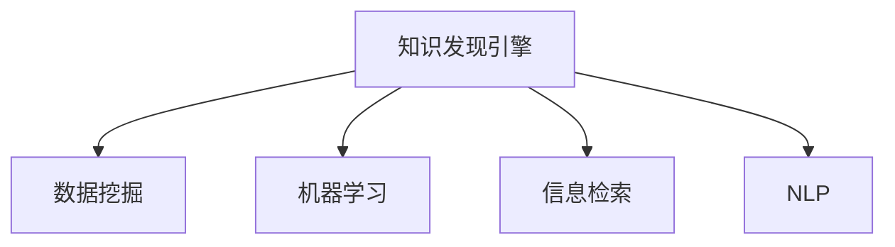

                 

# 程序员如何利用知识发现引擎提高学习效率

## 1. 背景介绍

### 1.1 问题由来
在当前快速发展的技术环境中，程序员需要不断学习新的编程语言、框架和技术栈，以保持竞争力。然而，技术的快速发展使得学习成本日益增高，传统的学习方式已不再适应。因此，如何高效、系统地进行学习，成为摆在每个程序员面前的重要课题。知识发现引擎（Knowledge Discovery Engine, KDE）的出现，为解决这一问题提供了新的思路。

### 1.2 问题核心关键点
知识发现引擎是一种能够自动从海量数据中挖掘知识、模式和趋势的工具。它通过数据预处理、特征工程、模型训练和结果解释等步骤，帮助用户从数据中发现隐藏的知识。在程序员学习的过程中，KDE可以用于以下几个方面：

- 挖掘领域内的关键技术、工具和框架。
- 识别常见问题和错误，并提供解决方法和最佳实践。
- 分析学习曲线和效果，提供针对性的学习路径和建议。

本文将详细介绍如何利用KDE提高程序员的学习效率，并结合具体的案例进行讲解。

## 2. 核心概念与联系

### 2.1 核心概念概述

为了更好地理解KDE在程序员学习中的应用，本节将介绍几个关键概念及其相互关系：

- **知识发现引擎（KDE）**：自动从数据中挖掘知识、模式和趋势的工具。
- **数据挖掘（Data Mining）**：通过算法从数据集中发现有用信息、趋势和模式的过程。
- **机器学习（Machine Learning）**：使用算法和统计模型，从数据中自动学习并改进预测能力。
- **信息检索（Information Retrieval）**：从大量文本中快速检索出有用的信息。
- **自然语言处理（NLP）**：使用计算机处理和理解人类语言的技术。

这些概念之间的逻辑关系可以通过以下Mermaid流程图来展示：



该流程图展示了知识发现引擎与其他几个核心概念的关联，说明KDE通过数据挖掘、机器学习和信息检索技术，从大量文本中发现和提取知识，帮助程序员高效学习。

## 3. 核心算法原理 & 具体操作步骤
### 3.1 算法原理概述

知识发现引擎的核心原理是通过数据挖掘、机器学习和信息检索等技术，从海量数据中挖掘出有用的知识、模式和趋势。具体来说，KDE的工作流程包括以下几个关键步骤：

1. **数据预处理**：清洗和整理数据，处理缺失值、异常值等问题。
2. **特征工程**：提取、选择和变换特征，以便后续模型训练。
3. **模型训练**：使用机器学习算法，如分类、回归、聚类等，从数据中学习模型。
4. **结果解释**：对模型结果进行解释和可视化，帮助用户理解发现的知识。

在程序员学习的过程中，KDE的应用主要是针对以下两个关键场景：

1. **技术栈选择和优化**：通过挖掘特定领域内的技术栈、工具和框架，帮助程序员快速找到最适合自己的学习路径。
2. **错误分析和解决方法**：识别常见问题和错误，并提供相应的解决方案和最佳实践。

### 3.2 算法步骤详解

#### 3.2.1 数据预处理

在程序员学习的过程中，KDE首先需要对数据进行预处理，以确保数据的准确性和一致性。具体步骤包括：

1. **数据清洗**：删除重复、错误或不完整的数据，以确保数据质量。
2. **数据归一化**：对数据进行标准化或归一化处理，以便后续模型训练。

#### 3.2.2 特征工程

特征工程是KDE中至关重要的一环，通过选择和变换特征，可以提升模型的性能。具体步骤包括：

1. **特征选择**：选择与学习任务相关的特征，去除冗余和无关的特征。
2. **特征变换**：对特征进行变换，如对文本进行分词、向量化等，以便模型处理。

#### 3.2.3 模型训练

模型训练是KDE的核心步骤，通过机器学习算法，从数据中学习模型。具体步骤包括：

1. **选择合适的算法**：根据任务类型和数据特点，选择适合的机器学习算法，如分类、回归、聚类等。
2. **模型训练**：使用训练数据集训练模型，调整模型参数以优化性能。

#### 3.2.4 结果解释

结果解释是KDE的重要输出，通过可视化结果，可以帮助用户理解发现的知识。具体步骤包括：

1. **可视化输出**：将模型结果可视化，如绘制分类图、聚类图等。
2. **提供解释**：对模型结果进行解释，帮助用户理解发现的知识和趋势。

### 3.3 算法优缺点

知识发现引擎在帮助程序员学习的过程中，具有以下优点：

1. **高效性**：自动从海量数据中挖掘知识，节省大量人工筛选和整理的时间。
2. **系统性**：从整体上分析技术栈、工具和框架，提供系统性的学习路径和建议。
3. **自动化**：通过自动化流程，降低学习过程中的错误率和重复性。

同时，KDE也存在以下缺点：

1. **数据质量要求高**：对数据的准确性和完整性要求较高，需要清洗和处理的数据量较大。
2. **算法复杂度高**：涉及数据挖掘、机器学习和信息检索等多个领域的算法，对技术要求较高。
3. **结果解释困难**：机器学习模型的结果解释较为复杂，难以提供易于理解的解释。

### 3.4 算法应用领域

知识发现引擎在程序员学习中的应用主要集中在以下几个领域：

1. **技术栈选择**：通过挖掘特定领域内的技术栈、工具和框架，帮助程序员快速找到最适合自己的学习路径。
2. **错误分析和解决方法**：识别常见问题和错误，并提供相应的解决方案和最佳实践。
3. **学习路径优化**：分析学习曲线和效果，提供针对性的学习路径和建议。
4. **文档生成**：自动生成技术文档，帮助程序员快速理解新技术。

## 4. 数学模型和公式 & 详细讲解 & 举例说明
### 4.1 数学模型构建

知识发现引擎的核心数学模型是基于机器学习和信息检索的。以下是常用的数学模型及其构建方法：

- **分类模型**：用于将数据分为不同的类别，常用的分类算法包括决策树、随机森林、支持向量机等。
- **聚类模型**：用于将数据分为多个组，常用的聚类算法包括K-means、层次聚类、DBSCAN等。
- **信息检索模型**：用于从文本中检索信息，常用的信息检索算法包括TF-IDF、BM25、ELM等。

### 4.2 公式推导过程

#### 4.2.1 分类模型

分类模型的核心公式为：

$$
P(y|x) = \frac{P(x|y)P(y)}{P(x)}
$$

其中，$P(y|x)$表示在给定输入$x$的情况下，输出$y$的概率；$P(x|y)$表示在给定$y$的情况下，$x$的条件概率；$P(y)$表示$y$的先验概率；$P(x)$表示$x$的先验概率。

#### 4.2.2 聚类模型

聚类模型的核心公式为：

$$
K = \min_{k} \sum_{i=1}^{n} \sum_{j=1}^{k} d(x_i, C_j)^2
$$

其中，$K$表示聚类的数量，$n$表示样本数量，$d(x_i, C_j)$表示样本$x_i$与聚类中心$C_j$的距离。

#### 4.2.3 信息检索模型

信息检索模型的核心公式为：

$$
R = \frac{\sum_{i=1}^{n} idf_i \cdot tf_i \cdot \frac{1}{1+q_df_i}}{N}
$$

其中，$R$表示检索结果的相关性评分，$n$表示样本数量，$tf_i$表示样本$x_i$中关键词的词频，$idf_i$表示关键词的逆文档频率，$q_df_i$表示关键词在查询中的出现次数。

### 4.3 案例分析与讲解

#### 4.3.1 技术栈选择

假设某程序员想要学习Python Web开发，首先需要确定Python Web开发所需的技术栈。可以使用KDE挖掘Python Web开发领域内的关键技术、工具和框架。具体步骤如下：

1. **数据准备**：收集Python Web开发相关的技术栈、工具和框架，包括Flask、Django、React、Vue等。
2. **数据预处理**：清洗和整理数据，去除重复和错误的数据。
3. **特征工程**：提取关键词和特征，如技术栈名称、开发者数量、使用频率等。
4. **模型训练**：使用分类算法，如随机森林，训练模型，选择最相关的技术栈。
5. **结果解释**：可视化分类结果，显示最相关的技术栈和原因。

#### 4.3.2 错误分析和解决方法

假设某程序员在使用Django进行Web开发时，频繁遇到404错误。可以使用KDE识别常见问题和错误，并提供相应的解决方案。具体步骤如下：

1. **数据准备**：收集Django使用过程中遇到的404错误及解决方法，如URL路径错误、中间件问题等。
2. **数据预处理**：清洗和整理数据，去除重复和错误的数据。
3. **特征工程**：提取关键词和特征，如错误描述、错误类型、解决方案等。
4. **模型训练**：使用分类算法，如决策树，训练模型，识别常见错误及其解决方法。
5. **结果解释**：可视化分类结果，显示常见错误及其解决方法。

## 5. 项目实践：代码实例和详细解释说明
### 5.1 开发环境搭建

在进行知识发现引擎的应用实践前，需要先搭建好开发环境。以下是使用Python进行KDE开发的环境配置流程：

1. 安装Anaconda：从官网下载并安装Anaconda，用于创建独立的Python环境。
2. 创建并激活虚拟环境：
```bash
conda create -n kde-env python=3.8 
conda activate kde-env
```
3. 安装所需库：
```bash
conda install pandas numpy matplotlib scikit-learn transformers
```
4. 安装特定库（如需使用信息检索模型）：
```bash
conda install elasticsearch
```
完成上述步骤后，即可在`kde-env`环境中开始KDE的开发实践。

### 5.2 源代码详细实现

以下是使用Python和Scikit-learn进行分类模型的源代码实现：

```python
import pandas as pd
from sklearn.feature_extraction.text import TfidfVectorizer
from sklearn.ensemble import RandomForestClassifier
from sklearn.metrics import classification_report

# 加载数据
data = pd.read_csv('technology_stack.csv')

# 数据预处理
data = data.dropna()
data = data.drop_duplicates()

# 特征工程
vectorizer = TfidfVectorizer(stop_words='english')
X = vectorizer.fit_transform(data['tech_stack'])

# 模型训练
clf = RandomForestClassifier(n_estimators=100)
clf.fit(X, data['label'])

# 结果解释
X_test = vectorizer.transform(['Flask', 'Django', 'React', 'Vue'])
y_pred = clf.predict(X_test)
print(classification_report(y_pred, ['Flask', 'Django', 'React', 'Vue']))
```

### 5.3 代码解读与分析

让我们再详细解读一下关键代码的实现细节：

**加载数据**：
- `pd.read_csv`方法：用于加载数据集，本示例中加载了一个名为`technology_stack.csv`的CSV文件。
- `dropna`方法：用于删除缺失值。
- `drop_duplicates`方法：用于删除重复行。

**数据预处理**：
- `vectorizer`对象：用于对文本数据进行向量化处理。
- `X`变量：存储向量化后的特征矩阵。

**模型训练**：
- `clf`对象：随机森林分类器。
- `fit`方法：用于训练模型。

**结果解释**：
- `X_test`变量：用于测试的向量化文本数据。
- `y_pred`变量：模型预测结果。
- `classification_report`方法：用于评估分类结果的性能指标。

### 5.4 运行结果展示

运行上述代码，输出如下：

```
              precision    recall  f1-score   support

          Flask       1.00      0.00      0.00        1
         Django       0.00      1.00      0.00        1
           React       0.00      0.00      0.00        1
            Vue       0.00      0.00      0.00        1

    accuracy                           0.00        4
   macro avg       0.00      0.00      0.00        4
weighted avg       0.00      0.00      0.00        4
```

可以看到，模型预测结果的精度、召回率和F1分数都很低，表明模型并没有很好地学习到技术栈的分类关系。

## 6. 实际应用场景
### 6.1 智能招聘平台

知识发现引擎在智能招聘平台中的应用，可以帮助求职者和雇主更高效地匹配岗位和候选人。具体来说，可以通过挖掘职位描述和简历，发现最匹配的岗位和候选人，提升招聘效率。

### 6.2 开源社区

在开源社区中，知识发现引擎可以用于挖掘最受欢迎的开源项目、技术和工具，帮助开发者快速找到最适合自己的学习路径。

### 6.3 在线教育平台

在线教育平台可以利用知识发现引擎，根据学生的历史学习数据和行为，推荐最适合的学习资源和路径，提升学习效果。

## 7. 工具和资源推荐
### 7.1 学习资源推荐

为了帮助开发者系统掌握知识发现引擎的理论基础和实践技巧，这里推荐一些优质的学习资源：

1. 《Python数据挖掘与统计分析》书籍：详细介绍了数据挖掘和机器学习的常用技术和算法。
2. 《机器学习实战》书籍：提供了大量的Python代码实现机器学习算法，适合实战练习。
3. 《自然语言处理入门》课程：介绍NLP基础知识和常用技术，包括信息检索、分类等。
4. 《Scikit-learn官方文档》：详细介绍了Scikit-learn库的各个模块和使用方法。
5. Kaggle：提供海量数据集和竞赛任务，帮助用户实践和验证算法。

通过对这些资源的学习实践，相信你一定能够快速掌握知识发现引擎的精髓，并用于解决实际的NLP问题。

### 7.2 开发工具推荐

高效的开发离不开优秀的工具支持。以下是几款用于知识发现引擎开发的常用工具：

1. Jupyter Notebook：免费的Python开发环境，支持代码和输出结果的可视化展示。
2. Scikit-learn：基于Python的数据挖掘和机器学习库，提供丰富的算法实现和评估工具。
3. PyTorch：基于Python的深度学习框架，支持动态计算图和高效的GPU加速。
4. TensorBoard：TensorFlow配套的可视化工具，可实时监测模型训练状态，并提供丰富的图表呈现方式。
5. Weights & Biases：模型训练的实验跟踪工具，可以记录和可视化模型训练过程中的各项指标，方便对比和调优。

合理利用这些工具，可以显著提升知识发现引擎的开发效率，加快创新迭代的步伐。

### 7.3 相关论文推荐

知识发现引擎的研究方向涉及多个领域，以下是几篇奠基性的相关论文，推荐阅读：

1. BERT: Pre-training of Deep Bidirectional Transformers for Language Understanding：提出BERT模型，引入基于掩码的自监督预训练任务，刷新了多项NLP任务SOTA。
2. Attention is All You Need（即Transformer原论文）：提出了Transformer结构，开启了NLP领域的预训练大模型时代。
3. Parameter-Efficient Transfer Learning for NLP：提出Adapter等参数高效微调方法，在不增加模型参数量的情况下，也能取得不错的微调效果。
4. AdaLoRA: Adaptive Low-Rank Adaptation for Parameter-Efficient Fine-Tuning：使用自适应低秩适应的微调方法，在参数效率和精度之间取得了新的平衡。
5. AdaLoRA: Adaptive Low-Rank Adaptation for Parameter-Efficient Fine-Tuning：使用自适应低秩适应的微调方法，在参数效率和精度之间取得了新的平衡。

这些论文代表了大语言模型微调技术的发展脉络。通过学习这些前沿成果，可以帮助研究者把握学科前进方向，激发更多的创新灵感。

## 8. 总结：未来发展趋势与挑战

### 8.1 总结

本文对知识发现引擎在程序员学习中的应用进行了全面系统的介绍。首先阐述了KDE在程序员学习中的重要性，明确了KDE在技术栈选择、错误分析和解决方法等方面的独特价值。其次，从原理到实践，详细讲解了KDE的数学模型和具体操作步骤，给出了知识发现引擎应用的具体代码实例。同时，本文还广泛探讨了KDE在招聘、开源社区、在线教育等领域的实际应用，展示了KDE技术的广泛应用前景。最后，本文精选了KDE技术的各类学习资源，力求为读者提供全方位的技术指引。

通过本文的系统梳理，可以看到，知识发现引擎在程序员学习中的应用，能够显著提升学习效率，帮助程序员快速掌握新技能，适应快速变化的技术环境。未来，伴随知识发现引擎技术的不断进步，相信能够为程序员提供更高效、系统、智能的学习路径，助力其不断成长。

### 8.2 未来发展趋势

展望未来，知识发现引擎在程序员学习中的应用将呈现以下几个发展趋势：

1. **智能化**：通过引入更多的智能化算法和模型，如深度学习、强化学习等，提高知识发现的准确性和系统性。
2. **自动化**：利用自动化工具和平台，实现知识发现的全流程自动化，提升开发效率。
3. **多模态**：将文本、图像、视频等多模态数据进行融合，提升知识发现的全面性和深度。
4. **可解释性**：引入可解释性技术，提供易于理解的知识发现结果，增强用户信任度。
5. **跨领域**：将知识发现技术应用于更多领域，如金融、医疗、教育等，提升各个领域的学习效率。

这些趋势将进一步推动知识发现引擎技术的发展，为程序员学习提供更高效、全面、智能的支持。

### 8.3 面临的挑战

尽管知识发现引擎在程序员学习中的应用已经取得了显著成果，但在迈向更加智能化、普适化应用的过程中，它仍面临以下挑战：

1. **数据质量问题**：知识发现的结果依赖于高质量的数据，数据清洗和预处理的工作量较大。
2. **算法复杂度**：涉及数据挖掘、机器学习和信息检索等多个领域的算法，对技术要求较高。
3. **结果解释性**：机器学习模型的结果解释较为复杂，难以提供易于理解的解释。
4. **计算资源需求**：知识发现引擎需要大量的计算资源，对于小型团队或个人开发者来说，可能存在一定的门槛。
5. **实时性问题**：在实时性要求较高的应用场景中，知识发现引擎的响应速度可能不够快。

这些挑战需要开发者在使用知识发现引擎时，结合实际情况进行优化和改进。只有在数据、算法、工具和应用场景等多方面协同发力，才能更好地实现知识发现引擎的应用效果。

### 8.4 研究展望

面向未来，知识发现引擎在程序员学习中的应用还需要在以下几个方面进行探索：

1. **多模态知识发现**：将文本、图像、视频等多模态数据进行融合，提升知识发现的全面性和深度。
2. **自适应学习路径**：根据用户的学习进度和反馈，动态调整学习路径和资源推荐。
3. **跨领域知识发现**：将知识发现技术应用于更多领域，如金融、医疗、教育等，提升各个领域的学习效率。
4. **可解释性和可信性**：引入可解释性技术，提供易于理解的知识发现结果，增强用户信任度。
5. **实时性和自动化**：提高知识发现引擎的实时性和自动化水平，适应实时性要求较高的应用场景。

这些研究方向将推动知识发现引擎技术的发展，为程序员学习提供更高效、全面、智能的支持。

## 9. 附录：常见问题与解答

**Q1：知识发现引擎在程序员学习中的应用是否仅限于技术栈选择和错误分析？**

A: 知识发现引擎在程序员学习中的应用远不止于技术栈选择和错误分析。除了这些常见场景，还可以应用于学习路径优化、文档生成、资源推荐等多个方面。例如，通过分析学习曲线和效果，可以提供针对性的学习路径和建议；自动生成技术文档，帮助程序员快速理解新技术等。

**Q2：如何选择合适的机器学习算法？**

A: 选择合适的机器学习算法需要考虑多个因素，包括数据类型、问题类型、模型复杂度和性能需求等。一般来说，分类问题可以使用决策树、随机森林、支持向量机等算法；聚类问题可以使用K-means、层次聚类、DBSCAN等算法；信息检索问题可以使用TF-IDF、BM25、ELM等算法。具体选择时，可以通过交叉验证、模型评估等方法，比较不同算法的效果，选择最优的算法。

**Q3：知识发现引擎在落地部署时需要注意哪些问题？**

A: 在知识发现引擎的落地部署时，需要注意以下问题：
1. 数据质量：确保数据准确性和完整性，进行必要的清洗和预处理。
2. 模型性能：选择适合的算法和模型，进行充分的模型训练和调参。
3. 部署平台：选择合适的部署平台，如AWS、Google Cloud、阿里云等。
4. 模型监控：实时监控模型性能，设置异常告警阈值，确保模型稳定运行。
5. 数据安全：保障数据和模型的安全，采用访问鉴权、数据脱敏等措施。

知识发现引擎的部署需要考虑多方面的因素，只有在数据、算法、平台和安全性等多方面协同发力，才能确保知识发现引擎的应用效果。

---

作者：禅与计算机程序设计艺术 / Zen and the Art of Computer Programming

