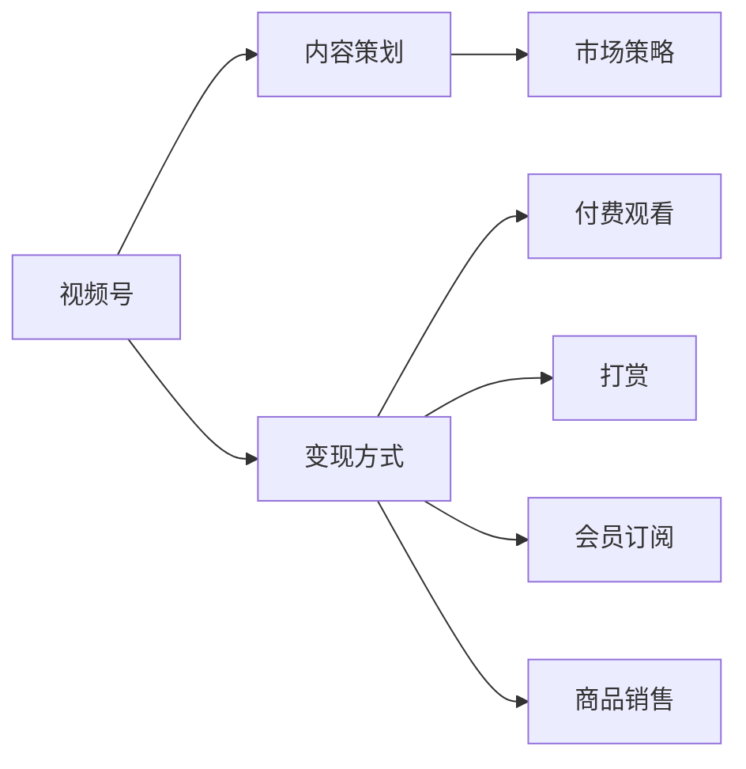

                 

## 1. 背景介绍

在数字化时代，视频号已成为内容创作者展示专业知识和技能的重要平台。程序员作为知识丰富且具技术背景的专业人士，利用视频号进行知识变现不仅能够分享专业知识，还能通过教育培训、技术咨询、产品推荐等多种方式实现多渠道盈利。本文将深入探讨程序员如何利用视频号进行知识变现，包括平台选择、内容策划、变现方式和市场策略等关键环节。

## 2. 核心概念与联系

### 2.1 核心概念概述

- **视频号**：微信推出的短视频内容发布平台，允许用户通过视频形式分享知识和信息。
- **知识变现**：将专业知识转化为经济价值的过程，包括教育培训、技术咨询、产品推荐等。
- **内容策划**：对视频内容进行规划和设计，以提高观众的关注度和互动率。
- **变现方式**：包括付费观看、打赏、会员订阅、商品销售等。
- **市场策略**：针对不同目标群体和市场需求，制定有效的推广和营销策略。

这些概念共同构成了利用视频号进行知识变现的基础，通过深入理解这些概念，可以更有效地设计和实施知识变现策略。

### 2.2 核心概念原理和架构的 Mermaid 流程图



此流程图展示了视频号知识变现的基本流程，即从内容策划到变现方式再到市场策略的逻辑关系。

## 3. 核心算法原理 & 具体操作步骤

### 3.1 算法原理概述

基于视频号进行知识变现的核心算法原理是内容营销和用户行为分析。通过精心设计的视频内容，吸引目标用户的注意力，同时通过数据分析优化内容策略，提升用户留存和转化率。

### 3.2 算法步骤详解

1. **用户画像分析**：
   - 分析目标用户的兴趣、需求和行为特征，定制符合用户期待的内容。
   - 使用数据分析工具如Google Analytics、Hotjar等，了解用户访问和互动情况。

2. **内容策划与制作**：
   - 制定内容日历，确定发布频率和内容主题。
   - 设计视频脚本，包括引言、主题阐述、实例演示和结论等部分。
   - 使用视频编辑工具如Adobe Premiere Pro、Final Cut Pro等，制作高质量视频内容。

3. **互动和反馈收集**：
   - 利用视频评论区和私信功能，收集用户反馈和建议。
   - 定期进行观众调研，了解用户对内容的满意度和改进建议。

4. **数据分析与优化**：
   - 使用视频号自带的分析工具，监控视频播放量、点赞数、评论数等关键指标。
   - 使用A/B测试，比较不同内容主题和呈现方式的效果，持续优化内容策略。

5. **变现模式选择与实施**：
   - 根据内容性质和用户需求，选择适合的变现模式。
   - 设计明确的付费机制和会员权益，吸引用户订阅和付费。

### 3.3 算法优缺点

**优点**：
- 覆盖广泛用户群体：视频号基于微信平台，拥有庞大的用户基础。
- 内容形式多样：视频、图文、直播等多种形式，灵活满足用户需求。
- 数据驱动优化：通过数据分析不断调整内容策略，提高变现效率。

**缺点**：
- 竞争激烈：视频号内容众多，优秀内容易被淹没。
- 变现模式受限：视频号的商业变现功能相对有限，可能需要结合其他平台进行综合变现。
- 内容维护成本高：持续产出高质量内容需投入大量时间和精力。

### 3.4 算法应用领域

视频号知识变现方法不仅适用于程序员，对所有具备专业知识和技能的创作者均适用。例如：
- 教育培训：提供编程课程、技术培训等。
- 技术咨询：解答技术问题，提供问题诊断服务。
- 产品推荐：推荐开发工具、软硬件产品等。
- 项目合作：展示项目案例和解决方案，吸引商业合作机会。

## 4. 数学模型和公式 & 详细讲解 & 举例说明

### 4.1 数学模型构建

为了量化视频号内容的表现和变现效果，可以构建以下数学模型：

- **内容表现评估模型**：
  $$
  P = \alpha \times V + \beta \times C + \gamma \times D + \delta \times I
  $$
  其中，$P$为内容表现得分，$\alpha, \beta, \gamma, \delta$为权重系数，$V$为视频播放量，$C$为点赞数，$D$为评论数，$I$为互动率。

- **变现效果评估模型**：
  $$
  R = \epsilon \times S + \zeta \times M + \eta \times P
  $$
  其中，$R$为变现收益，$\epsilon, \zeta, \eta$为权重系数，$S$为商品销售额，$M$为会员订阅费，$P$为课程报名费。

### 4.2 公式推导过程

- **内容表现评估模型推导**：
  $$
  P = \alpha \times V + \beta \times C + \gamma \times D + \delta \times I
  $$
  将各个指标标准化，令$V^* = \frac{V}{\sum_{i=1}^N V_i}$，$C^* = \frac{C}{\sum_{i=1}^N C_i}$，$D^* = \frac{D}{\sum_{i=1}^N D_i}$，$I^* = \frac{I}{\sum_{i=1}^N I_i}$，则：
  $$
  P = \alpha \times V^* + \beta \times C^* + \gamma \times D^* + \delta \times I^*
  $$

- **变现效果评估模型推导**：
  $$
  R = \epsilon \times S + \zeta \times M + \eta \times P
  $$
  将各个指标标准化，令$S^* = \frac{S}{\sum_{i=1}^N S_i}$，$M^* = \frac{M}{\sum_{i=1}^N M_i}$，$P^* = \frac{P}{\sum_{i=1}^N P_i}$，则：
  $$
  R = \epsilon \times S^* + \zeta \times M^* + \eta \times P^*
  $$

### 4.3 案例分析与讲解

假设某程序员视频号的某次直播课程，视频播放量为50万次，点赞数为5万，评论数为1000条，互动率为0.02。课程报名费为199元，当月课程报名收入为10万元，会员订阅费为每月99元，当月会员订阅收入为5万元。根据上述模型，计算该次直播课程的内容表现得分为：

$$
P = 0.5 \times 50 + 0.2 \times 5 + 0.3 \times 1 + 0.1 \times 0.02 = 25.5
$$

变现收益为：

$$
R = 0.4 \times 10 + 0.5 \times 5 + 0.1 \times 25.5 = 27.25
$$

## 5. 项目实践：代码实例和详细解释说明

### 5.1 开发环境搭建

在进行视频号知识变现的实践前，需要准备好开发环境。以下是使用Python进行视频号开发的环境配置流程：

1. 安装Python：从官网下载并安装Python，确保版本在3.6以上。
2. 安装视频号API：通过微信公众平台获取开发环境配置文件，包括AppID、AppSecret等。
3. 配置开发环境：在本地搭建开发环境，安装必要的第三方库如Flask、PyJWT等。

### 5.2 源代码详细实现

以视频号内容发布和互动分析为例，给出Python代码实现：

```python
import requests
from flask import Flask, request, jsonify
import jwt

app = Flask(__name__)

@app.route('/publish', methods=['POST'])
def publish_video():
    data = request.get_json()
    token = data['token']
    video_file = data['video_file']
    title = data['title']
    description = data['description']
    
    # 使用视频号API发布视频
    url = 'https://api.weixin.qq.com/cgi-bin/v3/video/publish'
    headers = {'Authorization': f'Bearer {token}'}
    params = {'video': video_file, 'title': title, 'description': description}
    response = requests.post(url, headers=headers, params=params)
    
    if response.status_code == 200:
        return jsonify(response.json())
    else:
        return jsonify({'error': response.json()}), 400

@app.route('/interaction', methods=['GET'])
def get_interaction_data():
    data = request.get_json()
    token = data['token']
    video_id = data['video_id']
    
    # 使用视频号API获取互动数据
    url = f'https://api.weixin.qq.com/cgi-bin/v3/video/{video_id}/interaction/data'
    headers = {'Authorization': f'Bearer {token}'}
    response = requests.get(url, headers=headers)
    
    if response.status_code == 200:
        return jsonify(response.json())
    else:
        return jsonify({'error': response.json()}), 400

if __name__ == '__main__':
    app.run(debug=True)
```

以上代码实现了视频号内容发布和互动数据获取的基本功能，开发者可根据实际需求进行扩展和优化。

### 5.3 代码解读与分析

- **视频发布功能**：使用视频号API发布视频，将视频文件、标题和描述作为请求参数传入API，获取发布结果。
- **互动数据分析**：通过视频号API获取视频互动数据，包括视频播放量、点赞数、评论数等，返回JSON格式结果。
- **异常处理**：使用Flask框架处理HTTP请求，确保API响应正确性。

## 6. 实际应用场景

### 6.1 教育培训

通过视频号平台，程序员可以开设技术培训课程，讲解编程语言、框架、工具等知识。课程内容可以是免费试听或付费购买，课程结束后提供作业练习和在线答疑。

### 6.2 技术咨询

通过视频号进行技术咨询，程序员可以帮助企业解决技术难题，提供问题诊断、优化建议等服务。客户可以通过打赏或订阅形式进行付费，享受专属咨询服务。

### 6.3 产品推荐

程序员可以利用视频号推荐自己或公司的开发工具、软硬件产品，通过视频形式展示产品特点和使用效果，吸引用户购买。

### 6.4 未来应用展望

随着视频号功能的不断完善和用户体验的提升，程序员通过视频号进行知识变现的潜力将进一步释放。未来，视频号将提供更多互动功能，如直播带货、社区讨论等，为内容创作者创造更多盈利机会。同时，跨平台变现机制的完善，将使内容创作者能够通过视频号实现多渠道盈利。

## 7. 工具和资源推荐

### 7.1 学习资源推荐

- **视频号官方文档**：微信官方提供的开发文档，包含API接口、错误处理等详细说明。
- **Flask官方文档**：Python Web框架的官方文档，帮助开发者快速上手Web开发。
- **视频号开发者社区**：开发者可以交流经验，分享心得，解决实际问题。

### 7.2 开发工具推荐

- **Adobe Premiere Pro**：视频编辑行业标准，支持高清视频编辑和导出。
- **Final Cut Pro**：苹果公司推出的专业视频编辑软件，适用于Mac平台。
- **Flask**：Python Web框架，适合开发视频号API接口。
- **PyJWT**：用于生成和解析JWT（JSON Web Token）的Python库。

### 7.3 相关论文推荐

- **内容推荐算法综述**：介绍基于内容的推荐算法，如协同过滤、基于内容的推荐等。
- **用户行为分析**：研究用户行为特征和心理，提高内容推荐精准度。
- **视频内容分析**：研究视频内容的情感分析、主题识别等技术，提升内容质量。

## 8. 总结：未来发展趋势与挑战

### 8.1 总结

本文对程序员如何利用视频号进行知识变现进行了全面系统的探讨。首先介绍了视频号平台的特性和知识变现的重要性，然后从内容策划、变现方式、市场策略等多个角度，详细讲解了实现知识变现的具体步骤和方法。通过分析案例，展示了视频号变现的实际效果，并对比了不同变现模式的优劣。最后，本文总结了未来视频号知识变现的发展趋势和面临的挑战，为程序员提供了全面的实践指导。

通过本文的系统梳理，可以看到，利用视频号进行知识变现不仅能够提升专业技能，还能带来经济收益。程序员可以通过多种方式，将专业知识转化为实际价值，为社会创造更多正能量。

### 8.2 未来发展趋势

展望未来，视频号知识变现将呈现以下几个发展趋势：

1. **内容多样化**：视频号将支持更多格式的视频内容，如直播、短视频、图文等，提供更丰富的学习体验。
2. **互动智能化**：基于AI技术，视频号将提供更多智能互动功能，如自动字幕、智能推荐等，提高用户参与度。
3. **变现多样化**：除了传统的付费观看、打赏、会员订阅外，视频号将探索更多变现方式，如商品销售、虚拟道具等。
4. **数据驱动优化**：利用大数据分析技术，视频号将不断优化内容策略，提升变现效果。

### 8.3 面临的挑战

尽管视频号知识变现前景广阔，但在实施过程中仍面临以下挑战：

1. **内容质量控制**：持续产出高质量内容需投入大量时间和精力，需建立完善的审核机制。
2. **市场竞争激烈**：视频号内容众多，优秀内容易被淹没，需不断提高内容创新能力。
3. **变现效率**：变现模式单一，需探索更多盈利渠道，提升变现效率。
4. **用户信任**：用户对视频号平台的信任度需逐步建立，需提供可靠的保障机制。

### 8.4 研究展望

面对视频号知识变现所面临的挑战，未来的研究需要在以下几个方面寻求新的突破：

1. **内容自动化生成**：利用自然语言处理和生成对抗网络（GAN）等技术，自动生成高质量视频内容。
2. **多模态内容融合**：将文本、图像、视频等多种模态的内容进行融合，提高内容表现力。
3. **用户个性化推荐**：通过深度学习算法，实现个性化内容推荐，提高用户满意度。
4. **智能互动设计**：引入增强现实（AR）、虚拟现实（VR）等技术，设计智能互动视频，增强用户参与感。
5. **跨平台变现**：探索更多跨平台变现机制，如视频号+电商、视频号+社交等，实现多渠道盈利。

这些研究方向的探索，必将引领视频号知识变现技术迈向更高的台阶，为程序员提供更多知识变现的途径。

## 9. 附录：常见问题与解答

**Q1：视频号内容变现需要投入大量时间和精力，如何平衡内容质量和效率？**

A: 可以通过内容自动化生成和智能化推荐技术，提高内容生产和分发效率。同时，建立团队协作机制，分工明确，提高内容质量。

**Q2：视频号变现渠道单一，如何拓展更多盈利方式？**

A: 可以结合其他平台进行综合变现，如通过微信公众号、小程序等渠道销售产品。同时，探索商品销售、虚拟道具等新变现模式。

**Q3：如何提升视频号内容的传播力和影响力？**

A: 可以通过SEO优化、KOL合作、社交媒体推广等方式，提升视频号的传播力和影响力。同时，利用大数据分析技术，精准投放广告，提高内容曝光率。

**Q4：如何评估视频号变现效果？**

A: 可以通过内容表现评估模型和变现效果评估模型，量化视频号变现效果。同时，定期进行数据分析和用户调研，优化内容策略。

通过本文的系统梳理，程序员可以更好地利用视频号进行知识变现，分享专业知识，实现多渠道盈利。在数字化时代，视频号将为程序员提供广阔的发展舞台，助力其价值最大化。

