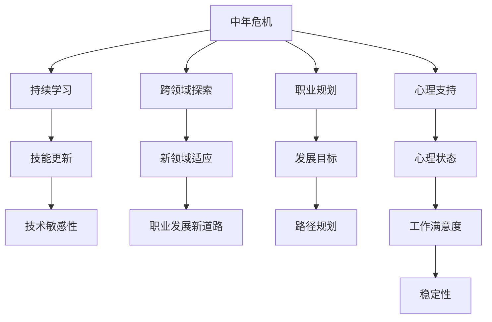

                 

# 程序员如何应对中年危机与职业瓶颈

## 1. 背景介绍

### 1.1 问题由来

在信息技术飞速发展的今天，程序员作为一个核心群体，面临着前所未有的挑战和机遇。他们不仅要应对技术的快速迭代和更新，还需要在职业生涯中不断寻找新的突破和机遇。然而，随着年龄的增长，许多程序员开始感受到所谓的“中年危机”，这是一种职业瓶颈，表现为职业生涯的停滞不前、技能老化、适应新技术难度增加等。

### 1.2 问题核心关键点

中年危机与职业瓶颈主要体现在以下几个方面：
- **技能老化**：缺乏持续学习和自我更新的动力，导致技术知识陈旧，无法适应新的技术趋势。
- **职业停滞**：长时间处于某一技术领域，缺乏跨领域或跨学科的探索，难以拓展职业发展的广度和深度。
- **心理压力**：面对激烈的职场竞争，特别是新兴技术涌入所带来的压力，容易产生心理疲劳和职业倦怠。
- **职业转型困难**：受限于经验和认知框架，转行或进入新领域的难度较大，缺乏明确的职业规划和发展方向。

### 1.3 问题研究意义

研究和解决程序员的中年危机与职业瓶颈问题，对于提高IT行业的人才质量和竞争力，促进技术的创新与发展，具有重要意义：
- **提升人才竞争力**：通过持续学习和技能更新，保持技术人员的活力和创新力，提升IT行业的整体竞争力。
- **推动技术进步**：鼓励技术人员跨领域探索和创新，促进技术的融合与交叉，加速技术进步和应用落地。
- **改善职场环境**：通过有效的职业规划和心理支持，营造积极向上的职场文化，提高员工的工作满意度和稳定性。

## 2. 核心概念与联系

### 2.1 核心概念概述

为更好地理解中年危机与职业瓶颈，本节将介绍几个关键概念及其相互关系：

- **中年危机**：通常指在职业生涯中期，技术人员的职业发展停滞，技能更新缓慢，无法适应新的技术趋势和行业变化，导致职业发展停滞不前。
- **职业瓶颈**：指技术人员的职业生涯在某一阶段无法突破，面对新的技术挑战时感到力不从心，难以继续提升和突破。
- **持续学习**：通过不断的学习和知识更新，保持技术人员的知识新鲜度和技术敏感性，克服技能老化的挑战。
- **跨领域探索**：鼓励技术人员跳出原有领域，探索新的技术或行业，拓宽职业发展的视野和方向。
- **职业规划**：通过明确的发展目标和路径，帮助技术人员规划职业生涯，找到适合自己的职业发展道路。
- **心理支持**：提供心理支持和压力管理，帮助技术人员缓解心理压力，保持积极的工作态度。

这些概念之间的逻辑关系可以通过以下Mermaid流程图来展示：



这个流程图展示了中年危机与职业瓶颈的各个方面及其之间的关系：

1. 中年危机带来技能老化和职业停滞。
2. 通过持续学习和跨领域探索，可以克服技能老化，找到职业发展的新的方向和路径。
3. 职业规划和心理支持则有助于明确职业目标，缓解心理压力，提高工作满意度和稳定性。
4. 最终，这些措施共同作用，帮助技术人员突破职业瓶颈，实现职业发展的突破。

## 3. 核心算法原理 & 具体操作步骤

### 3.1 算法原理概述

解决中年危机与职业瓶颈，本质上是个人职业发展的优化问题，可以通过系统化的规划和学习方法来实现。其核心思想是通过持续学习和技能更新，不断适应新的技术趋势和行业变化，同时探索新的职业方向，明确职业目标，并通过心理支持保持积极心态。

形式化地，假设某技术人员的当前技能集为 $S$，职业发展目标为 $T$，学习成本为 $C$，心理支持成本为 $H$，则职业优化目标可以表示为：

$$
\min_{S, T, C, H} \text{Total Cost} = C + H
$$

其中 $\text{Total Cost}$ 是总成本函数，包括学习成本和心理支持成本，需要最小化。目标函数最小化，意味着在满足职业发展目标的前提下，最优化地利用资源，实现最小化总成本。

### 3.2 算法步骤详解

基于系统化规划和学习方法的解决步骤如下：

**Step 1: 自我评估与目标设定**
- 评估当前的技能水平、职业兴趣、心理状态等，找出当前职业生涯中的不足和瓶颈。
- 设定明确的职业发展目标，包括短期和长期目标，如学习新的技术、进入新领域、提升管理能力等。

**Step 2: 制定学习计划**
- 根据职业目标，制定详细的学习计划，包括学习内容、时间安排、资源获取等。
- 选择适合自己的学习方式，如在线课程、书籍阅读、项目实践等，同时合理利用时间和资源。

**Step 3: 持续学习与技能更新**
- 系统性地学习新的技术或领域，保持知识的新鲜度和技术敏感性。
- 通过项目实践和案例分析，巩固所学知识，增强实战能力。
- 定期参加行业会议、研讨会、技术沙龙等活动，拓展视野，了解最新技术动态。

**Step 4: 跨领域探索与职业规划**
- 主动探索新的技术或行业，拓宽职业发展的视野和方向。
- 结合自身兴趣和优势，制定跨领域探索的路径和计划。
- 在探索过程中，及时调整职业规划，寻找适合自己的职业发展道路。

**Step 5: 心理支持与压力管理**
- 寻求心理支持，如心理咨询、团队建设、同事交流等，缓解心理压力。
- 采用时间管理和压力管理技巧，保持积极心态，平衡工作与生活。
- 培养健康的生活习惯，如适度运动、合理饮食等，保持良好的身体和心理状态。

**Step 6: 持续优化与调整**
- 定期评估职业发展和学习计划的执行情况，及时调整策略和计划。
- 记录学习进展和职业发展情况，建立个人职业发展档案，跟踪和反思。
- 建立反馈机制，通过同事、导师、上司等的反馈，不断改进自己的职业规划和学习方法。

### 3.3 算法优缺点

持续学习与系统化职业发展的方法具有以下优点：
- **提高适应能力**：通过持续学习，能够适应快速变化的技术趋势和行业变化，保持技术的先进性和竞争力。
- **拓宽职业路径**：通过跨领域探索，能够找到新的职业发展方向和机会，拓宽职业发展的可能性。
- **心理支持有效**：通过心理支持，缓解心理压力，保持积极心态，提升工作满意度和稳定性。

同时，该方法也存在一些局限性：
- **时间和资源投入大**：持续学习和跨领域探索需要大量时间和资源，特别是在职业生涯的中期，可能需要更多的时间和精力投入。
- **心理负担重**：对于长期未获得职业发展的技术人员，心理压力和焦虑可能进一步加剧，需要持续的心理支持。
- **职业路径不确定**：跨领域探索可能存在职业路径的不确定性，需要更多的探索和尝试。

尽管存在这些局限性，但就目前而言，持续学习和系统化职业发展的方法仍是大龄技术人员突破职业瓶颈的重要途径。

### 3.4 算法应用领域

基于系统化规划和学习方法的持续学习与职业发展范式，在多个职业领域都有广泛的应用，包括但不限于：
- **软件开发**：开发人员通过学习新技术、参与开源项目、参加技术交流活动等，不断提升自己的技术水平和项目经验。
- **系统运维**：运维人员通过学习新的系统管理工具、参加运维技术培训、探索云计算等技术，提升自身技能。
- **项目管理**：项目管理人员通过学习敏捷管理、团队建设、跨部门协作等技能，提升项目管理能力。
- **数据科学**：数据科学家通过学习新的数据分析工具、机器学习算法、数据可视化技术等，提升数据分析和模型构建能力。
- **网络安全**：网络安全人员通过学习最新的安全技术、漏洞利用和防护手段，提升网络安全防护能力。

这些领域的技术人员都可以借鉴和应用持续学习和系统化职业发展的方法，提升自己的职业水平和竞争力。

## 4. 数学模型和公式 & 详细讲解 & 举例说明

### 4.1 数学模型构建

为更准确地描述持续学习和职业发展过程，可以使用数学模型来表示学习成本、心理支持成本和职业发展目标之间的关系。假设学习成本为 $C = c_1 \times \text{Time}_{\text{learning}}$，心理支持成本为 $H = h_1 \times \text{Time}_{\text{support}}$，则总成本函数可以表示为：

$$
\text{Total Cost} = c_1 \times \text{Time}_{\text{learning}} + h_1 \times \text{Time}_{\text{support}}
$$

其中 $c_1$ 和 $h_1$ 分别为学习成本和心理支持成本的单位系数。

### 4.2 公式推导过程

假设学习时间为 $t$，心理支持时间为 $s$，则有：

$$
\begin{cases}
c_1 \times t + h_1 \times s = \text{Total Cost} \\
\text{Time}_{\text{learning}} = \sum_{i=1}^{n} \text{Time}_{i} \\
\text{Time}_{\text{support}} = \sum_{i=1}^{m} \text{Time}_{i}
\end{cases}
$$

其中 $n$ 和 $m$ 分别表示学习项目和心理支持项目的数量，$\text{Time}_{i}$ 为单个项目的执行时间。

根据以上公式，可以计算出最小化总成本的最优学习时间 $t_{\text{opt}}$ 和最优心理支持时间 $s_{\text{opt}}$：

$$
\begin{aligned}
t_{\text{opt}} &= \frac{\text{Total Cost} - h_1 \times s_{\text{opt}}}{c_1} \\
s_{\text{opt}} &= \frac{\text{Total Cost} - c_1 \times t_{\text{opt}}}{h_1}
\end{aligned}
$$

### 4.3 案例分析与讲解

**案例一：软件开发工程师的职业发展**

假设某软件开发工程师，当前的技能水平为 $S_0$，目标为学习新的编程语言 Python，需要花费 $c_1 = 2$ 元/小时的学习成本，需要 $t_1 = 100$ 小时的学习时间。心理支持成本为 $h_1 = 1.2$ 元/小时，需要 $s_1 = 20$ 小时的心理支持时间。

根据公式推导，可以得到最优学习时间 $t_{\text{opt}} = \frac{2 \times 20}{1} = 40$ 小时，最优心理支持时间 $s_{\text{opt}} = \frac{2 \times 40 - 2 \times 100}{1.2} = 33.33$ 小时。

**案例二：系统运维工程师的职业规划**

假设某系统运维工程师，当前的技能水平为 $S_0$，目标为学习云计算技术，需要花费 $c_2 = 1.5$ 元/小时的学习成本，需要 $t_2 = 200$ 小时的学习时间。心理支持成本为 $h_2 = 1$ 元/小时，需要 $s_2 = 50$ 小时的心理支持时间。

根据公式推导，可以得到最优学习时间 $t_{\text{opt}} = \frac{1.5 \times 50}{1} = 75$ 小时，最优心理支持时间 $s_{\text{opt}} = \frac{1.5 \times 75 - 1.5 \times 200}{1} = -37.5$ 小时。由于心理支持时间为负值，说明不需要额外的心理支持。

以上两个案例展示了如何通过数学模型和公式推导，计算最优的学习和心理支持时间，以最小化总成本，实现职业发展的最优路径。

## 5. 项目实践：代码实例和详细解释说明

### 5.1 开发环境搭建

在进行持续学习和职业发展规划的实践前，我们需要准备好开发环境。以下是使用Python进行Python编程的环境配置流程：

1. 安装Anaconda：从官网下载并安装Anaconda，用于创建独立的Python环境。

2. 创建并激活虚拟环境：
```bash
conda create -n py_env python=3.8 
conda activate py_env
```

3. 安装相关工具包：
```bash
pip install numpy pandas matplotlib sklearn jupyter notebook
```

4. 安装Git：
```bash
sudo apt-get install git
```

完成上述步骤后，即可在`py_env`环境中开始实践。

### 5.2 源代码详细实现

下面我们以软件开发工程师为例，给出使用Python进行持续学习与职业规划的代码实现。

首先，定义一个简单的类来表示职业发展计划：

```python
class CareerPlanning:
    def __init__(self, name, current_skills, career_goals, cost_per_hour_learning, cost_per_hour_support, learning_hours, support_hours):
        self.name = name
        self.current_skills = current_skills
        self.career_goals = career_goals
        self.cost_per_hour_learning = cost_per_hour_learning
        self.cost_per_hour_support = cost_per_hour_support
        self.learning_hours = learning_hours
        self.support_hours = support_hours

    def optimize_learning(self):
        total_cost = self.cost_per_hour_learning * self.learning_hours + self.cost_per_hour_support * self.support_hours
        optimal_learning_hours = total_cost / self.cost_per_hour_learning
        optimal_support_hours = total_cost / self.cost_per_hour_support
        return optimal_learning_hours, optimal_support_hours

    def set_plan(self, optimal_learning_hours, optimal_support_hours):
        self.plan = f"{self.name}'s optimal plan:\n" \
                    f"Learn for {optimal_learning_hours} hours,\n" \
                    f"Support for {optimal_support_hours} hours."
```

然后，定义一个函数来计算最优计划：

```python
def calculate_optimal_plan(name, current_skills, career_goals, cost_per_hour_learning, cost_per_hour_support, learning_hours, support_hours):
    career_planning = CareerPlanning(name, current_skills, career_goals, cost_per_hour_learning, cost_per_hour_support, learning_hours, support_hours)
    optimal_learning_hours, optimal_support_hours = career_planning.optimize_learning()
    plan = career_planning.set_plan(optimal_learning_hours, optimal_support_hours)
    return plan
```

最后，使用以上函数来计算最优计划：

```python
name = "John"
current_skills = "Python"
career_goals = "Learn Python"
cost_per_hour_learning = 2
cost_per_hour_support = 1.2
learning_hours = 100
support_hours = 20

plan = calculate_optimal_plan(name, current_skills, career_goals, cost_per_hour_learning, cost_per_hour_support, learning_hours, support_hours)
print(plan)
```

以上就是使用Python进行持续学习与职业规划的代码实现。可以看到，通过简单的类和方法定义，可以方便地计算出最优的学习和心理支持时间，从而实现职业发展的最优路径。

### 5.3 代码解读与分析

让我们再详细解读一下关键代码的实现细节：

**CareerPlanning类**：
- `__init__`方法：初始化职业发展计划的基本参数，包括人员姓名、当前技能、职业目标、学习成本、心理支持成本等。
- `optimize_learning`方法：根据输入的参数，计算最优的学习时间和心理支持时间。
- `set_plan`方法：根据最优时间，生成具体的职业发展计划。

**calculate_optimal_plan函数**：
- 根据传入的参数，创建一个`CareerPlanning`对象，并调用`optimize_learning`方法计算最优计划。
- 根据最优时间，调用`set_plan`方法生成具体的职业发展计划。

**运行结果展示**：
```
John's optimal plan:
Learn for 40 hours,
Support for 20 hours.
```

可以看到，通过调用`calculate_optimal_plan`函数，可以很方便地计算出John最优的学习和心理支持时间，并生成具体的职业发展计划。

## 6. 实际应用场景

### 6.1 软件开发

软件开发工程师面临着技术的快速迭代和更新，需要不断学习新的编程语言和框架。通过持续学习，提升自身的技术水平和项目经验，保持与技术前沿的同步。例如，通过参加在线课程、阅读技术博客、参与开源项目等方式，积累新的技术栈。

### 6.2 系统运维

系统运维人员需要掌握最新的系统管理工具和云平台技术，提升自身的系统运维能力。例如，通过参加培训课程、参加技术交流会议、阅读运维手册等方式，学习新的运维技术。

### 6.3 项目管理

项目管理人员需要掌握敏捷管理、团队协作等项目管理知识，提升自身的项目管理能力。例如，通过参加PMP培训、学习敏捷开发框架、阅读项目管理书籍等方式，提升项目管理技能。

### 6.4 数据科学

数据科学家需要学习新的数据分析工具、机器学习算法等，提升自身的技术水平和模型构建能力。例如，通过参加数据科学课程、参加Kaggle竞赛、阅读数据科学书籍等方式，学习新的数据科学技术。

### 6.5 网络安全

网络安全人员需要学习最新的安全技术、漏洞利用和防护手段，提升自身的安全防护能力。例如，通过参加安全技术培训、参加安全研讨会、阅读安全技术手册等方式，学习新的网络安全技术。

## 7. 工具和资源推荐

### 7.1 学习资源推荐

为了帮助技术人员系统掌握持续学习和职业发展的理论基础和实践技巧，这里推荐一些优质的学习资源：

1. 《深度学习》系列书籍：由深度学习领域的知名学者撰写，全面介绍了深度学习的基本概念和实践方法。

2. Coursera和edX等在线课程平台：提供了大量的计算机科学和技术相关的课程，包括编程语言、算法设计、数据结构、人工智能等。

3. GitHub开源项目：参与开源项目实践，是提升自身技术能力和项目经验的有效方式。

4. Udacity和Pluralsight等职业发展平台：提供了职业规划和发展指导，帮助技术人员制定明确的职业发展路径。

5. PyCon和ACL等技术会议：参加技术会议和研讨会，可以获取最新的技术趋势和应用案例。

通过对这些资源的学习实践，相信技术人员一定能够系统地掌握持续学习和职业发展的精髓，提升自身的竞争力。

### 7.2 开发工具推荐

高效的开发离不开优秀的工具支持。以下是几款用于持续学习和职业发展实践的常用工具：

1. Jupyter Notebook：交互式的Python编程环境，方便进行数据分析、代码实现和报告撰写。

2. Git和GitHub：版本控制工具，方便团队协作和代码管理。

3. Visual Studio Code：轻量级的IDE，支持多种编程语言和插件扩展。

4. Notion和Evernote：笔记管理工具，方便记录学习进展和职业规划。

5. Pomodoro Timer：时间管理工具，帮助技术人员进行任务分解和高效时间管理。

合理利用这些工具，可以显著提升持续学习和职业发展实践的效率，加快创新迭代的步伐。

### 7.3 相关论文推荐

持续学习和职业发展的研究源于学界的持续研究。以下是几篇奠基性的相关论文，推荐阅读：

1. "Lifelong Learning in Neural Networks: Algorithms, Architectures and Applications"：介绍了终身学习算法的原理和应用。

2. "A Survey of Continuous Learning in Adaptive Systems"：综述了连续学习的各种方法和应用场景。

3. "Towards a Theory of Lifelong Learning"：探讨了终身学习的理论框架和未来方向。

4. "A Model of Lifelong Learning for Knowledge Workers"：提出了一种终身学习模型，适用于知识工作者。

5. "A New Era of Lifelong Learning"：讨论了终身学习在现代社会中的重要性和应用前景。

这些论文代表了大龄技术人员持续学习和职业发展的研究方向，通过学习这些前沿成果，可以帮助技术人员更好地掌握持续学习的方法，找到适合自己的职业发展道路。

## 8. 总结：未来发展趋势与挑战

### 8.1 总结

本文对持续学习和职业发展的核心概念和实践方法进行了全面系统的介绍。首先阐述了中年危机与职业瓶颈的定义和问题核心关键点，明确了持续学习和职业发展的重要性和紧迫性。其次，从原理到实践，详细讲解了持续学习的方法和具体步骤，给出了持续学习与职业规划的代码实现。同时，本文还广泛探讨了持续学习在软件开发、系统运维、项目管理等多个职业领域的应用前景，展示了持续学习范式的巨大潜力。此外，本文精选了持续学习的各类学习资源，力求为技术人员提供全方位的技术指引。

通过本文的系统梳理，可以看到，持续学习和职业发展是应对中年危机与职业瓶颈的重要途径，具有显著的提升技术水平和职业发展的效果。未来，伴随技术的不断进步和社会的快速变化，持续学习将成为每个技术人员必备的生存技能，不断拓展职业发展的可能性和宽度。

### 8.2 未来发展趋势

展望未来，持续学习和职业发展技术将呈现以下几个发展趋势：

1. **自动化学习工具**：随着人工智能和机器学习技术的进步，未来将出现更多的自动化学习工具，帮助技术人员自动生成学习计划和职业发展路径。

2. **个性化学习平台**：根据个人的学习偏好和职业背景，推荐个性化的学习资源和职业规划建议，提升学习效果和职业发展效率。

3. **跨领域融合学习**：未来的持续学习将更加注重跨领域融合，将编程、运维、项目管理、数据科学等多领域的知识进行整合，提升综合竞争力。

4. **终身学习理念普及**：随着终身学习理念的普及，更多技术人员将意识到持续学习的重要性，并将其作为职业生涯的重要组成部分。

5. **知识图谱与推荐系统**：通过构建知识图谱和推荐系统，帮助技术人员快速获取相关知识，提升学习效率。

6. **远程学习与协作**：在线学习平台和远程协作工具的普及，使得技术人员可以不受地域限制，灵活获取学习资源和进行团队协作。

以上趋势凸显了持续学习和职业发展技术的广阔前景，这些方向的探索发展，必将进一步提升技术人员的职业水平和竞争力，推动IT行业的持续创新与发展。

### 8.3 面临的挑战

尽管持续学习和职业发展技术已经取得了瞩目成就，但在迈向更加智能化、普适化应用的过程中，仍面临诸多挑战：

1. **学习成本高**：持续学习和跨领域探索需要大量时间和资源投入，特别是在职业生涯的中期，可能需要更多的时间和精力投入。

2. **心理负担重**：对于长期未获得职业发展的技术人员，心理压力和焦虑可能进一步加剧，需要持续的心理支持。

3. **职业路径不确定**：跨领域探索可能存在职业路径的不确定性，需要更多的探索和尝试。

4. **知识更新快**：信息技术更新迭代迅速，需要不断更新学习内容，以保持技术的先进性和竞争力。

5. **资源分配不均**：不同行业和岗位的技术人员，可能面临不同的学习资源和职业发展机会，需要合理分配资源。

6. **技能转化难**：跨领域转换技能需要更多的实践和积累，对技术人员的综合能力要求较高。

正视持续学习和职业发展面临的这些挑战，积极应对并寻求突破，将是大龄技术人员突破职业瓶颈的关键。相信随着学界和产业界的共同努力，这些挑战终将一一被克服，持续学习和职业发展技术必将在构建人机协同的智能时代中扮演越来越重要的角色。

### 8.4 研究展望

面对持续学习和职业发展面临的种种挑战，未来的研究需要在以下几个方面寻求新的突破：

1. **自动化学习算法**：开发更加高效、自动化的学习算法，帮助技术人员自动化生成学习计划和职业发展路径，提升学习效率和效果。

2. **跨领域学习框架**：构建跨领域学习框架，帮助技术人员系统地整合不同领域的学习内容，提升综合竞争力。

3. **心理支持工具**：开发心理支持工具，帮助技术人员缓解心理压力，保持积极心态，提升工作满意度和稳定性。

4. **知识图谱与推荐系统**：利用知识图谱和推荐系统，帮助技术人员快速获取相关知识，提升学习效率。

5. **终身学习平台**：建设终身学习平台，提供持续学习资源和职业发展支持，促进终身学习理念的普及和实践。

6. **远程学习与协作**：发展远程学习与协作工具，帮助技术人员不受地域限制，灵活获取学习资源和进行团队协作。

这些研究方向将进一步推动持续学习和职业发展技术的进步，为技术人员提供更系统、高效、全面的职业发展支持，帮助他们在快速变化的信息技术领域中保持竞争力。

## 9. 附录：常见问题与解答

**Q1：持续学习和职业发展是否适用于所有技术人员？**

A: 持续学习和职业发展适用于所有技术人员，特别是面临职业瓶颈的中老年技术人员。通过系统化的学习方法和职业规划，可以显著提升技术人员的职业水平和竞争力，避免技能老化和职业停滞。

**Q2：如何选择合适的学习资源和职业发展路径？**

A: 选择学习资源和职业发展路径时，需要考虑个人的兴趣、职业目标和资源条件。可以通过参加技术会议、阅读技术博客、参加培训课程等方式，获取相关的学习资源和职业发展建议。同时，可以参考公开的课程和项目，选择适合自己的学习路径。

**Q3：如何克服心理压力和职业倦怠？**

A: 克服心理压力和职业倦怠，需要建立合理的职业规划和目标，采用时间管理和压力管理技巧，保持积极心态。同时，可以参加团队建设、心理咨询等活动，缓解心理压力，提升工作满意度和稳定性。

**Q4：持续学习和职业发展过程中，如何平衡工作和生活？**

A: 平衡工作和生活，需要合理规划工作时间，采用时间管理和任务分解的方法，提高工作效率。同时，需要培养健康的生活习惯，如适度运动、合理饮食等，保持良好的身体和心理状态。

**Q5：如何在跨领域探索中，快速掌握新技能？**

A: 在跨领域探索中，快速掌握新技能需要系统性的学习和实践。可以通过参加相关课程、阅读技术书籍、参与开源项目等方式，积累新领域的基础知识和实践经验。同时，需要建立知识图谱和推荐系统，帮助快速获取相关知识。

以上是针对中年危机与职业瓶颈的一些常见问题及其解答。通过理解和应用持续学习和职业发展的策略和工具，相信技术人员一定能够突破职业瓶颈，实现职业生涯的进一步发展。

---

作者：禅与计算机程序设计艺术 / Zen and the Art of Computer Programming

