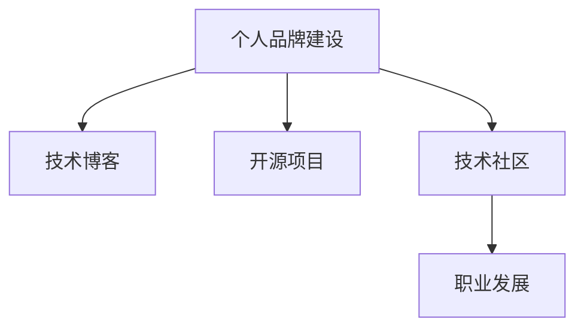

                 

# 程序员如何打造个人IP矩阵

> 关键词：个人品牌建设,程序员成长,技术博客,开源项目,技术社区,职业发展

## 1. 背景介绍

在当今快速发展的科技行业中，个人品牌建设对于程序员的职业发展和影响力提升至关重要。一个出色的个人品牌不仅能够帮助程序员在竞争激烈的就业市场中脱颖而出，还能够成为技术社群中的意见领袖，推动技术进步和知识传播。本文将探讨如何通过系统性的个人IP矩阵建设，帮助程序员构建自己的品牌形象，提升个人影响力，实现职业和技术的双发展。

## 2. 核心概念与联系

### 2.1 核心概念概述

为了深入理解个人IP矩阵的构建，我们首先明确几个核心概念：

- **个人品牌建设**：指通过一系列有目的的行为和活动，在目标受众中树立和强化自己的品牌形象和专业声誉。

- **技术博客**：是程序员分享技术心得、展示技术实力、建立技术影响力的主要渠道之一。通过撰写技术文章，程序员可以将知识传播给更广泛的受众，吸引同行关注。

- **开源项目**：指在GitHub等平台上公开的、可以供他人使用的源代码项目。参与开源项目不仅能提升个人编码能力，还能通过贡献代码、修复Bug等方式获得社区认可，增强个人影响力。

- **技术社区**：指程序员交流技术经验、分享知识和经验的在线或线下社群，如Stack Overflow、Reddit、知乎等。积极参与技术社区讨论，可以提高个人在技术社群中的知名度和权威性。

- **职业发展**：包括但不限于晋升、跳槽、创业等，建立稳固的个人品牌可以为职业发展提供更广阔的平台和更多的机会。

这些核心概念之间的关系如下图所示：



### 2.2 核心概念原理和架构的 Mermaid 流程图

个人IP矩阵的构建基于以下几个关键流程：

1. **内容输出**：通过撰写技术博客和开源项目，持续输出高质量的技术内容。
2. **社区互动**：积极参与技术社区讨论，扩大个人影响力。
3. **影响力建设**：利用内容输出和社区互动，逐步树立个人品牌形象。
4. **职业发展**：根据个人品牌效应，寻求职业发展机会。

这些流程可以形成一个闭环，持续推动个人IP的成长和壮大。

## 3. 核心算法原理 & 具体操作步骤

### 3.1 算法原理概述

个人IP矩阵的构建是一个复杂的多目标优化问题，涉及内容质量、社区互动频率、品牌形象维护等多方面的因素。算法原理大致如下：

- **目标函数**：最大化个人品牌价值，包括但不限于技术影响力、社区认可度、职业机会等。
- **约束条件**：
  - **时间资源**：每个人的可用时间有限，需要在内容输出、社区互动等方面进行平衡。
  - **内容质量**：高质量的内容是建立个人品牌的基础，需要持续产出。
  - **社区规则**：每个技术社区都有不同的文化和规则，需要适应和尊重。
  - **职业目标**：职业发展的不同阶段，对个人IP的需求不同，需动态调整策略。

### 3.2 算法步骤详解

#### 3.2.1 内容输出策略

1. **内容定位**：明确自己的技术兴趣和擅长的领域，如Web开发、数据科学、人工智能等。
2. **内容规划**：制定内容发布计划，如每周发布一篇技术文章，每月贡献一个开源项目等。
3. **内容质量**：确保内容具有深度和广度，涵盖技术原理、实践经验、案例分析等。
4. **内容分发**：选择合适的平台进行内容分发，如个人博客、Medium、GitHub等。

#### 3.2.2 社区互动策略

1. **选择社区**：根据自己的技术兴趣和职业目标，选择合适的技术社区，如Stack Overflow、Reddit、知乎等。
2. **积极参与**：参与社区讨论，回答问题，分享经验，提供帮助。
3. **建立人脉**：通过社区互动，结识同行，建立技术人脉网络。
4. **保持活跃**：定期参与社区活动，如技术讲座、在线讨论等。

#### 3.2.3 影响力建设策略

1. **提升可见性**：通过社交媒体（如LinkedIn、Twitter）分享技术内容，提高个人品牌曝光率。
2. **建立个人网站**：创建个人技术博客或网站，集中展示个人技术成就和文章。
3. **参与演讲和培训**：参加技术会议、讲座、在线培训等，提升个人知名度。
4. **编写技术书籍**：根据自己的技术专长，撰写技术书籍或手册，进一步提升个人品牌影响力。

#### 3.2.4 职业发展策略

1. **简历优化**：在简历中突出技术博客、开源项目、社区贡献等，吸引潜在雇主。
2. **求职应聘**：根据个人品牌效应，寻找更匹配的职业机会。
3. **创业机遇**：利用个人品牌吸引投资和技术合作，探索创业机会。

### 3.3 算法优缺点

**优点**：

- **多渠道曝光**：通过博客、开源项目、社区互动等多种渠道，扩大个人品牌影响力。
- **持续性增长**：内容输出和社区互动是持续的过程，可以不断积累个人品牌价值。
- **协同效应**：内容输出和社区互动可以相互促进，形成正反馈循环。

**缺点**：

- **时间成本**：需要投入大量时间进行内容创作和社区互动，影响其他工作。
- **资源限制**：高质量内容产出和社区活跃度需要较高的时间和精力投入。
- **竞争激烈**：技术领域竞争激烈，个人品牌建设需要持续努力和创新。

### 3.4 算法应用领域

个人IP矩阵的构建适用于多种场景，如：

- **职业转型**：通过技术博客和开源项目展示技术实力，吸引潜在雇主。
- **技术创业**：利用个人品牌吸引投资和技术合作，推动技术创新。
- **学术研究**：通过开源项目和社区互动，分享研究成果，推动学术交流。
- **个人学习**：通过参与开源项目和社区讨论，提升自身技术水平。

## 4. 数学模型和公式 & 详细讲解

### 4.1 数学模型构建

个人品牌价值（$V$）可以通过以下模型进行量化：

$$
V = \alpha \times C + \beta \times I + \gamma \times O
$$

其中：

- $C$：内容输出得分，包括博客文章的阅读量、评论量、引用量等。
- $I$：社区互动得分，包括技术社区的参与度、贡献度、社交媒体的关注量等。
- $O$：职业发展得分，包括求职成功率、职业晋升速度、创业项目成功等。
- $\alpha$、$\beta$、$\gamma$：权重系数，反映了不同因素对个人品牌价值的影响程度。

### 4.2 公式推导过程

个人品牌价值的计算可以分解为以下几个步骤：

1. **数据收集**：从博客平台、开源项目、技术社区、社交媒体等渠道收集数据。
2. **指标计算**：对各项指标进行量化，如文章阅读量为100，评论量为10等。
3. **加权求和**：将各项指标加权求和，得到个人品牌价值。

### 4.3 案例分析与讲解

以一名Web开发者为例，其个人品牌价值计算如下：

- **内容输出**：每月发布3篇技术文章，每篇阅读量5000，评论量100，引用量10。
- **社区互动**：每周在Stack Overflow上回答问题5次，每次回复质量高，获得15个点赞。
- **职业发展**：求职成功率提升30%，获得一家知名公司的技术职位，年薪提升20%。

根据上述数据，计算得到个人品牌价值：

$$
V = \alpha \times (3 \times 5000 + 3 \times 100 + 3 \times 10) + \beta \times (5 \times 15) + \gamma \times (1 + 20\%)
$$

假设权重系数分别为$\alpha = 0.4$，$\beta = 0.3$，$\gamma = 0.3$，则：

$$
V = 0.4 \times (15000 + 300 + 30) + 0.3 \times 75 + 0.3 \times 1.2 = 7410
$$

即个人品牌价值为7410分。

## 5. 项目实践：代码实例和详细解释说明

### 5.1 开发环境搭建

#### 5.1.1 环境配置

1. **Python环境**：
   - 安装Python 3.x，建议使用虚拟环境（如virtualenv）。
   - 安装必要的依赖包，如Jupyter Notebook、Flask等。

2. **GitHub账号**：
   - 创建GitHub账号，托管开源项目。
   - 配置GitHub Pages，搭建个人博客网站。

3. **技术社区账号**：
   - 注册Stack Overflow、Reddit、知乎等技术社区账号，积极参与讨论。
   - 利用社区功能，记录技术积累和成长轨迹。

### 5.2 源代码详细实现

#### 5.2.1 博客平台搭建

1. **选择博客平台**：使用GitHub Pages、WordPress等博客平台，搭建个人技术博客。
2. **发布内容**：撰写技术文章，使用Markdown语法，并上传至博客平台。
3. **互动功能**：启用评论、分享、订阅等功能，提高文章曝光率。

#### 5.2.2 开源项目贡献

1. **选择开源项目**：寻找感兴趣的GitHub开源项目，关注项目动向。
2. **代码贡献**：根据项目需求，撰写代码、修复Bug、优化功能等。
3. **提交Pull Request**：通过Git提交代码，并发起Pull Request，等待项目维护者审核。

#### 5.2.3 社区互动

1. **选择社区**：根据技术兴趣，选择合适的技术社区，如Stack Overflow、Reddit、知乎等。
2. **回答问题**：积极回答社区问题，提供技术支持。
3. **参与讨论**：参与社区讨论，分享技术见解，提出改进建议。

### 5.3 代码解读与分析

以GitHub Pages搭建博客平台为例，代码如下：

```python
# 安装必要的依赖包
!pip install Flask Markdown Flask-Blogify

# 创建Flask应用
from flask import Flask, render_template
from flask_blogify import FlaskBlogify

app = Flask(__name__)
blogify = FlaskBlogify(app)

# 静态文件路径
app.static_folder = 'static'
app.send_static_file('index.html')

# 运行应用
if __name__ == '__main__':
    app.run(debug=True)
```

上述代码使用了Flask框架和Flask-Blogify插件，可以快速搭建一个功能丰富的博客平台。开发者可以根据自己的需求，进一步扩展博客功能，如文章分类、标签、搜索等。

## 6. 实际应用场景

### 6.1 技术博客应用

技术博客是程序员展示技术实力的重要平台，通过定期发布高质量的技术文章，可以吸引同行关注，提升个人品牌影响力。例如，一名Java开发者可以通过博客分享编程心得、技术经验、项目案例等，逐步成为Java领域的知名技术专家。

### 6.2 开源项目贡献

开源项目不仅能提升个人编码能力，还能通过贡献代码、修复Bug等方式获得社区认可，增强个人影响力。例如，一名前端开发者可以通过参与开源UI框架项目，积累实战经验，展示技术实力，吸引潜在雇主。

### 6.3 技术社区互动

积极参与技术社区讨论，可以提高个人在技术社群中的知名度和权威性。例如，一名AI开发者可以在Reddit的r/MachineLearning社区积极回答问题，分享研究成果，逐步成为该领域的活跃用户和意见领袖。

### 6.4 未来应用展望

未来，随着技术社区和社交媒体的进一步发展，个人IP矩阵的构建将更加灵活多样。例如，通过视频平台（如YouTube、Bilibili）分享技术讲解和编程过程，可以进一步提升个人品牌曝光度和互动性。同时，虚拟现实（VR）、增强现实（AR）等新技术的引入，也将为个人IP矩阵的构建提供新的手段和渠道。

## 7. 工具和资源推荐

### 7.1 学习资源推荐

1. **GitHub Learning Lab**：GitHub提供的免费在线课程，涵盖Git、GitHub Pages、GitHub Actions等技术。
2. **Flask官方文档**：Flask框架的官方文档，提供详细的安装和使用方法。
3. **Markdown教程**：Markdown格式教程，帮助开发者快速上手技术写作。
4. **Jupyter Notebook教程**：Jupyter Notebook的使用教程，适合数据科学和机器学习开发。

### 7.2 开发工具推荐

1. **GitHub**：开源项目的托管平台，提供版本控制、协作开发等功能。
2. **Jupyter Notebook**：交互式编程环境，适合数据科学和机器学习开发。
3. **Flask**：轻量级Web框架，适合搭建技术博客和Web应用。
4. **Markdown编辑器**：如Typora、Sublime Text等，支持Markdown语法，方便技术文章撰写。

### 7.3 相关论文推荐

1. **The Surprising Progress of Machine Learning**：Andrew Ng教授的论文，介绍了机器学习的发展历程和技术进展。
2. **Deep Learning with Python**：François Chollet编写的深度学习教材，涵盖TensorFlow、Keras等工具的使用。
3. **Python Cookbook**：Eric Matthes编写的Python编程手册，提供了大量实用的编程技巧和代码示例。

## 8. 总结：未来发展趋势与挑战

### 8.1 研究成果总结

本文系统探讨了程序员如何通过构建个人IP矩阵，提升技术影响力，推动职业发展。通过技术博客、开源项目、技术社区等多渠道互动，程序员可以有效展示自身技术实力，建立稳固的个人品牌。

### 8.2 未来发展趋势

未来，个人IP矩阵的构建将更加多样化，涵盖视频、VR/AR等新兴技术。同时，随着技术社区和社交媒体的进一步发展，程序员可以通过更多渠道展示技术实力，提升个人影响力。

### 8.3 面临的挑战

尽管个人IP矩阵的构建带来了诸多好处，但也面临一些挑战：

1. **时间管理**：需要平衡技术输出和日常工作，提高时间管理能力。
2. **内容质量**：高质量的内容产出需要大量时间和精力，需持续努力。
3. **社区规则**：不同社区有不同的文化和规则，需尊重和适应。
4. **职业目标**：个人品牌建设需根据职业目标动态调整策略。

### 8.4 研究展望

未来研究可以从以下几个方向展开：

1. **内容自动化**：利用自然语言生成技术，自动生成技术文章和代码示例，提高内容输出效率。
2. **社区智能匹配**：通过智能算法，匹配程序员与技术社区，提升社区互动效果。
3. **虚拟形象构建**：利用虚拟现实技术，构建程序员虚拟形象，增强品牌互动性。
4. **跨领域融合**：将技术博客与视频、音频等多种形式融合，提升个人品牌影响力。

## 9. 附录：常见问题与解答

**Q1: 个人IP矩阵建设需要投入大量时间，如何平衡工作和输出？**

A: 合理规划时间，提高时间管理能力。可以制定详细的时间计划，确保每天有固定时间用于内容输出和社区互动。同时，利用工具和技术手段，如GitHub Actions自动化发布文章，提升效率。

**Q2: 如何保证内容质量？**

A: 坚持高质量输出，不断学习和提升自身技术水平。可以通过阅读专业书籍、参加技术讲座、参与开源项目等方式，积累知识和经验，提升内容质量。

**Q3: 社区互动时需要注意什么？**

A: 尊重社区规则，积极参与讨论，提供有价值的内容和建议。避免恶意评论和不当行为，维护良好的社区氛围。

**Q4: 职业目标如何动态调整？**

A: 定期评估个人品牌价值，根据职业目标和市场需求，动态调整内容输出和社区互动策略。可以参加更多的技术培训和职业发展课程，提升自身竞争力。

作者：禅与计算机程序设计艺术 / Zen and the Art of Computer Programming

